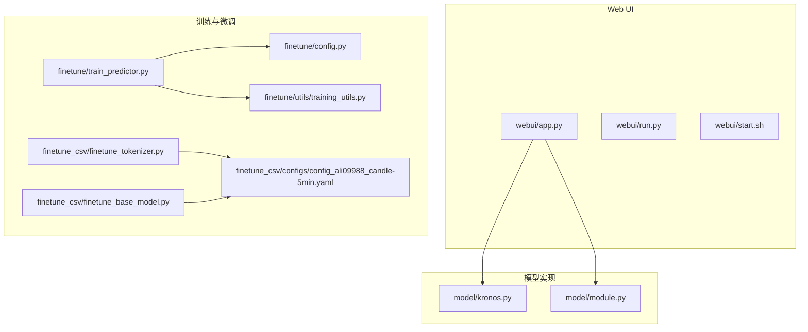
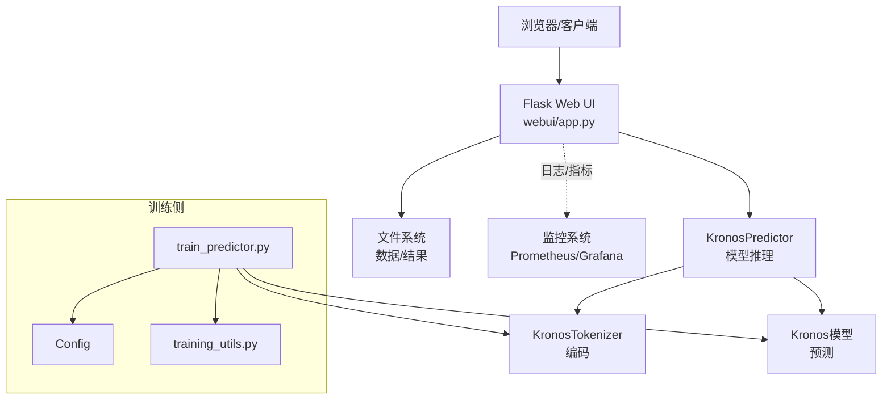
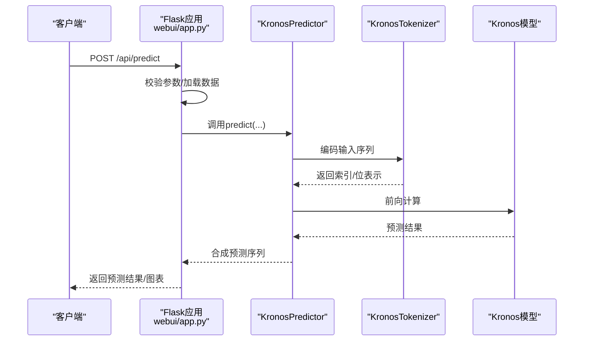
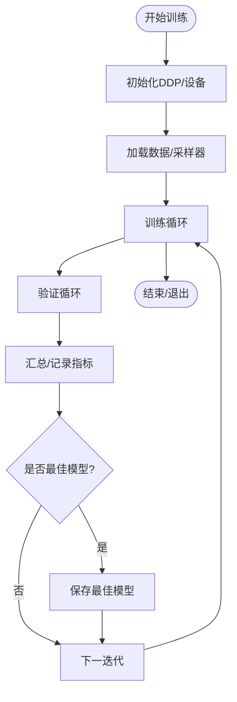
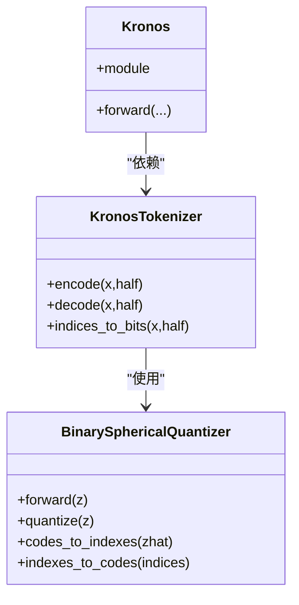
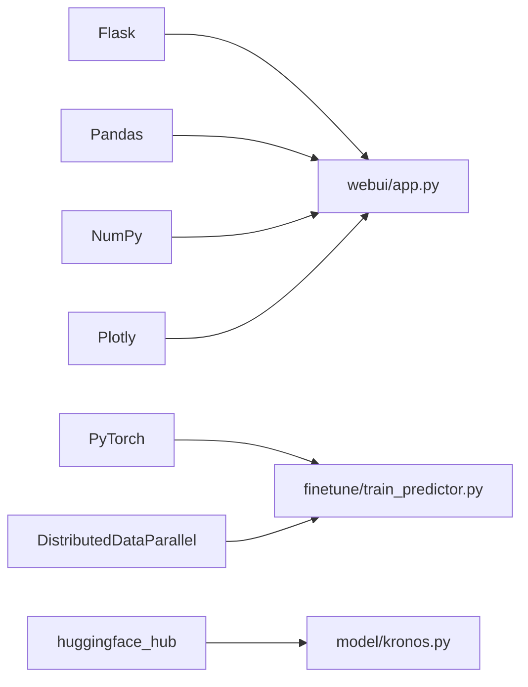

# 监控和告警

<cite>
**本文引用的文件**
- [README.md](file://README.md)
- [requirements.txt](file://requirements.txt)
- [webui/app.py](file://webui/app.py)
- [webui/run.py](file://webui/run.py)
- [webui/start.sh](file://webui/start.sh)
- [webui/README.md](file://webui/README.md)
- [finetune/config.py](file://finetune/config.py)
- [finetune/train_predictor.py](file://finetune/train_predictor.py)
- [finetune/utils/training_utils.py](file://finetune/utils/training_utils.py)
- [finetune_csv/configs/config_ali09988_candle-5min.yaml](file://finetune_csv/configs/config_ali09988_candle-5min.yaml)
- [finetune_csv/README.md](file://finetune_csv/README.md)
- [finetune_csv/finetune_tokenizer.py](file://finetune_csv/finetune_tokenizer.py)
- [finetune_csv/finetune_base_model.py](file://finetune_csv/finetune_base_model.py)
- [model/kronos.py](file://model/kronos.py)
- [model/module.py](file://model/module.py)
</cite>

## 目录
1. [简介](#简介)
2. [项目结构](#项目结构)
3. [核心组件](#核心组件)
4. [架构总览](#架构总览)
5. [详细组件分析](#详细组件分析)
6. [依赖分析](#依赖分析)
7. [性能考虑](#性能考虑)
8. [故障排查指南](#故障排查指南)
9. [结论](#结论)
10. [附录](#附录)

## 简介
本指南面向Kronos系统在生产环境中的监控与告警落地，围绕关键性能指标（CPU使用率、内存占用、GPU利用率、请求延迟）、业务指标（预测准确率、数据质量、服务可用性）以及运维自动化展开。结合现有Web UI与训练脚本，给出Prometheus/Grafana集成思路、告警规则建议、日志策略、健康检查与故障自愈建议，并提供容量规划与性能基线建立方法。

## 项目结构
Kronos项目包含Web UI、训练流水线、模型实现与配置等模块。Web UI提供预测服务入口；训练模块支持多GPU分布式训练；模型模块包含分词器与预测模型；配置文件涵盖训练超参与路径。

图表来源
- [webui/app.py:1-709](file://webui/app.py#L1-L709)
- [webui/run.py:1-90](file://webui/run.py#L1-L90)
- [webui/start.sh:1-41](file://webui/start.sh#L1-L41)
- [finetune/config.py:1-132](file://finetune/config.py#L1-L132)
- [finetune/train_predictor.py:1-245](file://finetune/train_predictor.py#L1-L245)
- [finetune/utils/training_utils.py:1-119](file://finetune/utils/training_utils.py#L1-L119)
- [finetune_csv/configs/config_ali09988_candle-5min.yaml:1-73](file://finetune_csv/configs/config_ali09988_candle-5min.yaml#L1-L73)
- [finetune_csv/finetune_tokenizer.py:45-90](file://finetune_csv/finetune_tokenizer.py#L45-L90)
- [finetune_csv/finetune_base_model.py:137-178](file://finetune_csv/finetune_base_model.py#L137-L178)
- [model/kronos.py:1-200](file://model/kronos.py#L1-L200)
- [model/module.py:1-200](file://model/module.py#L1-L200)

章节来源
- [README.md:1-338](file://README.md#L1-L338)
- [webui/app.py:1-709](file://webui/app.py#L1-L709)
- [finetune/config.py:1-132](file://finetune/config.py#L1-L132)
- [finetune/train_predictor.py:1-245](file://finetune/train_predictor.py#L1-L245)
- [finetune/utils/training_utils.py:1-119](file://finetune/utils/training_utils.py#L1-L119)
- [finetune_csv/configs/config_ali09988_candle-5min.yaml:1-73](file://finetune_csv/configs/config_ali09988_candle-5min.yaml#L1-L73)
- [model/kronos.py:1-200](file://model/kronos.py#L1-L200)
- [model/module.py:1-200](file://model/module.py#L1-L200)

## 核心组件
- Web UI服务：提供数据加载、模型加载、预测执行与结果可视化，暴露REST接口供前端调用。
- 训练流水线：支持分布式训练、日志记录、断点续训与最佳模型保存。
- 模型实现：包含Kronos分词器与预测模型，支撑Web UI推理与训练阶段的编码/解码与前向计算。
- 配置管理：集中管理训练超参、数据路径、日志与实验信息。

章节来源
- [webui/app.py:330-709](file://webui/app.py#L330-L709)
- [finetune/train_predictor.py:60-179](file://finetune/train_predictor.py#L60-L179)
- [finetune/utils/training_utils.py:62-81](file://finetune/utils/training_utils.py#L62-L81)
- [model/kronos.py:13-178](file://model/kronos.py#L13-L178)

## 架构总览
下图展示从客户端到Web UI、模型与训练组件的整体交互路径，以及可扩展的监控与告警接入点。

图表来源
- [webui/app.py:404-624](file://webui/app.py#L404-L624)
- [finetune/train_predictor.py:182-236](file://finetune/train_predictor.py#L182-L236)
- [finetune/config.py:1-132](file://finetune/config.py#L1-L132)
- [finetune/utils/training_utils.py:9-32](file://finetune/utils/training_utils.py#L9-L32)
- [model/kronos.py:13-178](file://model/kronos.py#L13-L178)

## 详细组件分析

### Web UI监控与告警要点
- 接口级指标采集
  - 请求总量、成功率、错误率、响应时间（P50/P90/P95）、并发连接数。
  - 关键端点：/api/load-data、/api/predict、/api/load-model、/api/model-status。
- 进程级资源监控
  - CPU使用率、内存占用、网络带宽、磁盘IO。
  - GPU利用率（如部署在GPU节点）。
- 业务指标
  - 预测准确率（可基于对比实际值计算）、数据质量（缺失率、异常值比例）、服务可用性（99.9%以上）。
- 日志与追踪
  - 控制台日志、访问日志、错误栈追踪、请求链路追踪（可选OpenTelemetry）。
- 健康检查与自愈
  - 健康探针：/api/model-status；失败时触发重启或切换实例。
  - 自动化运维：容器编排（Kubernetes）+HPA/LPA，异常自动扩缩容。

图表来源
- [webui/app.py:404-624](file://webui/app.py#L404-L624)
- [model/kronos.py:142-178](file://model/kronos.py#L142-L178)

章节来源
- [webui/app.py:404-624](file://webui/app.py#L404-L624)
- [webui/README.md:111-136](file://webui/README.md#L111-L136)

### 训练组件监控与告警要点
- 训练指标
  - 训练/验证损失、学习率、梯度范数、每步耗时、每轮耗时。
- 分布式训练可观测性
  - 进程组初始化、各rank日志聚合、全局指标同步、断点恢复。
- 日志与归档
  - 控制台与文件日志、滚动备份、关键事件标记（最佳模型保存）。
- 健康检查与自愈
  - 训练中断检测、自动重试、超时告警、资源不足预警。

图表来源
- [finetune/train_predictor.py:60-179](file://finetune/train_predictor.py#L60-L179)
- [finetune/utils/training_utils.py:9-32](file://finetune/utils/training_utils.py#L9-L32)

章节来源
- [finetune/train_predictor.py:60-179](file://finetune/train_predictor.py#L60-L179)
- [finetune/utils/training_utils.py:9-32](file://finetune/utils/training_utils.py#L9-L32)
- [finetune_csv/finetune_tokenizer.py:45-90](file://finetune_csv/finetune_tokenizer.py#L45-L90)
- [finetune_csv/finetune_base_model.py:137-178](file://finetune_csv/finetune_base_model.py#L137-L178)

### 模型与量化组件监控要点
- 量化指标
  - 量化熵、码本使用率、索引分布、重建误差。
- 性能影响
  - 编码/解码耗时、显存占用、吞吐量。
- 健康检查
  - 量化器异常、维度不匹配、索引越界等。

图表来源
- [model/module.py:39-200](file://model/module.py#L39-L200)
- [model/kronos.py:13-178](file://model/kronos.py#L13-L178)

章节来源
- [model/module.py:39-200](file://model/module.py#L39-L200)
- [model/kronos.py:13-178](file://model/kronos.py#L13-L178)

## 依赖分析
- Web UI依赖Flask、CORS、Pandas、NumPy、Plotly等，运行于Python环境。
- 训练依赖PyTorch、DDP、Comet ML（可选），支持多GPU分布式训练。
- 模型依赖HuggingFace Hub mixin以支持模型仓库托管与加载。

图表来源
- [requirements.txt:1-11](file://requirements.txt#L1-L11)
- [webui/app.py:1-25](file://webui/app.py#L1-L25)
- [finetune/train_predictor.py:1-26](file://finetune/train_predictor.py#L1-L26)
- [model/kronos.py:1-10](file://model/kronos.py#L1-L10)

章节来源
- [requirements.txt:1-11](file://requirements.txt#L1-L11)
- [webui/app.py:1-25](file://webui/app.py#L1-L25)
- [finetune/train_predictor.py:1-26](file://finetune/train_predictor.py#L1-L26)
- [model/kronos.py:1-10](file://model/kronos.py#L1-L10)

## 性能考虑
- 推理性能
  - 使用合适的max_context与batch大小；启用半精度（若硬件支持）；合理选择采样参数（温度、top_p、样本数）。
  - 对于批量预测，利用GPU并行与批内并行提升吞吐。
- 训练性能
  - 多GPU分布式训练，梯度裁剪与学习率调度；日志间隔与评估频率平衡。
- 资源基线
  - 建立不同模型规模（mini/small/base）在CPU/GPU下的基准耗时与内存占用曲线，作为容量规划依据。
- 趋势分析
  - 历史指标趋势（CPU/内存/GPU利用率、请求延迟、错误率）用于识别异常与容量瓶颈。

## 故障排查指南
- Web UI常见问题
  - 端口占用：修改启动端口或释放端口。
  - 依赖缺失：按提示安装requirements.txt。
  - 模型加载失败：检查网络连通与模型ID。
  - 数据格式错误：确保列名与时间戳格式正确。
- 训练常见问题
  - DDP初始化失败：确认torchrun环境变量与后端设置。
  - 显存不足：降低batch size或使用梯度累积。
  - 日志未输出：检查日志目录权限与滚动配置。
- 健康检查
  - /api/model-status返回“未加载”或“不可用”时，优先检查模型导入与设备状态。

章节来源
- [webui/README.md:111-136](file://webui/README.md#L111-L136)
- [webui/app.py:673-698](file://webui/app.py#L673-L698)
- [finetune/utils/training_utils.py:9-32](file://finetune/utils/training_utils.py#L9-L32)

## 结论
通过在Web UI与训练脚本中引入标准化的监控与告警体系，结合业务指标与容量规划，可显著提升Kronos系统的稳定性与可运维性。建议优先落地接口级指标与进程级资源监控，逐步扩展到业务指标与自动化运维。

## 附录

### Prometheus集成与Grafana仪表板建议
- 指标导出
  - Web UI：暴露HTTP指标（如prometheus_client或flask_exporter），采集请求耗时、错误率、并发。
  - 训练：在训练脚本中记录关键指标（训练/验证损失、学习率、耗时），写入本地文本或远程日志系统，由Prometheus抓取。
- Grafana仪表板
  - 面板1：接口SLA（成功率、P50/P90/P95、错误率）
  - 面板2：资源使用（CPU、内存、GPU、磁盘）
  - 面板3：业务指标（预测准确率、数据质量、服务可用性）
  - 面板4：训练指标（损失、学习率、吞吐）

### 告警规则建议
- 接口告警
  - 错误率>阈值（如5分钟内>1%）
  - P95延迟>阈值（如>2s）
  - 并发连接数异常升高
- 资源告警
  - CPU使用率持续>90%
  - 内存占用>阈值
  - GPU利用率异常（长时间>95%）
- 业务告警
  - 预测准确率下降（如连续3次低于基线）
  - 数据质量异常（缺失率/异常值比例上升）

### 日志记录策略
- Web UI：统一输出到stdout/stderr，配合容器日志收集；对敏感信息脱敏。
- 训练：控制台实时输出+文件滚动日志；关键事件（最佳模型保存）打标签便于检索。

### 健康检查与故障自愈
- 健康探针：/api/model-status；失败则触发重启或摘除实例。
- 自动化：Kubernetes HPA/LPA根据CPU/内存/GPU利用率动态扩缩容；失败自动拉起。

### 容量规划与性能基线
- 基线建立：在不同模型规模与硬件配置下测量吞吐、延迟、显存占用，形成基线曲线。
- 趋势分析：按日/周/月统计指标趋势，识别增长与异常波动，指导扩容与优化。