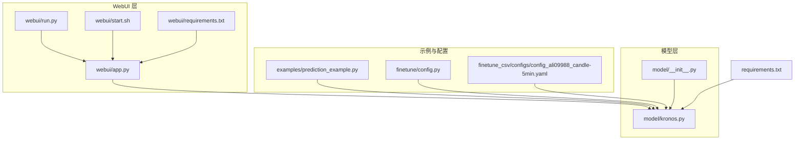
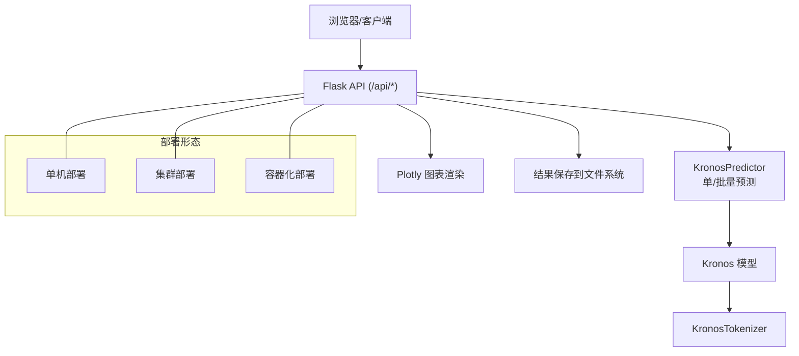
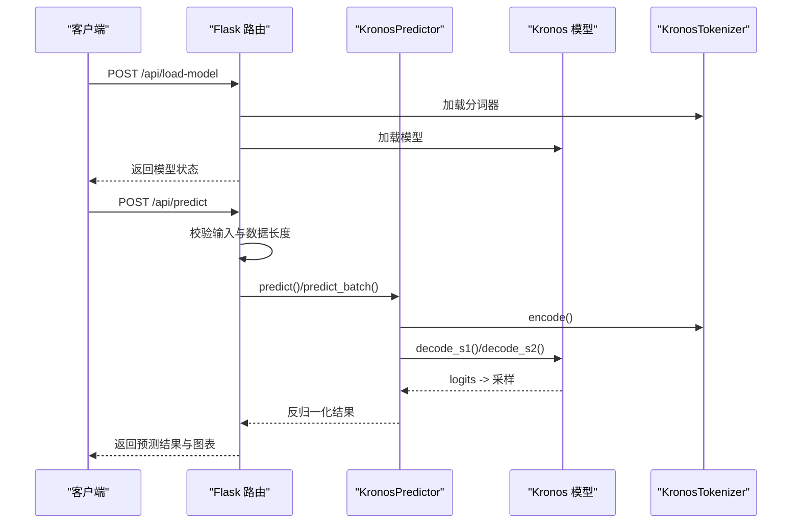
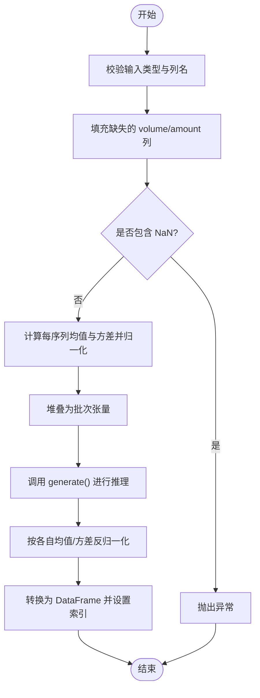
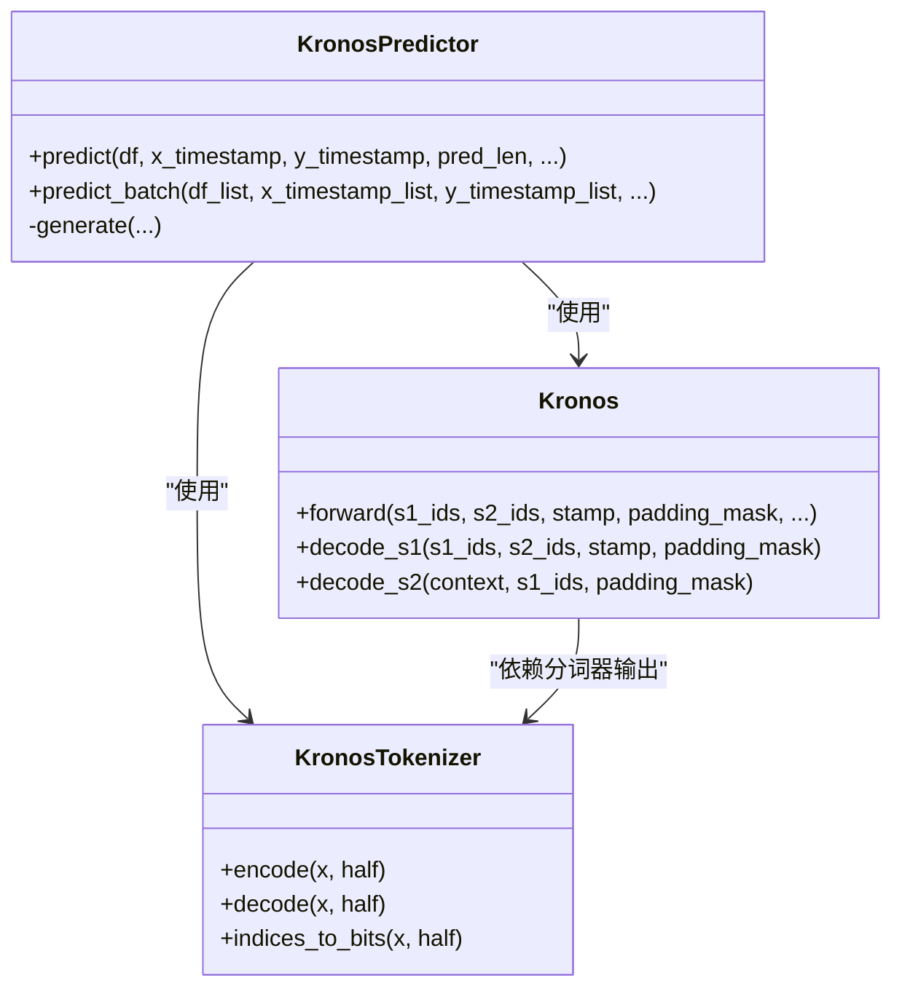
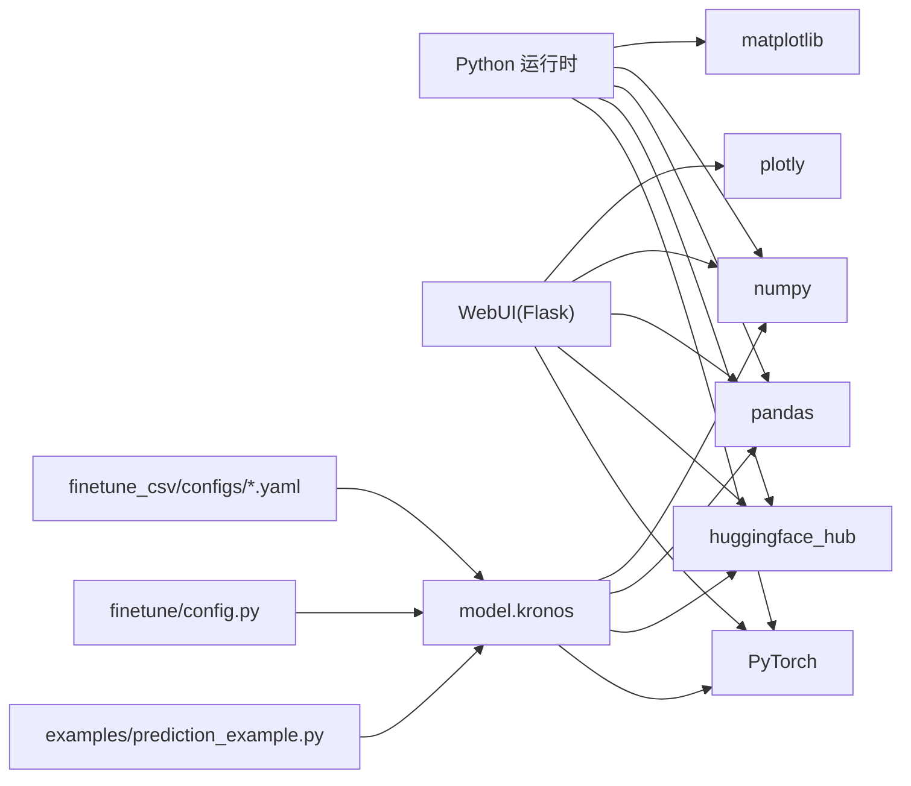

# 部署和生产环境

<cite>
**本文引用的文件**   
- [README.md](file://README.md)
- [requirements.txt](file://requirements.txt)
- [webui/app.py](file://webui/app.py)
- [webui/run.py](file://webui/run.py)
- [webui/start.sh](file://webui/start.sh)
- [webui/requirements.txt](file://webui/requirements.txt)
- [model/__init__.py](file://model/__init__.py)
- [model/kronos.py](file://model/kronos.py)
- [examples/prediction_example.py](file://examples/prediction_example.py)
- [finetune/config.py](file://finetune/config.py)
- [finetune_csv/configs/config_ali09988_candle-5min.yaml](file://finetune_csv/configs/config_ali09988_candle-5min.yaml)
</cite>

## 目录
1. [简介](#简介)
2. [项目结构](#项目结构)
3. [核心组件](#核心组件)
4. [架构总览](#架构总览)
5. [详细组件分析](#详细组件分析)
6. [依赖分析](#依赖分析)
7. [性能考虑](#性能考虑)
8. [故障排查指南](#故障排查指南)
9. [结论](#结论)
10. [附录](#附录)

## 简介
本指南面向在生产环境中部署 Kronos 的工程团队，覆盖单机部署、集群部署与容器化部署三类场景，并提供 Docker 镜像构建思路、Kubernetes 部署配置要点与云平台部署建议。同时，文档深入解析性能优化策略（模型量化、批处理优化、缓存机制）、监控与日志最佳实践（指标采集、错误追踪、容量规划）、安全配置（API 访问控制、数据加密、网络安全），以及故障恢复、备份与运维工具推荐。

## 项目结构
Kronos 仓库包含以下与部署密切相关的模块：
- 模型层：Kronos 预测器与模型实现，负责推理与批量预测。
- WebUI 层：基于 Flask 的可视化与 API 服务，提供模型加载、数据上传与预测结果展示。
- 示例与脚本：演示如何加载模型、准备输入数据并进行预测。
- 微调配置：提供训练超参、路径与设备配置，便于生产环境迁移与参数化。

**图表来源**
- [model/__init__.py:1-18](file://model/__init__.py#L1-L18)
- [model/kronos.py:1-663](file://model/kronos.py#L1-L663)
- [webui/app.py:1-709](file://webui/app.py#L1-L709)
- [webui/run.py:1-90](file://webui/run.py#L1-L90)
- [webui/start.sh:1-41](file://webui/start.sh#L1-L41)
- [webui/requirements.txt:1-8](file://webui/requirements.txt#L1-L8)
- [examples/prediction_example.py:1-81](file://examples/prediction_example.py#L1-L81)
- [finetune/config.py:1-132](file://finetune/config.py#L1-L132)
- [finetune_csv/configs/config_ali09988_candle-5min.yaml:1-73](file://finetune_csv/configs/config_ali09988_candle-5min.yaml#L1-L73)
- [requirements.txt:1-11](file://requirements.txt#L1-L11)

**章节来源**
- [README.md:1-338](file://README.md#L1-L338)
- [requirements.txt:1-11](file://requirements.txt#L1-L11)

## 核心组件
- 模型与预测器
  - KronosTokenizer：对多维 K 线数据进行分层离散化编码，支持半量化的快速解码路径。
  - Kronos：基于 Transformer 的自回归解码模型，输出两阶段离散标记 logits，支持时间嵌入与依赖感知层。
  - KronosPredictor：封装预处理、归一化、采样与反归一化流程，提供单序列与批量预测接口。
- WebUI 服务
  - 提供模型加载、数据文件上传与时间窗口选择、预测执行与可视化图表生成。
  - 支持跨域访问与本地开发启动脚本。

**章节来源**
- [model/kronos.py:13-178](file://model/kronos.py#L13-L178)
- [model/kronos.py:180-329](file://model/kronos.py#L180-L329)
- [model/kronos.py:482-663](file://model/kronos.py#L482-L663)
- [webui/app.py:1-709](file://webui/app.py#L1-L709)

## 架构总览
下图展示了从客户端到模型推理与可视化的端到端流程，以及可扩展的部署形态（单机、集群、容器化）。

**图表来源**
- [webui/app.py:404-625](file://webui/app.py#L404-L625)
- [model/kronos.py:482-663](file://model/kronos.py#L482-L663)
- [model/kronos.py:13-178](file://model/kronos.py#L13-L178)

## 详细组件分析

### 组件A：WebUI API 流程
该流程描述了从请求到响应的关键步骤，包括数据校验、模型加载、预测执行与结果返回。

**图表来源**
- [webui/app.py:404-625](file://webui/app.py#L404-L625)
- [model/kronos.py:482-663](file://model/kronos.py#L482-L663)
- [model/kronos.py:13-178](file://model/kronos.py#L13-L178)

**章节来源**
- [webui/app.py:404-625](file://webui/app.py#L404-L625)
- [model/kronos.py:482-663](file://model/kronos.py#L482-L663)

### 组件B：KronosPredictor 批量预测逻辑
批量预测要求所有序列具有相同的“历史长度”和“预测长度”，并在内部进行独立归一化与平均聚合。

**图表来源**
- [model/kronos.py:562-661](file://model/kronos.py#L562-L661)

**章节来源**
- [model/kronos.py:562-661](file://model/kronos.py#L562-L661)

### 组件C：模型与分词器类关系
Kronos 采用分层离散化与双阶段解码，结合时间嵌入与依赖感知层，形成完整的预测闭环。

**图表来源**
- [model/kronos.py:13-178](file://model/kronos.py#L13-L178)
- [model/kronos.py:180-329](file://model/kronos.py#L180-L329)
- [model/kronos.py:482-663](file://model/kronos.py#L482-L663)

**章节来源**
- [model/kronos.py:13-178](file://model/kronos.py#L13-L178)
- [model/kronos.py:180-329](file://model/kronos.py#L180-L329)
- [model/kronos.py:482-663](file://model/kronos.py#L482-L663)

### 组件D：示例脚本与数据准备
示例脚本展示了如何加载模型、准备输入数据并进行预测，便于在生产中复用。

**章节来源**
- [examples/prediction_example.py:1-81](file://examples/prediction_example.py#L1-L81)

## 依赖分析
- 运行时依赖
  - Python 3.10+，PyTorch ≥ 2.0，Hugging Face Hub 客户端，绘图与数据处理库等。
- WebUI 依赖
  - Flask、Flask-CORS、Pandas、NumPy、Plotly、PyTorch、Hugging Face Hub。
- 模块间耦合
  - WebUI 通过 model 包导出的类直接调用模型与预测器；示例脚本同样依赖 model 包。
  - 配置文件（Python 与 YAML）为训练/微调提供参数来源，生产部署可将其映射为环境变量或配置中心。

**图表来源**
- [requirements.txt:1-11](file://requirements.txt#L1-L11)
- [webui/requirements.txt:1-8](file://webui/requirements.txt#L1-L8)
- [model/kronos.py:1-11](file://model/kronos.py#L1-L11)
- [examples/prediction_example.py:1-5](file://examples/prediction_example.py#L1-L5)
- [finetune/config.py:1-132](file://finetune/config.py#L1-L132)
- [finetune_csv/configs/config_ali09988_candle-5min.yaml:1-73](file://finetune_csv/configs/config_ali09988_candle-5min.yaml#L1-L73)

**章节来源**
- [requirements.txt:1-11](file://requirements.txt#L1-L11)
- [webui/requirements.txt:1-8](file://webui/requirements.txt#L1-L8)
- [model/kronos.py:1-11](file://model/kronos.py#L1-L11)

## 性能考虑
- 模型量化
  - 分词器采用二进制球面量化（BSQuantizer），将连续特征压缩为离散位表示，降低存储与通信开销。可在推理前启用半量化路径以加速解码。
  - 建议在部署前评估不同 s1/s2 位宽对精度与吞吐的影响，并结合硬件能力选择最优配置。
- 批处理优化
  - 使用 predict_batch 对多个时间序列并行推理，要求各序列的历史长度与预测长度一致。内部对每个序列独立归一化，避免跨序列干扰。
  - 合理设置 sample_count 与 top_k/top_p，平衡预测质量与延迟。
- 缓存机制
  - 将常用模型权重与分词器缓存至本地磁盘，减少首次加载耗时。
  - 对热点数据（如最近 N 条 K 线）进行内存缓存，缩短预处理时间。
- 设备与并发
  - 自动检测 CUDA/MPS/CPU 并优先使用 GPU；在多 GPU 环境下结合分布式推理框架提升吞吐。
  - Web 服务可配合 Gunicorn/Uvicorn 等 ASGI/WSGI 服务器承载高并发请求。

[本节为通用性能指导，不直接分析具体文件]

## 故障排查指南
- 模型加载失败
  - 确认依赖安装完整，特别是 PyTorch 版本与 CUDA 工具链匹配。
  - 若 Hugging Face Hub 访问受限，配置代理或离线缓存模型文件。
- 数据格式错误
  - 输入 DataFrame 必须包含价格列；体积与金额列可选，缺失时自动填充为零。
  - 时间戳列需可解析为日期时间类型，否则会触发异常。
- 推理异常
  - 当历史长度不足或预测长度超出上下文限制时，会返回明确的错误信息。
  - 若出现 NaN 或异常波动，检查 clip 参数与归一化过程。
- WebUI 启动问题
  - 端口占用或权限不足会导致启动失败；确保端口未被占用且具备相应权限。
  - 依赖缺失时，使用提供的启动脚本或手动安装依赖后重试。

**章节来源**
- [webui/app.py:404-625](file://webui/app.py#L404-L625)
- [webui/run.py:12-87](file://webui/run.py#L12-L87)
- [webui/start.sh:20-41](file://webui/start.sh#L20-L41)
- [model/kronos.py:519-559](file://model/kronos.py#L519-L559)

## 结论
Kronos 在生产环境中的部署应围绕“可扩展、可观测、可恢复”的目标展开。通过合理的模型量化与批处理策略、完善的监控与日志体系、严格的访问控制与网络隔离，以及健全的备份与回滚机制，可显著提升系统的稳定性与可用性。建议优先采用容器化与编排平台（如 Kubernetes）进行标准化交付，并结合配置中心与密钥管理服务实现参数与证书的安全治理。

[本节为总结性内容，不直接分析具体文件]

## 附录

### A. 单机部署
- 环境准备
  - 安装 Python 3.10+ 与依赖：参考根目录与 WebUI 的 requirements 文件。
- 启动方式
  - 使用启动脚本一键安装依赖并启动 Web 服务；或直接运行 Flask 应用。
- 模型加载
  - 通过 API 加载指定模型与分词器，确认上下文长度与参数规模满足业务需求。

**章节来源**
- [requirements.txt:1-11](file://requirements.txt#L1-L11)
- [webui/requirements.txt:1-8](file://webui/requirements.txt#L1-L8)
- [webui/run.py:38-87](file://webui/run.py#L38-L87)
- [webui/start.sh:34-41](file://webui/start.sh#L34-L41)
- [webui/app.py:626-671](file://webui/app.py#L626-L671)

### B. 集群部署
- 负载均衡
  - 使用反向代理（如 Nginx）分发请求至多实例。
- 实例扩展
  - 增加 Web 服务副本数，共享只读模型存储（如 NFS/对象存储）。
- 状态与会话
  - Web 服务无状态化设计，适合水平扩展；若需持久化结果，统一写入共享存储。

[本节为通用部署建议，不直接分析具体文件]

### C. 容器化部署
- 镜像构建建议
  - 基于官方 Python 镜像，安装依赖并复制项目代码。
  - 将模型权重与分词器缓存至镜像层或挂载卷，减少启动时间。
- 运行参数
  - 暴露 Web 服务端口，设置环境变量（如设备选择、日志级别）。
- 健康检查
  - 添加就绪探针与存活探针，确保容器健康后再接收流量。

[本节为通用容器化建议，不直接分析具体文件]

### D. Kubernetes 部署配置要点
- Deployment
  - 设置副本数、资源请求与限制，启用滚动更新。
- Service
  - 暴露服务端口，支持外部访问。
- ConfigMap/Secret
  - 将配置参数与密钥注入容器，避免硬编码。
- 存储
  - 使用 PersistentVolume 挂载预测结果与日志目录。

[本节为通用编排建议，不直接分析具体文件]

### E. 云平台部署方案
- 公有云
  - 使用弹性计算与对象存储，结合 CDN 加速静态资源。
- 多区域
  - 在多个可用区部署，实现跨区域容灾与就近访问。
- 安全组与网络ACL
  - 仅开放必要端口，限制源 IP 与内网访问。

[本节为通用云平台建议，不直接分析具体文件]

### F. 监控与日志最佳实践
- 指标采集
  - 关键指标：请求 QPS、P95/P99 延迟、GPU/CPU 使用率、内存占用、模型加载耗时。
- 错误追踪
  - 记录请求 ID、输入参数摘要、异常栈与上下文信息，便于定位问题。
- 日志分级
  - 区分 INFO/WARN/ERROR，敏感字段脱敏处理。
- 容量规划
  - 基于峰值 QPS 与响应时间估算所需实例数与资源规格。

[本节为通用运维建议，不直接分析具体文件]

### G. 安全配置指南
- API 访问控制
  - 启用鉴权（如 JWT/OAuth）、速率限制与白名单。
- 数据加密
  - 传输层 TLS 与静态数据加密；密钥轮换与最小权限原则。
- 网络安全
  - 内外网隔离、子网划分与防火墙策略；定期漏洞扫描与基线加固。

[本节为通用安全建议，不直接分析具体文件]

### H. 故障恢复与备份
- 备份策略
  - 定期备份模型权重、配置文件与预测结果；验证恢复流程。
- 回滚机制
  - 采用蓝绿/金丝雀发布，快速回滚至稳定版本。
- 灾备演练
  - 定期进行故障演练，评估 RTO/RPO 指标。

[本节为通用运维建议，不直接分析具体文件]

### I. 运维工具推荐
- 配置与密钥
  - Consul/Vault/ASM 等配置中心与密钥管理服务。
- 观测性
  - Prometheus/Grafana/ELK/Zipkin 等监控与日志平台。
- 自动化
  - Terraform/Helm/ArgoCD 等基础设施即代码与 GitOps 工具。

[本节为通用工具建议，不直接分析具体文件]