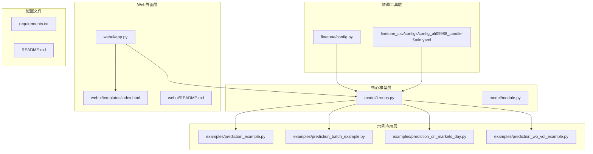
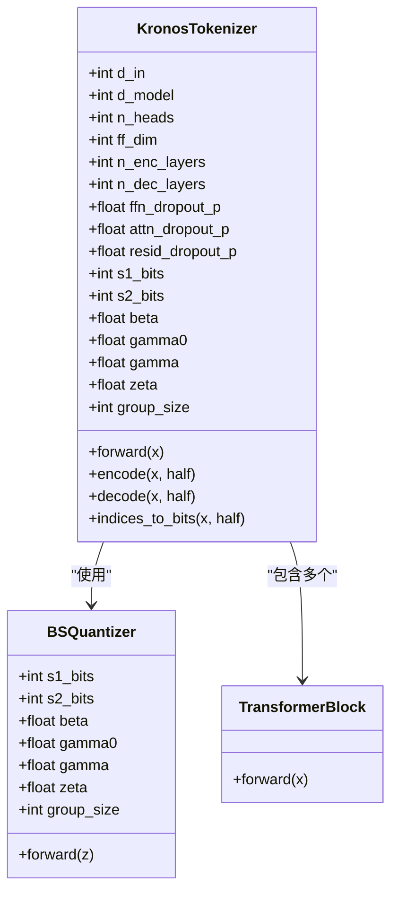
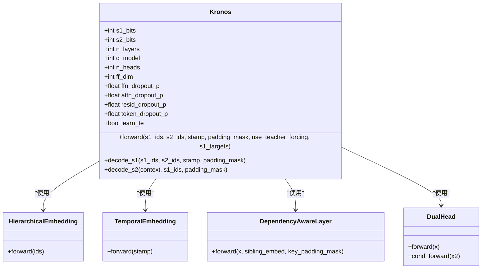
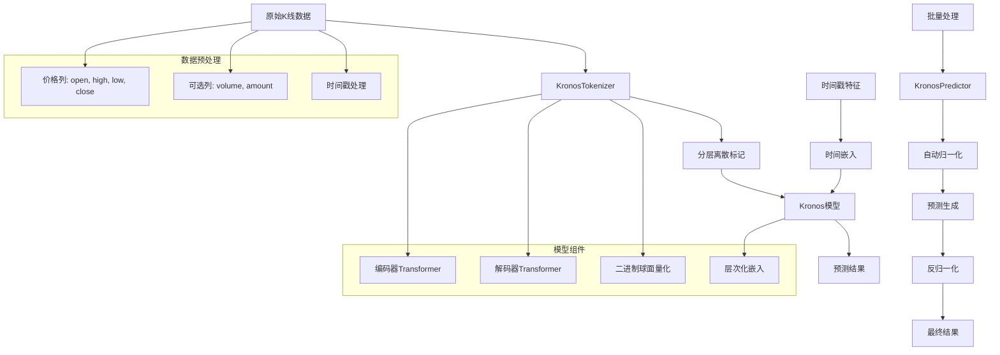
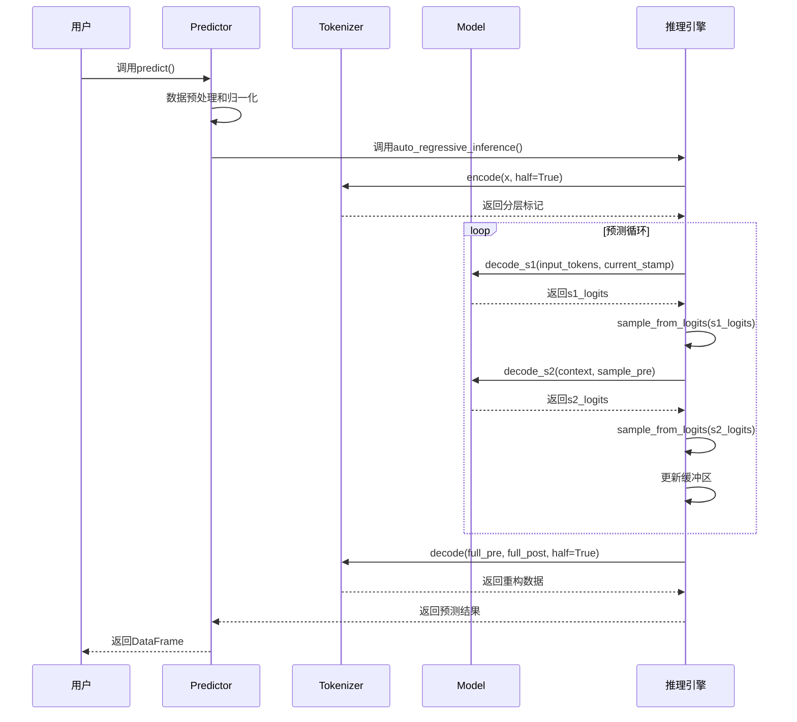
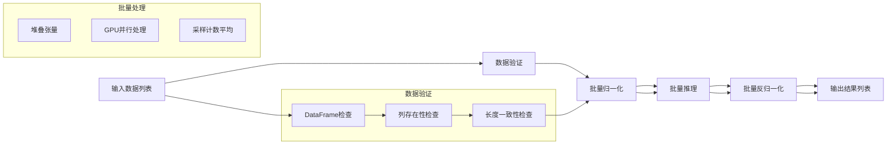
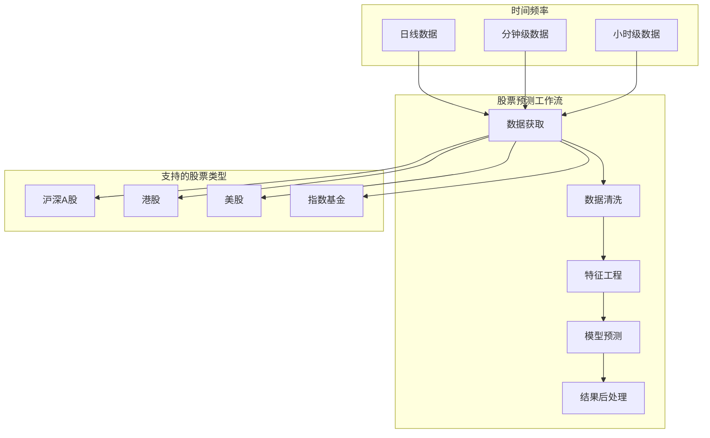
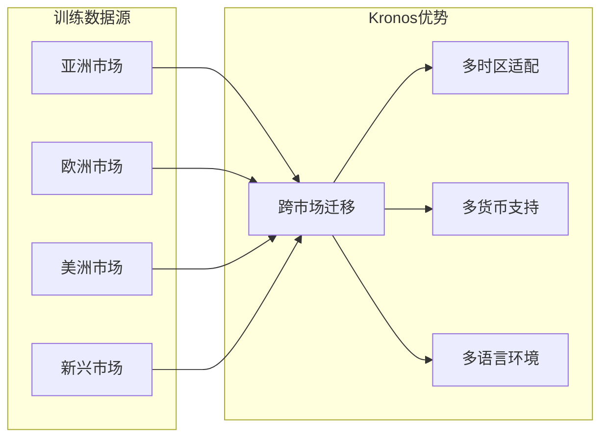

# 应用场景与优势

<cite>
**本文档引用的文件**
- [README.md](file://README.md)
- [model/kronos.py](file://model/kronos.py)
- [examples/prediction_example.py](file://examples/prediction_example.py)
- [examples/prediction_batch_example.py](file://examples/prediction_batch_example.py)
- [examples/prediction_cn_markets_day.py](file://examples/prediction_cn_markets_day.py)
- [examples/prediction_wo_vol_example.py](file://examples/prediction_wo_vol_example.py)
- [webui/app.py](file://webui/app.py)
- [webui/templates/index.html](file://webui/templates/index.html)
- [webui/README.md](file://webui/README.md)
- [finetune/config.py](file://finetune/config.py)
- [finetune_csv/configs/config_ali09988_candle-5min.yaml](file://finetune_csv/configs/config_ali09988_candle-5min.yaml)
- [requirements.txt](file://requirements.txt)
</cite>

## 目录
1. [引言](#引言)
2. [项目结构](#项目结构)
3. [核心组件](#核心组件)
4. [架构概览](#架构概览)
5. [详细组件分析](#详细组件分析)
6. [应用场景分析](#应用场景分析)
7. [优势特性分析](#优势特性分析)
8. [性能考虑](#性能考虑)
9. [故障排除指南](#故障排除指南)
10. [结论](#结论)

## 引言

Kronos是首个开源的金融K线（K线图）基础模型，专为金融市场的"语言"而设计。该项目由NeoQuasar团队开发，基于深度学习技术为金融时间序列预测提供了创新的解决方案。Kronos通过独特的两阶段框架，将连续的多维K线数据量化为分层离散标记，然后使用大型自回归Transformer进行预训练，使其能够服务于多样化的量化任务。

该项目的核心价值在于其专门针对金融市场的高噪声特性而设计，相比通用时序模型具有显著优势。系统支持多种金融资产类型，包括股票、加密货币、外汇和商品期货，并提供了完整的实时演示系统。

## 项目结构

Kronos项目采用模块化设计，主要包含以下核心组件：

**图表来源**
- [model/kronos.py:1-663](file://model/kronos.py#L1-663)
- [webui/app.py:1-709](file://webui/app.py#L1-709)

**章节来源**
- [README.md:1-338](file://README.md#L1-L338)
- [requirements.txt:1-11](file://requirements.txt#L1-L11)

## 核心组件

### KronosTokenizer - 专用分词器

KronosTokenizer是Kronos系统的核心组件之一，采用混合量化方法对输入数据进行处理。该组件结合了编码器和解码器Transformer块以及二进制球面量化（BSQuantizer）来压缩和解压缩输入数据。

**图表来源**
- [model/kronos.py:13-178](file://model/kronos.py#L13-L178)

### Kronos - 主要模型

Kronos模型是一个解码器优先的基础模型，专门为K线序列而设计。该模型包含层次化嵌入、时间嵌入、Transformer块和依赖感知层等组件。

**图表来源**
- [model/kronos.py:180-329](file://model/kronos.py#L180-L329)

### KronosPredictor - 预测器

KronosPredictor是用户接口层，负责数据预处理、归一化、预测和反归一化。它提供了简单易用的API来处理各种金融数据预测任务。

**章节来源**
- [model/kronos.py:482-662](file://model/kronos.py#L482-L662)

## 架构概览

Kronos的整体架构采用了两阶段处理流程，专门针对金融市场的特点进行了优化：

**图表来源**
- [model/kronos.py:74-113](file://model/kronos.py#L74-L113)
- [model/kronos.py:239-276](file://model/kronos.py#L239-L276)

## 详细组件分析

### 自回归推理引擎

Kronos的自回归推理引擎是其实现高质量预测的关键组件。该引擎支持温度采样、Top-k和核采样（Top-p）过滤等高级采样技术。

**图表来源**
- [model/kronos.py:389-469](file://model/kronos.py#L389-L469)

### 批量预测系统

Kronos支持高效的批量预测，这对于同时处理多个金融资产或时间序列至关重要。

**图表来源**
- [model/kronos.py:562-661](file://model/kronos.py#L562-L661)

**章节来源**
- [model/kronos.py:389-469](file://model/kronos.py#L389-L469)
- [model/kronos.py:562-661](file://model/kronos.py#L562-L661)

## 应用场景分析

### 股票预测

Kronos在股票预测方面表现出色，特别是在处理中国A股市场数据时。系统提供了专门的示例脚本，展示了如何使用akshare库获取实时数据并进行预测。

**图表来源**
- [examples/prediction_cn_markets_day.py:1-209](file://examples/prediction_cn_markets_day.py#L1-L209)

### 加密货币分析

Kronos的实时演示系统展示了其在加密货币分析中的强大能力，特别是对BTC/USDT交易对的24小时预测。

### 外汇汇率预测

虽然具体示例未在当前代码中显示，但Kronos的架构完全支持外汇汇率预测。系统的时间戳处理机制可以轻松适应不同的时区和交易时间。

### 商品期货交易

Kronos的批量预测能力和多资产处理能力使其非常适合商品期货交易场景。系统可以同时处理多个期货合约的数据。

**章节来源**
- [examples/prediction_cn_markets_day.py:1-209](file://examples/prediction_cn_markets_day.py#L1-L209)
- [README.md:69-73](file://README.md#L69-L73)

## 优势特性分析

### 对高噪声金融数据的鲁棒性

Kronos通过专门的量化方法和注意力机制，有效处理金融数据中的高噪声特性：

1. **二进制球面量化（BSQuantizer）**：将连续的多维K线数据转换为离散标记
2. **层次化嵌入**：分别处理前半部分和后半部分的量化标记
3. **依赖感知层**：利用s1标记的预测结果来指导s2标记的生成

### 跨市场泛化能力

Kronos在45个全球交易所的数据上进行训练，具备强大的跨市场泛化能力：

### 多资产并行预测

Kronos的批量预测功能支持同时处理多个金融资产，这对于量化投资组合管理至关重要。

**章节来源**
- [model/kronos.py:13-178](file://model/kronos.py#L13-L178)
- [model/kronos.py:180-329](file://model/kronos.py#L180-L329)

## 性能考虑

### 模型容量选择

Kronos提供了不同规模的模型以适应不同的计算需求：

| 模型规格 | 参数数量 | 上下文长度 | 适用场景 |
|---------|---------|-----------|----------|
| Kronos-mini | 4.1M | 2048 | 轻量级预测，边缘设备 |
| Kronos-small | 24.7M | 512 | 平衡性能与速度 |
| Kronos-base | 102.3M | 512 | 高质量预测 |

### 计算资源优化

1. **GPU加速支持**：支持CUDA和MPS设备
2. **批处理优化**：批量预测提高吞吐量
3. **内存管理**：滑动窗口机制控制内存使用

## 故障排除指南

### 常见问题及解决方案

1. **模型加载失败**
   - 检查网络连接和Hugging Face访问权限
   - 确认模型ID正确无误

2. **数据格式错误**
   - 确保数据包含必需的列：open, high, low, close
   - 检查时间戳格式是否正确

3. **内存不足**
   - 减少样本数量或调整上下文长度
   - 使用更小的模型规格

4. **预测质量不佳**
   - 调整温度参数（T）
   - 尝试不同的top_p值
   - 增加样本数量

**章节来源**
- [webui/README.md:111-136](file://webui/README.md#L111-L136)

## 结论

Kronos作为首个开源的金融K线基础模型，在金融时间序列预测领域展现了显著的优势。其独特的两阶段框架、专门针对金融数据设计的量化方法，以及强大的跨市场泛化能力，使其成为量化投资、风险管理和发展分析的理想工具。

通过提供完整的实时演示系统、丰富的示例代码和灵活的微调工具，Kronos为不同技术水平的用户都提供了易于使用的解决方案。无论是初学者还是专业的量化分析师，都可以根据自己的需求选择合适的模型规格和应用场景。

随着金融市场的不断发展和技术的持续进步，Kronos有望在智能投顾、算法交易、风险监控等领域发挥更大的作用，为金融行业的数字化转型提供强有力的技术支撑。