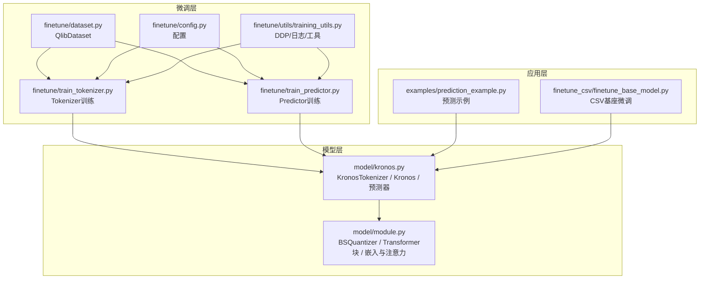
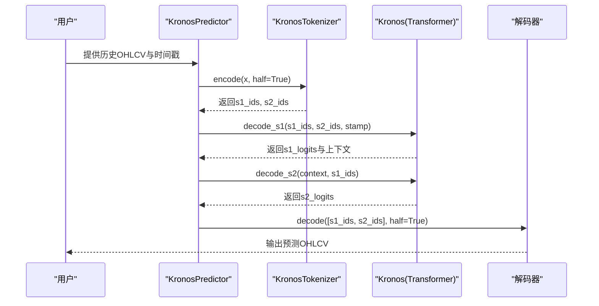
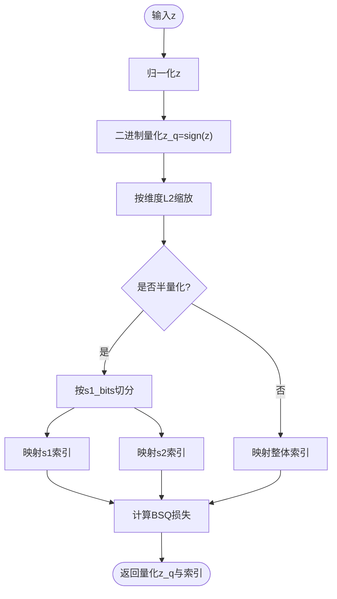
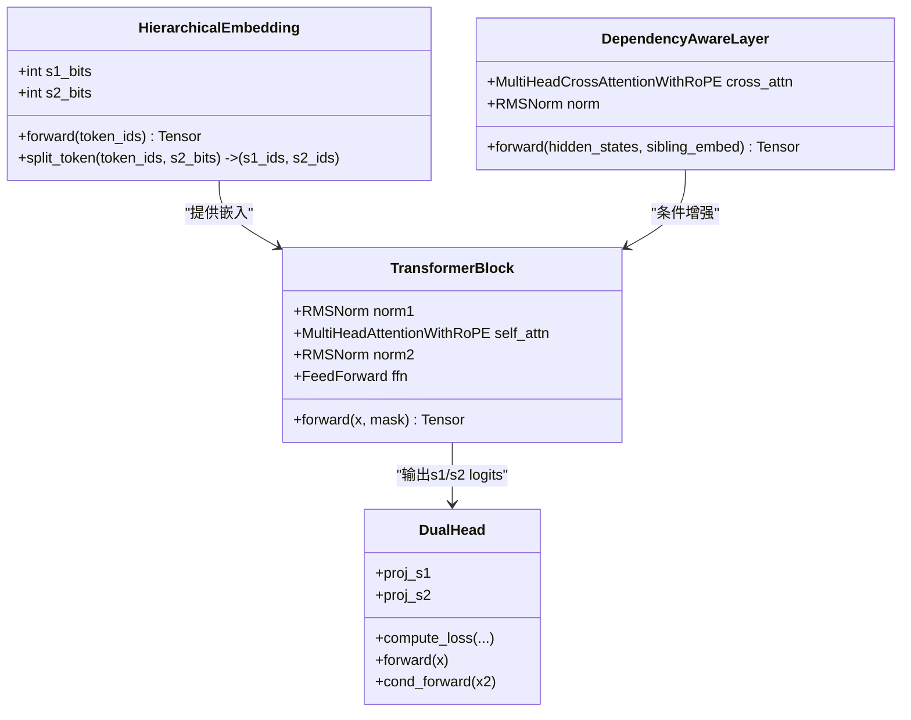
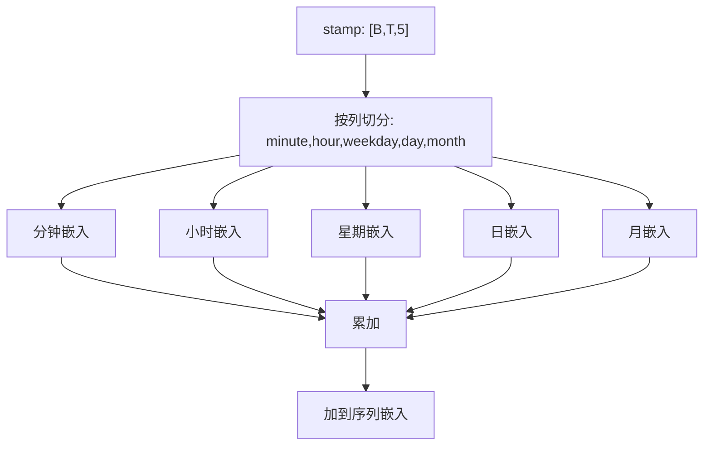
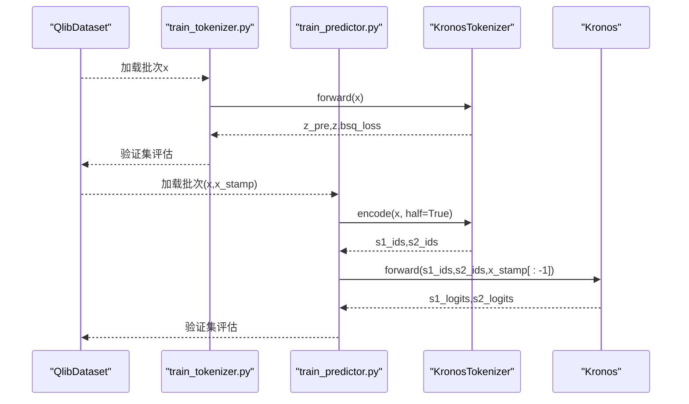
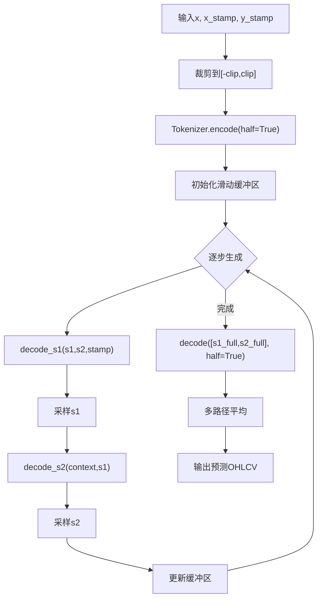
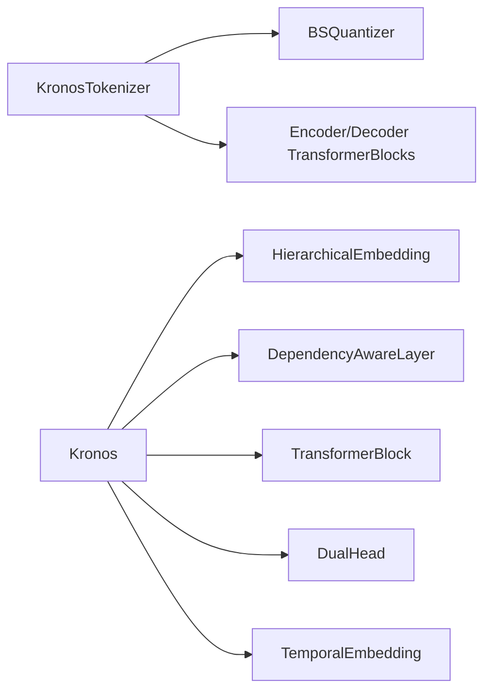

# 核心技术创新

<cite>
**本文引用的文件列表**
- [README.md](file://README.md)
- [model/kronos.py](file://model/kronos.py)
- [model/module.py](file://model/module.py)
- [finetune/train_tokenizer.py](file://finetune/train_tokenizer.py)
- [finetune/train_predictor.py](file://finetune/train_predictor.py)
- [finetune/dataset.py](file://finetune/dataset.py)
- [finetune/config.py](file://finetune/config.py)
- [finetune/utils/training_utils.py](file://finetune/utils/training_utils.py)
- [examples/prediction_example.py](file://examples/prediction_example.py)
- [finetune_csv/finetune_base_model.py](file://finetune_csv/finetune_base_model.py)
</cite>

## 目录
1. [引言](#引言)
2. [项目结构](#项目结构)
3. [核心组件](#核心组件)
4. [架构总览](#架构总览)
5. [详细组件分析](#详细组件分析)
6. [依赖关系分析](#依赖关系分析)
7. [性能考量](#性能考量)
8. [故障排查指南](#故障排查指南)
9. [结论](#结论)
10. [附录](#附录)

## 引言
本文件聚焦Kronos在金融时间序列建模中的两项核心技术创新：
- 第一阶段：二进制球面量化器（Binary Spherical Quantizer, BSQuantizer）将连续OHLCV多维K线数据映射为层次化离散令牌，形成可被自回归Transformer高效处理的语言学表示。
- 第二阶段：自回归Transformer以层次化令牌为输入，通过依赖感知注意力与时间嵌入，实现对多变量、多维度金融信号的联合预测。

Kronos的两阶段框架在训练与推理上均强调“离散化+语言建模”的统一范式，从而在高噪声、长尾分布的金融数据中取得稳健的泛化能力，并支持从单变量到多变量的灵活预测。

## 项目结构
Kronos代码库采用按功能分层的组织方式：
- model：核心模型定义（KronosTokenizer、Kronos、模块化子组件）
- finetune：面向金融市场的微调流水线（Tokenizer与Predictor两阶段训练）
- finetune_csv：CSV数据驱动的基座模型微调脚本
- examples：使用示例与可视化
- webui：Web界面（非本文重点）

图表来源
- [model/kronos.py](file://model/kronos.py)
- [model/module.py](file://model/module.py)
- [finetune/train_tokenizer.py](file://finetune/train_tokenizer.py)
- [finetune/train_predictor.py](file://finetune/train_predictor.py)
- [finetune/dataset.py](file://finetune/dataset.py)
- [finetune/config.py](file://finetune/config.py)
- [finetune/utils/training_utils.py](file://finetune/utils/training_utils.py)
- [examples/prediction_example.py](file://examples/prediction_example.py)
- [finetune_csv/finetune_base_model.py](file://finetune_csv/finetune_base_model.py)

章节来源
- [README.md](file://README.md)
- [model/kronos.py](file://model/kronos.py)
- [model/module.py](file://model/module.py)
- [finetune/train_tokenizer.py](file://finetune/train_tokenizer.py)
- [finetune/train_predictor.py](file://finetune/train_predictor.py)
- [finetune/dataset.py](file://finetune/dataset.py)
- [finetune/config.py](file://finetune/config.py)
- [finetune/utils/training_utils.py](file://finetune/utils/training_utils.py)
- [examples/prediction_example.py](file://examples/prediction_example.py)
- [finetune_csv/finetune_base_model.py](file://finetune_csv/finetune_base_model.py)

## 核心组件
- 二进制球面量化器（BSQuantizer）：将连续向量归一化后映射到超球面的二进制码字空间，结合熵正则与动量重构损失，生成层次化离散索引。
- 层次化嵌入（HierarchicalEmbedding）：将s1/s2位组合为双子嵌入，并融合为统一d_model表示。
- 自回归Transformer（Kronos）：以层次化令牌为输入，结合时间嵌入与依赖感知注意力，分别输出s1与s2的条件预测。
- 依赖感知层（DependencyAwareLayer）：利用交叉注意力，将s1的兄弟嵌入作为查询，对上下文进行条件增强。
- 时间嵌入（TemporalEmbedding）：对分钟、小时、星期、日、月等时间特征进行固定或可学习嵌入，叠加到序列表示。

章节来源
- [model/kronos.py](file://model/kronos.py)
- [model/module.py](file://model/module.py)

## 架构总览
Kronos的整体工作流分为两阶段：
- 训练阶段（Tokenizer）：对OHLCV进行编码器-解码器压缩，配合BSQuantizer的重建与熵正则损失，学习层次化离散表示。
- 推理阶段（Predictor）：将历史OHLCV经Tokenizer离散化为s1/s2令牌，再由Kronos自回归预测未来令牌，最终解码回连续值。

图表来源
- [model/kronos.py](file://model/kronos.py)
- [model/module.py](file://model/module.py)

## 详细组件分析

### 二进制球面量化器（BSQuantizer）与层次化离散表示
- 设计要点
  - 输入先归一化至单位超球面，再通过二进制量化映射到{-1,1}码字空间，结合L2缩放得到稳定表征。
  - 支持“半量化”模式（half=True），将s1_bits与s2_bits拆分为两段，分别生成独立索引，形成层次化令牌。
  - 损失函数包含：
    - 动量重构损失（commit loss）：强制量化输出接近原始特征。
    - 熵正则项（entropy penalty）：鼓励码本使用均匀性，提升表示多样性。
- 层次化优势
  - 将高层语义（s1）与细节（s2）分离，便于条件建模与跨任务迁移。
  - 降低词表规模与计算复杂度，同时保留足够的表达力。
- 数学要点
  - 归一化：z ← normalize(z)
  - 二进制量化：z_q = sign(z)，并以梯度修正保持可微。
  - 索引映射：将二进制位串映射为整数索引，便于嵌入查找与交叉熵损失。

图表来源
- [model/module.py](file://model/module.py)

章节来源
- [model/module.py](file://model/module.py)
- [model/kronos.py](file://model/kronos.py)

### 层次化嵌入与依赖感知注意力
- 层次化嵌入（HierarchicalEmbedding）
  - 将s1/s2令牌分别查表嵌入，再经融合投影得到统一d_model表示。
  - 支持直接传入复合令牌（合并高低位）或显式提供(s1,s2)。
- 依赖感知层（DependencyAwareLayer）
  - 使用交叉注意力，以s1嵌入为查询，上下文为键/值，实现对s1条件下的上下文增强。
  - 输出经RMSNorm残差连接，稳定深层传播。
- 自回归Transformer块
  - 内置旋转位置编码（RoPE）与因果掩码，支持长上下文窗口。
  - 双头输出（DualHead）：s1_head用于s1预测，cond_head用于s2条件预测。

图表来源
- [model/module.py](file://model/module.py)

章节来源
- [model/module.py](file://model/module.py)

### 时间嵌入与位置编码设计
- 时间嵌入（TemporalEmbedding）
  - 对分钟、小时、星期、日、月分别嵌入，累加得到时间表示。
  - 可选择固定正弦/余弦嵌入或可学习嵌入（learn_pe参数控制）。
- 旋转位置编码（RoPE）
  - 在注意力中对Q/K进行旋转，天然具备相对位置信息，适合长序列与自回归场景。
- 注意力掩码
  - 使用key_padding_mask与因果掩码，确保自回归与填充安全。

图表来源
- [model/module.py](file://model/module.py)

章节来源
- [model/module.py](file://model/module.py)

### 两阶段训练流程
- Tokenizer训练（离线/预训练）
  - 编码器-解码器结构，目标是重构输入与最小化BSQ损失。
  - 使用分布式数据加载与梯度累积，优化器采用AdamW与OneCycleLR。
- Predictor训练（在线/微调）
  - 将Tokenizer离线得到的s1/s2令牌作为输入，训练自回归语言模型。
  - 交叉熵损失平均s1与s2的预测误差，支持padding掩码。

图表来源
- [finetune/train_tokenizer.py](file://finetune/train_tokenizer.py)
- [finetune/train_predictor.py](file://finetune/train_predictor.py)
- [finetune/dataset.py](file://finetune/dataset.py)
- [model/kronos.py](file://model/kronos.py)

章节来源
- [finetune/train_tokenizer.py](file://finetune/train_tokenizer.py)
- [finetune/train_predictor.py](file://finetune/train_predictor.py)
- [finetune/dataset.py](file://finetune/dataset.py)
- [finetune/config.py](file://finetune/config.py)
- [finetune/utils/training_utils.py](file://finetune/utils/training_utils.py)

### 自回归推理与采样策略
- 自回归推理（auto_regressive_inference）
  - 维护滑动缓冲区（pre_buffer/post_buffer），按最大上下文长度截断。
  - 使用温度与top-k/top-p采样，支持多路径平均以稳定预测。
- 预测器封装（KronosPredictor）
  - 负责数据标准化、时间戳提取、批量预测与反归一化。

图表来源
- [model/kronos.py](file://model/kronos.py)

章节来源
- [model/kronos.py](file://model/kronos.py)

## 依赖关系分析
- 组件耦合
  - Tokenizer与Predictor通过s1/s2令牌接口耦合，解耦了离线量化与在线建模。
  - 模块化子组件（TransformerBlock、RoPE、RMSNorm、DualHead等）内聚度高，便于复用与替换。
- 外部依赖
  - 分布式训练依赖torch.distributed与NCCL后端。
  - 日志与实验跟踪可选comet_ml。
- 潜在循环依赖
  - 未发现直接循环导入；模块间通过函数/类接口通信。

图表来源
- [model/kronos.py](file://model/kronos.py)
- [model/module.py](file://model/module.py)

章节来源
- [model/kronos.py](file://model/kronos.py)
- [model/module.py](file://model/module.py)

## 性能考量
- 计算效率
  - 半量化（half=True）显著降低词表规模与内存占用，适合长上下文与大规模模型。
  - RoPE减少绝对位置编码开销，利于长序列建模。
- 训练稳定性
  - RMSNorm与残差连接提升深层网络稳定性。
  - OneCycleLR与梯度裁剪避免过拟合与梯度爆炸。
- 推理吞吐
  - 滑动缓冲区与多路径采样可在精度与速度间权衡。
  - 批量预测（predict_batch）充分利用GPU并行。

## 故障排查指南
- 数据问题
  - 缺失值：训练/验证数据需无NaN；若存在缺失，应提前填充或剔除。
  - 时间戳不一致：确保x_timestamp与y_timestamp长度与预测步长一致。
- 设备与分布式
  - DDP初始化失败：确认torchrun环境变量设置正确，NCCL可用。
  - GPU显存不足：减小batch_size或启用梯度累积。
- 模型尺寸与上下文
  - max_context限制：确保历史长度不超过模型上下文（如512）。
  - 参数量过大：选择更小容量的Kronos模型或降低d_model/n_layers。

章节来源
- [finetune/dataset.py](file://finetune/dataset.py)
- [finetune/utils/training_utils.py](file://finetune/utils/training_utils.py)
- [README.md](file://README.md)

## 结论
Kronos通过“二进制球面量化+自回归Transformer”的两阶段框架，将连续OHLCV转化为层次化离散令牌，并在统一的语言学空间中实现多变量、多维度的联合预测。该方法在金融数据的高噪声、长尾分布与长序列特性下，提供了稳健的建模基础与高效的训练/推理路径。相比传统时序模型，Kronos在以下方面具有独特优势：
- 层次化离散表示：将高层语义与细节分离，提升条件建模能力与跨任务迁移潜力。
- 依赖感知注意力：通过s1条件增强上下文，提高预测稳定性与可解释性。
- 时间嵌入与RoPE：自然建模相对位置与时序周期性，适配高频与长序列场景。
- 两阶段流水线：离线量化+在线建模，兼顾效率与效果。

## 附录
- 使用示例与可视化：参考examples/prediction_example.py，快速从原始K线数据到预测结果。
- CSV基座微调：参考finetune_csv/finetune_base_model.py，使用本地CSV数据进行基座模型微调。
- 配置说明：参考finetune/config.py，调整训练超参、数据路径与保存目录。

章节来源
- [examples/prediction_example.py](file://examples/prediction_example.py)
- [finetune_csv/finetune_base_model.py](file://finetune_csv/finetune_base_model.py)
- [finetune/config.py](file://finetune/config.py)