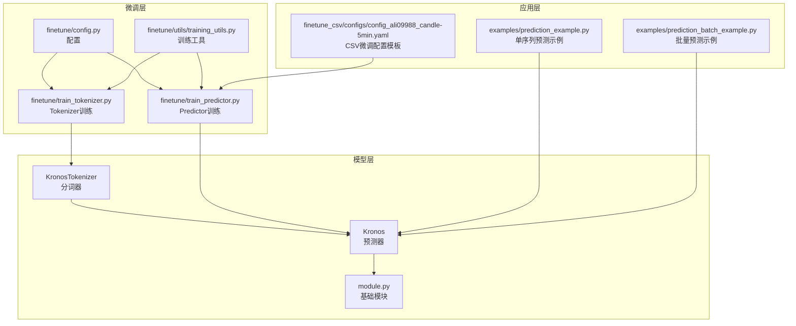
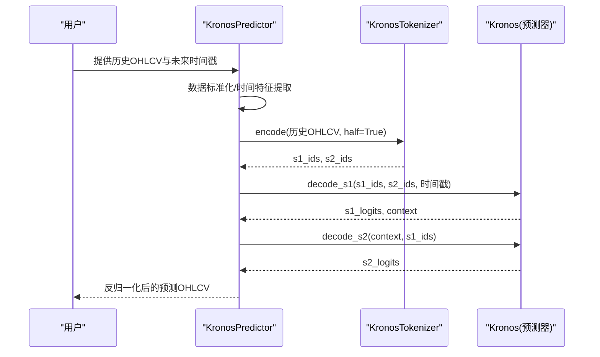
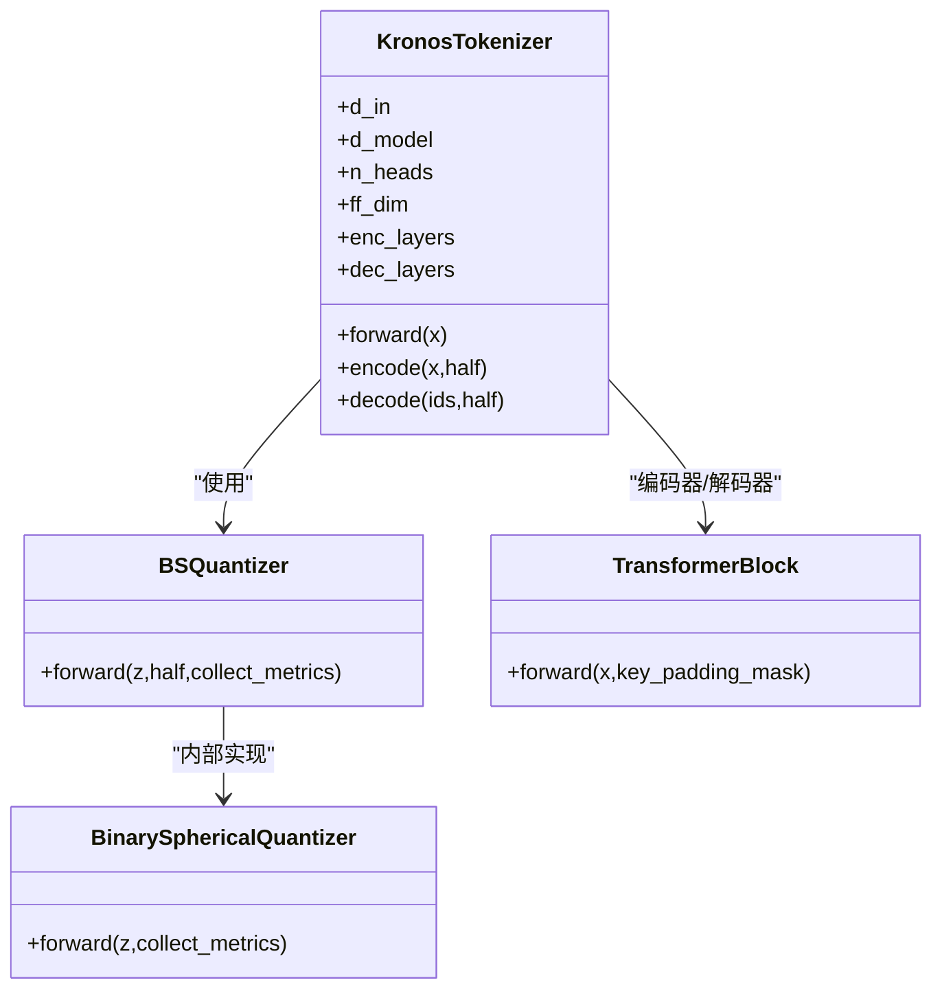
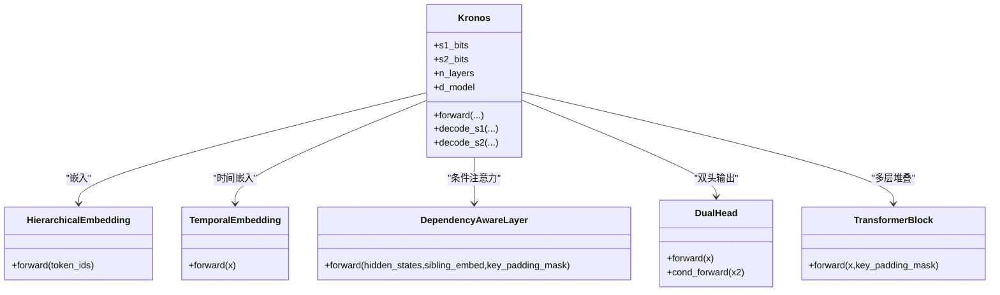
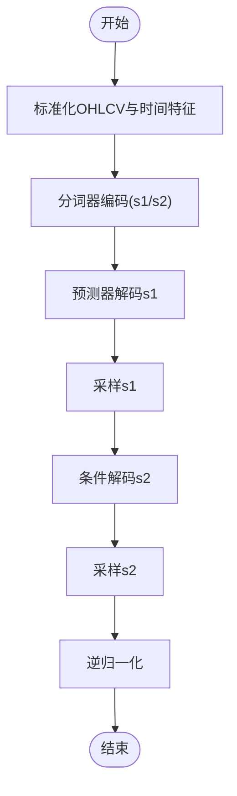
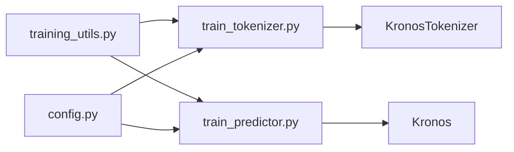

# 模型家族与规格

<cite>
**本文引用的文件**
- [README.md](file://README.md)
- [model/kronos.py](file://model/kronos.py)
- [model/module.py](file://model/module.py)
- [finetune/config.py](file://finetune/config.py)
- [finetune/train_tokenizer.py](file://finetune/train_tokenizer.py)
- [finetune/train_predictor.py](file://finetune/train_predictor.py)
- [finetune/utils/training_utils.py](file://finetune/utils/training_utils.py)
- [examples/prediction_example.py](file://examples/prediction_example.py)
- [examples/prediction_batch_example.py](file://examples/prediction_batch_example.py)
- [finetune_csv/configs/config_ali09988_candle-5min.yaml](file://finetune_csv/configs/config_ali09988_candle-5min.yaml)
- [requirements.txt](file://requirements.txt)
</cite>

## 目录
1. [简介](#简介)
2. [项目结构](#项目结构)
3. [核心组件](#核心组件)
4. [架构总览](#架构总览)
5. [详细组件分析](#详细组件分析)
6. [依赖关系分析](#依赖关系分析)
7. [性能考量](#性能考量)
8. [故障排查指南](#故障排查指南)
9. [结论](#结论)
10. [附录](#附录)

## 简介
本文件面向Kronos模型家族的规格说明与使用指导，聚焦于四个不同规模的模型（mini、small、base、large），系统阐述其技术规格、适用场景、性能特征与选型建议，并结合仓库中的训练与推理脚本，给出在不同硬件配置下的推理速度对比思路与最佳实践。由于大型模型（large）未开源，本文将明确标注其参数量来源与限制。

## 项目结构
仓库采用“模型实现 + 微调流水线 + 示例 + WebUI”的组织方式：
- model：核心模型实现（分词器与预测器、模块化组件）
- finetune：Tokenizer与Predictor的微调脚本与配置
- finetune_csv：基于CSV数据的微调配置模板
- examples：推理示例与批量推理示例
- webui：Web界面（推理结果可视化）
- 根目录：README、依赖清单等

图表来源
- [model/kronos.py:13-114](file://model/kronos.py#L13-L114)
- [model/module.py:400-444](file://model/module.py#L400-L444)
- [finetune/train_tokenizer.py:218-282](file://finetune/train_tokenizer.py#L218-L282)
- [finetune/train_predictor.py:182-245](file://finetune/train_predictor.py#L182-L245)
- [finetune/config.py:1-132](file://finetune/config.py#L1-L132)
- [finetune/utils/training_utils.py:62-81](file://finetune/utils/training_utils.py#L62-L81)
- [examples/prediction_example.py:41-81](file://examples/prediction_example.py#L41-L81)
- [examples/prediction_batch_example.py:41-73](file://examples/prediction_batch_example.py#L41-L73)
- [finetune_csv/configs/config_ali09988_candle-5min.yaml:1-73](file://finetune_csv/configs/config_ali09988_candle-5min.yaml#L1-L73)

章节来源
- [README.md:74-83](file://README.md#L74-L83)
- [requirements.txt:1-11](file://requirements.txt#L1-L11)

## 核心组件
- 分词器（KronosTokenizer）：采用编码器-解码器Transformer与二进制球面量化（BSQuantizer）进行连续OHLCV到层次离散token的映射，支持半量化的s1/s2位组合。
- 预测器（Kronos）：解码器-only架构，采用RMSNorm、RoPE注意力、层级嵌入与依赖感知层，输出双头分类logits（s1/s2）。
- 基础模块（module.py）：包含BinarySphericalQuantizer、HierarchicalEmbedding、DependencyAwareLayer、TransformerBlock、DualHead、TemporalEmbedding等。
- 推理器（KronosPredictor）：封装数据预处理、归一化、采样与逆归一化，提供单序列与批量预测接口。

章节来源
- [model/kronos.py:13-114](file://model/kronos.py#L13-L114)
- [model/kronos.py:180-329](file://model/kronos.py#L180-L329)
- [model/module.py:225-255](file://model/module.py#L225-L255)
- [model/module.py:400-444](file://model/module.py#L400-L444)
- [model/module.py:446-463](file://model/module.py#L446-L463)
- [model/module.py:465-484](file://model/module.py#L465-L484)
- [model/module.py:486-514](file://model/module.py#L486-L514)
- [model/module.py:536-562](file://model/module.py#L536-L562)
- [model/kronos.py:482-560](file://model/kronos.py#L482-L560)

## 架构总览
Kronos采用“分词器-预测器”两阶段框架：
- 分词器：对OHLCV序列进行端到端重建与量化，学习离散表示；
- 预测器：以离散token为输入，通过自回归语言建模完成多变量时间序列预测。

图表来源
- [model/kronos.py:389-470](file://model/kronos.py#L389-L470)
- [model/kronos.py:278-329](file://model/kronos.py#L278-L329)
- [model/kronos.py:508-560](file://model/kronos.py#L508-L560)

## 详细组件分析

### 组件A：KronosTokenizer（分词器）
- 结构要点
  - 编码器/解码器Transformer块（ModuleList）
  - 量化前嵌入与后嵌入投影
  - BSQuantizer（二进制球面量化）：将连续向量映射到球面超立方格点，支持软熵与提交损失
  - 支持half=True的半量化模式（s1_bits + s2_bits）
- 关键流程
  - 输入经嵌入→编码器堆叠→量化前投影→BSQuantizer→得到量化表示与索引
  - 解码器分别重建s1与全码本，输出两路重建
- 复杂度与内存
  - 计算复杂度主要由Transformer自注意力主导；量化维度越高，码本容量越大，内存占用上升
  - 量化损失与熵惩罚项平衡重构误差与码本利用率

图表来源
- [model/kronos.py:13-114](file://model/kronos.py#L13-L114)
- [model/module.py:225-255](file://model/module.py#L225-L255)
- [model/module.py:39-130](file://model/module.py#L39-L130)
- [model/module.py:465-484](file://model/module.py#L465-L484)

章节来源
- [model/kronos.py:13-114](file://model/kronos.py#L13-L114)
- [model/module.py:225-255](file://model/module.py#L225-L255)
- [model/module.py:39-130](file://model/module.py#L39-L130)

### 组件B：Kronos（预测器）
- 结构要点
  - 层级嵌入（HierarchicalEmbedding）：s1/s2子token嵌入融合
  - 时间嵌入（TemporalEmbedding）：分钟/小时/星期/日/月
  - 多层TransformerBlock（RMSNorm + RoPE注意力 + FFN）
  - 依赖感知层（DependencyAwareLayer）：s1条件下的交叉注意力
  - 双头输出（DualHead）：s1与s2分类logits
- 推理路径
  - 单步s1解码（decode_s1）+ 条件s2解码（decode_s2）
  - 支持教师强制（teacher-forcing）与自回归采样
- 复杂度与内存
  - 自注意力复杂度O(T^2·D)，层数与维度增加显著影响显存与吞吐
  - 依赖感知层引入额外跨注意力开销

图表来源
- [model/kronos.py:180-329](file://model/kronos.py#L180-L329)
- [model/module.py:400-444](file://model/module.py#L400-L444)
- [model/module.py:536-562](file://model/module.py#L536-L562)
- [model/module.py:446-463](file://model/module.py#L446-L463)
- [model/module.py:486-514](file://model/module.py#L486-L514)
- [model/module.py:465-484](file://model/module.py#L465-L484)

章节来源
- [model/kronos.py:180-329](file://model/kronos.py#L180-L329)
- [model/module.py:400-444](file://model/module.py#L400-L444)
- [model/module.py:536-562](file://model/module.py#L536-L562)
- [model/module.py:446-463](file://model/module.py#L446-L463)
- [model/module.py:486-514](file://model/module.py#L486-L514)

### 组件C：推理管线（KronosPredictor）
- 功能
  - 数据预处理：OHLCV标准化、时间戳转时间特征
  - 归一化与逆归一化
  - 自回归采样与批量预测
- 关键参数
  - max_context：最大上下文长度（小/基模型为512）
  - T/top_k/top_p/sample_count：采样控制
- 批量预测
  - 要求所有序列的历史长度与预测长度一致

图表来源
- [model/kronos.py:389-470](file://model/kronos.py#L389-L470)
- [model/kronos.py:508-560](file://model/kronos.py#L508-L560)

章节来源
- [model/kronos.py:482-560](file://model/kronos.py#L482-L560)
- [examples/prediction_example.py:41-81](file://examples/prediction_example.py#L41-L81)
- [examples/prediction_batch_example.py:41-73](file://examples/prediction_batch_example.py#L41-L73)

## 依赖关系分析
- 训练工具
  - DDP初始化、分布式采样、随机种子设置、模型大小统计、时间格式化
- 微调配置
  - Tokenizer与Predictor的学习率、批次大小、梯度累积、优化器参数、保存路径
- 模型大小统计
  - 使用get_model_size统计可训练参数量，单位自动转换为K/M/B

图表来源
- [finetune/utils/training_utils.py:9-32](file://finetune/utils/training_utils.py#L9-L32)
- [finetune/train_tokenizer.py:218-282](file://finetune/train_tokenizer.py#L218-L282)
- [finetune/train_predictor.py:182-245](file://finetune/train_predictor.py#L182-L245)
- [finetune/config.py:1-132](file://finetune/config.py#L1-L132)

章节来源
- [finetune/utils/training_utils.py:62-81](file://finetune/utils/training_utils.py#L62-L81)
- [finetune/train_tokenizer.py:218-282](file://finetune/train_tokenizer.py#L218-L282)
- [finetune/train_predictor.py:182-245](file://finetune/train_predictor.py#L182-L245)
- [finetune/config.py:1-132](file://finetune/config.py#L1-L132)

## 性能考量

### 模型家族规格（来自README与代码注释）
- 模型族谱与公开状态
  - mini：Tokenizer-2k，上下文长度2048，参数约4.1M，开源
  - small：上下文长度512，参数约24.7M，开源
  - base：上下文长度512，参数约102.3M，开源
  - large：上下文长度512，参数约499.2M，未开源
- 上下文长度与max_context
  - 小/基模型max_context=512；mini为2048
- 训练与推理
  - 训练使用AdamW、OneCycleLR、梯度裁剪
  - 推理支持温度采样、Top-k/Top-p过滤与批量采样平均

章节来源
- [README.md:74-83](file://README.md#L74-L83)
- [README.md:99-100](file://README.md#L99-L100)
- [finetune/train_tokenizer.py:98-111](file://finetune/train_tokenizer.py#L98-L111)
- [finetune/train_predictor.py:71-81](file://finetune/train_predictor.py#L71-L81)
- [finetune/utils/training_utils.py:62-81](file://finetune/utils/training_utils.py#L62-L81)

### 推理速度对比与硬件建议
- 硬件要求
  - CUDA可用时优先使用GPU；若无CUDA则回退CPU；部分平台支持MPS
- 推理路径
  - 单序列：KronosPredictor.predict
  - 批量序列：KronosPredictor.predict_batch（要求相同历史长度与预测长度）
- 速度优化建议
  - 降低采样数量（sample_count）、提高top_p阈值减少无效搜索空间
  - 控制max_context与pred_len，避免过长序列导致显存不足
  - 使用更小的s1/s2位宽（受Tokenizer配置影响）

章节来源
- [model/kronos.py:482-560](file://model/kronos.py#L482-L560)
- [examples/prediction_example.py:41-81](file://examples/prediction_example.py#L41-L81)
- [examples/prediction_batch_example.py:41-73](file://examples/prediction_batch_example.py#L41-L73)

### 训练与微调性能
- Tokenizer训练
  - 使用MSE重建损失与BSQuantizer损失加权，支持梯度累积
- Predictor训练
  - 使用交叉熵损失（s1/s2），OneCycleLR调度，梯度裁剪
- 分布式训练
  - DDP初始化、分布式采样、全局指标聚合

章节来源
- [finetune/train_tokenizer.py:136-154](file://finetune/train_tokenizer.py#L136-L154)
- [finetune/train_predictor.py:107-116](file://finetune/train_predictor.py#L107-L116)
- [finetune/utils/training_utils.py:9-32](file://finetune/utils/training_utils.py#L9-L32)

## 故障排查指南
- 常见问题
  - 设备检测失败：确认CUDA/MPS/CPU可用性
  - 输入数据缺失列：确保包含['open','high','low','close']，可选['volume','amount']
  - NaN值：输入序列中不得含NaN
  - 批量预测长度不一致：要求所有序列的历史长度与预测长度一致
- 定位方法
  - 使用示例脚本逐步运行，观察中间张量形状与设备
  - 在训练脚本中开启Comet日志，查看每步损失与学习率
- 建议
  - 先用小样本验证流程，再扩展到大批量
  - 对于大规模微调，合理设置batch_size与accumulation_steps

章节来源
- [model/kronos.py:524-536](file://model/kronos.py#L524-L536)
- [model/kronos.py:611-627](file://model/kronos.py#L611-L627)
- [finetune/train_tokenizer.py:157-171](file://finetune/train_tokenizer.py#L157-L171)
- [finetune/train_predictor.py:119-132](file://finetune/train_predictor.py#L119-L132)

## 结论
Kronos通过“分词器-预测器”两阶段框架，将连续OHLCV序列映射为离散token并进行统一的自回归建模，实现了对多变量金融序列的高效预测。仓库提供了从推理到微调的完整工具链，用户可根据自身资源与精度需求选择合适规模的模型，并通过采样策略与上下文长度控制推理成本与质量。

## 附录

### 模型选择指南
- mini（4.1M参数，上下文2048）：资源受限、快速原型或边缘部署
- small（24.7M参数，上下文512）：通用金融任务、中小规模部署
- base（102.3M参数，上下文512）：高精度任务、中大型部署
- large（499.2M参数，上下文512，未开源）：追求极致精度但需自研或获取授权

章节来源
- [README.md:74-83](file://README.md#L74-L83)

### 使用建议与最佳实践
- 推理
  - 合理设置T/top_p/sample_count，平衡多样性与稳定性
  - 控制max_context与pred_len，避免显存溢出
  - 使用predict_batch进行多序列并行预测
- 微调
  - 先微调Tokenizer，再微调Predictor
  - 使用OneCycleLR与梯度裁剪，关注验证集损失
  - 使用DDP加速训练，注意分布式采样与指标聚合

章节来源
- [examples/prediction_example.py:41-81](file://examples/prediction_example.py#L41-L81)
- [examples/prediction_batch_example.py:41-73](file://examples/prediction_batch_example.py#L41-L73)
- [finetune/train_tokenizer.py:104-111](file://finetune/train_tokenizer.py#L104-L111)
- [finetune/train_predictor.py:77-81](file://finetune/train_predictor.py#L77-L81)
- [finetune/utils/training_utils.py:9-32](file://finetune/utils/training_utils.py#L9-L32)