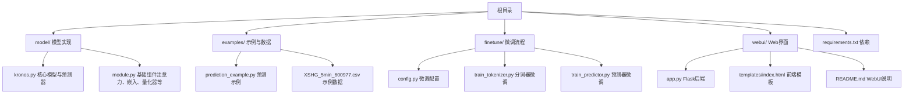
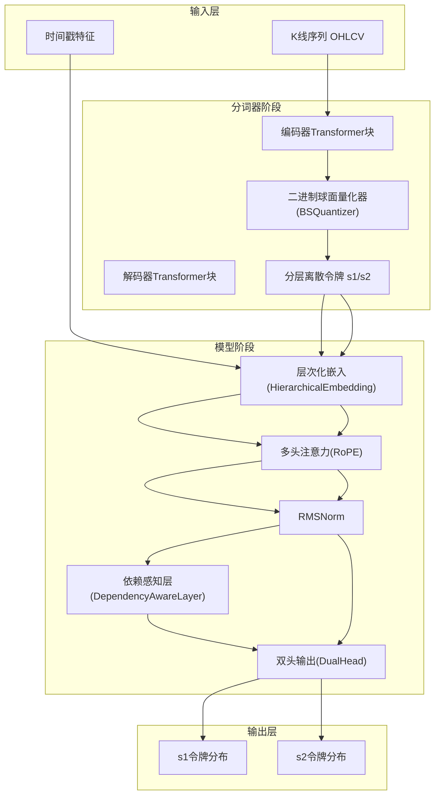
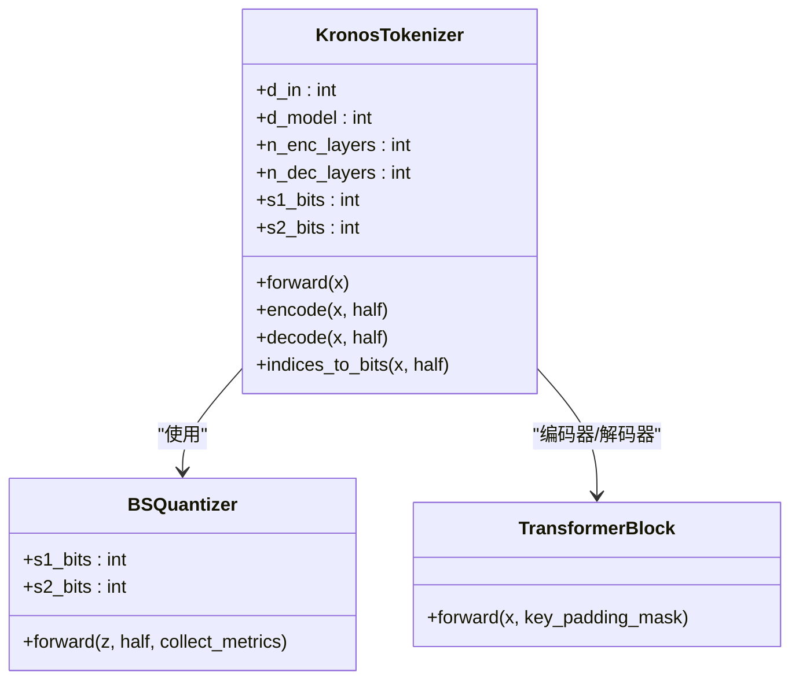
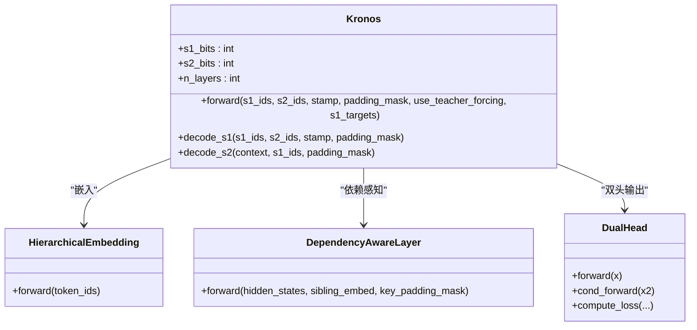
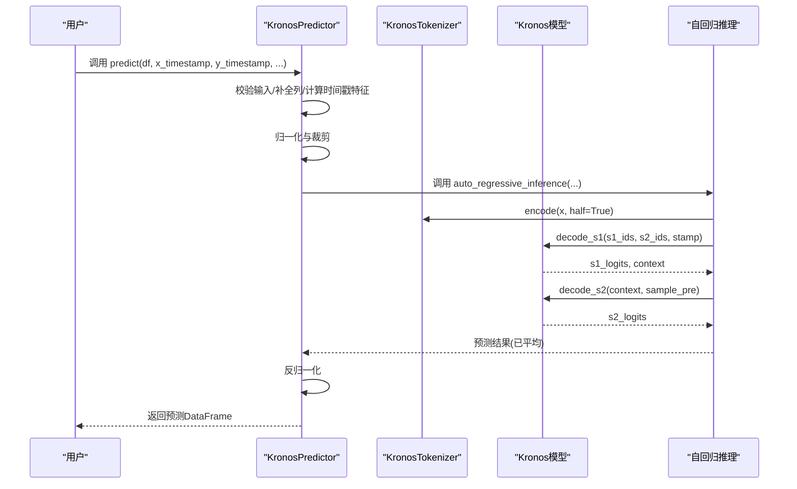
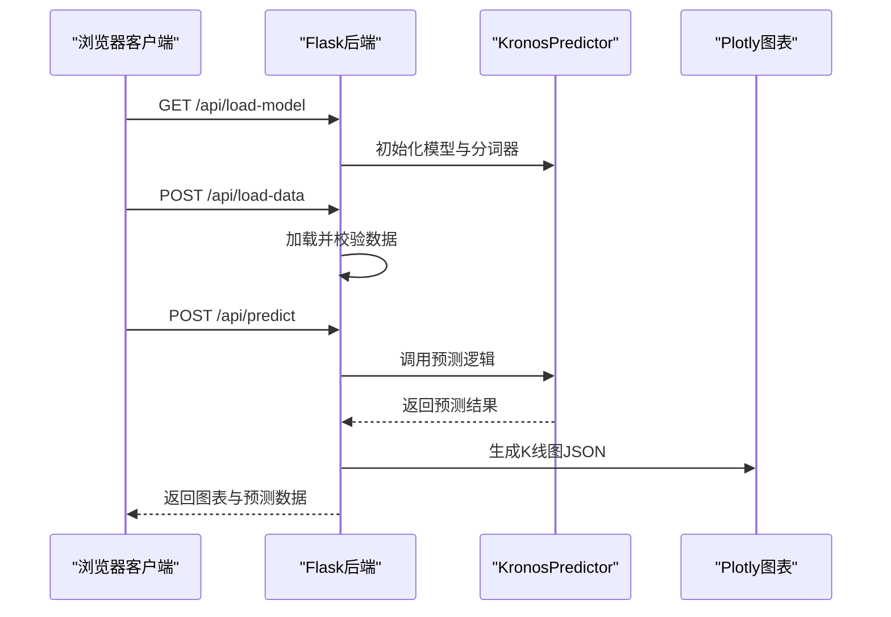
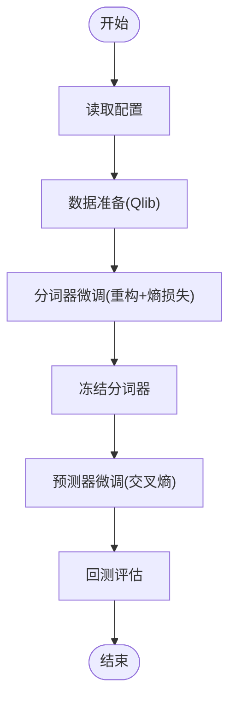
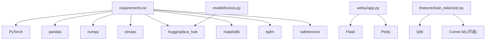

# 项目概述

<cite>
**本文档引用的文件**
- [README.md](file://README.md)
- [requirements.txt](file://requirements.txt)
- [model/kronos.py](file://model/kronos.py)
- [model/module.py](file://model/module.py)
- [examples/prediction_example.py](file://examples/prediction_example.py)
- [examples/data/XSHG_5min_600977.csv](file://examples/data/XSHG_5min_600977.csv)
- [webui/app.py](file://webui/app.py)
- [webui/README.md](file://webui/README.md)
- [finetune/config.py](file://finetune/config.py)
- [finetune/train_tokenizer.py](file://finetune/train_tokenizer.py)
- [finetune/train_predictor.py](file://finetune/train_predictor.py)
</cite>

## 目录
1. [简介](#简介)
2. [项目结构](#项目结构)
3. [核心组件](#核心组件)
4. [架构总览](#架构总览)
5. [详细组件分析](#详细组件分析)
6. [依赖关系分析](#依赖关系分析)
7. [性能考量](#性能考量)
8. [故障排查指南](#故障排查指南)
9. [结论](#结论)
10. [附录](#附录)

## 简介
Kronos 是首个开源金融K线（蜡烛图）基础模型，专为“金融市场的语言”——K线序列而设计。与通用时序模型不同，Kronos 针对金融数据的高噪声特性进行专门优化，采用两阶段框架：先通过专用分词器将连续多维K线数据量化为分层离散令牌，再用大型自回归Transformer在这些令牌上进行预训练，从而实现对多种量化任务的统一建模。项目已在45个全球交易所的数据上完成预训练，并提供从轻量级到大模型的完整模型家族，便于在不同计算资源与应用需求之间灵活选择。

- 项目徽标与多语言支持：项目主页包含官方徽标与多语言文档入口（德语、西班牙语、法语、日语、韩语、葡萄牙语、俄语、中文等）。
- 实时演示：提供在线演示页面，展示K线预测结果可视化。
- 开源许可：采用MIT许可证，便于学术研究与工业应用。

**章节来源**
- [README.md:46-82](file://README.md#L46-L82)
- [README.md:28-38](file://README.md#L28-L38)
- [README.md:69-72](file://README.md#L69-L72)
- [README.md:326-327](file://README.md#L326-L327)

## 项目结构
项目采用模块化组织方式，核心代码集中在 model/ 目录，示例与微调脚本分别位于 examples/ 和 finetune/ 目录，Web UI 提供交互式预测界面，requirements.txt 统一管理依赖。

**图表来源**
- [README.md:1-338](file://README.md#L1-L338)
- [requirements.txt:1-11](file://requirements.txt#L1-L11)

**章节来源**
- [README.md:1-338](file://README.md#L1-L338)
- [requirements.txt:1-11](file://requirements.txt#L1-L11)

## 核心组件
- KronosTokenizer：基于混合量化策略的专用分词器，结合编码器-解码器Transformer块与球面二进制量化器（BSQuantizer），将连续K线特征映射为分层离散令牌，支持半量化的前半部分与全量化的整体表示。
- Kronos：解码器型基础模型，采用层次化嵌入（HierarchicalEmbedding）、旋转位置编码（RoPE）注意力、RMSNorm、依赖感知层（DependencyAwareLayer）与双头输出（DualHead），实现s1/s2令牌的联合建模与条件解码。
- KronosPredictor：高层封装，负责数据预处理、归一化、时间戳特征提取、采样参数控制、批量预测与反归一化，简化用户使用流程。
- Web UI：Flask后端提供REST接口，前端可视化展示K线预测结果，支持多模型加载、参数调节与历史窗口选择。
- 微调工具链：提供从数据准备、分词器微调到预测器微调的完整流水线，支持分布式训练与实验跟踪。

**章节来源**
- [model/kronos.py:13-178](file://model/kronos.py#L13-L178)
- [model/kronos.py:180-329](file://model/kronos.py#L180-L329)
- [model/kronos.py:482-662](file://model/kronos.py#L482-L662)
- [webui/app.py:33-58](file://webui/app.py#L33-L58)
- [finetune/config.py:3-132](file://finetune/config.py#L3-L132)

## 架构总览
Kronos 的整体架构由“两阶段分词+层次化令牌+自回归Transformer”的组合构成，既保留了金融数据的连续性特征，又通过离散化令牌实现了高效的语言建模。

**图表来源**
- [model/kronos.py:13-178](file://model/kronos.py#L13-L178)
- [model/kronos.py:180-329](file://model/kronos.py#L180-L329)
- [model/module.py:225-255](file://model/module.py#L225-L255)
- [model/module.py:400-444](file://model/module.py#L400-L444)
- [model/module.py:446-463](file://model/module.py#L446-L463)
- [model/module.py:486-514](file://model/module.py#L486-L514)

## 详细组件分析

### 组件A：KronosTokenizer（分词器）
- 设计要点
  - 编码器-解码器结构：先通过编码器压缩特征空间，再经量化器得到离散令牌，最后通过解码器重构输入以监督学习。
  - 分层量化：s1_bits与s2_bits分别对应前半部分与后半部分的离散维度，形成“粗粒度+细粒度”的层次化令牌表示。
  - 二进制球面量化（BSQuantizer）：在量化过程中引入熵正则与重构损失，提升令牌表达能力与稳定性。
- 关键流程
  - 嵌入与编码：将输入映射到模型维度，经过若干Transformer块。
  - 量化与索引：将量化后的比特转换为整数索引，用于后续建模。
  - 解码与重建：分别对s1与全量令牌进行解码，得到重构输出。
- 复杂度与性能
  - 计算复杂度主要受Transformer层数与序列长度影响；量化过程通过比特索引降低存储与推理成本。
  - 支持半量化的索引生成，减少冗余计算。

**图表来源**
- [model/kronos.py:13-178](file://model/kronos.py#L13-L178)
- [model/module.py:225-255](file://model/module.py#L225-L255)
- [model/module.py:465-484](file://model/module.py#L465-L484)

**章节来源**
- [model/kronos.py:13-178](file://model/kronos.py#L13-L178)
- [model/module.py:225-255](file://model/module.py#L225-L255)

### 组件B：Kronos（基础模型）
- 设计要点
  - 层次化嵌入：将s1/s2令牌映射到同一嵌入空间并通过融合投影连接。
  - 时间嵌入：固定频率的时间特征（分钟、小时、星期、日、月）可学习或固定嵌入。
  - 双头输出：s1_head直接输出s1令牌分布；s2_head在依赖感知层条件下输出s2令牌分布。
  - 自回归解码：支持仅解码s1或s1+s2的条件解码路径。
- 关键流程
  - 输入嵌入与时间注入
  - 多层Transformer编码
  - s1解码与s2条件解码
  - 输出双头分布
- 复杂度与性能
  - 注意力复杂度随序列长度增长；通过RoPE与RMSNorm提升稳定性与效率。

**图表来源**
- [model/kronos.py:180-329](file://model/kronos.py#L180-L329)
- [model/module.py:400-444](file://model/module.py#L400-L444)
- [model/module.py:446-463](file://model/module.py#L446-L463)
- [model/module.py:486-514](file://model/module.py#L486-L514)

**章节来源**
- [model/kronos.py:180-329](file://model/kronos.py#L180-L329)

### 组件C：KronosPredictor（预测器）
- 设计要点
  - 数据预处理：自动补齐缺失的volume/amount列，计算时间戳特征，进行均值方差归一化与裁剪。
  - 批量预测：支持多序列并行推理，独立处理每个序列的归一化与反归一化。
  - 采样控制：温度、Top-k/Top-p核采样、样本数量等参数可调，支持确定性与随机性预测。
- 关键流程
  - 输入校验与特征工程
  - 归一化与张量化
  - 调用自回归推理函数
  - 反归一化与结果DataFrame化
- 性能与易用性
  - 内置设备检测（CUDA/MPS/CPU），自动迁移至可用设备。
  - 批量模式下利用GPU并行加速。

**图表来源**
- [model/kronos.py:482-662](file://model/kronos.py#L482-L662)
- [model/kronos.py:389-470](file://model/kronos.py#L389-L470)

**章节来源**
- [model/kronos.py:482-662](file://model/kronos.py#L482-L662)

### 组件D：Web UI（Flask后端）
- 功能概览
  - 模型加载：支持Kronos-mini、Kronos-small、Kronos-base三种配置，按上下文长度与参数规模区分。
  - 数据加载：支持CSV/Feather格式，自动识别时间戳列，进行数据清洗与校验。
  - 预测执行：提供温度、Top-p、样本数等参数调节，支持自定义时间窗口与最新数据两种预测模式。
  - 结果可视化：生成K线图对比预测与实际数据，保存预测结果与分析报告。
- 技术架构
  - 后端：Flask + Python，跨域支持，REST接口。
  - 前端：HTML/CSS/JS + Plotly.js，专业K线图展示。
  - 数据处理：Pandas/NumPy，时间戳解析与特征提取。
  - 模型：Hugging Face Transformers集成。

**图表来源**
- [webui/app.py:626-663](file://webui/app.py#L626-L663)
- [webui/app.py:404-624](file://webui/app.py#L404-L624)
- [webui/README.md:103-110](file://webui/README.md#L103-L110)

**章节来源**
- [webui/app.py:33-58](file://webui/app.py#L33-L58)
- [webui/app.py:404-624](file://webui/app.py#L404-L624)
- [webui/README.md:1-136](file://webui/README.md#L1-L136)

### 组件E：微调流水线（分词器与预测器）
- 流程概览
  - 配置：设置数据路径、时间范围、特征列表、训练超参、保存路径等。
  - 数据准备：使用Qlib数据源，划分训练/验证/测试集，生成滑动窗口样本。
  - 分词器微调：通过重构误差与量化熵损失联合优化，提升令牌表达能力。
  - 预测器微调：冻结分词器，仅训练预测器，采用交叉熵损失对齐s1/s2令牌分布。
  - 回测评估：加载微调模型，在测试集上生成信号并进行简单回测分析。
- 分布式训练
  - 使用DDP并行，支持梯度累积、学习率调度与实验日志记录。

**图表来源**
- [finetune/config.py:3-132](file://finetune/config.py#L3-L132)
- [finetune/train_tokenizer.py:74-200](file://finetune/train_tokenizer.py#L74-L200)
- [finetune/train_predictor.py:60-179](file://finetune/train_predictor.py#L60-L179)

**章节来源**
- [finetune/config.py:3-132](file://finetune/config.py#L3-L132)
- [finetune/train_tokenizer.py:74-200](file://finetune/train_tokenizer.py#L74-L200)
- [finetune/train_predictor.py:60-179](file://finetune/train_predictor.py#L60-L179)

## 依赖关系分析
- 技术栈
  - 深度学习：PyTorch 2.0+，Hugging Face Transformers，safetensors。
  - 数据处理：pandas 2.2.2，NumPy，einops。
  - 可视化：Matplotlib，Plotly.js（Web UI）。
  - Web：Flask，CORS，Jinja2（模板）。
  - 工具：tqdm，huggingface_hub。
- 外部依赖与集成
  - Hugging Face Hub：模型与分词器的下载与保存。
  - Qlib：A股市场数据准备与回测。
  - Comet ML：可选实验跟踪（需API密钥）。

**图表来源**
- [requirements.txt:1-11](file://requirements.txt#L1-L11)
- [model/kronos.py:1-10](file://model/kronos.py#L1-L10)
- [webui/app.py:1-25](file://webui/app.py#L1-L25)
- [finetune/train_tokenizer.py:15-29](file://finetune/train_tokenizer.py#L15-L29)

**章节来源**
- [requirements.txt:1-11](file://requirements.txt#L1-L11)
- [model/kronos.py:1-10](file://model/kronos.py#L1-L10)
- [webui/app.py:1-25](file://webui/app.py#L1-L25)
- [finetune/train_tokenizer.py:15-29](file://finetune/train_tokenizer.py#L15-L29)

## 性能考量
- 计算资源
  - 推理阶段：建议使用GPU（CUDA/MPS）以获得更快的批处理速度；Web UI支持多设备自动检测。
  - 微调阶段：推荐多GPU分布式训练，结合梯度累积与学习率调度以提升稳定性。
- 序列长度与上下文
  - 小/基础模型的最大上下文为512；mini模型可达2048；根据硬件能力选择合适模型。
- 采样策略
  - 温度与Top-p控制预测多样性；样本数越多越稳定但耗时增加。
- 数据质量
  - 缺失值与异常值会显著影响归一化与预测效果，建议在数据预处理阶段进行清洗与插值。

[本节为通用指导，无需特定文件引用]

## 故障排查指南
- Web UI启动失败
  - 端口占用：修改端口或释放占用进程。
  - 依赖缺失：运行安装命令安装requirements.txt中所有依赖。
  - 模型加载失败：检查网络连通性与模型ID是否正确。
- 数据格式错误
  - 必填列：open、high、low、close；可选列：volume、amount、timestamps/timestamp/date。
  - 时间戳列：确保可被pandas解析为datetime类型。
- 预测结果异常
  - 上下文过长：确保历史长度不超过模型最大上下文。
  - 参数不当：适当调整温度、Top-p与样本数。
  - 设备不匹配：确认模型与输入在同一设备上。

**章节来源**
- [webui/README.md:111-120](file://webui/README.md#L111-L120)
- [webui/app.py:78-124](file://webui/app.py#L78-L124)
- [README.md:99-100](file://README.md#L99-L100)

## 结论
Kronos 通过“两阶段分词+层次化令牌+自回归建模”的创新设计，有效应对金融时间序列的高噪声挑战，实现了从K线序列到多维预测的统一建模。项目提供了从预训练模型、分词器微调到Web UI可视化的完整工具链，既适合初学者快速上手，也为有经验的开发者提供了深入定制与扩展的空间。随着模型家族的持续演进与社区贡献，Kronos 有望成为金融时序建模领域的基础设施级工具。

[本节为总结性内容，无需特定文件引用]

## 附录
- 实时演示链接：[https://shiyu-coder.github.io/Kronos-demo/](https://shiyu-coder.github.io/Kronos-demo/)
- 多语言文档入口：README中包含多语言链接（德语、西班牙语、法语、日语、韩语、葡萄牙语、俄语、中文）。
- 示例数据：examples/data/XSHG_5min_600977.csv 提供了5分钟K线数据示例，便于快速验证预测流程。

**章节来源**
- [README.md:28-38](file://README.md#L28-L38)
- [README.md:69-72](file://README.md#L69-L72)
- [examples/data/XSHG_5min_600977.csv:1-200](file://examples/data/XSHG_5min_600977.csv#L1-L200)