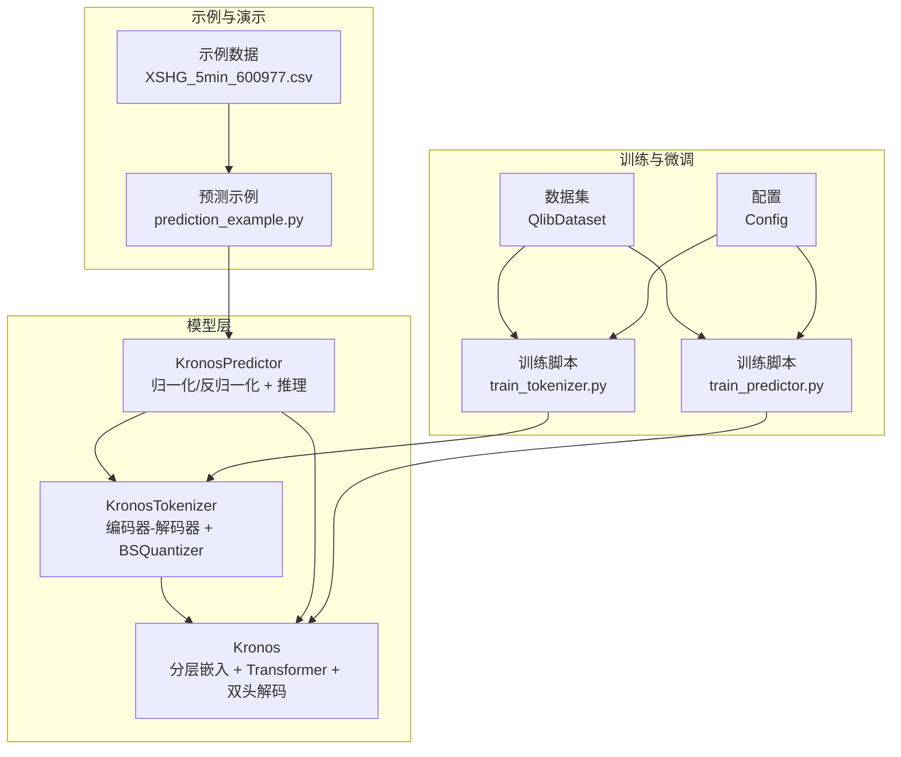
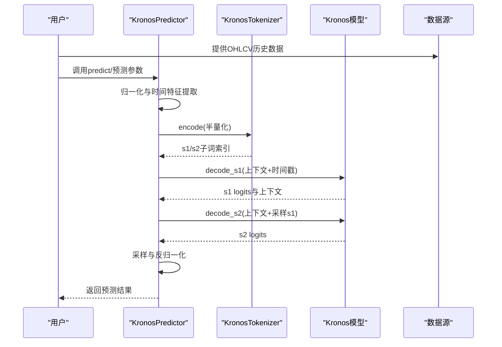
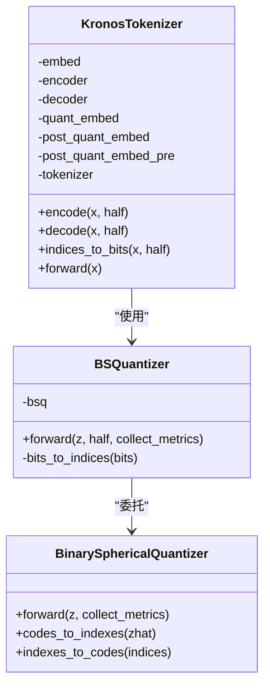
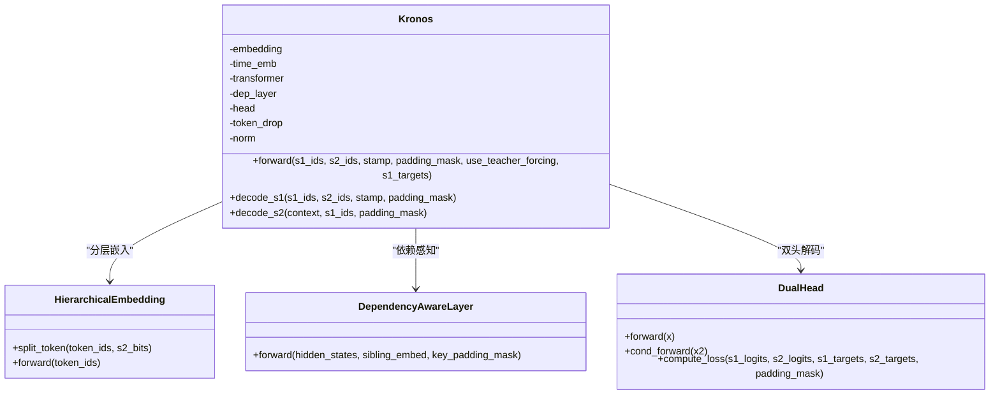
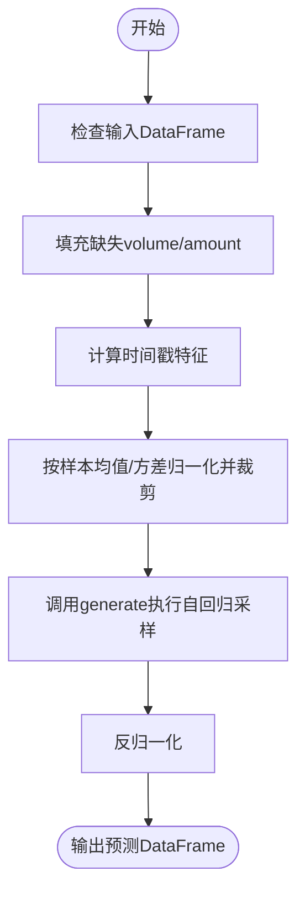
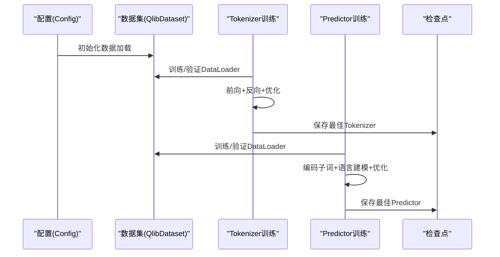
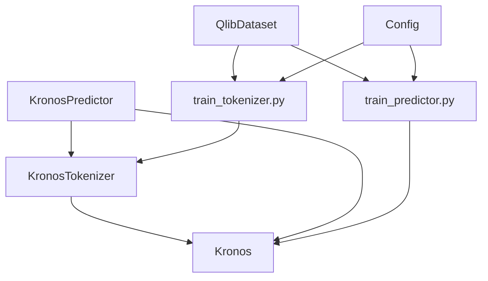

# 项目背景与动机

<cite>
**本文档引用的文件**
- [README.md](file://README.md)
- [model/kronos.py](file://model/kronos.py)
- [model/module.py](file://model/module.py)
- [finetune/train_tokenizer.py](file://finetune/train_tokenizer.py)
- [finetune/train_predictor.py](file://finetune/train_predictor.py)
- [finetune/config.py](file://finetune/config.py)
- [finetune/dataset.py](file://finetune/dataset.py)
- [finetune/qlib_data_preprocess.py](file://finetune/qlib_data_preprocess.py)
- [examples/prediction_example.py](file://examples/prediction_example.py)
</cite>

## 目录
1. [引言](#引言)
2. [项目结构](#项目结构)
3. [核心组件](#核心组件)
4. [架构总览](#架构总览)
5. [详细组件分析](#详细组件分析)
6. [依赖分析](#依赖分析)
7. [性能考虑](#性能考虑)
8. [故障排除指南](#故障排除指南)
9. [结论](#结论)
10. [附录](#附录)

## 引言
本节面向初学者与研究者，系统阐述Kronos项目开发的背景、动机与价值主张。我们将从金融K线数据的特殊性出发，解释传统金融建模方法的局限，并说明Kronos如何通过“两阶段框架”应对这些挑战，最终形成统一的金融市场语言基础模型。

- 金融K线数据的独特挑战
  - 高噪声：价格波动剧烈，包含大量随机扰动，导致信号与噪声难以区分。
  - 非平稳性：市场状态随时间变化，统计特性不稳定，传统静态模型难以适应。
  - 跳跃性与尖峰厚尾：极端事件频发，分布具有厚尾特征，常规正态假设失效。
  - 多维耦合与异构性：OHLCV多变量之间存在复杂非线性关系，且不同资产间差异显著。
  - 高维稀疏与长程依赖：高频序列通常存在长程时间依赖与稀疏模式，对建模提出更高要求。

- 传统金融建模方法的局限
  - 经典计量经济学模型（如ARIMA/GARCH）在非线性、非平稳方面表现有限，难以捕捉复杂的市场动态。
  - 机器学习方法（如XGBoost/LSTM）在多变量、长序列建模上常受过拟合与梯度问题困扰。
  - 缺乏统一的“语言”表示：不同任务（预测、风险、择时）使用不同的特征工程与数据格式，缺乏可复用的通用表征。

- Kronos的解决方案
  - 两阶段框架：先将连续多维OHLCV量化为分层离散符号，再用大语言模型对符号序列进行预训练与微调，形成统一的“金融语言”。
  - 分层离散化：通过二进球量化（Binary Spherical Quantization, BSQuantizer）将连续空间映射到离散码本，保留关键信息并降低噪声影响。
  - 双头解码器：s1/s2双子词结构，先预测高层语义子词，再条件化生成细粒度子词，提升建模效率与表达能力。
  - 时间嵌入与依赖感知：引入时间特征嵌入与跨注意力机制，增强对周期性与依赖关系的建模。

- 学术贡献与影响力
  - 首个开源金融K线基础模型，覆盖45+全球交易所数据，推动金融时间序列基础模型研究。
  - 在AAAI 2026被接收，论文已发布于arXiv，为后续研究提供理论与实践参考。

**章节来源**
- [README.md:46-67](file://README.md#L46-L67)
- [README.md:52-55](file://README.md#L52-L55)

## 项目结构
Kronos项目采用模块化设计，围绕“KronosTokenizer + Kronos模型 + 预测器”的核心管线展开，并提供完整的微调与推理示例。

**图表来源**
- [model/kronos.py:13-178](file://model/kronos.py#L13-L178)
- [model/kronos.py:180-329](file://model/kronos.py#L180-L329)
- [model/kronos.py:482-662](file://model/kronos.py#L482-L662)
- [finetune/train_tokenizer.py:218-282](file://finetune/train_tokenizer.py#L218-L282)
- [finetune/train_predictor.py:182-245](file://finetune/train_predictor.py#L182-L245)
- [finetune/dataset.py:9-146](file://finetune/dataset.py#L9-L146)
- [finetune/config.py:3-132](file://finetune/config.py#L3-L132)
- [examples/prediction_example.py:1-81](file://examples/prediction_example.py#L1-L81)

**章节来源**
- [README.md:85-215](file://README.md#L85-L215)
- [model/kronos.py:13-662](file://model/kronos.py#L13-L662)
- [finetune/train_tokenizer.py:1-282](file://finetune/train_tokenizer.py#L1-L282)
- [finetune/train_predictor.py:1-245](file://finetune/train_predictor.py#L1-L245)
- [finetune/dataset.py:1-146](file://finetune/dataset.py#L1-L146)
- [finetune/config.py:1-132](file://finetune/config.py#L1-L132)
- [examples/prediction_example.py:1-81](file://examples/prediction_example.py#L1-L81)

## 核心组件
- KronosTokenizer：将连续OHLCV序列编码为分层离散符号，包含编码器-解码器Transformer与二进球量化模块，支持半量化的s1/s2子词。
- Kronos：基于分层嵌入与Transformer的自回归语言模型，采用双头解码器分别预测s1与s2子词，并结合时间嵌入与依赖感知层。
- KronosPredictor：封装数据预处理、归一化、推理与反归一化流程，提供单序列与批量预测接口。
- 训练管线：分阶段训练，先训练Tokenizer，再训练Predictor；支持分布式数据并行与梯度累积。

**章节来源**
- [model/kronos.py:13-178](file://model/kronos.py#L13-L178)
- [model/kronos.py:180-329](file://model/kronos.py#L180-L329)
- [model/kronos.py:482-662](file://model/kronos.py#L482-L662)
- [finetune/train_tokenizer.py:74-216](file://finetune/train_tokenizer.py#L74-L216)
- [finetune/train_predictor.py:60-180](file://finetune/train_predictor.py#L60-L180)

## 架构总览
Kronos的整体架构由“离散化-语言建模-预测”三层构成，强调从连续信号到离散符号再到条件解码的语言化路径。

**图表来源**
- [model/kronos.py:389-470](file://model/kronos.py#L389-L470)
- [model/kronos.py:239-277](file://model/kronos.py#L239-L277)
- [model/kronos.py:310-329](file://model/kronos.py#L310-L329)
- [model/kronos.py:508-517](file://model/kronos.py#L508-L517)

**章节来源**
- [model/kronos.py:389-470](file://model/kronos.py#L389-L470)
- [model/kronos.py:482-662](file://model/kronos.py#L482-L662)

## 详细组件分析

### 组件A：KronosTokenizer（分层离散化）
- 设计要点
  - 编码器-解码器Transformer用于将连续OHLCV映射到离散码本维度，再经二进球量化得到s1/s2子词。
  - 支持半量化（half=True）：先用s1_bits重建，再用全码本重建，分别评估重构误差与量化损失。
  - 指数级码本规模：s1_bits与s2_bits决定s1/s2子词的词表大小，从而平衡表达力与计算成本。
- 关键流程
  - 嵌入与编码：输入经线性映射进入Transformer编码器，输出用于量化。
  - 二进球量化：对归一化后的向量进行量化，得到离散码与索引。
  - 解码与重建：将s1子词与全码本分别解码回连续空间，评估重构质量。

**图表来源**
- [model/kronos.py:13-178](file://model/kronos.py#L13-L178)
- [model/module.py:225-255](file://model/module.py#L225-L255)
- [model/module.py:39-130](file://model/module.py#L39-L130)

**章节来源**
- [model/kronos.py:13-178](file://model/kronos.py#L13-L178)
- [model/module.py:225-255](file://model/module.py#L225-L255)
- [model/module.py:39-130](file://model/module.py#L39-L130)

### 组件B：Kronos（分层嵌入与双头解码）
- 设计要点
  - 分层嵌入：将s1/s2子词分别映射到同一d_model空间并通过融合投影得到统一表示。
  - Transformer堆叠：每层包含RMSNorm、自注意力（含RoPE位置编码）、前馈网络。
  - 双头解码：s1_logits用于高层语义预测；s2_logits在给定s1条件下进行细粒度预测。
  - 依赖感知层：通过交叉注意力将s1嵌入与上下文对齐，增强条件一致性。
- 关键流程
  - 输入嵌入与时间嵌入相加后，经多层Transformer编码。
  - 解码阶段先预测s1，再以s1为条件预测s2，实现高效的语言建模。

**图表来源**
- [model/kronos.py:180-329](file://model/kronos.py#L180-L329)
- [model/module.py:400-444](file://model/module.py#L400-L444)
- [model/module.py:446-463](file://model/module.py#L446-L463)
- [model/module.py:486-514](file://model/module.py#L486-L514)

**章节来源**
- [model/kronos.py:180-329](file://model/kronos.py#L180-L329)
- [model/module.py:400-444](file://model/module.py#L400-L444)
- [model/module.py:446-463](file://model/module.py#L446-L463)
- [model/module.py:486-514](file://model/module.py#L486-L514)

### 组件C：KronosPredictor（端到端预测）
- 设计要点
  - 数据预处理：自动填充缺失的volume/amount列，计算时间戳的分钟/小时/星期/日/月特征。
  - 归一化与裁剪：按样本均值与标准差归一化，并对异常值进行裁剪。
  - 批量预测：支持多序列并行推理，独立反归一化并返回DataFrame。
- 关键流程
  - 单序列：调用generate执行自回归采样，最后反归一化。
  - 批量：将多个序列拼接为批次，统一归一化与推理，再逐序列反归一化。

**图表来源**
- [model/kronos.py:519-559](file://model/kronos.py#L519-L559)
- [model/kronos.py:562-661](file://model/kronos.py#L562-L661)

**章节来源**
- [model/kronos.py:519-559](file://model/kronos.py#L519-L559)
- [model/kronos.py:562-661](file://model/kronos.py#L562-L661)

### 组件D：训练与微调（两阶段）
- Tokenizer训练
  - 使用MSE重构损失与量化损失的加权和进行优化，支持梯度累积与学习率调度。
  - 分布式数据并行，按epoch记录验证损失并保存最佳模型。
- Predictor训练
  - 在线将输入序列编码为s1/s2子词，作为语言模型的输入与目标，分别计算s1/s2交叉熵损失。
  - 使用OneCycleLR调度器，限制梯度范数防止爆炸。

**图表来源**
- [finetune/train_tokenizer.py:74-216](file://finetune/train_tokenizer.py#L74-L216)
- [finetune/train_predictor.py:60-180](file://finetune/train_predictor.py#L60-L180)
- [finetune/dataset.py:9-146](file://finetune/dataset.py#L9-L146)
- [finetune/config.py:3-132](file://finetune/config.py#L3-L132)

**章节来源**
- [finetune/train_tokenizer.py:74-216](file://finetune/train_tokenizer.py#L74-L216)
- [finetune/train_predictor.py:60-180](file://finetune/train_predictor.py#L60-L180)
- [finetune/dataset.py:9-146](file://finetune/dataset.py#L9-L146)
- [finetune/config.py:3-132](file://finetune/config.py#L3-L132)

## 依赖分析
- 组件耦合
  - Tokenizer与Predictor通过s1/s2子词接口耦合，Predictor依赖Tokenizer的编码能力。
  - 模型内部通过分层嵌入与依赖感知层实现s1/s2的条件建模。
- 外部依赖
  - HuggingFace Hub用于模型与分词器的加载与保存。
  - Qlib用于金融数据加载与预处理。
  - 分布式训练依赖torch.distributed与DDP。

**图表来源**
- [model/kronos.py:13-178](file://model/kronos.py#L13-L178)
- [model/kronos.py:180-329](file://model/kronos.py#L180-L329)
- [model/kronos.py:482-662](file://model/kronos.py#L482-L662)
- [finetune/train_tokenizer.py:218-282](file://finetune/train_tokenizer.py#L218-L282)
- [finetune/train_predictor.py:182-245](file://finetune/train_predictor.py#L182-L245)
- [finetune/dataset.py:9-146](file://finetune/dataset.py#L9-L146)
- [finetune/config.py:3-132](file://finetune/config.py#L3-L132)

**章节来源**
- [model/kronos.py:13-662](file://model/kronos.py#L13-L662)
- [finetune/train_tokenizer.py:1-282](file://finetune/train_tokenizer.py#L1-L282)
- [finetune/train_predictor.py:1-245](file://finetune/train_predictor.py#L1-L245)
- [finetune/dataset.py:1-146](file://finetune/dataset.py#L1-L146)
- [finetune/config.py:1-132](file://finetune/config.py#L1-L132)

## 性能考虑
- 计算与内存
  - 分层离散化显著降低词表规模，s1/s2位宽控制表达力与显存占用的平衡。
  - Transformer层数与注意力头数影响计算复杂度，需根据硬件资源调整。
- 训练稳定性
  - 梯度裁剪与学习率调度有助于稳定训练过程。
  - 分布式训练中注意同步与梯度聚合的一致性。
- 推理效率
  - 自回归采样可通过温度与top-p/top-k采样控制多样性与确定性。
  - 批量预测可利用GPU并行加速，但需确保序列长度与批大小一致。

[本节为通用指导，无需特定文件引用]

## 故障排除指南
- 输入数据校验
  - 确保DataFrame包含open/high/low/close列，缺失则报错；volume/amount缺失将自动填充为0或按均价估算。
- 归一化与裁剪
  - 若出现NaN或无穷值，需检查原始数据质量；裁剪阈值过大可能抑制极端波动。
- 分布式训练
  - 确认torchrun环境变量设置正确，进程组初始化成功；不同rank的随机种子需差异化。
- 微调配置
  - lookback_window/predict_window/max_context需与模型上下文长度匹配；学习率与批大小需适配显存。

**章节来源**
- [model/kronos.py:519-559](file://model/kronos.py#L519-L559)
- [model/kronos.py:562-661](file://model/kronos.py#L562-L661)
- [finetune/train_tokenizer.py:9-32](file://finetune/train_tokenizer.py#L9-L32)
- [finetune/config.py:20-28](file://finetune/config.py#L20-L28)

## 结论
Kronos通过“两阶段框架”将金融K线数据转化为离散符号序列，并以统一的语言模型实现多任务泛化。该方法有效应对金融时间序列的高噪声、非平稳与跳跃性挑战，为量化研究提供了新的基础设施。项目已在AAAI 2026被接收，并提供完整的开源实现与微调工具链，适合从入门到进阶的各类用户。

[本节为总结性内容，无需特定文件引用]

## 附录
- 示例与演示
  - 使用示例脚本展示从数据准备到预测可视化的完整流程。
  - 提供批量预测接口，便于多资产或多时间窗口并行处理。
- 数据准备
  - 通过Qlib加载A股数据，自动计算交易量与成交额，划分训练/验证/测试集并持久化为pickle文件。

**章节来源**
- [examples/prediction_example.py:1-81](file://examples/prediction_example.py#L1-L81)
- [finetune/qlib_data_preprocess.py:14-131](file://finetune/qlib_data_preprocess.py#L14-L131)