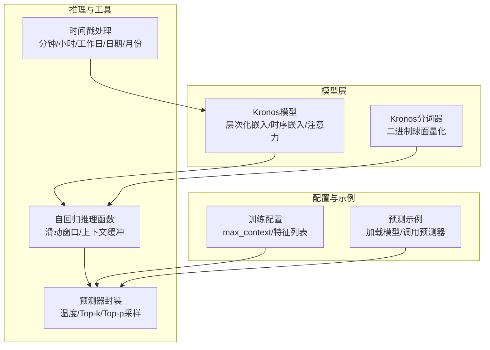
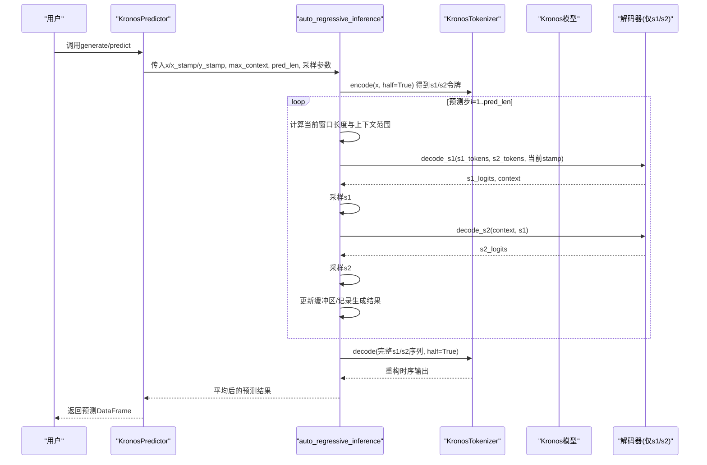
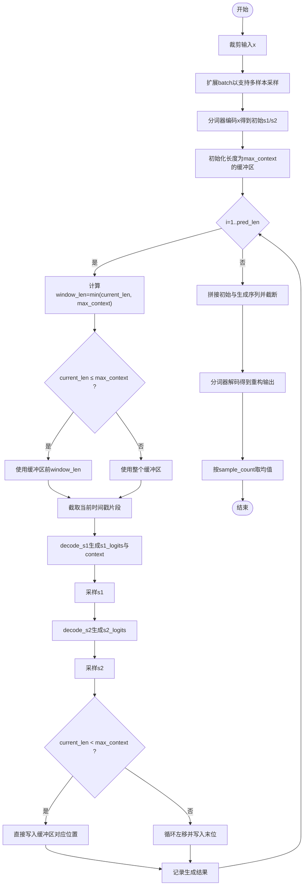
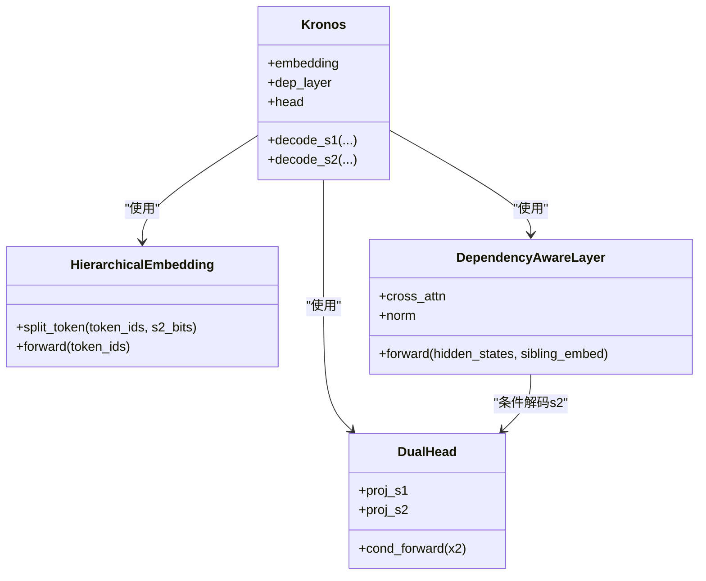
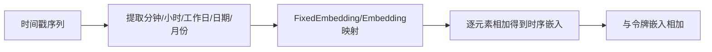
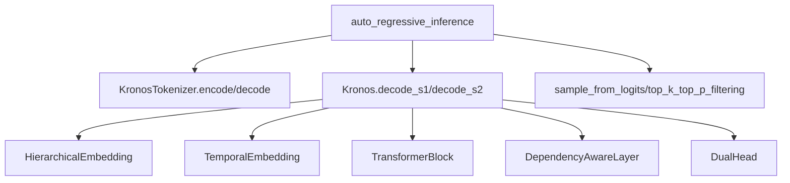

# 自回归推理机制

<cite>
**本文引用的文件**
- [model/kronos.py](file://model/kronos.py)
- [model/module.py](file://model/module.py)
- [finetune/config.py](file://finetune/config.py)
- [examples/prediction_example.py](file://examples/prediction_example.py)
</cite>

## 目录
1. [引言](#引言)
2. [项目结构](#项目结构)
3. [核心组件](#核心组件)
4. [架构总览](#架构总览)
5. [详细组件分析](#详细组件分析)
6. [依赖关系分析](#依赖关系分析)
7. [性能考量](#性能考量)
8. [故障排查指南](#故障排查指南)
9. [结论](#结论)
10. [附录](#附录)

## 引言
本技术文档聚焦于Kronos模型的自回归推理机制，系统解析auto_regressive_inference函数的实现原理与工程细节，涵盖：
- 因果掩码与注意力约束在训练与推理中的差异
- 滑动窗口与上下文缓冲区管理策略
- 层次化令牌（s1/s2）的生成流程与条件依赖建模
- 时间戳嵌入的时序特征编码与利用
- max_context参数的作用机制与内存优化策略
- 自回归采样的数学推导、数值稳定性与性能优化技巧

目标是为研究人员提供算法理论分析与实现细节的完整参考。

## 项目结构
本仓库围绕Kronos模型与推理管线展开，关键文件如下：
- model/kronos.py：包含Kronos模型、KronosTokenizer、推理函数与预测器封装
- model/module.py：包含Transformer基础模块、层次化嵌入、时序嵌入、注意力等核心组件
- finetune/config.py：训练配置与数据参数（含max_context）
- examples/prediction_example.py：使用示例，展示推理流程

图表来源
- [model/kronos.py:389-470](file://model/kronos.py#L389-L470)
- [model/module.py:400-571](file://model/module.py#L400-L571)
- [finetune/config.py:20-28](file://finetune/config.py#L20-L28)
- [examples/prediction_example.py:41-79](file://examples/prediction_example.py#L41-L79)

章节来源
- [model/kronos.py:1-663](file://model/kronos.py#L1-L663)
- [model/module.py:1-571](file://model/module.py#L1-L571)
- [finetune/config.py:1-132](file://finetune/config.py#L1-L132)
- [examples/prediction_example.py:1-81](file://examples/prediction_example.py#L1-L81)

## 核心组件
- 自回归推理函数auto_regressive_inference：负责将历史序列与未来时间戳拼接，按max_context进行滑动窗口截取，逐步生成s1/s2令牌，并通过解码器重建连续时序输出
- 层次化令牌生成：先生成s1令牌（高层语义），再以s1条件生成s2令牌（精细特征），形成s1→s2的条件依赖
- 时间戳嵌入：将分钟、小时、工作日、日期、月份映射为可加性时序嵌入，融入Transformer输入
- 上下文缓冲区：维护固定长度max_context的s1/s2令牌窗口，支持滚动更新与截断读取
- 采样策略：温度缩放与Top-k/Top-p过滤，结合多样本平均提升稳定性

章节来源
- [model/kronos.py:389-470](file://model/kronos.py#L389-L470)
- [model/module.py:400-571](file://model/module.py#L400-L571)

## 架构总览
自回归推理的端到端流程如下：

图表来源
- [model/kronos.py:389-470](file://model/kronos.py#L389-L470)
- [model/kronos.py:278-328](file://model/kronos.py#L278-L328)
- [model/kronos.py:115-177](file://model/kronos.py#L115-L177)

## 详细组件分析

### 自回归推理函数：auto_regressive_inference
- 输入与准备
  - 对输入x进行裁剪，避免异常值影响
  - 将样本复制sample_count倍，便于多样本平均
  - 合并x_stamp与y_stamp得到全时间戳序列full_stamp
  - 使用tokenizer对x进行半量化编码，得到初始s1/s2令牌序列
- 上下文缓冲区初始化
  - 创建长度为max_context的s1/s2缓冲区
  - 若初始序列长度小于等于max_context，则仅填充有效部分；否则从末尾截断
- 滑动窗口与逐步生成
  - 每一步计算当前序列长度current_seq_len与窗口长度window_len=min(current_seq_len, max_context)
  - 当current_seq_len ≤ max_context时，使用缓冲区前window_len个令牌；否则直接使用整个缓冲区
  - 截取对应的时间戳片段current_stamp作为时序输入
  - 先decode_s1得到s1_logits与context，采样得到s1，再decode_s2得到s2_logits并采样得到s2
  - 将s1/s2写入缓冲区：若未满则直接填入，否则执行循环左移并将新令牌写入末位
- 结果重建与聚合
  - 将初始令牌与生成的pred_len步令牌拼接，按max_context截断用于最终解码
  - 通过tokenizer.decode重建连续时序输出，按sample_count维度取均值得到最终预测

图表来源
- [model/kronos.py:389-470](file://model/kronos.py#L389-L470)

章节来源
- [model/kronos.py:389-470](file://model/kronos.py#L389-L470)

### 因果掩码与注意力约束
- 训练阶段：Kronos.forward中使用key_padding_mask驱动注意力掩码，确保仅关注有效位置；训练时多头注意力采用因果掩码（scaled_dot_product_attention的is_causal=True）
- 推理阶段：auto_regressive_inference不传入padding_mask，且decode_s1/decode_s2内部未显式设置因果掩码；但因s1/s2的自回归生成天然满足时序因果性，且注意力实现中对历史位置可见，因此无需额外显式因果掩码
- 注意力实现要点：MultiHeadAttentionWithRoPE与MultiHeadCrossAttentionWithRoPE在训练时启用is_causal，推理时未强制因果，但生成过程天然因果

章节来源
- [model/kronos.py:239-276](file://model/kronos.py#L239-L276)
- [model/module.py:315-397](file://model/module.py#L315-L397)
- [model/module.py:356-397](file://model/module.py#L356-L397)

### 层次化令牌生成：s1→s2的条件依赖
- 分层嵌入：HierarchicalEmbedding将复合令牌拆分为s1/s2，分别映射到不同嵌入表，再融合投影
- 条件解码：DependencyAwareLayer以s1嵌入作为查询，以Transformer隐藏态作为键/值进行交叉注意力，得到条件化的上下文表示x2，再由DualHead.cond_forward映射到s2分布
- 采样策略：sample_from_logits支持温度缩放与Top-k/Top-p过滤，确保生成多样性与稳定性

图表来源
- [model/module.py:400-444](file://model/module.py#L400-L444)
- [model/module.py:446-463](file://model/module.py#L446-L463)
- [model/module.py:486-514](file://model/module.py#L486-L514)
- [model/kronos.py:214-222](file://model/kronos.py#L214-L222)

章节来源
- [model/module.py:400-514](file://model/module.py#L400-L514)
- [model/kronos.py:214-276](file://model/kronos.py#L214-L276)

### 时间戳嵌入与时序信息利用
- 特征提取：calc_time_stamps将时间戳转换为分钟、小时、工作日、日期、月份五维特征
- 嵌入策略：TemporalEmbedding将五类离散特征分别映射到d_model维嵌入空间，按元素相加得到时序嵌入，随后与令牌嵌入相加进入Transformer
- 可学习性：learn_te控制是否使用可学习嵌入或固定正弦余弦嵌入

图表来源
- [model/kronos.py:472-479](file://model/kronos.py#L472-L479)
- [model/module.py:536-562](file://model/module.py#L536-L562)

章节来源
- [model/kronos.py:472-479](file://model/kronos.py#L472-L479)
- [model/module.py:536-562](file://model/module.py#L536-L562)

### max_context参数的作用机制与内存优化
- 作用机制
  - 控制注意力与上下文缓冲区的有效长度，限制每次推理的输入窗口大小
  - 在生成过程中动态调整窗口长度window_len=min(current_len, max_context)，避免越界
- 内存优化策略
  - 固定长度缓冲区：pre_buffer/post_buffer均为max_context长度，避免随生成长度线性增长
  - 循环左移：当缓冲区已满时，使用torch.roll进行原地滚动，仅在末位写入新令牌，降低拷贝成本
  - 截断重建：最终解码时仅使用最近max_context长度的令牌，避免累积过长序列

章节来源
- [model/kronos.py:408-454](file://model/kronos.py#L408-L454)
- [model/kronos.py:459-463](file://model/kronos.py#L459-L463)

### 数学推导与数值稳定性
- 采样过程
  - 温度缩放：logits ← logits/T，控制分布尖锐程度
  - Top-k/Top-p过滤：保留高概率质量阈值内的候选，避免极端尾部噪声
  - 多分类采样：F.softmax(logits)后进行多项式采样，确保概率归一
- 数值稳定性
  - 裁剪：对输入x进行clip，防止异常值导致梯度爆炸或推理不稳定
  - 归一化：BinarySphericalQuantizer对量化表示进行尺度归一化
  - 概率平滑：熵损失与commit损失中加入小量避免log(0)

章节来源
- [model/kronos.py:373-386](file://model/kronos.py#L373-L386)
- [model/kronos.py:331-371](file://model/kronos.py#L331-L371)
- [model/module.py:82-129](file://model/module.py#L82-L129)

### 性能优化技巧
- 多样本并行：通过sample_count复制batch维度，一次推理生成多个样本，随后取均值，减少重复计算
- 缓冲区原地更新：使用torch.roll进行循环左移，避免频繁分配新张量
- 窗口截断：仅使用最近max_context长度的令牌参与解码，降低计算复杂度
- 采样参数调节：合理设置T、top_k、top_p，平衡多样性与稳定性

章节来源
- [model/kronos.py:394-396](file://model/kronos.py#L394-L396)
- [model/kronos.py:451-454](file://model/kronos.py#L451-L454)
- [model/kronos.py:459-463](file://model/kronos.py#L459-L463)

## 依赖关系分析
- auto_regressive_inference依赖KronosTokenizer.encode/decode与Kronos.decode_s1/decode_s2
- Kronos模型依赖HierarchicalEmbedding、TemporalEmbedding、TransformerBlock、RMSNorm、DependencyAwareLayer、DualHead
- 采样函数依赖top_k_top_p_filtering与F.softmax/multinomial

图表来源
- [model/kronos.py:389-470](file://model/kronos.py#L389-L470)
- [model/kronos.py:278-328](file://model/kronos.py#L278-L328)
- [model/module.py:400-514](file://model/module.py#L400-L514)

章节来源
- [model/kronos.py:389-470](file://model/kronos.py#L389-L470)
- [model/module.py:400-514](file://model/module.py#L400-L514)

## 性能考量
- 计算复杂度
  - 单步生成涉及注意力与两层解码，整体复杂度近似O(max_context^2·d_model)每步
  - 通过max_context限制窗口，显著降低复杂度
- 内存占用
  - 固定长度缓冲区与原地滚动更新，内存峰值稳定在O(B·max_context·(s1_bits+s2_bits))
- 批处理与并行
  - sample_count倍batch扩展与均值聚合，适合GPU并行与批内平均

[本节为通用性能讨论，不直接分析具体文件]

## 故障排查指南
- 输入形状不匹配
  - 确保x、x_stamp、y_stamp的batch与序列长度一致；y_stamp长度应等于pred_len
- NaN或异常值
  - 预处理阶段已进行裁剪与缺失值填充；如仍出现NaN，请检查原始数据
- 时间戳维度
  - 时序嵌入要求五维特征：分钟、小时、工作日、日期、月份；请确认calc_time_stamps输出维度正确
- max_context过小
  - 过小可能导致上下文不足，建议根据任务时长与周期性调整至合适值（如512）

章节来源
- [model/kronos.py:519-559](file://model/kronos.py#L519-L559)
- [model/kronos.py:472-479](file://model/kronos.py#L472-L479)
- [finetune/config.py:20-28](file://finetune/config.py#L20-L28)

## 结论
本文系统梳理了Kronos自回归推理机制，重点阐述了auto_regressive_inference的滑动窗口与上下文缓冲区管理、层次化令牌的条件依赖建模、时间戳嵌入的时序特征利用，以及max_context的内存优化策略。通过因果掩码、Top-k/Top-p采样与温度缩放，实现了高效稳定的自回归生成。该机制为金融多变量时序预测提供了清晰的工程实现路径与理论依据。

[本节为总结性内容，不直接分析具体文件]

## 附录
- 使用示例：examples/prediction_example.py展示了如何加载模型、构造时间戳、调用预测器并可视化结果
- 配置参数：finetune/config.py定义了max_context、特征列表与采样参数等关键超参

章节来源
- [examples/prediction_example.py:41-79](file://examples/prediction_example.py#L41-L79)
- [finetune/config.py:20-28](file://finetune/config.py#L20-L28)