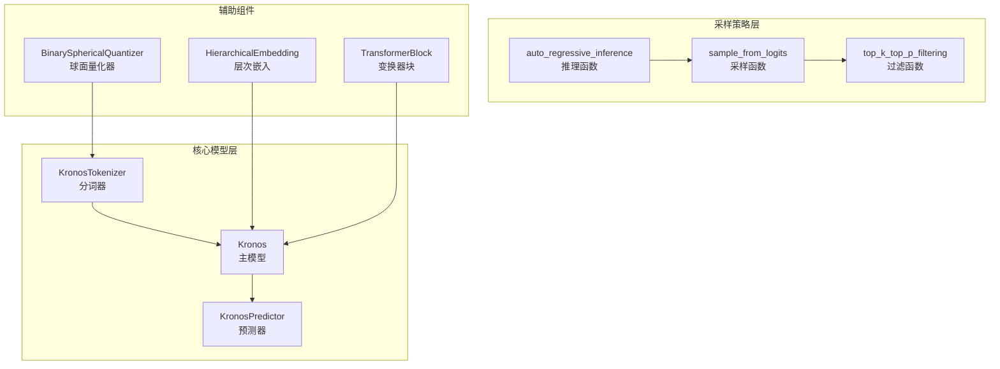
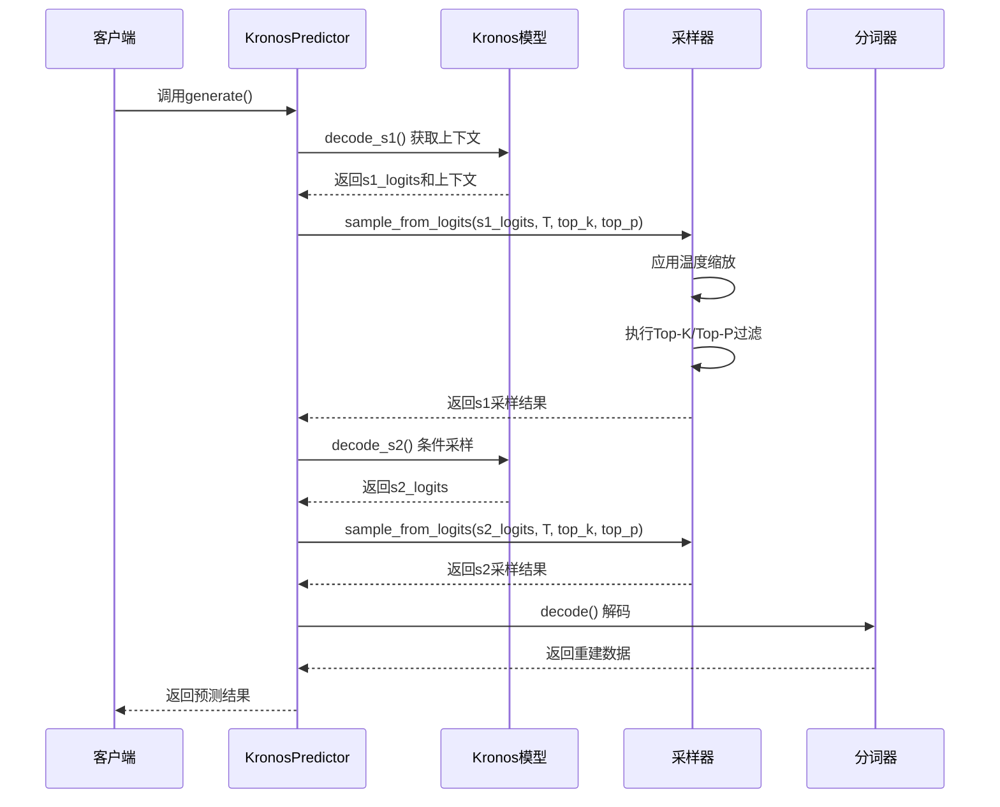
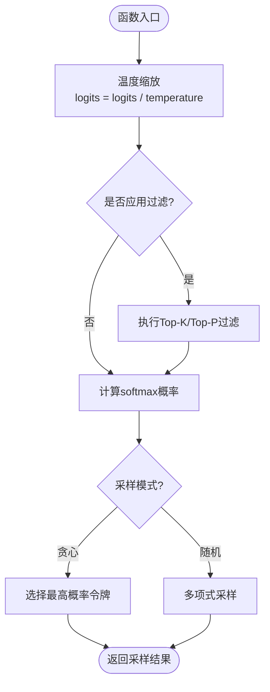
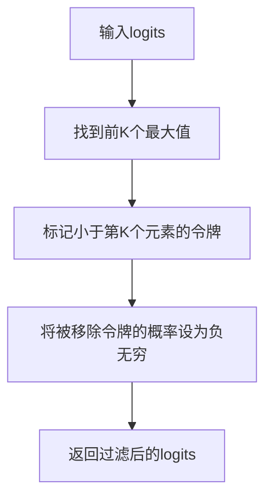
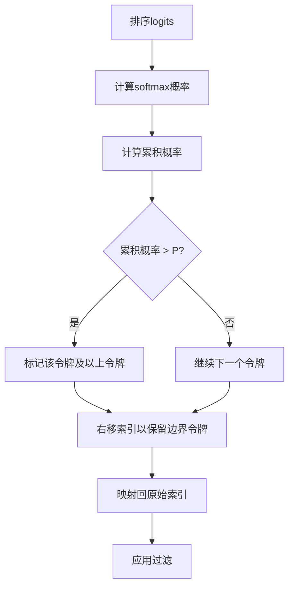
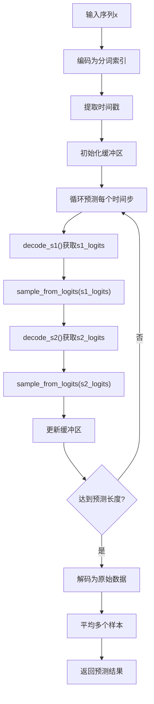
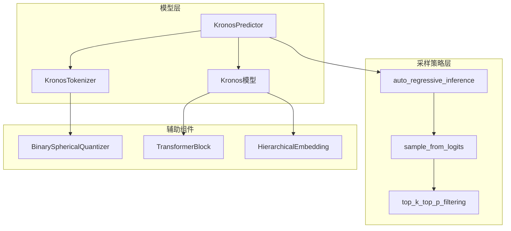

# 采样策略详解

<cite>
**本文档引用的文件**
- [model/kronos.py](file://model/kronos.py)
- [model/module.py](file://model/module.py)
- [README.md](file://README.md)
- [examples/prediction_example.py](file://examples/prediction_example.py)
- [tests/test_kronos_regression.py](file://tests/test_kronos_regression.py)
</cite>

## 目录
1. [简介](#简介)
2. [项目结构](#项目结构)
3. [核心组件](#核心组件)
4. [架构概览](#架构概览)
5. [详细组件分析](#详细组件分析)
6. [依赖关系分析](#依赖关系分析)
7. [性能考虑](#性能考虑)
8. [故障排除指南](#故障排除指南)
9. [结论](#结论)

## 简介

Kronos是一个专为金融K线数据设计的基础模型，采用独特的两阶段框架：首先通过专门的分词器将连续的多维K线数据（OHLCV）量化为层次化的离散令牌，然后在这些令牌上进行预训练，使其能够服务于多样化的量化任务。本文档专注于Kronos中的采样策略实现，特别是`sample_from_logits`函数的机制，深入解释温度缩放、Top-K过滤和核采样的组合策略。

## 项目结构

Kronos项目采用模块化设计，主要包含以下关键组件：



**图表来源**
- [model/kronos.py:13-178](file://model/kronos.py#L13-L178)
- [model/kronos.py:331-386](file://model/kronos.py#L331-L386)
- [model/module.py:400-484](file://model/module.py#L400-L484)

**章节来源**
- [model/kronos.py:13-178](file://model/kronos.py#L13-L178)
- [model/module.py:1-571](file://model/module.py#L1-571)

## 核心组件

### 采样策略核心函数

Kronos实现了完整的采样策略体系，主要包括以下核心组件：

#### 温度缩放（Temperature Scaling）
温度缩放在采样过程中起到关键作用，通过调整logits的尺度来控制输出分布的平滑程度：
- **T = 1.0**：原始分布，平衡探索与利用
- **T < 1.0**：分布更尖锐，增加确定性
- **T > 1.0**：分布更平滑，增加多样性

#### Top-K过滤
Top-K过滤保留概率最高的K个令牌，有效减少计算复杂度并提高质量：
- 防止极端低概率令牌影响
- 控制候选集大小
- 保持至少min_tokens_to_keep个令牌

#### 核采样（Top-P/Nucleus Sampling）
核采样基于累积概率阈值选择令牌集合：
- 选择累积概率达到阈值P的最小令牌集合
- 自适应调整候选集大小
- 保持语义连贯性

**章节来源**
- [model/kronos.py:331-386](file://model/kronos.py#L331-L386)

## 架构概览

Kronos的采样策略在整个推理流程中发挥着重要作用：



**图表来源**
- [model/kronos.py:389-469](file://model/kronos.py#L389-L469)
- [model/kronos.py:508-517](file://model/kronos.py#L508-L517)

## 详细组件分析

### sample_from_logits函数实现

`sample_from_logits`是Kronos采样的核心函数，实现了完整的采样流程：

#### 数学原理

温度缩放的数学表达式为：
```
P(token_i) ∝ exp(logit_i / T) / Σ_j exp(logit_j / T)
```

其中T为温度参数，控制分布的熵值。

#### 实现细节



**图表来源**
- [model/kronos.py:373-386](file://model/kronos.py#L373-L386)

#### 参数配置

| 参数 | 类型 | 默认值 | 说明 |
|------|------|--------|------|
| temperature | float | 1.0 | 温度参数，控制分布平滑度 |
| top_k | int | None | Top-K过滤阈值 |
| top_p | float | None | Top-P过滤阈值 |
| sample_logits | bool | True | 是否进行随机采样 |

**章节来源**
- [model/kronos.py:373-386](file://model/kronos.py#L373-L386)

### top_k_top_p_filtering过滤机制

过滤函数实现了Top-K和核采样的组合策略：

#### Top-K过滤算法



**图表来源**
- [model/kronos.py:347-352](file://model/kronos.py#L347-L352)

#### 核采样算法

核采样基于累积概率的自适应阈值选择：



**图表来源**
- [model/kronos.py:354-370](file://model/kronos.py#L354-L370)

#### 最小保留令牌保护机制

为了确保采样的多样性，实现包含了最小保留令牌数量的保护机制：
- `min_tokens_to_keep`参数确保至少保留指定数量的令牌
- 防止过滤过程过于激进导致信息丢失
- 维持采样的稳定性和可靠性

**章节来源**
- [model/kronos.py:331-370](file://model/kronos.py#L331-L370)

### 采样策略组合策略

Kronos实现了多种采样策略的灵活组合：

#### 贪心解码（Greedy Decoding）
- **参数设置**：`top_k=1, top_p=1.0`
- **特点**：总是选择概率最高的令牌
- **适用场景**：需要确定性结果的任务
- **性能**：最快，但缺乏多样性

#### 随机采样（Random Sampling）
- **参数设置**：`T>0, top_k=0, top_p=1.0`
- **特点**：完全随机的令牌选择
- **适用场景**：创意生成、艺术创作
- **性能**：中等速度，高多样性

#### 混合采样（Hybrid Sampling）
- **参数设置**：`0<T<1, 0<top_k<词汇表大小, 0<top_p<1.0`
- **特点**：平衡探索与利用
- **适用场景**：大多数实际应用
- **性能**：平衡的速度和质量

**章节来源**
- [tests/test_kronos_regression.py:75-80](file://tests/test_kronos_regression.py#L75-L80)

### 自回归推理流程

Kronos的自动回归推理过程展示了采样策略的实际应用：



**图表来源**
- [model/kronos.py:389-469](file://model/kronos.py#L389-L469)

**章节来源**
- [model/kronos.py:389-469](file://model/kronos.py#L389-L469)

## 依赖关系分析

采样策略与其他组件的依赖关系：



**图表来源**
- [model/kronos.py:180-329](file://model/kronos.py#L180-L329)
- [model/module.py:400-484](file://model/module.py#L400-L484)

**章节来源**
- [model/kronos.py:180-329](file://model/kronos.py#L180-L329)
- [model/module.py:400-484](file://model/module.py#L400-L484)

## 性能考虑

### 计算复杂度分析

采样策略的计算复杂度主要取决于以下因素：

1. **温度缩放**：O(V)，其中V为词汇表大小
2. **Top-K过滤**：O(V log K)
3. **核采样**：O(V log V)
4. **softmax计算**：O(V)

### 内存优化策略

- **批量处理**：支持并行采样多个路径
- **缓冲区管理**：动态调整上下文窗口大小
- **梯度禁用**：推理时禁用梯度计算

### 采样参数调优指南

#### 温度参数（T）调优

| T范围 | 特征 | 推荐应用场景 |
|-------|------|-------------|
| 0.1-0.3 | 极度确定性 | 严格要求准确性的任务 |
| 0.3-0.7 | 平衡状态 | 一般预测任务 |
| 0.7-1.0 | 中等多样性 | 创意生成 |
| 1.0-1.3 | 高度多样性 | 风险评估 |

#### Top-K参数调优

- **小值（10-50）**：提高准确性，降低多样性
- **中等值（100-500）**：平衡效果
- **大值（>1000）**：增强多样性

#### Top-P参数调优

- **低值（0.8-0.9）**：保守采样
- **中等值（0.9-0.95）**：推荐范围
- **高值（>0.95）**：开放采样

## 故障排除指南

### 常见问题及解决方案

#### 采样结果质量差

**可能原因**：
- 温度过低导致过度确定性
- 过度严格的Top-K过滤
- 核采样阈值不当

**解决方案**：
```python
# 调整采样参数
pred_df = predictor.predict(
    df=x_df,
    x_timestamp=x_timestamp,
    y_timestamp=y_timestamp,
    pred_len=pred_len,
    T=0.7,      # 适度温度
    top_k=100,   # 合理的Top-K
    top_p=0.95,  # 较高的核采样阈值
    sample_count=5  # 多样本集成
)
```

#### 收敛性问题

**症状**：预测结果不稳定或发散

**诊断步骤**：
1. 检查温度参数是否合理
2. 验证Top-K和Top-P参数的组合
3. 确认sample_count是否足够

**解决方案**：
- 使用较大的sample_count进行平均
- 逐步调整温度参数
- 结合多种采样策略

#### 性能问题

**优化建议**：
- 减少sample_count以提高速度
- 使用更大的top_k值
- 关闭verbose模式

**章节来源**
- [examples/prediction_example.py:60-69](file://examples/prediction_example.py#L60-L69)

## 结论

Kronos的采样策略实现了温度缩放、Top-K过滤和核采样的有机结合，为金融时间序列预测提供了灵活而强大的工具。通过合理的参数调优和策略组合，可以在准确性、多样性和效率之间找到最佳平衡点。

### 最佳实践总结

1. **参数调优**：从T=0.7, top_k=100, top_p=0.95开始，根据具体任务调整
2. **策略选择**：一般任务使用混合采样，严格任务使用贪心解码
3. **性能优化**：合理设置sample_count，避免过度计算
4. **质量保证**：使用多个样本的平均值作为最终预测

### 实验建议

1. **基准测试**：使用标准数据集验证不同参数组合的效果
2. **消融研究**：单独测试每种采样策略的影响
3. **可视化分析**：观察采样路径的多样性变化
4. **A/B测试**：比较不同策略在业务指标上的表现

通过深入理解和正确应用这些采样策略，用户可以充分发挥Kronos在金融预测任务中的潜力，获得高质量且可靠的预测结果。