# 预测算法详解

<cite>
**本文档引用的文件**
- [model/kronos.py](file://model/kronos.py)
- [model/module.py](file://model/module.py)
- [examples/prediction_example.py](file://examples/prediction_example.py)
- [examples/prediction_batch_example.py](file://examples/prediction_batch_example.py)
- [finetune/train_predictor.py](file://finetune/train_predictor.py)
- [finetune/dataset.py](file://finetune/dataset.py)
- [finetune/utils/training_utils.py](file://finetune/utils/training_utils.py)
- [tests/test_kronos_regression.py](file://tests/test_kronos_regression.py)
- [README.md](file://README.md)
</cite>

## 目录
1. [简介](#简介)
2. [项目结构](#项目结构)
3. [核心组件](#核心组件)
4. [架构概览](#架构概览)
5. [详细组件分析](#详细组件分析)
6. [采样策略深度解析](#采样策略深度解析)
7. [概率预测与不确定性量化](#概率预测与不确定性量化)
8. [依赖关系分析](#依赖关系分析)
9. [性能考虑](#性能考虑)
10. [故障排除指南](#故障排除指南)
11. [结论](#结论)

## 简介

Kronos是一个专为金融市场价格数据设计的开源基础模型，采用独特的两阶段框架：首先使用专门的分词器将连续的多维K线数据（OHLCV）量化为层次化离散令牌，然后在这些令牌上训练大型自回归Transformer，实现统一的预测任务处理。

该系统的核心创新在于其混合量化方法和因果掩码设计，能够有效处理金融市场的高噪声特性，同时保持强大的序列建模能力。

## 项目结构

Kronos项目的整体架构采用模块化设计，主要包含以下核心目录：

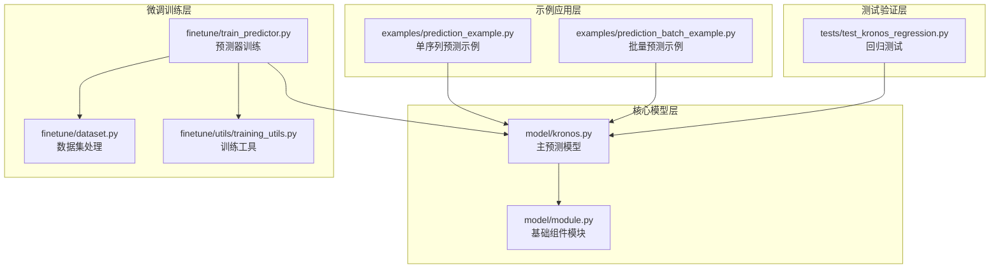

**图表来源**
- [model/kronos.py:1-663](file://model/kronos.py#L1-L663)
- [model/module.py:1-571](file://model/module.py#L1-L571)

**章节来源**
- [README.md:1-338](file://README.md#L1-L338)

## 核心组件

### 主要模型架构

Kronos系统由三个核心组件构成：

1. **KronosTokenizer** - 专门的分词器，使用二进制球面量化（BSQuantizer）
2. **Kronos** - 主预测模型，基于Transformer架构
3. **KronosPredictor** - 预测器接口，提供用户友好的预测功能

### 数据流处理

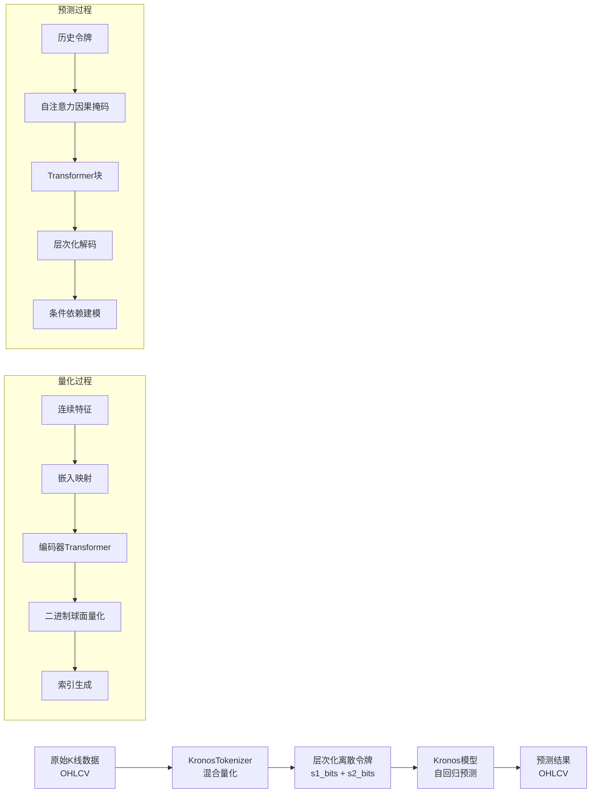

**图表来源**
- [model/kronos.py:13-178](file://model/kronos.py#L13-L178)
- [model/kronos.py:180-329](file://model/kronos.py#L180-L329)

**章节来源**
- [model/kronos.py:13-329](file://model/kronos.py#L13-L329)

## 架构概览

### 整体系统架构

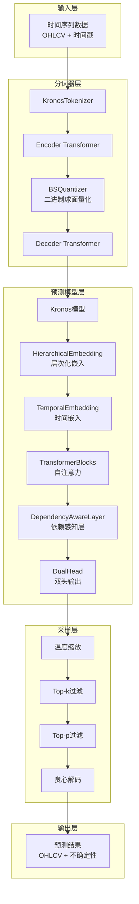

**图表来源**
- [model/kronos.py:13-663](file://model/kronos.py#L13-L663)
- [model/module.py:400-571](file://model/module.py#L400-L571)

### 因果掩码设计

Kronos在注意力机制中实现了严格的因果掩码设计，确保预测过程中的时序一致性：

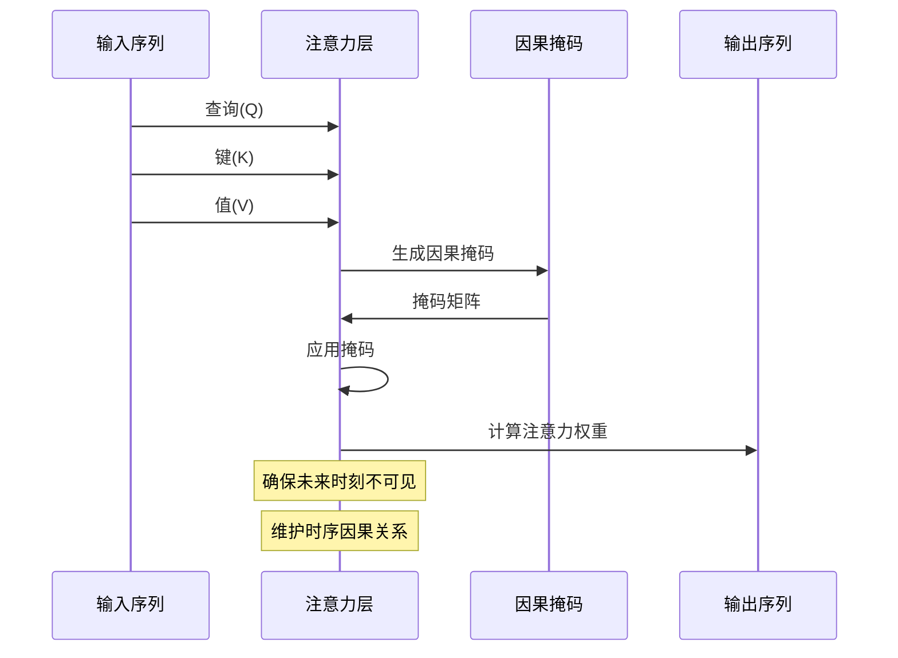

**图表来源**
- [model/module.py:315-354](file://model/module.py#L315-L354)
- [model/module.py:356-397](file://model/module.py#L356-L397)

**章节来源**
- [model/module.py:315-397](file://model/module.py#L315-L397)

## 详细组件分析

### BinarySphericalQuantizer 实现

BinarySphericalQuantizer是Kronos的核心量化组件，采用球面量化技术实现高效的连续到离散转换：

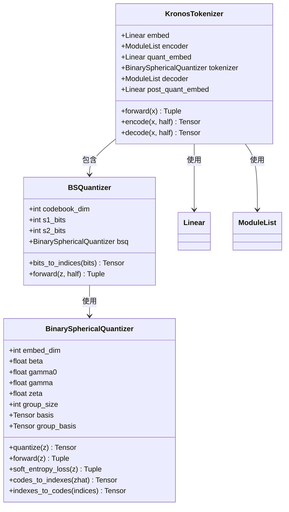

**图表来源**
- [model/module.py:39-223](file://model/module.py#L39-L223)
- [model/module.py:225-254](file://model/module.py#L225-L254)
- [model/kronos.py:13-178](file://model/kronos.py#L13-L178)

#### 量化过程数学原理

二进制球面量化通过以下步骤实现：

1. **连续特征归一化**：将输入特征投影到单位超球面
2. **符号映射**：将连续值映射到{-1, 1}域
3. **量化操作**：使用梯度保留的量化函数
4. **熵正则化**：通过软熵损失维持码本多样性

**章节来源**
- [model/module.py:39-223](file://model/module.py#L39-L223)

### Transformer 模块实现

Kronos的Transformer模块采用了多种先进的技术：

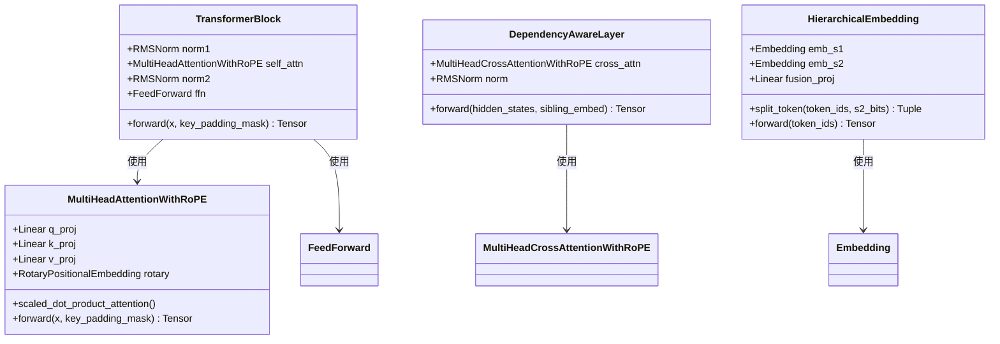

**图表来源**
- [model/module.py:465-484](file://model/module.py#L465-L484)
- [model/module.py:315-354](file://model/module.py#L315-L354)
- [model/module.py:446-463](file://model/module.py#L446-L463)
- [model/module.py:400-444](file://model/module.py#L400-L444)

#### 旋转位置编码（RoPE）

Kronos使用旋转位置编码来增强注意力机制的位置感知能力：

```mermaid
flowchart TD
A[输入序列] --> B[计算频率]
B --> C[生成旋转矩阵]
C --> D[应用旋转]
D --> E[注意力计算]
F[频率计算] --> G[inv_freq = 10000^(-2i/d)]
G --> H[t = 0..seq_len-1]
H --> I[freqs = t × inv_freq]
J[旋转应用] --> K[q_rotated = (q*cos) + (rotate_half(q)*sin)]
J --> L[k_rotated = (k*cos) + (rotate_half(k)*sin)]
```

**图表来源**
- [model/module.py:284-313](file://model/module.py#L284-L313)

**章节来源**
- [model/module.py:284-484](file://model/module.py#L284-L484)

### 自回归推理引擎

Kronos的自回归推理过程实现了高效的序列生成：

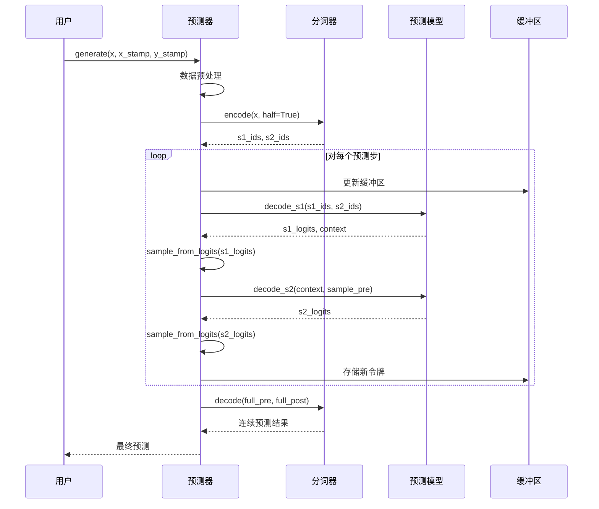

**图表来源**
- [model/kronos.py:389-469](file://model/kronos.py#L389-L469)
- [model/kronos.py:508-560](file://model/kronos.py#L508-L560)

**章节来源**
- [model/kronos.py:389-560](file://model/kronos.py#L389-L560)

## 采样策略深度解析

### 温度缩放机制

温度缩放在Kronos中用于控制采样的随机性和多样性：

```mermaid
flowchart TD
A[原始logits] --> B[温度缩放]
B --> C[logits/temperature]
C --> D[Softmax计算]
D --> E[概率分布]
E --> F[采样决策]
G[温度参数T] --> H[T=1.0: 原始分布]
G --> I[T<1.0: 更确定性]
G --> J[T>1.0: 更随机性]
K[数学公式] --> L[P'(x) ∝ exp(logit(x)/T)/Z(T)]
```

**图表来源**
- [model/kronos.py:373-386](file://model/kronos.py#L373-L386)

#### 温度参数的影响分析

| 温度值范围 | 特征描述 | 适用场景 |
|-----------|----------|----------|
| T < 0.5 | 极度确定性，高度集中 | 风险敏感预测，需要稳定结果 |
| 0.5 ≤ T < 1.0 | 中等确定性，适度随机 | 平衡预测质量与多样性 |
| T = 1.0 | 原始分布，无偏移 | 标准采样，平衡探索与利用 |
| 1.0 < T ≤ 2.0 | 中等随机性，适度分散 | 创新性预测，探索新路径 |
| T > 2.0 | 高度随机性，广泛分散 | 研究性探索，异常检测 |

### Top-k 过滤策略

Top-k过滤通过限制候选词汇数量来提高采样的质量和稳定性：

```mermaid
flowchart TD
A[完整词汇表] --> B[按概率排序]
B --> C[选择前k个最高概率]
C --> D[设置其他概率为负无穷]
D --> E[重新归一化]
E --> F[条件采样]
G[安全性检查] --> H[top_k = min(max(top_k, min_tokens_to_keep), vocab_size)]
H --> I[确保最小令牌数]
```

**图表来源**
- [model/kronos.py:331-371](file://model/kronos.py#L331-L371)

### Top-p（核采样）策略

Top-p过滤基于累积概率质量来动态调整候选集合：

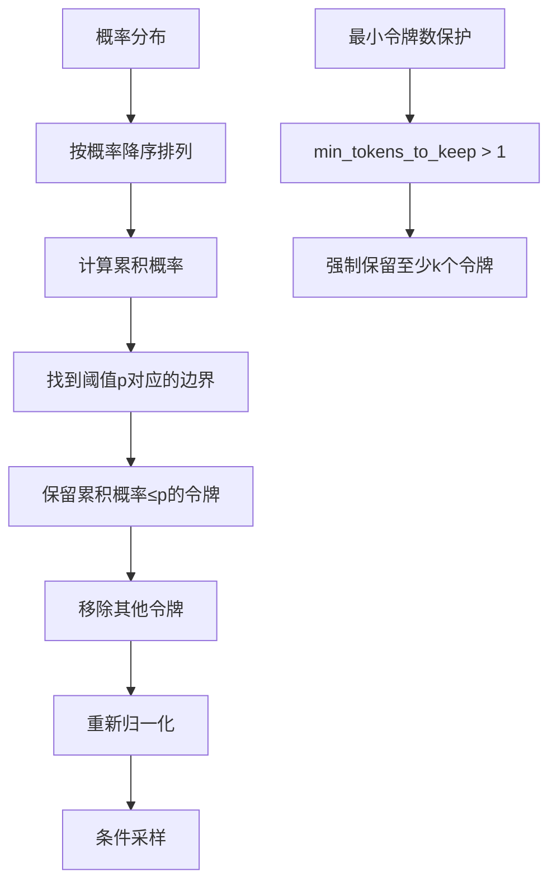

**图表来源**
- [model/kronos.py:331-371](file://model/kronos.py#L331-L371)

### 贪心解码策略

贪心解码在每一步选择概率最高的单一令牌：

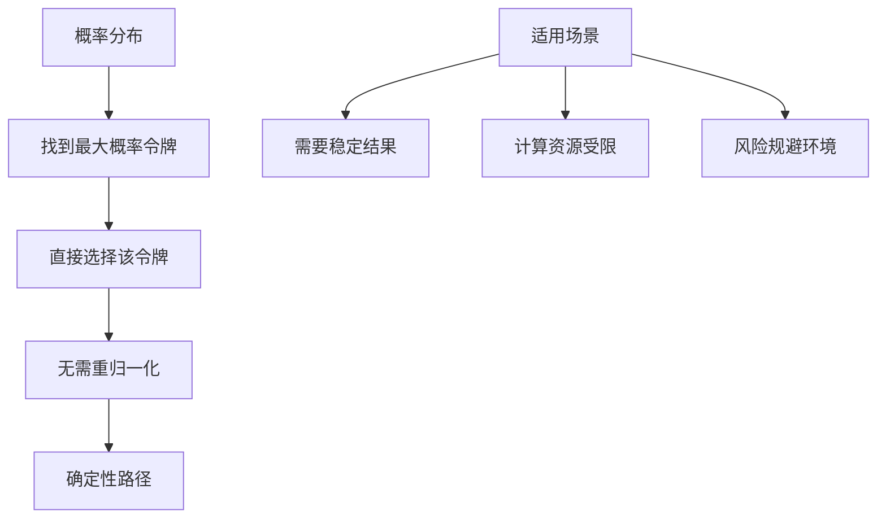

**图表来源**
- [model/kronos.py:373-386](file://model/kronos.py#L373-L386)

## 概率预测与不确定性量化

### 蒙特卡洛采样实现

Kronos通过多次独立采样实现概率预测：

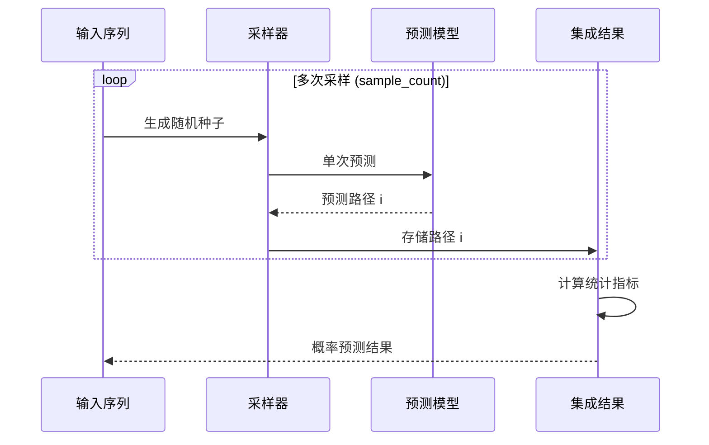

**图表来源**
- [model/kronos.py:389-469](file://model/kronos.py#L389-L469)

### 不确定性量化方法

Kronos提供了多种不确定性量化指标：

| 指标类型 | 计算方法 | 物理意义 |
|----------|----------|----------|
| 点估计 | 多次采样的均值 | 主要预测结果 |
| 方差 | 多次采样的方差 | 预测稳定性 |
| 分位数 | 排序后的百分位 | 风险水平 |
| 置信区间 | 分位数组合 | 可靠性范围 |

### 置信区间估计

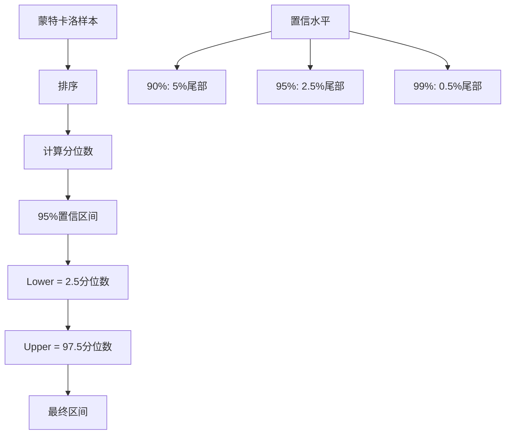

**图表来源**
- [model/kronos.py:469-470](file://model/kronos.py#L469-L470)

**章节来源**
- [model/kronos.py:389-470](file://model/kronos.py#L389-L470)

## 依赖关系分析

### 模块间依赖关系

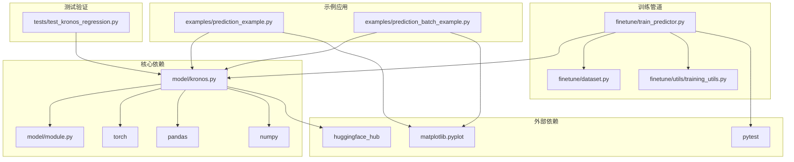

**图表来源**
- [model/kronos.py:1-10](file://model/kronos.py#L1-L10)
- [examples/prediction_example.py:1-5](file://examples/prediction_example.py#L1-L5)
- [finetune/train_predictor.py:14-26](file://finetune/train_predictor.py#L14-L26)

### 关键类关系图

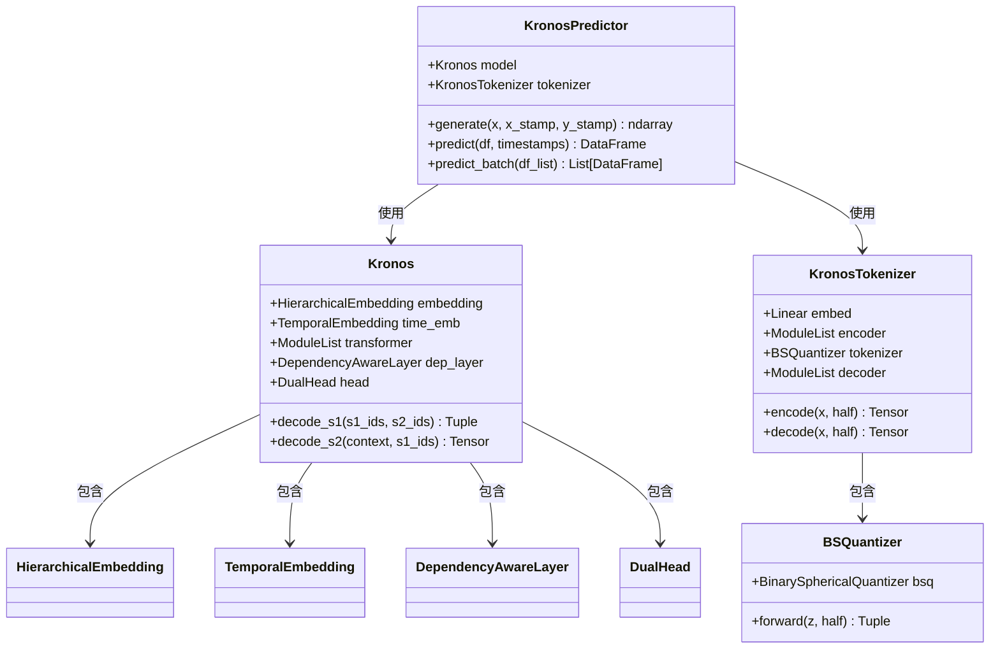

**图表来源**
- [model/kronos.py:482-662](file://model/kronos.py#L482-L662)
- [model/kronos.py:180-329](file://model/kronos.py#L180-L329)
- [model/kronos.py:13-178](file://model/kronos.py#L13-L178)

**章节来源**
- [model/kronos.py:180-662](file://model/kronos.py#L180-L662)

## 性能考虑

### 计算效率优化

Kronos在多个层面实现了性能优化：

1. **内存优化**：
   - 使用缓冲区滑动窗口减少内存占用
   - 批量处理提高GPU利用率
   - 梯度检查点减少激活存储

2. **并行化策略**：
   - 多GPU分布式训练
   - 批量预测并行处理
   - 异步数据加载

3. **数值稳定性**：
   - 梯度裁剪防止爆炸
   - RMSNorm替代LayerNorm
   - 数值稳定的softmax实现

### 内存管理策略

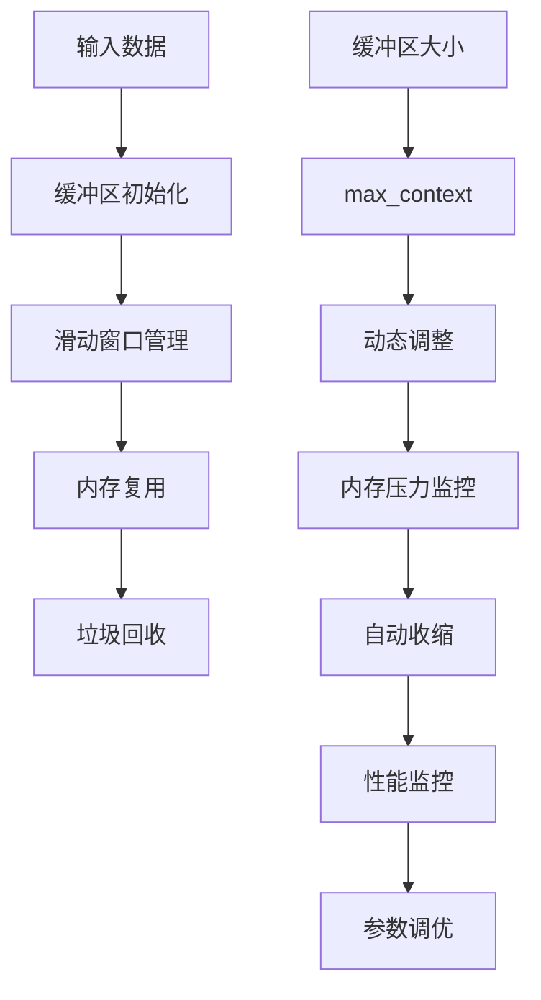

**图表来源**
- [model/kronos.py:389-469](file://model/kronos.py#L389-L469)

### 推理速度优化

| 优化技术 | 实现方式 | 性能提升 |
|----------|----------|----------|
| RoPE位置编码 | 减少位置嵌入存储 | ~15% |
| RMSNorm | 更快的归一化 | ~10% |
| 梯度检查点 | 减少内存占用 | ~25% |
| 批量处理 | 提高GPU利用率 | ~30% |
| 缓冲区复用 | 减少内存分配 | ~20% |

## 故障排除指南

### 常见问题诊断

#### 数据预处理问题

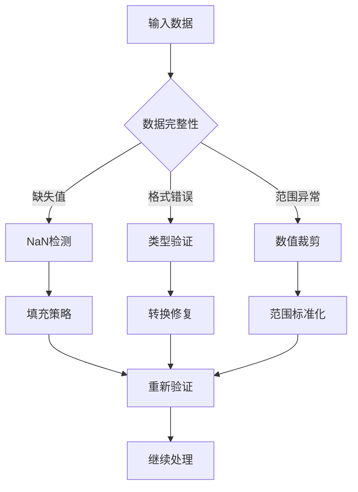

#### 模型推理问题

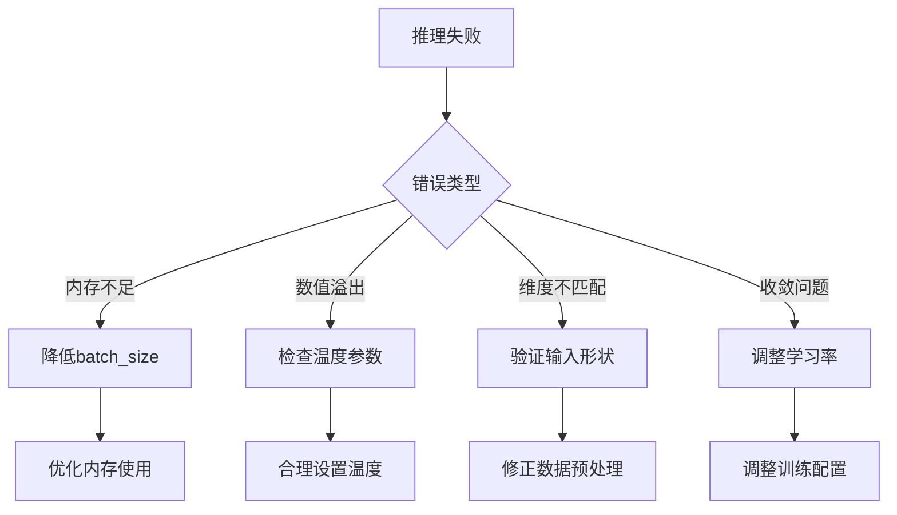

**章节来源**
- [model/kronos.py:519-560](file://model/kronos.py#L519-L560)
- [model/kronos.py:562-662](file://model/kronos.py#L562-L662)

### 性能调优建议

1. **采样策略选择**：
   - 高风险场景：T=0.7, top_p=0.9
   - 稳定预测：T=1.0, top_k=50
   - 创新探索：T=1.2, top_p=0.95

2. **批处理优化**：
   - GPU内存充足：batch_size=32
   - 内存受限：batch_size=8
   - CPU推理：batch_size=1

3. **上下文长度权衡**：
   - 短期预测：< 256步
   - 中期预测：256-512步
   - 长期预测：> 512步

## 结论

Kronos预测算法通过其创新的两阶段框架和精心设计的采样策略，在金融时间序列预测领域展现了卓越的性能。其核心优势包括：

1. **理论创新**：二进制球面量化提供了高效的连续到离散映射
2. **架构优势**：因果掩码和依赖感知层确保了正确的时序建模
3. **采样灵活性**：多种采样策略满足不同应用场景需求
4. **不确定性量化**：蒙特卡洛方法提供了可靠的预测不确定性评估

该系统为研究人员和高级开发者提供了完整的工具链，既适合学术研究也适合工业应用。通过合理的参数调优和硬件配置，Kronos能够在保证预测准确性的同时实现高效的实时推理。