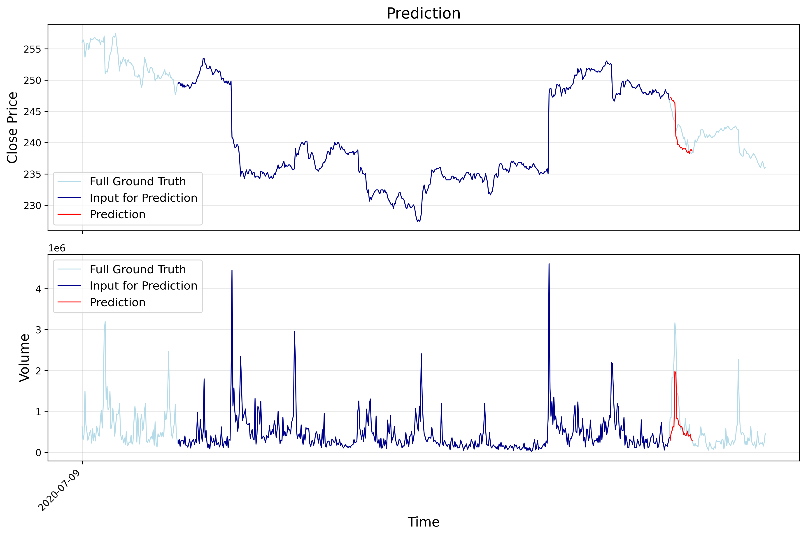
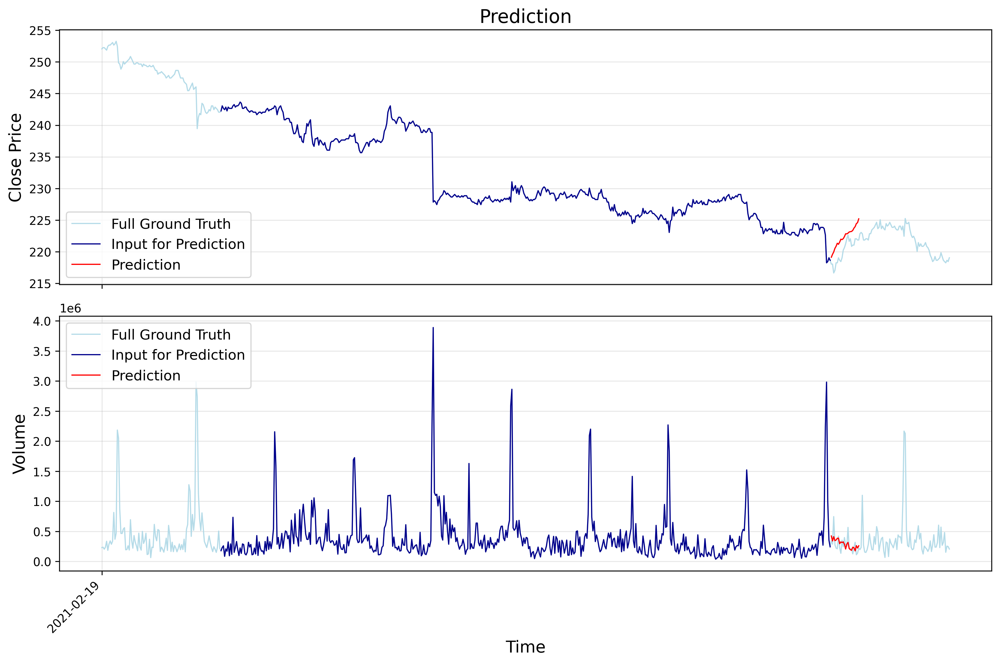
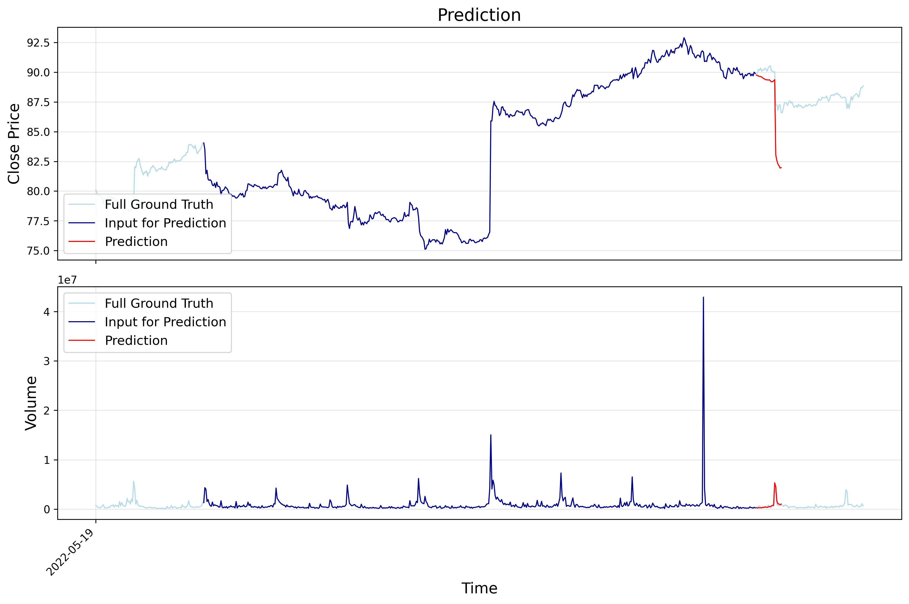
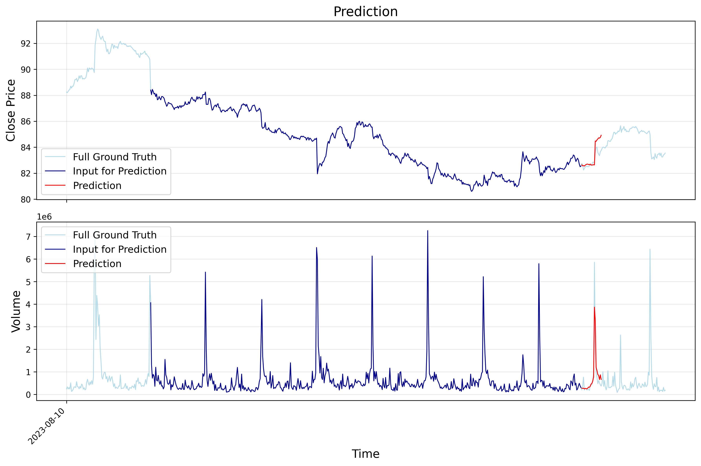
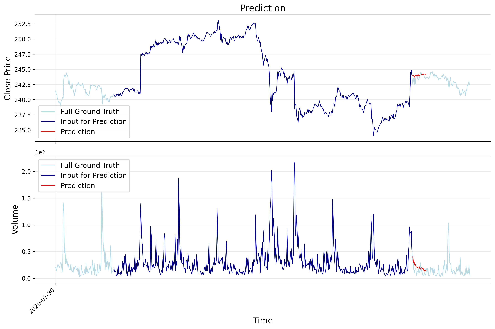

# Kronos微调-支持自定义CSV数据集

这是一个在自定义的CSV格式数据上微调Kronos模型的完整流程。包含顺序训练（先训练tokenizer再训练predictor）和单独模块训练，同时支持分布式训练。


## 1. 准备数据

### 数据格式

CSV文件必须包含以下列：
- `timestamps`: 每个数据点的时间戳
- `open`: 开盘价
- `high`: 最高价
- `low`: 最低价  
- `close`: 收盘价
- `volume`: 交易量
- `amount`: 交易金额

(volume和amount可以全0如果没有这部分的数据)

### 示例数据格式

| timestamps | open | close | high | low | volume | amount |
|------------|------|-------|------|-----|--------|--------|
| 2019/11/26 9:35 | 182.45215 | 184.45215 | 184.95215 | 182.45215 | 15136000 | 0 |
| 2019/11/26 9:40 | 184.35215 | 183.85215 | 184.55215 | 183.45215 | 4433300 | 0 |
| 2019/11/26 9:45 | 183.85215 | 183.35215 | 183.95215 | 182.95215 | 3070900 | 0 |

> **标准数据样例**:  `data/HK_ali_09988_kline_5min_all.csv` 

## 2. 准备config文件

data_path及预训练模型路径需要修改，训练参数可以自己调节

```yaml
# 数据配置
data:
  data_path: "/path/to/your/data.csv"
  lookback_window: 512        # 要使用的历史数据点
  predict_window: 48           # 要预测的未来点数
  max_context: 512            # 最大上下文长度

...

```
这里还有其他一些设置， `configs/config_ali09988_candle-5min.yaml` 有更详细的注释。

## 3. 训练

### 方法1: 直接顺序训练

`train_sequential.py` 脚本自动处理完整的训练流程：

```bash
# 完整训练（tokenizer + predictor）
python train_sequential.py --config configs/config_ali09988_candle-5min.yaml

# 跳过已存在的模型
python train_sequential.py --config configs/config_ali09988_candle-5min.yaml --skip-existing

# 只训练tokenizer
python train_sequential.py --config configs/config_ali09988_candle-5min.yaml --skip-basemodel

# 只训练predictor
python train_sequential.py --config configs/config_ali09988_candle-5min.yaml --skip-tokenizer
```

### 方法2: 单独组件训练

可以单独训练每个组件：

```bash
# 步骤1: 训练tokenizer
python finetune_tokenizer.py --config configs/config_ali09988_candle-5min.yaml

# 步骤2: 训练predictor（需要微调后的tokenizer）
python finetune_base_model.py --config configs/config_ali09988_candle-5min.yaml
```

### DDP训练

如果有多卡，可以开启ddp加速训练：

```bash
# 设置通信后端（NVIDIA GPU用nccl，CPU/混合用gloo）
DIST_BACKEND=nccl \
torchrun --standalone --nproc_per_node=8 train_sequential.py --config configs/config_ali09988_candle-5min.yaml
```

## 4. 训练结果

训练过程生成以下输出：

### 模型检查点
- **Tokenizer**: 保存到 `{base_save_path}/{exp_name}/tokenizer/best_model/`
- **Predictor**: 保存到 `{base_save_path}/{exp_name}/basemodel/best_model/`

### 训练日志
- **控制台输出**: 实时训练进度和指标
- **日志文件**: 详细日志保存到 `{base_save_path}/logs/`
- **验证跟踪**: 基于验证损失保存最佳模型

## 5. 预测可视化

以下图像显示了kronos在阿里巴巴股票数据上微调后的示例训练结果：












