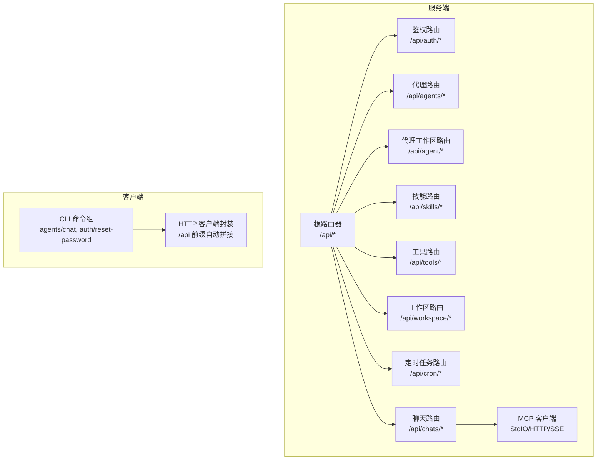
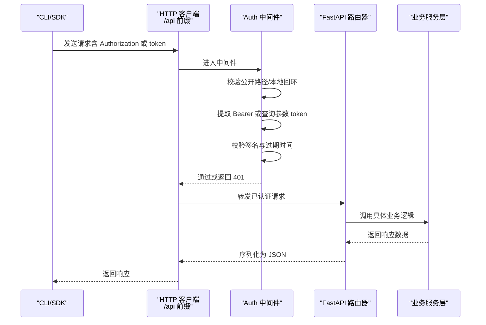
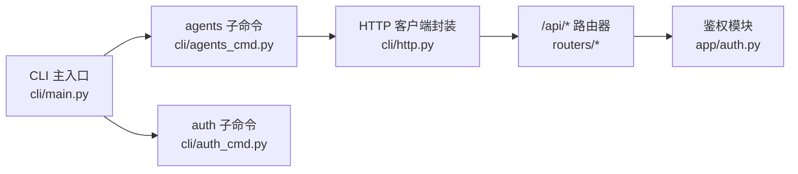

# API参考

<cite>
**本文引用的文件**
- [src/qwenpaw/app/routers/__init__.py](file://src/qwenpaw/app/routers/__init__.py)
- [src/qwenpaw/app/routers/auth.py](file://src/qwenpaw/app/routers/auth.py)
- [src/qwenpaw/app/routers/agents.py](file://src/qwenpaw/app/routers/agents.py)
- [src/qwenpaw/app/routers/agent.py](file://src/qwenpaw/app/routers/agent.py)
- [src/qwenpaw/app/routers/skills.py](file://src/qwenpaw/app/routers/skills.py)
- [src/qwenpaw/app/routers/tools.py](file://src/qwenpaw/app/routers/tools.py)
- [src/qwenpaw/app/routers/workspace.py](file://src/qwenpaw/app/routers/workspace.py)
- [src/qwenpaw/app/routers/crons/api.py](file://src/qwenpaw/app/crons/api.py)
- [src/qwenpaw/app/routers/runner/api.py](file://src/qwenpaw/app/runner/api.py)
- [src/qwenpaw/app/auth.py](file://src/qwenpaw/app/auth.py)
- [src/qwenpaw/cli/http.py](file://src/qwenpaw/cli/http.py)
- [src/qwenpaw/cli/main.py](file://src/qwenpaw/cli/main.py)
- [src/qwenpaw/cli/agents_cmd.py](file://src/qwenpaw/cli/agents_cmd.py)
- [src/qwenpaw/cli/auth_cmd.py](file://src/qwenpaw/cli/auth_cmd.py)
- [src/qwenpaw/app/mcp/stateful_client.py](file://src/qwenpaw/app/mcp/stateful_client.py)
</cite>

## 目录
1. [简介](#简介)
2. [项目结构](#项目结构)
3. [核心组件](#核心组件)
4. [架构总览](#架构总览)
5. [详细组件分析](#详细组件分析)
6. [依赖分析](#依赖分析)
7. [性能与限流](#性能与限流)
8. [故障排除指南](#故障排除指南)
9. [结论](#结论)
10. [附录](#附录)

## 简介
本文件为 QwenPaw 的完整 API 参考文档，覆盖以下内容：
- RESTful API 端点：HTTP 方法、URL 模式、请求/响应模型
- WebSocket 接口：SSE 流式输出与 MCP 客户端生命周期管理
- CLI 命令参考：交互式代理通信、后台任务状态查询、认证重置等
- SDK 使用指南：基于 HTTP 客户端封装的调用方式
- 认证与授权：登录、注册、令牌校验、中间件策略
- 版本与兼容性：API 前缀、路径约定与迁移建议
- 错误处理与调试：常见错误码、参数校验与排障步骤
- 性能优化：并发会话、流式传输、资源清理

## 项目结构
QwenPaw 的 API 由 FastAPI 路由器统一挂载，核心模块包括：
- 根路由器聚合：将多类子路由挂载到 /api 前缀下
- 鉴权模块：JWT 令牌签发与校验、登录/注册/状态查询
- 多代理管理：代理列表、创建、更新、删除、启用/禁用
- 代理工作区：文件读写、内存文件、语言设置、音频模式
- 技能池与技能：技能导入、上传、池同步、Hub 安装与状态
- 工具管理：内置工具开关与异步执行配置
- 工作区打包/解包：整包下载/合并上传
- 定时任务：CRON 作业的增删改查与启停
- 对话聊天：聊天会话管理与历史查询
- MCP 客户端：标准输入/HTTP/SSE 三类 MCP 客户端，解决跨任务生命周期泄漏问题
- CLI：命令行工具，支持代理间对话、后台任务查询、认证重置

图表来源
- [src/qwenpaw/app/routers/__init__.py:25-45](file://src/qwenpaw/app/routers/__init__.py#L25-L45)
- [src/qwenpaw/app/routers/auth.py:18-174](file://src/qwenpaw/app/routers/auth.py#L18-L174)
- [src/qwenpaw/app/routers/agents.py:36-726](file://src/qwenpaw/app/routers/agents.py#L36-L726)
- [src/qwenpaw/app/routers/agent.py:19-505](file://src/qwenpaw/app/routers/agent.py#L19-L505)
- [src/qwenpaw/app/routers/skills.py:62-1424](file://src/qwenpaw/app/routers/skills.py#L62-L1424)
- [src/qwenpaw/app/routers/tools.py:20-181](file://src/qwenpaw/app/routers/tools.py#L20-L181)
- [src/qwenpaw/app/routers/workspace.py:18-203](file://src/qwenpaw/app/routers/workspace.py#L18-L203)
- [src/qwenpaw/app/routers/crons/api.py:10-117](file://src/qwenpaw/app/crons/api.py#L10-L117)
- [src/qwenpaw/app/routers/runner/api.py:19-233](file://src/qwenpaw/app/runner/api.py#L19-L233)
- [src/qwenpaw/app/mcp/stateful_client.py:36-600](file://src/qwenpaw/app/mcp/stateful_client.py#L36-L600)

章节来源
- [src/qwenpaw/app/routers/__init__.py:25-45](file://src/qwenpaw/app/routers/__init__.py#L25-L45)

## 核心组件
- 根路由器与前缀
  - 所有 API 路由以 /api 为前缀挂载，CLI 默认连接 http://127.0.0.1:8088/api
  - 根路由器统一聚合各子路由（agents、agent、auth、skills、tools、workspace、cron、chats 等）
- 中间件与鉴权
  - AuthMiddleware 自动拦截受保护路径，支持 Authorization: Bearer 或查询参数 token
  - 公开路径包括登录、状态、版本、语言设置等
- CLI 客户端
  - http.py 提供统一的 httpx.Client 封装，默认添加 /api 前缀
  - 支持 --host/--port 或 --base-url 覆盖默认地址

章节来源
- [src/qwenpaw/app/routers/__init__.py:25-45](file://src/qwenpaw/app/routers/__init__.py#L25-L45)
- [src/qwenpaw/app/auth.py:47-63](file://src/qwenpaw/app/auth.py#L47-L63)
- [src/qwenpaw/app/auth.py:371-441](file://src/qwenpaw/app/auth.py#L371-L441)
- [src/qwenpaw/cli/http.py:14-44](file://src/qwenpaw/cli/http.py#L14-L44)

## 架构总览
下图展示从 CLI/SDK 到服务端 API 的典型调用链路，以及关键中间件与模块的交互。

图表来源
- [src/qwenpaw/app/auth.py:371-441](file://src/qwenpaw/app/auth.py#L371-L441)
- [src/qwenpaw/app/routers/auth.py:18-174](file://src/qwenpaw/app/routers/auth.py#L18-L174)
- [src/qwenpaw/cli/http.py:14-44](file://src/qwenpaw/cli/http.py#L14-L44)

## 详细组件分析

### 鉴权 API
- 登录
  - 方法：POST
  - 路径：/api/auth/login
  - 请求体：用户名、密码
  - 成功：返回 token 与用户名；未启用鉴权时返回空 token
  - 失败：401 无效凭据
- 注册
  - 方法：POST
  - 路径：/api/auth/register
  - 请求体：用户名、密码
  - 限制：仅允许一次注册；需启用鉴权环境变量
  - 成功：返回 token 与用户名
  - 失败：403/409 等
- 状态查询
  - 方法：GET
  - 路径：/api/auth/status
  - 返回：是否启用鉴权、是否存在用户
- 令牌验证
  - 方法：GET
  - 路径：/api/auth/verify
  - 返回：valid、username
- 更新资料
  - 方法：POST
  - 路径：/api/auth/update-profile
  - 请求体：当前密码、新用户名、新密码
  - 成功：返回新 token 与用户名

章节来源
- [src/qwenpaw/app/routers/auth.py:41-174](file://src/qwenpaw/app/routers/auth.py#L41-L174)
- [src/qwenpaw/app/auth.py:44-46](file://src/qwenpaw/app/auth.py#L44-L46)
- [src/qwenpaw/app/auth.py:121-166](file://src/qwenpaw/app/auth.py#L121-L166)

### 多代理管理 API
- 列表
  - 方法：GET
  - 路径：/api/agents
  - 返回：代理列表（含排序、描述、工作区目录、启用状态）
- 重新排序
  - 方法：PUT
  - 路径：/api/agents/order
  - 请求体：agent_ids（全量顺序）
- 获取单个代理
  - 方法：GET
  - 路径：/api/agents/{agentId}
- 创建代理
  - 方法：POST
  - 路径：/api/agents
  - 请求体：名称、描述、工作区目录、语言、初始技能名列表
- 更新代理
  - 方法：PUT
  - 路径：/api/agents/{agentId}
- 删除代理
  - 方法：DELETE
  - 路径：/api/agents/{agentId}
- 启用/禁用
  - 方法：PATCH
  - 路径：/api/agents/{agentId}/toggle
- 代理工作区文件
  - 列表：GET /api/agents/{agentId}/files
  - 读取：GET /api/agents/{agentId}/files/{filename}
  - 写入：PUT /api/agents/{agentId}/files/{filename}

章节来源
- [src/qwenpaw/app/routers/agents.py:152-726](file://src/qwenpaw/app/routers/agents.py#L152-L726)

### 代理工作区 API
- 工作区文件
  - 列表：GET /api/agent/files
  - 读取：GET /api/agent/files/{md_name}
  - 写入：PUT /api/agent/files/{md_name}
- 内存文件
  - 列表：GET /api/agent/memory
  - 读取：GET /api/agent/memory/{md_name}
  - 写入：PUT /api/agent/memory/{md_name}
- 语言设置
  - 读取：GET /api/agent/language
  - 写入：PUT /api/agent/language（支持 zh/en/ru）
- 音频模式
  - 读取：GET /api/agent/audio-mode（auto/native）
  - 写入：PUT /api/agent/audio-mode
- 音频转写提供者
  - 读取类型：GET /api/agent/transcription-provider-type
  - 设置类型：PUT /api/agent/transcription-provider-type
  - 查询可用提供者：GET /api/agent/transcription-providers
  - 设置提供者：PUT /api/agent/transcription-provider
  - 本地 Whisper 可用性：GET /api/agent/local-whisper-status

章节来源
- [src/qwenpaw/app/routers/agent.py:38-505](file://src/qwenpaw/app/routers/agent.py#L38-L505)

### 技能与技能池 API
- 当前工作区技能
  - 列表：GET /api/skills
  - 刷新：POST /api/skills/refresh
- Hub 搜索与安装
  - 搜索：GET /api/skills/hub/search?q=&limit=
  - 开始安装：POST /api/skills/hub/install/start
  - 查询状态：GET /api/skills/hub/install/status/{task_id}
  - 取消安装：POST /api/skills/hub/install/cancel/{task_id}
- 技能池
  - 列表：GET /api/skills/pool
  - 刷新：POST /api/skills/pool/refresh
  - 内置源：GET /api/skills/pool/builtin-sources
- 创建/上传/保存
  - 创建：POST /api/skills（自定义技能）
  - 上传 ZIP：POST /api/skills/upload
  - 池中创建：POST /api/skills/pool/create
  - 池中保存：PUT /api/skills/pool/save
- 工作区技能来源概览
  - GET /api/skills/workspaces

章节来源
- [src/qwenpaw/app/routers/skills.py:533-1424](file://src/qwenpaw/app/routers/skills.py#L533-L1424)

### 工具管理 API
- 列表
  - 方法：GET
  - 路径：/api/tools
- 开关工具
  - 方法：PATCH
  - 路径：/api/tools/{tool_name}/toggle
- 异步执行
  - 方法：PATCH
  - 路径：/api/tools/{tool_name}/async-execution

章节来源
- [src/qwenpaw/app/routers/tools.py:36-181](file://src/qwenpaw/app/routers/tools.py#L36-L181)

### 工作区打包/上传 API
- 下载
  - 方法：GET
  - 路径：/api/workspace/download
  - 响应：application/zip 流
- 上传
  - 方法：POST
  - 路径：/api/workspace/upload
  - 参数：zip 文件（multipart/form-data）
  - 行为：校验 zip、路径安全检查、合并覆盖

章节来源
- [src/qwenpaw/app/routers/workspace.py:112-203](file://src/qwenpaw/app/routers/workspace.py#L112-L203)

### 定时任务 API
- 列表：GET /api/cron/jobs
- 详情：GET /api/cron/jobs/{job_id}
- 创建：POST /api/cron/jobs（忽略客户端传入 id）
- 替换：PUT /api/cron/jobs/{job_id}
- 删除：DELETE /api/cron/jobs/{job_id}
- 暂停：POST /api/cron/jobs/{job_id}/pause
- 恢复：POST /api/cron/jobs/{job_id}/resume
- 立即运行：POST /api/cron/jobs/{job_id}/run
- 状态：GET /api/cron/jobs/{job_id}/state

章节来源
- [src/qwenpaw/app/crons/api.py:28-117](file://src/qwenpaw/app/crons/api.py#L28-L117)

### 聊天与会话 API
- 列表：GET /api/chats?user_id=&channel=
- 创建：POST /api/chats
- 批量删除：POST /api/chats/batch-delete
- 详情：GET /api/chats/{chat_id}
- 更新：PUT /api/chats/{chat_id}
- 删除：DELETE /api/chats/{chat_id}

章节来源
- [src/qwenpaw/app/runner/api.py:65-233](file://src/qwenpaw/app/runner/api.py#L65-L233)

### 代理间通信与后台任务（CLI）
- 列表代理：qwenpaw agents list [--base-url]
- 代理对话：
  - 文本模式：qwenpaw agents chat --from-agent --to-agent --text
  - 流式模式：--mode stream
  - 后台任务：--background，返回 task_id 与 session_id
  - 查询任务：qwenpaw agents chat --background --task-id <task_id>
- 身份前缀：自动添加 [Agent … requesting] 防混淆
- 会话管理：默认生成唯一 session_id；可复用输出中的 session_id 继续对话

章节来源
- [src/qwenpaw/cli/agents_cmd.py:431-680](file://src/qwenpaw/cli/agents_cmd.py#L431-L680)
- [src/qwenpaw/cli/http.py:14-44](file://src/qwenpaw/cli/http.py#L14-L44)

### 认证重置（CLI）
- qwenpaw auth reset-password
  - 功能：重置已注册用户的密码，并轮换 jwt_secret 使现有会话失效

章节来源
- [src/qwenpaw/cli/auth_cmd.py:21-67](file://src/qwenpaw/cli/auth_cmd.py#L21-L67)

### WebSocket 与流式传输
- SSE 流式输出
  - CLI 在流式模式下接收服务器推送的增量事件，解析 data: 行为 JSON
  - 最终模式收集所有事件，提取最终文本内容
- MCP 客户端生命周期
  - StdIOStatefulClient/HttpStatefulClient 在单个后台任务中完成连接/断开/重载
  - 解决 uvicorn/FastAPI 环境下跨任务取消作用域导致的 CPU 泄漏与僵尸进程

章节来源
- [src/qwenpaw/cli/agents_cmd.py:126-183](file://src/qwenpaw/cli/agents_cmd.py#L126-L183)
- [src/qwenpaw/app/mcp/stateful_client.py:112-176](file://src/qwenpaw/app/mcp/stateful_client.py#L112-L176)
- [src/qwenpaw/app/mcp/stateful_client.py:392-491](file://src/qwenpaw/app/mcp/stateful_client.py#L392-L491)

## 依赖分析
- 路由聚合
  - 根路由器统一 include 各子路由，形成清晰的命名空间划分
- 中间件耦合
  - AuthMiddleware 仅对 /api 路由生效，且对 OPTIONS 与本地回环放行
- CLI 与 API 的契约
  - CLI 默认使用 http://127.0.0.1:8088/api，可通过 --base-url 覆盖
  - 所有 CLI 命令均通过 /api 前缀访问对应端点

图表来源
- [src/qwenpaw/cli/main.py:95-144](file://src/qwenpaw/cli/main.py#L95-L144)
- [src/qwenpaw/cli/agents_cmd.py:431-680](file://src/qwenpaw/cli/agents_cmd.py#L431-L680)
- [src/qwenpaw/cli/http.py:14-44](file://src/qwenpaw/cli/http.py#L14-L44)
- [src/qwenpaw/app/routers/__init__.py:25-45](file://src/qwenpaw/app/routers/__init__.py#L25-L45)
- [src/qwenpaw/app/auth.py:371-441](file://src/qwenpaw/app/auth.py#L371-L441)

章节来源
- [src/qwenpaw/cli/main.py:95-144](file://src/qwenpaw/cli/main.py#L95-L144)
- [src/qwenpaw/cli/http.py:14-44](file://src/qwenpaw/cli/http.py#L14-L44)

## 性能与限流
- 并发会话
  - 代理间对话默认生成唯一 session_id，避免并发访问同一会话导致冲突
- 流式传输
  - SSE 模式适合长耗时任务，CLI 逐行解析 data: 数据，降低首字节延迟感知
- 资源清理
  - MCP 客户端在单任务内完成生命周期，防止跨任务取消导致的资源泄漏
- 上传限制
  - 技能上传 ZIP 最大 100MB，类型白名单限定
- 本地回环豁免
  - 本地 127.0.0.1/::1 请求绕过鉴权，便于 CLI 本地调用

章节来源
- [src/qwenpaw/cli/agents_cmd.py:17-48](file://src/qwenpaw/cli/agents_cmd.py#L17-L48)
- [src/qwenpaw/app/routers/skills.py:352-372](file://src/qwenpaw/app/routers/skills.py#L352-L372)
- [src/qwenpaw/app/mcp/stateful_client.py:112-176](file://src/qwenpaw/app/mcp/stateful_client.py#L112-L176)
- [src/qwenpaw/app/auth.py:424-426](file://src/qwenpaw/app/auth.py#L424-L426)

## 故障排除指南
- 401 未认证
  - 确认 Authorization: Bearer 或查询参数 token 是否正确传递
  - 检查鉴权是否启用与用户是否存在
- 403 禁止访问
  - 鉴权未启用或用户已存在时禁止注册
- 404 资源不存在
  - 代理、聊天、技能、文件等路径不存在
- 409 冲突
  - 技能重名、工作区上传冲突
- 422 安全扫描失败
  - 技能导入被安全策略拦截，返回最高严重级别与发现项
- 任务状态异常
  - 后台任务状态：submitted → pending → running → finished
  - 任务不存在：检查 task_id 是否过期或拼写错误

章节来源
- [src/qwenpaw/app/routers/skills.py:68-108](file://src/qwenpaw/app/routers/skills.py#L68-L108)
- [src/qwenpaw/app/routers/skills.py:620-641](file://src/qwenpaw/app/routers/skills.py#L620-L641)
- [src/qwenpaw/cli/agents_cmd.py:272-372](file://src/qwenpaw/cli/agents_cmd.py#L272-L372)

## 结论
本参考文档系统梳理了 QwenPaw 的 REST API、CLI 与 MCP 客户端能力，明确了鉴权策略、流式传输与资源管理的最佳实践。建议在生产环境中：
- 明确启用鉴权并妥善管理密钥轮换
- 使用流式模式处理长任务，合理设置超时
- 严格控制上传文件大小与类型，防范路径穿越
- 通过后台任务模式提升用户体验与系统吞吐

## 附录

### API 版本与兼容性
- 版本端点
  - GET /api/version（位于鉴权模块注释中，实际端点以服务端实现为准）
- 前缀约定
  - 所有 API 以 /api 为前缀，CLI 默认自动拼接
- 迁移建议
  - 新增端点优先采用现有命名空间（agents/skills/tools/workspace/cron/chats）
  - 避免破坏性变更，必要时引入新的子路径而非修改既有行为

章节来源
- [src/qwenpaw/app/auth.py:53-54](file://src/qwenpaw/app/auth.py#L53-L54)
- [src/qwenpaw/cli/http.py:14-20](file://src/qwenpaw/cli/http.py#L14-L20)

### 请求示例与响应格式（路径引用）
- 登录
  - 请求：POST /api/auth/login
  - 成功响应字段：token, username
  - 参考路径：[src/qwenpaw/app/routers/auth.py:41-51](file://src/qwenpaw/app/routers/auth.py#L41-L51)
- 注册
  - 请求：POST /api/auth/register
  - 成功响应字段：token, username
  - 参考路径：[src/qwenpaw/app/routers/auth.py:54-83](file://src/qwenpaw/app/routers/auth.py#L54-L83)
- 列表代理
  - 请求：GET /api/agents
  - 成功响应字段：agents[]
  - 参考路径：[src/qwenpaw/app/routers/agents.py:158-197](file://src/qwenpaw/app/routers/agents.py#L158-L197)
- 技能上传
  - 请求：POST /api/skills/upload
  - 成功响应字段：count/created/conflicts 等
  - 参考路径：[src/qwenpaw/app/routers/skills.py:727-743](file://src/qwenpaw/app/routers/skills.py#L727-L743)
- 工作区下载
  - 请求：GET /api/workspace/download
  - 成功响应：application/zip 流
  - 参考路径：[src/qwenpaw/app/routers/workspace.py:126-150](file://src/qwenpaw/app/routers/workspace.py#L126-L150)

### 错误处理策略
- 参数校验
  - 缺少必填字段、非法枚举值、空字符串等均返回 400
- 资源不存在
  - 404：代理、聊天、技能、文件等
- 权限与认证
  - 401：未认证或令牌无效/过期
  - 403：鉴权未启用或禁止注册
- 冲突与扫描
  - 409：重名/冲突
  - 422：安全扫描失败，包含严重级别与发现项

章节来源
- [src/qwenpaw/app/routers/agents.py:212-227](file://src/qwenpaw/app/routers/agents.py#L212-L227)
- [src/qwenpaw/app/routers/skills.py:68-108](file://src/qwenpaw/app/routers/skills.py#L68-L108)
- [src/qwenpaw/app/routers/skills.py:735-740](file://src/qwenpaw/app/routers/skills.py#L735-L740)

### 客户端实现与 SDK 使用
- SDK 封装
  - 使用 httpx.Client，自动拼接 /api 前缀
  - 支持超时与 base_url 解析
  - 参考路径：[src/qwenpaw/cli/http.py:14-44](file://src/qwenpaw/cli/http.py#L14-L44)
- CLI 使用
  - agents list/chat：查询代理、发起对话、后台任务查询
  - auth reset-password：重置密码并轮换密钥
  - 参考路径：
    - [src/qwenpaw/cli/agents_cmd.py:431-680](file://src/qwenpaw/cli/agents_cmd.py#L431-L680)
    - [src/qwenpaw/cli/auth_cmd.py:21-67](file://src/qwenpaw/cli/auth_cmd.py#L21-L67)