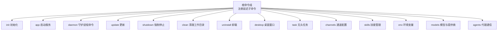
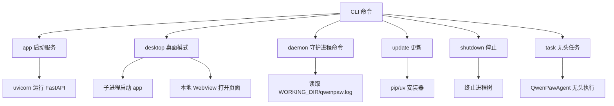
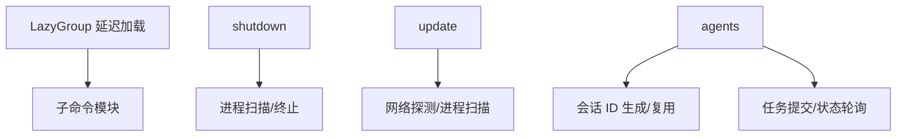

# CLI命令参考

<cite>
**本文档引用的文件**
- [main.py](file://src/qwenpaw/cli/main.py)
- [init_cmd.py](file://src/qwenpaw/cli/init_cmd.py)
- [app_cmd.py](file://src/qwenpaw/cli/app_cmd.py)
- [daemon_cmd.py](file://src/qwenpaw/cli/daemon_cmd.py)
- [update_cmd.py](file://src/qwenpaw/cli/update_cmd.py)
- [shutdown_cmd.py](file://src/qwenpaw/cli/shutdown_cmd.py)
- [clean_cmd.py](file://src/qwenpaw/cli/clean_cmd.py)
- [uninstall_cmd.py](file://src/qwenpaw/cli/uninstall_cmd.py)
- [desktop_cmd.py](file://src/qwenpaw/cli/desktop_cmd.py)
- [task_cmd.py](file://src/qwenpaw/cli/task_cmd.py)
- [channels_cmd.py](file://src/qwenpaw/cli/channels_cmd.py)
- [skills_cmd.py](file://src/qwenpaw/cli/skills_cmd.py)
- [env_cmd.py](file://src/qwenpaw/cli/env_cmd.py)
- [providers_cmd.py](file://src/qwenpaw/cli/providers_cmd.py)
- [agents_cmd.py](file://src/qwenpaw/cli/agents_cmd.py)
</cite>

## 目录
1. [简介](#简介)
2. [项目结构](#项目结构)
3. [核心组件](#核心组件)
4. [架构总览](#架构总览)
5. [详细组件分析](#详细组件分析)
6. [依赖分析](#依赖分析)
7. [性能考虑](#性能考虑)
8. [故障排除指南](#故障排除指南)
9. [结论](#结论)
10. [附录](#附录)

## 简介
本文件为 QwenPaw CLI 命令的完整参考手册，覆盖初始化、启动、停止、更新、清理、卸载、桌面模式、任务执行、通道与技能配置、环境变量管理、模型与提供商配置以及代理间通信等核心功能。文档面向不同技术背景的用户，既提供高层概览，也包含具体命令参数、执行流程、输出格式与常见问题排查建议。

## 项目结构
CLI 命令通过 Click 组织，主入口在根组中注册多个子命令组与独立命令；部分命令采用延迟加载以优化启动性能。全局参数（如 --host、--port）在根组中定义，并传递给各子命令上下文。

图表来源
- [main.py:95-146](file://src/qwenpaw/cli/main.py#L95-L146)

章节来源
- [main.py:1-171](file://src/qwenpaw/cli/main.py#L1-L171)

## 核心组件
- 根命令组与延迟加载：通过 LazyGroup 实现按需导入，减少启动时间。
- 全局参数：--host、--port 默认从上次运行记录读取，未指定时回退到默认值。
- 日志与调试：支持 debug/trace 级别日志，首次导入耗时可重放输出。

章节来源
- [main.py:58-93](file://src/qwenpaw/cli/main.py#L58-L93)
- [main.py:146-171](file://src/qwenpaw/cli/main.py#L146-L171)

## 架构总览
CLI 与后端服务通过 uvicorn 运行 FastAPI 应用；桌面模式通过子进程启动后端并在本地 WebView 中打开前端页面；守护进程命令用于查询状态、重启、重载配置与查看日志；更新命令检测当前安装来源并安全地升级；任务命令支持无头执行与超时控制。

图表来源
- [app_cmd.py:104-111](file://src/qwenpaw/cli/app_cmd.py#L104-L111)
- [desktop_cmd.py:137-190](file://src/qwenpaw/cli/desktop_cmd.py#L137-L190)
- [daemon_cmd.py:105-117](file://src/qwenpaw/cli/daemon_cmd.py#L105-L117)
- [update_cmd.py:348-381](file://src/qwenpaw/cli/update_cmd.py#L348-L381)
- [shutdown_cmd.py:303-314](file://src/qwenpaw/cli/shutdown_cmd.py#L303-L314)
- [task_cmd.py:87-171](file://src/qwenpaw/cli/task_cmd.py#L87-L171)

## 详细组件分析

### 初始化命令：init
用途：交互式创建工作目录、配置文件与心跳检查清单，支持默认模式与安全提示。

- 关键行为
  - 安全警告与遥测收集确认（可选）
  - 默认工作空间与内置 QA 代理初始化
  - 心跳间隔、目标与活跃时段配置
  - 显示工具调用详情开关
  - 语言选择与音频模式（自动/原生）
  - 通道交互配置（iMessage/Discord/DingTalk/Feishu/QQ/Console/Twilio）
  - LLM 提供商与模型配置（必要时强制配置）
  - 技能池同步与启用策略（全部/自定义/不启用）
  - 环境变量交互配置
  - 多语言 MD 文件复制与更新
  - 可选覆盖写入 HEARTBEAT.md

- 参数要点
  - --force：覆盖现有配置与心跳文件
  - --defaults：脚本化模式，不交互
  - --accept-security：跳过安全确认（配合 --defaults）

- 输出与结果
  - 成功完成初始化后输出“初始化完成”提示
  - 配置保存至工作目录下的 config.json
  - 心跳查询保存至 HEARTBEAT.md

章节来源
- [init_cmd.py:119-523](file://src/qwenpaw/cli/init_cmd.py#L119-L523)

### 启动命令：app
用途：启动 QwenPaw FastAPI 服务，支持主机绑定、端口、自动重载与日志级别。

- 关键行为
  - 记录最近使用的 host/port，供其他终端复用
  - 设置日志级别环境变量
  - 开发模式下启用 reload 并设置 reload 标记
  - 隐藏特定路径访问日志
  - 使用 uvicorn 运行应用，固定单 worker

- 参数要点
  - --host：绑定地址，默认 127.0.0.1
  - --port：绑定端口，默认 8088
  - --reload：开发模式启用自动重载
  - --log-level：日志级别（critical/error/warning/info/debug/trace）
  - --hide-access-paths：隐藏访问日志中的路径片段（可重复）
  - --workers：已弃用参数，将被忽略

- 输出与结果
  - 后端服务启动成功
  - 可通过 --host/--port 访问 API

章节来源
- [app_cmd.py:15-112](file://src/qwenpaw/cli/app_cmd.py#L15-L112)

### 守护进程命令：daemon
用途：查询守护进程状态、重启、重载配置、版本信息与查看日志。

- 子命令
  - status：显示配置、工作目录与内存管理器信息
  - restart：打印重启说明（CLI 不直接重启进程）
  - reload-config：重新读取配置
  - version：显示版本与路径
  - logs：查看最后 N 行日志（默认 100，范围 1..2000）

- 参数要点
  - --agent-id：代理 ID，默认 default

- 输出与结果
  - 文本化状态摘要或日志内容

章节来源
- [daemon_cmd.py:48-117](file://src/qwenpaw/cli/daemon_cmd.py#L48-L117)

### 更新命令：update
用途：在当前 Python 环境中升级 QwenPaw，支持检测运行中的服务并安全关闭。

- 关键行为
  - 检测当前安装来源（PyPI/Editable/VCS/Local/直接 URL）
  - 获取最新版本并比较
  - 检测本地运行的服务（基于进程与端口探测）
  - 可选强制关闭正在运行的服务
  - 生成升级计划并启动更新工作进程
  - 支持前台/后台执行（Windows 后台执行避免锁定）

- 参数要点
  - -y/--yes：跳过确认

- 输出与结果
  - 当前版本、最新版本、Python 环境、安装路径、安装器类型
  - 升级完成后提示重启服务

章节来源
- [update_cmd.py:631-731](file://src/qwenpaw/cli/update_cmd.py#L631-L731)

### 停止命令：shutdown
用途：强制停止正在运行的 QwenPaw 后端、前端开发服务器与桌面包装进程。

- 关键行为
  - 解析 --port 或使用全局 --port
  - 查找监听指定端口的后端进程
  - 查找前端开发服务器（Vite）与桌面包装进程
  - 在 Windows 上查找父级包装进程
  - 优雅终止（SIGTERM），失败则强制终止（SIGKILL）
  - 输出被停止与失败的进程列表

- 参数要点
  - --port：后端端口，默认使用全局 --port

- 输出与结果
  - 成功停止的进程列表
  - 失败时抛出异常并列出失败进程

章节来源
- [shutdown_cmd.py:303-386](file://src/qwenpaw/cli/shutdown_cmd.py#L303-L386)

### 清理命令：clean
用途：清空工作目录（保留遥测标记文件），支持预览与确认。

- 关键行为
  - 列出工作目录下除遥测标记外的所有条目
  - --dry-run：仅预览不删除
  - --yes：跳过确认

- 输出与结果
  - 删除完成提示或取消提示

章节来源
- [clean_cmd.py:19-77](file://src/qwenpaw/cli/clean_cmd.py#L19-L77)

### 卸载命令：uninstall
用途：移除 QwenPaw 环境与 CLI 包装，清理 shell PATH 条目，可选择清除全部数据。

- 关键行为
  - 移除安装器管理的目录（venv、bin）
  - 可选递归删除工作目录（--purge）
  - 清理 zsh/bash profile 中的 PATH 注释与导出

- 参数要点
  - --purge：同时删除所有数据
  - --yes：跳过确认

- 输出与结果
  - 已移除的目录与清理的 profile 列表

章节来源
- [uninstall_cmd.py:46-90](file://src/qwenpaw/cli/uninstall_cmd.py#L46-L90)

### 桌面命令：desktop
用途：在本地 WebView 窗口中运行 QwenPaw，避免与现有实例冲突。

- 关键行为
  - 自动选择空闲端口
  - 子进程启动 app 命令
  - 等待 HTTP 就绪后创建 WebView 窗口
  - Windows 下使用线程持续输出子进程流
  - 窗口关闭后清理后端进程

- 参数要点
  - --host：绑定地址，默认 127.0.0.1
  - --log-level：应用日志级别

- 输出与结果
  - 启动 URL 与端口提示
  - WebView 窗口打开后阻塞直到关闭

章节来源
- [desktop_cmd.py:82-270](file://src/qwenpaw/cli/desktop_cmd.py#L82-L270)

### 任务命令：task
用途：无头执行单个任务指令，适合自动化与集成测试。

- 关键行为
  - 从字符串或 .md 文件读取指令
  - 加载代理配置（可指定 agent-id）
  - 可覆盖模型（provider/model）
  - 控制最大迭代次数与超时
  - 可禁用工具守卫（--no-guard）
  - 支持外部技能目录（绕过清单）
  - 输出 JSON 结果，包含状态、耗时、响应文本与用量统计
  - 退出码根据执行结果返回

- 参数要点
  - -i/--instruction：必填，指令文本或 .md 路径
  - -m/--model：覆盖模型（provider/model 或 model）
  - --max-iters：最大 ReAct 循环次数，默认 30
  - -t/--timeout：最大执行时间秒，默认 900
  - --no-guard：禁用工具守卫
  - --skills-dir：外部技能目录（bypass 清单）
  - --output-dir：输出目录（含 result.json）
  - --agent-id：代理 ID，默认 default

- 输出与结果
  - JSON：包含 status、elapsed_seconds、response、usage 等字段
  - 退出码：success=0，否则非 0

章节来源
- [task_cmd.py:173-289](file://src/qwenpaw/cli/task_cmd.py#L173-L289)

### 通道命令：channels
用途：列出与交互式配置通道（iMessage/Discord/Telegram/DingTalk/Feishu/QQ/Console/Twilio）。

- 关键行为
  - 列出可用通道与状态（启用/禁用）
  - 交互式配置各通道的关键参数（令牌、代理、前缀等）
  - 支持自定义通道模板与插件通道
  - 隐藏敏感字段（如 bot_token、client_secret 等）

- 子命令
  - list：列出通道与状态
  - config：交互式配置通道

- 输出与结果
  - 列表输出通道名称、启用状态与来源
  - 配置完成后保存到配置文件

章节来源
- [channels_cmd.py:42-800](file://src/qwenpaw/cli/channels_cmd.py#L42-L800)

### 技能命令：skills
用途：列出与交互式启用/禁用工作空间技能。

- 关键行为
  - 从技能池下载并安装新技能
  - 启用/禁用技能
  - 预览变更并确认应用
  - 支持包含池候选技能的选择

- 子命令
  - list：列出技能与启用状态
  - config：交互式配置技能

- 参数要点
  - --agent-id：代理 ID，默认 default

- 输出与结果
  - 列表输出技能名称、来源与状态
  - 配置完成后保存清单

章节来源
- [skills_cmd.py:213-275](file://src/qwenpaw/cli/skills_cmd.py#L213-L275)

### 环境变量命令：env
用途：管理环境变量（列出、设置、删除）。

- 子命令
  - list：列出所有环境变量
  - set KEY VALUE：设置环境变量
  - delete KEY：删除环境变量

- 输出与结果
  - 列表输出键值对
  - set/delete 成功提示

章节来源
- [env_cmd.py:10-99](file://src/qwenpaw/cli/env_cmd.py#L10-L99)

### 模型与提供商命令：models
用途：管理 LLM 提供商与模型，包括配置 API 密钥、添加/删除模型、下载本地模型等。

- 关键行为
  - 列出所有提供商及其配置与激活模型
  - 交互式配置提供商 API 密钥与基础 URL
  - 添加/删除用户模型（除 Ollama）
  - 下载本地模型仓库并等待完成
  - 列出与删除本地模型

- 子命令
  - list：列出提供商与激活模型
  - config：交互式配置提供商与激活模型
  - config-key：配置提供商 API 密钥
  - set-llm：交互式设置激活模型
  - add-provider/remove-provider：增删自定义提供商
  - add-model/remove-model：增删用户模型（除 Ollama）
  - download：下载本地模型仓库
  - local：列出已下载本地模型
  - remove-local：删除本地模型

- 输出与结果
  - 列表输出提供商、模型与激活状态
  - 下载完成后输出保存路径与大小

章节来源
- [providers_cmd.py:469-800](file://src/qwenpaw/cli/providers_cmd.py#L469-L800)

### 代理命令：agents
用途：代理间通信与任务提交，支持流式与最终响应模式、后台任务与会话管理。

- 关键行为
  - 列出可用代理（ID、名称、描述、工作目录）
  - 发送消息到目标代理，自动处理会话 ID 与身份前缀
  - 流式模式（SSE）与最终模式（完整响应）
  - 后台任务提交（立即返回 task_id 与 session_id）
  - 后台任务状态轮询（submitted → pending → running → finished）

- 子命令
  - list：列出代理
  - chat：代理聊天与后台任务

- 参数要点（chat）
  - --from-agent/--agent-id：源代理 ID
  - --to-agent：目标代理 ID
  - --text：消息文本
  - --session-id：复用会话 ID
  - --new-session：强制新建会话
  - --mode：stream/final，默认 final
  - --background：后台任务模式
  - --task-id：检查后台任务状态
  - --timeout：请求超时（秒）
  - --json-output：输出完整 JSON
  - --base-url：覆盖 API 基础 URL

- 输出与结果
  - 文本模式：[SESSION: xxx] 头部与响应正文
  - JSON 模式：完整响应结构
  - 后台任务：[TASK_ID: xxx] [SESSION: xxx] 与状态轮询

章节来源
- [agents_cmd.py:374-680](file://src/qwenpaw/cli/agents_cmd.py#L374-L680)

## 依赖分析
- 延迟加载机制：根组通过 LazyGroup 动态导入子命令模块，降低启动成本。
- 进程管理：shutdown 命令统一处理后端、前端开发服务器与桌面包装进程，跨平台信号与终止策略。
- 服务探测：update 命令结合网络探测与进程扫描识别运行中的服务。
- 会话与任务：agents 命令负责会话 ID 生成、任务提交与状态轮询，确保并发安全。

图表来源
- [main.py:58-93](file://src/qwenpaw/cli/main.py#L58-L93)
- [shutdown_cmd.py:322-386](file://src/qwenpaw/cli/shutdown_cmd.py#L322-L386)
- [update_cmd.py:226-266](file://src/qwenpaw/cli/update_cmd.py#L226-L266)
- [agents_cmd.py:17-48](file://src/qwenpaw/cli/agents_cmd.py#L17-L48)
- [agents_cmd.py:185-372](file://src/qwenpaw/cli/agents_cmd.py#L185-L372)

章节来源
- [main.py:58-93](file://src/qwenpaw/cli/main.py#L58-L93)
- [shutdown_cmd.py:322-386](file://src/qwenpaw/cli/shutdown_cmd.py#L322-L386)
- [update_cmd.py:226-266](file://src/qwenpaw/cli/update_cmd.py#L226-L266)
- [agents_cmd.py:17-48](file://src/qwenpaw/cli/agents_cmd.py#L17-L48)
- [agents_cmd.py:185-372](file://src/qwenpaw/cli/agents_cmd.py#L185-L372)

## 性能考虑
- 启动性能：延迟加载减少首屏导入时间；日志级别为 debug/trace 时可重放导入耗时。
- 进程管理：优雅终止优先，失败再强制终止，避免僵尸进程。
- 任务执行：task 命令支持超时与最大迭代限制，防止长时间占用资源。
- 本地模型：下载过程带进度轮询与超时控制，支持中断与取消。

## 故障排除指南
- 无法连接后端
  - 使用 --host/--port 指定正确的绑定地址与端口
  - 检查防火墙与端口占用情况
- 服务已在运行
  - 使用 qwenpaw shutdown 停止现有进程后再执行更新或启动
  - update 命令会自动探测并提示是否需要先停止
- 进程未正确终止
  - 在 Windows 上使用 taskkill /T /PID
  - 在类 Unix 系统上使用 pgrep/fuser 查找并终止子进程树
- 会话冲突
  - agents 命令默认生成唯一 session_id；若需复用请显式传入 --session-id
  - 使用 --new-session 强制新建会话
- 本地模型下载失败
  - 检查网络与镜像源设置
  - 使用 models local 查看已下载模型
- 权限与环境变量
  - 使用 env list/set/delete 管理环境变量
  - desktop 命令会检查 SSL_CERT_FILE 环境变量

章节来源
- [update_cmd.py:276-308](file://src/qwenpaw/cli/update_cmd.py#L276-L308)
- [shutdown_cmd.py:322-386](file://src/qwenpaw/cli/shutdown_cmd.py#L322-L386)
- [agents_cmd.py:610-624](file://src/qwenpaw/cli/agents_cmd.py#L610-L624)
- [providers_cmd.py:698-772](file://src/qwenpaw/cli/providers_cmd.py#L698-L772)
- [env_cmd.py:19-68](file://src/qwenpaw/cli/env_cmd.py#L19-L68)
- [desktop_cmd.py:120-130](file://src/qwenpaw/cli/desktop_cmd.py#L120-L130)

## 结论
QwenPaw CLI 提供了从初始化、启动、停止、更新到任务执行与多维度配置的完整能力。通过延迟加载、进程管理与会话/任务机制，CLI 在易用性与稳定性之间取得平衡。建议在生产环境中谨慎启用工具与第三方通道，并定期更新与清理工作目录以保持系统健康。

## 附录

### 常用命令速查
- 初始化：qwenpaw init [--force] [--defaults] [--accept-security]
- 启动服务：qwenpaw app [--host] [--port] [--reload] [--log-level] [--hide-access-paths]
- 桌面模式：qwenpaw desktop [--host] [--log-level]
- 后台任务：qwenpaw task -i/--instruction ... [其他参数]
- 代理通信：qwenpaw agents chat --from-agent ... --to-agent ... --text ...
- 通道配置：qwenpaw channels config
- 技能管理：qwenpaw skills config
- 环境变量：qwenpaw env list|set|delete
- 模型管理：qwenpaw models config|list|download|local
- 守护进程：qwenpaw daemon status|restart|reload-config|version|logs
- 更新：qwenpaw update -y
- 停止：qwenpaw shutdown [--port]
- 清理：qwenpaw clean [--yes] [--dry-run]
- 卸载：qwenpaw uninstall [--purge] [--yes]

### 输出格式示例
- 任务命令 JSON 输出包含：status、elapsed_seconds、response、usage（input_tokens/output_tokens/cost_usd）
- 代理聊天文本模式：[SESSION: <id>] 换行后为响应正文
- 代理聊天 JSON 模式：包含完整响应结构与元数据
- 后台任务：提交后输出 [TASK_ID: xxx] [SESSION: xxx]，随后可轮询状态