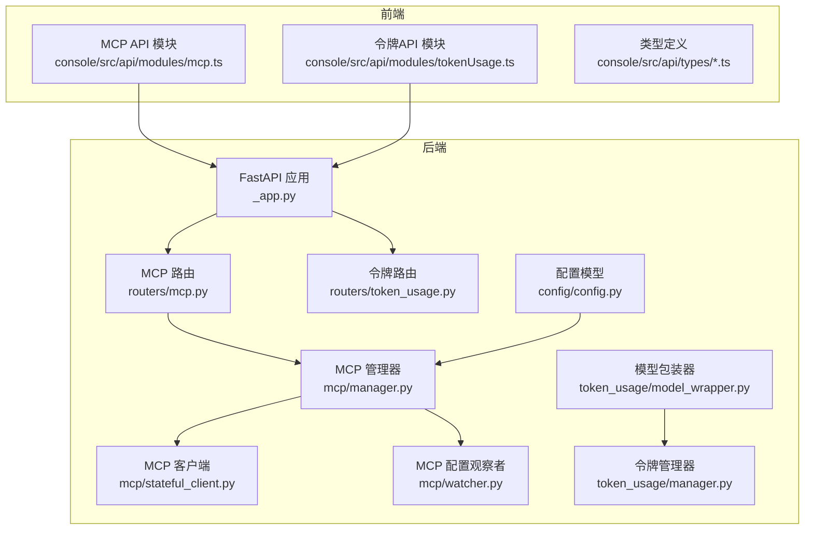
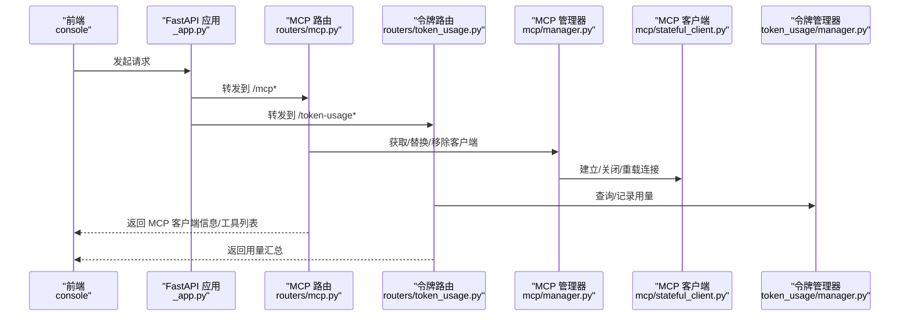
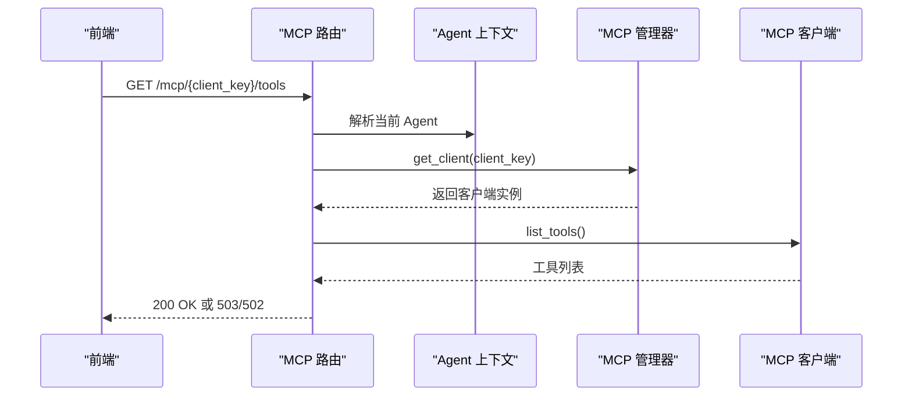
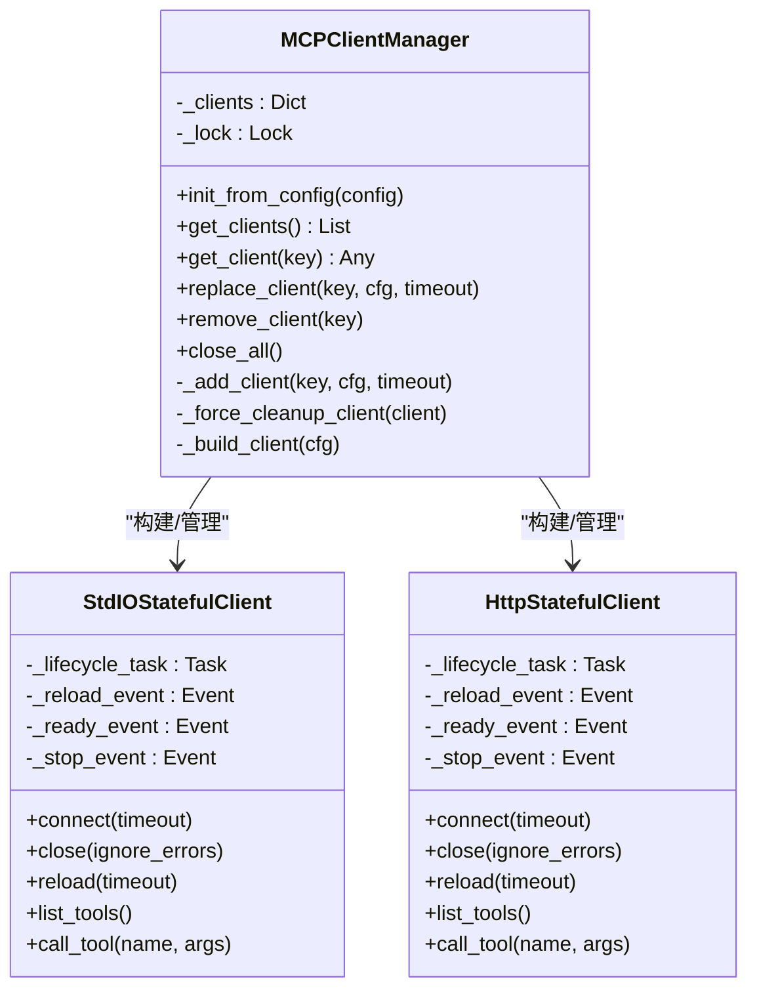
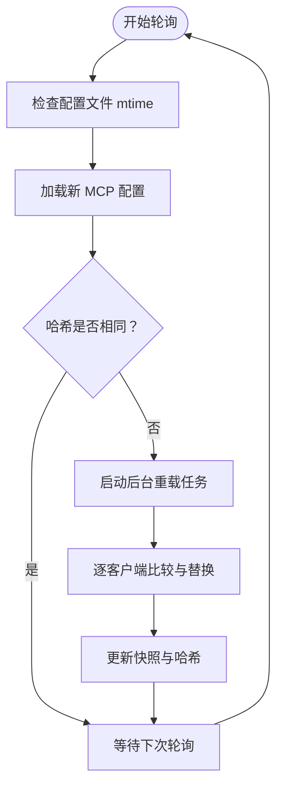
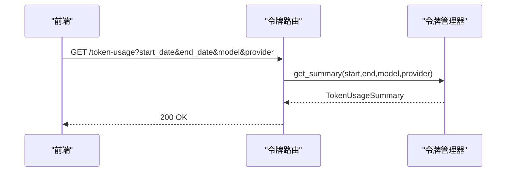
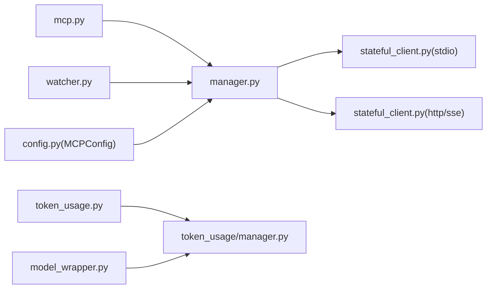

# MCP与令牌API

<cite>
**本文引用的文件**
- [mcp.py](file://src/qwenpaw/app/routers/mcp.py)
- [manager.py](file://src/qwenpaw/app/mcp/manager.py)
- [stateful_client.py](file://src/qwenpaw/app/mcp/stateful_client.py)
- [watcher.py](file://src/qwenpaw/app/mcp/watcher.py)
- [token_usage.py](file://src/qwenpaw/app/routers/token_usage.py)
- [manager.py](file://src/qwenpaw/token_usage/manager.py)
- [model_wrapper.py](file://src/qwenpaw/token_usage/model_wrapper.py)
- [config.py](file://src/qwenpaw/config/config.py)
- [_app.py](file://src/qwenpaw/app/_app.py)
- [mcp.ts](file://console/src/api/modules/mcp.ts)
- [mcp.ts](file://console/src/api/types/mcp.ts)
- [tokenUsage.ts](file://console/src/api/modules/tokenUsage.ts)
- [tokenUsage.ts](file://console/src/api/types/tokenUsage.ts)
</cite>

## 目录
1. [简介](#简介)
2. [项目结构](#项目结构)
3. [核心组件](#核心组件)
4. [架构总览](#架构总览)
5. [详细组件分析](#详细组件分析)
6. [依赖关系分析](#依赖关系分析)
7. [性能考量](#性能考量)
8. [故障排查指南](#故障排查指南)
9. [结论](#结论)
10. [附录](#附录)

## 简介
本文件为 QwenPaw 的 MCP（Model Context Protocol）与令牌 API 提供系统化技术文档。内容覆盖：
- MCP 客户端管理：创建、更新、启用/禁用、删除、查询可用工具等 HTTP 接口
- 连接建立与状态监控：基于进程内生命周期任务的连接/断开/重载机制
- 运行时热重载：配置变更检测与无重启替换
- 令牌使用统计与计费跟踪：按日期/模型/供应商聚合的用量记录与查询
- 技术细节：连接池、超时控制、重连策略、安全掩码、分布式追踪与性能监控建议

## 项目结构
后端采用 FastAPI 路由器组织 API，MCP 与令牌模块分别位于应用层路由与独立的令牌统计模块中；前端通过统一的 API 模块调用后端接口。

**图表来源**
- [_app.py:424-528](file://src/qwenpaw/app/_app.py#L424-L528)
- [mcp.py:17-484](file://src/qwenpaw/app/routers/mcp.py#L17-L484)
- [token_usage.py:10-62](file://src/qwenpaw/app/routers/token_usage.py#L10-L62)
- [manager.py:23-267](file://src/qwenpaw/app/mcp/manager.py#L23-L267)
- [stateful_client.py:36-600](file://src/qwenpaw/app/mcp/stateful_client.py#L36-L600)
- [watcher.py:24-332](file://src/qwenpaw/app/mcp/watcher.py#L24-L332)
- [manager.py:62-309](file://src/qwenpaw/token_usage/manager.py#L62-L309)
- [model_wrapper.py:15-92](file://src/qwenpaw/token_usage/model_wrapper.py#L15-L92)
- [config.py:816-911](file://src/qwenpaw/config/config.py#L816-L911)
- [mcp.ts:1-60](file://console/src/api/modules/mcp.ts#L1-L60)
- [tokenUsage.ts:1-20](file://console/src/api/modules/tokenUsage.ts#L1-L20)

**章节来源**
- [_app.py:424-528](file://src/qwenpaw/app/_app.py#L424-L528)
- [mcp.py:17-484](file://src/qwenpaw/app/routers/mcp.py#L17-L484)
- [token_usage.py:10-62](file://src/qwenpaw/app/routers/token_usage.py#L10-L62)

## 核心组件
- MCP 路由器：提供客户端 CRUD、开关、查询工具列表等接口
- MCP 客户端管理器：集中管理客户端生命周期，支持热重载
- MCP 状态客户端：封装 stdio/http/sse 三类传输的连接/断开/重载
- MCP 配置观察者：轮询配置变更并触发非阻塞重载
- 令牌路由：提供用量查询接口
- 令牌管理器：持久化记录与聚合统计
- 模型包装器：在模型调用时自动记录令牌用量
- 配置模型：MCP 客户端配置的数据结构与校验

**章节来源**
- [mcp.py:20-484](file://src/qwenpaw/app/routers/mcp.py#L20-L484)
- [manager.py:23-267](file://src/qwenpaw/app/mcp/manager.py#L23-L267)
- [stateful_client.py:36-600](file://src/qwenpaw/app/mcp/stateful_client.py#L36-L600)
- [watcher.py:24-332](file://src/qwenpaw/app/mcp/watcher.py#L24-L332)
- [token_usage.py:23-62](file://src/qwenpaw/app/routers/token_usage.py#L23-L62)
- [manager.py:62-309](file://src/qwenpaw/token_usage/manager.py#L62-L309)
- [model_wrapper.py:15-92](file://src/qwenpaw/token_usage/model_wrapper.py#L15-L92)
- [config.py:816-911](file://src/qwenpaw/config/config.py#L816-L911)

## 架构总览
下图展示 MCP 与令牌 API 的整体交互流程：前端通过统一 API 模块调用后端路由，MCP 路由器与令牌路由分别对接 MCP 管理器与令牌管理器，最终完成连接管理与用量统计。

**图表来源**
- [_app.py:512-528](file://src/qwenpaw/app/_app.py#L512-L528)
- [mcp.py:220-484](file://src/qwenpaw/app/routers/mcp.py#L220-L484)
- [token_usage.py:23-62](file://src/qwenpaw/app/routers/token_usage.py#L23-L62)
- [manager.py:78-165](file://src/qwenpaw/app/mcp/manager.py#L78-L165)
- [stateful_client.py:177-320](file://src/qwenpaw/app/mcp/stateful_client.py#L177-L320)
- [manager.py:110-156](file://src/qwenpaw/token_usage/manager.py#L110-L156)

## 详细组件分析

### MCP 客户端管理 API
- 列表与详情：获取所有客户端或指定客户端的配置摘要
- 创建：新增客户端配置并保存，触发异步热重载
- 更新：部分字段更新，保留敏感环境变量掩码值
- 启用/禁用：切换客户端开关
- 删除：移除配置并热重载
- 工具查询：仅在已连接状态下返回可用工具清单

**图表来源**
- [mcp.py:220-279](file://src/qwenpaw/app/routers/mcp.py#L220-L279)
- [manager.py:78-89](file://src/qwenpaw/app/mcp/manager.py#L78-L89)
- [stateful_client.py:269-284](file://src/qwenpaw/app/mcp/stateful_client.py#L269-L284)

**章节来源**
- [mcp.py:220-484](file://src/qwenpaw/app/routers/mcp.py#L220-L484)

### MCP 客户端生命周期与热重载
- 生命周期任务：在单个后台任务中运行连接上下文，避免跨任务取消导致的资源泄漏
- 连接/断开/重载：支持 stdio、streamable_http、sse 三种传输
- 替换策略：先在锁外建立新客户端，再在锁内交换并关闭旧客户端，最小化锁持有时间
- 强制清理：当连接中断时，直接关闭 AsyncExitStack 以确保子进程与会话被正确回收
- 配置观察者：轮询 MCP 配置变化，非阻塞触发重载，失败客户端进行重试限制

**图表来源**
- [manager.py:23-267](file://src/qwenpaw/app/mcp/manager.py#L23-L267)
- [stateful_client.py:36-600](file://src/qwenpaw/app/mcp/stateful_client.py#L36-L600)

**章节来源**
- [manager.py:39-165](file://src/qwenpaw/app/mcp/manager.py#L39-L165)
- [stateful_client.py:112-320](file://src/qwenpaw/app/mcp/stateful_client.py#L112-L320)
- [watcher.py:67-104](file://src/qwenpaw/app/mcp/watcher.py#L67-L104)

### MCP 配置观察者与热重载流程
- 快照与哈希：记录上次 MCP 配置快照与哈希，快速判断变更
- 轮询检查：定期检查配置文件 mtime 与 MCP 配置哈希
- 非阻塞重载：在后台任务中执行重载，避免阻塞观察者主循环
- 失败重试：对单个客户端失败进行次数与哈希跟踪，超过阈值停止自动重试

**图表来源**
- [watcher.py:140-213](file://src/qwenpaw/app/mcp/watcher.py#L140-L213)

**章节来源**
- [watcher.py:67-213](file://src/qwenpaw/app/mcp/watcher.py#L67-L213)

### 令牌使用统计与计费跟踪
- 记录接口：在模型调用后异步写入磁盘，支持流式与非流式响应
- 查询接口：按日期范围、模型名、供应商过滤，返回总用量与分组统计
- 存储格式：每日 JSON 文件，键为“供应商:模型”复合键
- 聚合逻辑：按模型、供应商、日期维度累加 prompt/completion tokens 与调用次数

**图表来源**
- [token_usage.py:23-62](file://src/qwenpaw/app/routers/token_usage.py#L23-L62)
- [manager.py:198-294](file://src/qwenpaw/token_usage/manager.py#L198-L294)

**章节来源**
- [token_usage.py:23-62](file://src/qwenpaw/app/routers/token_usage.py#L23-L62)
- [manager.py:110-156](file://src/qwenpaw/token_usage/manager.py#L110-L156)
- [manager.py:198-294](file://src/qwenpaw/token_usage/manager.py#L198-L294)
- [model_wrapper.py:28-92](file://src/qwenpaw/token_usage/model_wrapper.py#L28-L92)

### 前端 API 类型与调用
- MCP API：列出客户端、获取详情、创建/更新/删除、切换启用状态、查询工具
- 令牌 API：按日期范围查询用量汇总
- 类型定义：明确请求/响应字段与可选参数

**章节来源**
- [mcp.ts:1-60](file://console/src/api/modules/mcp.ts#L1-L60)
- [mcp.ts:1-88](file://console/src/api/types/mcp.ts#L1-L88)
- [tokenUsage.ts:1-20](file://console/src/api/modules/tokenUsage.ts#L1-L20)
- [tokenUsage.ts:1-17](file://console/src/api/types/tokenUsage.ts#L1-L17)

## 依赖关系分析
- 路由器依赖：MCP 路由器依赖 Agent 上下文解析当前 Agent，并通过 MCP 管理器访问客户端
- 管理器依赖：MCP 管理器依赖状态客户端实现不同传输类型的连接
- 观察者依赖：MCP 配置观察者依赖 MCP 管理器进行客户端替换与移除
- 令牌依赖：令牌路由依赖令牌管理器进行读写与聚合
- 包装器依赖：模型包装器依赖令牌管理器进行用量记录

**图表来源**
- [mcp.py:234-254](file://src/qwenpaw/app/routers/mcp.py#L234-L254)
- [manager.py:23-267](file://src/qwenpaw/app/mcp/manager.py#L23-L267)
- [stateful_client.py:36-600](file://src/qwenpaw/app/mcp/stateful_client.py#L36-L600)
- [watcher.py:24-66](file://src/qwenpaw/app/mcp/watcher.py#L24-L66)
- [token_usage.py:23-62](file://src/qwenpaw/app/routers/token_usage.py#L23-L62)
- [manager.py:62-109](file://src/qwenpaw/token_usage/manager.py#L62-L109)
- [model_wrapper.py:15-40](file://src/qwenpaw/token_usage/model_wrapper.py#L15-L40)
- [config.py:892-911](file://src/qwenpaw/config/config.py#L892-L911)

**章节来源**
- [mcp.py:234-254](file://src/qwenpaw/app/routers/mcp.py#L234-L254)
- [manager.py:23-267](file://src/qwenpaw/app/mcp/manager.py#L23-L267)
- [watcher.py:24-66](file://src/qwenpaw/app/mcp/watcher.py#L24-L66)
- [token_usage.py:23-62](file://src/qwenpaw/app/routers/token_usage.py#L23-L62)
- [model_wrapper.py:15-40](file://src/qwenpaw/token_usage/model_wrapper.py#L15-L40)
- [config.py:892-911](file://src/qwenpaw/config/config.py#L892-L911)

## 性能考量
- 连接超时与重连
  - 连接/重载均设置超时，避免长时间阻塞；超时后强制清理客户端资源
  - SSE/HTTP 客户端使用独立读取超时，防止长连接挂起
- 并发与锁
  - 客户端替换在锁内仅做交换与关闭，其余耗时操作在锁外进行，降低锁竞争
- 热重载稳定性
  - 配置观察者对失败客户端进行重试上限控制，避免无限重试导致抖动
- I/O 与存储
  - 令牌用量采用异步文件写入，减少主线程阻塞；按日期切分文件，便于增量读取与清理

[本节为通用指导，无需特定文件引用]

## 故障排查指南
- MCP 工具查询返回 503
  - 可能原因：客户端尚未连接或未启用
  - 处理建议：确认客户端已启用并等待连接完成
- MCP 工具查询返回 502
  - 可能原因：与 MCP 服务器通信失败
  - 处理建议：检查服务器可达性、URL/Headers 配置与网络策略
- 客户端连接超时
  - 可能原因：进程启动慢、网络延迟、超时过短
  - 处理建议：适当增加连接超时；查看日志定位具体阶段
- 热重载失败
  - 可能原因：新配置无效、旧客户端无法关闭
  - 处理建议：检查配置合法性；观察失败客户端的重试上限提示
- 令牌用量未更新
  - 可能原因：模型调用未经过包装器、磁盘写入失败
  - 处理建议：确认使用包装器；检查工作目录权限与磁盘空间

**章节来源**
- [mcp.py:254-269](file://src/qwenpaw/app/routers/mcp.py#L254-L269)
- [stateful_client.py:197-208](file://src/qwenpaw/app/mcp/stateful_client.py#L197-L208)
- [watcher.py:282-317](file://src/qwenpaw/app/mcp/watcher.py#L282-L317)
- [manager.py:93-109](file://src/qwenpaw/token_usage/manager.py#L93-L109)

## 结论
本文档系统梳理了 QwenPaw 的 MCP 与令牌 API：从路由设计、客户端生命周期管理、热重载机制，到令牌统计与前端集成。通过严格的连接超时控制、资源清理与配置观察者，系统实现了稳定可靠的 MCP 客户端管理；通过异步文件写入与聚合统计，提供了完整的令牌使用与计费跟踪能力。建议在生产环境中结合分布式追踪与性能监控，持续优化连接与重载策略，保障高并发场景下的稳定性与可观测性。

[本节为总结，无需特定文件引用]

## 附录
- 安全与掩码
  - 环境变量与 HTTP 头部在返回体中进行掩码显示，保护敏感信息
- 配置模型
  - MCP 客户端配置支持多种传输类型与字段别名规范化，增强兼容性

**章节来源**
- [mcp.py:135-207](file://src/qwenpaw/app/routers/mcp.py#L135-L207)
- [config.py:816-890](file://src/qwenpaw/config/config.py#L816-L890)