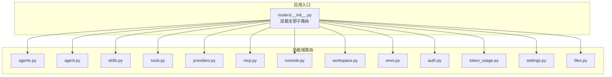
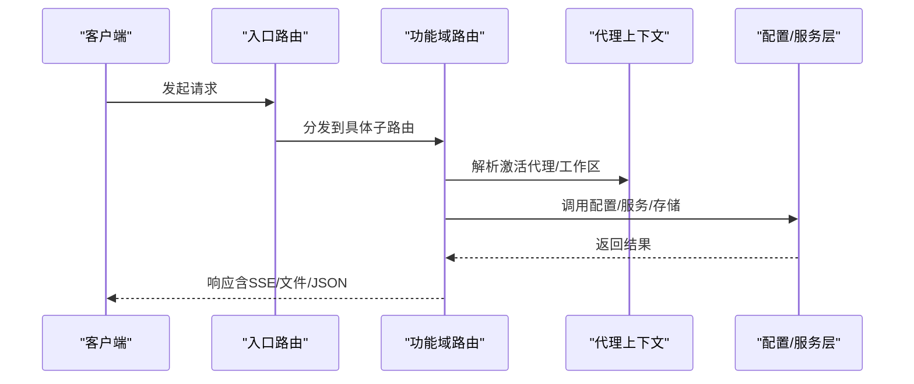
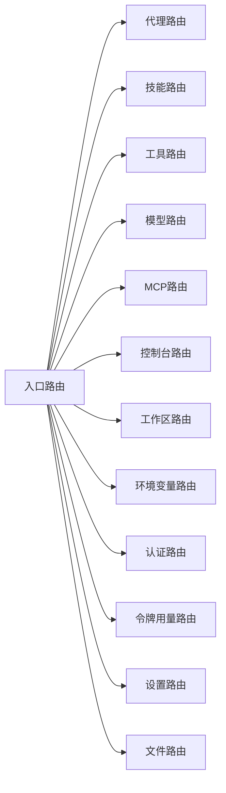

# RESTful API

<cite>
**本文引用的文件**
- [routers/__init__.py](file://src/qwenpaw/app/routers/__init__.py)
- [routers/agent.py](file://src/qwenpaw/app/routers/agent.py)
- [routers/agents.py](file://src/qwenpaw/app/routers/agents.py)
- [routers/auth.py](file://src/qwenpaw/app/routers/auth.py)
- [routers/console.py](file://src/qwenpaw/app/routers/console.py)
- [routers/envs.py](file://src/qwenpaw/app/routers/envs.py)
- [routers/mcp.py](file://src/qwenpaw/app/routers/mcp.py)
- [routers/providers.py](file://src/qwenpaw/app/routers/providers.py)
- [routers/skills.py](file://src/qwenpaw/app/routers/skills.py)
- [routers/tools.py](file://src/qwenpaw/app/routers/tools.py)
- [routers/workspace.py](file://src/qwenpaw/app/routers/workspace.py)
- [routers/token_usage.py](file://src/qwenpaw/app/routers/token_usage.py)
- [routers/settings.py](file://src/qwenpaw/app/routers/settings.py)
- [routers/files.py](file://src/qwenpaw/app/routers/files.py)
</cite>

## 目录
1. [简介](#简介)
2. [项目结构](#项目结构)
3. [核心组件](#核心组件)
4. [架构总览](#架构总览)
5. [详细组件分析](#详细组件分析)
6. [依赖分析](#依赖分析)
7. [性能考量](#性能考量)
8. [故障排查指南](#故障排查指南)
9. [结论](#结论)
10. [附录](#附录)

## 简介
本文件为 QwenPaw 的 RESTful API 文档，覆盖代理管理、消息与聊天、技能与工具、模型与提供方、工作区与环境变量、MCP 客户端、认证与会话、令牌用量统计、设置与文件预览等核心能力。文档包含端点清单、请求方法、URL 模式、请求参数、响应格式、错误码与处理策略，并对认证机制、授权规则与安全注意事项进行说明。

## 项目结构
- API 路由统一在应用入口挂载，按功能域划分模块化路由（如 /agents、/agent、/skills、/tools、/models、/mcp、/console、/workspace、/envs、/auth、/token-usage、/settings、/files）。
- 大多数端点基于 FastAPI 路由器定义，使用 Pydantic 模型进行请求/响应校验。
- 认证采用 Bearer Token；部分端点公开无需认证（如 /settings/language）。

图表来源
- [routers/__init__.py:25-45](file://src/qwenpaw/app/routers/__init__.py#L25-L45)

章节来源
- [routers/__init__.py:1-60](file://src/qwenpaw/app/routers/__init__.py#L1-L60)

## 核心组件
- 认证与授权
  - /auth/*：登录、注册、状态查询、令牌校验、更新资料。
  - 需要 Bearer Token 的端点通过 Authorization 头传递；未启用认证时部分端点返回空值或允许匿名访问。
- 代理与工作区
  - /agents/*：多代理列表、创建、更新、删除、排序、启停、工作区文件读写。
  - /agent/*：当前激活代理的语言、音频模式、转录提供方、运行配置、系统提示文件等。
  - /workspace/*：下载/上传工作区压缩包。
- 技能与工具
  - /skills/*：技能池与工作区技能管理、从 Hub 安装、上传 ZIP、批量刷新、导入任务状态。
  - /tools/*：内置工具开关与异步执行配置。
- 模型与提供方
  - /models/*：提供方列表、配置、自定义提供方、发现模型、测试连接/模型、增删模型、配置每模型参数、设置/查询当前生效模型。
- MCP 客户端
  - /mcp/*：列出/获取/创建/更新/切换/删除 MCP 客户端，查询远端工具清单。
- 控制台与聊天
  - /console/*：SSE 聊天流、停止聊天、上传附件、推送消息拉取。
- 环境变量与设置
  - /envs/*：批量保存/删除环境变量。
  - /settings/*：UI 语言设置（公开）。
- 文件与预览
  - /files/preview/*：绝对/相对路径文件预览下载。

章节来源
- [routers/auth.py:41-114](file://src/qwenpaw/app/routers/auth.py#L41-L114)
- [routers/agents.py:152-228](file://src/qwenpaw/app/routers/agents.py#L152-L228)
- [routers/agent.py:38-106](file://src/qwenpaw/app/routers/agent.py#L38-L106)
- [routers/workspace.py:112-203](file://src/qwenpaw/app/routers/workspace.py#L112-L203)
- [routers/skills.py:533-641](file://src/qwenpaw/app/routers/skills.py#L533-L641)
- [routers/tools.py:36-181](file://src/qwenpaw/app/routers/tools.py#L36-L181)
- [routers/providers.py:147-634](file://src/qwenpaw/app/routers/providers.py#L147-L634)
- [routers/mcp.py:220-484](file://src/qwenpaw/app/routers/mcp.py#L220-L484)
- [routers/console.py:68-216](file://src/qwenpaw/app/routers/console.py#L68-L216)
- [routers/envs.py:32-81](file://src/qwenpaw/app/routers/envs.py#L32-L81)
- [routers/settings.py:39-59](file://src/qwenpaw/app/routers/settings.py#L39-L59)
- [routers/files.py:9-25](file://src/qwenpaw/app/routers/files.py#L9-L25)

## 架构总览
- 请求进入应用后，由入口路由器聚合各功能域路由。
- 多数端点通过上下文解析当前激活代理的工作区，再调用配置/服务层完成业务逻辑。
- 认证中间件/钩子负责校验 Bearer Token；部分端点公开。
- SSE 流式响应用于控制台聊天，支持断线重连与停止。

图表来源
- [routers/__init__.py:25-45](file://src/qwenpaw/app/routers/__init__.py#L25-L45)
- [routers/console.py:75-148](file://src/qwenpaw/app/routers/console.py#L75-L148)

## 详细组件分析

### 认证与授权（/auth）
- 登录
  - 方法：POST
  - 路径：/auth/login
  - 请求体：用户名、密码
  - 响应：令牌与用户名
  - 错误：401 无效凭据；当未启用认证时返回空令牌/空用户名
- 注册
  - 方法：POST
  - 路径：/auth/register
  - 请求体：用户名、密码
  - 响应：令牌与用户名
  - 错误：403 未启用认证；403 已有用户；400 参数为空；409 注册失败
- 状态
  - 方法：GET
  - 路径：/auth/status
  - 响应：是否启用认证、是否存在用户
- 校验
  - 方法：GET
  - 路径：/auth/verify
  - 请求头：Authorization: Bearer <token>
  - 响应：是否有效及用户名
  - 错误：401 缺少令牌/令牌无效/过期
- 更新资料
  - 方法：POST
  - 路径：/auth/update-profile
  - 请求体：当前密码、新用户名（可选）、新密码（可选）
  - 响应：新令牌与用户名
  - 错误：403 未启用认证/无用户；400 参数非法；401 当前密码不正确

章节来源
- [routers/auth.py:41-174](file://src/qwenpaw/app/routers/auth.py#L41-L174)

### 多代理管理（/agents）
- 列表
  - 方法：GET
  - 路径：/agents
  - 响应：代理摘要数组（含名称、描述、工作区目录、启用状态）
- 重排顺序
  - 方法：PUT
  - 路径：/agents/order
  - 请求体：agent_ids（必须包含所有已配置代理且去重）
  - 响应：成功标志与最终顺序
- 获取单个
  - 方法：GET
  - 路径：/agents/{agentId}
  - 响应：完整代理配置
- 创建
  - 方法：POST
  - 路径：/agents
  - 请求体：名称、描述、工作区目录（可选）、语言、初始技能名列表（可选）
  - 响应：代理引用（含ID、工作区目录、启用状态）
- 更新
  - 方法：PUT
  - 路径：/agents/{agentId}
  - 请求体：代理配置（支持部分字段更新）
  - 响应：更新后的配置
- 删除
  - 方法：DELETE
  - 路径：/agents/{agentId}
  - 响应：成功标志
  - 错误：404 不存在；400 不可删除默认代理
- 启停
  - 方法：PATCH
  - 路径：/agents/{agentId}/toggle
  - 请求体：enabled
  - 响应：成功标志、代理ID、启用状态
  - 错误：404 不存在；400 不可禁用默认代理
- 工作区文件
  - 方法：GET
  - 路径：/agents/{agentId}/files
  - 响应：Markdown 文件元数据列表
  - 方法：GET
  - 路径：/agents/{agentId}/files/{filename}
  - 响应：文件内容
  - 方法：PUT
  - 路径：/agents/{agentId}/files/{filename}
  - 请求体：文件内容
  - 响应：写入成功标志

章节来源
- [routers/agents.py:152-531](file://src/qwenpaw/app/routers/agents.py#L152-L531)

### 当前代理配置（/agent）
- 工作区文件
  - 方法：GET
  - 路径：/agent/files
  - 响应：Markdown 文件元数据列表
  - 方法：GET
  - 路径：/agent/files/{md_name}
  - 响应：文件内容
  - 方法：PUT
  - 路径：/agent/files/{md_name}
  - 请求体：文件内容
- 内存文件
  - 方法：GET
  - 路径：/agent/memory
  - 响应：Markdown 文件元数据列表
  - 方法：GET
  - 路径：/agent/memory/{md_name}
  - 响应：文件内容
  - 方法：PUT
  - 路径：/agent/memory/{md_name}
  - 请求体：文件内容
- 语言
  - 方法：GET
  - 路径：/agent/language
  - 响应：语言与代理ID
  - 方法：PUT
  - 路径：/agent/language
  - 请求体：语言（zh/en/ru）
  - 响应：语言、复制文件列表、代理ID
- 音频模式
  - 方法：GET
  - 路径：/agent/audio-mode
  - 响应：音频模式（auto/native）
  - 方法：PUT
  - 路径：/agent/audio-mode
  - 请求体：音频模式
- 转录提供方类型
  - 方法：GET
  - 路径：/agent/transcription-provider-type
  - 响应：转录提供方类型（disabled/whisper_api/local_whisper）
  - 方法：PUT
  - 路径：/agent/transcription-provider-type
  - 请求体：提供方类型
- 本地 Whisper 可用性
  - 方法：GET
  - 路径：/agent/local-whisper-status
  - 响应：ffmpeg/openai-whisper 可用性检查结果
- 转录提供方列表
  - 方法：GET
  - 路径：/agent/transcription-providers
  - 响应：可用提供方列表与已配置提供方ID
- 设置转录提供方
  - 方法：PUT
  - 路径：/agent/transcription-provider
  - 请求体：提供方ID（可置空取消）
- 运行配置
  - 方法：GET
  - 路径：/agent/running-config
  - 响应：运行配置
  - 方法：PUT
  - 路径：/agent/running-config
  - 请求体：运行配置
- 系统提示文件
  - 方法：GET
  - 路径：/agent/system-prompt-files
  - 响应：启用的系统提示文件名列表
  - 方法：PUT
  - 路径：/agent/system-prompt-files
  - 请求体：文件名数组

章节来源
- [routers/agent.py:38-505](file://src/qwenpaw/app/routers/agent.py#L38-L505)

### 工作区（/workspace）
- 下载
  - 方法：GET
  - 路径：/workspace/download
  - 响应：application/zip 流（文件名为 qwenpaw_workspace_{agentId}_YYYYMMDD_HHMMSS.zip）
- 上传
  - 方法：POST
  - 路径：/workspace/upload
  - 请求体：multipart/form-data，文件字段为 zip
  - 响应：成功标志
  - 安全：校验 zip 并防止路径穿越；仅合并 zip 内容，不清理非 zip 文件

章节来源
- [routers/workspace.py:112-203](file://src/qwenpaw/app/routers/workspace.py#L112-L203)

### 技能（/skills）
- 列表（工作区）
  - 方法：GET
  - 路径：/skills
  - 响应：技能清单（含启用状态、通道、标签、配置、最后更新时间）
- 刷新（工作区）
  - 方法：POST
  - 路径：/skills/refresh
  - 响应：刷新后的技能清单
- Hub 搜索
  - 方法：GET
  - 路径：/skills/hub/search?q=&limit=
  - 响应：Hub 技能条目列表
- 工作区来源
  - 方法：GET
  - 路径：/skills/workspaces
  - 响应：各工作区的技能汇总
- 从 Hub 安装（开始）
  - 方法：POST
  - 路径：/skills/hub/install/start
  - 请求体：bundle_url、version、enable、target_name、overwrite
  - 响应：安装任务信息（含任务ID）
- 安装状态
  - 方法：GET
  - 路径：/skills/hub/install/status/{task_id}
  - 响应：任务状态
- 取消安装
  - 方法：POST
  - 路径：/skills/hub/install/cancel/{task_id}
  - 响应：任务ID与最终状态
- 技能池
  - 方法：GET
  - 路径：/skills/pool
  - 响应：技能池清单（含保护、同步状态、版本信息）
- 刷新技能池
  - 方法：POST
  - 路径：/skills/pool/refresh
  - 响应：刷新后的技能池清单
- 技能池内置来源
  - 方法：GET
  - 路径：/skills/pool/builtin-sources
  - 响应：内置导入候选
- 创建工作区技能
  - 方法：POST
  - 路径：/skills
  - 请求体：名称、内容、是否覆盖、引用、脚本、配置、是否启用
  - 响应：创建结果
- 上传 ZIP 到工作区
  - 方法：POST
  - 路径：/skills/upload
  - 请求体：文件（zip）、是否启用、是否覆盖、目标名称、重命名映射（JSON）
  - 响应：导入结果
- 在技能池创建
  - 方法：POST
  - 路径：/skills/pool/create
  - 请求体：名称、内容、引用、脚本、配置
  - 响应：创建结果
- 保存/重命名（技能池）
  - 方法：PUT
  - 路径：/skills/pool/save
  - 请求体：源名称（若省略则与目标同名）、目标名称、内容、配置
  - 响应：保存结果

章节来源
- [routers/skills.py:533-800](file://src/qwenpaw/app/routers/skills.py#L533-L800)

### 工具（/tools）
- 列表
  - 方法：GET
  - 路径：/tools
  - 响应：工具信息数组（名称、启用状态、描述、异步执行、图标）
- 开关
  - 方法：PATCH
  - 路径：/tools/{tool_name}/toggle
  - 响应：更新后的工具信息
- 异步执行
  - 方法：PATCH
  - 路径：/tools/{tool_name}/async-execution
  - 请求体：async_execution
  - 响应：更新后的工具信息

章节来源
- [routers/tools.py:36-181](file://src/qwenpaw/app/routers/tools.py#L36-L181)

### 模型与提供方（/models）
- 提供方列表
  - 方法：GET
  - 路径：/models
  - 响应：提供方信息数组
- 配置提供方
  - 方法：PUT
  - 路径：/models/{provider_id}/config
  - 请求体：api_key、base_url、chat_model、generate_kwargs
  - 响应：提供方信息
- 创建自定义提供方
  - 方法：POST
  - 路径：/models/custom-providers
  - 请求体：id、name、default_base_url、api_key_prefix、chat_model、models
  - 响应：提供方信息
- 测试提供方连接
  - 方法：POST
  - 路径：/models/{provider_id}/test
  - 请求体：api_key、base_url、chat_model
  - 响应：成功/失败与消息
- 发现模型
  - 方法：POST
  - 路径：/models/{provider_id}/discover?save=true
  - 请求体：api_key、base_url、chat_model
  - 响应：发现结果与新增数量
- 测试指定模型
  - 方法：POST
  - 路径：/models/{provider_id}/models/test
  - 请求体：model_id
  - 响应：成功/失败与消息
- 删除自定义提供方
  - 方法：DELETE
  - 路径：/models/custom-providers/{provider_id}
  - 响应：剩余提供方列表
- 添加模型到提供方
  - 方法：POST
  - 路径：/models/{provider_id}/models
  - 请求体：id、name
  - 响应：提供方信息
- 探测多模态能力
  - 方法：POST
  - 路径：/models/{provider_id}/models/{model_id:path}/probe-multimodal
  - 响应：图像/视频支持探测结果
- 从提供方移除模型
  - 方法：DELETE
  - 路径：/models/{provider_id}/models/{model_id:path}
  - 响应：提供方信息
- 配置每模型参数
  - 方法：PUT
  - 路径：/models/{provider_id}/models/{model_id:path}/config
  - 请求体：generate_kwargs
  - 响应：提供方信息
- 查询当前生效模型
  - 方法：GET
  - 路径：/models/active?scope=effective|global|agent&agent_id=...
  - 响应：当前生效模型槽位
- 设置当前生效模型
  - 方法：PUT
  - 路径：/models/active
  - 请求体：provider_id、model、scope=global|agent、agent_id（scope=agent时必填）
  - 响应：当前生效模型槽位

章节来源
- [routers/providers.py:147-634](file://src/qwenpaw/app/routers/providers.py#L147-L634)

### MCP 客户端（/mcp）
- 列出工具
  - 方法：GET
  - 路径：/mcp/{client_key}/tools
  - 响应：工具清单（名称、描述、输入Schema）
  - 错误：503 未就绪；502 查询失败；404 客户端不存在/禁用
- 列表
  - 方法：GET
  - 路径：/mcp
  - 响应：客户端信息数组（含名称、描述、启用、传输类型、URL/命令/参数/环境变量/工作目录等，敏感值掩码显示）
- 获取
  - 方法：GET
  - 路径：/mcp/{client_key}
  - 响应：客户端详情（敏感值掩码）
- 创建
  - 方法：POST
  - 路：/mcp
  - 请求体：client_key（嵌入）、客户端创建请求（名称、描述、启用、传输类型、URL/命令/参数/环境变量/工作目录等）
  - 响应：新建客户端信息
- 更新
  - 方法：PUT
  - 路径：/mcp/{client_key}
  - 请求体：客户端更新请求（字段可选，支持恢复被掩码的敏感值）
  - 响应：更新后客户端信息
- 切换启用
  - 方法：PATCH
  - 路径：/mcp/{client_key}/toggle
  - 响应：切换后客户端信息
- 删除
  - 方法：DELETE
  - 路径：/mcp/{client_key}
  - 响应：删除成功消息

章节来源
- [routers/mcp.py:220-484](file://src/qwenpaw/app/routers/mcp.py#L220-L484)

### 控制台与聊天（/console）
- 聊天（SSE）
  - 方法：POST
  - 路径：/console/chat
  - 请求体：支持两种形式
    - AgentRequest 结构（包含 channel、user_id、session_id、input 等）
    - 普通字典（包含 channel、user_id、session_id、input 等）
  - 响应：SSE 流，支持 reconnect=true 断线重连
  - 错误：400 请求体解析失败；503 控制台通道不可用
- 停止聊天
  - 方法：POST
  - 路径：/console/chat/stop
  - 请求体：chat_id
  - 响应：停止结果
- 上传附件
  - 方法：POST
  - 路径：/console/upload
  - 请求体：multipart/form-data，文件字段
  - 响应：存储路径、原始文件名、大小
  - 错误：400 文件过大（最大 10MB）
- 推送消息
  - 方法：GET
  - 路径：/console/push-messages?session_id=...
  - 响应：最近推送消息（可按会话过滤）

章节来源
- [routers/console.py:68-216](file://src/qwenpaw/app/routers/console.py#L68-L216)

### 环境变量（/envs）
- 列表
  - 方法：GET
  - 路径：/envs
  - 响应：键值对数组
- 批量保存
  - 方法：PUT
  - 路径：/envs
  - 请求体：键值映射（将替换全部环境变量）
  - 响应：保存后的键值对数组
  - 错误：400 空键
- 删除
  - 方法：DELETE
  - 路径：/envs/{key}
  - 响应：删除后剩余键值对数组
  - 错误：404 不存在

章节来源
- [routers/envs.py:32-81](file://src/qwenpaw/app/routers/envs.py#L32-L81)

### 设置（/settings）
- 获取 UI 语言
  - 方法：GET
  - 路径：/settings/language
  - 响应：语言代码
- 更新 UI 语言
  - 方法：PUT
  - 路径：/settings/language
  - 请求体：语言代码（en/zh/ja/ru）
  - 响应：更新后的语言代码
  - 错误：400 非法语言

章节来源
- [routers/settings.py:39-59](file://src/qwenpaw/app/routers/settings.py#L39-L59)

### 文件预览（/files）
- 预览
  - 方法：GET/HEAD
  - 路径：/files/preview/{filepath:path}
  - 响应：文件下载
  - 错误：404 不存在

章节来源
- [routers/files.py:9-25](file://src/qwenpaw/app/routers/files.py#L9-L25)

### 令牌用量（/token-usage）
- 获取汇总
  - 方法：GET
  - 路径：/token-usage?start_date=&end_date=&model=&provider=
  - 响应：按日期/模型/提供方聚合的令牌用量摘要
  - 默认：近 30 天

章节来源
- [routers/token_usage.py:23-62](file://src/qwenpaw/app/routers/token_usage.py#L23-L62)

## 依赖分析
- 组件耦合
  - 入口路由聚合所有子路由，子路由间低耦合，通过上下文与配置层交互。
  - 控制台聊天依赖任务追踪器与通道管理器，形成“请求—队列—事件流”的解耦。
  - 技能与工具管理依赖工作区/技能池清单与扫描器，提供安全拦截与回滚机制。
- 外部依赖
  - 提供方管理依赖外部模型服务；MCP 客户端依赖外部 MCP 服务器；控制台上传依赖本地文件系统。
- 循环依赖
  - 路由模块相互独立，未见循环导入。

图表来源
- [routers/__init__.py:25-45](file://src/qwenpaw/app/routers/__init__.py#L25-L45)

## 性能考量
- SSE 流式响应
  - 控制台聊天使用 SSE，客户端断开自动释放订阅；建议合理设置超时与背压。
- 异步热重载
  - 更新代理配置/模型/技能后触发异步重载，避免阻塞请求。
- ZIP 操作
  - 工作区上传/下载在后台线程执行，避免阻塞主事件循环。
- 模型探测
  - 多模态探测为轻量请求，失败不影响主流程。

## 故障排查指南
- 认证类
  - 401：缺少或无效 Bearer 令牌；确认 /auth/verify 成功；检查令牌有效期。
  - 403：认证未启用或已有用户；注册仅允许一次。
- 代理与工作区
  - 404：代理不存在；工作区文件不存在。
  - 503：控制台通道未找到；MCP 客户端未连接。
  - 500：内部错误（如保存配置失败、解压异常）。
- 技能与工具
  - 422：技能扫描失败（返回安全扫描错误详情）；409：冲突（建议改名）。
- 模型与提供方
  - 404：提供方/模型不存在；400：参数无效（如模型不在提供方内）。
- 控制台
  - 400：请求体格式错误；上传文件过大。
- 环境变量
  - 400：空键；404：键不存在。

章节来源
- [routers/console.py:85-148](file://src/qwenpaw/app/routers/console.py#L85-L148)
- [routers/skills.py:68-108](file://src/qwenpaw/app/routers/skills.py#L68-L108)
- [routers/providers.py:570-634](file://src/qwenpaw/app/routers/providers.py#L570-L634)

## 结论
本 API 文档系统梳理了 QwenPaw 的核心 RESTful 接口，覆盖代理生命周期、工作区、技能与工具、模型与提供方、MCP、控制台聊天、环境变量、设置与文件预览、令牌用量统计与认证授权。通过明确的端点规范、参数校验与错误码，开发者可快速集成与扩展。建议在生产环境中启用认证、限制上传文件大小、对敏感配置进行掩码展示，并定期审查技能与工具的安全策略。

## 附录

### 版本控制与兼容性
- 版本策略
  - 本项目未在路由层显式声明 API 版本号；建议通过路径前缀（如 /v1/...）或 Accept 头进行版本化。
- 向后兼容
  - 新增字段以可选方式提供；变更字段需谨慎评估影响范围。
- 迁移指南
  - 对于 /skills/pool/save 等可能产生冲突的端点，遵循返回的建议名称进行重命名。
  - 对于 /models/active 的 scope 参数变化，确保客户端正确传入 agent_id。

### 请求与响应示例（说明性）
- 登录
  - 请求：POST /auth/login，Body: {"username":"...","password":"..."}
  - 响应：{"token":"...","username":"..."}
- 创建代理
  - 请求：POST /agents，Body: {"name":"...","language":"zh","skill_names":["..."]}
  - 响应：{"id":"...","workspace_dir":"...","enabled":true}
- 控制台聊天（SSE）
  - 请求：POST /console/chat，Body: {"input":[{"type":"text","content":"..."}]}
  - 响应：SSE 事件流，事件类型包含数据与错误
- 工作区上传
  - 请求：POST /workspace/upload，Body: multipart/form-data, file=zip
  - 响应：{"success":true}