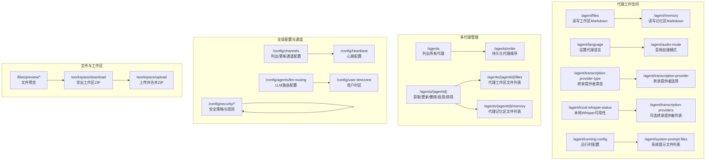
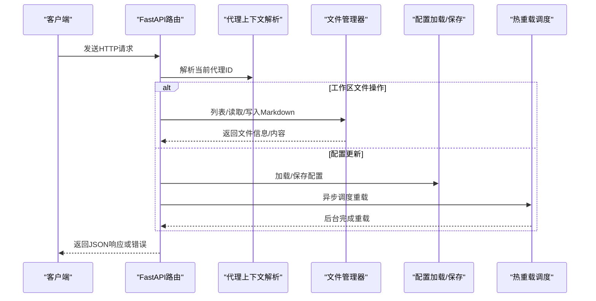
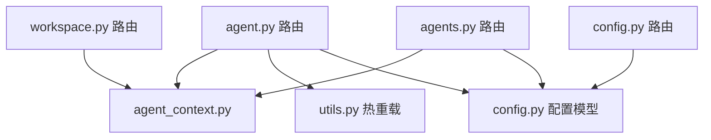

# 代理管理API

<cite>
**本文档引用的文件**
- [agent.py](file://src/qwenpaw/app/routers/agent.py)
- [agents.py](file://src/qwenpaw/app/routers/agents.py)
- [workspace.py](file://src/qwenpaw/app/routers/workspace.py)
- [config.py](file://src/qwenpaw/app/routers/config.py)
- [files.py](file://src/qwenpaw/app/routers/files.py)
- [utils.py](file://src/qwenpaw/app/utils.py)
- [agent_context.py](file://src/qwenpaw/app/agent_context.py)
- [config.py](file://src/qwenpaw/config/config.py)
- [schemas_config.py](file://src/qwenpaw/app/routers/schemas_config.py)
- [exceptions.py](file://src/qwenpaw/exceptions.py)
</cite>

## 目录
1. [简介](#简介)
2. [项目结构](#项目结构)
3. [核心组件](#核心组件)
4. [架构总览](#架构总览)
5. [详细组件分析](#详细组件分析)
6. [依赖分析](#依赖分析)
7. [性能考虑](#性能考虑)
8. [故障排除指南](#故障排除指南)
9. [结论](#结论)
10. [附录](#附录)

## 简介
本文件为 QwenPaw 代理管理 API 的完整技术文档，覆盖代理创建、配置、删除与状态管理的全部 HTTP 接口；详细说明代理工作空间文件管理（/agent/files、/agent/memory）、代理语言设置（/agent/language）、音频模式配置（/agent/audio-mode）等核心功能；同时包含代理运行时配置、系统提示文件管理、转录提供者配置等高级功能端点。文档提供请求参数、响应格式、错误码与实际使用示例，并涵盖代理热重载机制、配置验证与安全注意事项。

## 项目结构
后端采用 FastAPI 构建，API 路由按功能模块划分：
- 代理工作空间与文件管理：/agent/files、/agent/memory、/agent/language、/agent/audio-mode、/agent/transcription-*、/agent/running-config、/agent/system-prompt-files、/workspace/*
- 多代理管理：/agents/*（创建、更新、删除、启用/禁用、列表、排序）
- 全局配置与通道：/config/*
- 文件预览：/files/preview/*
- 代理上下文与热重载工具：agent_context.py、utils.py

图表来源
- [agent.py:1-505](file://src/qwenpaw/app/routers/agent.py#L1-L505)
- [agents.py:1-726](file://src/qwenpaw/app/routers/agents.py#L1-L726)
- [workspace.py:1-203](file://src/qwenpaw/app/routers/workspace.py#L1-L203)
- [config.py:1-644](file://src/qwenpaw/app/routers/config.py#L1-L644)
- [files.py:1-25](file://src/qwenpaw/app/routers/files.py#L1-L25)

章节来源
- [agent.py:1-505](file://src/qwenpaw/app/routers/agent.py#L1-L505)
- [agents.py:1-726](file://src/qwenpaw/app/routers/agents.py#L1-L726)
- [workspace.py:1-203](file://src/qwenpaw/app/routers/workspace.py#L1-L203)
- [config.py:1-644](file://src/qwenpaw/app/routers/config.py#L1-L644)
- [files.py:1-25](file://src/qwenpaw/app/routers/files.py#L1-L25)

## 核心组件
- 代理工作空间文件管理器：用于读取/写入工作区与记忆区的 Markdown 文件，支持元数据返回（文件名、路径、大小、时间戳）。
- 代理上下文解析：根据请求头或路由状态解析当前活跃代理，确保每个端点操作正确的代理工作区。
- 热重载调度器：在更新配置后异步触发代理重载，保证配置变更即时生效且不阻塞请求。
- 配置模型与校验：通过 Pydantic 模型对请求体进行严格校验，确保输入合法与默认值一致。
- 安全与异常处理：统一的异常转换与错误响应，便于前端展示与调试。

章节来源
- [agent.py:22-36](file://src/qwenpaw/app/routers/agent.py#L22-L36)
- [agent_context.py:28-112](file://src/qwenpaw/app/agent_context.py#L28-L112)
- [utils.py:15-59](file://src/qwenpaw/app/utils.py#L15-L59)
- [config.py:1-200](file://src/qwenpaw/config/config.py#L1-L200)

## 架构总览
下图展示了代理管理 API 的关键交互流程：请求进入后经代理上下文解析确定目标代理，随后调用相应服务（文件管理器、配置加载/保存、热重载调度），最终返回标准响应或错误。

图表来源
- [agent.py:44-106](file://src/qwenpaw/app/routers/agent.py#L44-L106)
- [agent.py:448-464](file://src/qwenpaw/app/routers/agent.py#L448-L464)
- [agent_context.py:28-112](file://src/qwenpaw/app/agent_context.py#L28-L112)
- [utils.py:15-59](file://src/qwenpaw/app/utils.py#L15-L59)

## 详细组件分析

### 代理工作空间文件管理（/agent/files 与 /agent/memory）
- 功能概述
  - /agent/files：列出工作区 Markdown 文件，返回文件元数据；读取指定文件内容；写入或创建文件。
  - /agent/memory：与工作区类似，但针对记忆区目录。
- 请求与响应
  - 列表接口：返回文件元数据数组，包含文件名、路径、大小、创建与修改时间。
  - 读取接口：返回包含内容的 JSON 对象。
  - 写入接口：成功返回包含布尔标志的对象。
- 错误处理
  - 文件不存在：404。
  - 服务器内部错误：500。
- 使用示例
  - 获取工作区文件列表：GET /agent/files
  - 读取某文件：GET /agent/files/{md_name}
  - 写入文件：PUT /agent/files/{md_name}，Body 为包含 content 的对象

章节来源
- [agent.py:38-177](file://src/qwenpaw/app/routers/agent.py#L38-L177)

### 代理语言设置（/agent/language）
- 功能概述
  - 获取当前代理语言设置。
  - 更新代理语言（支持 zh/en/ru）。若语言变更，会自动从内置模板复制对应语言的 Markdown 文件到工作区。
- 请求与响应
  - GET：返回当前语言与代理ID。
  - PUT：接收包含 language 字段的对象；返回新语言、复制的文件列表与代理ID。
- 参数校验
  - 仅允许指定集合内的语言值，否则返回 400。
- 使用示例
  - 设置语言：PUT /agent/language，Body: {"language":"zh"}

章节来源
- [agent.py:180-259](file://src/qwenpaw/app/routers/agent.py#L180-L259)

### 音频模式配置（/agent/audio-mode）
- 功能概述
  - 获取音频处理模式（auto/native）。
  - 更新音频处理模式。
- 可选值
  - auto：当存在可用转录提供者时进行转录，否则以文件占位形式处理。
  - native：直接发送音频块给模型（可能需要 ffmpeg）。
- 请求与响应
  - GET：返回当前 audio_mode。
  - PUT：接收包含 audio_mode 的对象；返回更新后的值。

章节来源
- [agent.py:262-306](file://src/qwenpaw/app/routers/agent.py#L262-L306)

### 转录提供者配置（/agent/transcription-provider-type、/agent/transcription-provider、/agent/transcription-providers、/agent/local-whisper-status）
- 功能概述
  - 获取/设置转录提供者类型（disabled/whisper_api/local_whisper）。
  - 获取/设置当前使用的转录提供者ID（空字符串表示未设置）。
  - 列出可用的转录提供者及当前配置。
  - 检查本地 Whisper 依赖（ffmpeg/openai-whisper）可用性。
- 请求与响应
  - 类型设置：PUT /agent/transcription-provider-type，Body: {"transcription_provider_type":"..."}
  - 提供者设置：PUT /agent/transcription-provider，Body: {"provider_id":"..."}
  - 列表查询：GET /agent/transcription-providers
  - 本地状态：GET /agent/local-whisper-status

章节来源
- [agent.py:309-424](file://src/qwenpaw/app/routers/agent.py#L309-L424)

### 代理运行时配置（/agent/running-config）
- 功能概述
  - 获取/更新代理运行时配置（AgentsRunningConfig）。
  - 更新后异步触发代理重载，确保配置即时生效。
- 请求与响应
  - GET：返回 AgentsRunningConfig。
  - PUT：接收 AgentsRunningConfig；返回更新后的配置。

章节来源
- [agent.py:427-464](file://src/qwenpaw/app/routers/agent.py#L427-L464)
- [utils.py:15-59](file://src/qwenpaw/app/utils.py#L15-L59)

### 系统提示文件管理（/agent/system-prompt-files）
- 功能概述
  - 获取当前启用的系统提示 Markdown 文件列表。
  - 更新系统提示文件列表，支持动态注入多个文件内容。
- 请求与响应
  - GET：返回文件名数组。
  - PUT：接收文件名数组；返回更新后的数组。

章节来源
- [agent.py:467-504](file://src/qwenpaw/app/routers/agent.py#L467-L504)

### 多代理管理（/agents/*）
- 功能概述
  - 列出所有已配置代理，支持从配置中读取描述信息。
  - 保存代理顺序（持久化 UI 排序）。
  - 创建新代理（自动生成短ID，初始化工作区与技能池）。
  - 更新/删除代理；启用/禁用代理（默认代理不可删除/禁用）。
  - 查询指定代理的工作区与记忆区文件列表。
- 请求与响应
  - 列表：GET /agents
  - 顺序：PUT /agents/order，Body: {"agent_ids":[...]}
  - 创建：POST /agents，Body: 创建请求模型
  - 获取/更新/删除/启用/禁用：GET/PUT/DELETE/PATCH /agents/{agentId}
  - 文件列表：GET /agents/{agentId}/files
  - 记忆区列表：GET /agents/{agentId}/memory

章节来源
- [agents.py:152-726](file://src/qwenpaw/app/routers/agents.py#L152-L726)

### 全局配置与通道（/config/*）
- 功能概述
  - 列出/更新通道配置（Telegram、Discord、飞书、QQ、Console、Voice、Mattermost、MQTT、Matrix、企业微信等）。
  - 获取/更新心跳配置（包含启用、间隔、目标、活跃时段）。
  - 获取/更新代理 LLM 路由配置。
  - 获取/设置用户时区。
  - 安全策略：工具守卫、文件守卫、技能扫描器白名单与历史记录。
- 请求与响应
  - 通道：GET/PUT /config/channels；GET/PUT /config/channels/{channel_name}
  - 心跳：GET/PUT /config/heartbeat
  - LLM路由：GET/PUT /config/agents/llm-routing
  - 用户时区：GET/PUT /config/user-timezone
  - 安全：GET/PUT /config/security/tool-guard、/config/security/file-guard、/config/security/skill-scanner 及其子端点

章节来源
- [config.py:64-644](file://src/qwenpaw/app/routers/config.py#L64-L644)
- [schemas_config.py:11-23](file://src/qwenpaw/app/routers/schemas_config.py#L11-L23)

### 工作区打包与上传（/workspace/*）
- 功能概述
  - 下载当前代理工作区为 ZIP 流式响应。
  - 上传 ZIP 并合并到工作区（覆盖文件、合并目录）。
- 请求与响应
  - 下载：GET /workspace/download
  - 上传：POST /workspace/upload，multipart/form-data，字段为 file

章节来源
- [workspace.py:112-203](file://src/qwenpaw/app/routers/workspace.py#L112-L203)

### 文件预览（/files/preview/*）
- 功能概述
  - 预览任意绝对或相对路径下的文件，返回文件流。
- 注意事项
  - 仅支持 GET/HEAD 方法。
  - 非文件路径返回 404。

章节来源
- [files.py:9-25](file://src/qwenpaw/app/routers/files.py#L9-L25)

## 依赖分析
- 组件耦合
  - 路由层依赖代理上下文解析与热重载工具，确保配置更新后异步重载。
  - 文件管理端点依赖代理工作区目录结构，避免跨代理访问。
  - 配置端点依赖全局配置加载/保存与代理配置加载/保存。
- 外部依赖
  - 转录能力依赖 Whisper 提供者与本地 Whisper 状态检查。
  - 通道配置依赖各渠道 SDK 与认证流程（如二维码授权）。

图表来源
- [agent.py:1-505](file://src/qwenpaw/app/routers/agent.py#L1-L505)
- [agents.py:1-726](file://src/qwenpaw/app/routers/agents.py#L1-L726)
- [workspace.py:1-203](file://src/qwenpaw/app/routers/workspace.py#L1-L203)
- [config.py:1-644](file://src/qwenpaw/app/routers/config.py#L1-L644)
- [agent_context.py:1-155](file://src/qwenpaw/app/agent_context.py#L1-L155)
- [utils.py:1-59](file://src/qwenpaw/app/utils.py#L1-L59)
- [config.py:1-200](file://src/qwenpaw/config/config.py#L1-L200)

## 性能考虑
- 异步热重载：配置更新后通过后台任务触发重载，避免阻塞请求响应。
- 文件操作：工作区/记忆区文件读写基于本地磁盘，建议控制单次写入内容大小，避免长时间阻塞。
- ZIP 导入：上传合并为同步阻塞操作，建议限制文件大小与数量，必要时在后台队列处理。
- 转录依赖：本地 Whisper 需要 ffmpeg 与 openai-whisper，部署前应预先检测可用性。

## 故障排除指南
- 常见错误码
  - 400：请求参数非法（如语言/音频模式/转录提供者类型不在允许集合内）。
  - 403：代理被禁用。
  - 404：代理不存在、文件不存在。
  - 500：服务器内部错误（文件系统异常、配置保存失败、转录提供者不可用等）。
- 错误处理与转换
  - LLM 相关异常会被转换为统一的运行时异常，便于前端识别与展示。
  - 通道通信错误、技能扫描异常等有专门的异常类型。
- 定位建议
  - 检查代理上下文解析是否正确（请求头 X-Agent-Id 或路由状态）。
  - 确认工作区目录存在且可读写。
  - 对于转录问题，先检查本地 Whisper 状态，再确认提供者配置。

章节来源
- [exceptions.py:1-200](file://src/qwenpaw/exceptions.py#L1-L200)
- [agent.py:213-222](file://src/qwenpaw/app/routers/agent.py#L213-L222)
- [agent.py:293-302](file://src/qwenpaw/app/routers/agent.py#L293-L302)
- [agent.py:400-424](file://src/qwenpaw/app/routers/agent.py#L400-L424)

## 结论
本文档系统梳理了 QwenPaw 代理管理 API 的核心端点与工作机制，覆盖代理工作空间文件管理、语言与音频配置、转录提供者、运行时配置与系统提示文件、多代理生命周期管理以及全局配置与安全策略。通过严格的参数校验、统一的错误处理与异步热重载机制，API 在易用性与稳定性之间取得良好平衡。建议在生产环境中结合安全策略与资源监控，确保代理配置与文件操作的安全与高效。

## 附录
- 术语
  - 代理：独立的智能体实例，拥有自己的工作区、配置与运行时状态。
  - 工作区：代理的“工作目录”，存放临时与会话相关文件。
  - 记忆区：代理的“记忆目录”，存放长期记忆相关的文件。
  - 热重载：在不重启服务的情况下重新加载代理配置。
- 最佳实践
  - 更新运行时配置后，等待热重载完成再进行后续操作。
  - 使用 /agents/order 持久化 UI 排序，避免每次启动顺序不一致。
  - 对于大文件或批量操作，优先使用 /workspace/upload 下载/合并工作区。
  - 定期检查 /agent/local-whisper-status，确保转录能力可用。