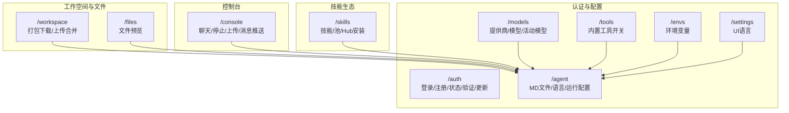
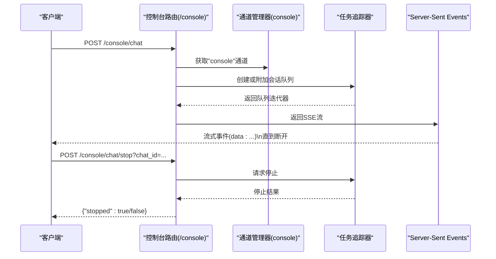
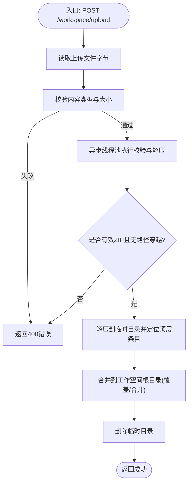
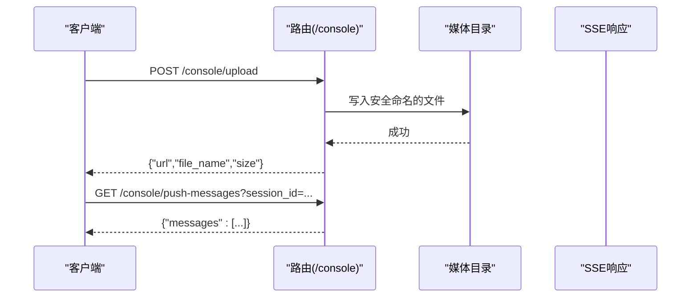
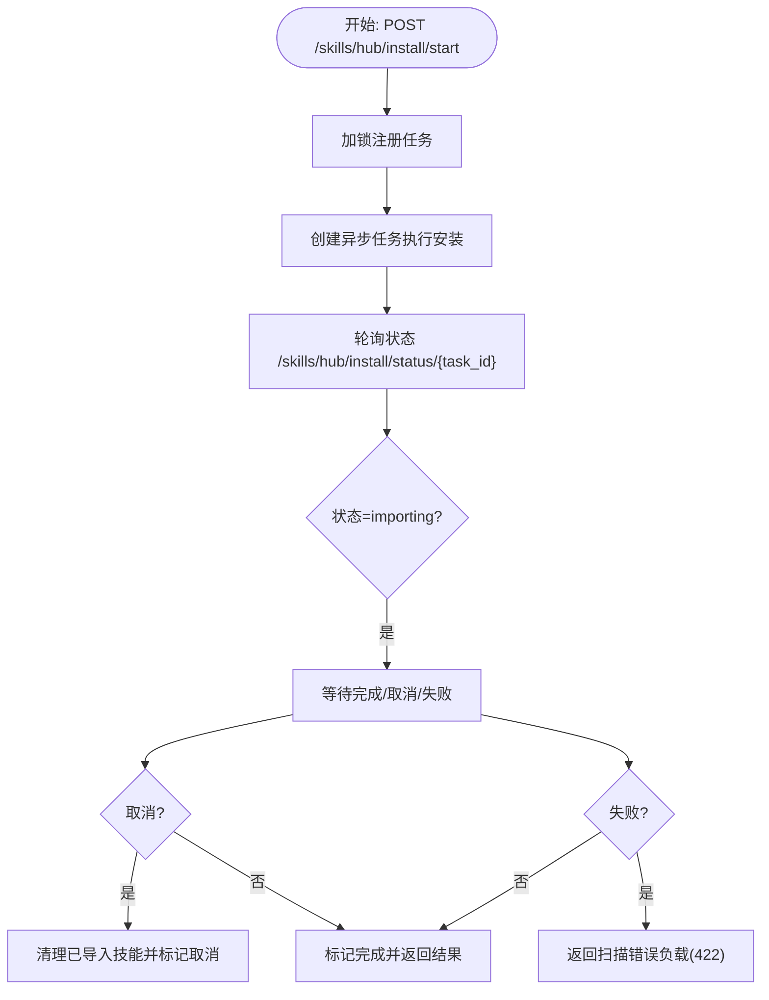
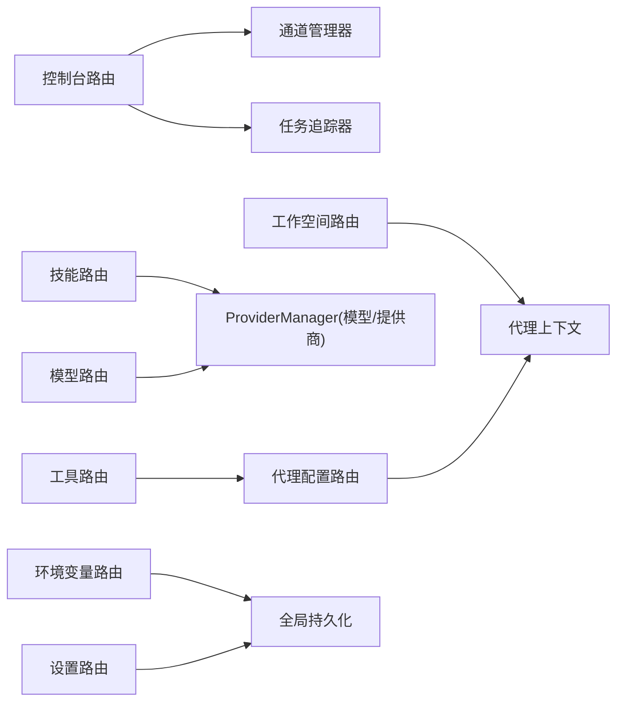

# 工作空间与控制台API

<cite>
**本文档引用的文件**
- [workspace.py](file://src/qwenpaw/app/routers/workspace.py)
- [files.py](file://src/qwenpaw/app/routers/files.py)
- [console.py](file://src/qwenpaw/app/routers/console.py)
- [auth.py](file://src/qwenpaw/app/routers/auth.py)
- [agent.py](file://src/qwenpaw/app/routers/agent.py)
- [skills.py](file://src/qwenpaw/app/routers/skills.py)
- [tools.py](file://src/qwenpaw/app/routers/tools.py)
- [providers.py](file://src/qwenpaw/app/routers/providers.py)
- [envs.py](file://src/qwenpaw/app/routers/envs.py)
- [settings.py](file://src/qwenpaw/app/routers/settings.py)
</cite>

## 目录
1. [简介](#简介)
2. [项目结构](#项目结构)
3. [核心组件](#核心组件)
4. [架构总览](#架构总览)
5. [详细组件分析](#详细组件分析)
6. [依赖分析](#依赖分析)
7. [性能考虑](#性能考虑)
8. [故障排查指南](#故障排查指南)
9. [结论](#结论)
10. [附录](#附录)

## 简介
本文件为 QwenPaw 工作空间与控制台 API 的权威技术文档，覆盖文件系统操作、工作空间管理、控制台交互、认证鉴权、模型与工具配置、技能池管理、环境变量与全局设置等全部后端 HTTP 接口。重点说明：
- 文件上传下载、目录浏览、预览与安全校验
- 工作空间隔离与合并策略（按代理维度）
- 控制台聊天流式响应、媒体上传与消息推送
- 权限控制与认证流程
- 技能导入、版本与冲突处理、回滚机制
- 性能优化、并发控制与错误恢复策略

## 项目结构
后端采用 FastAPI 路由模块化组织，按功能域划分 API 前缀：
- /workspace：工作空间打包下载与上传合并
- /files：文件预览
- /console：控制台聊天、媒体上传、消息推送
- /auth：登录、注册、状态查询、令牌验证、资料更新
- /agent：工作文件/记忆文件读写、语言切换、运行配置、音频模式与转录配置
- /skills：技能列表、导入、上传、池管理、Hub 安装任务
- /tools：内置工具启用/禁用与异步执行开关
- /models：LLM 提供商与模型管理、活动模型设置
- /envs：环境变量批量管理
- /settings：UI 语言等全局设置

**图表来源**
- [workspace.py:1-203](file://src/qwenpaw/app/routers/workspace.py#L1-L203)
- [files.py:1-25](file://src/qwenpaw/app/routers/files.py#L1-L25)
- [console.py:1-216](file://src/qwenpaw/app/routers/console.py#L1-L216)
- [auth.py:1-174](file://src/qwenpaw/app/routers/auth.py#L1-L174)
- [agent.py:1-505](file://src/qwenpaw/app/routers/agent.py#L1-L505)
- [skills.py:1-800](file://src/qwenpaw/app/routers/skills.py#L1-L800)
- [tools.py:1-181](file://src/qwenpaw/app/routers/tools.py#L1-L181)
- [providers.py:1-634](file://src/qwenpaw/app/routers/providers.py#L1-L634)
- [envs.py:1-81](file://src/qwenpaw/app/routers/envs.py#L1-L81)
- [settings.py:1-59](file://src/qwenpaw/app/routers/settings.py#L1-L59)

**章节来源**
- [workspace.py:1-203](file://src/qwenpaw/app/routers/workspace.py#L1-L203)
- [console.py:1-216](file://src/qwenpaw/app/routers/console.py#L1-L216)
- [agent.py:1-505](file://src/qwenpaw/app/routers/agent.py#L1-L505)
- [skills.py:1-800](file://src/qwenpaw/app/routers/skills.py#L1-L800)

## 核心组件
- 工作空间路由器：提供工作空间打包下载与 ZIP 合并上传，支持路径穿越防护与线程池阻塞操作异步化
- 控制台路由器：提供聊天流式输出、停止会话、媒体上传与消息推送
- 认证路由器：提供登录、注册、状态查询、令牌验证与资料更新
- 代理配置路由器：提供工作/记忆文件读写、语言切换、运行配置热重载
- 技能路由器：提供技能列表、上传ZIP、池管理、Hub 安装任务与并发控制
- 工具路由器：提供内置工具开关与异步执行配置
- 模型路由器：提供提供商/模型管理、活动模型设置与多作用域读取
- 环境变量与设置路由器：提供环境变量批量管理与 UI 语言设置

**章节来源**
- [workspace.py:112-203](file://src/qwenpaw/app/routers/workspace.py#L112-L203)
- [console.py:68-216](file://src/qwenpaw/app/routers/console.py#L68-L216)
- [auth.py:41-174](file://src/qwenpaw/app/routers/auth.py#L41-L174)
- [agent.py:38-505](file://src/qwenpaw/app/routers/agent.py#L38-L505)
- [skills.py:533-800](file://src/qwenpaw/app/routers/skills.py#L533-L800)
- [tools.py:36-181](file://src/qwenpaw/app/routers/tools.py#L36-L181)
- [providers.py:147-634](file://src/qwenpaw/app/routers/providers.py#L147-L634)
- [envs.py:32-81](file://src/qwenpaw/app/routers/envs.py#L32-L81)
- [settings.py:39-59](file://src/qwenpaw/app/routers/settings.py#L39-L59)

## 架构总览
下图展示控制台聊天请求在后端的调用链路与关键组件协作。

**图表来源**
- [console.py:68-164](file://src/qwenpaw/app/routers/console.py#L68-L164)

## 详细组件分析

### 工作空间 API（/workspace）
- 下载工作空间
  - 方法与路径：GET /workspace/download
  - 功能：将当前代理的工作空间打包为 ZIP 并以流式响应返回
  - 安全性：若工作空间不存在返回 404；使用线程池执行压缩避免阻塞
  - 响应：application/zip，Content-Disposition 附带时间戳文件名
- 上传并合并工作空间
  - 方法与路径：POST /workspace/upload
  - 功能：接收 ZIP 文件，进行路径穿越检测与解压合并；仅覆盖/合并 ZIP 内容，不清理其他文件
  - 安全性：严格校验 ZIP 类型与路径合法性；异常统一转换为 HTTP 4xx/5xx
  - 并发与性能：使用线程池执行阻塞解压与拷贝；临时目录自动清理

**图表来源**
- [workspace.py:153-203](file://src/qwenpaw/app/routers/workspace.py#L153-L203)
- [workspace.py:56-105](file://src/qwenpaw/app/routers/workspace.py#L56-L105)

**章节来源**
- [workspace.py:112-203](file://src/qwenpaw/app/routers/workspace.py#L112-L203)

### 文件预览 API（/files）
- 预览文件
  - 方法与路径：GET /files/preview/{filepath:path}，HEAD 支持
  - 功能：对绝对或相对路径解析并返回文件响应；非文件或不存在返回 404
  - 注意：该接口直接映射到文件系统，需确保访问范围受控

**章节来源**
- [files.py:9-25](file://src/qwenpaw/app/routers/files.py#L9-L25)

### 控制台 API（/console）
- 聊天（流式）
  - 方法与路径：POST /console/chat
  - 功能：根据请求体提取会话元数据，创建或获取会话，启动/附加任务队列，返回 SSE 流
  - 断连重连：支持 reconnect=true 重新连接已有流
  - 错误处理：内部异常以事件形式返回错误信息
- 停止聊天
  - 方法与路径：POST /console/chat/stop?chat_id=...
  - 功能：向任务追踪器发送停止请求
- 上传媒体
  - 方法与路径：POST /console/upload
  - 功能：保存到控制台通道媒体目录，限制最大大小，生成安全文件名
- 推送消息
  - 方法与路径：GET /console/push-messages?session_id=...
  - 功能：返回未消费推送消息；可按会话过滤

**图表来源**
- [console.py:166-216](file://src/qwenpaw/app/routers/console.py#L166-L216)

**章节来源**
- [console.py:68-216](file://src/qwenpaw/app/routers/console.py#L68-L216)

### 认证 API（/auth）
- 登录
  - 方法与路径：POST /auth/login
  - 功能：用户名密码认证，返回令牌与用户名；若未启用认证则返回空令牌
- 注册
  - 方法与路径：POST /auth/register
  - 功能：单用户注册（仅允许一次），校验环境开关与用户存在性
- 状态
  - 方法与路径：GET /auth/status
  - 功能：返回认证开关与是否存在用户
- 验证
  - 方法与路径：GET /auth/verify
  - 功能：校验 Bearer 令牌有效性
- 更新资料
  - 方法与路径：POST /auth/update-profile
  - 功能：更新用户名或密码，需要当前密码校验

**章节来源**
- [auth.py:41-174](file://src/qwenpaw/app/routers/auth.py#L41-L174)

### 代理配置 API（/agent）
- 工作文件
  - 列表：GET /agent/files
  - 读取：GET /agent/files/{md_name}
  - 写入：PUT /agent/files/{md_name}
- 记忆文件
  - 列表：GET /agent/memory
  - 读取：GET /agent/memory/{md_name}
  - 写入：PUT /agent/memory/{md_name}
- 语言
  - 获取：GET /agent/language
  - 设置：PUT /agent/language（支持复制对应语言的模板文件）
- 运行配置
  - 获取：GET /agent/running-config
  - 设置：PUT /agent/running-config（异步热重载）
- 音频模式与转录
  - 获取/设置音频模式
  - 获取/设置转录提供商类型
  - 获取可用转录提供商列表
  - 设置转录提供商

**章节来源**
- [agent.py:38-505](file://src/qwenpaw/app/routers/agent.py#L38-L505)

### 技能 API（/skills）
- 技能列表与刷新
  - GET /skills
  - POST /skills/refresh
- 技能池
  - GET /skills/pool
  - POST /skills/pool/refresh
  - GET /skills/pool/builtin-sources
- Hub 搜索与安装
  - GET /skills/hub/search?q=&limit=
  - POST /skills/hub/install/start
  - GET /skills/hub/install/status/{task_id}
  - POST /skills/hub/install/cancel/{task_id}
- 本地技能
  - POST /skills（创建）
  - POST /skills/upload（从ZIP导入）
  - POST /skills/pool/create（池中创建）
  - PUT /skills/pool/save（池中编辑/另存）
- 并发与回滚
  - Hub 安装任务使用锁与取消事件，失败时返回标准化扫描错误负载
  - 技能修改支持快照与回滚

**图表来源**
- [skills.py:582-641](file://src/qwenpaw/app/routers/skills.py#L582-L641)
- [skills.py:389-474](file://src/qwenpaw/app/routers/skills.py#L389-L474)

**章节来源**
- [skills.py:533-800](file://src/qwenpaw/app/routers/skills.py#L533-L800)

### 工具 API（/tools）
- 列出工具
  - GET /tools
- 切换工具启用状态
  - PATCH /tools/{tool_name}/toggle
- 更新工具异步执行
  - PATCH /tools/{tool_name}/async-execution

**章节来源**
- [tools.py:36-181](file://src/qwenpaw/app/routers/tools.py#L36-L181)

### 模型与提供商 API（/models）
- 列出提供商
  - GET /models
- 配置提供商
  - PUT /models/{provider_id}/config
- 自定义提供商
  - POST /models/custom-providers
  - DELETE /models/custom-providers/{provider_id}
- 连接测试与模型发现
  - POST /models/{provider_id}/test
  - POST /models/{provider_id}/discover?save=true
  - POST /models/{provider_id}/models/test
- 模型增删改与探测多模态
  - POST /models/{provider_id}/models
  - DELETE /models/{provider_id}/models/{model_id}
  - PUT /models/{provider_id}/models/{model_id}/config
  - POST /models/{provider_id}/models/{model_id}/probe-multimodal
- 活动模型
  - GET /models/active?scope={effective|global|agent}&agent_id=...
  - PUT /models/active

**章节来源**
- [providers.py:147-634](file://src/qwenpaw/app/routers/providers.py#L147-L634)

### 环境变量 API（/envs）
- 列出
  - GET /envs
- 批量保存
  - PUT /envs（全量替换）
- 删除
  - DELETE /envs/{key}

**章节来源**
- [envs.py:32-81](file://src/qwenpaw/app/routers/envs.py#L32-L81)

### 全局设置 API（/settings）
- 获取 UI 语言
  - GET /settings/language
- 设置 UI 语言
  - PUT /settings/language

**章节来源**
- [settings.py:39-59](file://src/qwenpaw/app/routers/settings.py#L39-L59)

## 依赖分析
- 组件耦合
  - 控制台路由依赖通道管理器与任务追踪器，形成“请求-会话-流”的清晰边界
  - 工作空间路由依赖代理上下文解析当前代理工作空间，实现天然隔离
  - 技能路由通过锁与任务字典管理 Hub 安装并发，避免竞态
- 外部依赖
  - ZIP 解析与文件系统操作
  - SSE 流式响应
  - ProviderManager 单例与模型探测

**图表来源**
- [console.py:82-125](file://src/qwenpaw/app/routers/console.py#L82-L125)
- [workspace.py:128-131](file://src/qwenpaw/app/routers/workspace.py#L128-L131)
- [skills.py:50-59](file://src/qwenpaw/app/routers/skills.py#L50-L59)
- [providers.py:50-59](file://src/qwenpaw/app/routers/providers.py#L50-L59)

**章节来源**
- [console.py:68-164](file://src/qwenpaw/app/routers/console.py#L68-L164)
- [workspace.py:112-151](file://src/qwenpaw/app/routers/workspace.py#L112-L151)
- [skills.py:533-641](file://src/qwenpaw/app/routers/skills.py#L533-L641)
- [providers.py:147-634](file://src/qwenpaw/app/routers/providers.py#L147-L634)

## 性能考虑
- 异步与线程池
  - 工作空间 ZIP 压缩与解压使用线程池执行阻塞 IO，避免阻塞事件循环
  - 技能 Hub 安装任务使用 asyncio 任务与锁，支持取消与并发控制
- 流式传输
  - 控制台聊天使用 SSE 流式输出，客户端断连自动释放资源
- 缓存与探测
  - 模型多模态能力探测采用轻量请求，减少无效调用
- 配置热重载
  - 代理运行配置与工具/技能变更后触发异步热重载，降低前端感知延迟

[本节为通用性能建议，无需特定文件引用]

## 故障排查指南
- 工作空间上传失败
  - 检查文件类型与大小限制；确认 ZIP 结构与路径合法
  - 查看 500 错误详情中的异常描述
- 控制台聊天无响应
  - 确认通道“console”存在；检查任务追踪器队列状态
  - 使用 reconnect=true 重连；必要时调用停止接口
- 技能导入被拒绝
  - 若返回 422，检查扫描错误负载中的严重级别与规则
  - 若返回 409，遵循建议名称或选择覆盖策略
- 认证问题
  - 未启用认证时登录返回空令牌；验证令牌需携带 Bearer 头
- 模型配置错误
  - 提供商/模型不存在或不可用时返回 404/400；先测试连接再设置活动模型

**章节来源**
- [workspace.py:193-203](file://src/qwenpaw/app/routers/workspace.py#L193-L203)
- [console.py:82-148](file://src/qwenpaw/app/routers/console.py#L82-L148)
- [skills.py:440-474](file://src/qwenpaw/app/routers/skills.py#L440-L474)
- [auth.py:41-114](file://src/qwenpaw/app/routers/auth.py#L41-L114)
- [providers.py:570-634](file://src/qwenpaw/app/routers/providers.py#L570-L634)

## 结论
本文档系统梳理了 QwenPaw 的工作空间与控制台 API，覆盖文件操作、工作空间隔离、控制台交互、认证鉴权、技能生态、模型与工具配置、环境变量与全局设置等核心能力。通过并发控制、流式传输与热重载等机制，保障了高可用与良好用户体验。建议在生产环境中结合访问控制、速率限制与日志审计进一步强化安全与可观测性。

[本节为总结性内容，无需特定文件引用]

## 附录
- 关键常量与阈值
  - 控制台媒体上传最大字节数
  - 技能上传最大字节数
- 数据模型
  - 技能规格、池技能规格、Hub 安装任务等模型定义参见对应路由文件

**章节来源**
- [console.py:23](file://src/qwenpaw/app/routers/console.py#L23)
- [skills.py:242-247](file://src/qwenpaw/app/routers/skills.py#L242-L247)
- [skills.py:111-127](file://src/qwenpaw/app/routers/skills.py#L111-L127)