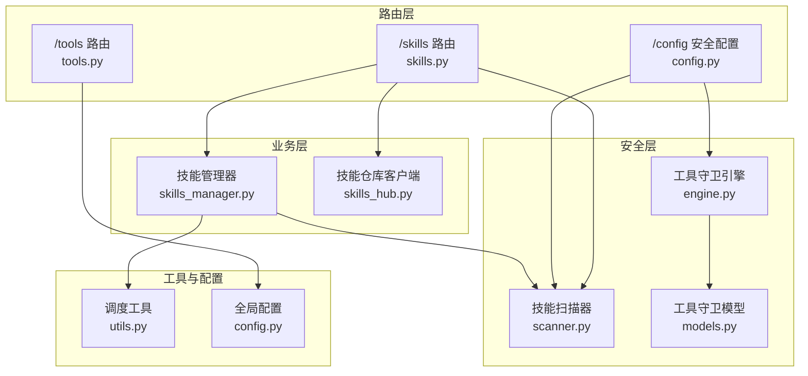
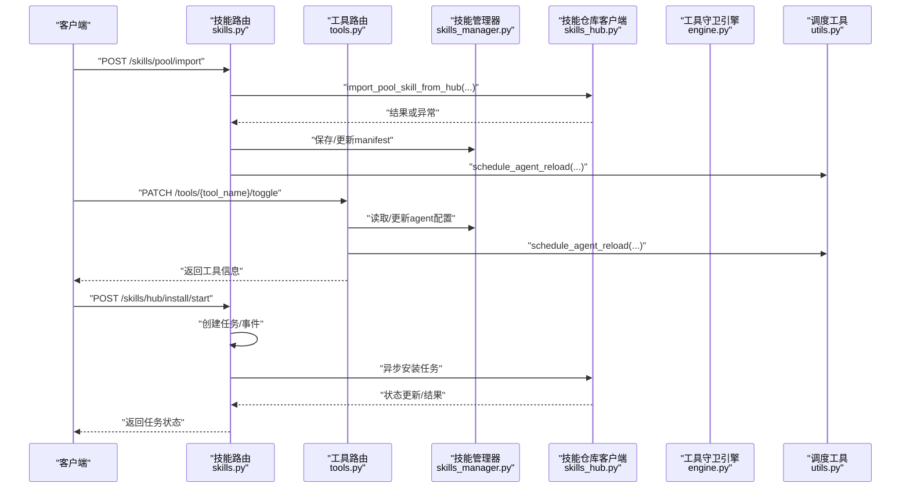
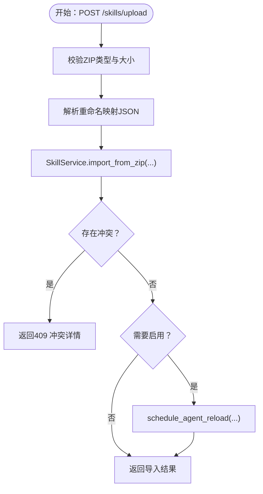
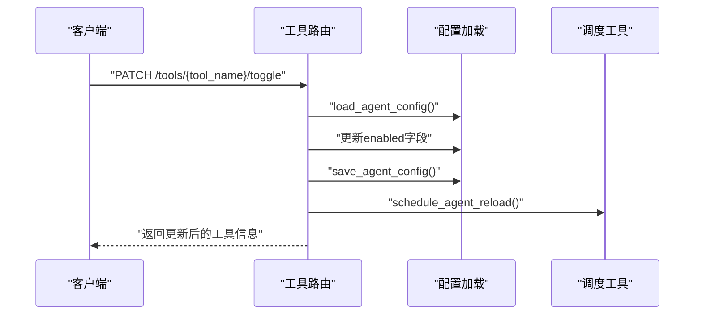
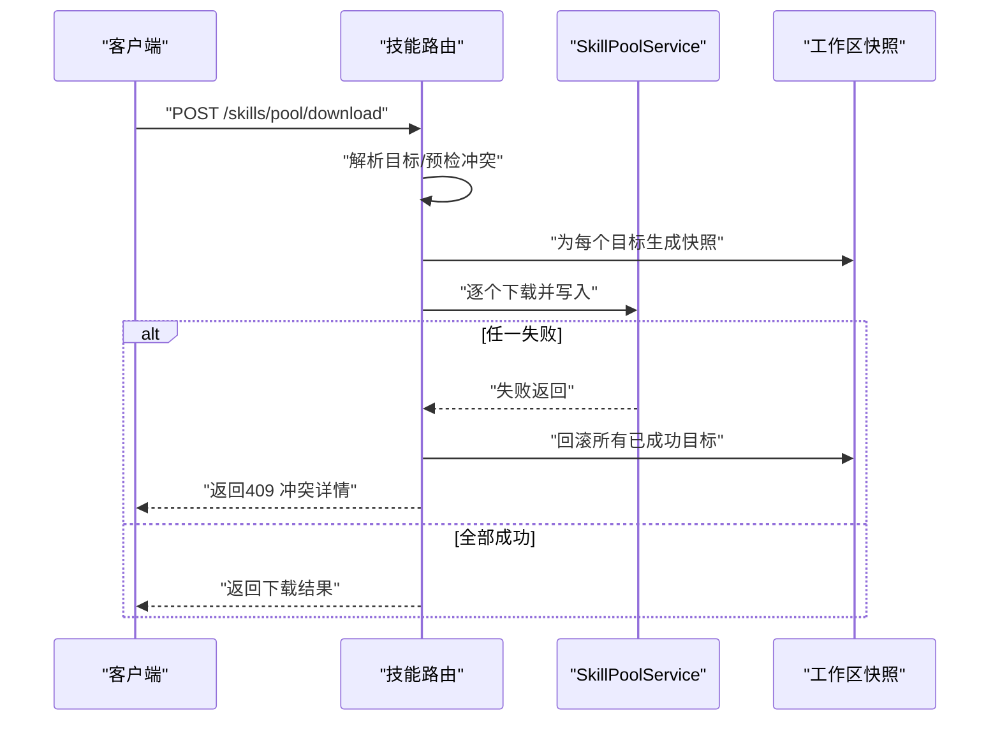
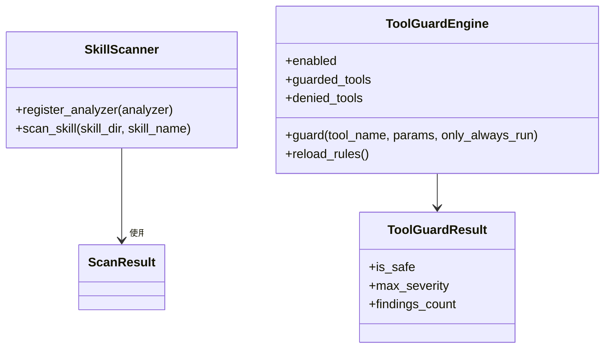
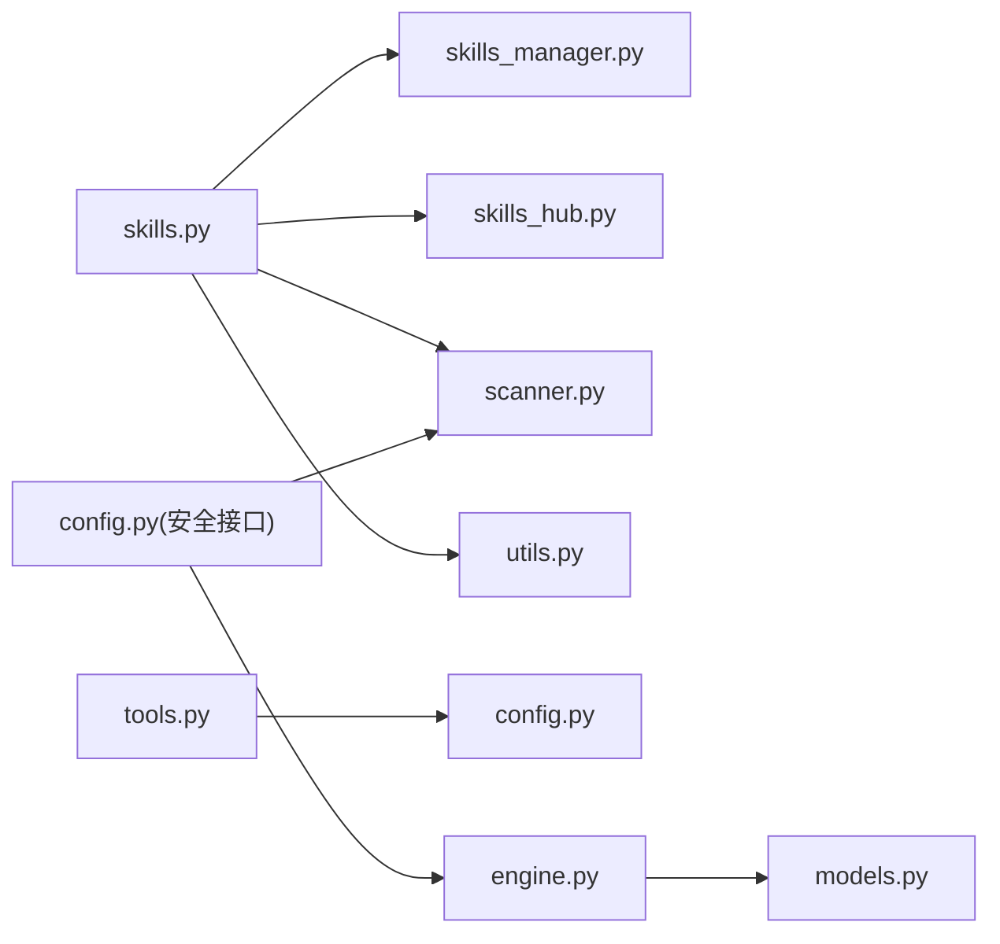

# 技能与工具API

<cite>
**本文档引用的文件**
- [skills.py](file://src/qwenpaw/app/routers/skills.py)
- [tools.py](file://src/qwenpaw/app/routers/tools.py)
- [skills_manager.py](file://src/qwenpaw/agents/skills_manager.py)
- [skills_hub.py](file://src/qwenpaw/agents/skills_hub.py)
- [scanner.py](file://src/qwenpaw/security/skill_scanner/scanner.py)
- [engine.py](file://src/qwenpaw/security/tool_guard/engine.py)
- [models.py](file://src/qwenpaw/security/tool_guard/models.py)
- [config.py](file://src/qwenpaw/app/routers/config.py)
- [utils.py](file://src/qwenpaw/app/utils.py)
- [config.py](file://src/qwenpaw/config/config.py)
</cite>

## 目录
1. [简介](#简介)
2. [项目结构](#项目结构)
3. [核心组件](#核心组件)
4. [架构总览](#架构总览)
5. [详细组件分析](#详细组件分析)
6. [依赖关系分析](#依赖关系分析)
7. [性能考虑](#性能考虑)
8. [故障排查指南](#故障排查指南)
9. [结论](#结论)

## 简介
本文件为 QwenPaw 的“技能与工具”API提供系统化技术文档，覆盖以下主题：
- 技能生命周期管理：安装、卸载、启用、禁用、批量操作、配置与标签管理
- 技能池与内置技能：导入、更新、下载、删除、标签与配置管理
- 工具管理：内置工具列表、启用/禁用切换、异步执行设置
- 安全与合规：技能安全扫描、权限验证（工具守卫）、白名单与阻断历史
- 元数据与依赖：版本文本、签名、依赖声明、环境变量注入
- 性能与可观测性：后台重载、并发限制、超时与回滚机制

## 项目结构
- 路由层位于 app/routers，分别提供 /skills 与 /tools 接口
- 业务逻辑位于 agents 子模块，包括技能管理器、技能池服务、技能仓库客户端
- 安全子系统包含技能扫描器与工具守卫引擎
- 配置与工具函数位于 app/routers/config.py 与 app/utils.py

图表来源
- [skills.py:1-1424](file://src/qwenpaw/app/routers/skills.py#L1-L1424)
- [tools.py:1-181](file://src/qwenpaw/app/routers/tools.py#L1-L181)
- [skills_manager.py:1-800](file://src/qwenpaw/agents/skills_manager.py#L1-L800)
- [skills_hub.py:1-800](file://src/qwenpaw/agents/skills_hub.py#L1-L800)
- [scanner.py:1-319](file://src/qwenpaw/security/skill_scanner/scanner.py#L1-L319)
- [engine.py:1-238](file://src/qwenpaw/security/tool_guard/engine.py#L1-L238)
- [models.py:1-185](file://src/qwenpaw/security/tool_guard/models.py#L1-L185)
- [config.py:426-643](file://src/qwenpaw/app/routers/config.py#L426-L643)
- [utils.py:1-59](file://src/qwenpaw/app/utils.py#L1-L59)
- [config.py:1-800](file://src/qwenpaw/config/config.py#L1-L800)

章节来源
- [skills.py:1-1424](file://src/qwenpaw/app/routers/skills.py#L1-L1424)
- [tools.py:1-181](file://src/qwenpaw/app/routers/tools.py#L1-L181)

## 核心组件
- 技能路由（/skills）
  - 提供技能清单、刷新、搜索、安装、上传、保存、启用/禁用、删除、批量操作、标签与配置管理、池内导入/导出/下载/删除、内置技能导入/更新等接口
- 工具路由（/tools）
  - 提供内置工具列表、启用/禁用切换、异步执行开关
- 技能管理器（skills_manager）
  - 实现技能目录读写、签名计算、冲突建议、环境变量注入、manifest 操作、批量/单个启停
- 技能仓库客户端（skills_hub）
  - 实现从 Hub 拉取、解包、校验、冲突处理、取消检查、重试与超时策略
- 技能扫描器（security/skill_scanner）
  - 扫描技能包内容，聚合规则发现，支持策略与文件分类
- 工具守卫引擎（security/tool_guard）
  - 对工具调用参数进行规则检查，支持内置/自定义规则、敏感路径保护、开关与重载
- 配置与工具（app/routers/config.py, app/utils.py, config/config.py）
  - 提供安全配置读写、工具守卫与文件守卫、全局配置加载与保存

章节来源
- [skills.py:533-1424](file://src/qwenpaw/app/routers/skills.py#L533-L1424)
- [tools.py:36-181](file://src/qwenpaw/app/routers/tools.py#L36-L181)
- [skills_manager.py:65-800](file://src/qwenpaw/agents/skills_manager.py#L65-L800)
- [skills_hub.py:1-800](file://src/qwenpaw/agents/skills_hub.py#L1-L800)
- [scanner.py:76-319](file://src/qwenpaw/security/skill_scanner/scanner.py#L76-L319)
- [engine.py:53-238](file://src/qwenpaw/security/tool_guard/engine.py#L53-L238)
- [config.py:426-643](file://src/qwenpaw/app/routers/config.py#L426-L643)
- [utils.py:15-59](file://src/qwenpaw/app/utils.py#L15-L59)
- [config.py:1-800](file://src/qwenpaw/config/config.py#L1-L800)

## 架构总览
下图展示技能与工具API的关键交互流程：请求经路由层进入，调用业务层服务，必要时触发安全扫描或工具守卫，最终通过工具函数触发后台重载。

图表来源
- [skills.py:582-641](file://src/qwenpaw/app/routers/skills.py#L582-L641)
- [tools.py:77-127](file://src/qwenpaw/app/routers/tools.py#L77-L127)
- [skills_manager.py:1-800](file://src/qwenpaw/agents/skills_manager.py#L1-L800)
- [skills_hub.py:1-800](file://src/qwenpaw/agents/skills_hub.py#L1-L800)
- [engine.py:1-238](file://src/qwenpaw/security/tool_guard/engine.py#L1-L238)
- [utils.py:15-59](file://src/qwenpaw/app/utils.py#L15-L59)

## 详细组件分析

### 技能API（/skills）
- 列表与刷新
  - GET /skills：列出当前工作区技能
  - POST /skills/refresh：强制重新协调并返回最新清单
- Hub 搜索与安装
  - GET /skills/hub/search：按关键词搜索Hub技能
  - POST /skills/hub/install/start：启动从Hub安装的任务（异步）
  - GET /skills/hub/install/status/{task_id}：查询安装任务状态
  - POST /skills/hub/install/cancel/{task_id}：取消安装任务
- 技能创建与上传
  - POST /skills：创建工作区技能（支持内容、引用、脚本、配置、是否启用）
  - POST /skills/upload：上传ZIP包导入（支持重命名映射、覆盖、启用）
- 技能保存与编辑
  - PUT /skills/save：保存/重命名工作区技能（支持内容与配置）
  - PUT /{skill_name}/channels：设置技能生效渠道
  - PUT /{skill_name}/tags：设置技能标签
  - GET /{skill_name}/config, PUT /{skill_name}/config, DELETE /{skill_name}/config：读取/更新/清除技能配置
- 启停与删除
  - POST /{skill_name}/enable, POST /{skill_name}/disable：启用/禁用
  - DELETE /{skill_name}：删除（仅已禁用技能）
  - POST /batch-enable, POST /batch-disable, POST /batch-delete：批量操作
- 技能池管理
  - GET /skills/pool：列出共享技能池
  - POST /skills/pool/refresh：刷新池清单
  - POST /skills/pool：创建池内技能
  - POST /skills/pool/upload-zip：上传ZIP到池
  - POST /skills/pool/import：从Hub导入池技能
  - POST /skills/pool/upload：将工作区技能上传至池
  - POST /skills/pool/download：从池批量下载到工作区（原子性）
  - POST /skills/pool/import-builtin：导入内置源
  - POST /skills/pool/{skill_name}/update-builtin：更新内置技能
  - DELETE /skills/pool/{skill_name}：删除池技能
  - GET/PUT/DELETE /skills/pool/{skill_name}/config：池技能配置管理
  - PUT /skills/pool/{skill_name}/tags：池技能标签管理
- 文件访问
  - GET /{skill_name}/files/{file_path:path}：读取技能文件内容

图表来源
- [skills.py:698-744](file://src/qwenpaw/app/routers/skills.py#L698-L744)
- [utils.py:15-59](file://src/qwenpaw/app/utils.py#L15-L59)

章节来源
- [skills.py:533-1424](file://src/qwenpaw/app/routers/skills.py#L533-L1424)

### 工具API（/tools）
- GET /tools：返回当前Agent的内置工具清单及启用状态
- PATCH /tools/{tool_name}/toggle：切换工具启用状态（热重载）
- PATCH /tools/{tool_name}/async-execution：设置工具异步执行

图表来源
- [tools.py:77-127](file://src/qwenpaw/app/routers/tools.py#L77-L127)
- [config.py:1-800](file://src/qwenpaw/config/config.py#L1-L800)
- [utils.py:15-59](file://src/qwenpaw/app/utils.py#L15-L59)

章节来源
- [tools.py:36-181](file://src/qwenpaw/app/routers/tools.py#L36-L181)

### 技能池与内置技能
- 导入内置源：POST /skills/pool/import-builtin
- 更新内置：POST /skills/pool/{skill_name}/update-builtin
- 下载到工作区：POST /skills/pool/download（支持多工作区、原子性与回滚）
- 删除池技能：DELETE /skills/pool/{skill_name}

图表来源
- [skills.py:970-1026](file://src/qwenpaw/app/routers/skills.py#L970-L1026)

章节来源
- [skills.py:839-1058](file://src/qwenpaw/app/routers/skills.py#L839-L1058)

### 安全扫描与权限验证
- 技能扫描
  - 扫描器支持多分析器、策略与文件分类、最大文件数/大小限制、跳过扩展名
  - 安装/导入环节统一捕获扫描异常并返回标准化错误
- 工具守卫
  - 引擎支持内置/自定义守护者、敏感路径保护、规则重载、开关控制
  - 支持按工具名范围与拒绝名单控制

图表来源
- [scanner.py:76-319](file://src/qwenpaw/security/skill_scanner/scanner.py#L76-L319)
- [engine.py:53-238](file://src/qwenpaw/security/tool_guard/engine.py#L53-L238)
- [models.py:103-185](file://src/qwenpaw/security/tool_guard/models.py#L103-L185)

章节来源
- [scanner.py:1-319](file://src/qwenpaw/security/skill_scanner/scanner.py#L1-L319)
- [engine.py:1-238](file://src/qwenpaw/security/tool_guard/engine.py#L1-L238)
- [models.py:1-185](file://src/qwenpaw/security/tool_guard/models.py#L1-L185)

### 配置与环境注入
- 技能配置环境注入
  - 依据 SKILL.md metadata.requires.env 将匹配键注入为环境变量，同时始终提供完整JSON变量
  - 通过上下文管理器在一次对话中应用/释放环境变量
- 工具守卫与文件守卫
  - 通过 /config 安全接口读取/更新工具守卫与文件守卫配置，并触发规则重载

章节来源
- [skills_manager.py:590-717](file://src/qwenpaw/agents/skills_manager.py#L590-L717)
- [config.py:426-643](file://src/qwenpaw/app/routers/config.py#L426-L643)

## 依赖关系分析

图表来源
- [skills.py:1-1424](file://src/qwenpaw/app/routers/skills.py#L1-L1424)
- [skills_manager.py:1-800](file://src/qwenpaw/agents/skills_manager.py#L1-L800)
- [skills_hub.py:1-800](file://src/qwenpaw/agents/skills_hub.py#L1-L800)
- [scanner.py:1-319](file://src/qwenpaw/security/skill_scanner/scanner.py#L1-L319)
- [engine.py:1-238](file://src/qwenpaw/security/tool_guard/engine.py#L1-L238)
- [models.py:1-185](file://src/qwenpaw/security/tool_guard/models.py#L1-L185)
- [config.py:426-643](file://src/qwenpaw/app/routers/config.py#L426-L643)
- [tools.py:1-181](file://src/qwenpaw/app/routers/tools.py#L1-L181)
- [config.py:1-800](file://src/qwenpaw/config/config.py#L1-L800)
- [utils.py:1-59](file://src/qwenpaw/app/utils.py#L1-L59)

章节来源
- [skills.py:1-1424](file://src/qwenpaw/app/routers/skills.py#L1-L1424)
- [tools.py:1-181](file://src/qwenpaw/app/routers/tools.py#L1-L181)

## 性能考虑
- 并发与锁
  - manifest写入采用文件级互斥锁，避免竞态
  - ZIP解压与路径校验限制压缩包总量与条目数量，防止过大/恶意包
- 异步与后台重载
  - 多处变更后通过 schedule_agent_reload 异步触发Agent重载，不阻塞API响应
- 超时与重试
  - Hub HTTP请求具备超时、重试与指数退避策略，支持取消检查
- 扫描限制
  - 扫描器支持最大文件数与单文件大小上限，避免资源耗尽

章节来源
- [skills_manager.py:318-389](file://src/qwenpaw/agents/skills_manager.py#L318-L389)
- [skills_hub.py:130-166](file://src/qwenpaw/agents/skills_hub.py#L130-L166)
- [scanner.py:100-134](file://src/qwenpaw/security/skill_scanner/scanner.py#L100-L134)
- [utils.py:15-59](file://src/qwenpaw/app/utils.py#L15-L59)

## 故障排查指南
- 技能扫描失败
  - 安装/导入返回422，包含最高严重级别与具体发现项；可在安全设置中查看阻断历史与白名单
- 冲突与重名
  - 返回409并提供建议的新名称；工作区/池技能删除前需先禁用
- Hub安装任务
  - 使用任务ID轮询状态；支持取消；失败时检查网络/速率限制/GITHUB_TOKEN
- 工具守卫
  - 若工具被拒绝，检查规则集与敏感路径配置；可临时关闭守卫进行定位

章节来源
- [skills.py:681-743](file://src/qwenpaw/app/routers/skills.py#L681-L743)
- [config.py:426-643](file://src/qwenpaw/app/routers/config.py#L426-L643)
- [engine.py:169-227](file://src/qwenpaw/security/tool_guard/engine.py#L169-L227)

## 结论
本文档梳理了QwenPaw技能与工具API的端点、数据模型与安全机制，强调了：
- 以工作区/池双层技能管理为核心，支持Hub生态与本地开发
- 通过扫描器与工具守卫构建安全基线，支持策略化与白名单治理
- 通过后台重载与批量操作提升运维效率与一致性