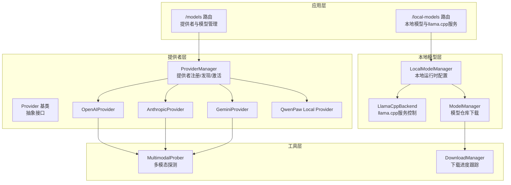
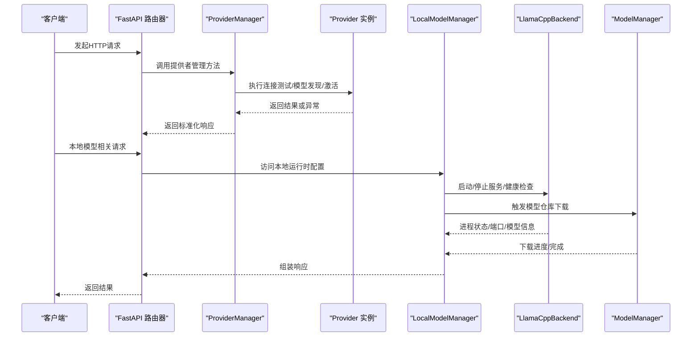
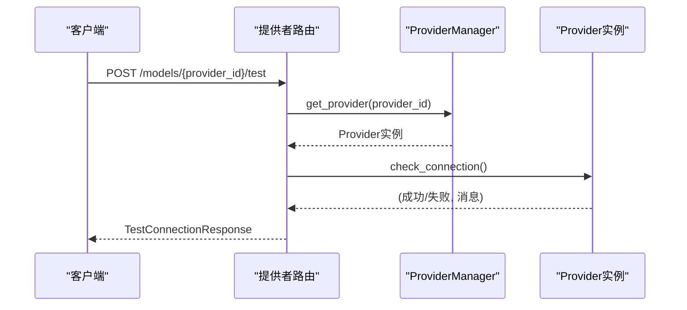
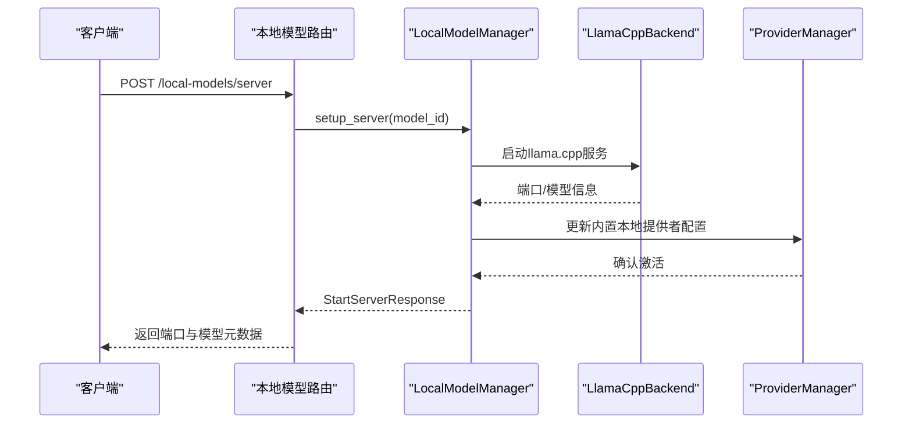
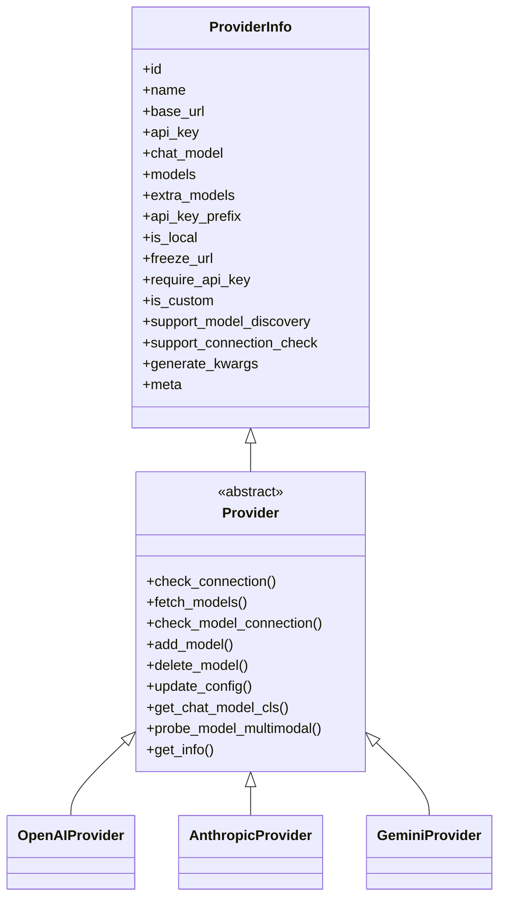
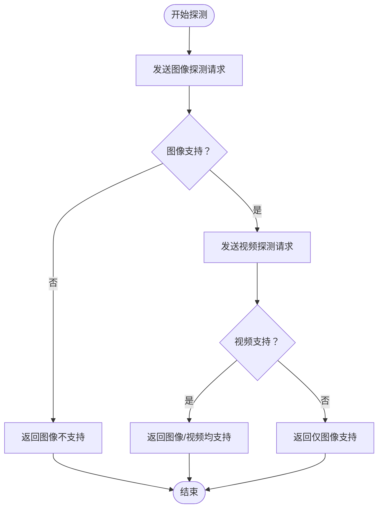
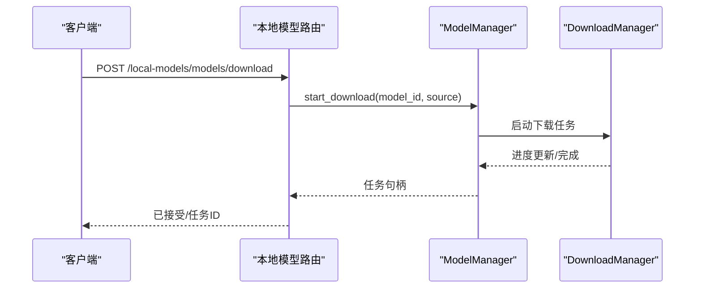
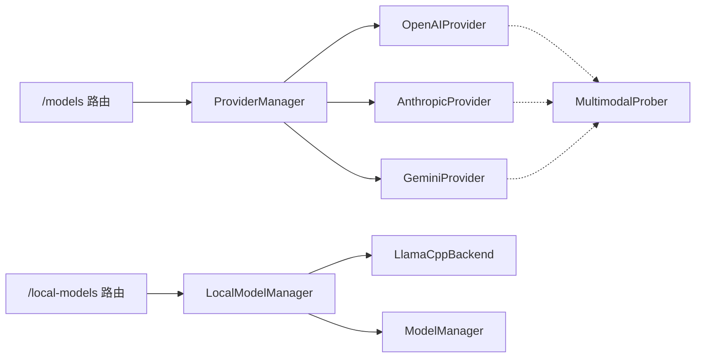

# 模型与提供者API

<cite>
**本文档引用的文件**
- [providers.py](file://src/qwenpaw/app/routers/providers.py)
- [local_models.py](file://src/qwenpaw/app/routers/local_models.py)
- [provider_manager.py](file://src/qwenpaw/providers/provider_manager.py)
- [provider.py](file://src/qwenpaw/providers/provider.py)
- [openai_provider.py](file://src/qwenpaw/providers/openai_provider.py)
- [anthropic_provider.py](file://src/qwenpaw/providers/anthropic_provider.py)
- [gemini_provider.py](file://src/qwenpaw/providers/gemini_provider.py)
- [manager.py](file://src/qwenpaw/local_models/manager.py)
- [llamacpp.py](file://src/qwenpaw/local_models/llamacpp.py)
- [model_manager.py](file://src/qwenpaw/local_models/model_manager.py)
- [multimodal_prober.py](file://src/qwenpaw/providers/multimodal_prober.py)
- [download_manager.py](file://src/qwenpaw/local_models/download_manager.py)
</cite>

## 目录
1. [简介](#简介)
2. [项目结构](#项目结构)
3. [核心组件](#核心组件)
4. [架构总览](#架构总览)
5. [详细组件分析](#详细组件分析)
6. [依赖关系分析](#依赖关系分析)
7. [性能考虑](#性能考虑)
8. [故障排除指南](#故障排除指南)
9. [结论](#结论)

## 简介
本文件面向QwenPaw的模型与提供者API，系统性梳理了以下内容：
- 模型提供者的配置、测试连接与管理的HTTP端点
- 本地模型的下载、安装、启动与停止流程
- 模型列表查询、配置验证、性能监控等核心能力
- 不同提供者类型的配置模板、连接参数与认证方式
- 模型缓存机制、资源管理、故障转移与负载均衡的技术实现

目标是帮助开发者与运维人员快速理解并正确使用这些API。

## 项目结构
QwenPaw通过FastAPI路由模块提供REST接口，核心逻辑分布在以下模块：
- 提供者管理：提供者注册、内置/自定义提供者、模型发现与连接测试
- 本地模型管理：llama.cpp二进制下载与安装、模型仓库下载、服务启动/停止
- 多模态探测：图像/视频支持探测，用于能力验证与UI展示
- 下载管理：统一的下载任务状态跟踪与进度上报

**图表来源**
- [providers.py:35-634](file://src/qwenpaw/app/routers/providers.py#L35-L634)
- [local_models.py:23-454](file://src/qwenpaw/app/routers/local_models.py#L23-L454)
- [provider_manager.py:670-800](file://src/qwenpaw/providers/provider_manager.py#L670-L800)
- [provider.py:111-314](file://src/qwenpaw/providers/provider.py#L111-L314)
- [openai_provider.py:25-550](file://src/qwenpaw/providers/openai_provider.py#L25-L550)
- [anthropic_provider.py:27-256](file://src/qwenpaw/providers/anthropic_provider.py#L27-L256)
- [gemini_provider.py:27-332](file://src/qwenpaw/providers/gemini_provider.py#L27-L332)
- [manager.py:33-229](file://src/qwenpaw/local_models/manager.py#L33-L229)
- [llamacpp.py:51-800](file://src/qwenpaw/local_models/llamacpp.py#L51-L800)
- [model_manager.py:63-654](file://src/qwenpaw/local_models/model_manager.py#L63-L654)
- [multimodal_prober.py:75-102](file://src/qwenpaw/providers/multimodal_prober.py#L75-L102)
- [download_manager.py:198-599](file://src/qwenpaw/local_models/download_manager.py#L198-L599)

**章节来源**
- [providers.py:35-634](file://src/qwenpaw/app/routers/providers.py#L35-L634)
- [local_models.py:23-454](file://src/qwenpaw/app/routers/local_models.py#L23-L454)

## 核心组件
- 提供者路由器（/models）：提供者列表、配置、连接测试、模型发现、单模型测试、多模态探测、增删改查模型、设置/读取当前生效模型
- 本地模型路由器（/local-models）：llama.cpp可用性检查、更新检测、下载与进度、服务启动/停止、模型仓库下载与进度、本地配置读写
- ProviderManager：内置/自定义提供者管理、模型发现、连接测试、激活模型、多模态探测调度
- Provider基类及具体实现：OpenAI、Anthropic、Gemini、本地提供者等
- LocalModelManager：本地运行时配置、llama.cpp服务生命周期、模型仓库下载
- LlamaCppBackend：llama.cpp二进制下载/安装、服务进程管理、健康检查、版本信息
- ModelManager：推荐模型选择、模型仓库下载、进度跟踪、清理
- MultimodalProber：多模态探测常量与结果数据结构
- DownloadManager：下载任务状态、进度计算、取消与完成处理

**章节来源**
- [provider_manager.py:670-800](file://src/qwenpaw/providers/provider_manager.py#L670-L800)
- [provider.py:111-314](file://src/qwenpaw/providers/provider.py#L111-L314)
- [openai_provider.py:25-550](file://src/qwenpaw/providers/openai_provider.py#L25-L550)
- [anthropic_provider.py:27-256](file://src/qwenpaw/providers/anthropic_provider.py#L27-L256)
- [gemini_provider.py:27-332](file://src/qwenpaw/providers/gemini_provider.py#L27-L332)
- [manager.py:33-229](file://src/qwenpaw/local_models/manager.py#L33-L229)
- [llamacpp.py:51-800](file://src/qwenpaw/local_models/llamacpp.py#L51-L800)
- [model_manager.py:63-654](file://src/qwenpaw/local_models/model_manager.py#L63-L654)
- [multimodal_prober.py:75-102](file://src/qwenpaw/providers/multimodal_prober.py#L75-L102)
- [download_manager.py:198-599](file://src/qwenpaw/local_models/download_manager.py#L198-L599)

## 架构总览
下图展示了从HTTP请求到业务执行再到外部服务调用的整体流程：

**图表来源**
- [providers.py:147-634](file://src/qwenpaw/app/routers/providers.py#L147-L634)
- [local_models.py:145-454](file://src/qwenpaw/app/routers/local_models.py#L145-L454)
- [provider_manager.py:736-800](file://src/qwenpaw/providers/provider_manager.py#L736-L800)
- [provider.py:111-314](file://src/qwenpaw/providers/provider.py#L111-L314)
- [manager.py:33-229](file://src/qwenpaw/local_models/manager.py#L33-L229)
- [llamacpp.py:216-421](file://src/qwenpaw/local_models/llamacpp.py#L216-L421)
- [model_manager.py:181-263](file://src/qwenpaw/local_models/model_manager.py#L181-L263)

## 详细组件分析

### 提供者API（/models）
- 列表提供者：GET /models
- 配置提供者：PUT /models/{provider_id}/config
- 创建自定义提供者：POST /models/custom-providers
- 删除自定义提供者：DELETE /models/custom-providers/{provider_id}
- 测试提供者连接：POST /models/{provider_id}/test
- 发现可用模型：POST /models/{provider_id}/discover
- 测试指定模型：POST /models/{provider_id}/models/test
- 添加模型到提供者：POST /models/{provider_id}/models
- 移除模型：DELETE /models/{provider_id}/models/{model_id}
- 探测多模态能力：POST /models/{provider_id}/models/{model_id}/probe-multimodal
- 配置模型生成参数：PUT /models/{provider_id}/models/{model_id}/config
- 获取/设置当前生效模型：
  - GET /models/active(scope, agent_id)
  - PUT /models/active(scope, agent_id)

**图表来源**
- [providers.py:274-304](file://src/qwenpaw/app/routers/providers.py#L274-L304)
- [provider.py:114-128](file://src/qwenpaw/providers/provider.py#L114-L128)

**章节来源**
- [providers.py:147-634](file://src/qwenpaw/app/routers/providers.py#L147-L634)
- [provider_manager.py:736-800](file://src/qwenpaw/providers/provider_manager.py#L736-L800)
- [provider.py:111-314](file://src/qwenpaw/providers/provider.py#L111-L314)

### 本地模型API（/local-models）
- 检查llama.cpp可用性：GET /local-models/server
- 检查llama.cpp更新：GET /local-models/server/update
- 下载llama.cpp：POST/GET/DELETE /local-models/server/download
- 启动服务：POST /local-models/server
- 停止服务：DELETE /local-models/server
- 列出本地模型：GET /local-models/models
- 下载模型仓库：POST/GET/DELETE /local-models/models/download
- 配置本地参数：PUT/GET /local-models/config

**图表来源**
- [local_models.py:283-337](file://src/qwenpaw/app/routers/local_models.py#L283-L337)
- [manager.py:200-229](file://src/qwenpaw/local_models/manager.py#L200-L229)
- [llamacpp.py:216-307](file://src/qwenpaw/local_models/llamacpp.py#L216-L307)
- [provider_manager.py:530-535](file://src/qwenpaw/providers/provider_manager.py#L530-L535)

**章节来源**
- [local_models.py:145-454](file://src/qwenpaw/app/routers/local_models.py#L145-L454)
- [manager.py:33-229](file://src/qwenpaw/local_models/manager.py#L33-L229)
- [llamacpp.py:51-800](file://src/qwenpaw/local_models/llamacpp.py#L51-L800)
- [model_manager.py:63-654](file://src/qwenpaw/local_models/model_manager.py#L63-L654)

### 提供者类型与配置模板
- 内置提供者：OpenAI、Azure OpenAI、Anthropic、Google Gemini、Ollama、LM Studio、Kimi、MiniMax、DeepSeek、ModelScope、DashScope、Zhipu、SiliconFlow等
- 自定义提供者：通过POST /models/custom-providers创建，支持自定义base_url、api_key前缀、默认聊天模型类名、额外模型列表
- 通用配置字段：
  - id/name/base_url/api_key/chat_model
  - models/extra_models（预定义与用户添加）
  - api_key_prefix/freeze_url/is_local/is_custom/support_model_discovery/support_connection_check
  - generate_kwargs/meta（如api_key_url、api_key_hint）

**图表来源**
- [provider.py:49-109](file://src/qwenpaw/providers/provider.py#L49-L109)
- [provider.py:111-314](file://src/qwenpaw/providers/provider.py#L111-L314)
- [openai_provider.py:25-550](file://src/qwenpaw/providers/openai_provider.py#L25-L550)
- [anthropic_provider.py:27-256](file://src/qwenpaw/providers/anthropic_provider.py#L27-L256)
- [gemini_provider.py:27-332](file://src/qwenpaw/providers/gemini_provider.py#L27-L332)

**章节来源**
- [provider.py:17-314](file://src/qwenpaw/providers/provider.py#L17-L314)
- [openai_provider.py:25-550](file://src/qwenpaw/providers/openai_provider.py#L25-L550)
- [anthropic_provider.py:27-256](file://src/qwenpaw/providers/anthropic_provider.py#L27-L256)
- [gemini_provider.py:27-332](file://src/qwenpaw/providers/gemini_provider.py#L27-L332)

### 多模态探测与能力验证
- 探测流程：对图像与视频分别发送轻量级测试请求，结合语义校验避免“静默忽略”场景
- 结果结构：supports_image/supports_video/image_message/video_message
- 支持的探测提供者：OpenAI兼容、Anthropic、Gemini

**图表来源**
- [multimodal_prober.py:75-102](file://src/qwenpaw/providers/multimodal_prober.py#L75-L102)
- [openai_provider.py:165-198](file://src/qwenpaw/providers/openai_provider.py#L165-L198)
- [anthropic_provider.py:166-186](file://src/qwenpaw/providers/anthropic_provider.py#L166-L186)
- [gemini_provider.py:142-159](file://src/qwenpaw/providers/gemini_provider.py#L142-L159)

**章节来源**
- [multimodal_prober.py:75-102](file://src/qwenpaw/providers/multimodal_prober.py#L75-L102)
- [openai_provider.py:165-550](file://src/qwenpaw/providers/openai_provider.py#L165-L550)
- [anthropic_provider.py:166-256](file://src/qwenpaw/providers/anthropic_provider.py#L166-L256)
- [gemini_provider.py:142-332](file://src/qwenpaw/providers/gemini_provider.py#L142-L332)

### 下载与缓存机制
- 进度追踪：DownloadProgressTracker统一维护状态、速度、字节数
- 任务编排：ProcessDownloadController负责进程启动、监控、取消、收尾
- 本地模型缓存：DEFAULT_LOCAL_PROVIDER_DIR/models存放GGUF模型仓库；llama.cpp二进制缓存于bin目录
- 运行时配置：LocalModelConfig持久化max_context_length等参数

**图表来源**
- [local_models.py:362-413](file://src/qwenpaw/app/routers/local_models.py#L362-L413)
- [model_manager.py:181-263](file://src/qwenpaw/local_models/model_manager.py#L181-L263)
- [download_manager.py:368-599](file://src/qwenpaw/local_models/download_manager.py#L368-L599)

**章节来源**
- [download_manager.py:198-599](file://src/qwenpaw/local_models/download_manager.py#L198-L599)
- [model_manager.py:63-654](file://src/qwenpaw/local_models/model_manager.py#L63-L654)
- [manager.py:23-110](file://src/qwenpaw/local_models/manager.py#L23-L110)

### 资源管理、故障转移与负载均衡
- 资源管理：LocalModelManager通过锁保证服务器生命周期操作互斥；LlamaCppBackend负责进程生命周期与日志流处理
- 故障转移：当提供者连接失败或模型不可用时，API返回明确错误；本地模型下载支持取消与重试
- 负载均衡：ProviderManager支持多提供者并行发现与连接测试；多模态探测可辅助选择更合适的模型

**章节来源**
- [manager.py:105-135](file://src/qwenpaw/local_models/manager.py#L105-L135)
- [llamacpp.py:398-421](file://src/qwenpaw/local_models/llamacpp.py#L398-L421)
- [provider_manager.py:736-800](file://src/qwenpaw/providers/provider_manager.py#L736-L800)

## 依赖关系分析
- 路由器依赖ProviderManager与LocalModelManager进行业务编排
- ProviderManager聚合多种Provider实现，并负责模型发现与连接测试
- LocalModelManager封装LlamaCppBackend与ModelManager，统一本地运行时管理
- 多模态探测作为Provider的可选扩展能力，降低误判率

**图表来源**
- [providers.py:50-634](file://src/qwenpaw/app/routers/providers.py#L50-L634)
- [local_models.py:26-454](file://src/qwenpaw/app/routers/local_models.py#L26-L454)
- [provider_manager.py:670-800](file://src/qwenpaw/providers/provider_manager.py#L670-L800)
- [manager.py:33-229](file://src/qwenpaw/local_models/manager.py#L33-L229)
- [llamacpp.py:51-800](file://src/qwenpaw/local_models/llamacpp.py#L51-L800)
- [model_manager.py:63-654](file://src/qwenpaw/local_models/model_manager.py#L63-L654)
- [multimodal_prober.py:75-102](file://src/qwenpaw/providers/multimodal_prober.py#L75-L102)

**章节来源**
- [providers.py:50-634](file://src/qwenpaw/app/routers/providers.py#L50-L634)
- [local_models.py:26-454](file://src/qwenpaw/app/routers/local_models.py#L26-L454)
- [provider_manager.py:670-800](file://src/qwenpaw/providers/provider_manager.py#L670-L800)
- [manager.py:33-229](file://src/qwenpaw/local_models/manager.py#L33-L229)

## 性能考虑
- 异步并发：ProviderManager在列举与获取ProviderInfo时采用异步gather，提升批量操作性能
- 连接超时：各Provider的连接与模型探测均设置合理超时，避免阻塞
- 进度计算：DownloadProgressTracker基于时间戳计算瞬时速率，便于前端实时反馈
- 本地服务健康检查：llama.cpp服务健康端点轮询，超时阈值可调

[本节为通用指导，无需特定文件引用]

## 故障排除指南
- 提供者连接失败：检查base_url与api_key是否正确；必要时使用POST /models/{provider_id}/test进行验证
- 模型不可用：使用POST /models/{provider_id}/models/test定位具体模型问题
- 本地模型下载失败：查看/local-models/server/download的错误消息；确认网络可达性与磁盘空间
- llama.cpp服务无法启动：检查端口占用与GPU驱动；查看日志流；必要时删除旧进程后重启
- 多模态探测误报：依赖语义校验减少“静默忽略”导致的误判

**章节来源**
- [providers.py:274-372](file://src/qwenpaw/app/routers/providers.py#L274-L372)
- [local_models.py:233-281](file://src/qwenpaw/app/routers/local_models.py#L233-L281)
- [llamacpp.py:656-691](file://src/qwenpaw/local_models/llamacpp.py#L656-L691)
- [download_manager.py:588-599](file://src/qwenpaw/local_models/download_manager.py#L588-L599)

## 结论
本文档系统梳理了QwenPaw的模型与提供者API，覆盖了提供者配置、连接测试、模型管理、本地模型下载与服务控制、多模态探测、下载进度与缓存、资源管理与故障处理等关键能力。建议在生产环境中：
- 使用POST /models/{provider_id}/test与POST /models/{provider_id}/models/test进行上线前验证
- 通过GET /local-models/server与GET /local-models/server/update监控本地运行时状态
- 对下载与服务启动操作使用幂等与取消机制，确保可观测性与可恢复性