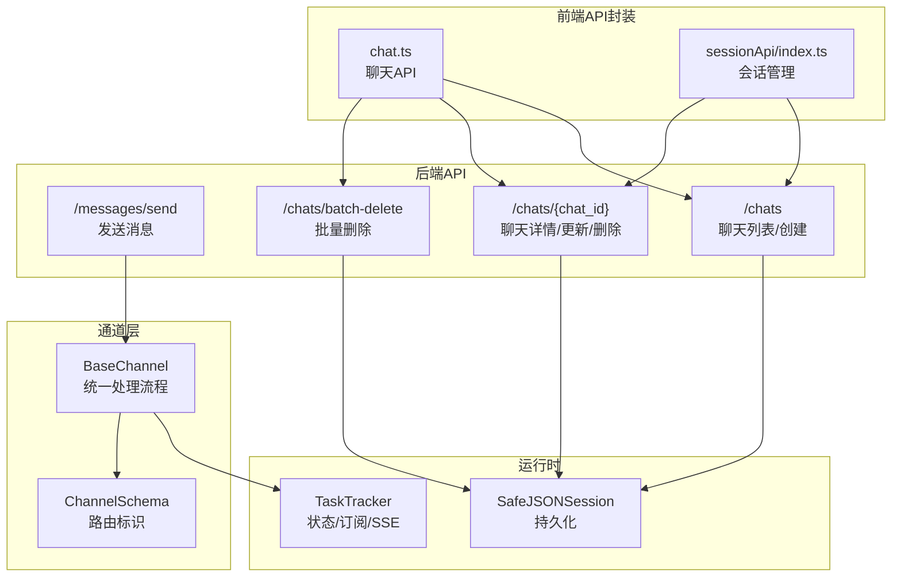
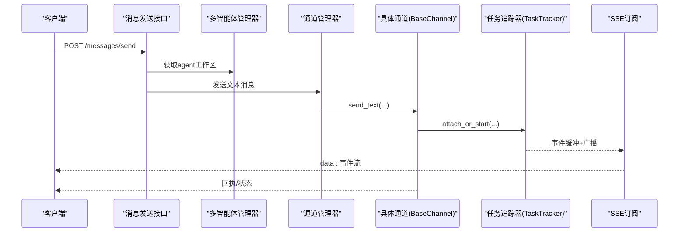
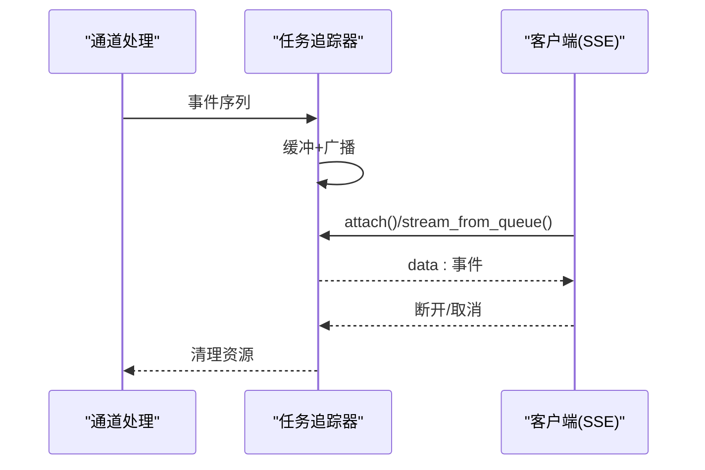

# 消息处理API

<cite>
**本文引用的文件列表**
- [messages.py](file://src/qwenpaw/app/routers/messages.py)
- [chat_api.py](file://src/qwenpaw/app/runner/api.py)
- [chat_types.ts](file://console/src/api/types/chat.ts)
- [chat_api_ts.ts](file://console/src/api/modules/chat.ts)
- [session_api_ts.ts](file://console/src/pages/Chat/sessionApi/index.ts)
- [base_channel.py](file://src/qwenpaw/app/channels/base.py)
- [channel_schema.py](file://src/qwenpaw/app/channels/schema.py)
- [task_tracker.py](file://src/qwenpaw/app/runner/task_tracker.py)
- [safe_session.py](file://src/qwenpaw/app/runner/session.py)
- [discord_channel.py](file://src/qwenpaw/app/channels/discord_/channel.py)
- [feishu_channel.py](file://src/qwenpaw/app/channels/feishu/channel.py)
- [qq_channel.py](file://src/qwenpaw/app/channels/qq/channel.py)
- [matrix_channel.py](file://src/qwenpaw/app/channels/matrix/channel.py)
- [onebot_channel_tests.py](file://tests/unit/channels/test_onebot_channel.py)
- [retry_chat_model.py](file://src/qwenpaw/providers/retry_chat_model.py)
</cite>

## 目录
1. [简介](#简介)
2. [项目结构与范围](#项目结构与范围)
3. [核心组件](#核心组件)
4. [架构总览](#架构总览)
5. [详细API定义](#详细api定义)
6. [消息路由与会话管理](#消息路由与会话管理)
7. [消息格式与多媒体支持](#消息格式与多媒体支持)
8. [实时推送与SSE流](#实时推送与sse流)
9. [批量操作与性能优化](#批量操作与性能优化)
10. [错误处理与重试机制](#错误处理与重试机制)
11. [故障排查指南](#故障排查指南)
12. [结论](#结论)

## 简介
本文件为 QwenPaw 的消息处理API提供系统化、可操作的技术文档，覆盖聊天消息的发送、接收、查询与管理全流程。重点包括：
- HTTP 接口：消息发送、聊天列表、详情、更新、删除、批量删除
- 消息路由机制：通道选择、会话标识、目标解析
- 会话管理：聊天规格、消息历史、状态跟踪
- 多媒体消息：文本、图片、音频、视频、文件的统一内容模型
- 实时推送：基于 SSE 的事件流
- 批量操作与性能优化：并发控制、去抖动、队列管理
- 错误处理与重试：统一异常、退避重试策略

## 项目结构与范围
本次文档聚焦于后端 FastAPI 路由模块、通道基类与渲染器、任务追踪器以及前端聊天API封装，确保从接口到实现的完整闭环。

图表来源
- [messages.py:16-187](file://src/qwenpaw/app/routers/messages.py#L16-L187)
- [chat_api.py:19-200](file://src/qwenpaw/app/runner/api.py#L19-L200)
- [base_channel.py:70-120](file://src/qwenpaw/app/channels/base.py#L70-L120)
- [channel_schema.py:12-48](file://src/qwenpaw/app/channels/schema.py#L12-L48)
- [task_tracker.py:30-231](file://src/qwenpaw/app/runner/task_tracker.py#L30-L231)
- [safe_session.py:39-248](file://src/qwenpaw/app/runner/session.py#L39-L248)
- [chat_api_ts.ts:49-136](file://console/src/api/modules/chat.ts#L49-L136)
- [session_api_ts.ts:339-632](file://console/src/pages/Chat/sessionApi/index.ts#L339-L632)

章节来源
- [messages.py:16-187](file://src/qwenpaw/app/routers/messages.py#L16-L187)
- [chat_api.py:19-200](file://src/qwenpaw/app/runner/api.py#L19-L200)
- [base_channel.py:70-120](file://src/qwenpaw/app/channels/base.py#L70-L120)
- [channel_schema.py:12-48](file://src/qwenpaw/app/channels/schema.py#L12-L48)
- [task_tracker.py:30-231](file://src/qwenpaw/app/runner/task_tracker.py#L30-L231)
- [safe_session.py:39-248](file://src/qwenpaw/app/runner/session.py#L39-L248)
- [chat_api_ts.ts:49-136](file://console/src/api/modules/chat.ts#L49-L136)
- [session_api_ts.ts:339-632](file://console/src/pages/Chat/sessionApi/index.ts#L339-L632)

## 核心组件
- 消息发送路由：负责代理消息到指定通道，携带 X-Agent-Id 头部识别来源。
- 聊天管理路由：提供聊天列表、创建、详情、更新、删除、批量删除。
- 通道基类：统一消息消费、去抖动、渲染、发送响应、任务跟踪。
- 任务追踪器：维护运行状态、事件缓冲、SSE 订阅、取消与清理。
- 安全JSON会话：跨平台安全文件名、异步读写、状态持久化。
- 前端API封装：聊天与会话的REST调用与本地缓存策略。

章节来源
- [messages.py:78-187](file://src/qwenpaw/app/routers/messages.py#L78-L187)
- [chat_api.py:65-200](file://src/qwenpaw/app/runner/api.py#L65-L200)
- [base_channel.py:70-120](file://src/qwenpaw/app/channels/base.py#L70-L120)
- [task_tracker.py:30-231](file://src/qwenpaw/app/runner/task_tracker.py#L30-L231)
- [safe_session.py:39-248](file://src/qwenpaw/app/runner/session.py#L39-L248)
- [chat_api_ts.ts:49-136](file://console/src/api/modules/chat.ts#L49-L136)
- [session_api_ts.ts:339-632](file://console/src/pages/Chat/sessionApi/index.ts#L339-L632)

## 架构总览
消息从“发送接口”进入，经“通道层”解析与路由，进入“任务追踪器”生成事件流，最终通过“SSE”推送到前端；同时“会话存储”持久化消息历史。

图表来源
- [messages.py:78-187](file://src/qwenpaw/app/routers/messages.py#L78-L187)
- [base_channel.py:374-536](file://src/qwenpaw/app/channels/base.py#L374-L536)
- [task_tracker.py:142-208](file://src/qwenpaw/app/runner/task_tracker.py#L142-L208)

## 详细API定义

### 消息发送接口
- 路径：/messages/send
- 方法：POST
- 请求头：
  - X-Agent-Id: 可选，用于标识发送方智能体，默认为"default"
- 请求体字段：
  - channel: 目标通道名称（如 console、dingtalk、feishu、discord 等）
  - target_user: 用户ID（通道内用户标识）
  - target_session: 会话ID（通道内会话标识）
  - text: 文本消息内容
- 成功响应：
  - success: 布尔值
  - message: 描述性信息
- 错误码：
  - 404：通道不存在或智能体未找到
  - 500：内部错误（通道初始化失败、发送异常）

章节来源
- [messages.py:40-187](file://src/qwenpaw/app/routers/messages.py#L40-L187)

### 聊天管理接口
- 列表与创建
  - GET /chats?user_id=&channel=
  - POST /chats
- 单聊详情
  - GET /chats/{chat_id}
- 更新与删除
  - PUT /chats/{chat_id}
  - DELETE /chats/{chat_id}
- 批量删除
  - POST /chats/batch-delete

请求/响应模型（后端）：
- ChatSpec：包含 id、session_id、user_id、channel、name、created_at、updated_at、meta、status、pinned
- ChatHistory：包含 messages（Message[]）、status
- Message：包含 role、content、扩展字段
- ChatUpdate：name、pinned

前端类型（TS）：
- ChatSpec、ChatHistory、Message、ChatUpdateRequest、ChatDeleteResponse

章节来源
- [chat_api.py:65-200](file://src/qwenpaw/app/runner/api.py#L65-L200)
- [chat_types.ts:1-38](file://console/src/api/types/chat.ts#L1-L38)
- [chat_api_ts.ts:49-136](file://console/src/api/modules/chat.ts#L49-L136)

## 消息路由与会话管理

### 通道路由标识
- ChannelAddress：kind（dm/channel/webhook/console/...）、id、extra
- to_handle：统一发送目标字符串，便于通道层解析
- 内置通道类型：imessage、discord、dingtalk、feishu、qq、telegram、mqtt、console、voice、xiaoyi

章节来源
- [channel_schema.py:12-48](file://src/qwenpaw/app/channels/schema.py#L12-L48)

### 会话标识与创建
- BaseChannel.resolve_session_id：默认以 channel:user_id 组合作为 session_id
- BaseChannel._extract_chat_name：从第一条内容提取聊天标题
- 通道层在收到消息时自动调用 chat_manager.get_or_create_chat 创建/复用会话

章节来源
- [base_channel.py:557-567](file://src/qwenpaw/app/channels/base.py#L557-L567)
- [base_channel.py:337-372](file://src/qwenpaw/app/channels/base.py#L337-L372)

### 任务追踪与状态
- TaskTracker.get_status：返回 idle/running
- BaseChannel._consume_with_tracker：注册任务、事件缓冲、SSE流
- 支持取消：request_stop，清理资源并断开订阅

章节来源
- [task_tracker.py:46-141](file://src/qwenpaw/app/runner/task_tracker.py#L46-L141)
- [base_channel.py:374-430](file://src/qwenpaw/app/channels/base.py#L374-L430)

## 消息格式与多媒体支持

### 统一内容模型
通道层使用 agentscope_runtime 的内容类型：
- TextContent
- ImageContent
- VideoContent
- AudioContent
- FileContent
- RefusalContent

渲染器将内容转换为通道可理解的输出格式。

章节来源
- [base_channel.py:24-37](file://src/qwenpaw/app/channels/base.py#L24-L37)
- [renderer.py:298-324](file://src/qwenpaw/app/channels/renderer.py#L298-L324)

### 典型通道的多媒体处理
- Discord：根据文件类型映射为图片/视频/音频/文件
- Feishu：下载音频资源并转为 AudioContent
- QQ：按类型构建 Image/Video/Audio/File Content
- Matrix：根据事件类型映射为对应内容

章节来源
- [discord_channel.py:203-230](file://src/qwenpaw/app/channels/discord_/channel.py#L203-L230)
- [feishu_channel.py:789-808](file://src/qwenpaw/app/channels/feishu/channel.py#L789-L808)
- [qq_channel.py:1174-1202](file://src/qwenpaw/app/channels/qq/channel.py#L1174-L1202)
- [matrix_channel.py:1667-1698](file://src/qwenpaw/app/channels/matrix/channel.py#L1667-L1698)

### 单元测试验证
- OneBot 通道对 image/record/video 的解析正确映射到相应内容类型

章节来源
- [onebot_channel_tests.py:89-135](file://tests/unit/channels/test_onebot_channel.py#L89-L135)

## 实时推送与SSE流

### SSE事件流
- BaseChannel._stream_with_tracker：将事件序列化为SSE数据行
- TaskTracker.attach_or_start：生产者将事件写入缓冲与订阅队列
- TaskTracker.stream_from_queue：客户端轮询/订阅直到哨兵值

图表来源
- [base_channel.py:431-536](file://src/qwenpaw/app/channels/base.py#L431-L536)
- [task_tracker.py:142-231](file://src/qwenpaw/app/runner/task_tracker.py#L142-L231)

### 前端会话API
- 本地时间戳会话：在后端生成真实ID前，前端缓存用户输入并在完成后补丁到历史
- 生成中状态检测：根据最后一条消息角色与状态判断是否仍在生成

章节来源
- [session_api_ts.ts:251-333](file://console/src/pages/Chat/sessionApi/index.ts#L251-L333)
- [session_api_ts.ts:522-632](file://console/src/pages/Chat/sessionApi/index.ts#L522-L632)

## 批量操作与性能优化

### 批量删除
- POST /chats/batch-delete：传入多个 chat_id，返回删除结果

章节来源
- [chat_api.py:116-131](file://src/qwenpaw/app/runner/api.py#L116-L131)

### 性能优化要点
- 去抖动（Debounce）：无文本内容先缓冲，待出现文本再合并发送，避免频繁空回复
- 时间去抖动：同一会话在设定秒数内合并多次原生负载
- 异步I/O：SafeJSONSession 使用 aiofiles 异步读写，避免阻塞事件循环
- 并发控制：TaskTracker 限制同一会话的并发执行，避免重复处理

章节来源
- [base_channel.py:121-127](file://src/qwenpaw/app/channels/base.py#L121-L127)
- [base_channel.py:669-695](file://src/qwenpaw/app/channels/base.py#L669-L695)
- [safe_session.py:73-193](file://src/qwenpaw/app/runner/session.py#L73-L193)

## 错误处理与重试机制

### 统一错误处理
- 通道层捕获异常并上报“内部错误”事件，客户端可据此提示
- 消息发送接口对通道不存在、智能体不存在、发送失败进行明确错误码

章节来源
- [base_channel.py:524-535](file://src/qwenpaw/app/channels/base.py#L524-L535)
- [messages.py:169-186](file://src/qwenpaw/app/routers/messages.py#L169-L186)

### LLM调用重试与限流
- RetryChatModel：指数退避、可配置最大重试次数、速率限制上报与等待
- 自动识别可重试异常与429状态码，并解析 Retry-After

章节来源
- [retry_chat_model.py:124-476](file://src/qwenpaw/providers/retry_chat_model.py#L124-L476)

## 故障排查指南

常见问题与定位建议：
- 404 通道不存在：检查 channel 名称是否在内置通道集合中
- 404 智能体未找到：确认 X-Agent-Id 是否正确且已初始化
- 500 发送失败：查看通道日志，确认凭证、权限、网络连通性
- 会话未生成：确认前端是否正确处理本地时间戳会话与补丁逻辑
- SSE 不断流：检查 TaskTracker 是否被取消或超时

章节来源
- [messages.py:169-186](file://src/qwenpaw/app/routers/messages.py#L169-L186)
- [session_api_ts.ts:562-632](file://console/src/pages/Chat/sessionApi/index.ts#L562-L632)
- [task_tracker.py:133-141](file://src/qwenpaw/app/runner/task_tracker.py#L133-L141)

## 结论
本文档梳理了 QwenPaw 的消息处理API，从接口定义、路由机制、会话管理、多媒体支持到实时推送与性能优化，形成完整的工程实践指南。建议在集成时：
- 明确通道与会话标识规则
- 使用 SSE 流式体验与前端缓存策略
- 配置合理的重试与限流参数
- 关注去抖动与并发控制，提升稳定性与用户体验