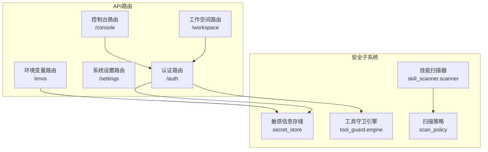
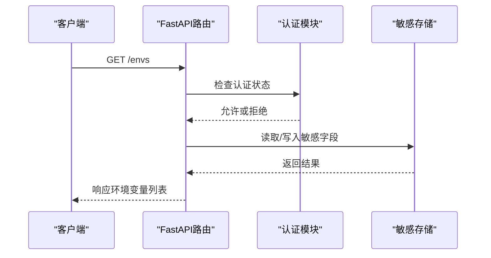
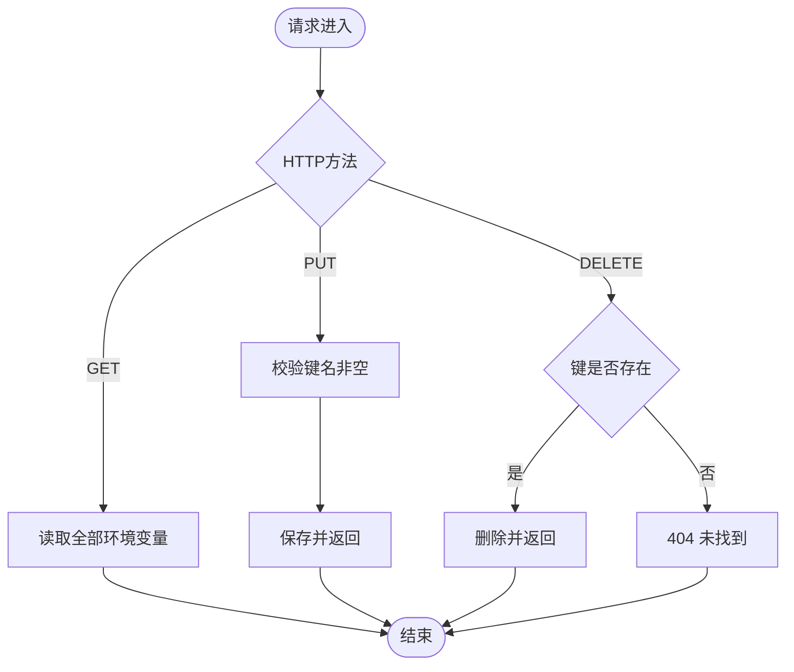
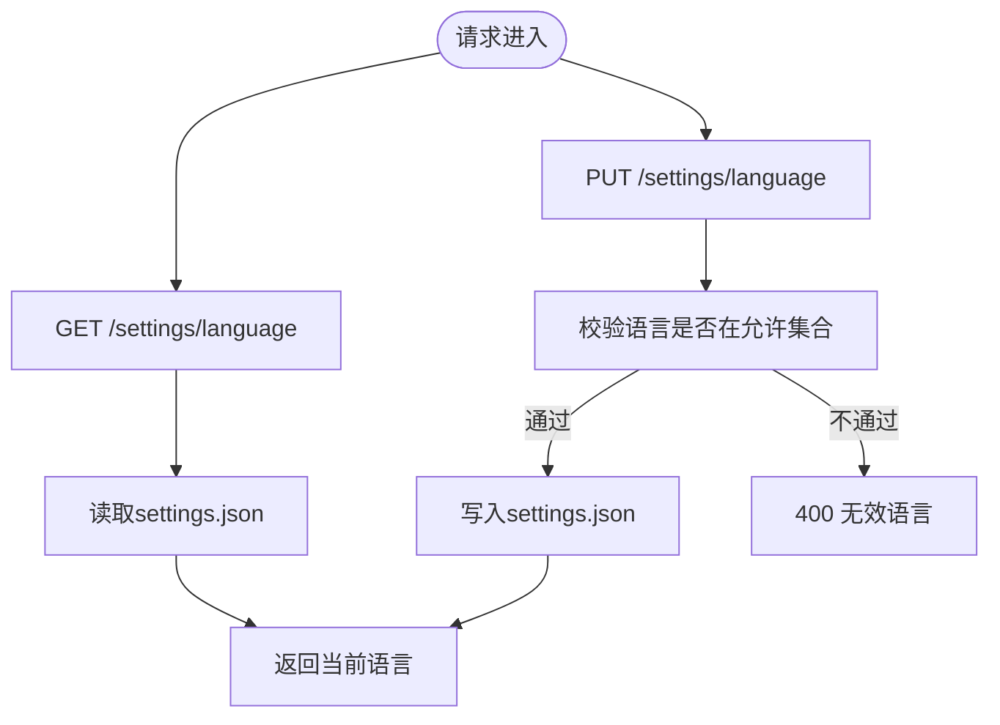
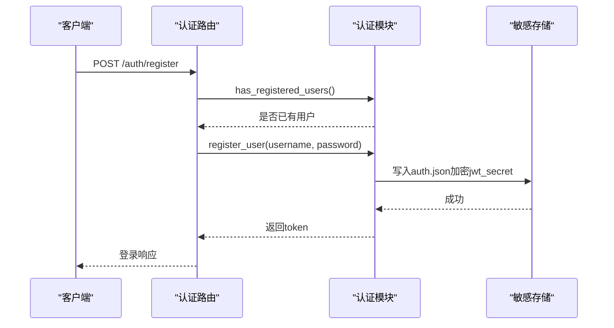
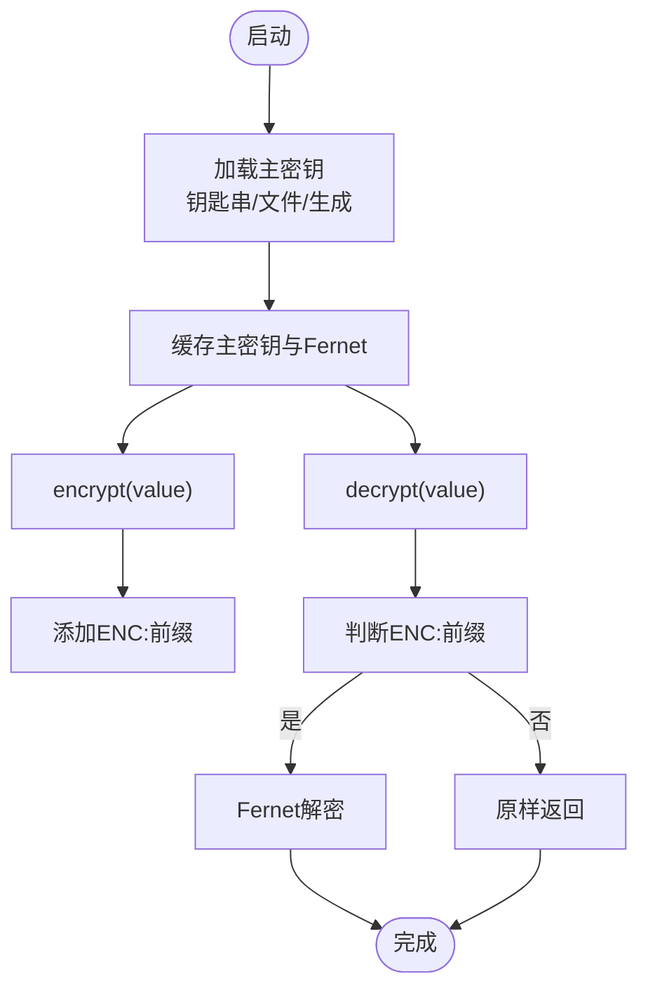
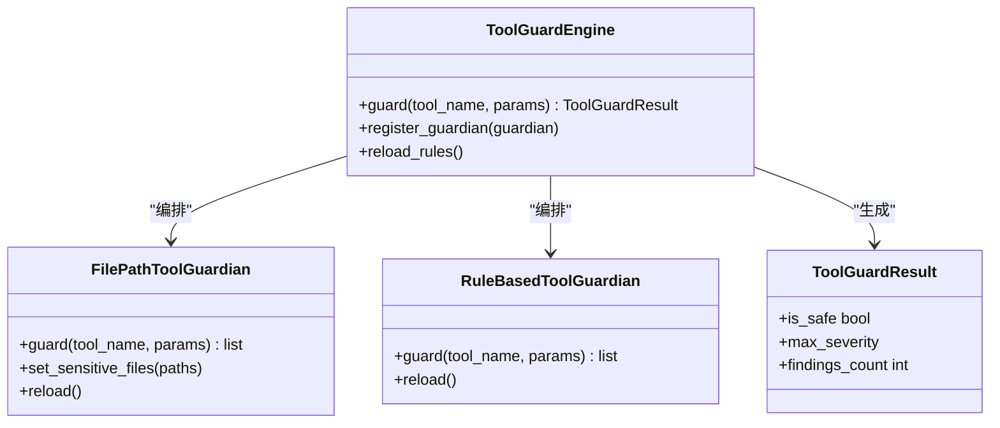
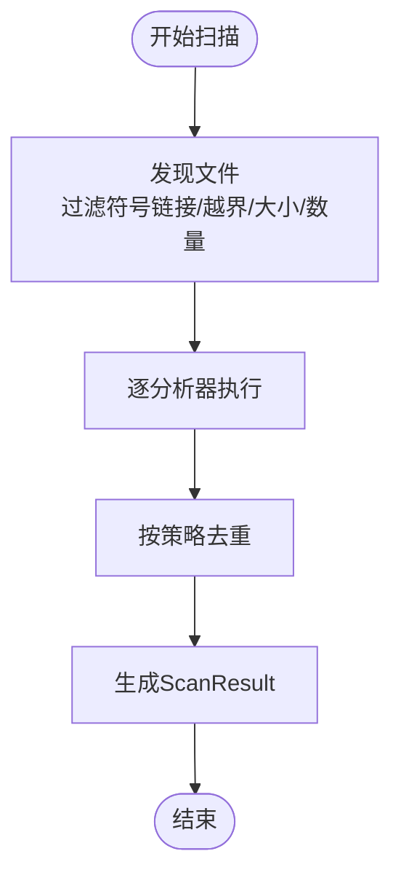
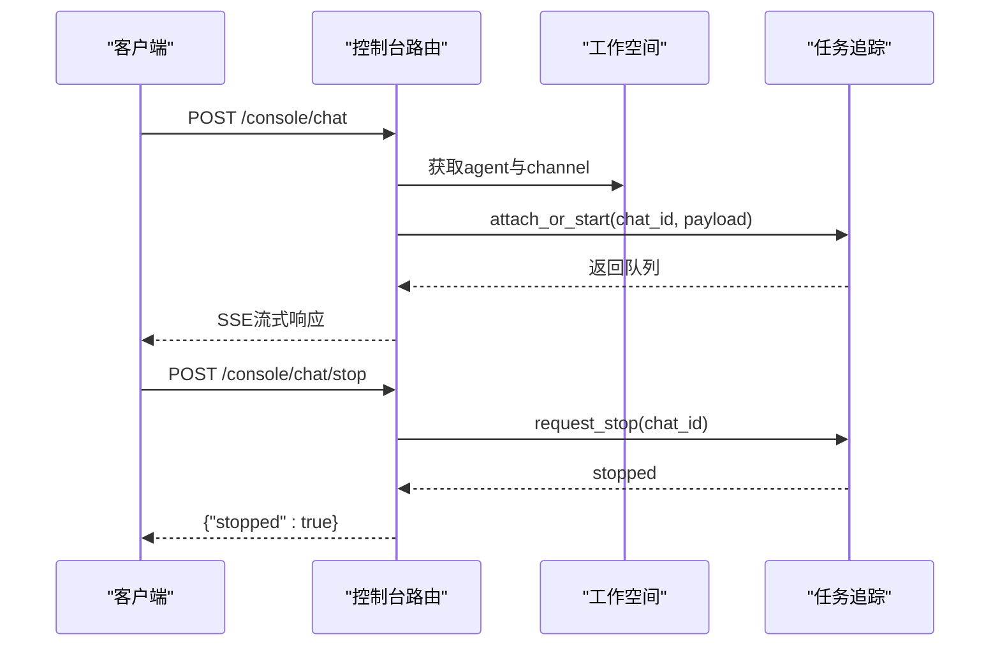
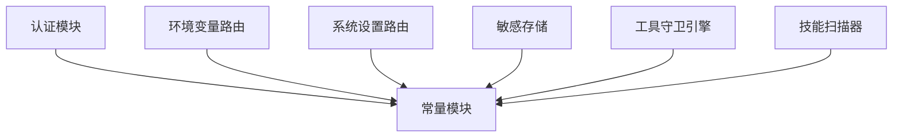

# 环境与安全API

<cite>
**本文档引用的文件**
- [src/qwenpaw/app/routers/envs.py](file://src/qwenpaw/app/routers/envs.py)
- [src/qwenpaw/app/routers/auth.py](file://src/qwenpaw/app/routers/auth.py)
- [src/qwenpaw/app/auth.py](file://src/qwenpaw/app/auth.py)
- [src/qwenpaw/constant.py](file://src/qwenpaw/constant.py)
- [src/qwenpaw/security/secret_store.py](file://src/qwenpaw/security/secret_store.py)
- [src/qwenpaw/security/tool_guard/engine.py](file://src/qwenpaw/security/tool_guard/engine.py)
- [src/qwenpaw/security/tool_guard/guardians/file_guardian.py](file://src/qwenpaw/security/tool_guard/guardians/file_guardian.py)
- [src/qwenpaw/security/tool_guard/guardians/rule_guardian.py](file://src/qwenpaw/security/tool_guard/guardians/rule_guardian.py)
- [src/qwenpaw/security/tool_guard/models.py](file://src/qwenpaw/security/tool_guard/models.py)
- [src/qwenpaw/security/skill_scanner/scanner.py](file://src/qwenpaw/security/skill_scanner/scanner.py)
- [src/qwenpaw/security/skill_scanner/models.py](file://src/qwenpaw/security/skill_scanner/models.py)
- [src/qwenpaw/security/skill_scanner/scan_policy.py](file://src/qwenpaw/security/skill_scanner/scan_policy.py)
- [src/qwenpaw/app/routers/console.py](file://src/qwenpaw/app/routers/console.py)
- [src/qwenpaw/app/routers/workspace.py](file://src/qwenpaw/app/routers/workspace.py)
</cite>

## 目录
1. [简介](#简介)
2. [项目结构](#项目结构)
3. [核心组件](#核心组件)
4. [架构总览](#架构总览)
5. [详细组件分析](#详细组件分析)
6. [依赖关系分析](#依赖关系分析)
7. [性能考虑](#性能考虑)
8. [故障排除指南](#故障排除指南)
9. [结论](#结论)
10. [附录](#附录)

## 简介
本文件为 QwenPaw 的“环境与安全API”提供全面的技术文档，覆盖以下主题：
- 环境变量管理（增删改查）
- 系统设置配置（语言等UI设置）
- 用户认证与授权（登录、注册、令牌校验、凭据更新）
- 敏感信息保护（磁盘透明加密、主密钥管理、密钥轮换）
- 访问控制与权限管理（中间件、白名单路径、本地回环豁免）
- 审计日志与风险控制（工具调用守卫、技能扫描器）
- 会话管理与安全策略（JWT签名、过期时间、自动注册）
- 多租户隔离与数据保护（工作空间隔离、上传下载打包）

本文件以代码级分析为基础，提供可视化图示、流程图与时序图，并给出安全最佳实践与合规建议。

## 项目结构
围绕“环境与安全”的API主要分布在以下模块：
- 环境变量管理：envs 路由
- 系统设置：settings 路由
- 认证授权：auth 路由与应用层认证模块
- 敏感信息保护：secret_store 加密存储
- 工具调用守卫：tool_guard 引擎与守护者
- 技能扫描器：skill_scanner 扫描器与策略
- 控制台与工作空间：console 与 workspace 路由

**图表来源**
- [src/qwenpaw/app/routers/envs.py:1-81](file://src/qwenpaw/app/routers/envs.py#L1-L81)
- [src/qwenpaw/app/routers/settings.py:1-59](file://src/qwenpaw/app/routers/settings.py#L1-L59)
- [src/qwenpaw/app/routers/auth.py:1-174](file://src/qwenpaw/app/routers/auth.py#L1-L174)
- [src/qwenpaw/app/routers/console.py:1-216](file://src/qwenpaw/app/routers/console.py#L1-L216)
- [src/qwenpaw/app/routers/workspace.py:1-203](file://src/qwenpaw/app/routers/workspace.py#L1-L203)
- [src/qwenpaw/security/secret_store.py:1-291](file://src/qwenpaw/security/secret_store.py#L1-L291)
- [src/qwenpaw/security/tool_guard/engine.py:1-238](file://src/qwenpaw/security/tool_guard/engine.py#L1-L238)
- [src/qwenpaw/security/skill_scanner/scanner.py:1-319](file://src/qwenpaw/security/skill_scanner/scanner.py#L1-L319)
- [src/qwenpaw/security/skill_scanner/scan_policy.py:1-476](file://src/qwenpaw/security/skill_scanner/scan_policy.py#L1-L476)

**章节来源**
- [src/qwenpaw/app/routers/envs.py:1-81](file://src/qwenpaw/app/routers/envs.py#L1-L81)
- [src/qwenpaw/app/routers/settings.py:1-59](file://src/qwenpaw/app/routers/settings.py#L1-L59)
- [src/qwenpaw/app/routers/auth.py:1-174](file://src/qwenpaw/app/routers/auth.py#L1-L174)
- [src/qwenpaw/app/routers/console.py:1-216](file://src/qwenpaw/app/routers/console.py#L1-L216)
- [src/qwenpaw/app/routers/workspace.py:1-203](file://src/qwenpaw/app/routers/workspace.py#L1-L203)

## 核心组件
- 环境变量API：支持批量读取、全量替换、单键删除
- 系统设置API：UI语言设置（公开接口）
- 认证API：登录、注册、状态查询、令牌验证、更新资料
- 中间件：基于Bearer令牌的访问控制，白名单路径与本地回环豁免
- 密码与令牌：基于标准库的密码哈希与HMAC签名JWT
- 敏感信息存储：磁盘透明加密（Fernet），主密钥来自系统钥匙串或文件
- 工具守卫：规则驱动与路径级双重防护，支持动态重载
- 技能扫描：静态规则扫描、可定制策略、去重与阈值控制
- 控制台与工作空间：聊天流式响应、文件上传、工作空间打包/解包

**章节来源**
- [src/qwenpaw/app/routers/envs.py:32-81](file://src/qwenpaw/app/routers/envs.py#L32-L81)
- [src/qwenpaw/app/routers/settings.py:39-59](file://src/qwenpaw/app/routers/settings.py#L39-L59)
- [src/qwenpaw/app/routers/auth.py:41-174](file://src/qwenpaw/app/routers/auth.py#L41-L174)
- [src/qwenpaw/app/auth.py:371-441](file://src/qwenpaw/app/auth.py#L371-L441)
- [src/qwenpaw/security/secret_store.py:154-247](file://src/qwenpaw/security/secret_store.py#L154-L247)
- [src/qwenpaw/security/tool_guard/engine.py:53-238](file://src/qwenpaw/security/tool_guard/engine.py#L53-L238)
- [src/qwenpaw/security/skill_scanner/scanner.py:76-319](file://src/qwenpaw/security/skill_scanner/scanner.py#L76-L319)

## 架构总览
下图展示认证、环境变量与敏感存储之间的交互关系：

**图表来源**
- [src/qwenpaw/app/routers/envs.py:32-81](file://src/qwenpaw/app/routers/envs.py#L32-L81)
- [src/qwenpaw/app/auth.py:371-441](file://src/qwenpaw/app/auth.py#L371-L441)
- [src/qwenpaw/security/secret_store.py:213-247](file://src/qwenpaw/security/secret_store.py#L213-L247)

## 详细组件分析

### 环境变量管理API
- 接口设计
  - GET /envs：返回所有环境变量（键值对）
  - PUT /envs：全量替换（提供字典，未出现的键将被移除）
  - DELETE /envs/{key}：删除指定键
- 数据模型
  - EnvVar：包含 key 与 value 字段
- 安全要点
  - 批量保存前进行键名清洗与空值校验
  - 通过认证中间件保护敏感操作
- 错误处理
  - 空键名返回400
  - 不存在的键删除返回404

**图表来源**
- [src/qwenpaw/app/routers/envs.py:32-81](file://src/qwenpaw/app/routers/envs.py#L32-L81)

**章节来源**
- [src/qwenpaw/app/routers/envs.py:19-81](file://src/qwenpaw/app/routers/envs.py#L19-L81)

### 系统设置API
- 接口设计
  - GET /settings/language：获取当前UI语言
  - PUT /settings/language：更新UI语言（受控于有效集合）
- 安全要点
  - 语言参数白名单校验
  - 配置持久化在工作目录下的settings.json中
- 可扩展性
  - 可按需增加更多UI设置项（如主题、时区等）

**图表来源**
- [src/qwenpaw/app/routers/settings.py:39-59](file://src/qwenpaw/app/routers/settings.py#L39-L59)

**章节来源**
- [src/qwenpaw/app/routers/settings.py:1-59](file://src/qwenpaw/app/routers/settings.py#L1-L59)

### 认证与授权API
- 登录
  - POST /auth/login：用户名+密码换取JWT
  - 若未启用认证，返回空token
- 注册
  - POST /auth/register：仅允许一次注册；需要显式开启认证
- 状态
  - GET /auth/status：返回认证开关与是否已有用户
- 令牌验证
  - GET /auth/verify：校验Bearer令牌有效性
- 更新资料
  - POST /auth/update-profile：需要当前密码校验，支持改用户名/密码
  - 更改密码触发JWT密钥轮换，使旧会话失效
- 中间件
  - AuthMiddleware：对受保护路径进行Bearer令牌校验
  - 白名单路径与本地回环豁免
- 密码与令牌
  - 密码采用带盐SHA-256哈希
  - JWT使用HMAC-SHA256签名，7天有效期

**图表来源**
- [src/qwenpaw/app/routers/auth.py:54-84](file://src/qwenpaw/app/routers/auth.py#L54-L84)
- [src/qwenpaw/app/auth.py:246-271](file://src/qwenpaw/app/auth.py#L246-L271)
- [src/qwenpaw/security/secret_store.py:211-221](file://src/qwenpaw/security/secret_store.py#L211-L221)

**章节来源**
- [src/qwenpaw/app/routers/auth.py:41-174](file://src/qwenpaw/app/routers/auth.py#L41-L174)
- [src/qwenpaw/app/auth.py:371-441](file://src/qwenpaw/app/auth.py#L371-L441)
- [src/qwenpaw/constant.py:28-87](file://src/qwenpaw/constant.py#L28-L87)

### 敏感信息保护与密钥管理
- 存储机制
  - 使用Fernet（AES-128-CBC + HMAC-SHA256）对敏感字段加密
  - 主密钥来源优先级：系统钥匙串 → 文件（~/.qwenpaw.secret/.master_key，0600）
  - 支持容器/无桌面环境跳过钥匙串访问
- 字段范围
  - PROVIDER_SECRET_FIELDS：provider配置中的敏感字段（如api_key）
  - AUTH_SECRET_FIELDS：auth.json中的敏感字段（jwt_secret）
- 运行时行为
  - 双重检查锁缓存主密钥与Fernet实例
  - 自动迁移明文字段至加密存储
  - 解密失败时降级返回原文，避免崩溃

**图表来源**
- [src/qwenpaw/security/secret_store.py:154-247](file://src/qwenpaw/security/secret_store.py#L154-L247)

**章节来源**
- [src/qwenpaw/security/secret_store.py:1-291](file://src/qwenpaw/security/secret_store.py#L1-L291)

### 工具调用守卫（Tool Guard）
- 引擎
  - ToolGuardEngine：统一编排多个守护者，聚合结果
  - 支持从环境变量或配置文件控制开关
- 守护者
  - FilePathToolGuardian：路径级敏感文件/目录阻断
  - RuleBasedToolGuardian：基于YAML规则的正则匹配（含rm命令工作区边界检查）
- 结果模型
  - ToolGuardResult：包含最高严重级别、发现数量、失败守护者等

**图表来源**
- [src/qwenpaw/security/tool_guard/engine.py:53-238](file://src/qwenpaw/security/tool_guard/engine.py#L53-L238)
- [src/qwenpaw/security/tool_guard/guardians/file_guardian.py:184-365](file://src/qwenpaw/security/tool_guard/guardians/file_guardian.py#L184-L365)
- [src/qwenpaw/security/tool_guard/guardians/rule_guardian.py:559-758](file://src/qwenpaw/security/tool_guard/guardians/rule_guardian.py#L559-L758)
- [src/qwenpaw/security/tool_guard/models.py:103-185](file://src/qwenpaw/security/tool_guard/models.py#L103-L185)

**章节来源**
- [src/qwenpaw/security/tool_guard/engine.py:1-238](file://src/qwenpaw/security/tool_guard/engine.py#L1-L238)
- [src/qwenpaw/security/tool_guard/guardians/file_guardian.py:1-365](file://src/qwenpaw/security/tool_guard/guardians/file_guardian.py#L1-L365)
- [src/qwenpaw/security/tool_guard/guardians/rule_guardian.py:1-758](file://src/qwenpaw/security/tool_guard/guardians/rule_guardian.py#L1-L758)
- [src/qwenpaw/security/tool_guard/models.py:1-185](file://src/qwenpaw/security/tool_guard/models.py#L1-L185)

### 技能扫描器（Skill Scanner）
- 扫描器
  - SkillScanner：遍历技能包、运行分析器、聚合结果
  - 支持文件类型分类、大小限制、跳过扩展名、去重
- 策略
  - ScanPolicy：组织级策略（规则作用域、凭证抑制、文件分类、阈值、严重度覆盖）
- 结果模型
  - ScanResult：包含最高严重级别、发现统计、分析器失败列表等

**图表来源**
- [src/qwenpaw/security/skill_scanner/scanner.py:148-242](file://src/qwenpaw/security/skill_scanner/scanner.py#L148-L242)
- [src/qwenpaw/security/skill_scanner/scan_policy.py:156-476](file://src/qwenpaw/security/skill_scanner/scan_policy.py#L156-L476)
- [src/qwenpaw/security/skill_scanner/models.py:168-235](file://src/qwenpaw/security/skill_scanner/models.py#L168-L235)

**章节来源**
- [src/qwenpaw/security/skill_scanner/scanner.py:1-319](file://src/qwenpaw/security/skill_scanner/scanner.py#L1-L319)
- [src/qwenpaw/security/skill_scanner/scan_policy.py:1-476](file://src/qwenpaw/security/skill_scanner/scan_policy.py#L1-L476)
- [src/qwenpaw/security/skill_scanner/models.py:1-235](file://src/qwenpaw/security/skill_scanner/models.py#L1-L235)

### 控制台与工作空间API
- 控制台
  - POST /console/chat：流式聊天（SSE），支持重连
  - POST /console/chat/stop：停止运行中的对话
  - POST /console/upload：上传文件（大小限制）
  - GET /console/push-messages：获取推送消息
- 工作空间
  - GET /workspace/download：打包agent工作空间为zip并流式返回
  - POST /workspace/upload：上传zip并合并到工作空间（防路径穿越）

**图表来源**
- [src/qwenpaw/app/routers/console.py:75-164](file://src/qwenpaw/app/routers/console.py#L75-L164)

**章节来源**
- [src/qwenpaw/app/routers/console.py:1-216](file://src/qwenpaw/app/routers/console.py#L1-L216)
- [src/qwenpaw/app/routers/workspace.py:112-203](file://src/qwenpaw/app/routers/workspace.py#L112-L203)

## 依赖关系分析
- 认证中间件依赖环境变量与用户状态，保护受保护路径
- 环境变量与系统设置均依赖常量模块提供的工作目录与密钥目录
- 敏感存储依赖常量模块的密钥目录与环境变量加载器
- 工具守卫与技能扫描器均通过配置模块读取策略与规则

**图表来源**
- [src/qwenpaw/app/auth.py:32-42](file://src/qwenpaw/app/auth.py#L32-L42)
- [src/qwenpaw/constant.py:92-111](file://src/qwenpaw/constant.py#L92-L111)
- [src/qwenpaw/security/secret_store.py:34-38](file://src/qwenpaw/security/secret_store.py#L34-L38)
- [src/qwenpaw/security/tool_guard/engine.py:44-49](file://src/qwenpaw/security/tool_guard/engine.py#L44-L49)
- [src/qwenpaw/security/skill_scanner/scanner.py:109-110](file://src/qwenpaw/security/skill_scanner/scanner.py#L109-L110)

**章节来源**
- [src/qwenpaw/app/auth.py:1-441](file://src/qwenpaw/app/auth.py#L1-L441)
- [src/qwenpaw/constant.py:1-307](file://src/qwenpaw/constant.py#L1-L307)

## 性能考虑
- 工具守卫
  - 规则预编译正则，减少运行时开销
  - 路径提取采用分词与去重，避免重复匹配
- 技能扫描
  - 文件发现阶段严格限制数量与大小，防止资源滥用
  - 去重与阈值控制降低重复报告带来的UI与存储压力
- 敏感存储
  - 主密钥与Fernet实例缓存，避免频繁解密/加密
  - 容器/无桌面环境跳过钥匙串访问，提升可用性
- 认证
  - JWT签名与校验为轻量级操作，令牌有效期可控

[本节为通用性能讨论，无需特定文件分析]

## 故障排除指南
- 认证相关
  - 401 未认证：检查Authorization头或查询参数token
  - 401 令牌无效/过期：重新登录获取新token
  - 403 未启用认证：确认QWENPAW_AUTH_ENABLED已设置为真值
  - 409 注册失败：可能已有用户或配置异常
- 环境变量
  - 400 键名为空：确保PUT体中键名非空
  - 404 不存在的键：确认键名正确
- 工作空间
  - 400 非法zip或路径穿越：检查上传文件合法性
  - 500 合并失败：查看服务端日志定位具体异常
- 工具守卫
  - 规则未生效：检查QWENPAW_TOOL_GUARD_ENABLED与配置文件
  - 路径误判：调整security.file_guard.sensitive_files
- 技能扫描
  - 扫描超时/资源不足：调整file_limits与策略阈值
  - 规则无效：检查YAML语法与正则表达式

**章节来源**
- [src/qwenpaw/app/routers/auth.py:54-174](file://src/qwenpaw/app/routers/auth.py#L54-L174)
- [src/qwenpaw/app/routers/envs.py:54-81](file://src/qwenpaw/app/routers/envs.py#L54-L81)
- [src/qwenpaw/app/routers/workspace.py:165-203](file://src/qwenpaw/app/routers/workspace.py#L165-L203)
- [src/qwenpaw/security/tool_guard/engine.py:35-51](file://src/qwenpaw/security/tool_guard/engine.py#L35-L51)
- [src/qwenpaw/security/skill_scanner/scan_policy.py:49-67](file://src/qwenpaw/security/skill_scanner/scan_policy.py#L49-L67)

## 结论
本API体系在保证易用性的同时，提供了完善的环境变量管理、系统设置、认证授权与安全防护能力。通过磁盘透明加密、工具调用守卫与技能扫描器，QwenPaw实现了对敏感信息与潜在威胁的多层防护。配合工作空间打包/上传功能，满足了多租户隔离与数据保护需求。建议在生产环境中启用认证、定期轮换密钥、审阅扫描策略并监控告警。

[本节为总结性内容，无需特定文件分析]

## 附录

### 安全最佳实践
- 认证与会话
  - 强制启用认证（QWENPAW_AUTH_ENABLED=true）
  - 定期轮换JWT密钥（更改密码后自动轮换）
  - 使用HTTPS与安全的反向代理部署
- 环境变量与密钥
  - 将敏感字段放入PROVIDER_SECRET_FIELDS或AUTH_SECRET_FIELDS，交由secret_store加密
  - 在容器/CI中避免依赖系统钥匙串，确保主密钥文件权限0600
- 工具守卫
  - 开启QWENPAW_TOOL_GUARD_ENABLED并结合自定义规则
  - 定期审查敏感文件列表，避免误伤合法路径
- 技能扫描
  - 使用组织化的ScanPolicy，按需禁用规则或覆盖严重度
  - 对大体积技能包设置合理file_limits，避免内存压力
- 数据保护
  - 工作空间上传前进行路径穿越校验
  - 下载打包时仅包含必要文件，避免泄露私有信息

### 合规性检查清单
- 数据最小化：仅存储必要的环境变量与用户凭据
- 透明加密：敏感字段必须加密存储，明文迁移需记录审计
- 访问控制：受保护路径仅允许认证用户访问
- 日志与审计：记录关键事件（登录、注册、令牌验证、守卫拦截）
- 备份与恢复：工作空间打包下载用于备份，上传前进行完整性校验

[本节为通用指导，无需特定文件分析]