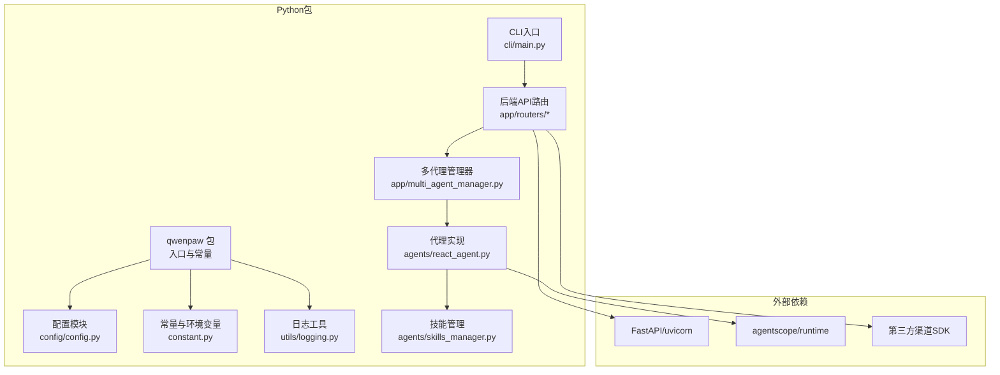
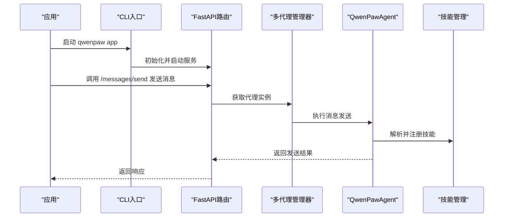
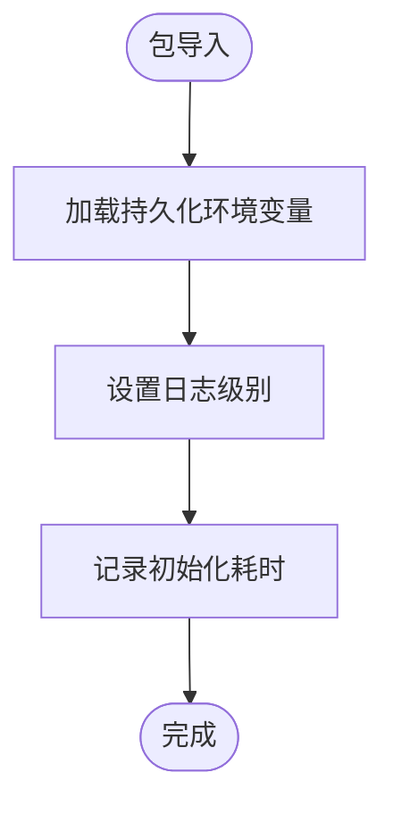
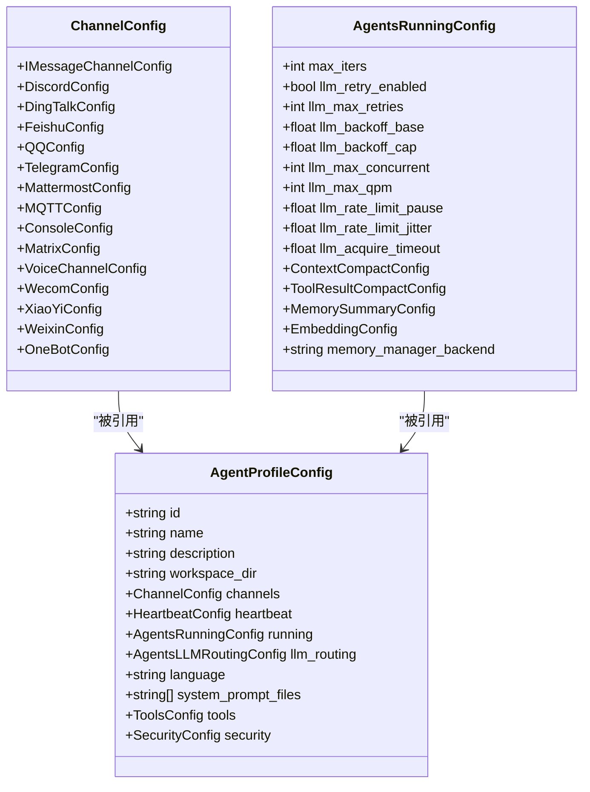
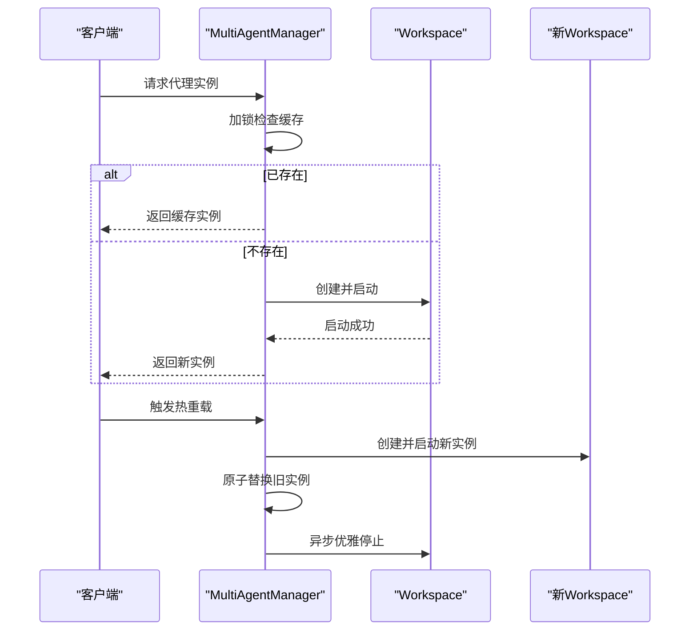
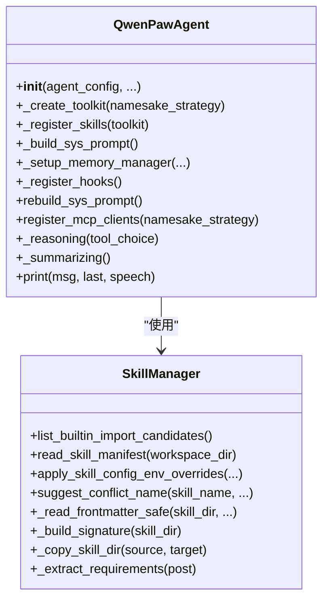
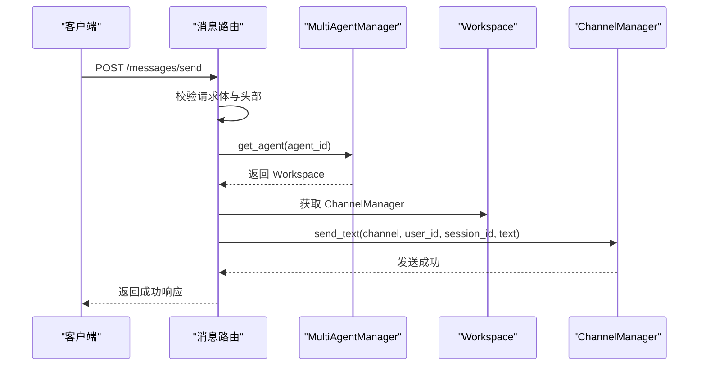
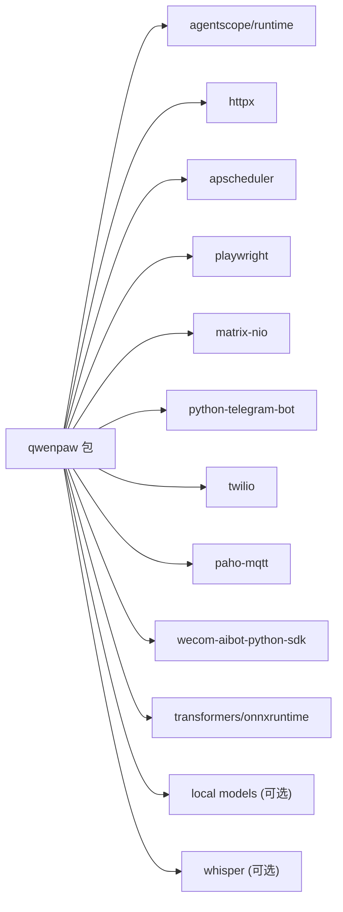

# SDK使用指南

<cite>
**本文档引用的文件**
- [src/qwenpaw/__init__.py](file://src/qwenpaw/__init__.py)
- [src/qwenpaw/__version__.py](file://src/qwenpaw/__version__.py)
- [pyproject.toml](file://pyproject.toml)
- [README.md](file://README.md)
- [src/qwenpaw/config/config.py](file://src/qwenpaw/config/config.py)
- [src/qwenpaw/constant.py](file://src/qwenpaw/constant.py)
- [src/qwenpaw/utils/logging.py](file://src/qwenpaw/utils/logging.py)
- [src/qwenpaw/app/routers/agent.py](file://src/qwenpaw/app/routers/agent.py)
- [src/qwenpaw/app/routers/messages.py](file://src/qwenpaw/app/routers/messages.py)
- [src/qwenpaw/app/routers/skills.py](file://src/qwenpaw/app/routers/skills.py)
- [src/qwenpaw/app/multi_agent_manager.py](file://src/qwenpaw/app/multi_agent_manager.py)
- [src/qwenpaw/agents/react_agent.py](file://src/qwenpaw/agents/react_agent.py)
- [src/qwenpaw/agents/skills_manager.py](file://src/qwenpaw/agents/skills_manager.py)
- [src/qwenpaw/cli/main.py](file://src/qwenpaw/cli/main.py)
</cite>

## 目录
1. [简介](#简介)
2. [项目结构](#项目结构)
3. [核心组件](#核心组件)
4. [架构总览](#架构总览)
5. [详细组件分析](#详细组件分析)
6. [依赖关系分析](#依赖关系分析)
7. [性能考虑](#性能考虑)
8. [故障排除指南](#故障排除指南)
9. [结论](#结论)
10. [附录](#附录)

## 简介
本指南面向希望在应用中集成或扩展 QwenPaw 的开发者，系统讲解如何安装、配置与使用 Python SDK，并深入解析其核心类、方法与数据结构。文档覆盖代理操作、消息发送、技能调用、配置管理等关键能力，同时阐明 SDK 与 REST API 的关系、性能特性、扩展机制、版本兼容与升级迁移策略。

## 项目结构
QwenPaw 采用“后端服务 + 前端控制台”的双层架构：Python 后端通过 FastAPI 提供 REST API；前端控制台用于可视化配置与调试。Python 包内嵌前端构建产物，便于独立运行。

图示来源
- [src/qwenpaw/__init__.py:1-33](file://src/qwenpaw/__init__.py#L1-L33)
- [src/qwenpaw/config/config.py:1-800](file://src/qwenpaw/config/config.py#L1-L800)
- [src/qwenpaw/constant.py:1-307](file://src/qwenpaw/constant.py#L1-L307)
- [src/qwenpaw/utils/logging.py:1-202](file://src/qwenpaw/utils/logging.py#L1-L202)
- [src/qwenpaw/app/routers/agent.py:1-505](file://src/qwenpaw/app/routers/agent.py#L1-L505)
- [src/qwenpaw/app/routers/messages.py:1-187](file://src/qwenpaw/app/routers/messages.py#L1-L187)
- [src/qwenpaw/app/routers/skills.py:1-800](file://src/qwenpaw/app/routers/skills.py#L1-L800)
- [src/qwenpaw/app/multi_agent_manager.py:1-470](file://src/qwenpaw/app/multi_agent_manager.py#L1-L470)
- [src/qwenpaw/agents/react_agent.py:1-800](file://src/qwenpaw/agents/react_agent.py#L1-L800)
- [src/qwenpaw/agents/skills_manager.py:1-800](file://src/qwenpaw/agents/skills_manager.py#L1-L800)
- [src/qwenpaw/cli/main.py:1-171](file://src/qwenpaw/cli/main.py#L1-L171)

章节来源
- [src/qwenpaw/__init__.py:1-33](file://src/qwenpaw/__init__.py#L1-L33)
- [src/qwenpaw/__version__.py:1-3](file://src/qwenpaw/__version__.py#L1-L3)
- [pyproject.toml:1-111](file://pyproject.toml#L1-L111)
- [README.md:104-116](file://README.md#L104-L116)

## 核心组件
- 包初始化与日志：负责包级初始化、日志级别设置与环境变量加载。
- 配置系统：定义通道、代理、运行时、内存与工具等配置模型。
- 常量与环境：统一管理工作目录、默认路径、LLM重试与并发参数等。
- 多代理管理器：按需加载、零停机热重载、生命周期管理。
- 代理实现：基于 ReActAgent 的智能体，集成工具、技能与内存。
- 技能管理：技能清单、导入、扫描、冲突处理与池化管理。
- REST API 路由：代理文件、消息发送、技能管理等接口。
- CLI 入口：命令行入口与延迟子命令加载。

章节来源
- [src/qwenpaw/__init__.py:1-33](file://src/qwenpaw/__init__.py#L1-L33)
- [src/qwenpaw/utils/logging.py:1-202](file://src/qwenpaw/utils/logging.py#L1-L202)
- [src/qwenpaw/config/config.py:1-800](file://src/qwenpaw/config/config.py#L1-L800)
- [src/qwenpaw/constant.py:1-307](file://src/qwenpaw/constant.py#L1-L307)
- [src/qwenpaw/app/multi_agent_manager.py:1-470](file://src/qwenpaw/app/multi_agent_manager.py#L1-L470)
- [src/qwenpaw/agents/react_agent.py:1-800](file://src/qwenpaw/agents/react_agent.py#L1-L800)
- [src/qwenpaw/agents/skills_manager.py:1-800](file://src/qwenpaw/agents/skills_manager.py#L1-L800)
- [src/qwenpaw/app/routers/agent.py:1-505](file://src/qwenpaw/app/routers/agent.py#L1-L505)
- [src/qwenpaw/app/routers/messages.py:1-187](file://src/qwenpaw/app/routers/messages.py#L1-L187)
- [src/qwenpaw/app/routers/skills.py:1-800](file://src/qwenpaw/app/routers/skills.py#L1-L800)
- [src/qwenpaw/cli/main.py:1-171](file://src/qwenpaw/cli/main.py#L1-L171)

## 架构总览
QwenPaw 的 SDK 本质是 Python 包，提供以下能力：
- 作为服务运行：通过 CLI 启动 FastAPI 应用，暴露 REST API。
- 作为库集成：在其他 Python 应用中直接导入 qwenpaw 包，使用配置、代理、技能与消息发送等能力。
- 与渠道对接：内置多种即时通讯与语音渠道，支持通过 API 主动推送消息。

图示来源
- [src/qwenpaw/cli/main.py:1-171](file://src/qwenpaw/cli/main.py#L1-L171)
- [src/qwenpaw/app/routers/messages.py:1-187](file://src/qwenpaw/app/routers/messages.py#L1-L187)
- [src/qwenpaw/app/multi_agent_manager.py:1-470](file://src/qwenpaw/app/multi_agent_manager.py#L1-L470)
- [src/qwenpaw/agents/react_agent.py:1-800](file://src/qwenpaw/agents/react_agent.py#L1-L800)
- [src/qwenpaw/agents/skills_manager.py:1-800](file://src/qwenpaw/agents/skills_manager.py#L1-L800)

## 详细组件分析

### 安装与配置
- 安装方式：推荐使用 pip 安装发布版；也可从源码安装（含前端构建）。
- 初始化：执行初始化命令生成默认配置与工作目录。
- 运行：启动应用后可通过浏览器访问控制台进行模型与渠道配置。

章节来源
- [README.md:104-116](file://README.md#L104-L116)
- [README.md:433-454](file://README.md#L433-L454)

### 包初始化与日志
- 包初始化：加载持久化环境变量、设置日志级别、记录初始化耗时。
- 日志：彩色终端输出、可选文件落盘、过滤第三方库噪声。

图示来源
- [src/qwenpaw/__init__.py:1-33](file://src/qwenpaw/__init__.py#L1-L33)
- [src/qwenpaw/utils/logging.py:1-202](file://src/qwenpaw/utils/logging.py#L1-L202)

章节来源
- [src/qwenpaw/__init__.py:1-33](file://src/qwenpaw/__init__.py#L1-L33)
- [src/qwenpaw/utils/logging.py:1-202](file://src/qwenpaw/utils/logging.py#L1-L202)

### 配置系统与数据结构
- 配置模型：涵盖通道配置、代理运行时配置、心跳、嵌入、上下文压缩、工具结果压缩、记忆摘要、LLM 路由与模型槽位等。
- 环境变量：统一读取与回退逻辑，支持 QWENPAW 与 COPAW 前缀兼容。
- 常量：工作目录、媒体目录、本地模型目录、CORS、LLM 限流与重试参数等。

图示来源
- [src/qwenpaw/config/config.py:226-730](file://src/qwenpaw/config/config.py#L226-L730)
- [src/qwenpaw/constant.py:89-307](file://src/qwenpaw/constant.py#L89-L307)

章节来源
- [src/qwenpaw/config/config.py:1-800](file://src/qwenpaw/config/config.py#L1-L800)
- [src/qwenpaw/constant.py:1-307](file://src/qwenpaw/constant.py#L1-L307)

### 多代理管理器
- 按需懒加载：首次请求才创建代理工作区。
- 零停机热重载：新旧实例原子替换，后台清理旧实例。
- 生命周期管理：启动、停止、批量启动、取消清理任务。

图示来源
- [src/qwenpaw/app/multi_agent_manager.py:1-470](file://src/qwenpaw/app/multi_agent_manager.py#L1-L470)

章节来源
- [src/qwenpaw/app/multi_agent_manager.py:1-470](file://src/qwenpaw/app/multi_agent_manager.py#L1-L470)

### 代理实现与技能管理
- QwenPawAgent：基于 ReActAgent，集成工具、技能与内存管理；支持多模态媒体块过滤与重试。
- 技能管理：技能清单、导入、扫描、冲突处理、池化与工作区同步。

图示来源
- [src/qwenpaw/agents/react_agent.py:1-800](file://src/qwenpaw/agents/react_agent.py#L1-L800)
- [src/qwenpaw/agents/skills_manager.py:1-800](file://src/qwenpaw/agents/skills_manager.py#L1-L800)

章节来源
- [src/qwenpaw/agents/react_agent.py:1-800](file://src/qwenpaw/agents/react_agent.py#L1-L800)
- [src/qwenpaw/agents/skills_manager.py:1-800](file://src/qwenpaw/agents/skills_manager.py#L1-L800)

### REST API 与消息发送
- /messages/send：主动向指定渠道发送文本消息，支持 X-Agent-Id 头部标识代理。
- /agent/*：代理文件、语言、音频模式、转录配置等管理。
- /skills/*：技能列表、导入、上传、池化管理与 Hub 安装任务状态查询。

图示来源
- [src/qwenpaw/app/routers/messages.py:1-187](file://src/qwenpaw/app/routers/messages.py#L1-L187)
- [src/qwenpaw/app/multi_agent_manager.py:1-470](file://src/qwenpaw/app/multi_agent_manager.py#L1-L470)

章节来源
- [src/qwenpaw/app/routers/messages.py:1-187](file://src/qwenpaw/app/routers/messages.py#L1-L187)
- [src/qwenpaw/app/routers/agent.py:1-505](file://src/qwenpaw/app/routers/agent.py#L1-L505)
- [src/qwenpaw/app/routers/skills.py:1-800](file://src/qwenpaw/app/routers/skills.py#L1-L800)

### CLI 与命令分组
- 延迟加载：通过自定义 LazyGroup 按需导入子命令，减少启动时间。
- 支持 app、channels、skills、cron、env、init、models、agents 等命令族。

章节来源
- [src/qwenpaw/cli/main.py:1-171](file://src/qwenpaw/cli/main.py#L1-L171)

## 依赖关系分析
- 版本与元数据：动态版本号来自包内版本文件，构建系统与打包配置在 pyproject.toml。
- 运行时依赖：HTTP 客户端、调度器、浏览器自动化、矩阵、电报、Twilio、MQTT 等。
- 可选依赖：本地模型（llama.cpp、Ollama、MLX）、Whisper 等。

图示来源
- [pyproject.toml:1-111](file://pyproject.toml#L1-L111)

章节来源
- [pyproject.toml:1-111](file://pyproject.toml#L1-L111)

## 性能考虑
- 并发与限流：全局并发数、每分钟请求数限制、指数退避与抖动，避免 429。
- 上下文压缩：根据阈值自动压缩历史，保留最近片段以维持连贯性。
- 工具结果压缩：对近期与旧工具结果分别设定字节上限，定期清理临时文件。
- 日志与 I/O：日志轮转、跨平台文件句柄差异处理，避免阻塞与重复句柄。
- 多代理热重载：零停机替换，后台清理旧实例，最小化锁持有时间。

章节来源
- [src/qwenpaw/constant.py:220-282](file://src/qwenpaw/constant.py#L220-L282)
- [src/qwenpaw/config/config.py:313-469](file://src/qwenpaw/config/config.py#L313-L469)
- [src/qwenpaw/utils/logging.py:160-202](file://src/qwenpaw/utils/logging.py#L160-L202)
- [src/qwenpaw/app/multi_agent_manager.py:208-319](file://src/qwenpaw/app/multi_agent_manager.py#L208-L319)

## 故障排除指南
- 代理未找到：检查配置中的代理 ID 是否存在，确认已启用且路径正确。
- 渠道不可用：确认渠道配置项完整，如令牌、域名、代理等；查看日志定位异常。
- 技能导入失败：检查安全扫描结果与冲突提示，按建议重命名或覆盖。
- 热重载异常：关注旧实例清理任务是否被取消或抛出异常，必要时手动停止。
- 日志级别：通过环境变量调整日志等级，结合文件落盘定位问题。

章节来源
- [src/qwenpaw/app/routers/messages.py:113-186](file://src/qwenpaw/app/routers/messages.py#L113-L186)
- [src/qwenpaw/app/routers/skills.py:436-473](file://src/qwenpaw/app/routers/skills.py#L436-L473)
- [src/qwenpaw/app/multi_agent_manager.py:91-186](file://src/qwenpaw/app/multi_agent_manager.py#L91-L186)
- [src/qwenpaw/utils/logging.py:121-157](file://src/qwenpaw/utils/logging.py#L121-L157)

## 结论
QwenPaw SDK 将复杂的多代理、多渠道、多技能体系封装为简洁的 Python 接口与 REST API，既可作为独立服务部署，也可在应用中直接集成。通过完善的配置模型、安全扫描与热重载机制，开发者可以快速构建可扩展、可维护的智能体应用。

## 附录

### SDK 与 REST API 的关系
- SDK 本质是 Python 包，内部包含 FastAPI 路由与多代理管理器。
- REST API 是 SDK 对外暴露的能力面，典型包括消息发送、代理文件管理、技能管理等。
- 开发者既可通过 API 间接使用 SDK 能力，也可直接导入 SDK 类进行编程式集成。

章节来源
- [src/qwenpaw/app/routers/messages.py:1-187](file://src/qwenpaw/app/routers/messages.py#L1-L187)
- [src/qwenpaw/app/routers/agent.py:1-505](file://src/qwenpaw/app/routers/agent.py#L1-L505)
- [src/qwenpaw/app/routers/skills.py:1-800](file://src/qwenpaw/app/routers/skills.py#L1-L800)

### 版本兼容与升级指南
- 版本来源：动态版本号由包内版本文件提供，构建系统读取该值。
- 升级步骤：更新到新主版本后，建议重建前端、重新安装 Python 包、重启服务并清理浏览器缓存。
- 兼容性注意：环境变量前缀支持 QWENPAW 与 COPAW 兼容回退；部分字段保留默认值以支持降级。

章节来源
- [src/qwenpaw/__version__.py:1-3](file://src/qwenpaw/__version__.py#L1-L3)
- [src/qwenpaw/constant.py:12-26](file://src/qwenpaw/constant.py#L12-L26)
- [README.md:433-454](file://README.md#L433-L454)

### 最佳实践
- 使用多代理管理器进行懒加载与热重载，避免频繁重启。
- 在生产环境启用 CORS 限制与认证（如需要），并通过环境变量控制日志级别。
- 对技能导入启用安全扫描，遵循冲突命名建议，定期清理过期工具结果。
- 合理配置 LLM 并发与限流参数，结合上下文压缩降低延迟与成本。

章节来源
- [src/qwenpaw/app/multi_agent_manager.py:1-470](file://src/qwenpaw/app/multi_agent_manager.py#L1-L470)
- [src/qwenpaw/constant.py:215-282](file://src/qwenpaw/constant.py#L215-L282)
- [src/qwenpaw/config/config.py:313-469](file://src/qwenpaw/config/config.py#L313-L469)
- [src/qwenpaw/agents/skills_manager.py:755-776](file://src/qwenpaw/agents/skills_manager.py#L755-L776)