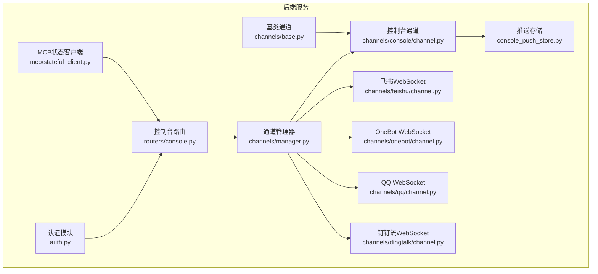
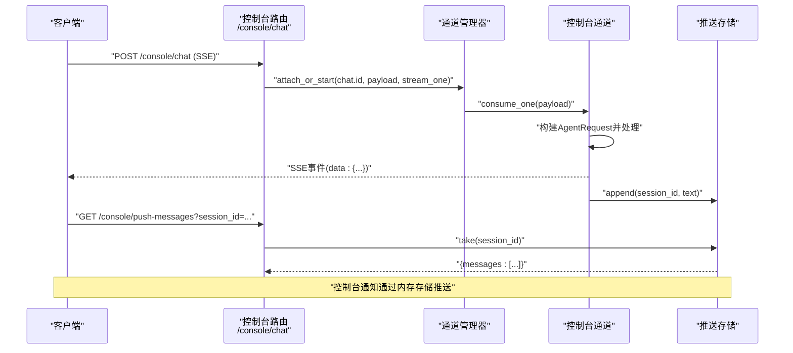
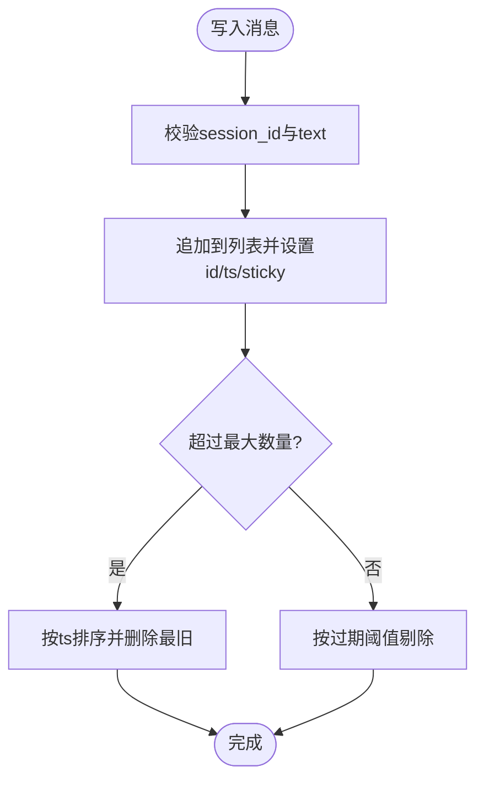
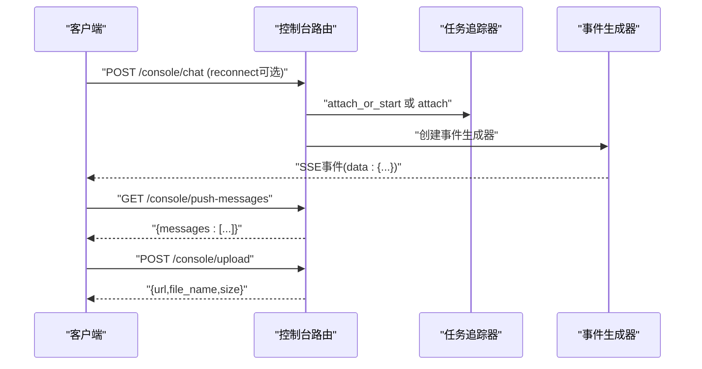
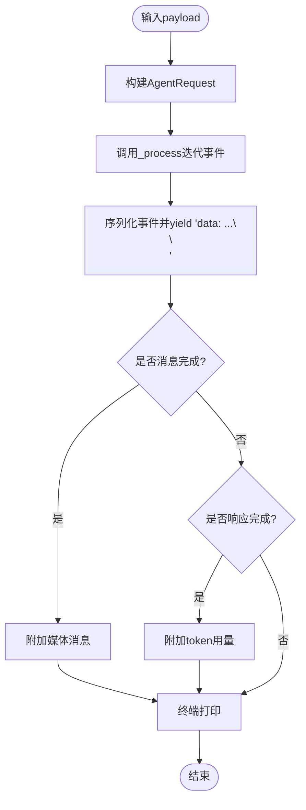
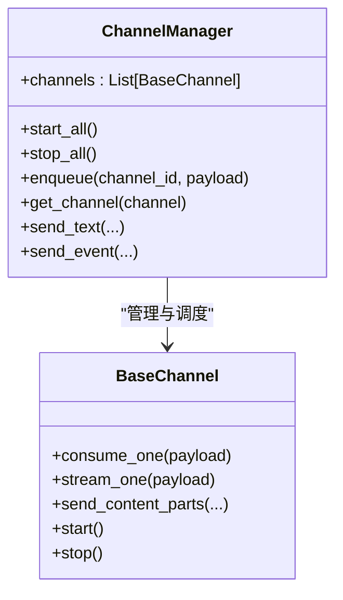
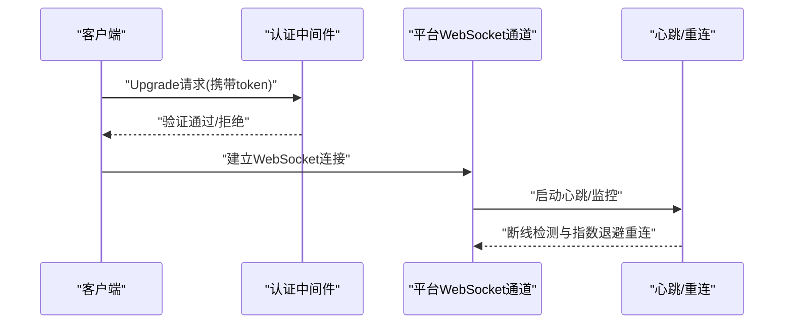
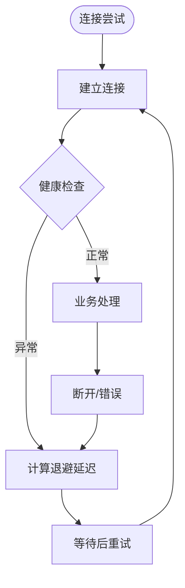
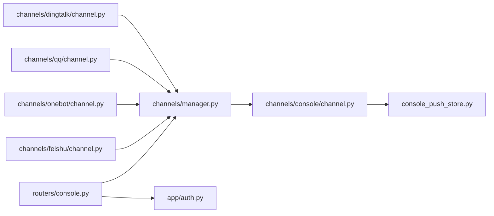

# WebSocket接口

<cite>
**本文档引用的文件**
- [console_push_store.py](file://src/qwenpaw/app/console_push_store.py)
- [console.py](file://src/qwenpaw/app/routers/console.py)
- [channel.py](file://src/qwenpaw/app/channels/console/channel.py)
- [manager.py](file://src/qwenpaw/app/channels/manager.py)
- [base.py](file://src/qwenpaw/app/channels/base.py)
- [auth.py](file://src/qwenpaw/app/auth.py)
- [channel.py](file://src/qwenpaw/app/channels/feishu/channel.py)
- [channel.py](file://src/qwenpaw/app/channels/onebot/channel.py)
- [channel.py](file://src/qwenpaw/app/channels/qq/channel.py)
- [channel.py](file://src/qwenpaw/app/channels/dingtalk/channel.py)
- [stateful_client.py](file://src/qwenpaw/app/mcp/stateful_client.py)
- [security.en.md](file://website/public/docs/security.en.md)
</cite>

## 目录
1. [简介](#简介)
2. [项目结构](#项目结构)
3. [核心组件](#核心组件)
4. [架构总览](#架构总览)
5. [详细组件分析](#详细组件分析)
6. [依赖分析](#依赖分析)
7. [性能考虑](#性能考虑)
8. [故障排除指南](#故障排除指南)
9. [结论](#结论)
10. [附录](#附录)

## 简介
本文件系统性梳理 QwenPaw 的 WebSocket 接口设计与实现，覆盖连接建立、消息格式、事件类型、实时交互模式、消息推送机制、连接状态管理与断线重连策略。重点说明控制台通知、任务状态更新等实时功能的推送通道，并对比 WebSocket 与 REST API 的差异及适用场景。

## 项目结构
围绕 WebSocket 的相关模块主要分布在以下位置：
- 控制台推送存储：用于在内存中缓存并分发控制台通知（如定时任务文本）。
- 控制台路由：提供聊天流式输出（SSE）与推送消息查询接口。
- 控制台通道：负责将消息打印到终端并推送至前端。
- 通道管理器：统一调度各通道的消息队列与消费流程。
- 基类通道：定义通用的事件流式输出（SSE）协议与消息处理框架。
- 认证模块：支持通过查询参数传递令牌进行 WebSocket 升级鉴权。
- 各平台通道：实现 WebSocket 连接、心跳、断线重连与消息分发。
- MCP 客户端：支持基于 SSE 的长连接与读超时配置。

**图表来源**
- [auth.py:429-440](file://src/qwenpaw/app/auth.py#L429-L440)
- [console.py:201-215](file://src/qwenpaw/app/routers/console.py#L201-L215)
- [console_push_store.py:22-39](file://src/qwenpaw/app/console_push_store.py#L22-L39)
- [manager.py:447-478](file://src/qwenpaw/app/channels/manager.py#L447-L478)
- [base.py:446-484](file://src/qwenpaw/app/channels/base.py#L446-L484)
- [channel.py:543-577](file://src/qwenpaw/app/channels/console/channel.py#L543-L577)
- [channel.py:2023-2177](file://src/qwenpaw/app/channels/feishu/channel.py#L2023-L2177)
- [channel.py:220-244](file://src/qwenpaw/app/channels/onebot/channel.py#L220-L244)
- [channel.py:1423-1457](file://src/qwenpaw/app/channels/qq/channel.py#L1423-L1457)
- [channel.py:2424-2491](file://src/qwenpaw/app/channels/dingtalk/channel.py#L2424-L2491)
- [stateful_client.py:414-444](file://src/qwenpaw/app/mcp/stateful_client.py#L414-L444)

**章节来源**
- [console_push_store.py:1-97](file://src/qwenpaw/app/console_push_store.py#L1-L97)
- [console.py:1-216](file://src/qwenpaw/app/routers/console.py#L1-L216)
- [channel.py:1-590](file://src/qwenpaw/app/channels/console/channel.py#L1-L590)
- [manager.py:1-711](file://src/qwenpaw/app/channels/manager.py#L1-L711)
- [base.py:1-800](file://src/qwenpaw/app/channels/base.py#L1-L800)
- [auth.py:121-440](file://src/qwenpaw/app/auth.py#L121-L440)
- [channel.py:2000-2200](file://src/qwenpaw/app/channels/feishu/channel.py#L2000-L2200)
- [channel.py:220-244](file://src/qwenpaw/app/channels/onebot/channel.py#L220-L244)
- [channel.py:1423-1457](file://src/qwenpaw/app/channels/qq/channel.py#L1423-L1457)
- [channel.py:2424-2491](file://src/qwenpaw/app/channels/dingtalk/channel.py#L2424-L2491)
- [stateful_client.py:414-444](file://src/qwenpaw/app/mcp/stateful_client.py#L414-L444)

## 核心组件
- 控制台推送存储：维护最近的控制台通知消息，按会话维度提供拉取与清理能力，支持去重与过期剔除。
- 控制台路由：提供聊天流式输出（SSE）、停止聊天、文件上传以及推送消息查询接口。
- 控制台通道：将消息打印到终端，并将文本内容推送到前端推送存储；支持媒体消息抽取与展示。
- 通道管理器：统一启动/停止各通道、入队消息、合并批量消息、执行消费循环。
- 基类通道：定义事件流式输出（SSE）协议，封装消息构建、去抖动、错误处理与完成回调。
- 认证模块：支持在 WebSocket 升级请求中通过查询参数提取令牌，配合保护路由策略。
- 平台通道：实现具体平台的 WebSocket 连接、心跳、断线重连与消息分发逻辑。
- MCP 客户端：支持 SSE 长连接与读超时配置，适配流式事件传输。

**章节来源**
- [console_push_store.py:22-97](file://src/qwenpaw/app/console_push_store.py#L22-L97)
- [console.py:68-215](file://src/qwenpaw/app/routers/console.py#L68-L215)
- [channel.py:332-577](file://src/qwenpaw/app/channels/console/channel.py#L332-L577)
- [manager.py:350-525](file://src/qwenpaw/app/channels/manager.py#L350-L525)
- [base.py:446-535](file://src/qwenpaw/app/channels/base.py#L446-L535)
- [auth.py:429-440](file://src/qwenpaw/app/auth.py#L429-L440)
- [stateful_client.py:414-444](file://src/qwenpaw/app/mcp/stateful_client.py#L414-L444)

## 架构总览
WebSocket 在 QwenPaw 中主要用于两类场景：
- 实时聊天与任务状态：通过 SSE 将事件流式推送至前端，支持断开重连与会话恢复。
- 控制台通知：通过内存推送存储聚合控制台产生的文本通知，前端可轮询获取。

**图表来源**
- [console.py:75-148](file://src/qwenpaw/app/routers/console.py#L75-L148)
- [manager.py:362-446](file://src/qwenpaw/app/channels/manager.py#L362-L446)
- [channel.py:332-449](file://src/qwenpaw/app/channels/console/channel.py#L332-L449)
- [console_push_store.py:41-55](file://src/qwenpaw/app/console_push_store.py#L41-L55)

## 详细组件分析

### 控制台推送存储
- 功能：在内存中维护有限条数与时间窗口内的推送消息，按会话维度区分，支持去重与过期剔除。
- 关键点：并发安全（锁）、最大数量与过期时间限制、剥离时间戳仅保留必要字段。

**图表来源**
- [console_push_store.py:22-39](file://src/qwenpaw/app/console_push_store.py#L22-L39)
- [console_push_store.py:78-82](file://src/qwenpaw/app/console_push_store.py#L78-L82)

**章节来源**
- [console_push_store.py:1-97](file://src/qwenpaw/app/console_push_store.py#L1-L97)

### 控制台路由与SSE事件流
- 聊天接口：支持流式响应（SSE），支持断开重连与停止运行中的对话。
- 推送消息接口：按会话或全局返回未消费的推送消息。
- 文件上传：保存附件到指定目录并返回访问信息。

**图表来源**
- [console.py:75-148](file://src/qwenpaw/app/routers/console.py#L75-L148)
- [console.py:201-215](file://src/qwenpaw/app/routers/console.py#L201-L215)
- [console.py:166-198](file://src/qwenpaw/app/routers/console.py#L166-L198)

**章节来源**
- [console.py:68-215](file://src/qwenpaw/app/routers/console.py#L68-L215)

### 控制台通道与SSE输出
- 事件格式：遵循 SSE 规范，逐条发送 data: JSON 的事件行。
- 事件类型：消息完成、响应完成、错误等，分别触发不同行为（媒体消息附加、统计用量、错误提示）。
- 输出目标：终端打印与推送存储。

**图表来源**
- [channel.py:332-449](file://src/qwenpaw/app/channels/console/channel.py#L332-L449)
- [base.py:446-535](file://src/qwenpaw/app/channels/base.py#L446-L535)

**章节来源**
- [channel.py:332-577](file://src/qwenpaw/app/channels/console/channel.py#L332-L577)
- [base.py:446-535](file://src/qwenpaw/app/channels/base.py#L446-L535)

### 通道管理器与消息队列
- 统一队列：为每个通道维护队列与消费者循环，支持批量合并与优先级分类。
- 入队与出队：线程安全地将外部来源（含同步 WebSocket 线程）的消息入队，异步消费并合并快速消息。
- 生命周期：启动/停止所有通道，清理挂起任务，优雅关闭。

**图表来源**
- [manager.py:447-525](file://src/qwenpaw/app/channels/manager.py#L447-L525)
- [base.py:659-795](file://src/qwenpaw/app/channels/base.py#L659-L795)

**章节来源**
- [manager.py:350-525](file://src/qwenpaw/app/channels/manager.py#L350-L525)
- [base.py:659-795](file://src/qwenpaw/app/channels/base.py#L659-L795)

### WebSocket连接与认证
- 认证方式：WebSocket 升级请求中支持通过查询参数携带令牌，与保护路由策略一致。
- 平台通道：飞书、OneBot、QQ、钉钉等均实现了各自的 WebSocket 连接、心跳与断线重连逻辑。

**图表来源**
- [auth.py:429-440](file://src/qwenpaw/app/auth.py#L429-L440)
- [channel.py:2023-2177](file://src/qwenpaw/app/channels/feishu/channel.py#L2023-L2177)
- [channel.py:220-244](file://src/qwenpaw/app/channels/onebot/channel.py#L220-L244)
- [channel.py:1423-1457](file://src/qwenpaw/app/channels/qq/channel.py#L1423-L1457)
- [security.en.md:726-740](file://website/public/docs/security.en.md#L726-L740)

**章节来源**
- [auth.py:429-440](file://src/qwenpaw/app/auth.py#L429-L440)
- [channel.py:2023-2177](file://src/qwenpaw/app/channels/feishu/channel.py#L2023-L2177)
- [channel.py:220-244](file://src/qwenpaw/app/channels/onebot/channel.py#L220-L244)
- [channel.py:1423-1457](file://src/qwenpaw/app/channels/qq/channel.py#L1423-L1457)
- [security.en.md:726-740](file://website/public/docs/security.en.md#L726-L740)

### 断线重连策略
- 指数退避：根据失败次数逐步增加等待时间，避免对上游造成冲击。
- 快速断开保护：若短时间内多次断开，触发速率限制并刷新令牌/会话状态。
- 健康监控：定期检查连接状态，异常时主动重启事件循环并重新连接。

**图表来源**
- [channel.py:1423-1457](file://src/qwenpaw/app/channels/qq/channel.py#L1423-L1457)
- [channel.py:2044-2177](file://src/qwenpaw/app/channels/feishu/channel.py#L2044-L2177)

**章节来源**
- [channel.py:1423-1457](file://src/qwenpaw/app/channels/qq/channel.py#L1423-L1457)
- [channel.py:2044-2177](file://src/qwenpaw/app/channels/feishu/channel.py#L2044-L2177)

### MCP SSE客户端与读超时
- 支持 SSE 长连接与读超时配置，确保在长时间无事件时仍能及时感知异常。
- 适用于需要持续监听远端事件流的场景（如 MCP 服务）。

**章节来源**
- [stateful_client.py:414-444](file://src/qwenpaw/app/mcp/stateful_client.py#L414-L444)

## 依赖分析
- 控制台路由依赖通道管理器与任务追踪器以实现流式输出与断开重连。
- 控制台通道依赖推送存储以提供控制台通知。
- 平台通道各自依赖第三方 SDK 与内部队列管理器。
- 认证模块为 WebSocket 升级提供令牌提取与校验。

**图表来源**
- [console.py:75-148](file://src/qwenpaw/app/routers/console.py#L75-L148)
- [manager.py:447-525](file://src/qwenpaw/app/channels/manager.py#L447-L525)
- [channel.py:543-577](file://src/qwenpaw/app/channels/console/channel.py#L543-L577)
- [console_push_store.py:22-39](file://src/qwenpaw/app/console_push_store.py#L22-L39)
- [auth.py:429-440](file://src/qwenpaw/app/auth.py#L429-L440)
- [channel.py:2023-2177](file://src/qwenpaw/app/channels/feishu/channel.py#L2023-L2177)
- [channel.py:220-244](file://src/qwenpaw/app/channels/onebot/channel.py#L220-L244)
- [channel.py:1423-1457](file://src/qwenpaw/app/channels/qq/channel.py#L1423-L1457)
- [channel.py:2424-2491](file://src/qwenpaw/app/channels/dingtalk/channel.py#L2424-L2491)

**章节来源**
- [console.py:68-215](file://src/qwenpaw/app/routers/console.py#L68-L215)
- [manager.py:447-525](file://src/qwenpaw/app/channels/manager.py#L447-L525)
- [channel.py:543-577](file://src/qwenpaw/app/channels/console/channel.py#L543-L577)
- [console_push_store.py:22-39](file://src/qwenpaw/app/console_push_store.py#L22-L39)
- [auth.py:429-440](file://src/qwenpaw/app/auth.py#L429-L440)
- [channel.py:2023-2177](file://src/qwenpaw/app/channels/feishu/channel.py#L2023-L2177)
- [channel.py:220-244](file://src/qwenpaw/app/channels/onebot/channel.py#L220-L244)
- [channel.py:1423-1457](file://src/qwenpaw/app/channels/qq/channel.py#L1423-L1457)
- [channel.py:2424-2491](file://src/qwenpaw/app/channels/dingtalk/channel.py#L2424-L2491)

## 性能考虑
- SSE 流式输出：事件逐条发送，降低前端渲染压力；建议客户端使用 EventSource 自动重连。
- 内存推送存储：限制最大消息数与过期时间，避免长期运行导致内存膨胀。
- 批量合并：通道管理器对同会话消息进行合并，减少重复处理与网络开销。
- 断线重连：指数退避与快速断开保护，平衡恢复速度与上游压力。
- 读超时：MCP SSE 客户端配置合理的读超时，避免阻塞资源占用。

## 故障排除指南
- WebSocket 认证失败：确认升级请求中携带正确的查询参数令牌，检查保护路由策略。
- 连接频繁断开：观察是否触发快速断开保护，适当调整重连策略或检查上游服务稳定性。
- SSE 事件丢失：确认客户端 EventSource 正常工作，服务端未提前关闭连接。
- 控制台通知未显示：检查推送存储是否正确写入与按会话拉取。

**章节来源**
- [auth.py:429-440](file://src/qwenpaw/app/auth.py#L429-L440)
- [channel.py:1423-1457](file://src/qwenpaw/app/channels/qq/channel.py#L1423-L1457)
- [console_push_store.py:22-97](file://src/qwenpaw/app/console_push_store.py#L22-L97)

## 结论
QwenPaw 的 WebSocket 接口以 SSE 为核心，结合通道管理器与推送存储，实现了控制台通知与实时聊天的高效推送。平台通道提供了稳健的连接与重连机制，认证模块确保了 WebSocket 升级的安全性。相比 REST API 的请求-响应模式，WebSocket 更适合需要低延迟、双向实时通信的场景，如聊天、任务状态更新与控制台通知。

## 附录

### WebSocket 与 REST API 的区别与适用场景
- WebSocket：适合实时双向通信、事件流推送、断线自动重连与会话恢复（如聊天、任务状态、控制台通知）。
- REST API：适合请求-响应模型、幂等操作与状态查询（如文件上传、配置获取、用户认证）。

**章节来源**
- [console.py:68-198](file://src/qwenpaw/app/routers/console.py#L68-L198)
- [security.en.md:726-740](file://website/public/docs/security.en.md#L726-L740)