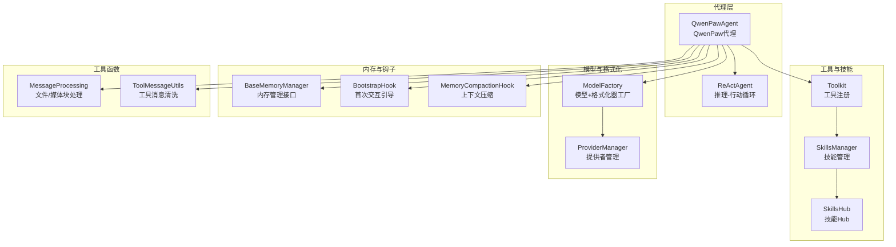
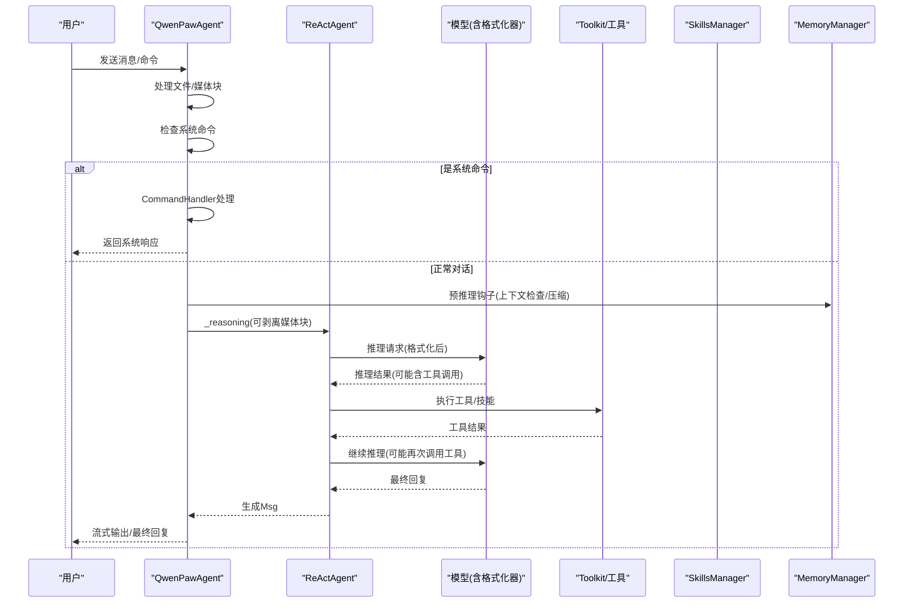
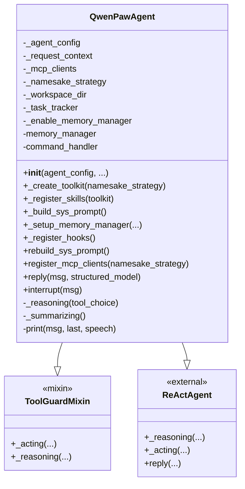
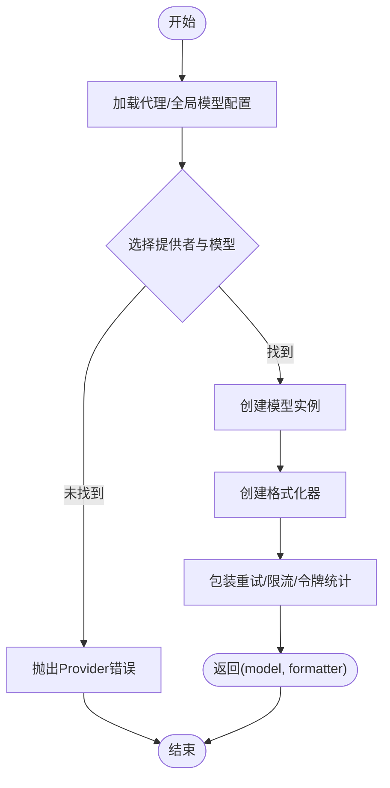
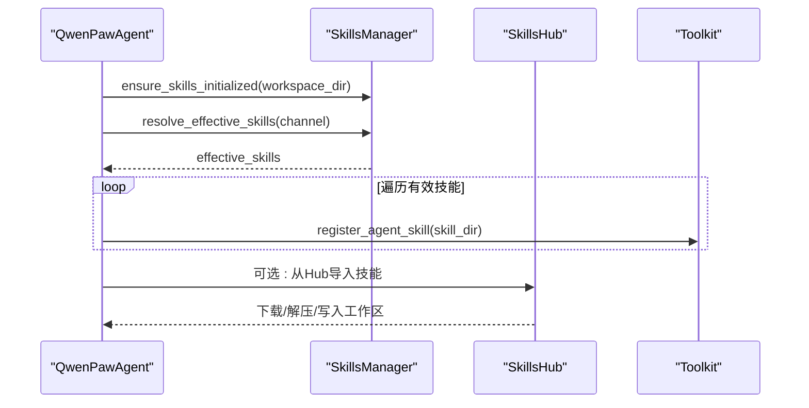
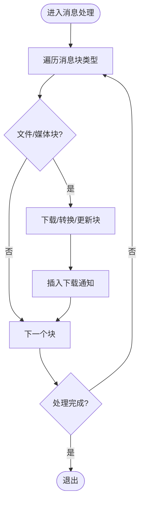
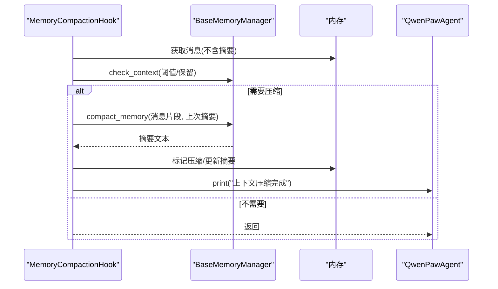
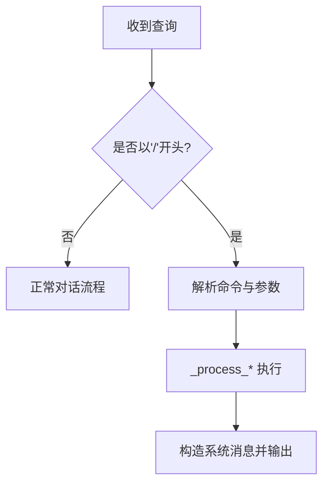
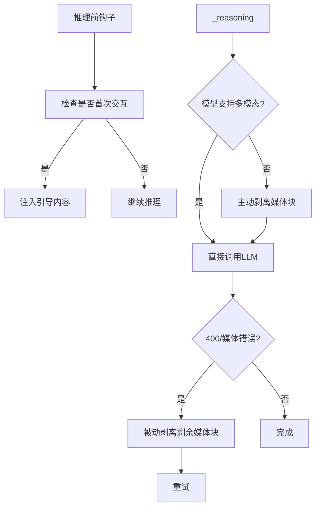
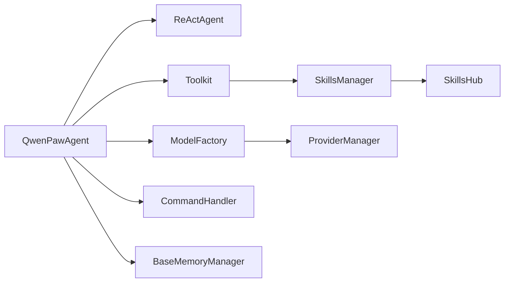

# 代理架构设计

<cite>
**本文档引用的文件**
- [react_agent.py](file://src/qwenpaw/agents/react_agent.py)
- [__init__.py](file://src/qwenpaw/agents/__init__.py)
- [model_factory.py](file://src/qwenpaw/agents/model_factory.py)
- [skills_manager.py](file://src/qwenpaw/agents/skills_manager.py)
- [skills_hub.py](file://src/qwenpaw/agents/skills_hub.py)
- [command_handler.py](file://src/qwenpaw/agents/command_handler.py)
- [base_memory_manager.py](file://src/qwenpaw/agents/memory/base_memory_manager.py)
- [message_processing.py](file://src/qwenpaw/agents/utils/message_processing.py)
- [tool_message_utils.py](file://src/qwenpaw/agents/utils/tool_message_utils.py)
- [bootstrap.py](file://src/qwenpaw/agents/hooks/bootstrap.py)
- [memory_compaction.py](file://src/qwenpaw/agents/hooks/memory_compaction.py)
- [tools/__init__.py](file://src/qwenpaw/agents/tools/__init__.py)
</cite>

## 目录
1. [简介](#简介)
2. [项目结构](#项目结构)
3. [核心组件](#核心组件)
4. [架构总览](#架构总览)
5. [详细组件分析](#详细组件分析)
6. [依赖关系分析](#依赖关系分析)
7. [性能考虑](#性能考虑)
8. [故障排除指南](#故障排除指南)
9. [结论](#结论)

## 简介
本文件面向QwenPaw代理架构设计，系统性阐述ReAct代理的核心原理与实现细节，包括推理-行动循环机制、消息处理流程与决策制定过程。文档重点覆盖QwenPawAgent类的继承关系、核心方法与关键属性，以及代理与模型提供者集成、工具注册机制与技能加载流程。同时，文档解释代理初始化过程、配置管理与状态维护，并总结设计模式、扩展点与最佳实践，辅以图示帮助开发者理解底层工作机制。

## 项目结构
QwenPaw代理位于Python包`src/qwenpaw/agents/`下，采用模块化组织：
- 核心代理：QwenPawAgent（继承自ReActAgent）
- 工具与技能：内置工具注册、技能加载与Hub集成
- 模型工厂：统一创建聊天模型与格式化器
- 内存管理：抽象基类与自动压缩钩子
- 命令处理：系统命令（/compact、/new等）解析与执行
- 工具函数：消息块处理、工具消息清洗、引导钩子等

**图表来源**
- [react_agent.py:69-182](file://src/qwenpaw/agents/react_agent.py#L69-L182)
- [model_factory.py:698-787](file://src/qwenpaw/agents/model_factory.py#L698-L787)
- [skills_manager.py:306-341](file://src/qwenpaw/agents/skills_manager.py#L306-L341)
- [skills_hub.py:1-120](file://src/qwenpaw/agents/skills_hub.py#L1-L120)
- [base_memory_manager.py:21-226](file://src/qwenpaw/agents/memory/base_memory_manager.py#L21-L226)
- [message_processing.py:388-431](file://src/qwenpaw/agents/utils/message_processing.py#L388-L431)
- [tool_message_utils.py:322-357](file://src/qwenpaw/agents/utils/tool_message_utils.py#L322-L357)

**章节来源**
- [react_agent.py:1-120](file://src/qwenpaw/agents/react_agent.py#L1-L120)
- [__init__.py:18-34](file://src/qwenpaw/agents/__init__.py#L18-L34)

## 核心组件
- QwenPawAgent：基于ReActAgent扩展，集成工具、技能、内存管理、系统命令与安全拦截
- ModelFactory：按配置创建模型实例与对应格式化器，支持重试与限流包装
- SkillsManager/SkillsHub：工作区技能同步、冲突处理、环境变量注入与Hub导入
- BaseMemoryManager：内存管理接口，提供压缩、摘要与搜索能力
- CommandHandler：系统命令解析与执行（/compact、/new、/clear等）
- 工具与钩子：内置工具注册、引导钩子、上下文压缩钩子、消息块处理与工具消息清洗

**章节来源**
- [react_agent.py:69-182](file://src/qwenpaw/agents/react_agent.py#L69-L182)
- [model_factory.py:698-787](file://src/qwenpaw/agents/model_factory.py#L698-L787)
- [skills_manager.py:306-341](file://src/qwenpaw/agents/skills_manager.py#L306-L341)
- [base_memory_manager.py:21-226](file://src/qwenpaw/agents/memory/base_memory_manager.py#L21-L226)
- [command_handler.py:62-120](file://src/qwenpaw/agents/command_handler.py#L62-L120)

## 架构总览
ReAct代理的核心在于“推理-行动”循环：代理在每次迭代中先进行推理（Reasoning），生成下一步行动或工具调用，再执行行动（Acting）。QwenPawAgent在此基础上增加了：
- 多模态能力感知与回退：当模型不支持多模态时，主动剥离媒体块并重试
- 内存管理钩子：在推理前检查上下文长度，必要时自动压缩历史
- 技能与工具动态注册：从工作区加载技能，按通道生效，支持环境变量注入
- 安全拦截：通过ToolGuardMixin对工具调用进行拦截与审批

**图表来源**
- [react_agent.py:959-1041](file://src/qwenpaw/agents/react_agent.py#L959-L1041)
- [command_handler.py:499-529](file://src/qwenpaw/agents/command_handler.py#L499-L529)
- [memory_compaction.py:62-213](file://src/qwenpaw/agents/hooks/memory_compaction.py#L62-L213)

## 详细组件分析

### QwenPawAgent 类分析
- 继承关系：QwenPawAgent → ToolGuardMixin → ReActAgent，确保工具调用拦截贯穿
- 关键属性
  - _agent_config：代理配置（运行参数、语言、工具启用等）
  - _request_context：会话级上下文（channel、user_id、session_id等）
  - _mcp_clients：MCP客户端列表，支持注册与恢复
  - memory_manager：内存管理器（可选），用于摘要与压缩
  - command_handler：系统命令处理器
- 核心方法
  - 初始化：构建系统提示、创建模型与格式化器、注册工具与技能、设置内存管理与钩子
  - _create_toolkit：根据配置注册内置工具，支持异步执行与后台任务管理工具
  - _register_skills：解析有效技能并注册到Toolkit
  - _build_sys_prompt：从工作区文件构建系统提示，注入多模态提示与环境上下文
  - _setup_memory_manager：启用内存搜索工具并注入模型与格式化器
  - _register_hooks：注册引导钩子与内存压缩钩子
  - reply：消息预处理（文件/媒体块）、命令检测、技能配置环境注入、调用父类推理
  - _reasoning/_summarizing：多模态回退策略（主动剥离媒体块 + 被动失败回退）
  - print：在摘要阶段过滤tool_use块，避免前端短暂渲染幻影调用

**图表来源**
- [react_agent.py:69-182](file://src/qwenpaw/agents/react_agent.py#L69-L182)
- [react_agent.py:183-304](file://src/qwenpaw/agents/react_agent.py#L183-L304)
- [react_agent.py:306-341](file://src/qwenpaw/agents/react_agent.py#L306-L341)
- [react_agent.py:478-542](file://src/qwenpaw/agents/react_agent.py#L478-L542)
- [react_agent.py:959-1041](file://src/qwenpaw/agents/react_agent.py#L959-L1041)

**章节来源**
- [react_agent.py:89-182](file://src/qwenpaw/agents/react_agent.py#L89-L182)
- [react_agent.py:183-304](file://src/qwenpaw/agents/react_agent.py#L183-L304)
- [react_agent.py:306-341](file://src/qwenpaw/agents/react_agent.py#L306-L341)
- [react_agent.py:478-542](file://src/qwenpaw/agents/react_agent.py#L478-L542)
- [react_agent.py:675-784](file://src/qwenpaw/agents/react_agent.py#L675-L784)
- [react_agent.py:959-1041](file://src/qwenpaw/agents/react_agent.py#L959-L1041)

### 模型工厂与提供者集成
- 模型工厂职责
  - 依据代理或全局配置选择Provider与模型
  - 创建对应格式化器（OpenAI/Anthropic/Gemini）
  - 包装Token统计与重试/限流逻辑
- 提供者管理
  - ProviderManager统一管理提供者与活跃模型
  - 支持重试配置（最大重试、退避、并发限制）

**图表来源**
- [model_factory.py:698-787](file://src/qwenpaw/agents/model_factory.py#L698-L787)

**章节来源**
- [model_factory.py:698-787](file://src/qwenpaw/agents/model_factory.py#L698-L787)

### 技能管理与工具注册机制
- 技能管理
  - 工作区技能目录扫描与清单管理
  - 冲突检测与命名建议
  - 环境变量注入（按技能需求）
  - Hub导入与版本解析
- 工具注册
  - 内置工具按配置启用
  - 异步工具自动注册后台任务管理工具
  - MCP客户端工具注册与恢复

**图表来源**
- [react_agent.py:306-341](file://src/qwenpaw/agents/react_agent.py#L306-L341)
- [skills_manager.py:306-341](file://src/qwenpaw/agents/skills_manager.py#L306-L341)
- [skills_hub.py:556-658](file://src/qwenpaw/agents/skills_hub.py#L556-L658)

**章节来源**
- [react_agent.py:306-341](file://src/qwenpaw/agents/react_agent.py#L306-L341)
- [skills_manager.py:306-341](file://src/qwenpaw/agents/skills_manager.py#L306-L341)
- [skills_hub.py:556-658](file://src/qwenpaw/agents/skills_hub.py#L556-L658)

### 消息处理与工具消息清洗
- 文件/媒体块处理
  - 支持base64与URL来源，下载到本地并替换路径
  - 音频支持自动转写或原生发送（受配置影响）
- 工具消息清洗
  - 确保tool_use与tool_result成对且顺序正确
  - 移除无效/重复块，修复空输入但有原始输入的情况

**图表来源**
- [message_processing.py:388-431](file://src/qwenpaw/agents/utils/message_processing.py#L388-L431)
- [tool_message_utils.py:322-357](file://src/qwenpaw/agents/utils/tool_message_utils.py#L322-L357)

**章节来源**
- [message_processing.py:25-74](file://src/qwenpaw/agents/utils/message_processing.py#L25-L74)
- [message_processing.py:388-431](file://src/qwenpaw/agents/utils/message_processing.py#L388-L431)
- [tool_message_utils.py:322-357](file://src/qwenpaw/agents/utils/tool_message_utils.py#L322-L357)

### 内存管理与上下文压缩
- 接口定义：BaseMemoryManager提供压缩、摘要、搜索与任务管理
- 钩子逻辑：MemoryCompactionHook在推理前检查上下文，必要时触发压缩与摘要
- 自动摘要：后台任务收集摘要结果，更新压缩摘要

**图表来源**
- [base_memory_manager.py:74-114](file://src/qwenpaw/agents/memory/base_memory_manager.py#L74-L114)
- [memory_compaction.py:62-213](file://src/qwenpaw/agents/hooks/memory_compaction.py#L62-L213)

**章节来源**
- [base_memory_manager.py:21-226](file://src/qwenpaw/agents/memory/base_memory_manager.py#L21-L226)
- [memory_compaction.py:62-213](file://src/qwenpaw/agents/hooks/memory_compaction.py#L62-L213)

### 系统命令处理
- 支持命令：/compact、/new、/clear、/history、/compact_str、/await_summary、/message、/dump_history、/load_history、/long_term_memory
- 解析与执行：CommandHandler识别命令、构造系统消息响应

**图表来源**
- [command_handler.py:46-59](file://src/qwenpaw/agents/command_handler.py#L46-L59)
- [command_handler.py:499-529](file://src/qwenpaw/agents/command_handler.py#L499-L529)

**章节来源**
- [command_handler.py:62-120](file://src/qwenpaw/agents/command_handler.py#L62-L120)
- [command_handler.py:499-529](file://src/qwenpaw/agents/command_handler.py#L499-L529)

### 引导钩子与多模态回退
- 引导钩子：首次用户交互时检查BOOTSTRAP.md并注入引导内容
- 多模态回退：若模型不支持多模态，主动剥离图像/音频/视频块；若仍失败则被动剥离并重试

**图表来源**
- [bootstrap.py:42-103](file://src/qwenpaw/agents/hooks/bootstrap.py#L42-L103)
- [react_agent.py:675-727](file://src/qwenpaw/agents/react_agent.py#L675-L727)
- [react_agent.py:902-956](file://src/qwenpaw/agents/react_agent.py#L902-L956)

**章节来源**
- [bootstrap.py:42-103](file://src/qwenpaw/agents/hooks/bootstrap.py#L42-L103)
- [react_agent.py:675-727](file://src/qwenpaw/agents/react_agent.py#L675-L727)
- [react_agent.py:902-956](file://src/qwenpaw/agents/react_agent.py#L902-L956)

## 依赖关系分析
- 组件耦合
  - QwenPawAgent与ReActAgent强耦合，通过MRO保证ToolGuardMixin拦截生效
  - 与ModelFactory、SkillsManager、CommandHandler、MemoryManager松耦合，通过接口与工厂方法连接
- 外部依赖
  - ProviderManager提供模型与格式化器
  - Toolkit承载工具与技能
  - MCP客户端通过注册桥接外部工具生态

**图表来源**
- [react_agent.py:69-182](file://src/qwenpaw/agents/react_agent.py#L69-L182)
- [model_factory.py:698-787](file://src/qwenpaw/agents/model_factory.py#L698-L787)
- [skills_manager.py:306-341](file://src/qwenpaw/agents/skills_manager.py#L306-L341)
- [skills_hub.py:556-658](file://src/qwenpaw/agents/skills_hub.py#L556-L658)
- [command_handler.py:62-120](file://src/qwenpaw/agents/command_handler.py#L62-L120)
- [base_memory_manager.py:21-226](file://src/qwenpaw/agents/memory/base_memory_manager.py#L21-L226)

**章节来源**
- [react_agent.py:69-182](file://src/qwenpaw/agents/react_agent.py#L69-L182)
- [model_factory.py:698-787](file://src/qwenpaw/agents/model_factory.py#L698-L787)
- [skills_manager.py:306-341](file://src/qwenpaw/agents/skills_manager.py#L306-L341)
- [skills_hub.py:556-658](file://src/qwenpaw/agents/skills_hub.py#L556-L658)
- [command_handler.py:62-120](file://src/qwenpaw/agents/command_handler.py#L62-L120)
- [base_memory_manager.py:21-226](file://src/qwenpaw/agents/memory/base_memory_manager.py#L21-L226)

## 性能考虑
- 上下文压缩：通过摘要与标记压缩减少token占用，避免超长上下文导致的失败
- 工具结果压缩：针对工具输出进行阈值控制，降低大体积输出对上下文的影响
- 异步工具：后台任务管理工具避免阻塞主线程
- 多模态回退：主动剥离媒体块减少不必要的API调用与失败重试
- 缓存与重试：模型包装器提供重试与限流，提升稳定性与吞吐

[本节为通用指导，无需特定文件引用]

## 故障排除指南
- 命令未识别：确认命令以“/”开头且参数正确
- 上下文过长：使用/compact或/long_term_memory强制检索，或/shorten缩短历史
- 多媒体被拒：检查模型多模态能力标识，或等待自动剥离回退
- 技能冲突：使用suggest_conflict_name生成建议名称，或删除冲突副本
- MCP客户端中断：查看注册日志，尝试自动恢复或重建客户端

**章节来源**
- [command_handler.py:499-529](file://src/qwenpaw/agents/command_handler.py#L499-L529)
- [react_agent.py:875-896](file://src/qwenpaw/agents/react_agent.py#L875-L896)
- [skills_manager.py:755-775](file://src/qwenpaw/agents/skills_manager.py#L755-L775)
- [react_agent.py:543-558](file://src/qwenpaw/agents/react_agent.py#L543-L558)

## 结论
QwenPaw代理架构以ReAct为核心，结合模型工厂、技能与工具生态、内存管理与钩子机制，形成高扩展、可配置、可审计的智能体系统。其设计强调：
- 渐进式能力适配（多模态回退、上下文压缩）
- 动态资源管理（技能与工具按需加载、环境变量注入）
- 安全与可观测（工具拦截、系统命令、摘要任务）
- 易扩展（接口清晰、钩子与工厂模式）

开发者可通过扩展工具、钩子与内存后端，快速适配不同场景与业务需求。