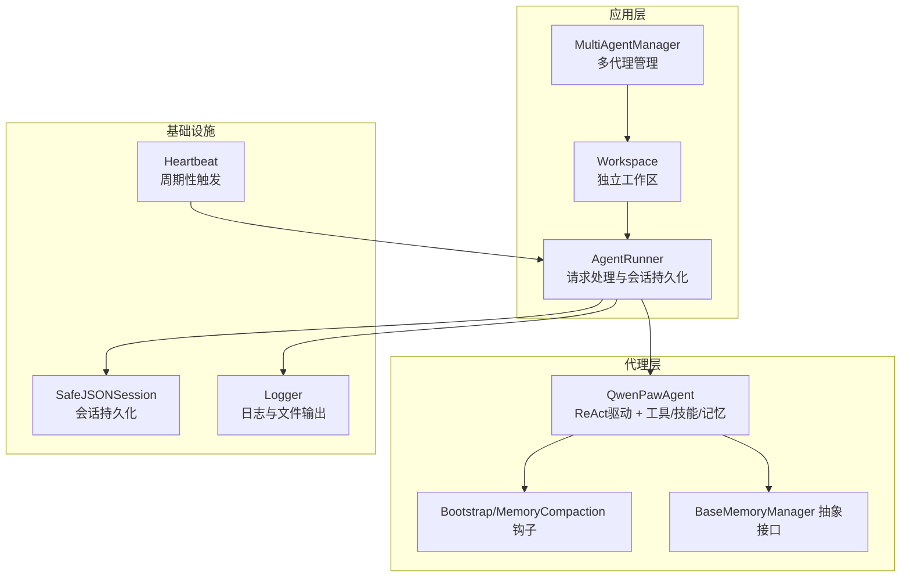
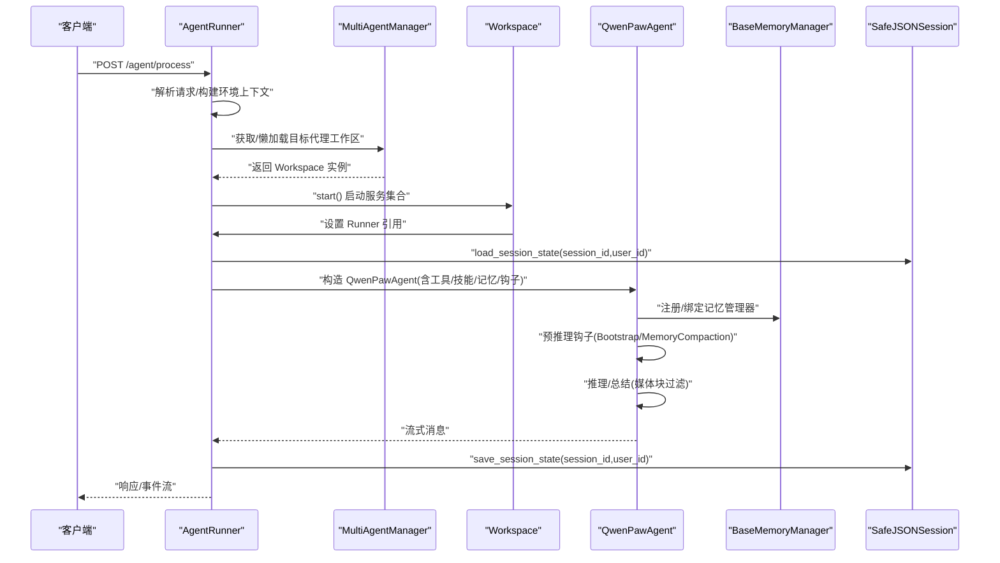
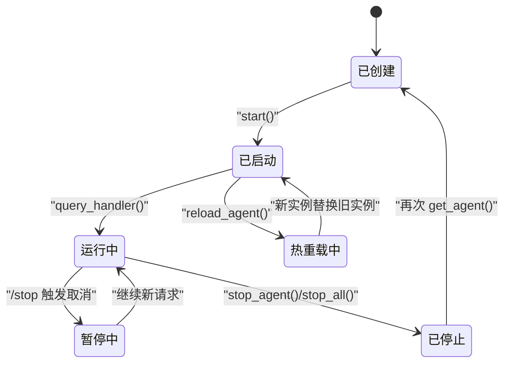
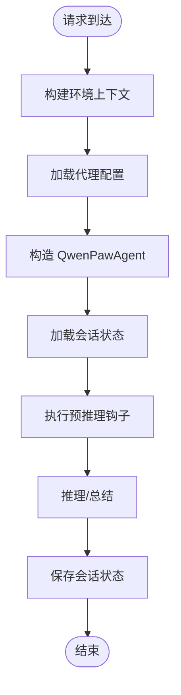
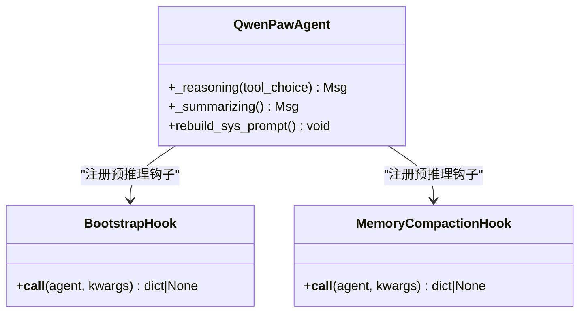
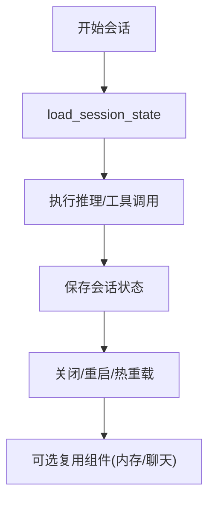
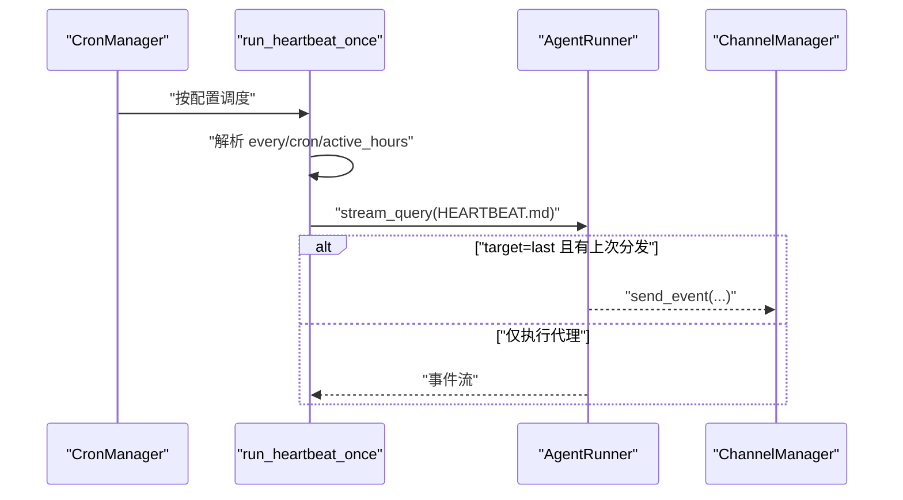
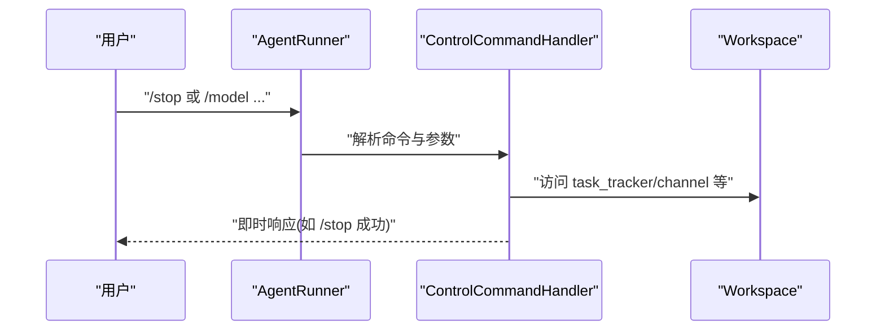
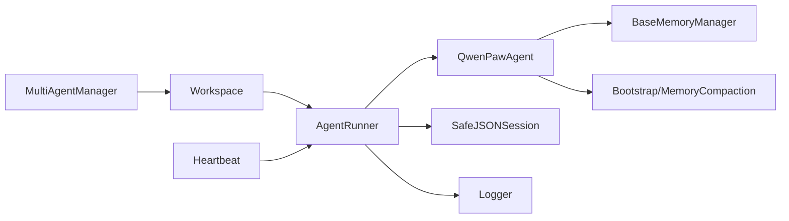

# 代理生命周期

<cite>
**本文引用的文件**
- [react_agent.py](file://src/qwenpaw/agents/react_agent.py)
- [multi_agent_manager.py](file://src/qwenpaw/app/multi_agent_manager.py)
- [workspace.py](file://src/qwenpaw/app/workspace/workspace.py)
- [runner.py](file://src/qwenpaw/app/runner/runner.py)
- [session.py](file://src/qwenpaw/app/runner/session.py)
- [base_memory_manager.py](file://src/qwenpaw/agents/memory/base_memory_manager.py)
- [bootstrap.py](file://src/qwenpaw/agents/hooks/bootstrap.py)
- [memory_compaction.py](file://src/qwenpaw/agents/hooks/memory_compaction.py)
- [heartbeat.py](file://src/qwenpaw/app/crons/heartbeat.py)
- [logging.py](file://src/qwenpaw/utils/logging.py)
- [agent_context.py](file://src/qwenpaw/app/agent_context.py)
- [models.py](file://src/qwenpaw/app/runner/models.py)
- [base.py](file://src/qwenpaw/app/runner/control_commands/base.py)
- [stop_handler.py](file://src/qwenpaw/app/runner/control_commands/stop_handler.py)
- [model_handler.py](file://src/qwenpaw/app/runner/control_commands/model_handler.py)
</cite>

## 目录
1. [引言](#引言)
2. [项目结构](#项目结构)
3. [核心组件](#核心组件)
4. [架构总览](#架构总览)
5. [详细组件分析](#详细组件分析)
6. [依赖分析](#依赖分析)
7. [性能考虑](#性能考虑)
8. [故障排除指南](#故障排除指南)
9. [结论](#结论)
10. [附录](#附录)

## 引言
本技术文档围绕 QwenPaw 的“代理生命周期”展开，系统阐述从代理创建、初始化、运行、暂停/中断、恢复与终止的全链路过程；覆盖状态转换、事件触发与钩子机制；详述启动流程、健康检查与异常恢复策略；解释资源管理、内存清理与会话持久化；并提供监控、日志与性能指标采集方法，以及调试技巧、故障排除与性能优化建议。

## 项目结构
- 代理主体与能力集成：位于 agents 子模块，包含 ReAct 驱动的智能体、工具集、技能注册、记忆管理与钩子。
- 运行时与工作区：app/workspace 封装独立工作区，聚合 Runner、Channel、Memory、MCP、Cron 等服务。
- 多代理管理：app/multi_agent_manager 提供懒加载、零停机热重载、优雅停止与后台清理。
- 控制命令与会话：runner 提供查询处理、会话持久化、工具守卫审批、控制命令处理；session 提供安全的跨平台 JSON 会话存储。
- 健康检查与心跳：crons/heartbeat 支持按配置周期性触发代理执行。
- 日志与监控：utils/logging 提供统一日志格式与文件输出；结合会话与内存任务可采集运行指标。

图表来源
- [runner.py:70-735](file://src/qwenpaw/app/runner/runner.py#L70-L735)
- [workspace.py:47-389](file://src/qwenpaw/app/workspace/workspace.py#L47-L389)
- [multi_agent_manager.py:21-470](file://src/qwenpaw/app/multi_agent_manager.py#L21-L470)
- [react_agent.py:69-1058](file://src/qwenpaw/agents/react_agent.py#L69-L1058)
- [base_memory_manager.py:21-226](file://src/qwenpaw/agents/memory/base_memory_manager.py#L21-L226)
- [session.py:39-248](file://src/qwenpaw/app/runner/session.py#L39-L248)
- [logging.py:121-202](file://src/qwenpaw/utils/logging.py#L121-L202)
- [heartbeat.py:119-213](file://src/qwenpaw/app/crons/heartbeat.py#L119-L213)

章节来源
- [runner.py:70-735](file://src/qwenpaw/app/runner/runner.py#L70-L735)
- [workspace.py:47-389](file://src/qwenpaw/app/workspace/workspace.py#L47-L389)
- [multi_agent_manager.py:21-470](file://src/qwenpaw/app/multi_agent_manager.py#L21-L470)

## 核心组件
- QwenPawAgent：基于 ReActAgent 的智能体，集成工具、技能、记忆与钩子，负责推理、总结与媒体块过滤。
- Workspace：单个代理的完整运行时容器，统一管理 Runner、Channel、Memory、MCP、Cron 等服务。
- MultiAgentManager：多代理生命周期管理器，支持懒加载、零停机热重载、优雅停止与后台清理。
- AgentRunner：请求入口，负责环境上下文注入、会话加载/保存、工具守卫审批、控制命令与技能注入。
- SafeJSONSession：跨平台安全的 JSON 会话存储，异步读写，避免阻塞事件循环。
- BaseMemoryManager：记忆管理抽象，定义压缩、汇总、搜索与后台任务接口。
- 钩子：BootstrapHook（首次交互引导）、MemoryCompactionHook（上下文压缩）。
- 心跳：按配置周期执行 HEARTBEAT.md 内容，支持目标通道分发。
- 日志：统一命名空间、彩色终端输出、文件轮转与过滤。

章节来源
- [react_agent.py:69-1058](file://src/qwenpaw/agents/react_agent.py#L69-L1058)
- [workspace.py:47-389](file://src/qwenpaw/app/workspace/workspace.py#L47-L389)
- [multi_agent_manager.py:21-470](file://src/qwenpaw/app/multi_agent_manager.py#L21-L470)
- [runner.py:70-735](file://src/qwenpaw/app/runner/runner.py#L70-L735)
- [session.py:39-248](file://src/qwenpaw/app/runner/session.py#L39-L248)
- [base_memory_manager.py:21-226](file://src/qwenpaw/agents/memory/base_memory_manager.py#L21-L226)
- [bootstrap.py:20-104](file://src/qwenpaw/agents/hooks/bootstrap.py#L20-L104)
- [memory_compaction.py:27-214](file://src/qwenpaw/agents/hooks/memory_compaction.py#L27-L214)
- [heartbeat.py:119-213](file://src/qwenpaw/app/crons/heartbeat.py#L119-L213)
- [logging.py:121-202](file://src/qwenpaw/utils/logging.py#L121-L202)

## 架构总览
下图展示从请求进入、代理实例化、会话加载、推理执行、钩子介入、会话保存到控制命令处理的整体流程。

图表来源
- [runner.py:349-598](file://src/qwenpaw/app/runner/runner.py#L349-L598)
- [multi_agent_manager.py:38-90](file://src/qwenpaw/app/multi_agent_manager.py#L38-L90)
- [workspace.py:322-380](file://src/qwenpaw/app/workspace/workspace.py#L322-L380)
- [react_agent.py:89-182](file://src/qwenpaw/agents/react_agent.py#L89-L182)
- [session.py:73-138](file://src/qwenpaw/app/runner/session.py#L73-L138)

## 详细组件分析

### 组件一：代理生命周期与状态转换
- 创建与初始化
  - MultiAgentManager 懒加载：首次请求通过 get_agent(agent_id) 创建 Workspace 并 start()。
  - Workspace.start() 通过 ServiceManager 顺序/并发启动 Runner、Memory、MCP、Channel、Cron 等服务。
  - AgentRunner.init_handler() 初始化 SafeJSONSession，定位 sessions 目录。
- 运行期
  - AgentRunner.query_handler() 接收消息，注入 agent_id 与 session_id 上下文，加载会话状态，重建系统提示，调用 QwenPawAgent 执行推理。
  - 钩子在 pre_reasoning 阶段执行：BootstrapHook 首次交互引导；MemoryCompactionHook 在上下文接近阈值时进行压缩。
- 暂停/中断
  - 控制命令 /stop 通过 TaskTracker 请求取消当前会话任务，立即中断正在执行的推理或流式输出。
- 恢复
  - 会话状态保存在 JSON 文件中，下次请求可 load_session_state 恢复上下文；工具守卫审批失败时，Runner 会清理标记并追加拒绝说明。
- 终止与清理
  - stop_agent()/reload_agent() 调用 Workspace.stop(final=True/False)，停止所有服务或保留可复用组件用于热重载。
  - MultiAgentManager._graceful_stop_old_instance() 对旧实例延迟清理，等待活跃任务完成或超时后停止，确保零停机。

图表来源
- [multi_agent_manager.py:188-319](file://src/qwenpaw/app/multi_agent_manager.py#L188-L319)
- [workspace.py:360-380](file://src/qwenpaw/app/workspace/workspace.py#L360-L380)
- [runner.py:349-598](file://src/qwenpaw/app/runner/runner.py#L349-L598)
- [stop_handler.py:32-57](file://src/qwenpaw/app/runner/control_commands/stop_handler.py#L32-L57)

章节来源
- [multi_agent_manager.py:21-470](file://src/qwenpaw/app/multi_agent_manager.py#L21-L470)
- [workspace.py:322-380](file://src/qwenpaw/app/workspace/workspace.py#L322-L380)
- [runner.py:349-598](file://src/qwenpaw/app/runner/runner.py#L349-L598)
- [stop_handler.py:32-57](file://src/qwenpaw/app/runner/control_commands/stop_handler.py#L32-L57)

### 组件二：启动流程与环境上下文
- 环境上下文注入：AgentRunner.query_handler() 中构建 env_context，传入 QwenPawAgent 构造函数，影响系统提示构建与工具可用性。
- 工作区与配置：Workspace.start() 加载 agent 配置，选择 memory_backend，启动各服务；Runner.set_* 方法注入 ChatManager、MCP 管理器与 Workspace。
- 首次交互引导：BootstrapHook 在首次用户消息前检查 BOOTSTRAP.md 并注入引导内容，仅触发一次。

图表来源
- [runner.py:425-546](file://src/qwenpaw/app/runner/runner.py#L425-L546)
- [react_agent.py:89-182](file://src/qwenpaw/agents/react_agent.py#L89-L182)
- [bootstrap.py:42-104](file://src/qwenpaw/agents/hooks/bootstrap.py#L42-L104)
- [session.py:73-138](file://src/qwenpaw/app/runner/session.py#L73-L138)

章节来源
- [runner.py:349-598](file://src/qwenpaw/app/runner/runner.py#L349-L598)
- [react_agent.py:89-182](file://src/qwenpaw/agents/react_agent.py#L89-L182)
- [bootstrap.py:20-104](file://src/qwenpaw/agents/hooks/bootstrap.py#L20-L104)

### 组件三：钩子机制与上下文压缩
- BootstrapHook：检测 BOOTSTRAP.md 与首次用户交互标志，向第一条用户消息前注入引导文本，仅执行一次。
- MemoryCompactionHook：在推理前检查上下文长度，必要时对历史消息进行压缩与摘要更新，保留近期与系统提示，打印状态消息反馈。
- 媒体块过滤：QwenPawAgent._reasoning/_summarizing 在模型不支持多模态时主动剥离媒体块，失败时被动回退重试。

图表来源
- [bootstrap.py:20-104](file://src/qwenpaw/agents/hooks/bootstrap.py#L20-L104)
- [memory_compaction.py:27-214](file://src/qwenpaw/agents/hooks/memory_compaction.py#L27-L214)
- [react_agent.py:425-784](file://src/qwenpaw/agents/react_agent.py#L425-L784)

章节来源
- [bootstrap.py:20-104](file://src/qwenpaw/agents/hooks/bootstrap.py#L20-L104)
- [memory_compaction.py:27-214](file://src/qwenpaw/agents/hooks/memory_compaction.py#L27-L214)
- [react_agent.py:425-784](file://src/qwenpaw/agents/react_agent.py#L425-L784)

### 组件四：会话持久化与资源管理
- SafeJSONSession：对 session_id 与 user_id 进行跨平台文件名清洗，使用 aiofiles 异步读写，避免阻塞；提供 save/load/update/get 等方法。
- Workspace.stop(final)：根据 final 参数决定是否停止可复用组件；MultiAgentManager.reload_agent() 使用 set_reusable_components 复用内存与聊天管理器以实现零停机。
- BaseMemoryManager：定义 compact_tool_result/check_context/compact_memory/summary_memory/memory_search/get_in_memory_memory 等接口，支持后台摘要任务与结果等待。

图表来源
- [session.py:73-248](file://src/qwenpaw/app/runner/session.py#L73-L248)
- [workspace.py:290-380](file://src/qwenpaw/app/workspace/workspace.py#L290-L380)
- [base_memory_manager.py:65-226](file://src/qwenpaw/agents/memory/base_memory_manager.py#L65-L226)

章节来源
- [session.py:39-248](file://src/qwenpaw/app/runner/session.py#L39-L248)
- [workspace.py:290-380](file://src/qwenpaw/app/workspace/workspace.py#L290-L380)
- [base_memory_manager.py:21-226](file://src/qwenpaw/agents/memory/base_memory_manager.py#L21-L226)

### 组件五：健康检查与心跳
- 心跳配置：按 HEARTBEAT.md 内容定时执行，支持 cron 表达式与间隔解析；可限制在活跃时段内运行。
- 分发策略：当配置 target=last 且存在上次分发信息时，将心跳结果通过 ChannelManager 发送到指定通道；否则仅执行代理推理。
- 超时保护：心跳执行设置超时，避免长时间阻塞。

图表来源
- [heartbeat.py:119-213](file://src/qwenpaw/app/crons/heartbeat.py#L119-L213)
- [runner.py:188-208](file://src/qwenpaw/app/runner/runner.py#L188-L208)

章节来源
- [heartbeat.py:119-213](file://src/qwenpaw/app/crons/heartbeat.py#L119-L213)
- [runner.py:188-208](file://src/qwenpaw/app/runner/runner.py#L188-L208)

### 组件六：控制命令与模型切换
- /stop：立即中断当前会话任务，通过 TaskTracker.request_stop 触发取消。
- /model：显示/切换/重置模型，验证提供商与模型存在性，保存到 agent.json。
- 控制命令上下文：ControlContext 携带 workspace、payload、channel、session_id、user_id、args 等，便于处理器快速定位目标。

图表来源
- [runner.py:141-167](file://src/qwenpaw/app/runner/runner.py#L141-L167)
- [base.py:19-70](file://src/qwenpaw/app/runner/control_commands/base.py#L19-L70)
- [stop_handler.py:32-57](file://src/qwenpaw/app/runner/control_commands/stop_handler.py#L32-L57)
- [model_handler.py:39-373](file://src/qwenpaw/app/runner/control_commands/model_handler.py#L39-L373)

章节来源
- [runner.py:141-167](file://src/qwenpaw/app/runner/runner.py#L141-L167)
- [base.py:19-70](file://src/qwenpaw/app/runner/control_commands/base.py#L19-L70)
- [stop_handler.py:32-57](file://src/qwenpaw/app/runner/control_commands/stop_handler.py#L32-L57)
- [model_handler.py:39-373](file://src/qwenpaw/app/runner/control_commands/model_handler.py#L39-L373)

## 依赖分析
- 组件耦合
  - MultiAgentManager 与 Workspace：前者管理后者生命周期，后者通过 ServiceManager 统一装配服务。
  - AgentRunner 与 Workspace：Runner 持有 Workspace 引用以便控制命令处理；Workspace 持有 Runner 引用以设置管理器。
  - QwenPawAgent 与 Memory/Toolkit/Hook：Agent 注册工具、技能与钩子，依赖 MemoryManager 提供的记忆能力。
- 外部依赖
  - 日志：utils/logging 提供统一日志格式与文件输出。
  - 会话：SafeJSONSession 依赖 aiofiles 与 JSON 序列化。
  - 心跳：依赖配置解析与时间区域处理。

图表来源
- [multi_agent_manager.py:21-470](file://src/qwenpaw/app/multi_agent_manager.py#L21-L470)
- [workspace.py:47-389](file://src/qwenpaw/app/workspace/workspace.py#L47-L389)
- [runner.py:70-735](file://src/qwenpaw/app/runner/runner.py#L70-L735)
- [react_agent.py:69-1058](file://src/qwenpaw/agents/react_agent.py#L69-L1058)
- [base_memory_manager.py:21-226](file://src/qwenpaw/agents/memory/base_memory_manager.py#L21-L226)
- [session.py:39-248](file://src/qwenpaw/app/runner/session.py#L39-L248)
- [logging.py:121-202](file://src/qwenpaw/utils/logging.py#L121-L202)
- [heartbeat.py:119-213](file://src/qwenpaw/app/crons/heartbeat.py#L119-L213)

章节来源
- [multi_agent_manager.py:21-470](file://src/qwenpaw/app/multi_agent_manager.py#L21-L470)
- [workspace.py:47-389](file://src/qwenpaw/app/workspace/workspace.py#L47-L389)
- [runner.py:70-735](file://src/qwenpaw/app/runner/runner.py#L70-L735)
- [react_agent.py:69-1058](file://src/qwenpaw/agents/react_agent.py#L69-L1058)

## 性能考虑
- 异步 I/O：SafeJSONSession 使用 aiofiles 异步读写，避免阻塞事件循环，提升高并发下的吞吐。
- 零停机热重载：MultiAgentManager 通过 set_reusable_components 复用内存与聊天管理器，减少冷启动开销。
- 记忆压缩：MemoryCompactionHook 在上下文接近阈值时进行压缩与摘要更新，降低 token 使用量，提升推理效率。
- 媒体块过滤：在模型不支持多模态时主动剥离媒体块，减少无效 token 与错误重试。
- 日志级别与文件轮转：统一命名空间与文件轮转，避免日志过大影响性能。

## 故障排除指南
- 工具守卫审批超时
  - 现象：长时间未审批导致超时并自动拒绝。
  - 处理：使用 /daemon approve 明确批准；或在超时后重新发起请求。
- 会话状态损坏
  - 现象：load_session_state 时键路径不匹配。
  - 处理：Runner 会跳过不兼容状态并保存新状态；检查 sessions 目录 JSON 结构。
- 媒体块导致模型错误
  - 现象：模型报错或拒绝媒体输入。
  - 处理：QwenPawAgent 主动剥离媒体块并重试；确认模型多模态能力标注。
- 心跳执行超时
  - 现象：心跳任务超过 120 秒未完成。
  - 处理：检查 HEARTBEAT.md 内容与目标通道连通性；缩短任务复杂度。
- 日志定位
  - 使用 utils/logging 输出到 qwenpaw.log，结合会话 ID 与代理 ID 快速定位问题。

章节来源
- [runner.py:251-347](file://src/qwenpaw/app/runner/runner.py#L251-L347)
- [runner.py:522-534](file://src/qwenpaw/app/runner/runner.py#L522-L534)
- [react_agent.py:675-784](file://src/qwenpaw/agents/react_agent.py#L675-L784)
- [heartbeat.py:198-212](file://src/qwenpaw/app/crons/heartbeat.py#L198-L212)
- [logging.py:121-202](file://src/qwenpaw/utils/logging.py#L121-L202)

## 结论
QwenPaw 的代理生命周期通过“工作区 + 运行器 + 多代理管理器”的分层设计，实现了从创建、启动、运行、暂停/中断、恢复到终止的完整闭环。借助钩子机制、会话持久化、内存压缩与异步 I/O，系统在保证稳定性的同时兼顾性能与可观测性。配合心跳与控制命令，开发者可以高效地管理代理实例的运行状态并进行调试与优化。

## 附录
- 关键配置与常量
  - 会话目录：由 AgentRunner.init_handler() 设置，位于工作区目录下的 sessions 子目录。
  - 日志命名空间：PROJECT_NAME 控制日志只输出项目包内的日志。
  - 心跳文件与目标：HEARTBEAT_FILE 与 HEARTBEAT_TARGET_LAST。
- 常用操作
  - 查看运行状态：/daemon status
  - 零停机重启：/daemon restart
  - 切换模型：/model openai:gpt-4o
  - 终止任务：/stop 或 /stop session=console:user1

章节来源
- [runner.py:725-729](file://src/qwenpaw/app/runner/runner.py#L725-L729)
- [logging.py:26-27](file://src/qwenpaw/utils/logging.py#L26-L27)
- [heartbeat.py:23-24](file://src/qwenpaw/app/crons/heartbeat.py#L23-L24)
- [base.py:19-70](file://src/qwenpaw/app/runner/control_commands/base.py#L19-L70)
- [model_handler.py:39-98](file://src/qwenpaw/app/runner/control_commands/model_handler.py#L39-L98)