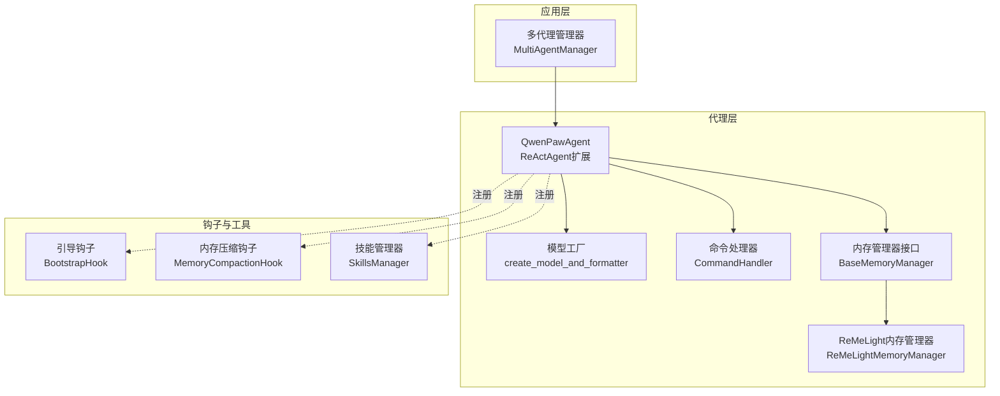
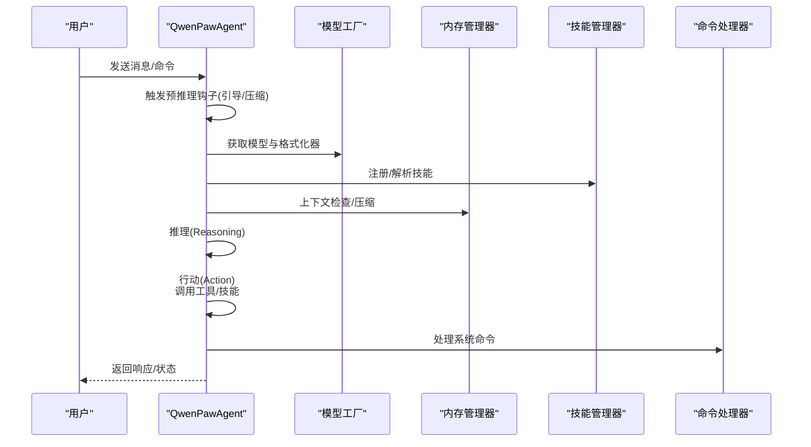
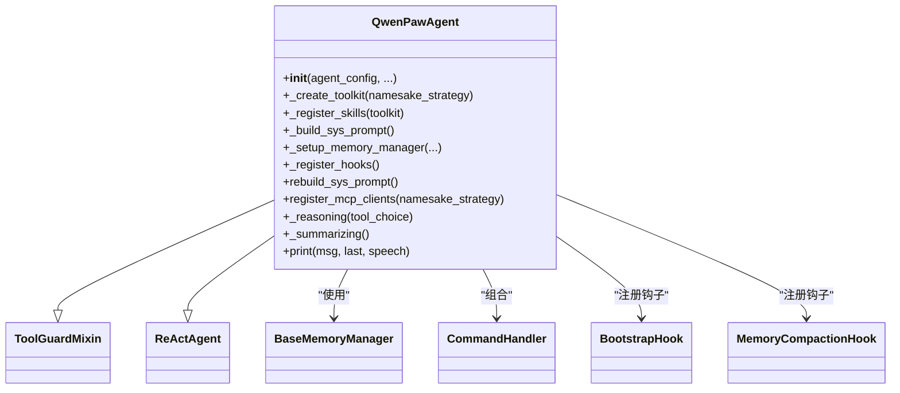
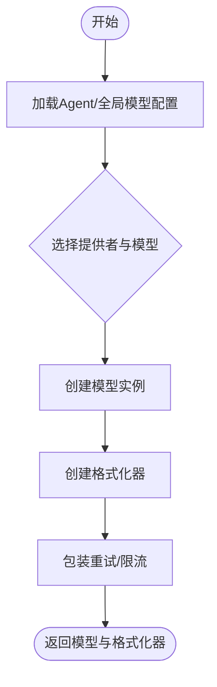
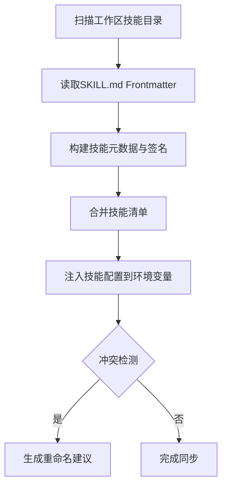
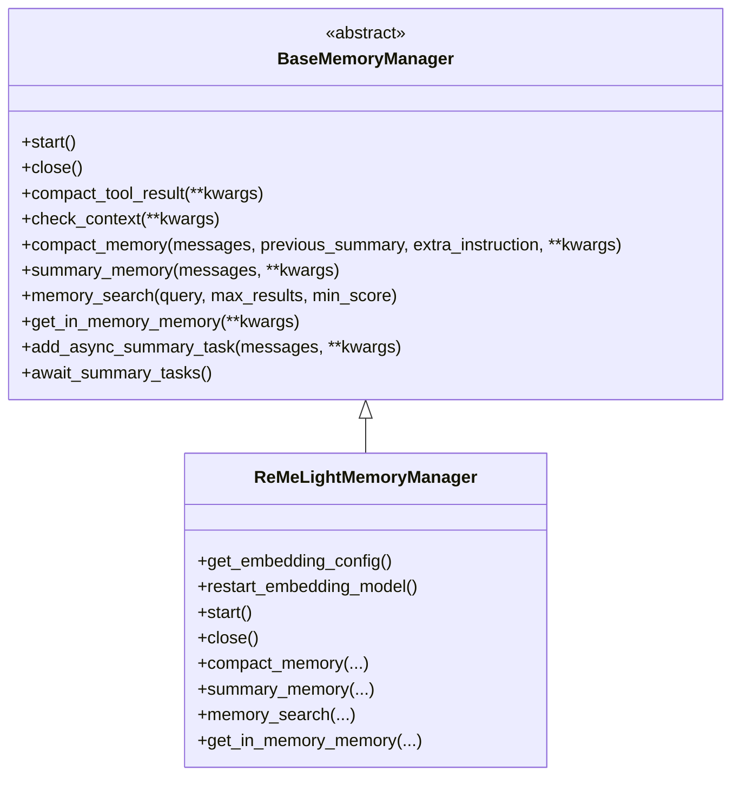
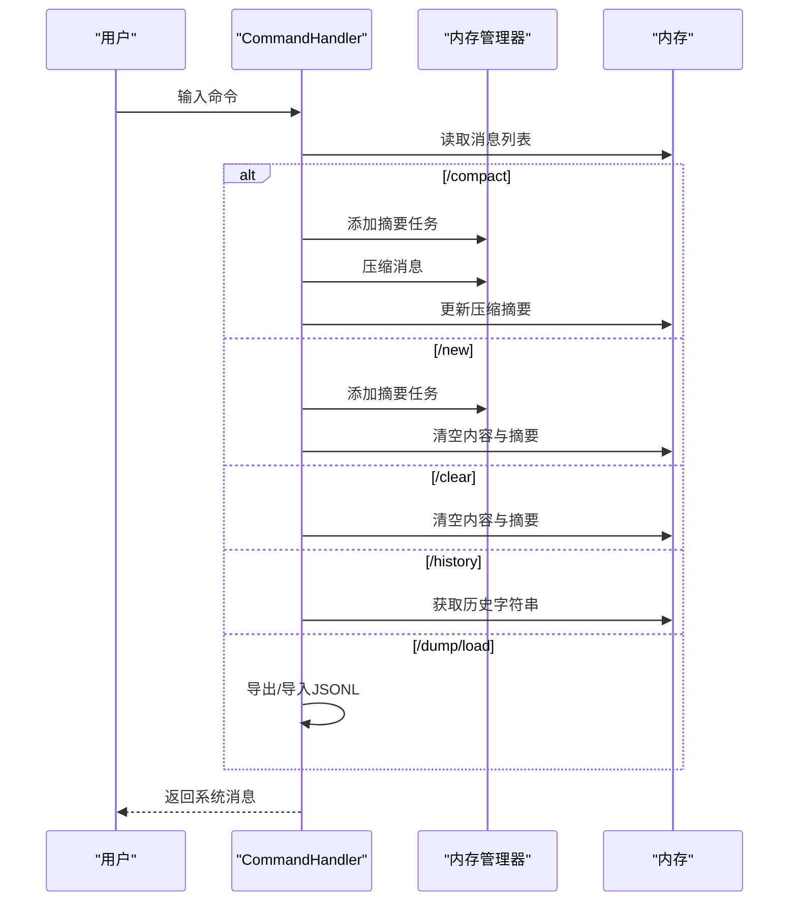
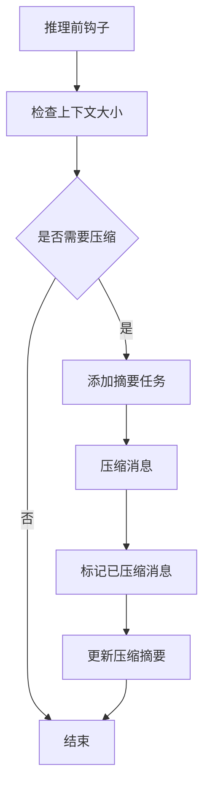
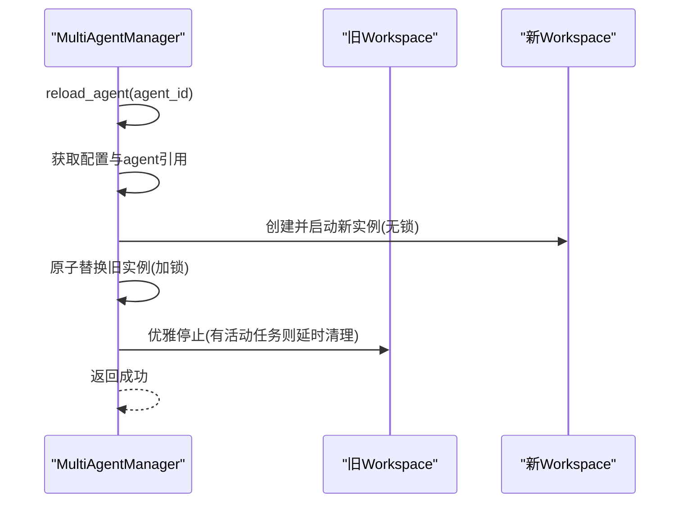
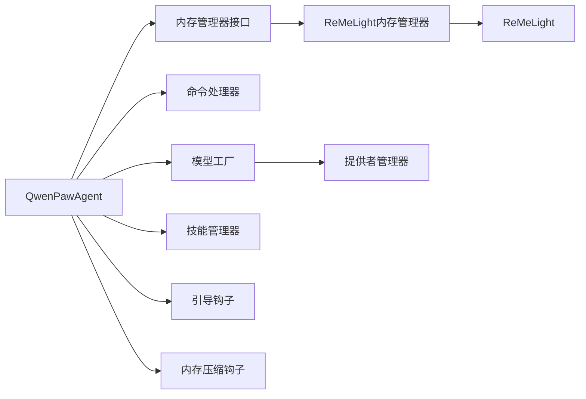

# 代理系统

<cite>
**本文引用的文件**
- [react_agent.py](file://src/qwenpaw/agents/react_agent.py)
- [model_factory.py](file://src/qwenpaw/agents/model_factory.py)
- [skills_manager.py](file://src/qwenpaw/agents/skills_manager.py)
- [base_memory_manager.py](file://src/qwenpaw/agents/memory/base_memory_manager.py)
- [reme_light_memory_manager.py](file://src/qwenpaw/agents/memory/reme_light_memory_manager.py)
- [command_handler.py](file://src/qwenpaw/agents/command_handler.py)
- [bootstrap.py](file://src/qwenpaw/agents/hooks/bootstrap.py)
- [memory_compaction.py](file://src/qwenpaw/agents/hooks/memory_compaction.py)
- [multi_agent_manager.py](file://src/qwenpaw/app/multi_agent_manager.py)
- [__init__.py](file://src/qwenpaw/agents/__init__.py)
</cite>

## 目录
1. [简介](#简介)
2. [项目结构](#项目结构)
3. [核心组件](#核心组件)
4. [架构总览](#架构总览)
5. [详细组件分析](#详细组件分析)
6. [依赖分析](#依赖分析)
7. [性能考虑](#性能考虑)
8. [故障排除指南](#故障排除指南)
9. [结论](#结论)
10. [附录](#附录)

## 简介
本文件面向QwenPaw代理系统，提供从架构到实现细节的全面技术文档。重点覆盖以下主题：
- 代理架构设计：ReAct推理-行动循环、工具与技能集成、内存管理与钩子机制
- 代理生命周期管理：创建、初始化、运行、销毁与热重载
- 多代理协作：集中式管理器、零停机热重载、任务跟踪与清理
- 配置与运行时参数：模型提供者选择、令牌计数、上下文压缩阈值、并发与限流
- 内存管理：自动压缩、摘要生成、向量/全文检索、后台任务
- 工具与技能：内置工具注册、外部MCP客户端集成、技能池与冲突处理
- 通信与任务分配：命令处理器、系统命令、历史导出/导入
- 最佳实践与性能优化：环境变量、缓存、并发控制、错误恢复
- 故障排除：常见问题定位、日志与调试技巧

## 项目结构
QwenPaw代理系统位于Python包src/qwenpaw/agents下，围绕ReActAgent扩展出工具、技能、内存与钩子等能力，并通过应用层的多代理管理器实现多工作空间的生命周期管理。

图示来源
- [react_agent.py:69-182](file://src/qwenpaw/agents/react_agent.py#L69-L182)
- [model_factory.py:698-787](file://src/qwenpaw/agents/model_factory.py#L698-L787)
- [command_handler.py:62-529](file://src/qwenpaw/agents/command_handler.py#L62-L529)
- [base_memory_manager.py:21-226](file://src/qwenpaw/agents/memory/base_memory_manager.py#L21-L226)
- [reme_light_memory_manager.py:38-438](file://src/qwenpaw/agents/memory/reme_light_memory_manager.py#L38-L438)
- [bootstrap.py:20-104](file://src/qwenpaw/agents/hooks/bootstrap.py#L20-L104)
- [memory_compaction.py:27-214](file://src/qwenpaw/agents/hooks/memory_compaction.py#L27-L214)
- [multi_agent_manager.py:21-470](file://src/qwenpaw/app/multi_agent_manager.py#L21-L470)

章节来源
- [react_agent.py:1-1058](file://src/qwenpaw/agents/react_agent.py#L1-L1058)
- [model_factory.py:1-820](file://src/qwenpaw/agents/model_factory.py#L1-L820)
- [multi_agent_manager.py:1-470](file://src/qwenpaw/app/multi_agent_manager.py#L1-L470)

## 核心组件
- QwenPawAgent：基于ReActAgent的主代理类，集成工具、技能、内存管理、钩子与命令处理。
- 模型工厂：根据配置动态创建聊天模型与格式化器，支持重试与速率限制包装。
- 技能管理器：解析工作区技能目录、构建清单、注入环境变量、冲突检测与重命名建议。
- 内存管理器：抽象接口与ReMeLight实现，负责上下文检查、压缩、摘要、搜索与后台任务。
- 命令处理器：处理系统命令（如/compact、/new、/clear、/history等）。
- 钩子：引导钩子与内存压缩钩子在推理前执行，保障首次交互引导与上下文窗口管理。
- 多代理管理器：集中管理多个代理工作空间，支持懒加载、零停机热重载与清理任务追踪。

章节来源
- [react_agent.py:69-800](file://src/qwenpaw/agents/react_agent.py#L69-L800)
- [model_factory.py:698-820](file://src/qwenpaw/agents/model_factory.py#L698-L820)
- [skills_manager.py:1-800](file://src/qwenpaw/agents/skills_manager.py#L1-L800)
- [base_memory_manager.py:21-226](file://src/qwenpaw/agents/memory/base_memory_manager.py#L21-L226)
- [reme_light_memory_manager.py:38-438](file://src/qwenpaw/agents/memory/reme_light_memory_manager.py#L38-L438)
- [command_handler.py:62-530](file://src/qwenpaw/agents/command_handler.py#L62-L530)
- [bootstrap.py:20-104](file://src/qwenpaw/agents/hooks/bootstrap.py#L20-L104)
- [memory_compaction.py:27-214](file://src/qwenpaw/agents/hooks/memory_compaction.py#L27-L214)
- [multi_agent_manager.py:21-470](file://src/qwenpaw/app/multi_agent_manager.py#L21-L470)

## 架构总览
代理系统采用“代理+模型+内存+钩子+命令”的分层设计，配合应用层的多代理管理器实现多工作空间的生命周期管理与零停机热重载。

图示来源
- [react_agent.py:425-454](file://src/qwenpaw/agents/react_agent.py#L425-L454)
- [model_factory.py:698-787](file://src/qwenpaw/agents/model_factory.py#L698-L787)
- [command_handler.py:499-529](file://src/qwenpaw/agents/command_handler.py#L499-L529)
- [memory_compaction.py:62-141](file://src/qwenpaw/agents/hooks/memory_compaction.py#L62-L141)

## 详细组件分析

### QwenPawAgent：ReAct代理与扩展
- 初始化流程
  - 从配置读取运行参数（最大迭代次数、输入长度、上下文压缩阈值等）
  - 创建工具包并注册内置工具（按启用状态与异步执行策略）
  - 动态加载并注册技能（按通道路由与工作区目录）
  - 构建系统提示词（含心跳、记忆提示、多模态提示、环境上下文）
  - 创建模型与格式化器（通过工厂方法）
  - 设置内存管理器（可选），注册内存搜索工具
  - 注册钩子：引导钩子、内存压缩钩子
  - 初始化命令处理器
- 推理与行动
  - 重写推理与总结逻辑，支持多模态媒体块主动剥离与被动回退
  - 支持MCP客户端注册与恢复，增强工具生态
- 生命周期
  - 提供重建系统提示词能力，便于会话状态加载后同步提示

图示来源
- [react_agent.py:69-800](file://src/qwenpaw/agents/react_agent.py#L69-L800)

章节来源
- [react_agent.py:89-182](file://src/qwenpaw/agents/react_agent.py#L89-L182)
- [react_agent.py:183-304](file://src/qwenpaw/agents/react_agent.py#L183-L304)
- [react_agent.py:306-341](file://src/qwenpaw/agents/react_agent.py#L306-L341)
- [react_agent.py:342-388](file://src/qwenpaw/agents/react_agent.py#L342-L388)
- [react_agent.py:390-424](file://src/qwenpaw/agents/react_agent.py#L390-L424)
- [react_agent.py:425-454](file://src/qwenpaw/agents/react_agent.py#L425-L454)
- [react_agent.py:455-477](file://src/qwenpaw/agents/react_agent.py#L455-L477)
- [react_agent.py:478-659](file://src/qwenpaw/agents/react_agent.py#L478-L659)
- [react_agent.py:675-784](file://src/qwenpaw/agents/react_agent.py#L675-L784)
- [react_agent.py:786-800](file://src/qwenpaw/agents/react_agent.py#L786-L800)

### 模型工厂：统一模型与格式化器创建
- 能力
  - 基于Agent或全局配置选择提供者与模型实例
  - 自动选择对应格式化器（兼容OpenAI/Anthropic/Gemini等）
  - 对模型进行令牌用量记录与重试包装，支持并发与速率限制
  - 处理媒体块（图像/视频）格式化差异，确保跨提供者一致性
- 关键点
  - 为不同提供者定制格式化器，处理tool_result中的媒体块
  - 将视频块替换为占位符并在OpenAI兼容场景中恢复
  - 对文件块输出进行字符串化处理，增强工具结果展示

图示来源
- [model_factory.py:698-787](file://src/qwenpaw/agents/model_factory.py#L698-L787)

章节来源
- [model_factory.py:698-820](file://src/qwenpaw/agents/model_factory.py#L698-L820)

### 技能管理器：工作区技能同步与注册
- 能力
  - 解析工作区技能目录，构建技能清单与签名
  - 注入技能配置到环境变量，按需校验与警告缺失项
  - 冲突检测与重命名建议，避免同名冲突
  - 支持内置技能与自定义技能分类与保留策略
- 关键点
  - 使用文件锁保证清单写入的原子性
  - 支持ZIP导入与安全路径校验
  - 通过frontmatter提取元数据（名称、描述、版本）

图示来源
- [skills_manager.py:1-800](file://src/qwenpaw/agents/skills_manager.py#L1-L800)

章节来源
- [skills_manager.py:120-170](file://src/qwenpaw/agents/skills_manager.py#L120-L170)
- [skills_manager.py:673-718](file://src/qwenpaw/agents/skills_manager.py#L673-L718)

### 内存管理器：上下文压缩与摘要
- 接口
  - 启动/关闭、上下文检查、工具结果压缩、消息压缩、摘要生成、搜索、内存对象获取
  - 异步摘要任务队列与等待完成
- 实现
  - ReMeLightMemoryManager封装ReMeLight，提供向量化/全文检索、嵌入模型重启、压缩比率与思考块控制
  - 与模型工厂协作，使用当前Agent配置的模型与格式化器
  - 记录无效压缩结果并保存诊断文件

图示来源
- [base_memory_manager.py:21-226](file://src/qwenpaw/agents/memory/base_memory_manager.py#L21-L226)
- [reme_light_memory_manager.py:38-438](file://src/qwenpaw/agents/memory/reme_light_memory_manager.py#L38-L438)

章节来源
- [base_memory_manager.py:21-226](file://src/qwenpaw/agents/memory/base_memory_manager.py#L21-L226)
- [reme_light_memory_manager.py:267-438](file://src/qwenpaw/agents/memory/reme_light_memory_manager.py#L267-L438)

### 命令处理器：系统命令与历史管理
- 支持命令
  - /compact、/new、/clear、/history、/compact_str、/await_summary、/message、/dump_history、/load_history、/long_term_memory
- 能力
  - 执行上下文压缩、开启新对话、清空历史、查看历史、等待摘要任务、导出/导入历史、查看长期记忆
  - 与内存管理器协作，触发后台摘要任务

图示来源
- [command_handler.py:499-529](file://src/qwenpaw/agents/command_handler.py#L499-L529)

章节来源
- [command_handler.py:62-530](file://src/qwenpaw/agents/command_handler.py#L62-L530)

### 钩子：引导与上下文压缩
- 引导钩子
  - 在首次用户交互时检查BOOTSTRAP.md并前置引导内容，仅触发一次
- 内存压缩钩子
  - 在推理前检查上下文大小，必要时对旧消息进行压缩与摘要更新，支持工具结果压缩与保留策略

图示来源
- [memory_compaction.py:62-198](file://src/qwenpaw/agents/hooks/memory_compaction.py#L62-L198)
- [bootstrap.py:42-104](file://src/qwenpaw/agents/hooks/bootstrap.py#L42-L104)

章节来源
- [memory_compaction.py:27-214](file://src/qwenpaw/agents/hooks/memory_compaction.py#L27-L214)
- [bootstrap.py:20-104](file://src/qwenpaw/agents/hooks/bootstrap.py#L20-L104)

### 多代理管理器：零停机热重载与生命周期
- 能力
  - 懒加载：按需创建与启动工作空间
  - 零停机重载：创建新实例、原子替换、优雅停止旧实例（有/无活动任务）
  - 并发启动：批量启动已启用代理
  - 清理任务：取消与等待后台清理任务
- 关键点
  - 锁粒度最小化，仅在实例替换阶段持有锁
  - 通过任务跟踪器检测活动任务，避免中断正在进行的任务

图示来源
- [multi_agent_manager.py:208-319](file://src/qwenpaw/app/multi_agent_manager.py#L208-L319)

章节来源
- [multi_agent_manager.py:21-470](file://src/qwenpaw/app/multi_agent_manager.py#L21-L470)

## 依赖分析
- 组件耦合
  - QwenPawAgent依赖模型工厂、技能管理器、内存管理器与命令处理器
  - 内存管理器通过接口解耦具体实现（ReMeLight）
  - 钩子以插件形式注册，降低侵入性
- 外部依赖
  - 提供者管理器（ProviderManager）用于模型实例化
  - ReMeLight用于向量化/全文检索与内存存储
  - AgentScope框架（ReActAgent、Toolkit、Msg等）

图示来源
- [react_agent.py:14-58](file://src/qwenpaw/agents/react_agent.py#L14-L58)
- [model_factory.py:38-44](file://src/qwenpaw/agents/model_factory.py#L38-L44)
- [reme_light_memory_manager.py:94-135](file://src/qwenpaw/agents/memory/reme_light_memory_manager.py#L94-L135)

章节来源
- [react_agent.py:14-58](file://src/qwenpaw/agents/react_agent.py#L14-L58)
- [model_factory.py:38-44](file://src/qwenpaw/agents/model_factory.py#L38-L44)
- [reme_light_memory_manager.py:94-135](file://src/qwenpaw/agents/memory/reme_light_memory_manager.py#L94-L135)

## 性能考虑
- 模型与格式化器
  - 使用重试与速率限制包装，减少瞬时错误影响
  - 按提供者定制格式化器，避免不必要的API错误
- 内存与上下文
  - 合理设置上下文压缩阈值与保留数量，平衡精度与成本
  - 启用工具结果压缩，降低大输出带来的上下文膨胀
- 并发与资源
  - 控制并发请求与QPM，避免触发限流
  - 使用异步摘要任务，避免阻塞主线程
- 缓存与版本
  - 嵌入模型缓存与维度配置可提升检索效率
  - ReMe版本与后端选择影响性能与稳定性

## 故障排除指南
- 模型相关
  - 未配置有效模型：检查全局或Agent特定模型配置
  - 提供者不可用：确认提供者ID存在且模型可用
- 媒体块与格式化
  - 多模态模型能力标记不准确：遇到媒体块拒绝时，检查模型能力标识
  - 工具结果包含文件块：格式化器具备文件块字符串化能力
- 内存与上下文
  - 压缩失败：查看日志并检查上下文长度与阈值设置
  - 无效压缩结果：系统会保存诊断文件，便于定位问题
- 技能与环境
  - 技能冲突：使用重命名建议或调整技能目录
  - 环境变量缺失：根据要求字段进行注入或在配置中补齐
- 多代理管理
  - 重载失败：检查新实例启动异常与旧实例清理任务
  - 清理任务堆积：调用取消所有清理任务或等待其完成

章节来源
- [model_factory.py:750-787](file://src/qwenpaw/agents/model_factory.py#L750-L787)
- [reme_light_memory_manager.py:348-378](file://src/qwenpaw/agents/memory/reme_light_memory_manager.py#L348-L378)
- [skills_manager.py:778-798](file://src/qwenpaw/agents/skills_manager.py#L778-L798)
- [multi_agent_manager.py:282-296](file://src/qwenpaw/app/multi_agent_manager.py#L282-L296)

## 结论
QwenPaw代理系统通过ReAct框架与工具/技能/内存/钩子的深度集成，提供了可扩展、可观测、可维护的智能体平台。配合多代理管理器的零停机热重载与完善的命令体系，能够在生产环境中稳定运行并持续演进。

## 附录
- 代理创建与初始化要点
  - 通过工厂方法创建模型与格式化器，确保提供者与模型配置正确
  - 启用内存管理器并注册内存搜索工具，提升检索与摘要能力
  - 注册钩子与命令处理器，完善首次交互与系统命令支持
- 运行与销毁
  - 使用命令处理器执行/compact、/new、/clear等操作
  - 通过多代理管理器进行零停机重载与优雅停止
- 最佳实践
  - 合理设置上下文压缩阈值与保留策略
  - 使用异步摘要任务与后台清理，避免阻塞
  - 通过环境变量注入技能配置，保持灵活性
  - 定期导出历史以便问题排查与审计