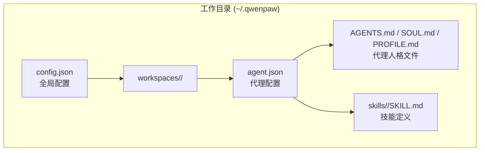
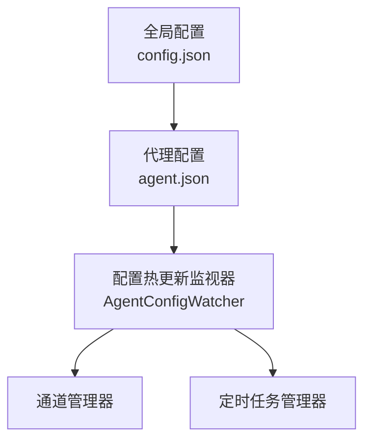
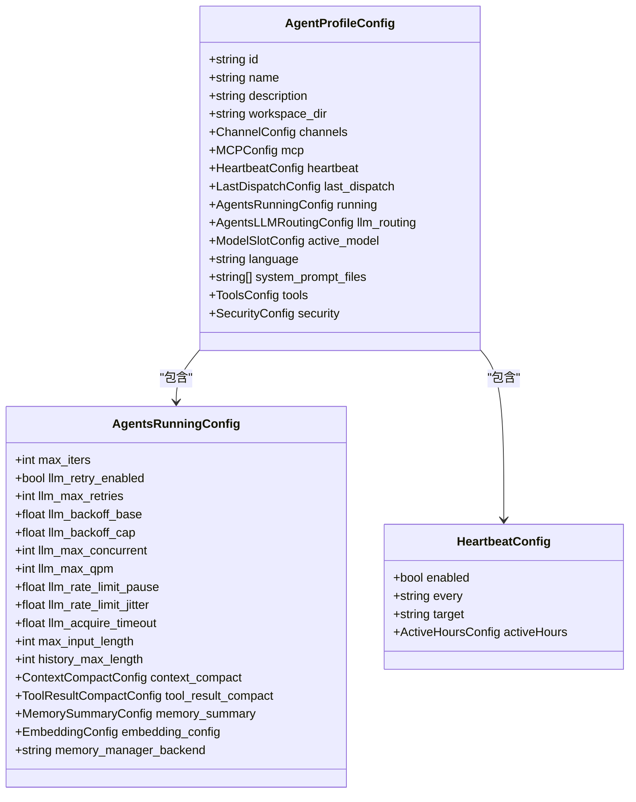
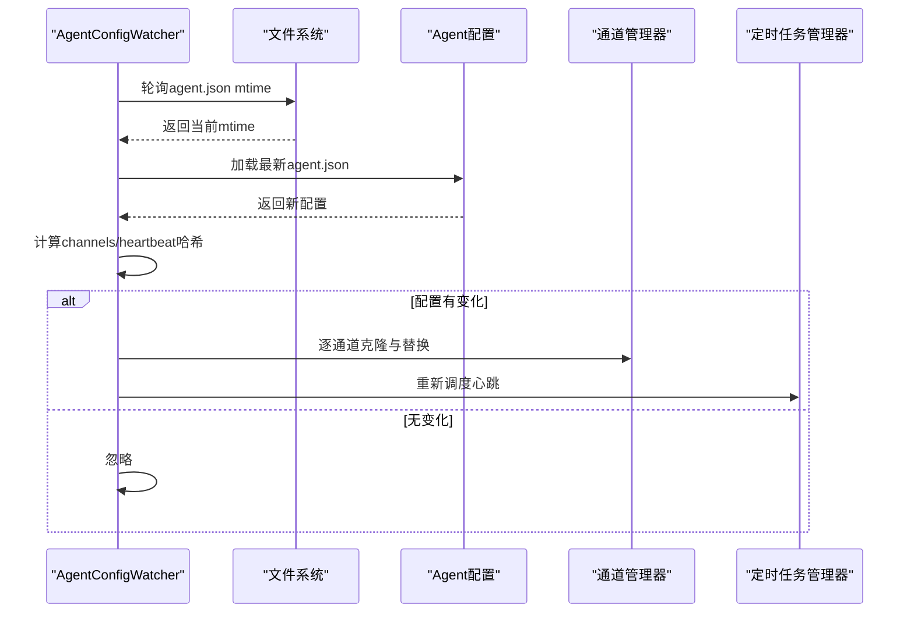
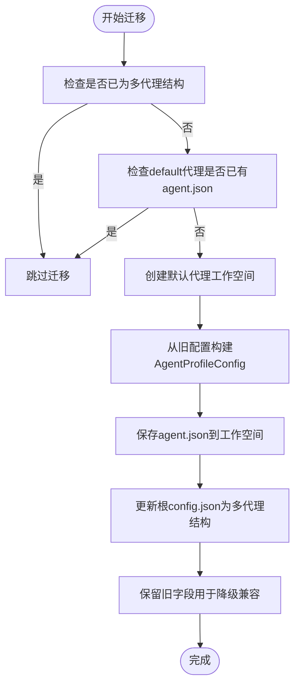
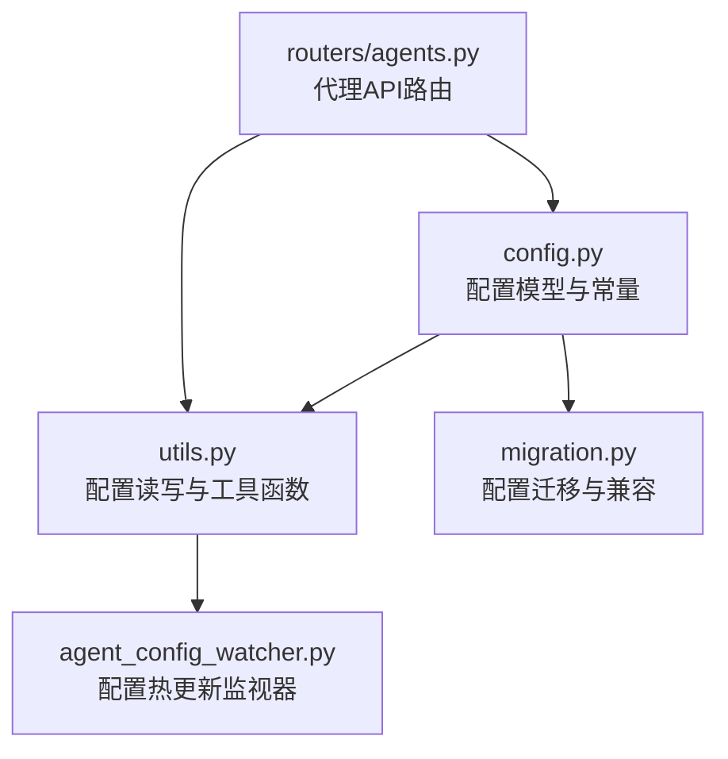

# 代理配置管理

<cite>
**本文档引用的文件**
- [config.py](file://src/qwenpaw/config/config.py)
- [utils.py](file://src/qwenpaw/config/utils.py)
- [agent_config_watcher.py](file://src/qwenpaw/app/agent_config_watcher.py)
- [migration.py](file://src/qwenpaw/app/migration.py)
- [agents.py](file://src/qwenpaw/app/routers/agents.py)
- [__init__.py](file://src/qwenpaw/config/__init__.py)
- [config.en.md](file://website/public/docs/config.en.md)
- [AGENTS.md](file://src/qwenpaw/agents/md_files/en/AGENTS.md)
- [SOUL.md](file://src/qwenpaw/agents/md_files/en/SOUL.md)
- [PROFILE.md](file://src/qwenpaw/agents/md_files/en/PROFILE.md)
- [HEARTBEAT.md](file://src/qwenpaw/agents/md_files/en/HEARTBEAT.md)
</cite>

## 目录
1. [简介](#简介)
2. [项目结构](#项目结构)
3. [核心组件](#核心组件)
4. [架构总览](#架构总览)
5. [详细组件分析](#详细组件分析)
6. [依赖关系分析](#依赖关系分析)
7. [性能考虑](#性能考虑)
8. [故障排除指南](#故障排除指南)
9. [结论](#结论)
10. [附录](#附录)

## 简介
本文件面向QwenPaw代理配置管理系统，系统性阐述代理配置的层次结构、配置文件格式与参数验证机制，详解AgentProfileConfig数据结构、配置项含义与默认值设定；说明运行时配置、工具配置、内存配置与技能配置的管理方式；解释配置加载顺序、优先级规则与覆盖机制；涵盖配置热更新、配置迁移与版本兼容性处理；并提供配置模板、最佳实践与常见配置场景示例，帮助用户正确配置与管理代理实例。

## 项目结构
QwenPaw采用“全局配置 + 多代理独立配置”的双层架构：
- 全局配置（config.json）：模型提供商、环境变量、代理列表等全局共享设置
- 代理配置（agent.json）：每个代理独立的工作空间内，包含通道、心跳、工具、MCP、安全策略等完整配置

图表来源
- [config.en.md:16-80](file://website/public/docs/config.en.md#L16-L80)
- [config.en.md:140-205](file://website/public/docs/config.en.md#L140-L205)

章节来源
- [config.en.md:16-80](file://website/public/docs/config.en.md#L16-L80)
- [config.en.md:140-205](file://website/public/docs/config.en.md#L140-L205)

## 核心组件
本节聚焦配置模型与关键组件，包括配置类定义、默认值、校验逻辑与工具函数。

- 配置模型与字段
  - 全局配置：包含agents.active_agent、agents.profiles、last_api、show_tool_details、user_timezone、last_dispatch等
  - 代理配置：包含id、name、description、workspace_dir、channels、mcp、heartbeat、running、llm_routing、active_model、language、system_prompt_files、tools、security、last_dispatch等
  - 运行时配置：控制最大迭代次数、LLM重试与限流、上下文压缩、工具结果压缩、内存摘要、嵌入向量化等
  - 内存配置：支持remelight后端、摘要开关、强制检索、索引重建策略、嵌入配置等
  - 安全配置：ToolGuard、FileGuard、SkillScanner三道防线

- 默认值与校验
  - 运行时配置中对llm_backoff_cap与llm_backoff_base进行关系校验，确保cap≥base
  - system_prompt_files默认包含["AGENTS.md", "SOUL.md", "PROFILE.md"]
  - language默认"zh"

- 工具函数
  - load_config()/save_config()：读写config.json，具备自动修复与备份能力
  - load_agent_config()/save_agent_config()：读写agent.json，支持回退兼容
  - get_heartbeat_config()：按代理或默认返回心跳配置
  - get_available_channels()：基于环境变量过滤可用通道

章节来源
- [config.py:671-730](file://src/qwenpaw/config/config.py#L671-L730)
- [config.py:471-624](file://src/qwenpaw/config/config.py#L471-L624)
- [config.py:278-469](file://src/qwenpaw/config/config.py#L278-L469)
- [config.py:260-272](file://src/qwenpaw/config/config.py#L260-L272)
- [config.py:226-246](file://src/qwenpaw/config/config.py#L226-L246)
- [utils.py:491-531](file://src/qwenpaw/config/utils.py#L491-L531)
- [utils.py:547-570](file://src/qwenpaw/config/utils.py#L547-L570)
- [utils.py:343-371](file://src/qwenpaw/config/utils.py#L343-L371)

## 架构总览
下图展示配置系统的整体交互：全局配置驱动多代理实例，代理配置独立持久化，热更新监视器实时检测agent.json变更并应用到运行时组件。

图表来源
- [agent_config_watcher.py:35-95](file://src/qwenpaw/app/agent_config_watcher.py#L35-L95)
- [config.en.md:140-205](file://website/public/docs/config.en.md#L140-L205)

章节来源
- [agent_config_watcher.py:35-95](file://src/qwenpaw/app/agent_config_watcher.py#L35-L95)
- [config.en.md:140-205](file://website/public/docs/config.en.md#L140-L205)

## 详细组件分析

### AgentProfileConfig 数据结构与配置项
AgentProfileConfig是代理的完整配置载体，位于每个代理工作空间的agent.json中，字段覆盖通道、心跳、运行时、LLM路由、活跃模型、语言与人格文件、工具、安全策略与最后分发目标等。

图表来源
- [config.py:671-730](file://src/qwenpaw/config/config.py#L671-L730)
- [config.py:471-624](file://src/qwenpaw/config/config.py#L471-L624)
- [config.py:260-272](file://src/qwenpaw/config/config.py#L260-L272)

章节来源
- [config.py:671-730](file://src/qwenpaw/config/config.py#L671-L730)
- [config.py:471-624](file://src/qwenpaw/config/config.py#L471-L624)
- [config.py:260-272](file://src/qwenpaw/config/config.py#L260-L272)

### 配置加载与优先级规则
- 加载顺序
  1) 读取全局config.json（默认路径~/.qwenpaw/config.json）
  2) 按需读取代理agent.json（默认路径~/.qwenpaw/workspaces/{agent_id}/agent.json）
  3) 对于旧版单代理配置，系统会自动迁移至多代理结构，并保留原字段以保证降级兼容

- 优先级规则
  - 代理独立配置（agent.json）优先于全局配置（config.json）
  - 当同一字段同时存在于两者时，系统使用agent.json中的值
  - 旧版遗留字段在全局config.json中仍保留默认值，以便降级兼容

- 回退与兼容
  - 若agent.json不存在，系统尝试从全局配置继承相应字段
  - 若全局配置损坏，系统会自动修复或回退到默认配置，并备份原始文件

章节来源
- [config.en.md:199-201](file://website/public/docs/config.en.md#L199-L201)
- [utils.py:491-531](file://src/qwenpaw/config/utils.py#L491-L531)
- [config.py:1220-1266](file://src/qwenpaw/config/config.py#L1220-L1266)

### 配置热更新机制
AgentConfigWatcher通过轮询agent.json的修改时间，检测到变更后对比通道与心跳配置哈希，增量应用到运行时组件，实现无需重启的服务热更新。

图表来源
- [agent_config_watcher.py:240-278](file://src/qwenpaw/app/agent_config_watcher.py#L240-L278)
- [agent_config_watcher.py:178-217](file://src/qwenpaw/app/agent_config_watcher.py#L178-L217)

章节来源
- [agent_config_watcher.py:240-278](file://src/qwenpaw/app/agent_config_watcher.py#L240-L278)
- [agent_config_watcher.py:178-217](file://src/qwenpaw/app/agent_config_watcher.py#L178-L217)

### 配置迁移与版本兼容
系统提供从旧版单代理配置到新版多代理结构的迁移流程，确保升级过程平滑且可逆：

图表来源
- [migration.py:80-226](file://src/qwenpaw/app/migration.py#L80-L226)

章节来源
- [migration.py:80-226](file://src/qwenpaw/app/migration.py#L80-L226)

### 运行时配置管理
运行时配置（AgentsRunningConfig）控制推理-行动迭代次数、LLM重试与限流、上下文压缩、工具结果压缩、内存摘要与嵌入向量化等。其字段具有严格的范围约束与默认值，确保系统稳定运行。

- 关键字段与默认值
  - max_iters：默认100，最小1
  - llm_retry_enabled：默认启用
  - llm_max_retries：默认3，最小1
  - llm_backoff_base/cap：默认1.0/10.0，cap必须≥base
  - llm_max_concurrent：默认10，共享于所有代理
  - llm_max_qpm：默认600，0表示不限制
  - llm_rate_limit_pause/jitter：默认5.0/1.0
  - llm_acquire_timeout：默认300.0
  - max_input_length：默认131072（128K），最小1000
  - history_max_length：默认10000
  - context_compact.memory_compact_ratio：默认0.75
  - context_compact.memory_reserve_ratio：默认0.1
  - tool_result_compact.recent_max_bytes：默认50000
  - memory_summary.force_min_score：默认0.3
  - embedding_config.dimensions：默认1024

- 属性计算
  - memory_compact_reserve：基于max_input_length与reserve_ratio计算
  - memory_compact_threshold：基于max_input_length与compact_ratio计算

章节来源
- [config.py:471-624](file://src/qwenpaw/config/config.py#L471-L624)

### 工具配置与安全配置
- 工具配置（ToolsConfig）
  - 控制内置工具的启用/禁用、是否展示给用户、是否异步执行等
  - 可通过控制台或直接编辑agent.json管理

- 安全配置（SecurityConfig）
  - ToolGuard：运行时检测危险命令与注入攻击
  - FileGuard：保护敏感文件访问
  - SkillScanner：启用前扫描技能中的恶意代码
  - 可通过控制台或直接编辑agent.json管理

章节来源
- [config.en.md:484-505](file://website/public/docs/config.en.md#L484-L505)
- [config.py:671-730](file://src/qwenpaw/config/config.py#L671-L730)

### 内存配置与技能配置
- 内存配置（MemorySummaryConfig、EmbeddingConfig）
  - memory_summary：控制是否在压缩时生成摘要、是否强制每次对话都检索、强制检索阈值与最小相关度、启动时是否重建索引
  - embedding_config：控制嵌入后端、API密钥、基础URL、模型名、维度、缓存大小、输入长度与批处理大小

- 技能配置（skills/ 与 skill.json）
  - 技能目录：workspaces/{agent_id}/skills/ 为代理本地技能池
  - 技能元数据：由SKILL.md的YAML前言与references/scripts组织
  - 启用状态：由skill.json记录，支持启用/禁用与渠道路由

章节来源
- [config.py:409-469](file://src/qwenpaw/config/config.py#L409-L469)
- [config.py:278-311](file://src/qwenpaw/config/config.py#L278-L311)
- [config.en.md:596-616](file://website/public/docs/config.en.md#L596-L616)

### 代理人格文件与系统提示
- 人格文件（AGENTS.md、SOUL.md、PROFILE.md）
  - AGENTS.md：包含记忆、安全、外部/内部边界、反应式行为、工具使用指导与心跳说明
  - SOUL.md：定义核心真理、边界、气质与连续性
  - PROFILE.md：记录身份、 Creature、Vibe 以及用户画像与上下文
- system_prompt_files字段控制这些文件被加载到系统提示中，形成代理行为与个性的基础

章节来源
- [AGENTS.md:1-142](file://src/qwenpaw/agents/md_files/en/AGENTS.md#L1-L142)
- [SOUL.md:1-41](file://src/qwenpaw/agents/md_files/en/SOUL.md#L1-L41)
- [PROFILE.md:1-31](file://src/qwenpaw/agents/md_files/en/PROFILE.md#L1-L31)
- [config.py:718-721](file://src/qwenpaw/config/config.py#L718-L721)

## 依赖关系分析
配置模块之间的依赖关系如下：

图表来源
- [__init__.py:2-24](file://src/qwenpaw/config/__init__.py#L2-L24)
- [utils.py:29-36](file://src/qwenpaw/config/utils.py#L29-L36)
- [agent_config_watcher.py:16-20](file://src/qwenpaw/app/agent_config_watcher.py#L16-L20)
- [agents.py:218-258](file://src/qwenpaw/app/routers/agents.py#L218-L258)

章节来源
- [__init__.py:2-24](file://src/qwenpaw/config/__init__.py#L2-L24)
- [utils.py:29-36](file://src/qwenpaw/config/utils.py#L29-L36)
- [agent_config_watcher.py:16-20](file://src/qwenpaw/app/agent_config_watcher.py#L16-L20)
- [agents.py:218-258](file://src/qwenpaw/app/routers/agents.py#L218-L258)

## 性能考虑
- 上下文压缩与保留
  - memory_compact_ratio与memory_reserve_ratio共同决定触发压缩的阈值与保留比例，避免频繁压缩带来的开销
  - compact_with_thinking_block影响压缩时是否包含思考块，平衡精度与性能
- 工具结果压缩
  - recent_n、old_max_bytes、recent_max_bytes与retention_days控制工具输出的压缩与保留策略，减少历史冗余
- 嵌入向量化
  - enable_cache与max_cache_size提升检索性能；use_dimensions与dimensions允许自定义向量维度
  - max_input_length与max_batch_size影响嵌入处理吞吐与延迟
- LLM限流与重试
  - llm_max_concurrent与llm_max_qpm限制并发与QPM，降低429错误概率
  - llm_backoff_base/cap与jitter避免惊群效应，提高稳定性

[本节为通用性能建议，不直接分析具体文件]

## 故障排除指南
- 配置损坏与自动修复
  - load_config()在解析失败时尝试移除导致错误的字段并回退到默认配置，同时备份原始文件
  - save_config()采用原子写入策略，防止配置损坏

- 热更新失败
  - AgentConfigWatcher在通道替换失败时会回滚到旧配置，确保系统稳定
  - 若心跳调度失败，日志会记录异常并继续维持原有调度

- 迁移失败
  - migrate_legacy_workspace_to_default_agent()捕获异常并记录详细信息，避免中断启动流程
  - ensure_default_agent_exists()与ensure_qa_agent_exists()负责在启动时补齐缺失的代理与QA代理

章节来源
- [utils.py:436-531](file://src/qwenpaw/config/utils.py#L436-L531)
- [agent_config_watcher.py:149-177](file://src/qwenpaw/app/agent_config_watcher.py#L149-L177)
- [migration.py:54-78](file://src/qwenpaw/app/migration.py#L54-L78)

## 结论
QwenPaw的代理配置管理通过清晰的双层架构、严格的默认值与校验、完善的热更新与迁移机制，实现了高可用、易维护与强扩展性的代理配置体系。用户可通过控制台或直接编辑配置文件进行管理，系统在保证功能强大的同时兼顾了安全性与稳定性。

[本节为总结性内容，不直接分析具体文件]

## 附录

### 配置模板与最佳实践
- 全局配置模板（config.json）
  - 包含agents.active_agent、agents.profiles、last_api、show_tool_details、user_timezone、last_dispatch等字段
  - 推荐将全局配置作为“默认模板”，在各代理的agent.json中覆盖差异化配置

- 代理配置模板（agent.json）
  - channels：按需启用通道并配置特定参数
  - mcp：连接外部服务（如文件系统、Git、SQLite等）
  - heartbeat：按需启用并设置间隔与目标
  - running：根据业务负载调整max_iters、llm_max_concurrent、max_input_length等
  - tools：精细化控制内置工具的启用与可见性
  - security：开启ToolGuard、FileGuard与SkillScanner，必要时自定义规则
  - system_prompt_files：选择性加载人格文件，形成稳定的系统提示

- 最佳实践
  - 将全局配置视为“基线”，代理配置用于“个性化”
  - 使用热更新监视器进行灰度发布与快速回滚
  - 在生产环境启用ToolGuard与SkillScanner，定期扫描技能
  - 合理设置上下文压缩与工具结果压缩，平衡性能与准确性
  - 通过迁移工具平滑升级至多代理结构，保留旧字段以支持降级

章节来源
- [config.en.md:146-205](file://website/public/docs/config.en.md#L146-L205)
- [config.en.md:206-278](file://website/public/docs/config.en.md#L206-L278)
- [config.en.md:346-434](file://website/public/docs/config.en.md#L346-L434)
- [config.en.md:484-505](file://website/public/docs/config.en.md#L484-L505)