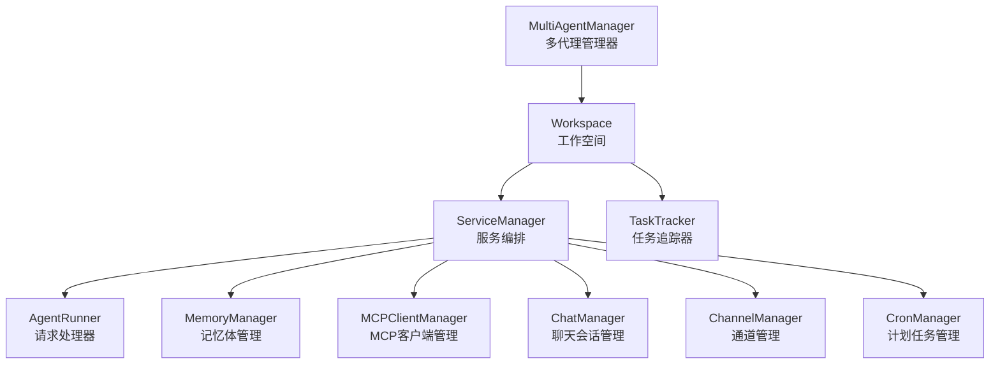
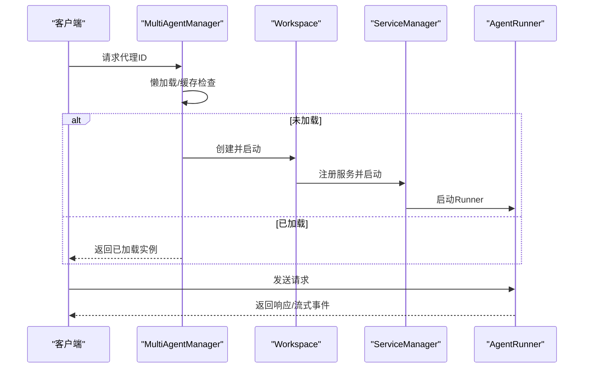
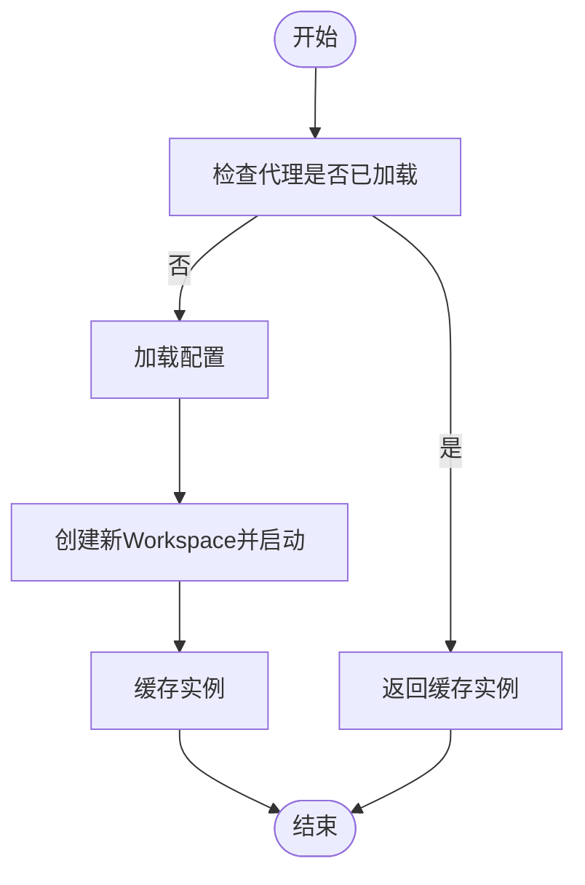
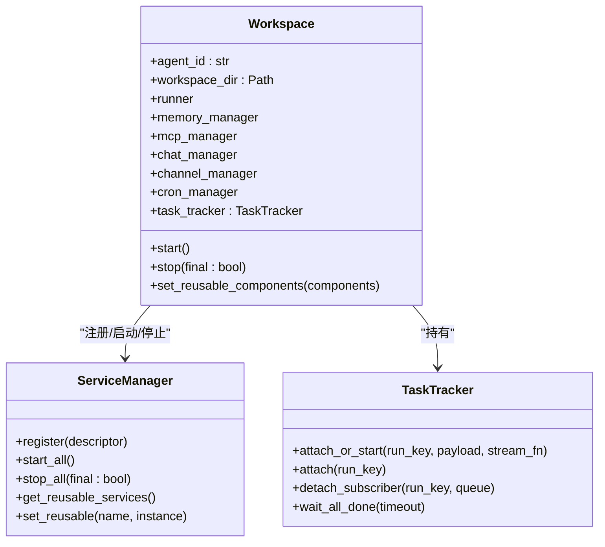
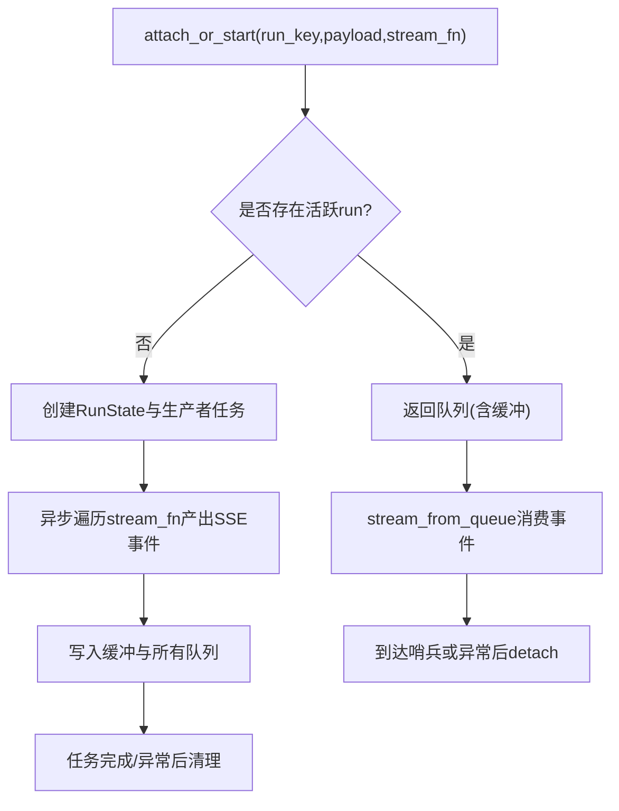
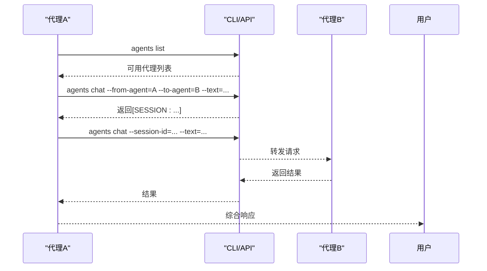
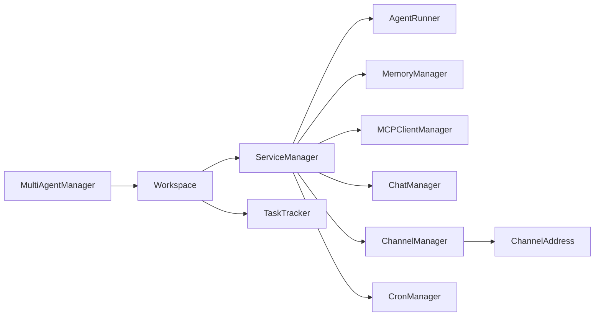

# 多代理协作

<cite>
**本文引用的文件**
- [multi_agent_manager.py](file://src/qwenpaw/app/multi_agent_manager.py)
- [workspace.py](file://src/qwenpaw/app/workspace/workspace.py)
- [service_manager.py](file://src/qwenpaw/app/workspace/service_manager.py)
- [task_tracker.py](file://src/qwenpaw/app/runner/task_tracker.py)
- [SKILL.md](file://src/qwenpaw/agents/skills/multi_agent_collaboration/SKILL.md)
- [multi-agent.en.md](file://website/public/docs/multi-agent.en.md)
- [manager.py](file://src/qwenpaw/app/runner/manager.py)
- [agent.py](file://src/qwenpaw/app/routers/agent.py)
- [rate_limiter.py](file://src/qwenpaw/providers/rate_limiter.py)
- [runner.py](file://src/qwenpaw/app/runner/runner.py)
- [schema.py](file://src/qwenpaw/app/channels/schema.py)
</cite>

## 目录
1. [简介](#简介)
2. [项目结构](#项目结构)
3. [核心组件](#核心组件)
4. [架构总览](#架构总览)
5. [详细组件分析](#详细组件分析)
6. [依赖关系分析](#依赖关系分析)
7. [性能考量](#性能考量)
8. [故障排查指南](#故障排查指南)
9. [结论](#结论)
10. [附录](#附录)

## 简介
本文件面向QwenPaw多代理协作系统，系统性阐述多代理架构设计、代理间通信协议与任务分配策略，深入解析MultiAgentManager的实现原理、代理生命周期管理与协调机制，并详细说明代理间任务分解、结果聚合与冲突解决机制，以及消息传递、状态同步与资源管理策略。文档还提供多代理场景下的性能优化、错误处理与监控策略，并给出可直接参考的代码片段路径，帮助开发者构建复杂的多代理应用场景。

## 项目结构
多代理协作由三层协同构成：
- 顶层协调层：MultiAgentManager负责多实例的懒加载、零停机热重载、生命周期管理与并发安全。
- 工作空间层：Workspace封装单个代理的完整运行时，统一注册与启动/停止服务，支持可复用组件的热迁移。
- 服务编排层：ServiceManager以声明式描述注册服务，按优先级与并发策略启动/停止，支持依赖与重用。

图表来源
- [multi_agent_manager.py:21-470](file://src/qwenpaw/app/multi_agent_manager.py#L21-L470)
- [workspace.py:47-389](file://src/qwenpaw/app/workspace/workspace.py#L47-L389)
- [service_manager.py:74-421](file://src/qwenpaw/app/workspace/service_manager.py#L74-L421)

章节来源
- [multi_agent_manager.py:1-470](file://src/qwenpaw/app/multi_agent_manager.py#L1-L470)
- [workspace.py:1-389](file://src/qwenpaw/app/workspace/workspace.py#L1-L389)
- [service_manager.py:1-421](file://src/qwenpaw/app/workspace/service_manager.py#L1-L421)

## 核心组件
- MultiAgentManager：集中管理多个Workspace实例，提供懒加载、零停机热重载、并发安全与后台清理任务管理。
- Workspace：单个代理的独立运行时，统一注册与启动/停止服务，支持可复用组件的热迁移。
- ServiceManager：以ServiceDescriptor声明式注册服务，按优先级与并发策略启动/停止，支持依赖与重用。
- TaskTracker：跟踪后台任务（如流式SSE），支持订阅、缓冲与优雅取消，保障重连与状态一致性。
- 多代理协作技能：定义跨代理调用的触发条件、会话复用、后台任务模式与状态查询策略。

章节来源
- [multi_agent_manager.py:21-470](file://src/qwenpaw/app/multi_agent_manager.py#L21-L470)
- [workspace.py:47-389](file://src/qwenpaw/app/workspace/workspace.py#L47-L389)
- [service_manager.py:30-421](file://src/qwenpaw/app/workspace/service_manager.py#L30-L421)
- [task_tracker.py:30-231](file://src/qwenpaw/app/runner/task_tracker.py#L30-L231)
- [SKILL.md:1-477](file://src/qwenpaw/agents/skills/multi_agent_collaboration/SKILL.md#L1-L477)

## 架构总览
多代理协作采用“顶层协调 + 工作空间 + 服务编排”的分层架构。MultiAgentManager作为顶层协调器，按需创建与启动Workspace；Workspace通过ServiceManager统一管理Runner、Memory、MCP、Chat、Channel、Cron等服务；TaskTracker贯穿后台任务与流式输出，保证状态同步与资源回收。

图表来源
- [multi_agent_manager.py:38-90](file://src/qwenpaw/app/multi_agent_manager.py#L38-L90)
- [workspace.py:322-380](file://src/qwenpaw/app/workspace/workspace.py#L322-L380)
- [service_manager.py:171-229](file://src/qwenpaw/app/workspace/service_manager.py#L171-L229)
- [runner.py:559-594](file://src/qwenpaw/app/runner/runner.py#L559-L594)

## 详细组件分析

### MultiAgentManager：多代理管理器
- 懒加载与缓存：首次访问时读取配置并创建Workspace，随后缓存以供复用。
- 零停机热重载：创建新实例（不持锁）、原子替换旧实例（短时持锁）、后台优雅停止旧实例。
- 并发安全：全局异步锁保护实例字典与替换过程，避免竞态。
- 生命周期管理：支持停止单个代理、批量启动已启用代理、关闭时取消并等待后台清理任务。
- 资源复用：在reload过程中将可复用组件（如MemoryManager、ChatManager）从旧实例迁移到新实例，减少重启成本。

图表来源
- [multi_agent_manager.py:38-90](file://src/qwenpaw/app/multi_agent_manager.py#L38-L90)

章节来源
- [multi_agent_manager.py:21-470](file://src/qwenpaw/app/multi_agent_manager.py#L21-L470)

### Workspace：工作空间
- 组件注册：通过ServiceDescriptor声明式注册Runner、Memory、MCP、Chat、Channel、Cron等服务。
- 启动顺序：按优先级分组并发初始化，部分服务串行启动，确保依赖满足。
- 可复用组件：支持在start前设置可复用组件，用于热重载迁移。
- 停止策略：区分final与非final停止，非final跳过可复用组件，便于热重载。

图表来源
- [workspace.py:47-389](file://src/qwenpaw/app/workspace/workspace.py#L47-L389)
- [service_manager.py:74-421](file://src/qwenpaw/app/workspace/service_manager.py#L74-L421)
- [task_tracker.py:30-231](file://src/qwenpaw/app/runner/task_tracker.py#L30-L231)

章节来源
- [workspace.py:47-389](file://src/qwenpaw/app/workspace/workspace.py#L47-L389)
- [service_manager.py:74-421](file://src/qwenpaw/app/workspace/service_manager.py#L74-L421)
- [task_tracker.py:30-231](file://src/qwenpaw/app/runner/task_tracker.py#L30-L231)

### ServiceManager：服务编排
- 描述符驱动：ServiceDescriptor定义服务类、初始化参数、post_init钩子、start/stop方法、可重用性、依赖与优先级。
- 并发与顺序：同优先级并发，不同优先级顺序；可配置并发初始化。
- 重用与迁移：支持标记与迁移可复用服务，触发reload_func进行迁移后处理。
- 停止策略：final=true时停止所有服务，否则跳过可复用服务，避免重复释放。

章节来源
- [service_manager.py:30-421](file://src/qwenpaw/app/workspace/service_manager.py#L30-L421)

### TaskTracker：任务追踪与流式
- 订阅模型：每个run_key维护一个RunState（任务Future、队列列表、事件缓冲）。
- 订阅/退订：attach返回预填充缓冲的队列；detach在流结束或断开时移除队列。
- 取消与清理：request_stop取消任务；完成后清理缓冲与队列。
- 等待完成：wait_all_done支持超时等待所有活动任务完成。

图表来源
- [task_tracker.py:142-231](file://src/qwenpaw/app/runner/task_tracker.py#L142-L231)

章节来源
- [task_tracker.py:30-231](file://src/qwenpaw/app/runner/task_tracker.py#L30-L231)

### 多代理协作技能：通信协议与任务模式
- 触发条件：用户显式请求、代理自决策需要其他代理的专业能力或上下文。
- 会话复用：首次调用返回SESSION标识，续聊必须携带session-id。
- 实时与后台：简单查询用实时模式；复杂任务（数据分析、报告生成、批量处理、外部API调用）用后台模式，提交后记录TASK_ID，后续查询状态。
- 查询策略：根据任务复杂度选择合理查询间隔，避免频繁轮询。

图表来源
- [SKILL.md:41-101](file://src/qwenpaw/agents/skills/multi_agent_collaboration/SKILL.md#L41-L101)

章节来源
- [SKILL.md:1-477](file://src/qwenpaw/agents/skills/multi_agent_collaboration/SKILL.md#L1-L477)
- [multi-agent.en.md:256-417](file://website/public/docs/multi-agent.en.md#L256-L417)

## 依赖关系分析
- MultiAgentManager依赖Workspace与配置加载；Workspace依赖ServiceManager与TaskTracker；ServiceManager依赖各具体服务类；TaskTracker被Runner与通道层使用。
- 通道层通过ChannelAddress与转换协议抽象，屏蔽平台差异，便于扩展新渠道。

图表来源
- [multi_agent_manager.py:15-18](file://src/qwenpaw/app/multi_agent_manager.py#L15-L18)
- [workspace.py:18-31](file://src/qwenpaw/app/workspace/workspace.py#L18-L31)
- [schema.py:12-28](file://src/qwenpaw/app/channels/schema.py#L12-L28)

章节来源
- [multi_agent_manager.py:1-470](file://src/qwenpaw/app/multi_agent_manager.py#L1-L470)
- [workspace.py:1-389](file://src/qwenpaw/app/workspace/workspace.py#L1-L389)
- [schema.py:1-70](file://src/qwenpaw/app/channels/schema.py#L1-L70)

## 性能考量
- 懒加载与并发启动：MultiAgentManager与ServiceManager均采用懒加载与并发初始化，缩短启动时间并降低资源占用。
- 零停机热重载：通过“创建新实例 + 原子替换 + 后台优雅停止”实现，最小化业务中断。
- 背压与限流：对慢速外部API调用建议结合速率限制器，控制并发与QPM，避免下游拥塞。
- 流式输出与缓冲：TaskTracker的事件缓冲与队列订阅模型，支持断点重连与低延迟推送。
- 会话复用与状态持久：通过ChatManager与会话ID复用，避免重复计算与上下文丢失。

章节来源
- [multi_agent_manager.py:208-319](file://src/qwenpaw/app/multi_agent_manager.py#L208-L319)
- [service_manager.py:171-229](file://src/qwenpaw/app/workspace/service_manager.py#L171-L229)
- [task_tracker.py:142-231](file://src/qwenpaw/app/runner/task_tracker.py#L142-L231)
- [rate_limiter.py:43-136](file://src/qwenpaw/providers/rate_limiter.py#L43-L136)

## 故障排查指南
- 启动失败：检查配置加载与服务启动日志，确认依赖服务是否正确注册与启动。
- 热重载异常：关注旧实例优雅停止逻辑与后台清理任务，避免资源泄漏。
- 任务卡死：使用TaskTracker的wait_all_done与request_stop进行诊断与清理。
- 通道/会话问题：核对ChannelAddress与会话ID，确保复用正确。
- 错误上报：Runner在异常时生成调试转储文件，便于定位问题。

章节来源
- [workspace.py:322-380](file://src/qwenpaw/app/workspace/workspace.py#L322-L380)
- [multi_agent_manager.py:91-187](file://src/qwenpaw/app/multi_agent_manager.py#L91-L187)
- [task_tracker.py:79-98](file://src/qwenpaw/app/runner/task_tracker.py#L79-L98)
- [runner.py:559-594](file://src/qwenpaw/app/runner/runner.py#L559-L594)

## 结论
QwenPaw多代理协作系统通过MultiAgentManager、Workspace与ServiceManager的分层设计，实现了高可用、可扩展与可维护的多代理运行时。配合TaskTracker的流式与状态管理、多代理协作技能的触发与会话复用策略，系统能够在复杂业务场景中稳定地进行任务分解、结果聚合与冲突规避。开发者可基于本文档提供的架构图与代码片段路径，快速构建与优化多代理应用。

## 附录
- 代码片段路径示例（仅列出路径，不展示具体代码内容）：
  - 多代理管理器懒加载与热重载：[multi_agent_manager.py:38-319](file://src/qwenpaw/app/multi_agent_manager.py#L38-L319)
  - 工作空间服务注册与启动：[workspace.py:142-359](file://src/qwenpaw/app/workspace/workspace.py#L142-L359)
  - 服务编排与可复用组件迁移：[service_manager.py:106-156](file://src/qwenpaw/app/workspace/service_manager.py#L106-L156)
  - 任务追踪与流式输出：[task_tracker.py:142-231](file://src/qwenpaw/app/runner/task_tracker.py#L142-L231)
  - 多代理协作技能命令与模式：[SKILL.md:41-146](file://src/qwenpaw/agents/skills/multi_agent_collaboration/SKILL.md#L41-L146)
  - 聊天会话管理（CRUD与自动注册）：[manager.py:44-251](file://src/qwenpaw/app/runner/manager.py#L44-L251)
  - 代理配置路由与热重载调度：[agent.py:448-464](file://src/qwenpaw/app/routers/agent.py#L448-L464)
  - 通道地址与消息转换协议：[schema.py:12-70](file://src/qwenpaw/app/channels/schema.py#L12-L70)