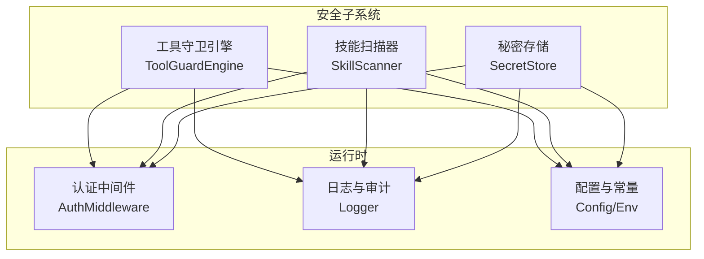
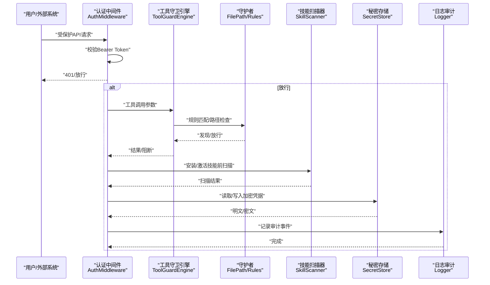
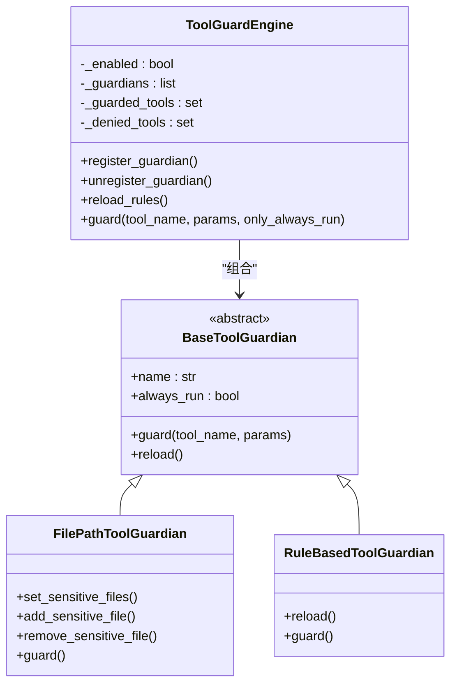
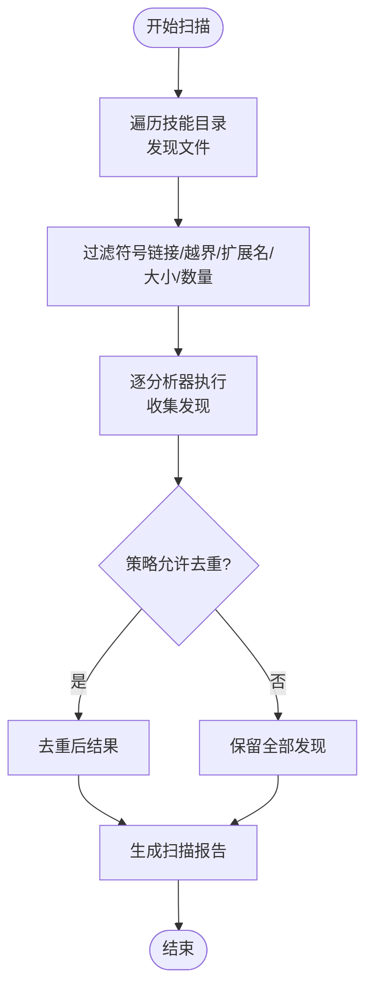
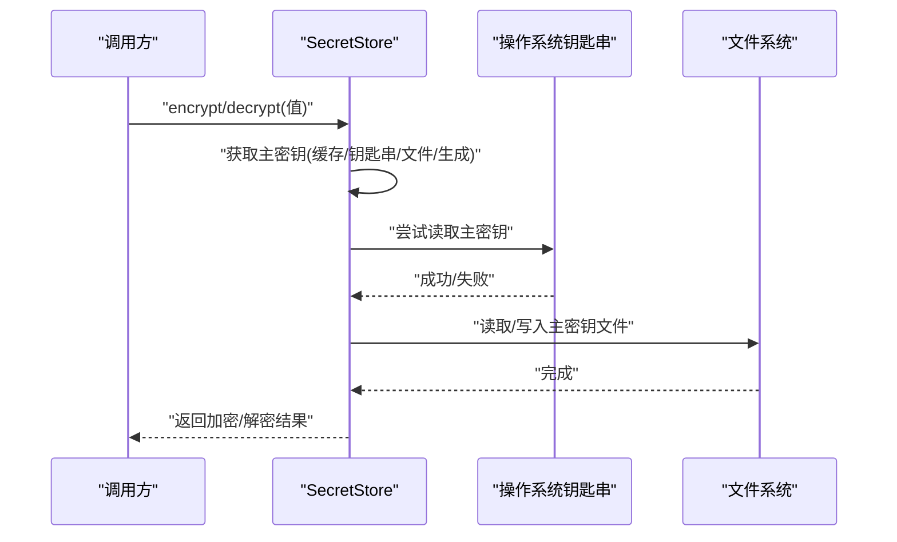
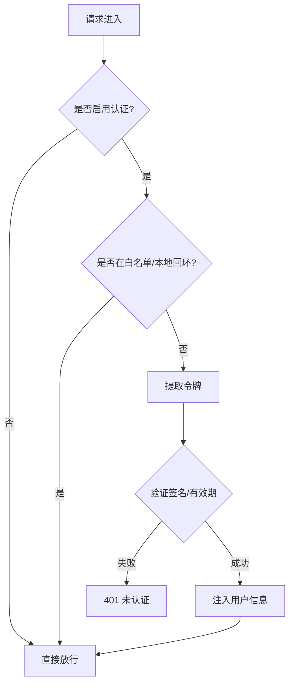
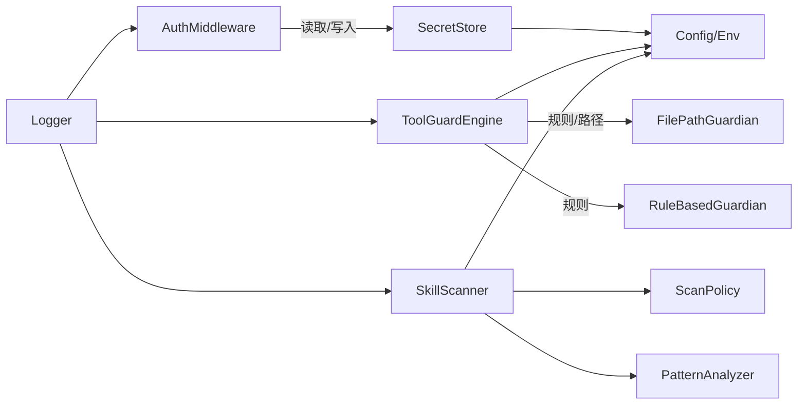

# 安全架构设计

<cite>
**本文引用的文件**
- [SECURITY.md](file://SECURITY.md)
- [src/qwenpaw/security/__init__.py](file://src/qwenpaw/security/__init__.py)
- [src/qwenpaw/security/secret_store.py](file://src/qwenpaw/security/secret_store.py)
- [src/qwenpaw/security/skill_scanner/scanner.py](file://src/qwenpaw/security/skill_scanner/scanner.py)
- [src/qwenpaw/security/skill_scanner/models.py](file://src/qwenpaw/security/skill_scanner/models.py)
- [src/qwenpaw/security/skill_scanner/scan_policy.py](file://src/qwenpaw/security/skill_scanner/scan_policy.py)
- [src/qwenpaw/security/tool_guard/engine.py](file://src/qwenpaw/security/tool_guard/engine.py)
- [src/qwenpaw/security/tool_guard/guardians/file_guardian.py](file://src/qwenpaw/security/tool_guard/guardians/file_guardian.py)
- [src/qwenpaw/security/tool_guard/guardians/rule_guardian.py](file://src/qwenpaw/security/tool_guard/guardians/rule_guardian.py)
- [src/qwenpaw/app/auth.py](file://src/qwenpaw/app/auth.py)
- [src/qwenpaw/utils/logging.py](file://src/qwenpaw/utils/logging.py)
- [src/qwenpaw/config/config.py](file://src/qwenpaw/config/config.py)
- [src/qwenpaw/constant.py](file://src/qwenpaw/constant.py)
</cite>

## 目录
1. [引言](#引言)
2. [项目结构](#项目结构)
3. [核心组件](#核心组件)
4. [架构总览](#架构总览)
5. [详细组件分析](#详细组件分析)
6. [依赖关系分析](#依赖关系分析)
7. [性能考虑](#性能考虑)
8. [故障排查指南](#故障排查指南)
9. [结论](#结论)
10. [附录](#附录)

## 引言
本文件面向QwenPaw的安全架构设计，系统性阐述整体安全理念与分层防护策略，明确安全边界与信任模型，给出威胁建模与风险评估方法，并对各安全组件的协作关系与数据流进行可视化说明。文档同时覆盖安全策略配置框架、权限模型与访问控制机制，以及安全监控、日志审计与事件响应的设计思路。最后总结本地部署在数据隐私方面的优势与实践建议。

## 项目结构
QwenPaw的安全能力主要由三部分构成：
- 工具调用前的参数安全守卫（Tool Guard）
- 技能包静态安全扫描（Skill Scanner）
- 秘密存储与加密（Secret Store）

上述模块通过统一入口集中管理，既保持独立演进，又避免相互耦合带来的单点风险。

图示来源
- [src/qwenpaw/security/__init__.py:1-21](file://src/qwenpaw/security/__init__.py#L1-L21)
- [src/qwenpaw/security/tool_guard/engine.py:53-238](file://src/qwenpaw/security/tool_guard/engine.py#L53-L238)
- [src/qwenpaw/security/skill_scanner/scanner.py:76-319](file://src/qwenpaw/security/skill_scanner/scanner.py#L76-L319)
- [src/qwenpaw/security/secret_store.py:1-291](file://src/qwenpaw/security/secret_store.py#L1-L291)
- [src/qwenpaw/app/auth.py:371-441](file://src/qwenpaw/app/auth.py#L371-L441)
- [src/qwenpaw/utils/logging.py:121-202](file://src/qwenpaw/utils/logging.py#L121-L202)
- [src/qwenpaw/config/config.py:1-800](file://src/qwenpaw/config/config.py#L1-L800)
- [src/qwenpaw/constant.py:1-307](file://src/qwenpaw/constant.py#L1-L307)

章节来源
- [src/qwenpaw/security/__init__.py:1-21](file://src/qwenpaw/security/__init__.py#L1-L21)

## 核心组件
- 工具守卫引擎（ToolGuardEngine）：在工具调用前对参数进行规则匹配与路径检查，支持可插拔守护者（规则型、路径型），并可按配置动态启用/禁用与重载规则。
- 技能扫描器（SkillScanner）：对技能包目录进行静态扫描，基于策略与规则集发现潜在威胁，支持多分析器扩展与去重策略。
- 秘密存储（SecretStore）：提供透明加解密能力，使用Fernet对称加密，主密钥来自操作系统钥匙串或文件，确保敏感字段持久化安全。

章节来源
- [src/qwenpaw/security/tool_guard/engine.py:53-238](file://src/qwenpaw/security/tool_guard/engine.py#L53-L238)
- [src/qwenpaw/security/skill_scanner/scanner.py:76-319](file://src/qwenpaw/security/skill_scanner/scanner.py#L76-L319)
- [src/qwenpaw/security/secret_store.py:1-291](file://src/qwenpaw/security/secret_store.py#L1-L291)

## 架构总览
下图展示从请求进入至工具执行的关键安全路径，包括认证、守卫、扫描与审计：

图示来源
- [src/qwenpaw/app/auth.py:371-441](file://src/qwenpaw/app/auth.py#L371-L441)
- [src/qwenpaw/security/tool_guard/engine.py:169-226](file://src/qwenpaw/security/tool_guard/engine.py#L169-L226)
- [src/qwenpaw/security/tool_guard/guardians/file_guardian.py:184-365](file://src/qwenpaw/security/tool_guard/guardians/file_guardian.py#L184-L365)
- [src/qwenpaw/security/tool_guard/guardians/rule_guardian.py:559-758](file://src/qwenpaw/security/tool_guard/guardians/rule_guardian.py#L559-L758)
- [src/qwenpaw/security/skill_scanner/scanner.py:148-242](file://src/qwenpaw/security/skill_scanner/scanner.py#L148-L242)
- [src/qwenpaw/security/secret_store.py:213-290](file://src/qwenpaw/security/secret_store.py#L213-L290)
- [src/qwenpaw/utils/logging.py:121-202](file://src/qwenpaw/utils/logging.py#L121-L202)

## 详细组件分析

### 工具守卫引擎（ToolGuardEngine）
- 设计要点
  - 懒加载单例，按需初始化守护者集合。
  - 可通过环境变量与配置开关控制是否启用，支持动态重载规则与受控工具范围。
  - 对未在守卫范围内的工具，仍可选择仅执行“总是运行”的守护者（如路径检查）。
- 关键流程
  - 解析配置确定受控工具集与禁用清单。
  - 遍历守护者执行匹配，聚合发现并记录失败的守护者。
  - 返回结果包含最大严重级别与耗时统计，便于上层决策。

图示来源
- [src/qwenpaw/security/tool_guard/engine.py:53-238](file://src/qwenpaw/security/tool_guard/engine.py#L53-L238)
- [src/qwenpaw/security/tool_guard/guardians/file_guardian.py:184-365](file://src/qwenpaw/security/tool_guard/guardians/file_guardian.py#L184-L365)
- [src/qwenpaw/security/tool_guard/guardians/rule_guardian.py:559-758](file://src/qwenpaw/security/tool_guard/guardians/rule_guardian.py#L559-L758)

章节来源
- [src/qwenpaw/security/tool_guard/engine.py:53-238](file://src/qwenpaw/security/tool_guard/engine.py#L53-L238)
- [src/qwenpaw/security/tool_guard/guardians/file_guardian.py:184-365](file://src/qwenpaw/security/tool_guard/guardians/file_guardian.py#L184-L365)
- [src/qwenpaw/security/tool_guard/guardians/rule_guardian.py:559-758](file://src/qwenpaw/security/tool_guard/guardians/rule_guardian.py#L559-L758)

### 技能扫描器（SkillScanner）
- 设计要点
  - 基于策略的文件分类与限额控制，支持跳过归档/惰性扩展名，限制扫描数量与大小。
  - 文件发现阶段严格排除符号链接与越界路径，防止路径穿越。
  - 默认使用模式分析器，支持注册其他分析器（未来可扩展LLM分析）。
- 关键流程
  - 遍历技能目录，构建待扫描文件列表。
  - 逐个分析器执行，收集并去重发现。
  - 输出扫描结果，包含持续时间、使用分析器与失败项。

图示来源
- [src/qwenpaw/security/skill_scanner/scanner.py:248-299](file://src/qwenpaw/security/skill_scanner/scanner.py#L248-L299)
- [src/qwenpaw/security/skill_scanner/scanner.py:148-242](file://src/qwenpaw/security/skill_scanner/scanner.py#L148-L242)

章节来源
- [src/qwenpaw/security/skill_scanner/scanner.py:76-319](file://src/qwenpaw/security/skill_scanner/scanner.py#L76-L319)

### 秘密存储（SecretStore）
- 设计要点
  - 使用Fernet（AES-128-CBC + HMAC-SHA256）实现透明加解密。
  - 主密钥优先来自操作系统钥匙串，回退到安全文件（仅当前用户可读）。
  - 对字典中的敏感字段进行批量加/解密，支持自动迁移与容错降级。
- 关键流程
  - 获取主密钥：缓存命中 → 钥匙串 → 文件 → 生成并回写。
  - 加密/解密：带前缀标识，失败时返回原文以保证可用性。
  - 字段级保护：提供针对不同上下文（认证、提供商等）的敏感字段集合。

图示来源
- [src/qwenpaw/security/secret_store.py:154-290](file://src/qwenpaw/security/secret_store.py#L154-L290)

章节来源
- [src/qwenpaw/security/secret_store.py:1-291](file://src/qwenpaw/security/secret_store.py#L1-L291)

### 认证与访问控制（AuthMiddleware）
- 设计要点
  - 单用户注册模型，密码哈希采用盐值SHA-256，JWT使用HMAC-SHA256签名。
  - 中间件按路径白名单与本地回环豁免策略决定是否校验；支持从查询参数或WebSocket升级头提取令牌。
  - 环境变量控制是否启用认证，支持首次启动从环境变量自动注册管理员账户。
- 关键流程
  - 判断是否需要认证与放行条件。
  - 提取Authorization或查询参数中的Bearer令牌。
  - 验证签名与有效期，注入用户信息后放行。

图示来源
- [src/qwenpaw/app/auth.py:371-441](file://src/qwenpaw/app/auth.py#L371-L441)
- [src/qwenpaw/app/auth.py:223-340](file://src/qwenpaw/app/auth.py#L223-L340)

章节来源
- [src/qwenpaw/app/auth.py:1-441](file://src/qwenpaw/app/auth.py#L1-L441)

### 日志审计与监控
- 设计要点
  - 统一命名空间的日志输出，避免第三方库噪声干扰。
  - 控制台彩色格式化与文件轮转（跨平台适配），支持抑制特定访问日志。
  - 提供添加项目日志文件处理器的能力，便于守护进程与后台任务落地审计。
- 关键流程
  - 初始化根日志器，设置级别与处理器。
  - 仅输出项目命名空间日志，避免泄露依赖库细节。
  - 可选添加文件处理器，按平台选择简单文件或轮转文件处理器。

章节来源
- [src/qwenpaw/utils/logging.py:121-202](file://src/qwenpaw/utils/logging.py#L121-L202)

### 安全策略配置框架
- 工具守卫
  - 通过环境变量与配置项控制启用状态与受控工具范围，支持动态重载规则。
  - 路径型守护者默认启用，敏感文件/目录集合可从配置加载并兼容历史路径。
- 技能扫描
  - 策略对象包含隐藏文件处理、规则作用域、凭证抑制、文件分类、限额阈值、严重度覆盖与禁用规则集。
  - 支持从默认策略叠加自定义策略，导出完整策略供编辑。
- 秘密存储
  - 配置敏感字段集合（如API Key、JWT Secret），在持久化前自动加密，在读取时透明解密。

章节来源
- [src/qwenpaw/security/tool_guard/engine.py:35-154](file://src/qwenpaw/security/tool_guard/engine.py#L35-L154)
- [src/qwenpaw/security/tool_guard/guardians/file_guardian.py:77-103](file://src/qwenpaw/security/tool_guard/guardians/file_guardian.py#L77-L103)
- [src/qwenpaw/security/skill_scanner/scan_policy.py:156-476](file://src/qwenpaw/security/skill_scanner/scan_policy.py#L156-L476)
- [src/qwenpaw/security/secret_store.py:253-290](file://src/qwenpaw/security/secret_store.py#L253-L290)

## 依赖关系分析
- 组件内聚与耦合
  - 安全子系统内部模块低耦合：扫描器、守卫器、秘密存储彼此独立，便于独立演进与禁用。
  - 运行时依赖最小化：认证中间件、日志与配置通过轻量接口接入，避免循环依赖。
- 外部依赖与集成点
  - 钥匙串服务：在容器/无桌面环境中自动降级到文件存储。
  - 正则规则：规则型守护者依赖YAML规则与正则编译，具备良好的可扩展性。
  - 策略文件：扫描策略通过YAML加载与合并，默认策略与组织策略叠加。

图示来源
- [src/qwenpaw/app/auth.py:371-441](file://src/qwenpaw/app/auth.py#L371-L441)
- [src/qwenpaw/security/tool_guard/engine.py:53-238](file://src/qwenpaw/security/tool_guard/engine.py#L53-L238)
- [src/qwenpaw/security/tool_guard/guardians/file_guardian.py:184-365](file://src/qwenpaw/security/tool_guard/guardians/file_guardian.py#L184-L365)
- [src/qwenpaw/security/tool_guard/guardians/rule_guardian.py:559-758](file://src/qwenpaw/security/tool_guard/guardians/rule_guardian.py#L559-L758)
- [src/qwenpaw/security/skill_scanner/scanner.py:76-319](file://src/qwenpaw/security/skill_scanner/scanner.py#L76-L319)
- [src/qwenpaw/security/skill_scanner/scan_policy.py:236-476](file://src/qwenpaw/security/skill_scanner/scan_policy.py#L236-L476)
- [src/qwenpaw/utils/logging.py:121-202](file://src/qwenpaw/utils/logging.py#L121-L202)
- [src/qwenpaw/config/config.py:1-800](file://src/qwenpaw/config/config.py#L1-L800)
- [src/qwenpaw/constant.py:1-307](file://src/qwenpaw/constant.py#L1-L307)

章节来源
- [src/qwenpaw/security/__init__.py:1-21](file://src/qwenpaw/security/__init__.py#L1-L21)
- [src/qwenpaw/constant.py:1-307](file://src/qwenpaw/constant.py#L1-L307)

## 性能考虑
- 扫描器
  - 通过文件限额与大小限制控制扫描成本；默认策略提供合理上限，组织可根据规模调整。
  - 去重策略减少重复发现，降低后续处理开销。
- 守卫器
  - 规则型匹配基于预编译正则，路径型守护者对已知工具参数进行定向扫描，避免全量字符串扫描。
  - 动态重载规则时仅重建规则集，不中断运行。
- 密码学
  - 主密钥与Fernet实例缓存，减少重复初始化开销。
  - 钥匙串不可用时快速降级到文件存储，避免阻塞。

## 故障排查指南
- 认证相关
  - 若出现401错误，检查是否启用了认证、令牌格式与有效期、本地回环豁免条件。
  - 首次启动可通过环境变量自动注册管理员账户，若失败检查环境变量是否正确。
- 工具守卫
  - 若误报或漏报，检查受控工具集与禁用规则，必要时临时关闭或调整规则。
  - 路径型守护者会将敏感文件/目录规范化并比较父路径，确认配置路径是否正确。
- 技能扫描
  - 若扫描异常或超时，检查文件限额、大小限制与策略配置；确认策略文件语法正确。
  - 发现被路径穿越阻止时，检查符号链接与越界路径。
- 秘密存储
  - 解密失败时会回退到原文，避免崩溃；检查主密钥是否变更或文件损坏。
  - 钥匙串不可用时会自动降级到文件存储，确认文件权限与存在性。
- 日志审计
  - 使用项目命名空间日志定位问题；必要时开启文件处理器以便离线分析。

章节来源
- [src/qwenpaw/app/auth.py:371-441](file://src/qwenpaw/app/auth.py#L371-L441)
- [src/qwenpaw/security/tool_guard/engine.py:148-226](file://src/qwenpaw/security/tool_guard/engine.py#L148-L226)
- [src/qwenpaw/security/tool_guard/guardians/file_guardian.py:244-365](file://src/qwenpaw/security/tool_guard/guardians/file_guardian.py#L244-L365)
- [src/qwenpaw/security/skill_scanner/scanner.py:181-242](file://src/qwenpaw/security/skill_scanner/scanner.py#L181-L242)
- [src/qwenpaw/security/secret_store.py:222-241](file://src/qwenpaw/security/secret_store.py#L222-L241)
- [src/qwenpaw/utils/logging.py:121-202](file://src/qwenpaw/utils/logging.py#L121-L202)

## 结论
QwenPaw的安全架构以“个人助理”信任模型为核心，强调本地隔离与最小权限原则。通过工具守卫、技能扫描与秘密存储三道防线，结合策略化配置与可插拔扩展，形成从输入参数、技能包到凭据存储的全链路防护。配合认证中间件与统一日志审计，能够满足本地部署场景下的数据隐私与合规要求。

## 附录

### 安全边界与信任模型
- 实例信任模型
  - 同一实例内的认证调用被视为可信操作员；会话标签仅用于路由与上下文控制，不构成多租户授权边界。
  - 推荐模式：一人一机/一用户一实例，或严格隔离；共享实例应按用户/主机分离。
- 技能信任边界
  - 技能作为受信计算基的一部分，具备与进程相同的权限；仅安装与启用受信任的技能。
- 工作目录与配置边界
  - 工作目录视为受信本地操作态；对工作目录与配置的修改即跨越受信边界。
- 模型与提示注入
  - 不将模型视为可信主体；提示/内容注入可能影响行为，需通过通道/用户白名单与工具策略共同防御。

章节来源
- [SECURITY.md:65-118](file://SECURITY.md#L65-L118)

### 数据安全与隐私保护
- 凭据保护
  - API Key、JWT Secret等敏感字段在磁盘上透明加密存储；支持自动迁移与降级容错。
- 存储介质
  - 主密钥优先来自操作系统钥匙串；容器/无桌面环境自动降级到安全文件（仅当前用户可读）。
- 最小暴露面
  - 将秘密置于工作目录之外，限制技能可访问路径；定期审查配置与技能。

章节来源
- [src/qwenpaw/security/secret_store.py:1-291](file://src/qwenpaw/security/secret_store.py#L1-L291)
- [SECURITY.md:143-151](file://SECURITY.md#L143-L151)

### 网络安全与应用安全
- 认证与授权
  - 单用户注册模型，密码哈希与JWT签名；中间件按路径白名单与本地回环豁免策略放行。
- 通道与用户白名单
  - 建议限制通道与用户来源，使用允许列表；共享场景按用户/主机隔离。
- 工具与技能
  - 最小权限运行；限制工具范围；对危险命令进行规则拦截与工作区外文件提醒。

章节来源
- [src/qwenpaw/app/auth.py:1-441](file://src/qwenpaw/app/auth.py#L1-L441)
- [SECURITY.md:143-151](file://SECURITY.md#L143-L151)