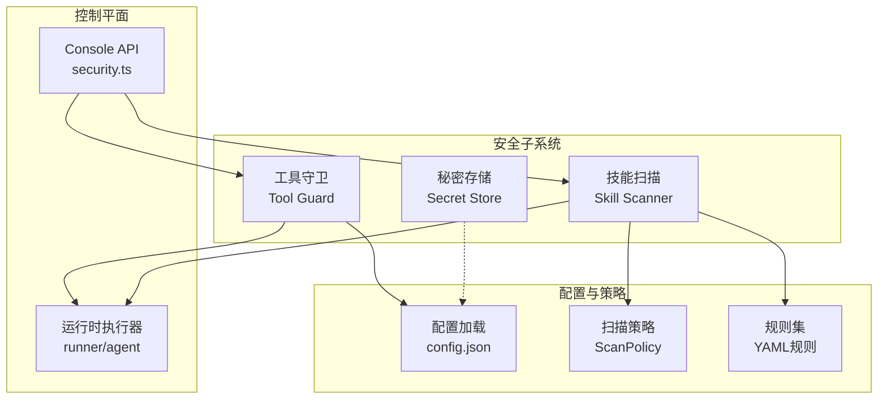
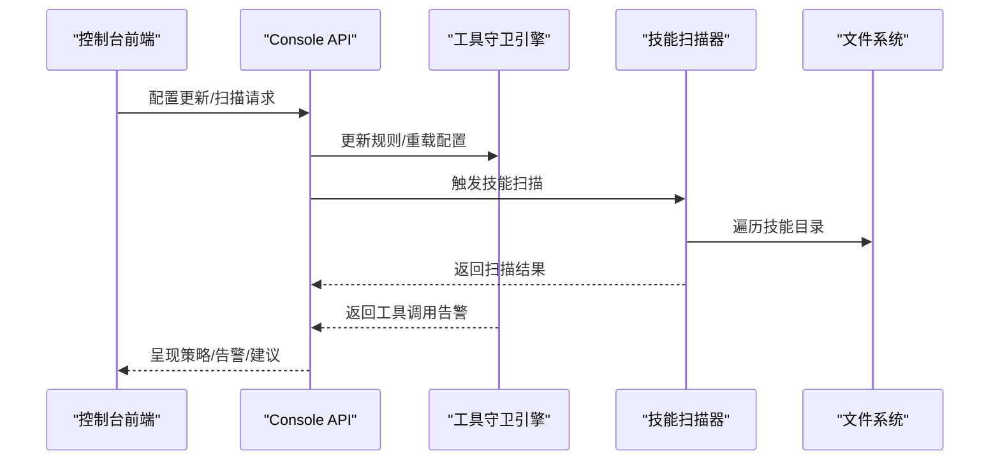
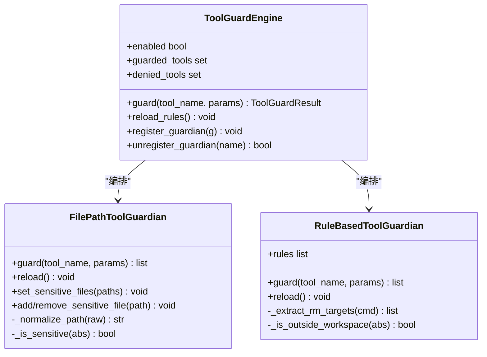
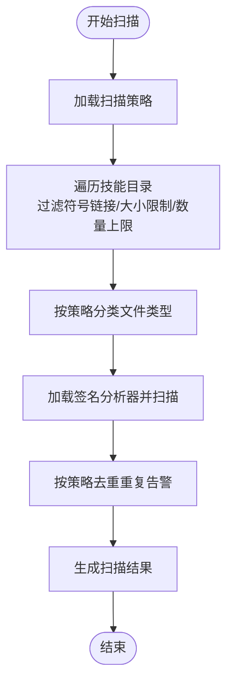
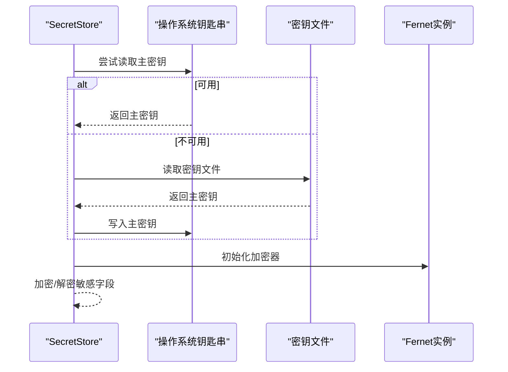
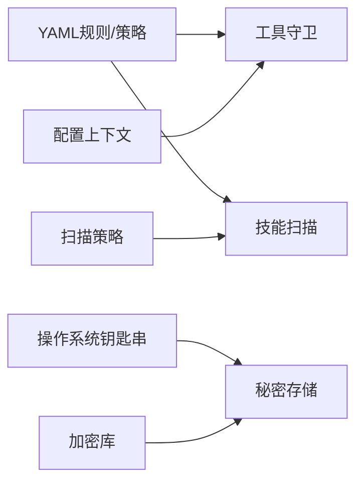

# 安全系统

<cite>
**本文引用的文件**
- [security/__init__.py](file://src/qwenpaw/security/__init__.py)
- [security/tool_guard/engine.py](file://src/qwenpaw/security/tool_guard/engine.py)
- [security/tool_guard/guardians/file_guardian.py](file://src/qwenpaw/security/tool_guard/guardians/file_guardian.py)
- [security/tool_guard/guardians/rule_guardian.py](file://src/qwenpaw/security/tool_guard/guardians/rule_guardian.py)
- [security/tool_guard/models.py](file://src/qwenpaw/security/tool_guard/models.py)
- [security/tool_guard/utils.py](file://src/qwenpaw/security/tool_guard/utils.py)
- [security/tool_guard/approval.py](file://src/qwenpaw/security/tool_guard/approval.py)
- [security/tool_guard/rules/dangerous_shell_commands.yaml](file://src/qwenpaw/security/tool_guard/rules/dangerous_shell_commands.yaml)
- [security/skill_scanner/scanner.py](file://src/qwenpaw/security/skill_scanner/scanner.py)
- [security/skill_scanner/models.py](file://src/qwenpaw/security/skill_scanner/models.py)
- [security/skill_scanner/scan_policy.py](file://src/qwenpaw/security/skill_scanner/scan_policy.py)
- [security/skill_scanner/data/default_policy.yaml](file://src/qwenpaw/security/skill_scanner/data/default_policy.yaml)
- [security/skill_scanner/rules/signatures/command_injection.yaml](file://src/qwenpaw/security/skill_scanner/rules/signatures/command_injection.yaml)
- [security/secret_store.py](file://src/qwenpaw/security/secret_store.py)
- [console/src/api/modules/security.ts](file://console/src/api/modules/security.ts)
- [SECURITY.md](file://SECURITY.md)
</cite>

## 目录
1. [简介](#简介)
2. [项目结构](#项目结构)
3. [核心组件](#核心组件)
4. [架构总览](#架构总览)
5. [详细组件分析](#详细组件分析)
6. [依赖分析](#依赖分析)
7. [性能考虑](#性能考虑)
8. [故障排查指南](#故障排查指南)
9. [结论](#结论)
10. [附录](#附录)

## 简介
本文件面向QwenPaw安全系统，系统性阐述其多层安全机制的设计理念与实现方式，覆盖工具守卫（Tool Guard）、文件访问控制、技能安全扫描、危险命令拦截、敏感路径保护、权限管理策略、安全策略配置与规则定制、威胁检测机制、安全审计与日志、事件响应流程、本地部署优势与数据隐私保护、网络安全（Web认证、API安全、传输加密）等。文档同时提供最佳实践、漏洞防护与应急响应指南，帮助运营者在单用户助理场景下构建可审计、可定制、可演进的安全基线。

## 项目结构
QwenPaw安全体系由三大部分组成：
- 工具调用前置守卫：对工具参数进行预执行扫描，识别高危模式（如命令注入、敏感文件访问、危险系统操作等），支持规则化扩展与运行时重载。
- 技能静态扫描：在安装/启用前对技能包进行静态分析，基于签名规则与策略配置发现潜在风险（命令注入、硬编码凭据、供应链攻击等）。
- 秘密存储：对磁盘上的敏感字段（如API Key、Token）进行透明加解密，主密钥通过操作系统钥匙串或专用密钥文件持久化，确保最小暴露面。

图表来源
- [security/__init__.py:1-21](file://src/qwenpaw/security/__init__.py#L1-L21)
- [security/tool_guard/engine.py:53-238](file://src/qwenpaw/security/tool_guard/engine.py#L53-L238)
- [security/skill_scanner/scanner.py:76-319](file://src/qwenpaw/security/skill_scanner/scanner.py#L76-L319)
- [security/secret_store.py:1-291](file://src/qwenpaw/security/secret_store.py#L1-L291)
- [console/src/api/modules/security.ts:1-99](file://console/src/api/modules/security.ts#L1-L99)

章节来源
- [security/__init__.py:1-21](file://src/qwenpaw/security/__init__.py#L1-L21)
- [console/src/api/modules/security.ts:1-99](file://console/src/api/modules/security.ts#L1-L99)

## 核心组件
- 工具守卫引擎：统一编排多个守护者（规则守护者、文件路径守护者），聚合结果并输出结构化告警；支持按环境变量/配置动态启停与规则重载。
- 文件路径守护者：基于配置的敏感路径白名单/黑名单，对文件读写、发送文件、shell命令等进行路径解析与匹配，阻断敏感文件访问。
- 规则守护者：从YAML加载正则规则，扫描工具参数中的危险模式（破坏性命令、反向连接、提权、权限变更等），并进行工作区外路径检查与增强提示。
- 技能扫描器：遍历技能目录，按策略分类文件类型，执行签名分析器，收集并去重告警，输出扫描结果。
- 扫描策略：组织隐藏文件白名单、规则作用域、凭证占位符、文件分类、阈值与严重性覆盖，支持组织级策略叠加。
- 秘密存储：Fernet对称加密（AES-128-CBC + HMAC-SHA256），主密钥优先使用系统钥匙串，回退到受控文件，提供透明加解密接口。

章节来源
- [security/tool_guard/engine.py:53-238](file://src/qwenpaw/security/tool_guard/engine.py#L53-L238)
- [security/tool_guard/guardians/file_guardian.py:184-365](file://src/qwenpaw/security/tool_guard/guardians/file_guardian.py#L184-L365)
- [security/tool_guard/guardians/rule_guardian.py:559-758](file://src/qwenpaw/security/tool_guard/guardians/rule_guardian.py#L559-L758)
- [security/skill_scanner/scanner.py:76-319](file://src/qwenpaw/security/skill_scanner/scanner.py#L76-L319)
- [security/skill_scanner/scan_policy.py:156-476](file://src/qwenpaw/security/skill_scanner/scan_policy.py#L156-L476)
- [security/secret_store.py:1-291](file://src/qwenpaw/security/secret_store.py#L1-L291)

## 架构总览
工具守卫与技能扫描在“预执行/预安装”阶段拦截高危行为，结合策略与规则形成“可配置、可审计、可扩展”的安全基线；秘密存储贯穿配置持久化与运行时访问，确保敏感信息不以明文形式暴露。

图表来源
- [console/src/api/modules/security.ts:77-99](file://console/src/api/modules/security.ts#L77-L99)
- [security/tool_guard/engine.py:169-226](file://src/qwenpaw/security/tool_guard/engine.py#L169-L226)
- [security/skill_scanner/scanner.py:148-242](file://src/qwenpaw/security/skill_scanner/scanner.py#L148-L242)

## 详细组件分析

### 工具守卫引擎与守护者
- 引擎职责：统一调度规则守护者与文件路径守护者，聚合结果，支持按配置/环境变量启停、动态重载规则与工具集合。
- 文件路径守护者：解析相对/绝对路径，兼容工作区边界，识别敏感目录与文件，对shell命令中的重定向与路径进行提取与匹配，阻断敏感文件访问。
- 规则守护者：加载YAML规则，对参数字符串进行正则匹配，支持排除模式、严重性分级与增强提示（如工作区外路径检测），并生成结构化告警。

图表来源
- [security/tool_guard/engine.py:53-238](file://src/qwenpaw/security/tool_guard/engine.py#L53-L238)
- [security/tool_guard/guardians/file_guardian.py:184-365](file://src/qwenpaw/security/tool_guard/guardians/file_guardian.py#L184-L365)
- [security/tool_guard/guardians/rule_guardian.py:559-758](file://src/qwenpaw/security/tool_guard/guardians/rule_guardian.py#L559-L758)

章节来源
- [security/tool_guard/engine.py:53-238](file://src/qwenpaw/security/tool_guard/engine.py#L53-L238)
- [security/tool_guard/guardians/file_guardian.py:184-365](file://src/qwenpaw/security/tool_guard/guardians/file_guardian.py#L184-L365)
- [security/tool_guard/guardians/rule_guardian.py:559-758](file://src/qwenpaw/security/tool_guard/guardians/rule_guardian.py#L559-L758)
- [security/tool_guard/models.py:1-185](file://src/qwenpaw/security/tool_guard/models.py#L1-L185)
- [security/tool_guard/utils.py:1-164](file://src/qwenpaw/security/tool_guard/utils.py#L1-L164)
- [security/tool_guard/approval.py:1-42](file://src/qwenpaw/security/tool_guard/approval.py#L1-L42)
- [security/tool_guard/rules/dangerous_shell_commands.yaml:1-187](file://src/qwenpaw/security/tool_guard/rules/dangerous_shell_commands.yaml#L1-L187)

### 技能扫描器与策略
- 扫描器职责：遍历技能目录，按策略分类文件类型，加载签名分析器，执行静态扫描，聚合并去重告警，输出扫描结果。
- 策略系统：支持隐藏文件白名单、规则作用域、凭证占位符、文件分类、阈值与严重性覆盖，支持组织策略叠加与导出。
- 默认策略：内置平衡型策略，定义常见扩展名分类、阈值与规则覆盖项，便于快速落地。

图表来源
- [security/skill_scanner/scanner.py:148-299](file://src/qwenpaw/security/skill_scanner/scanner.py#L148-L299)
- [security/skill_scanner/scan_policy.py:156-476](file://src/qwenpaw/security/skill_scanner/scan_policy.py#L156-L476)
- [security/skill_scanner/data/default_policy.yaml:1-243](file://src/qwenpaw/security/skill_scanner/data/default_policy.yaml#L1-L243)

章节来源
- [security/skill_scanner/scanner.py:76-319](file://src/qwenpaw/security/skill_scanner/scanner.py#L76-L319)
- [security/skill_scanner/models.py:1-235](file://src/qwenpaw/security/skill_scanner/models.py#L1-L235)
- [security/skill_scanner/scan_policy.py:156-476](file://src/qwenpaw/security/skill_scanner/scan_policy.py#L156-L476)
- [security/skill_scanner/data/default_policy.yaml:1-243](file://src/qwenpaw/security/skill_scanner/data/default_policy.yaml#L1-L243)
- [security/skill_scanner/rules/signatures/command_injection.yaml:1-195](file://src/qwenpaw/security/skill_scanner/rules/signatures/command_injection.yaml#L1-L195)

### 秘密存储与数据隐私
- 加密算法：Fernet（AES-128-CBC + HMAC-SHA256），前缀标识加密值，支持透明加解密。
- 主密钥管理：优先使用操作系统钥匙串（keyring），容器/无桌面环境自动降级至受控文件（~/.qwenpaw.secret/.master_key，0600权限）。
- 字段加密：提供针对provider/auth等敏感字段的批量加解密辅助函数，避免明文落盘。

图表来源
- [security/secret_store.py:154-242](file://src/qwenpaw/security/secret_store.py#L154-L242)

章节来源
- [security/secret_store.py:1-291](file://src/qwenpaw/security/secret_store.py#L1-L291)

### 控制台安全配置API
- 工具守卫配置：获取/更新工具守卫开关、受保护工具集、禁用工具集、自定义规则与禁用规则列表。
- 文件守卫配置：获取/更新文件守卫开关与敏感路径列表。
- 技能扫描配置：获取扫描模式（阻断/警告/关闭）、超时、白名单条目等。

章节来源
- [console/src/api/modules/security.ts:1-99](file://console/src/api/modules/security.ts#L1-L99)

## 依赖分析
- 组件内聚：工具守卫与技能扫描各自保持独立模块，通过统一的数据模型（告警、严重性、类别）进行交互；秘密存储作为底层基础设施被各模块复用。
- 外部依赖：规则与策略依赖YAML解析；钥匙串依赖keyring库；加密依赖cryptography库；运行时通过配置上下文与常量模块集成。
- 潜在耦合点：规则守护者对工作区边界的判断依赖当前工作目录与平台差异处理；扫描器对文件系统的遍历需防范符号链接与越界访问。

图表来源
- [security/tool_guard/guardians/rule_guardian.py:76-90](file://src/qwenpaw/security/tool_guard/guardians/rule_guardian.py#L76-L90)
- [security/skill_scanner/scan_policy.py:236-282](file://src/qwenpaw/security/skill_scanner/scan_policy.py#L236-L282)
- [security/secret_store.py:71-109](file://src/qwenpaw/security/secret_store.py#L71-L109)

章节来源
- [security/tool_guard/guardians/rule_guardian.py:76-90](file://src/qwenpaw/security/tool_guard/guardians/rule_guardian.py#L76-L90)
- [security/skill_scanner/scan_policy.py:236-282](file://src/qwenpaw/security/skill_scanner/scan_policy.py#L236-L282)
- [security/secret_store.py:71-109](file://src/qwenpaw/security/secret_store.py#L71-L109)

## 性能考虑
- 工具守卫：采用懒加载守护者与规则，仅在需要时初始化；对规则进行预编译正则，减少运行时开销；严格限制扫描范围（仅高危工具/参数）。
- 技能扫描：设置最大文件数与单文件大小阈值，跳过归档/二进制/结构化文件以降低扫描成本；按策略去重重复告警，避免冗余输出。
- 密码学：主密钥缓存与延迟初始化，避免频繁IO；Fernet实例缓存复用，减少重复构造。

## 故障排查指南
- 工具守卫未生效
  - 检查环境变量与配置开关；确认受保护工具集与禁用工具集是否正确；查看规则重载日志。
  - 关注路径解析与工作区边界判断，确认相对路径与用户家目录展开是否符合预期。
- 危险命令误报
  - 自定义规则或排除模式；调整严重性覆盖；核对工作区外路径检测提示是否合理。
- 技能扫描异常
  - 检查策略文件语法与合并逻辑；确认文件分类与阈值设置；验证扫描器对符号链接与越界文件的处理。
- 秘密存储失败
  - 检查钥匙串可用性与容器环境判定；确认密钥文件权限与格式；观察解密失败时的降级行为。

章节来源
- [security/tool_guard/engine.py:35-51](file://src/qwenpaw/security/tool_guard/engine.py#L35-L51)
- [security/tool_guard/utils.py:129-164](file://src/qwenpaw/security/tool_guard/utils.py#L129-L164)
- [security/skill_scanner/scanner.py:248-299](file://src/qwenpaw/security/skill_scanner/scanner.py#L248-L299)
- [security/secret_store.py:49-109](file://src/qwenpaw/security/secret_store.py#L49-L109)

## 结论
QwenPaw安全系统通过“预执行/预安装”的双轨机制，结合可配置规则与策略，实现了对高危工具调用与恶意技能的主动拦截；配合透明加密的秘密存储与严格的边界假设，满足单用户助理场景下的安全基线要求。建议运营者基于默认策略与规则快速落地，再根据组织需求逐步细化与加固。

## 附录

### 安全策略配置与规则定制
- 工具守卫
  - 开关与范围：通过环境变量与配置文件控制启用/禁用与受保护工具集。
  - 自定义规则：在配置中添加规则条目，支持严重性、描述与修复建议；可禁用特定规则ID。
  - 运行时重载：扫描配置变化后重载规则与工具集合。
- 技能扫描
  - 策略覆盖：隐藏文件白名单、规则作用域、凭证占位符、文件分类、阈值与严重性覆盖。
  - 导出策略：将当前策略导出为YAML以便编辑与版本化管理。
- 文件守卫
  - 敏感路径：支持绝对/相对路径与目录通配；默认保护秘密目录；支持工作区边界校验。

章节来源
- [security/tool_guard/utils.py:64-127](file://src/qwenpaw/security/tool_guard/utils.py#L64-L127)
- [security/tool_guard/rules/dangerous_shell_commands.yaml:1-187](file://src/qwenpaw/security/tool_guard/rules/dangerous_shell_commands.yaml#L1-L187)
- [security/skill_scanner/scan_policy.py:156-476](file://src/qwenpaw/security/skill_scanner/scan_policy.py#L156-L476)
- [security/skill_scanner/data/default_policy.yaml:1-243](file://src/qwenpaw/security/skill_scanner/data/default_policy.yaml#L1-L243)
- [console/src/api/modules/security.ts:15-67](file://console/src/api/modules/security.ts#L15-L67)

### 威胁检测机制
- 工具调用层面：命令注入、危险系统操作（rm/reboot/服务管理/进程终止）、网络滥用（反向连接/隧道）、权限变更与提权、路径遍历、硬编码凭据等。
- 技能层面：命令注入、数据泄露、社会工程、供应链攻击、混淆与规避、未授权工具使用等。

章节来源
- [security/tool_guard/guardians/rule_guardian.py:608-758](file://src/qwenpaw/security/tool_guard/guardians/rule_guardian.py#L608-L758)
- [security/skill_scanner/rules/signatures/command_injection.yaml:1-195](file://src/qwenpaw/security/skill_scanner/rules/signatures/command_injection.yaml#L1-L195)

### 安全审计、日志与事件响应
- 结构化日志：工具守卫对每个告警与汇总进行结构化输出，便于检索与告警联动。
- 告警聚合：按严重性与类别统计，支持UI摘要展示与进一步处置。
- 事件响应：结合控制台API的配置能力，快速调整策略与规则，阻断高危行为并通知相关人员。

章节来源
- [security/tool_guard/utils.py:129-164](file://src/qwenpaw/security/tool_guard/utils.py#L129-L164)
- [security/tool_guard/models.py:103-185](file://src/qwenpaw/security/tool_guard/models.py#L103-L185)
- [console/src/api/modules/security.ts:77-99](file://console/src/api/modules/security.ts#L77-L99)

### 本地部署与数据隐私
- 单用户信任模型：同一实例内的已认证调用者被视为可信操作者；建议单用户/单主机隔离，避免多人共享实例带来的边界模糊。
- 秘密存储：主密钥优先钥匙串，回退文件；所有敏感字段透明加密，避免明文落盘。
- 部署建议：容器内运行时尽量非root、只读挂载与最小能力集；避免将个人账户与工作环境混合导致边界坍塌。

章节来源
- [SECURITY.md:65-118](file://SECURITY.md#L65-L118)
- [security/secret_store.py:154-242](file://src/qwenpaw/security/secret_store.py#L154-L242)

### 网络安全与合规
- Web认证与API安全：通过通道与用户白名单限制入口；结合会话与内存隔离减少上下文泄露；建议启用HTTPS与最小权限原则。
- 传输加密：建议在反向代理或网关层启用TLS；内部通信遵循最小暴露原则。
- 合规与披露：遵循私有披露流程，提供可复现PoC与影响评估，避免仅理论或提示性报告。

章节来源
- [SECURITY.md:1-158](file://SECURITY.md#L1-L158)