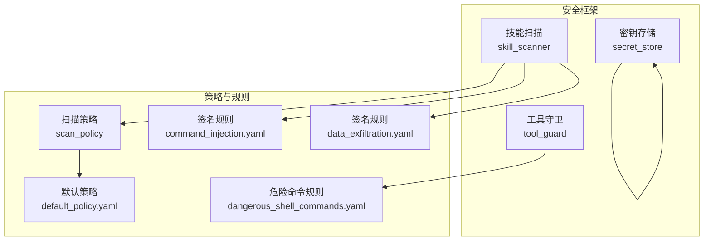
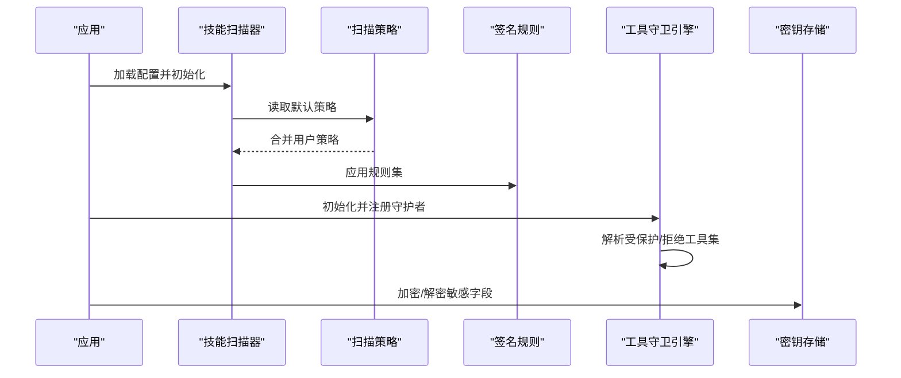
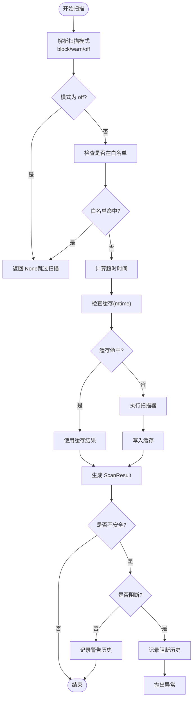
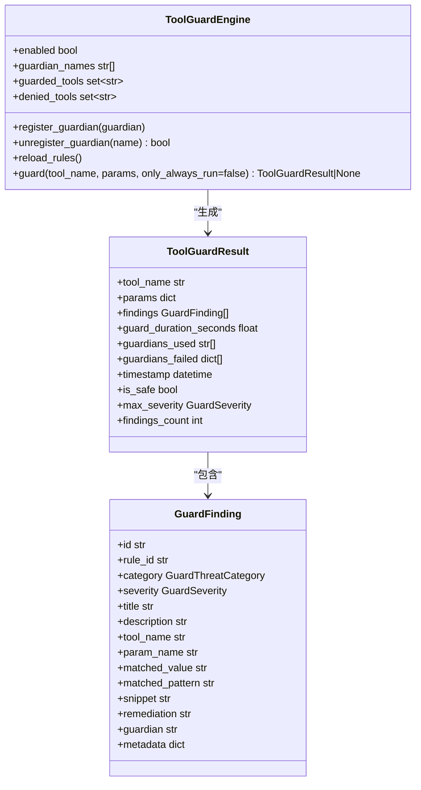
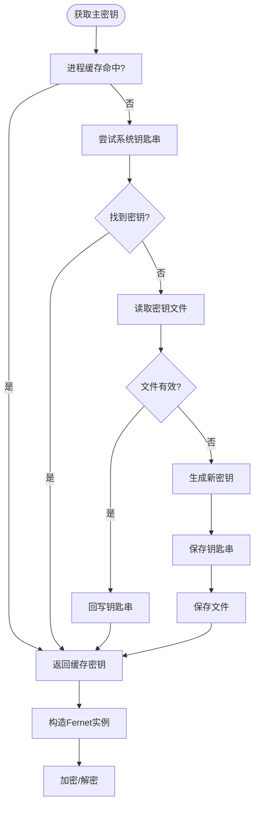
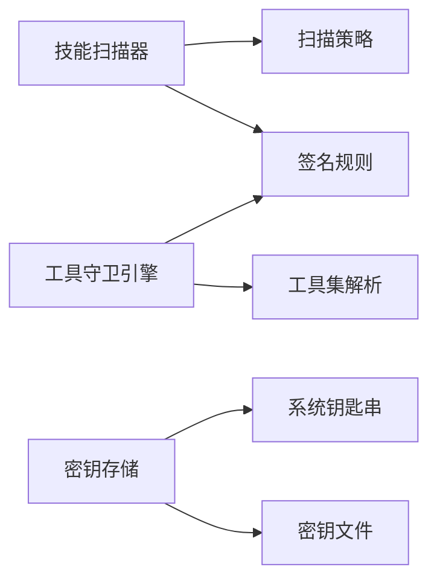

# 安全配置管理

<cite>
**本文引用的文件**   
- [security/__init__.py](file://src/qwenpaw/security/__init__.py)
- [security/skill_scanner/__init__.py](file://src/qwenpaw/security/skill_scanner/__init__.py)
- [security/skill_scanner/models.py](file://src/qwenpaw/security/skill_scanner/models.py)
- [security/skill_scanner/scan_policy.py](file://src/qwenpaw/security/skill_scanner/scan_policy.py)
- [security/skill_scanner/data/default_policy.yaml](file://src/qwenpaw/security/skill_scanner/data/default_policy.yaml)
- [security/skill_scanner/rules/signatures/command_injection.yaml](file://src/qwenpaw/security/skill_scanner/rules/signatures/command_injection.yaml)
- [security/skill_scanner/rules/signatures/data_exfiltration.yaml](file://src/qwenpaw/security/skill_scanner/rules/signatures/data_exfiltration.yaml)
- [security/tool_guard/__init__.py](file://src/qwenpaw/security/tool_guard/__init__.py)
- [security/tool_guard/engine.py](file://src/qwenpaw/security/tool_guard/engine.py)
- [security/tool_guard/models.py](file://src/qwenpaw/security/tool_guard/models.py)
- [security/tool_guard/rules/dangerous_shell_commands.yaml](file://src/qwenpaw/security/tool_guard/rules/dangerous_shell_commands.yaml)
- [security/secret_store.py](file://src/qwenpaw/security/secret_store.py)
- [config/config.py](file://src/qwenpaw/config/config.py)
</cite>

## 目录
1. [简介](#简介)
2. [项目结构](#项目结构)
3. [核心组件](#核心组件)
4. [架构总览](#架构总览)
5. [详细组件分析](#详细组件分析)
6. [依赖分析](#依赖分析)
7. [性能考虑](#性能考虑)
8. [故障排查指南](#故障排查指南)
9. [结论](#结论)
10. [附录](#附录)

## 简介
本文件面向QwenPaw安全配置管理系统，系统性梳理并文档化安全策略配置文件结构与参数含义，覆盖默认安全策略、自定义策略创建与策略优先级管理；详解工具守卫配置、文件访问控制规则与技能扫描策略；提供安全配置导入导出、配置模板管理与版本控制建议；给出安全策略测试、配置验证与故障排查方法；解释动态配置更新、配置热重载与配置回滚机制；最后总结安全配置最佳实践、性能优化与维护建议。

## 项目结构
安全子系统由三大核心模块构成：
- 技能扫描（Skill Scanner）：对技能目录进行静态分析，识别注入、数据外泄、硬编码密钥等威胁。
- 工具守卫（Tool Guard）：在工具调用前扫描参数，阻断危险命令与路径操作。
- 密钥存储（Secret Store）：透明加密存储敏感字段，支持主密钥的系统钥匙串或文件持久化。

图表来源
- [security/__init__.py:1-21](file://src/qwenpaw/security/__init__.py#L1-L21)
- [security/skill_scanner/__init__.py:1-514](file://src/qwenpaw/security/skill_scanner/__init__.py#L1-L514)
- [security/tool_guard/__init__.py:1-59](file://src/qwenpaw/security/tool_guard/__init__.py#L1-L59)
- [security/secret_store.py:1-291](file://src/qwenpaw/security/secret_store.py#L1-L291)

章节来源
- [security/__init__.py:1-21](file://src/qwenpaw/security/__init__.py#L1-L21)

## 核心组件
- 技能扫描器（SkillScanner）：负责扫描技能目录，聚合分析结果，支持缓存、白名单、阻断历史记录与超时控制。
- 扫描策略（ScanPolicy）：组织化策略对象，支持从默认策略叠加自定义策略，导出策略模板，覆盖规则范围、凭证处理、文件分类与阈值等。
- 工具守卫引擎（ToolGuardEngine）：在工具调用前执行多守护者检查，支持启用开关、受保护工具集、拒绝工具集与规则热重载。
- 密钥存储（SecretStore）：基于Fernet的透明加解密层，支持主密钥的系统钥匙串与文件后备，自动迁移与降级容错。

章节来源
- [security/skill_scanner/__init__.py:424-514](file://src/qwenpaw/security/skill_scanner/__init__.py#L424-L514)
- [security/skill_scanner/scan_policy.py:236-476](file://src/qwenpaw/security/skill_scanner/scan_policy.py#L236-L476)
- [security/tool_guard/engine.py:53-238](file://src/qwenpaw/security/tool_guard/engine.py#L53-L238)
- [security/secret_store.py:149-291](file://src/qwenpaw/security/secret_store.py#L149-L291)

## 架构总览
安全配置管理采用“策略即代码”的设计：默认策略内置在包内，组织可按需覆盖；扫描器与守卫引擎通过策略对象驱动规则匹配；密钥存储提供透明加密能力。策略加载顺序与优先级如下：

图表来源
- [security/skill_scanner/__init__.py:86-115](file://src/qwenpaw/security/skill_scanner/__init__.py#L86-L115)
- [security/skill_scanner/scan_policy.py:261-304](file://src/qwenpaw/security/skill_scanner/scan_policy.py#L261-L304)
- [security/tool_guard/engine.py:141-154](file://src/qwenpaw/security/tool_guard/engine.py#L141-L154)
- [security/secret_store.py:154-242](file://src/qwenpaw/security/secret_store.py#L154-L242)

## 详细组件分析

### 技能扫描策略与规则
- 默认策略（default_policy.yaml）
  - 隐藏文件与目录白名单：.gitignore、.editorconfig、.vscode、.github 等。
  - 规则作用域：仅在文档目录跳过特定规则、仅在代码文件触发某些规则、文档名模式匹配。
  - 凭证处理：已知测试值与占位符标记自动抑制告警。
  - 文件分类：静止类（图片字体）、结构化（PDF/Office）、归档（zip/tar/gz）与代码扩展。
  - 文件限制：最大文件数、单文件大小、最大引用深度、名称与描述长度。
  - 分析阈值：最小置信度、正则最大长度。
  - 严重性覆盖与禁用规则：空列表默认，可按规则ID覆盖严重性或禁用规则。
- 签名规则示例
  - 命令注入：eval/exec/compile、os.system/subprocess.shell=True、find -exec 恶意模式、SVG/JS 动态脚本等。
  - 数据外泄：网络请求、HTTP POST 敏感目标、socket 外连、敏感文件读取、Base64+网络组合等。
- 扫描流程与优先级
  - 模式：block/warn/off，环境变量优先于配置，再回退到默认。
  - 超时：从配置读取，默认30秒。
  - 白名单：按技能名与内容哈希匹配，支持目录内容变更后仍可命中。
  - 缓存：目录 mtime 变更前返回缓存结果，LRU上限64条。
  - 历史记录：阻断/警告记录持久化，支持查询、清空与删除。

图表来源
- [security/skill_scanner/__init__.py:424-514](file://src/qwenpaw/security/skill_scanner/__init__.py#L424-L514)
- [security/skill_scanner/scan_policy.py:261-304](file://src/qwenpaw/security/skill_scanner/scan_policy.py#L261-L304)

章节来源
- [security/skill_scanner/data/default_policy.yaml:1-243](file://src/qwenpaw/security/skill_scanner/data/default_policy.yaml#L1-L243)
- [security/skill_scanner/rules/signatures/command_injection.yaml:1-195](file://src/qwenpaw/security/skill_scanner/rules/signatures/command_injection.yaml#L1-L195)
- [security/skill_scanner/rules/signatures/data_exfiltration.yaml:1-142](file://src/qwenpaw/security/skill_scanner/rules/signatures/data_exfiltration.yaml#L1-L142)
- [security/skill_scanner/__init__.py:86-115](file://src/qwenpaw/security/skill_scanner/__init__.py#L86-L115)
- [security/skill_scanner/__init__.py:142-169](file://src/qwenpaw/security/skill_scanner/__init__.py#L142-L169)
- [security/skill_scanner/__init__.py:240-312](file://src/qwenpaw/security/skill_scanner/__init__.py#L240-L312)
- [security/skill_scanner/__init__.py:356-390](file://src/qwenpaw/security/skill_scanner/__init__.py#L356-L390)

### 工具守卫配置与规则
- 守护引擎
  - 启用开关：环境变量优先，其次配置，再回退默认开启。
  - 守护者集合：默认包含路径守护者与规则守护者，支持注册/注销与查询。
  - 工具集：受保护工具集（None 表示全部），拒绝工具集（无条件拒绝）。
  - 规则热重载：逐个守护者调用 reload 并刷新工具集。
- 危险命令规则
  - 删除/移动：rm/mv 等破坏性命令。
  - 文件系统与块设备：mkfs/dd 等低层破坏。
  - 拒绝服务与炸弹：fork bomb、mass kill。
  - 管道到 Shell：curl | bash 远程执行。
  - 反向 Shell 与隧道：/dev/tcp、nc/ncat/socat。
  - 权限与特权：chmod 777、chattr +i、sudo/su/doas/pkexec/runas。
  - 隐蔽与规避：base64 -d | bash。
  - 系统重启/关机/服务管理/进程终止：reboot/shutdown/systemctl/kill 等。
- 结果模型
  - ToolGuardResult 包含工具名、参数、发现项、耗时、失败守护者与时间戳，并提供按严重性与类别筛选的方法。

图表来源
- [security/tool_guard/engine.py:53-238](file://src/qwenpaw/security/tool_guard/engine.py#L53-L238)
- [security/tool_guard/models.py:60-185](file://src/qwenpaw/security/tool_guard/models.py#L60-L185)

章节来源
- [security/tool_guard/engine.py:35-51](file://src/qwenpaw/security/tool_guard/engine.py#L35-L51)
- [security/tool_guard/engine.py:141-154](file://src/qwenpaw/security/tool_guard/engine.py#L141-L154)
- [security/tool_guard/engine.py:169-227](file://src/qwenpaw/security/tool_guard/engine.py#L169-L227)
- [security/tool_guard/models.py:25-185](file://src/qwenpaw/security/tool_guard/models.py#L25-L185)
- [security/tool_guard/rules/dangerous_shell_commands.yaml:1-187](file://src/qwenpaw/security/tool_guard/rules/dangerous_shell_commands.yaml#L1-L187)

### 密钥存储与透明加密
- 主密钥管理
  - 顺序：进程缓存 → 系统钥匙串（keyring）→ 秘钥文件（SECRET_DIR/.master_key）→ 生成新密钥并回写钥匙串与文件。
  - 环境豁免：容器、无显示服务器的Linux、CI 环境下跳过钥匙串访问。
- 加解密
  - 使用 Fernet（AES-128-CBC + HMAC-SHA256），密钥经 base64.urlsafe_b64encode 处理。
  - 前缀 ENC: 用于区分明文与密文，首次访问透明迁移。
  - 降级容错：解密失败返回原始密文，避免崩溃。
- 字段级加解密
  - 支持对字典中的指定字段进行加密/解密，如 provider 的 api_key、auth 的 jwt_secret。

图表来源
- [security/secret_store.py:154-242](file://src/qwenpaw/security/secret_store.py#L154-L242)

章节来源
- [security/secret_store.py:49-109](file://src/qwenpaw/security/secret_store.py#L49-L109)
- [security/secret_store.py:154-242](file://src/qwenpaw/security/secret_store.py#L154-L242)
- [security/secret_store.py:260-291](file://src/qwenpaw/security/secret_store.py#L260-L291)

### 安全策略配置文件结构与参数
- 扫描策略（ScanPolicy）
  - 策略元信息：policy_name、policy_version、preset_base。
  - 隐藏文件：benign_dotfiles、benign_dotdirs。
  - 规则作用域：skillmd_and_scripts_only、skip_in_docs、code_only、doc_path_indicators、doc_filename_patterns、dedupe_duplicate_findings。
  - 凭证：known_test_values、placeholder_markers。
  - 文件分类：inert_extensions、structured_extensions、archive_extensions、code_extensions。
  - 文件限制：max_file_count、max_file_size_bytes、max_reference_depth、max_name_length、max_description_length、min_description_length。
  - 分析阈值：min_confidence_pct、max_regex_pattern_length。
  - 严重性覆盖与禁用：severity_overrides（rule_id→severity）、disabled_rules。
- 默认策略（default_policy.yaml）
  - 内置默认策略，组织可通过 from_yaml 覆盖，to_yaml 导出策略模板以便编辑。
- 工具守卫规则（dangerous_shell_commands.yaml）
  - 按工具名与参数名限定规则适用范围，结合威胁类别与严重性分级。

章节来源
- [security/skill_scanner/scan_policy.py:156-476](file://src/qwenpaw/security/skill_scanner/scan_policy.py#L156-L476)
- [security/skill_scanner/data/default_policy.yaml:1-243](file://src/qwenpaw/security/skill_scanner/data/default_policy.yaml#L1-L243)
- [security/tool_guard/rules/dangerous_shell_commands.yaml:1-187](file://src/qwenpaw/security/tool_guard/rules/dangerous_shell_commands.yaml#L1-L187)

### 安全配置导入导出、模板管理与版本控制
- 导入
  - 从 YAML 加载策略：from_yaml，内置默认策略与用户策略深合并。
  - 环境变量与配置优先级：扫描模式、工具守卫开关均支持环境变量覆盖。
- 导出
  - to_yaml 输出完整策略模板，便于组织定制与版本化管理。
- 模板管理
  - default_policy.yaml 作为基线模板，组织策略仅覆盖差异部分。
- 版本控制
  - policy_version 记录策略版本，建议每次策略调整提交一次变更，配合 Git 管理。

章节来源
- [security/skill_scanner/scan_policy.py:261-304](file://src/qwenpaw/security/skill_scanner/scan_policy.py#L261-L304)
- [security/skill_scanner/__init__.py:96-109](file://src/qwenpaw/security/skill_scanner/__init__.py#L96-L109)
- [security/tool_guard/engine.py:35-51](file://src/qwenpaw/security/tool_guard/engine.py#L35-L51)

### 安全策略测试、配置验证与故障排查
- 测试
  - 技能扫描：scan_skill_directory 返回 ScanResult 或抛出 SkillScanError；可设置 block 参数强制阻断。
  - 工具守卫：guard 返回 ToolGuardResult，is_safe/max_severity 判断风险等级。
- 验证
  - 策略有效性：to_yaml 导出策略模板，人工审阅规则覆盖范围与阈值。
  - 环境变量校验：确认 QWENPAW_SKILL_SCAN_MODE、QWENPAW_TOOL_GUARD_ENABLED 生效。
- 故障排查
  - 扫描超时：提高 timeout 或检查规则复杂度与文件数量。
  - 白名单误判：核对 content_hash 与技能目录内容一致性。
  - 历史记录：get_blocked_history/clear_blocked_history/remove_blocked_entry 管理阻断记录。
  - 密钥问题：检查钥匙串可用性、密钥文件权限与内容格式。

章节来源
- [security/skill_scanner/__init__.py:424-514](file://src/qwenpaw/security/skill_scanner/__init__.py#L424-L514)
- [security/tool_guard/engine.py:169-227](file://src/qwenpaw/security/tool_guard/engine.py#L169-L227)
- [security/secret_store.py:71-109](file://src/qwenpaw/security/secret_store.py#L71-L109)

### 动态配置更新、热重载与回滚机制
- 动态更新
  - 工具守卫：reload_rules 对所有守护者执行规则重载，并刷新受保护/拒绝工具集。
- 热重载
  - 扫描器：通过缓存 mtime 机制实现目录未变更时的热命中；变更后重新扫描并更新缓存。
- 回滚
  - 策略回滚：保留策略版本号与 Git 提交记录，必要时回退到上一版本 YAML。
  - 密钥回滚：若主密钥变更导致解密失败，可回滚至旧密钥文件并清理缓存。

章节来源
- [security/tool_guard/engine.py:148-154](file://src/qwenpaw/security/tool_guard/engine.py#L148-L154)
- [security/skill_scanner/__init__.py:356-390](file://src/qwenpaw/security/skill_scanner/__init__.py#L356-L390)
- [security/secret_store.py:232-242](file://src/qwenpaw/security/secret_store.py#L232-L242)

## 依赖分析
- 组件耦合
  - 技能扫描器依赖扫描策略与签名规则；策略对象与规则文件解耦，便于独立演进。
  - 工具守卫引擎依赖守护者实现与规则文件；支持运行时注册/注销守护者。
  - 密钥存储与系统钥匙串/文件交互，具备降级容错。
- 外部依赖
  - 正则表达式、YAML 解析、Fernet 加密库、keyring（可选）。
- 循环依赖
  - 当前模块间无循环导入迹象，策略与规则以数据形式注入，降低耦合。

图表来源
- [security/skill_scanner/__init__.py:86-115](file://src/qwenpaw/security/skill_scanner/__init__.py#L86-L115)
- [security/tool_guard/engine.py:141-154](file://src/qwenpaw/security/tool_guard/engine.py#L141-L154)
- [security/secret_store.py:71-109](file://src/qwenpaw/security/secret_store.py#L71-L109)

章节来源
- [security/skill_scanner/scan_policy.py:261-304](file://src/qwenpaw/security/skill_scanner/scan_policy.py#L261-L304)
- [security/tool_guard/engine.py:141-154](file://src/qwenpaw/security/tool_guard/engine.py#L141-L154)
- [security/secret_store.py:71-109](file://src/qwenpaw/security/secret_store.py#L71-L109)

## 性能考虑
- 扫描缓存：LRU 最大64条，按目录与文件 mtime 判定缓存有效性，显著减少重复扫描开销。
- 规则编译：策略中正则最大长度限制与无效正则日志，避免规则膨胀导致性能下降。
- 并发控制：扫描器使用单线程池执行扫描，避免并发带来的资源竞争。
- 密钥缓存：主密钥与 Fernet 实例进程内缓存，减少频繁 IO 与解密成本。
- 建议
  - 控制技能目录规模与文件数量，合理设置 max_file_count 与 max_file_size_bytes。
  - 将高代价规则置于 disabled_rules 或缩小作用域，提升整体吞吐。

章节来源
- [security/skill_scanner/__init__.py:356-390](file://src/qwenpaw/security/skill_scanner/__init__.py#L356-L390)
- [security/skill_scanner/scan_policy.py:49-67](file://src/qwenpaw/security/skill_scanner/scan_policy.py#L49-L67)
- [security/secret_store.py:196-211](file://src/qwenpaw/security/secret_store.py#L196-L211)

## 故障排查指南
- 扫描失败/超时
  - 检查 timeout 设置与规则复杂度；确认目录权限与文件完整性。
- 白名单误放行
  - 核对 content_hash 是否随目录变更而更新；必要时移除旧哈希或调整白名单。
- 工具守卫误报
  - 使用 only_always_run 仅运行常驻守护者；调整规则或临时禁用特定规则。
- 密钥无法解密
  - 检查主密钥来源（钥匙串/文件）与权限；确认密钥文件格式正确。
- 历史记录异常
  - 清理历史文件或逐条删除；关注线程锁与磁盘权限问题。

章节来源
- [security/skill_scanner/__init__.py:240-312](file://src/qwenpaw/security/skill_scanner/__init__.py#L240-L312)
- [security/tool_guard/engine.py:169-227](file://src/qwenpaw/security/tool_guard/engine.py#L169-L227)
- [security/secret_store.py:232-242](file://src/qwenpaw/security/secret_store.py#L232-L242)

## 结论
QwenPaw 安全配置管理以策略为中心，结合扫描器与守卫引擎实现“先规则、后策略”的双层防护；通过密钥存储提供透明加密能力。默认策略与签名规则覆盖主流安全威胁，组织可基于 YAML 快速定制并版本化管理。建议在生产环境中启用缓存与阈值控制，定期审查策略与规则，确保安全与性能平衡。

## 附录
- 环境变量
  - QWENPAW_SKILL_SCAN_MODE：扫描模式（block/warn/off），优先于配置。
  - QWENPAW_TOOL_GUARD_ENABLED：工具守卫开关，优先于配置。
  - QWENPAW_RUNNING_IN_CONTAINER：容器环境跳过钥匙串访问。
- 关键路径参考
  - 技能扫描入口：scan_skill_directory
  - 策略加载与导出：ScanPolicy.from_yaml / to_yaml
  - 守卫引擎：ToolGuardEngine.guard / reload_rules
  - 密钥加解密：encrypt / decrypt / is_encrypted