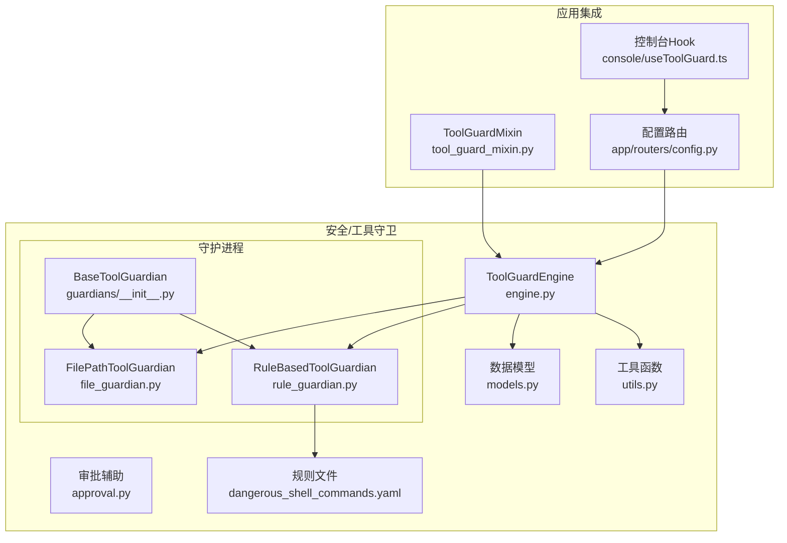
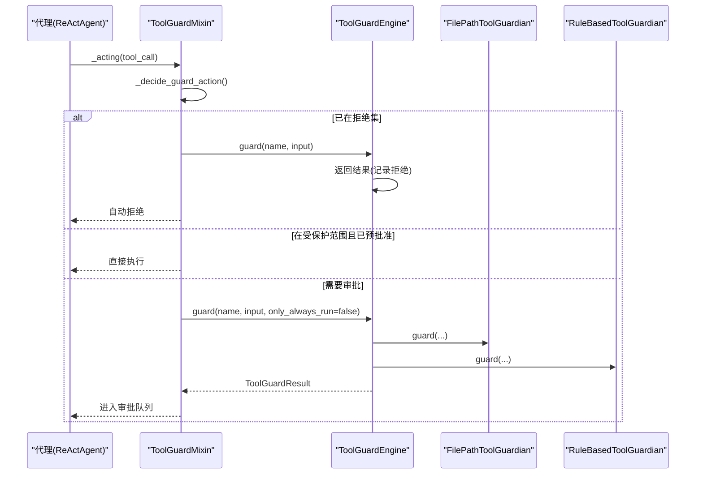
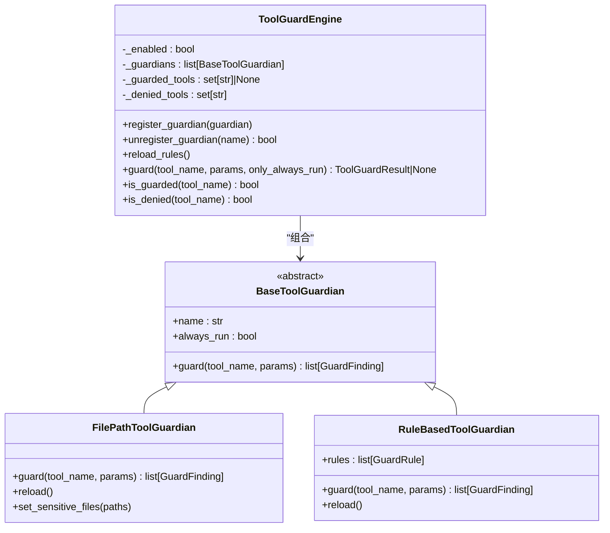
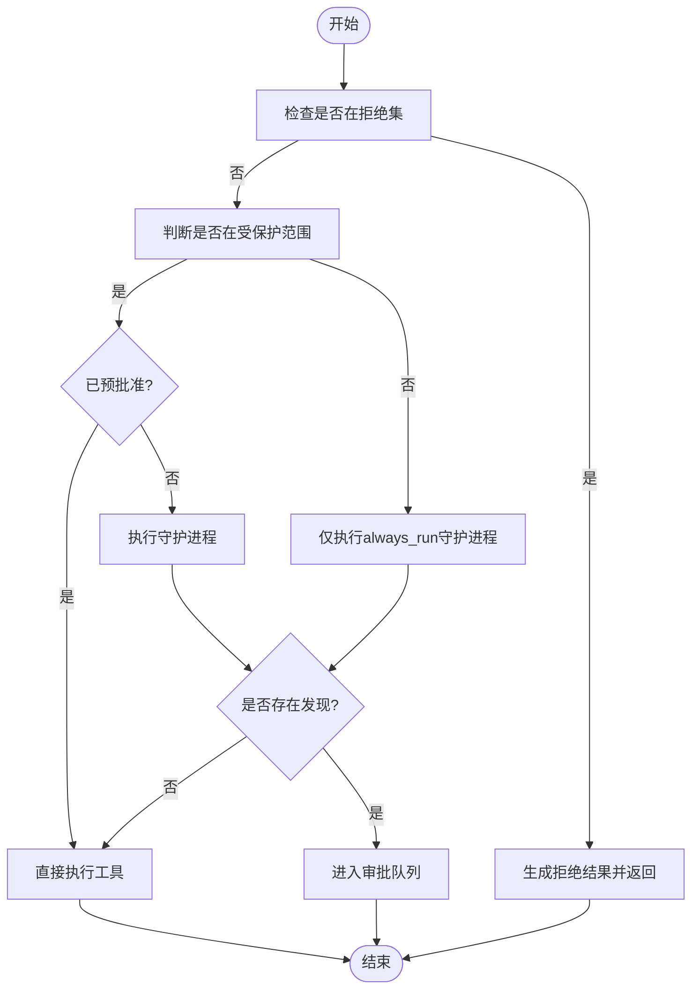
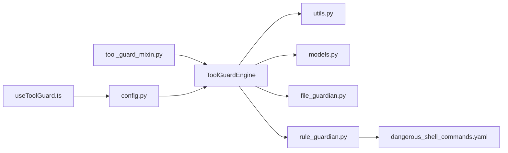

# 守卫引擎核心

<cite>
**本文档引用的文件**
- [engine.py](file://src/qwenpaw/security/tool_guard/engine.py)
- [__init__.py](file://src/qwenpaw/security/tool_guard/__init__.py)
- [models.py](file://src/qwenpaw/security/tool_guard/models.py)
- [utils.py](file://src/qwenpaw/security/tool_guard/utils.py)
- [approval.py](file://src/qwenpaw/security/tool_guard/approval.py)
- [guardians/__init__.py](file://src/qwenpaw/security/tool_guard/guardians/__init__.py)
- [file_guardian.py](file://src/qwenpaw/security/tool_guard/guardians/file_guardian.py)
- [rule_guardian.py](file://src/qwenpaw/security/tool_guard/guardians/rule_guardian.py)
- [dangerous_shell_commands.yaml](file://src/qwenpaw/security/tool_guard/rules/dangerous_shell_commands.yaml)
- [tool_guard_mixin.py](file://src/qwenpaw/agents/tool_guard_mixin.py)
- [config.py](file://src/qwenpaw/app/routers/config.py)
- [useToolGuard.ts](file://console/src/pages/Settings//useToolGuard.ts)
</cite>

## 目录
1. [简介](#简介)
2. [项目结构](#项目结构)
3. [核心组件](#核心组件)
4. [架构总览](#架构总览)
5. [详细组件分析](#详细组件分析)
6. [依赖分析](#依赖分析)
7. [性能考虑](#性能考虑)
8. [故障排除指南](#故障排除指南)
9. [结论](#结论)
10. [附录](#附录)

## 简介
本文件面向QwenPaw守卫引擎核心，聚焦ToolGuardEngine类的设计与实现，系统阐述其单例模式、守护进程注册机制、工具调用拦截流程、引擎初始化与配置管理、执行时序控制、参数验证与安全检查聚合、结果汇总机制、配置选项、性能监控与错误处理策略，并提供扩展接口、自定义守护进程集成与规则重载的实现指南。

## 项目结构
守卫引擎位于安全子系统中，采用“引擎编排 + 多守护进程”的插件化架构。核心文件组织如下：
- 引擎与编排：engine.py、__init__.py
- 数据模型：models.py（结果、发现、严重级别、威胁类别）
- 配置解析与日志：utils.py（受保护工具集、拒绝工具集、结构化日志）
- 审批辅助：approval.py（审批决策、摘要格式化）
- 守护进程基类与实现：guardians/__init__.py、file_guardian.py、rule_guardian.py
- 规则：rules/dangerous_shell_commands.yaml
- 集成入口：agents/tool_guard_mixin.py（代理拦截）、app/routers/config.py（HTTP配置接口）、console前端useToolGuard.ts（控制台配置）

图表来源
- [engine.py:53-237](file://src/qwenpaw/security/tool_guard/engine.py#L53-L237)
- [models.py:103-185](file://src/qwenpaw/security/tool_guard/models.py#L103-L185)
- [utils.py:64-164](file://src/qwenpaw/security/tool_guard/utils.py#L64-L164)
- [guardians/__init__.py:17-62](file://src/qwenpaw/security/tool_guard/guardians/__init__.py#L17-L62)
- [file_guardian.py:184-365](file://src/qwenpaw/security/tool_guard/guardians/file_guardian.py#L184-L365)
- [rule_guardian.py:559-758](file://src/qwenpaw/security/tool_guard/guardians/rule_guardian.py#L559-L758)
- [dangerous_shell_commands.yaml:1-187](file://src/qwenpaw/security/tool_guard/rules/dangerous_shell_commands.yaml#L1-L187)
- [tool_guard_mixin.py:45-200](file://src/qwenpaw/agents/tool_guard_mixin.py#L45-L200)
- [config.py:426-519](file://src/qwenpaw/app/routers/config.py#L426-L519)
- [useToolGuard.ts:1-95](file://console/src/pages/Settings//useToolGuard.ts#L1-L95)

章节来源
- [engine.py:1-238](file://src/qwenpaw/security/tool_guard/engine.py#L1-L238)
- [__init__.py:1-59](file://src/qwenpaw/security/tool_guard/__init__.py#L1-L59)

## 核心组件
- ToolGuardEngine：编排器，负责守护进程注册、规则重载、工具范围与拒绝集解析、拦截执行与结果聚合、性能计时与异常容错。
- BaseToolGuardian：抽象基类，定义统一的guard接口，支持always_run标记以强制在非守卫范围内也运行（如敏感路径检查）。
- FilePathToolGuardian：基于敏感文件/目录白名单的路径级阻断，支持命令字符串中的路径提取与规范化。
- RuleBasedToolGuardian：基于YAML规则的正则签名匹配，支持内置规则、自定义规则与禁用规则，具备工作区边界检查等增强逻辑。
- ToolGuardResult/GuardFinding：结果与发现的数据结构，提供严重级别聚合、分类统计与序列化输出。
- 工具函数：resolve_guarded_tools/resolve_denied_tools、log_findings等，支撑配置解析与结构化日志。
- 集成入口：ToolGuardMixin在代理执行前进行拦截、审批与回放；HTTP路由提供开关与规则重载；控制台提供可视化配置。

章节来源
- [engine.py:53-237](file://src/qwenpaw/security/tool_guard/engine.py#L53-L237)
- [guardians/__init__.py:17-62](file://src/qwenpaw/security/tool_guard/guardians/__init__.py#L17-L62)
- [file_guardian.py:184-365](file://src/qwenpaw/security/tool_guard/guardians/file_guardian.py#L184-L365)
- [rule_guardian.py:559-758](file://src/qwenpaw/security/tool_guard/guardians/rule_guardian.py#L559-L758)
- [models.py:103-185](file://src/qwenpaw/security/tool_guard/models.py#L103-L185)
- [utils.py:64-164](file://src/qwenpaw/security/tool_guard/utils.py#L64-L164)

## 架构总览
ToolGuardEngine采用延迟单例模式，按需加载默认守护进程（文件路径检查 + 规则匹配），并通过配置解析确定受保护工具集合与拒绝工具集合。代理在执行工具调用前通过ToolGuardMixin拦截，根据是否在受保护范围、是否已预批准、是否存在高危发现决定进入审批流程或直接执行。

图表来源
- [tool_guard_mixin.py:261-593](file://src/qwenpaw/agents/tool_guard_mixin.py#L261-L593)
- [engine.py:169-226](file://src/qwenpaw/security/tool_guard/engine.py#L169-L226)
- [file_guardian.py:313-365](file://src/qwenpaw/security/tool_guard/guardians/file_guardian.py#L313-L365)
- [rule_guardian.py:608-758](file://src/qwenpaw/security/tool_guard/guardians/rule_guardian.py#L608-L758)

## 详细组件分析

### ToolGuardEngine 设计与实现
- 单例模式：通过全局变量与懒加载工厂函数实现延迟初始化，避免启动开销。
- 初始化与默认守护进程：构造时可显式传入守护进程列表，否则自动装配文件路径守护与规则守护，失败时记录警告但不中断。
- 守护进程注册：支持动态注册/注销，便于扩展新类型守护进程。
- 工具范围与拒绝集：从环境变量、配置文件、硬编码默认值多源解析，支持通配符与空值语义。
- 规则重载：遍历所有守护进程调用reload（若存在），随后刷新工具集合。
- 拦截执行：按only_always_run筛选守护进程，逐个执行guard，聚合findings与失败信息，记录耗时。
- 错误处理：守护进程异常被记录并计入失败列表，不影响整体返回；当引擎关闭时直接返回None。

图表来源
- [engine.py:53-237](file://src/qwenpaw/security/tool_guard/engine.py#L53-L237)
- [guardians/__init__.py:17-62](file://src/qwenpaw/security/tool_guard/guardians/__init__.py#L17-L62)
- [file_guardian.py:184-365](file://src/qwenpaw/security/tool_guard/guardians/file_guardian.py#L184-L365)
- [rule_guardian.py:559-758](file://src/qwenpaw/security/tool_guard/guardians/rule_guardian.py#L559-L758)

章节来源
- [engine.py:53-237](file://src/qwenpaw/security/tool_guard/engine.py#L53-L237)

### 守护进程注册机制
- 注册：register_guardian追加守护进程；unregister_guardian按名称过滤；可通过属性读取当前守护进程名称列表。
- always_run：部分守护进程（如文件路径检查）设置always_run=True，确保即使工具不在受保护范围也会执行。
- 动态重载：reload_rules遍历守护进程调用reload（若实现），随后刷新受保护/拒绝工具集。

章节来源
- [engine.py:108-154](file://src/qwenpaw/security/tool_guard/engine.py#L108-L154)
- [file_guardian.py:244-247](file://src/qwenpaw/security/tool_guard/guardians/file_guardian.py#L244-L247)
- [rule_guardian.py:590-593](file://src/qwenpaw/security/tool_guard/guardians/rule_guardian.py#L590-L593)

### 工具调用拦截流程
- 拦截点：ToolGuardMixin在代理执行工具调用前介入，区分拒绝集、预批准、需要审批三类路径。
- 拒绝集：命中denied_tools直接返回拒绝结果，不进入审批。
- 预批准：受保护范围且已获得一次性预批准时直接执行。
- 审批：对非受保护工具仅执行always_run守护进程；对受保护工具执行全部守护进程，若有高危发现则进入审批队列。
- 结果汇总：使用log_findings输出结构化日志，格式化摘要供UI展示。

图表来源
- [tool_guard_mixin.py:261-593](file://src/qwenpaw/agents/tool_guard_mixin.py#L261-L593)
- [utils.py:129-164](file://src/qwenpaw/security/tool_guard/utils.py#L129-L164)

章节来源
- [tool_guard_mixin.py:261-593](file://src/qwenpaw/agents/tool_guard_mixin.py#L261-L593)

### 引擎初始化与配置管理
- 启动时序：ToolGuardEngine构造时解析启用状态（环境变量优先于配置文件），初始化默认守护进程并加载工具集合。
- 配置来源：
  - 启用开关：环境变量QWENPAW_TOOL_GUARD_ENABLED > config.json > 默认开启
  - 受保护工具集：constructor/user-defined > 环境变量QWENPAW_TOOL_GUARD_TOOLS > 配置security.tool_guard.guarded_tools > 内置高风险集合
  - 拒绝工具集：constructor/user-defined > 环境变量QWENPAW_TOOL_GUARD_DENIED_TOOLS > 配置security.tool_guard.denied_tools > 空集
- 规则重载：HTTP路由更新开关后调用reload_rules，触发守护进程与工具集合刷新。

章节来源
- [engine.py:35-51](file://src/qwenpaw/security/tool_guard/engine.py#L35-L51)
- [utils.py:64-127](file://src/qwenpaw/security/tool_guard/utils.py#L64-L127)
- [config.py:426-430](file://src/qwenpaw/app/routers/config.py#L426-L430)

### 执行时序控制
- 计时：guard方法在执行前后记录monotonic时间差，用于性能监控与审计。
- 并发：代理拦截在锁内做决策，实际工具执行在锁外并行，保证状态一致性同时最大化吞吐。
- 失败容忍：守护进程异常被捕获并记录，不影响其他守护进程执行与最终结果。

章节来源
- [engine.py:197-226](file://src/qwenpaw/security/tool_guard/engine.py#L197-L226)
- [tool_guard_mixin.py:272-277](file://src/qwenpaw/agents/tool_guard_mixin.py#L272-L277)

### 参数验证、安全检查聚合与结果汇总
- 参数扫描：RuleBasedToolGuardian将每个参数值转为字符串后进行正则匹配；FilePathToolGuardian对shell命令提取路径并规范化比对敏感目录。
- 聚合策略：ToolGuardEngine收集各守护进程的findings，记录使用的守护进程与失败项，计算最大严重级别与发现数量。
- 结果输出：ToolGuardResult提供to_dict序列化，包含时间戳、耗时、守护进程列表与失败详情；GuardFinding包含规则ID、类别、严重级别、描述、修复建议、匹配片段等字段。

章节来源
- [rule_guardian.py:608-758](file://src/qwenpaw/security/tool_guard/guardians/rule_guardian.py#L608-L758)
- [file_guardian.py:313-365](file://src/qwenpaw/security/tool_guard/guardians/file_guardian.py#L313-L365)
- [models.py:103-185](file://src/qwenpaw/security/tool_guard/models.py#L103-L185)

### 引擎配置选项
- 启用开关：QWENPAW_TOOL_GUARD_ENABLED
- 受保护工具集：QWENPAW_TOOL_GUARD_TOOLS（支持*, all, none/off/false/0）
- 拒绝工具集：QWENPAW_TOOL_GUARD_DENIED_TOOLS（逗号分隔）
- 配置文件：security.tool_guard.enabled、guarded_tools、denied_tools、custom_rules、disabled_rules
- 文件路径守护：security.file_guard.enabled、sensitive_files

章节来源
- [utils.py:64-127](file://src/qwenpaw/security/tool_guard/utils.py#L64-L127)
- [config.py:426-430](file://src/qwenpaw/app/routers/config.py#L426-L430)
- [config.py:489-519](file://src/qwenpaw/app/routers/config.py#L489-L519)

### 性能监控与错误处理策略
- 性能监控：guard_duration_seconds记录单次拦截耗时；控制台可查看规则与路径检查的耗时统计。
- 错误处理：守护进程异常记录warning日志并加入guardians_failed；引擎关闭时guard返回None；代理拦截异常被记录但不阻断后续执行。
- 日志规范：log_findings按严重级别选择日志级别，输出规则ID、工具名、参数名、描述与匹配值摘要。

章节来源
- [engine.py:197-226](file://src/qwenpaw/security/tool_guard/engine.py#L197-L226)
- [utils.py:129-164](file://src/qwenpaw/security/tool_guard/utils.py#L129-L164)
- [tool_guard_mixin.py:288-293](file://src/qwenpaw/agents/tool_guard_mixin.py#L288-L293)

### 扩展接口与规则重载机制
- 扩展接口：实现BaseToolGuardian并提供guard方法；可设置always_run以强制在非守卫范围内执行。
- 自定义守护进程集成：通过register_guardian注入；或在ToolGuardEngine构造时传入自定义列表。
- 规则重载：RuleBasedToolGuardian支持从YAML目录加载规则，结合config.json中的custom_rules与disabled_rules；HTTP路由提供开关与重载能力；控制台支持增删改内置/自定义规则与禁用ID。

章节来源
- [guardians/__init__.py:17-62](file://src/qwenpaw/security/tool_guard/guardians/__init__.py#L17-L62)
- [rule_guardian.py:583-593](file://src/qwenpaw/security/tool_guard/guardians/rule_guardian.py#L583-L593)
- [config.py:426-430](file://src/qwenpaw/app/routers/config.py#L426-L430)
- [useToolGuard.ts:1-95](file://console/src/pages/Settings//useToolGuard.ts#L1-L95)

## 依赖分析
- 组件耦合：ToolGuardEngine与守护进程松耦合，通过抽象接口与always_run策略实现可插拔；与配置解析模块解耦，通过utils函数集中处理。
- 外部依赖：YAML规则文件、配置加载、路径规范化、正则匹配、结构化日志。
- 循环依赖：未见循环导入；守护进程间无直接依赖，均由引擎统一调度。

图表来源
- [engine.py:53-237](file://src/qwenpaw/security/tool_guard/engine.py#L53-L237)
- [utils.py:64-164](file://src/qwenpaw/security/tool_guard/utils.py#L64-L164)
- [rule_guardian.py:432-510](file://src/qwenpaw/security/tool_guard/guardians/rule_guardian.py#L432-L510)
- [tool_guard_mixin.py:45-70](file://src/qwenpaw/agents/tool_guard_mixin.py#L45-L70)
- [config.py:426-519](file://src/qwenpaw/app/routers/config.py#L426-L519)
- [useToolGuard.ts:1-95](file://console/src/pages/Settings//useToolGuard.ts#L1-L95)

章节来源
- [engine.py:53-237](file://src/qwenpaw/security/tool_guard/engine.py#L53-L237)
- [rule_guardian.py:432-510](file://src/qwenpaw/security/tool_guard/guardians/rule_guardian.py#L432-L510)

## 性能考虑
- 正则预编译：RuleBasedToolGuardian在加载规则时预编译正则表达式，减少运行时开销。
- 规则过滤：先按工具/参数维度过滤适用规则，再进行匹配，降低无效扫描。
- 路径提取优化：shell命令路径提取采用最长前缀匹配与去重策略，避免重复扫描。
- 计时与日志：guard_duration_seconds用于性能观测；结构化日志便于定位热点规则与慢守护进程。
- 并行执行：代理拦截在锁外执行工具调用，提升吞吐量。

## 故障排除指南
- 守护进程异常：检查对应守护进程的reload与guard实现，关注日志中的guardians_failed条目。
- 规则加载失败：确认YAML文件语法正确与目录存在；检查disabled_rules与custom_rules配置。
- 配置未生效：确认环境变量优先级高于配置文件；通过HTTP路由或控制台确认开关与规则已重载。
- 审批流程卡住：检查会话ID与审批服务状态；查看pending信息与队列头。

章节来源
- [engine.py:214-223](file://src/qwenpaw/security/tool_guard/engine.py#L214-L223)
- [rule_guardian.py:432-464](file://src/qwenpaw/security/tool_guard/guardians/rule_guardian.py#L432-L464)
- [config.py:426-430](file://src/qwenpaw/app/routers/config.py#L426-L430)

## 结论
ToolGuardEngine通过清晰的单例编排、可插拔的守护进程体系与严格的配置解析，实现了对工具调用的前置安全拦截。其设计兼顾易扩展与高性能，既支持内置规则与路径检查，又允许用户自定义规则与守护进程。配合代理拦截、审批队列与控制台配置，形成完整的安全闭环。

## 附录
- 威胁类别与严重级别：参见数据模型中的枚举定义。
- 规则示例：dangerous_shell_commands.yaml展示了典型规则格式与覆盖场景。
- 控制台集成：useToolGuard.ts提供规则增删改与禁用操作，config.py提供HTTP接口。

章节来源
- [models.py:25-53](file://src/qwenpaw/security/tool_guard/models.py#L25-L53)
- [dangerous_shell_commands.yaml:1-187](file://src/qwenpaw/security/tool_guard/rules/dangerous_shell_commands.yaml#L1-L187)
- [useToolGuard.ts:1-95](file://console/src/pages/Settings//useToolGuard.ts#L1-L95)