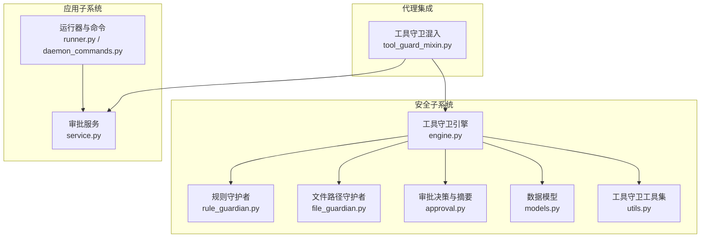
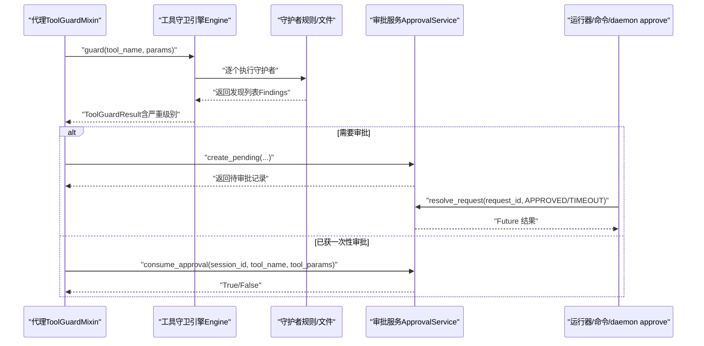
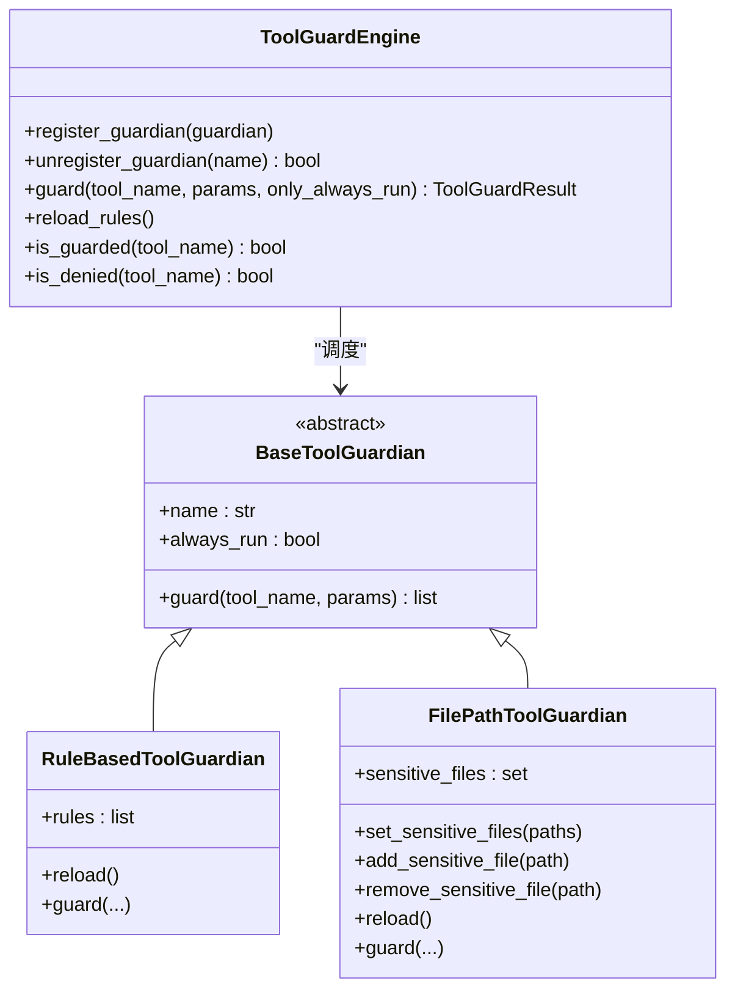
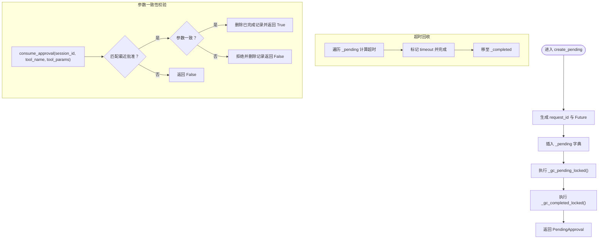
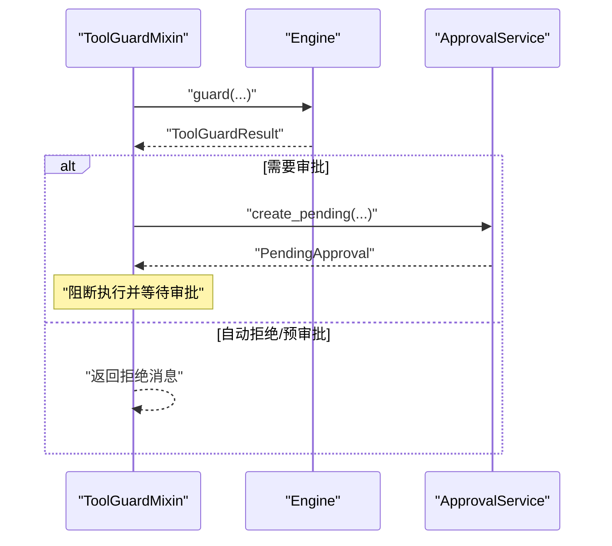
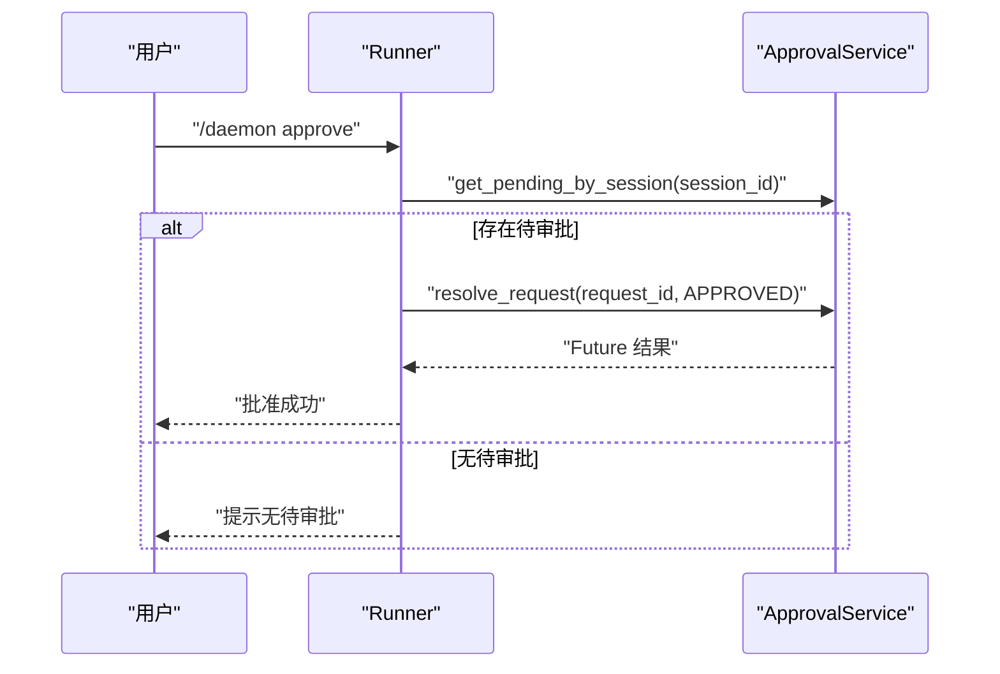
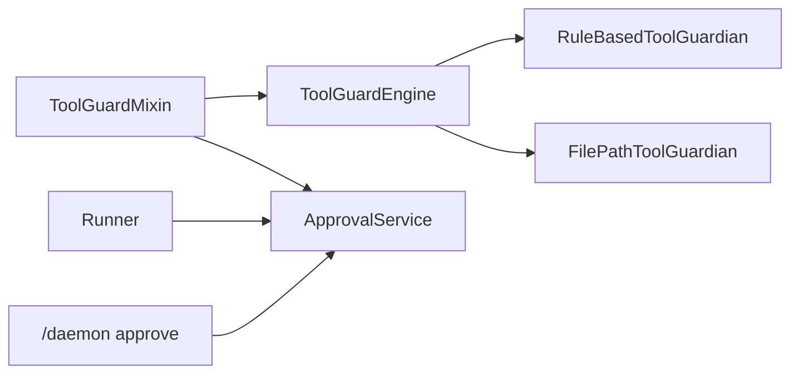

# 审批系统

<cite>
**本文引用的文件**
- [approval.py](file://src/qwenpaw/security/tool_guard/approval.py)
- [engine.py](file://src/qwenpaw/security/tool_guard/engine.py)
- [models.py](file://src/qwenpaw/security/tool_guard/models.py)
- [service.py](file://src/qwenpaw/app/approvals/service.py)
- [tool_guard_mixin.py](file://src/qwenpaw/agents/tool_guard_mixin.py)
- [daemon_commands.py](file://src/qwenpaw/app/runner/daemon_commands.py)
- [runner.py](file://src/qwenpaw/app/runner/runner.py)
- [file_guardian.py](file://src/qwenpaw/security/tool_guard/guardians/file_guardian.py)
- [rule_guardian.py](file://src/qwenpaw/security/tool_guard/guardians/rule_guardian.py)
- [utils.py](file://src/qwenpaw/security/tool_guard/utils.py)
</cite>

## 目录
1. [简介](#简介)
2. [项目结构](#项目结构)
3. [核心组件](#核心组件)
4. [架构总览](#架构总览)
5. [详细组件分析](#详细组件分析)
6. [依赖分析](#依赖分析)
7. [性能考虑](#性能考虑)
8. [故障排查指南](#故障排查指南)
9. [结论](#结论)
10. [附录](#附录)

## 简介
本技术文档围绕 QwenPaw 的“工具调用审批系统”展开，系统通过“工具守卫引擎 + 审批服务”的双层机制，实现对高风险工具调用的自动检测与人工审批控制。文档重点覆盖：
- 审批流程的实现原理与状态管理
- 审批请求生成、审批人分配与审批决策算法
- 临时授权机制、批量审批与自动过期处理
- 审批历史记录、统计分析与合规审计能力
- 审批策略配置、紧急审批与越权审批处理
- 审批通知机制、提醒与进度跟踪
- 审批模板管理、工作流定制与多级审批策略配置

## 项目结构
审批系统主要分布在如下模块：
- 安全子系统（安全扫描与守卫）
  - 工具守卫引擎与守护者：负责规则加载、威胁检测与结果聚合
  - 审批决策与摘要格式化：定义审批结果枚举与摘要输出
  - 数据模型：统一的威胁发现、结果与严重级别定义
- 应用子系统（审批服务）
  - 审批服务：集中管理待审批与已完成审批记录，支持超时回收与参数校验
  - 运行器与命令解析：处理 /daemon approve 等控制命令，驱动审批流转
- 代理集成（工具守卫混入）
  - 在代理执行工具调用前进行守卫检查，必要时创建待审批记录并阻断执行

图表来源
- [engine.py:53-238](file://src/qwenpaw/security/tool_guard/engine.py#L53-L238)
- [rule_guardian.py:559-758](file://src/qwenpaw/security/tool_guard/guardians/rule_guardian.py#L559-L758)
- [file_guardian.py:184-365](file://src/qwenpaw/security/tool_guard/guardians/file_guardian.py#L184-L365)
- [approval.py:12-42](file://src/qwenpaw/security/tool_guard/approval.py#L12-L42)
- [models.py:25-185](file://src/qwenpaw/security/tool_guard/models.py#L25-L185)
- [utils.py:64-127](file://src/qwenpaw/security/tool_guard/utils.py#L64-L127)
- [service.py:58-341](file://src/qwenpaw/app/approvals/service.py#L58-L341)
- [runner.py:264-325](file://src/qwenpaw/app/runner/runner.py#L264-L325)
- [daemon_commands.py:205-240](file://src/qwenpaw/app/runner/daemon_commands.py#L205-L240)
- [tool_guard_mixin.py:57-593](file://src/qwenpaw/agents/tool_guard_mixin.py#L57-L593)

章节来源
- [engine.py:53-238](file://src/qwenpaw/security/tool_guard/engine.py#L53-L238)
- [service.py:58-341](file://src/qwenpaw/app/approvals/service.py#L58-L341)

## 核心组件
- 工具守卫引擎（ToolGuardEngine）
  - 职责：注册与调度各类守护者，按配置决定是否守卫、是否拒绝；聚合结果并返回 ToolGuardResult
  - 关键点：支持默认守护者集合（路径与规则），可动态注册/注销守护者；支持重载规则与受控工具集
- 守护者（Guardians）
  - 规则守护者：基于 YAML 规则的正则匹配，支持工作区外 rm 文件检测等增强提示
  - 文件路径守护者：基于敏感文件/目录白/黑名单的路径阻断
- 审批服务（ApprovalService）
  - 职责：集中存储待审批与已完成审批记录；提供创建、查询、取消旧待审、消费一次性审批、超时回收等功能
  - 关键点：使用 Future 驱动异步审批；严格的内存回收策略；支持按会话 FIFO 处理
- 运行器与命令（Runner/Daemon Commands）
  - 职责：解析 /daemon approve 命令，触发审批决策；在超时阈值内响应用户批准，否则自动拒绝
- 代理混入（ToolGuardMixin）
  - 职责：在代理执行工具调用前进行守卫检查；当需要审批时，阻断执行并创建待审批记录；支持预审批令牌消费

章节来源
- [engine.py:53-238](file://src/qwenpaw/security/tool_guard/engine.py#L53-L238)
- [rule_guardian.py:559-758](file://src/qwenpaw/security/tool_guard/guardians/rule_guardian.py#L559-L758)
- [file_guardian.py:184-365](file://src/qwenpaw/security/tool_guard/guardians/file_guardian.py#L184-L365)
- [service.py:58-341](file://src/qwenpaw/app/approvals/service.py#L58-L341)
- [runner.py:264-325](file://src/qwenpaw/app/runner/runner.py#L264-L325)
- [daemon_commands.py:205-240](file://src/qwenpaw/app/runner/daemon_commands.py#L205-L240)
- [tool_guard_mixin.py:57-593](file://src/qwenpaw/agents/tool_guard_mixin.py#L57-L593)

## 架构总览
下图展示从代理发起工具调用到审批完成的关键交互：

图表来源
- [tool_guard_mixin.py:372-593](file://src/qwenpaw/agents/tool_guard_mixin.py#L372-L593)
- [engine.py:169-226](file://src/qwenpaw/security/tool_guard/engine.py#L169-L226)
- [service.py:80-135](file://src/qwenpaw/app/approvals/service.py#L80-L135)
- [runner.py:264-325](file://src/qwenpaw/app/runner/runner.py#L264-L325)
- [daemon_commands.py:205-240](file://src/qwenpaw/app/runner/daemon_commands.py#L205-L240)

## 详细组件分析

### 组件A：工具守卫引擎与守护者
- 设计要点
  - 守卫范围与拒绝工具集由配置/环境变量解析，支持通配与空集
  - 守护者按 always_run 与否分组执行，减少不必要的扫描
  - 引擎聚合所有守护者的发现，形成 ToolGuardResult，并记录耗时与失败守护者
- 规则守护者增强
  - 对危险 rm 命令进行工作区边界检测，附加“工作区外文件”提示与修复建议
  - 支持自定义规则与禁用规则 ID，便于组织级策略扩展
- 文件路径守护者
  - 将相对路径解析为工作区绝对路径，支持目录与文件两种阻断模式
  - 兼容历史秘密目录名，避免误判

图表来源
- [engine.py:53-238](file://src/qwenpaw/security/tool_guard/engine.py#L53-L238)
- [rule_guardian.py:559-758](file://src/qwenpaw/security/tool_guard/guardians/rule_guardian.py#L559-L758)
- [file_guardian.py:184-365](file://src/qwenpaw/security/tool_guard/guardians/file_guardian.py#L184-L365)

章节来源
- [engine.py:53-238](file://src/qwenpaw/security/tool_guard/engine.py#L53-L238)
- [rule_guardian.py:559-758](file://src/qwenpaw/security/tool_guard/guardians/rule_guardian.py#L559-L758)
- [file_guardian.py:184-365](file://src/qwenpaw/security/tool_guard/guardians/file_guardian.py#L184-L365)

### 组件B：审批服务与状态管理
- 数据模型
  - PendingApproval：待审批记录，包含请求 ID、会话 ID、用户 ID、渠道、工具名、创建时间、Future、状态、摘要、发现数量、额外信息等
- 生命周期
  - 创建：generate_uuid + Future + 写入待审批字典
  - 解决：从待审批移除并写入已完成字典，设置状态与完成时间
  - 查询：按 ID 或按会话获取待审批队列（FIFO）
  - 取消旧待审：当同一逻辑工具调用被重放时，取消旧待审以避免孤儿记录
  - 消费一次性审批：在会话内核验最近一次批准，支持参数一致性校验
- 回收策略
  - 待审批超时：超过阈值自动设为 TIMEOUT 并归档
  - 完成记录超龄与溢出：按时间与数量上限清理
- 通知
  - 服务持有通道管理器引用，可用于推送通知（当前未在代码中直接体现）

图表来源
- [service.py:80-135](file://src/qwenpaw/app/approvals/service.py#L80-L135)
- [service.py:174-262](file://src/qwenpaw/app/approvals/service.py#L174-L262)
- [service.py:268-326](file://src/qwenpaw/app/approvals/service.py#L268-L326)

章节来源
- [service.py:58-341](file://src/qwenpaw/app/approvals/service.py#L58-L341)

### 组件C：代理混入与审批触发
- 触发条件
  - 当存在 session_id 且工具被守卫引擎判定为需要审批时，阻断执行并创建待审批记录
- 预审批与自动拒绝
  - 若工具被自动拒绝或处于预审批窗口，直接返回拒绝消息并清理历史拒绝消息
- 审批后执行
  - 审批通过后恢复原始工具调用，支持兄弟工具调用链与剩余队列传递

图表来源
- [tool_guard_mixin.py:372-593](file://src/qwenpaw/agents/tool_guard_mixin.py#L372-L593)
- [service.py:80-135](file://src/qwenpaw/app/approvals/service.py#L80-L135)

章节来源
- [tool_guard_mixin.py:57-593](file://src/qwenpaw/agents/tool_guard_mixin.py#L57-L593)

### 组件D：运行器与命令解析
- /daemon approve
  - 查找当前会话的最老待审批项，若不存在则提示无待审批
  - 成功时返回批准确认信息
- 超时处理
  - 在超时阈值内响应批准；超时后自动拒绝并通知

图表来源
- [daemon_commands.py:205-240](file://src/qwenpaw/app/runner/daemon_commands.py#L205-L240)
- [runner.py:264-325](file://src/qwenpaw/app/runner/runner.py#L264-L325)

章节来源
- [daemon_commands.py:205-240](file://src/qwenpaw/app/runner/daemon_commands.py#L205-L240)
- [runner.py:264-325](file://src/qwenpaw/app/runner/runner.py#L264-L325)

## 依赖分析
- 组件耦合
  - ToolGuardMixin 依赖 ApprovalService 与 ToolGuardEngine；两者解耦于 ApprovalService 单例
  - Engine 依赖守护者集合，守护者之间相互独立
  - Runner 仅通过 ApprovalService 的公开接口进行审批决议
- 外部依赖
  - 配置解析：通过配置上下文读取安全策略与工具集
  - 环境变量：用于开关与工具集覆盖
- 循环依赖
  - 未见循环导入；ApprovalService 单例通过函数延迟初始化

图表来源
- [tool_guard_mixin.py:57-70](file://src/qwenpaw/agents/tool_guard_mixin.py#L57-L70)
- [engine.py:53-118](file://src/qwenpaw/security/tool_guard/engine.py#L53-L118)
- [service.py:58-75](file://src/qwenpaw/app/approvals/service.py#L58-L75)
- [runner.py:264-325](file://src/qwenpaw/app/runner/runner.py#L264-L325)
- [daemon_commands.py:205-240](file://src/qwenpaw/app/runner/daemon_commands.py#L205-L240)

章节来源
- [tool_guard_mixin.py:57-70](file://src/qwenpaw/agents/tool_guard_mixin.py#L57-L70)
- [engine.py:53-118](file://src/qwenpaw/security/tool_guard/engine.py#L53-L118)
- [service.py:58-75](file://src/qwenpaw/app/approvals/service.py#L58-L75)
- [runner.py:264-325](file://src/qwenpaw/app/runner/runner.py#L264-L325)
- [daemon_commands.py:205-240](file://src/qwenpaw/app/runner/daemon_commands.py#L205-L240)

## 性能考虑
- 守卫扫描
  - 规则守护者对字符串表示进行正则匹配，建议合理配置规则数量与复杂度，避免长规则导致扫描耗时上升
  - 文件路径守护者对路径进行标准化与工作区解析，建议限制敏感路径数量
- 审批服务
  - 使用 Future 驱动异步审批，避免阻塞主线程
  - 回收策略按时间与数量上限控制内存占用，建议根据并发量调整阈值
- 代理混入
  - 在工具调用前进行守卫检查，建议将高成本守护者置于 only_always_run 分支，降低非守卫范围内的开销

## 故障排查指南
- 无待审批记录
  - 症状：/daemon approve 返回“无待审批”
  - 排查：确认代理是否正确传入 session_id；检查工具是否被守卫引擎判定为需要审批
- 审批超时
  - 症状：超时后自动拒绝
  - 排查：检查审批超时阈值；确认审批流程是否被阻塞
- 参数不一致导致一次性审批被拒绝
  - 症状：consume_approval 返回 False
  - 排查：确认工具参数是否与批准时一致；避免参数漂移
- 规则加载异常
  - 症状：规则未生效或报错
  - 排查：检查 YAML 规则语法；确认禁用规则 ID 列表；验证自定义规则字段

章节来源
- [daemon_commands.py:205-240](file://src/qwenpaw/app/runner/daemon_commands.py#L205-L240)
- [runner.py:264-325](file://src/qwenpaw/app/runner/runner.py#L264-L325)
- [service.py:217-262](file://src/qwenpaw/app/approvals/service.py#L217-L262)
- [rule_guardian.py:432-510](file://src/qwenpaw/security/tool_guard/guardians/rule_guardian.py#L432-L510)

## 结论
QwenPaw 的审批系统通过“工具守卫引擎 + 审批服务”的协同，实现了对高风险工具调用的自动化识别与可控审批。系统具备完善的生命周期管理、超时回收与参数一致性校验，满足合规与安全要求。通过可插拔的守护者与灵活的配置策略，可在不同场景下快速适配审批策略与工作流。

## 附录

### 审批流程与状态管理机制
- 审批请求生成
  - 守卫引擎返回高危发现后，代理创建待审批记录并阻断执行
- 审批人分配
  - 当前实现按会话 FIFO 顺序处理，未内置角色/权限分配逻辑
- 审批决策算法
  - /daemon approve 成功时将状态置为 approved；超时自动置为 timeout；拒绝时直接归档
- 临时授权与批量审批
  - 支持一次性审批消费，防止参数漂移；批量审批需在上层业务逻辑中扩展
- 自动过期处理
  - 待审批超时自动归档；完成记录按时间与数量上限回收

章节来源
- [tool_guard_mixin.py:57-593](file://src/qwenpaw/agents/tool_guard_mixin.py#L57-L593)
- [service.py:80-135](file://src/qwenpaw/app/approvals/service.py#L80-L135)
- [runner.py:264-325](file://src/qwenpaw/app/runner/runner.py#L264-L325)

### 审批历史记录、统计分析与合规审计
- 历史记录
  - 完成记录包含请求 ID、会话 ID、工具名、状态、摘要、发现数量、额外信息等
- 统计分析
  - 可基于完成记录统计各工具的审批通过率、拒绝率与超时率
- 合规审计
  - 审批记录可作为审计证据；建议结合日志系统导出与归档

章节来源
- [service.py:35-51](file://src/qwenpaw/app/approvals/service.py#L35-L51)
- [service.py:302-326](file://src/qwenpaw/app/approvals/service.py#L302-L326)

### 审批策略配置、紧急审批与越权审批处理
- 策略配置
  - 工具守卫开关、受控工具集、拒绝工具集可通过环境变量与配置文件覆盖
  - 规则守护者支持自定义规则与禁用规则 ID
- 紧急审批
  - 可通过缩短审批超时阈值或在上层增加紧急通道（需扩展 Runner 与命令解析）
- 越权审批
  - 当前未实现越权审批逻辑，建议在审批服务中引入角色/权限校验并在命令解析处拦截

章节来源
- [utils.py:64-127](file://src/qwenpaw/security/tool_guard/utils.py#L64-L127)
- [engine.py:148-164](file://src/qwenpaw/security/tool_guard/engine.py#L148-L164)
- [rule_guardian.py:518-552](file://src/qwenpaw/security/tool_guard/guardians/rule_guardian.py#L518-L552)

### 审批通知机制、提醒与进度跟踪
- 通知
  - 审批服务持有通道管理器引用，可用于推送通知（当前未在代码中直接体现）
- 提醒
  - 可在代理侧或上层业务中实现定时提醒与进度跟踪
- 进度跟踪
  - 通过查询待审批队列与完成记录实现

章节来源
- [service.py:72-74](file://src/qwenpaw/app/approvals/service.py#L72-L74)
- [service.py:144-172](file://src/qwenpaw/app/approvals/service.py#L144-L172)

### 审批模板管理、工作流定制与多级审批策略
- 模板管理
  - 可通过规则守护者与文件路径守护者的配置实现模板化策略
- 工作流定制
  - 通过守护者注册与规则加载实现工作流定制；建议在 Runner 中扩展命令以支持多级审批
- 多级审批
  - 当前未实现多级审批，建议在审批服务中引入审批层级与路由逻辑，并在命令解析处扩展

章节来源
- [engine.py:108-118](file://src/qwenpaw/security/tool_guard/engine.py#L108-L118)
- [rule_guardian.py:583-593](file://src/qwenpaw/security/tool_guard/guardians/rule_guardian.py#L583-L593)
- [file_guardian.py:244-247](file://src/qwenpaw/security/tool_guard/guardians/file_guardian.py#L244-L247)