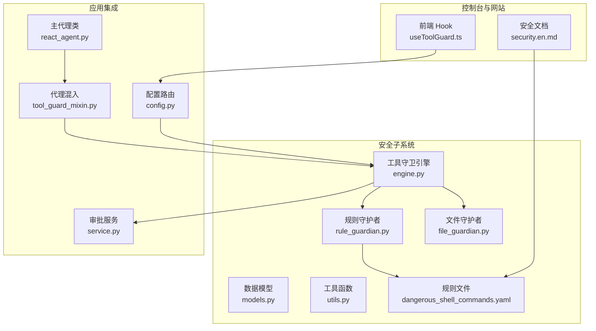
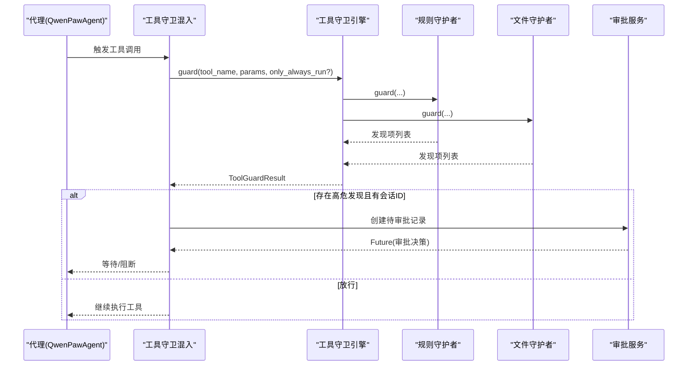
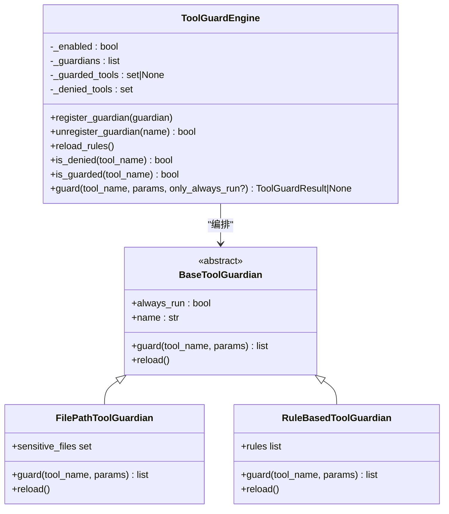
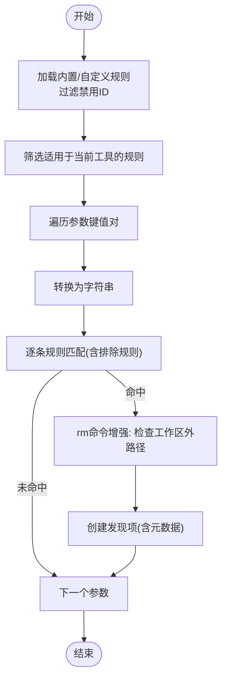
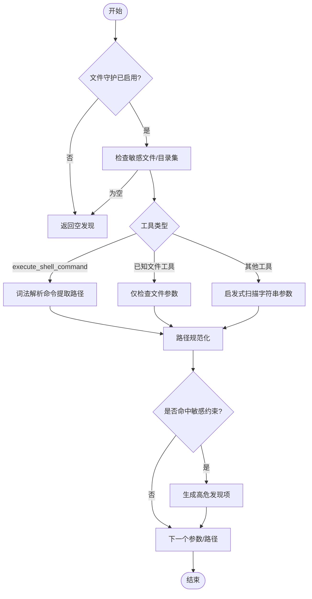
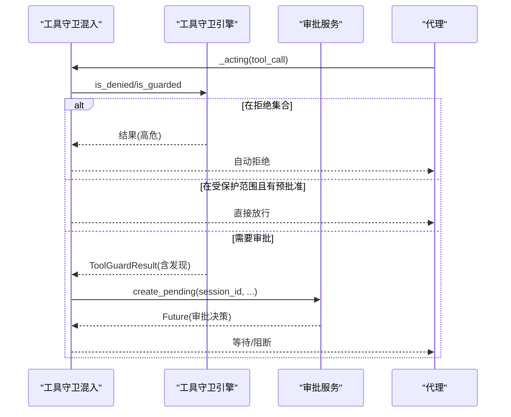
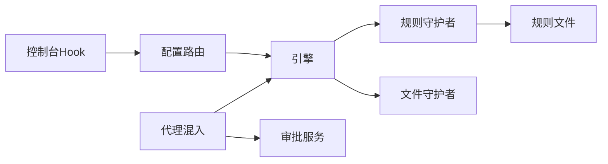

# 工具守卫机制

<cite>
**本文档引用的文件**
- [engine.py](file://src/qwenpaw/security/tool_guard/engine.py)
- [approval.py](file://src/qwenpaw/security/tool_guard/approval.py)
- [file_guardian.py](file://src/qwenpaw/security/tool_guard/guardians/file_guardian.py)
- [rule_guardian.py](file://src/qwenpaw/security/tool_guard/guardians/rule_guardian.py)
- [models.py](file://src/qwenpaw/security/tool_guard/models.py)
- [utils.py](file://src/qwenpaw/security/tool_guard/utils.py)
- [dangerous_shell_commands.yaml](file://src/qwenpaw/security/tool_guard/rules/dangerous_shell_commands.yaml)
- [tool_guard_mixin.py](file://src/qwenpaw/agents/tool_guard_mixin.py)
- [react_agent.py](file://src/qwenpaw/agents/react_agent.py)
- [service.py](file://src/qwenpaw/app/approvals/service.py)
- [config.py](file://src/qwenpaw/app/routers/config.py)
- [useToolGuard.ts](file://console/src/pages/Settings/Security/useToolGuard.ts)
- [security.en.md](file://website/public/docs/security.en.md)
</cite>

## 目录
1. [简介](#简介)
2. [项目结构](#项目结构)
3. [核心组件](#核心组件)
4. [架构总览](#架构总览)
5. [详细组件分析](#详细组件分析)
6. [依赖关系分析](#依赖关系分析)
7. [性能考虑](#性能考虑)
8. [故障排除指南](#故障排除指南)
9. [结论](#结论)
10. [附录](#附录)

## 简介
本文件系统性阐述 QwenPaw 的工具守卫机制，覆盖工具调用安全验证的实现原理与执行流程，包括危险命令检测算法、规则引擎配置与策略定制方法、文件守护与规则守护的具体实现、默认危险命令规则集、自定义规则添加与规则优先级管理、工具调用审批流程、白名单机制与临时授权策略、实时监控与阻断机制以及告警通知流程，并提供常见攻击模式识别、误报处理与安全策略优化建议。

## 项目结构
工具守卫机制主要分布在以下模块：
- 安全子系统：规则引擎、守护者、模型与工具函数
- 应用集成：代理混入（拦截工具调用）、审批服务、HTTP 接口
- 控制台与网站：规则管理界面与文档

**图表来源**
- [engine.py:53-238](file://src/qwenpaw/security/tool_guard/engine.py#L53-L238)
- [rule_guardian.py:559-758](file://src/qwenpaw/security/tool_guard/guardians/rule_guardian.py#L559-L758)
- [file_guardian.py:184-365](file://src/qwenpaw/security/tool_guard/guardians/file_guardian.py#L184-L365)
- [models.py:60-185](file://src/qwenpaw/security/tool_guard/models.py#L60-L185)
- [utils.py:19-164](file://src/qwenpaw/security/tool_guard/utils.py#L19-L164)
- [dangerous_shell_commands.yaml:1-187](file://src/qwenpaw/security/tool_guard/rules/dangerous_shell_commands.yaml#L1-L187)
- [tool_guard_mixin.py:45-200](file://src/qwenpaw/agents/tool_guard_mixin.py#L45-L200)
- [react_agent.py:69-100](file://src/qwenpaw/agents/react_agent.py#L69-L100)
- [service.py:58-200](file://src/qwenpaw/app/approvals/service.py#L58-L200)
- [config.py:426-519](file://src/qwenpaw/app/routers/config.py#L426-L519)
- [useToolGuard.ts:1-47](file://console/src/pages/Settings/Security/useToolGuard.ts#L1-L47)
- [security.en.md:108-147](file://website/public/docs/security.en.md#L108-L147)

**章节来源**
- [engine.py:1-238](file://src/qwenpaw/security/tool_guard/engine.py#L1-L238)
- [rule_guardian.py:1-758](file://src/qwenpaw/security/tool_guard/guardians/rule_guardian.py#L1-L758)
- [file_guardian.py:1-365](file://src/qwenpaw/security/tool_guard/guardians/file_guardian.py#L1-L365)
- [models.py:1-185](file://src/qwenpaw/security/tool_guard/models.py#L1-L185)
- [utils.py:1-164](file://src/qwenpaw/security/tool_guard/utils.py#L1-L164)
- [dangerous_shell_commands.yaml:1-187](file://src/qwenpaw/security/tool_guard/rules/dangerous_shell_commands.yaml#L1-L187)
- [tool_guard_mixin.py:1-853](file://src/qwenpaw/agents/tool_guard_mixin.py#L1-L853)
- [react_agent.py:1-200](file://src/qwenpaw/agents/react_agent.py#L1-L200)
- [service.py:1-341](file://src/qwenpaw/app/approvals/service.py#L1-L341)
- [config.py:426-519](file://src/qwenpaw/app/routers/config.py#L426-L519)
- [useToolGuard.ts:1-47](file://console/src/pages/Settings/Security/useToolGuard.ts#L1-L47)
- [security.en.md:108-147](file://website/public/docs/security.en.md#L108-L147)

## 核心组件
- 工具守卫引擎：统一编排所有守护者，聚合结果并提供启用/禁用、范围与拒绝工具集管理、规则重载能力。
- 规则守护者：基于 YAML 规则的正则签名匹配，支持内置规则与用户自定义规则，动态加载与过滤禁用规则。
- 文件守护者：针对敏感文件/目录访问进行阻断，支持工作区边界检查与路径提取（尤其对 shell 命令）。
- 数据模型：统一的威胁分类、严重级别、发现项与结果聚合模型。
- 工具函数：配置解析（受保护工具集、拒绝工具集）、日志输出等。
- 代理混入：在代理执行前拦截工具调用，实施“拒绝/守卫/审批”流程。
- 审批服务：集中管理待审批记录，支持超时清理、参数校验与通道通知。
- 配置路由与前端：提供工具守卫开关、规则列表、文件守护设置的读取与更新接口。

**章节来源**
- [engine.py:53-238](file://src/qwenpaw/security/tool_guard/engine.py#L53-L238)
- [rule_guardian.py:559-758](file://src/qwenpaw/security/tool_guard/guardians/rule_guardian.py#L559-L758)
- [file_guardian.py:184-365](file://src/qwenpaw/security/tool_guard/guardians/file_guardian.py#L184-L365)
- [models.py:60-185](file://src/qwenpaw/security/tool_guard/models.py#L60-L185)
- [utils.py:19-164](file://src/qwenpaw/security/tool_guard/utils.py#L19-L164)
- [tool_guard_mixin.py:45-200](file://src/qwenpaw/agents/tool_guard_mixin.py#L45-L200)
- [service.py:58-200](file://src/qwenpaw/app/approvals/service.py#L58-L200)
- [config.py:426-519](file://src/qwenpaw/app/routers/config.py#L426-L519)

## 架构总览
工具守卫机制采用“引擎编排 + 多守护者并行”的架构，代理在执行工具调用前通过混入拦截，引擎按配置选择守护者执行，最终进入审批流程或直接放行。

**图表来源**
- [tool_guard_mixin.py:261-396](file://src/qwenpaw/agents/tool_guard_mixin.py#L261-L396)
- [engine.py:169-226](file://src/qwenpaw/security/tool_guard/engine.py#L169-L226)
- [rule_guardian.py:608-757](file://src/qwenpaw/security/tool_guard/guardians/rule_guardian.py#L608-L757)
- [file_guardian.py:313-364](file://src/qwenpaw/security/tool_guard/guardians/file_guardian.py#L313-L364)
- [service.py:80-135](file://src/qwenpaw/app/approvals/service.py#L80-L135)

## 详细组件分析

### 工具守卫引擎（ToolGuardEngine）
- 职责：注册与编排守护者、聚合结果、启用控制、范围与拒绝工具集解析、规则重载。
- 关键特性：
  - 启用优先级：环境变量 > 配置文件 > 默认开启。
  - 默认守护者：文件路径守护者 + 规则守护者。
  - 工具范围：支持通配符与空值表示“全部”；拒绝集合用于无条件拒绝。
  - 规则重载：触发后重新加载守护者规则与工具集。
- 并发与错误处理：守护者失败不影响整体流程，记录失败信息并继续。

**图表来源**
- [engine.py:53-238](file://src/qwenpaw/security/tool_guard/engine.py#L53-L238)
- [file_guardian.py:184-365](file://src/qwenpaw/security/tool_guard/guardians/file_guardian.py#L184-L365)
- [rule_guardian.py:559-758](file://src/qwenpaw/security/tool_guard/guardians/rule_guardian.py#L559-L758)

**章节来源**
- [engine.py:35-238](file://src/qwenpaw/security/tool_guard/engine.py#L35-L238)

### 规则守护者（RuleBasedToolGuardian）
- 职责：加载 YAML 规则，对工具参数字符串进行正则匹配，生成发现项。
- 规则来源：
  - 内置规则目录：默认加载危险命令规则集。
  - 自定义规则：从配置中注入，支持禁用规则 ID 过滤。
  - 动态增强：对 rm 命令额外检查工作区外文件路径并生成提示。
- 性能优化：预编译正则、按工具筛选适用规则、字符串化参数扫描。

**图表来源**
- [rule_guardian.py:432-757](file://src/qwenpaw/security/tool_guard/guardians/rule_guardian.py#L432-L757)
- [dangerous_shell_commands.yaml:1-187](file://src/qwenpaw/security/tool_guard/rules/dangerous_shell_commands.yaml#L1-L187)

**章节来源**
- [rule_guardian.py:1-758](file://src/qwenpaw/security/tool_guard/guardians/rule_guardian.py#L1-L758)
- [dangerous_shell_commands.yaml:1-187](file://src/qwenpaw/security/tool_guard/rules/dangerous_shell_commands.yaml#L1-L187)

### 文件守护者（FilePathToolGuardian）
- 职责：阻断对敏感文件/目录的访问，支持工作区边界检查。
- 关键逻辑：
  - 敏感文件/目录集：可从配置加载，兼容历史与当前密钥目录。
  - 路径规范化：相对路径解析至工作区根，绝对路径标准化。
  - 路径提取：对 shell 命令使用词法分析提取候选路径，去重。
  - 工作区检查：跨平台判断是否越界。
- 结果：命中即生成高危发现项，包含修复建议与元数据。

**图表来源**
- [file_guardian.py:184-365](file://src/qwenpaw/security/tool_guard/guardians/file_guardian.py#L184-L365)

**章节来源**
- [file_guardian.py:1-365](file://src/qwenpaw/security/tool_guard/guardians/file_guardian.py#L1-L365)

### 代理混入与审批流程（ToolGuardMixin + ApprovalService）
- 拦截点：代理在执行工具调用前通过混入拦截，决定“自动拒绝/预批准/需要审批”。
- 流程：
  - 若工具在拒绝集合，直接生成结果并自动拒绝。
  - 若在受保护范围且存在一次性预批准令牌，直接放行。
  - 否则执行引擎守卫，若发现高危且具备会话ID，创建审批请求并等待。
- 审批服务：
  - 维护待审批与已完成记录，支持超时清理、参数一致性校验、通道通知。
  - FIFO 获取会话下首个待审批请求，支持取消过期重复请求。

**图表来源**
- [tool_guard_mixin.py:261-396](file://src/qwenpaw/agents/tool_guard_mixin.py#L261-L396)
- [service.py:80-160](file://src/qwenpaw/app/approvals/service.py#L80-L160)

**章节来源**
- [tool_guard_mixin.py:261-593](file://src/qwenpaw/agents/tool_guard_mixin.py#L261-L593)
- [service.py:58-341](file://src/qwenpaw/app/approvals/service.py#L58-L341)

### 数据模型与工具函数
- 模型：统一威胁分类、严重级别、发现项与结果聚合，支持序列化与统计查询。
- 工具函数：解析受保护工具集与拒绝工具集，支持环境变量与配置文件优先级；结构化日志输出。

**章节来源**
- [models.py:25-185](file://src/qwenpaw/security/tool_guard/models.py#L25-L185)
- [utils.py:19-164](file://src/qwenpaw/security/tool_guard/utils.py#L19-L164)

### 规则配置与策略定制
- 内置规则：危险命令规则集（如 rm、mv、格式化设备、反向连接、提权等）。
- 自定义规则：通过配置注入，支持禁用规则 ID 过滤；控制台提供规则列表与启用开关。
- 规则优先级：内置规则 + 自定义规则 + 额外规则合并后按禁用列表过滤，保持稳定顺序。

**章节来源**
- [dangerous_shell_commands.yaml:1-187](file://src/qwenpaw/security/tool_guard/rules/dangerous_shell_commands.yaml#L1-L187)
- [rule_guardian.py:518-593](file://src/qwenpaw/security/tool_guard/guardians/rule_guardian.py#L518-L593)
- [config.py:433-457](file://src/qwenpaw/app/routers/config.py#L433-L457)
- [useToolGuard.ts:1-47](file://console/src/pages/Settings/Security/useToolGuard.ts#L1-L47)
- [security.en.md:108-147](file://website/public/docs/security.en.md#L108-L147)

## 依赖关系分析
- 组件耦合：
  - 引擎与守护者松耦合，通过抽象基类与统一接口交互。
  - 代理混入依赖引擎与审批服务，形成闭环。
  - 规则守护者依赖 YAML 规则与配置，支持热重载。
- 外部依赖：
  - 配置系统：环境变量与 JSON 配置文件。
  - 渠道管理器：审批服务可推送通知（由外部注入）。
- 潜在循环依赖：未见直接循环，但审批服务与渠道管理器之间存在运行时引用。

**图表来源**
- [engine.py:53-238](file://src/qwenpaw/security/tool_guard/engine.py#L53-L238)
- [rule_guardian.py:559-758](file://src/qwenpaw/security/tool_guard/guardians/rule_guardian.py#L559-L758)
- [file_guardian.py:184-365](file://src/qwenpaw/security/tool_guard/guardians/file_guardian.py#L184-L365)
- [tool_guard_mixin.py:45-200](file://src/qwenpaw/agents/tool_guard_mixin.py#L45-L200)
- [service.py:58-200](file://src/qwenpaw/app/approvals/service.py#L58-L200)
- [config.py:426-519](file://src/qwenpaw/app/routers/config.py#L426-L519)
- [useToolGuard.ts:1-47](file://console/src/pages/Settings/Security/useToolGuard.ts#L1-L47)

**章节来源**
- [engine.py:53-238](file://src/qwenpaw/security/tool_guard/engine.py#L53-L238)
- [tool_guard_mixin.py:45-200](file://src/qwenpaw/agents/tool_guard_mixin.py#L45-L200)
- [service.py:58-200](file://src/qwenpaw/app/approvals/service.py#L58-L200)
- [config.py:426-519](file://src/qwenpaw/app/routers/config.py#L426-L519)

## 性能考虑
- 正则匹配：预编译规则与排除规则，避免重复编译开销。
- 参数扫描：仅对非空字符串进行扫描，减少无效匹配。
- 规则筛选：先按工具筛选适用规则，再按参数筛选，降低匹配次数。
- 路径提取：词法解析与去重，避免重复检查。
- 异步审批：审批等待不阻塞引擎主线程，提升并发能力。
- 日志输出：结构化日志按严重级别选择输出级别，避免冗余。

[本节为通用性能讨论，无需特定文件引用]

## 故障排除指南
- 守卫引擎禁用：检查环境变量与配置文件，确认启用状态与工具范围。
- 守护者初始化失败：查看日志警告，确认守护者依赖可用（如文件守护者）。
- 规则加载异常：检查规则文件是否存在、格式是否正确、正则是否有效。
- 审批超时：审批服务会清理过期待审批记录，确保及时处理或调整超时阈值。
- 参数不一致：审批服务会对参数进行严格比对，避免“已批准 rm foo”被滥用执行“rm -rf /”。

**章节来源**
- [engine.py:35-102](file://src/qwenpaw/security/tool_guard/engine.py#L35-L102)
- [rule_guardian.py:432-464](file://src/qwenpaw/security/tool_guard/guardians/rule_guardian.py#L432-L464)
- [service.py:174-215](file://src/qwenpaw/app/approvals/service.py#L174-L215)

## 结论
QwenPaw 的工具守卫机制通过“引擎编排 + 多守护者并行”的设计，在代理执行前对工具调用进行安全拦截，结合规则签名与文件路径检查，实现了对高危命令与敏感文件访问的有效防护。配合审批服务与控制台管理界面，形成了从规则配置、实时监控到审批阻断与告警通知的完整闭环。建议组织根据自身安全基线定制规则与工具范围，定期评估误报并优化规则优先级与严重级别。

[本节为总结性内容，无需特定文件引用]

## 附录

### 默认危险命令规则集概览
- rm/mv/fs 破坏、DOS/炸弹、管道下载执行、反向连接、系统重启/关机、服务管理、进程终止、权限变更、提权尝试等。
- 规则来源于内置 YAML 文件，支持严重级别与修复建议。

**章节来源**
- [dangerous_shell_commands.yaml:1-187](file://src/qwenpaw/security/tool_guard/rules/dangerous_shell_commands.yaml#L1-L187)

### 自定义规则添加与规则优先级管理
- 添加方式：在配置中注入自定义规则，支持禁用规则 ID 过滤。
- 优先级：内置规则 + 额外规则 + 自定义规则，最终按禁用列表过滤。
- 控制台：提供规则列表与启用开关，便于可视化管理。

**章节来源**
- [rule_guardian.py:518-593](file://src/qwenpaw/security/tool_guard/guardians/rule_guardian.py#L518-L593)
- [config.py:433-457](file://src/qwenpaw/app/routers/config.py#L433-L457)
- [useToolGuard.ts:1-47](file://console/src/pages/Settings/Security/useToolGuard.ts#L1-L47)
- [security.en.md:108-147](file://website/public/docs/security.en.md#L108-L147)

### 工具调用审批流程、白名单与临时授权
- 审批流程：高危发现且具备会话ID时创建待审批记录，等待管理员批准或拒绝。
- 白名单：通过“受保护工具集”配置，仅对指定工具进行守卫。
- 临时授权：一次性预批准令牌，允许在限定时间内放行特定工具调用。

**章节来源**
- [tool_guard_mixin.py:261-396](file://src/qwenpaw/agents/tool_guard_mixin.py#L261-L396)
- [utils.py:64-127](file://src/qwenpaw/security/tool_guard/utils.py#L64-L127)
- [service.py:217-258](file://src/qwenpaw/app/approvals/service.py#L217-L258)

### 实时监控、阻断机制与告警通知
- 实时监控：结构化日志输出，按严重级别分级。
- 阻断机制：自动拒绝、审批阻断、工作区外 rm 增强提示。
- 告警通知：审批服务可与渠道管理器联动推送通知。

**章节来源**
- [utils.py:129-164](file://src/qwenpaw/security/tool_guard/utils.py#L129-L164)
- [service.py:72-74](file://src/qwenpaw/app/approvals/service.py#L72-L74)
- [rule_guardian.py:645-734](file://src/qwenpaw/security/tool_guard/guardians/rule_guardian.py#L645-L734)

### 常见攻击模式识别与误报处理
- 攻击模式：管道下载执行、反向连接、系统重启、服务管理、进程终止、权限变更、提权尝试、rm 跨工作区破坏等。
- 误报处理：通过排除规则、调整严重级别、缩小适用参数范围、增加白名单等方式降低误报率。

**章节来源**
- [dangerous_shell_commands.yaml:1-187](file://src/qwenpaw/security/tool_guard/rules/dangerous_shell_commands.yaml#L1-L187)
- [rule_guardian.py:410-424](file://src/qwenpaw/security/tool_guard/guardians/rule_guardian.py#L410-L424)