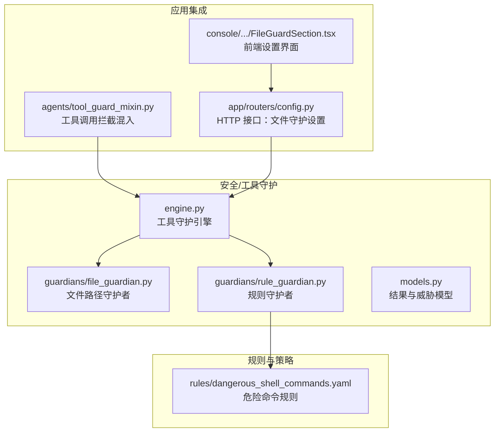
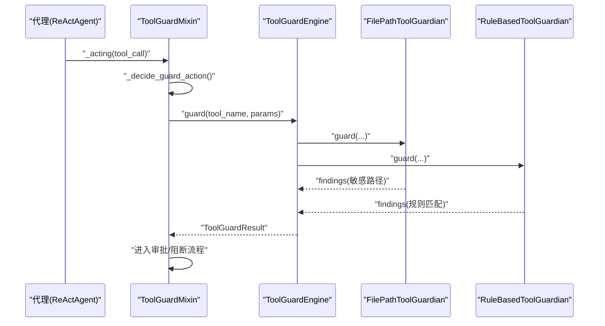
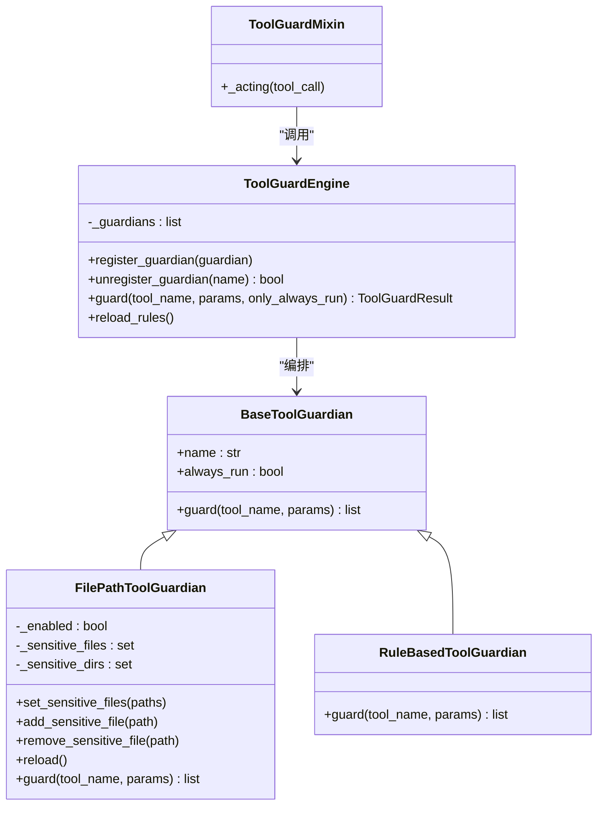
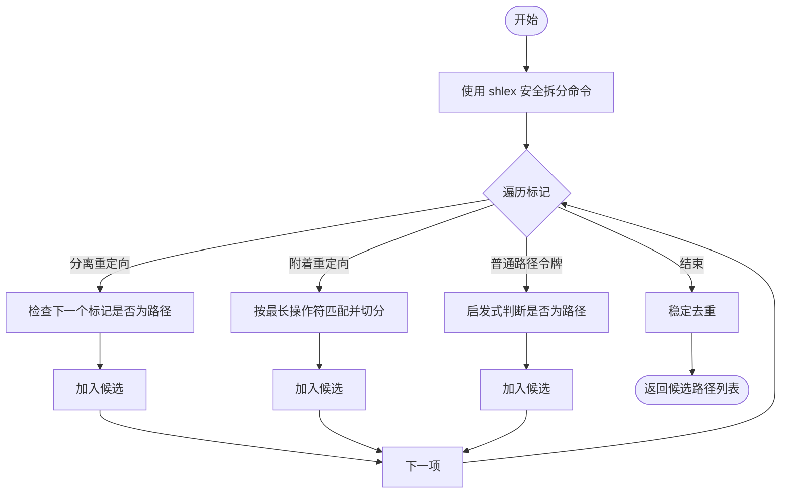

# 文件守护

<cite>
**本文引用的文件**
- [file_guardian.py](file://src/qwenpaw/security/tool_guard/guardians/file_guardian.py)
- [engine.py](file://src/qwenpaw/security/tool_guard/engine.py)
- [models.py](file://src/qwenpaw/security/tool_guard/models.py)
- [rule_guardian.py](file://src/qwenpaw/security/tool_guard/guardians/rule_guardian.py)
- [tool_guard_mixin.py](file://src/qwenpaw/agents/tool_guard_mixin.py)
- [config.py](file://src/qwenpaw/app/routers/config.py)
- [dangerous_shell_commands.yaml](file://src/qwenpaw/security/tool_guard/rules/dangerous_shell_commands.yaml)
- [FileGuardSection.tsx](file://console/src/pages/Settings//Security/components/FileGuardSection.tsx)
</cite>

## 目录
1. [简介](#简介)
2. [项目结构](#项目结构)
3. [核心组件](#核心组件)
4. [架构总览](#架构总览)
5. [详细组件分析](#详细组件分析)
6. [依赖分析](#依赖分析)
7. [性能考量](#性能考量)
8. [故障排查指南](#故障排查指南)
9. [结论](#结论)
10. [附录](#附录)

## 简介
本文件针对 QwenPaw 的“文件守护”机制进行系统化技术文档化，重点围绕 FilePathToolGuardian 类的实现与运行机制，阐述其在工具调用前对文件路径参数进行解析、规范化、匹配与拦截的全流程。文档覆盖以下主题：
- 文件路径解析与规范化策略
- 权限检查与访问限制机制
- 文件类型过滤与目录遍历防护
- 恶意路径检测算法（含重定向目标提取）
- 文件操作白名单与敏感路径集合管理
- 临时文件处理与安全沙箱边界
- 文件访问日志记录、违规告警与自动阻断策略
- 文件权限继承、用户上下文切换与多租户隔离的安全考虑

## 项目结构
文件守护子系统位于安全模块中，采用“守护者（Guardian）+ 引擎（Engine）+ 模型（Models）”的分层设计，并与工具调用拦截混入（ToolGuardMixin）协同工作。

图示来源
- [engine.py:53-102](file://src/qwenpaw/security/tool_guard/engine.py#L53-L102)
- [file_guardian.py:184-200](file://src/qwenpaw/security/tool_guard/guardians/file_guardian.py#L184-L200)
- [rule_guardian.py:1-50](file://src/qwenpaw/security/tool_guard/guardians/rule_guardian.py#L1-L50)
- [models.py:60-116](file://src/qwenpaw/security/tool_guard/models.py#L60-L116)
- [tool_guard_mixin.py:45-70](file://src/qwenpaw/agents/tool_guard_mixin.py#L45-L70)
- [config.py:473-519](file://src/qwenpaw/app/routers/config.py#L473-L519)
- [dangerous_shell_commands.yaml:1-30](file://src/qwenpaw/security/tool_guard/rules/dangerous_shell_commands.yaml#L1-L30)
- [FileGuardSection.tsx:1-104](file://console/src/pages/Settings//Security/components/FileGuardSection.tsx#L1-L104)

章节来源
- [engine.py:53-102](file://src/qwenpaw/security/tool_guard/engine.py#L53-L102)
- [file_guardian.py:184-200](file://src/qwenpaw/security/tool_guard/guardians/file_guardian.py#L184-L200)
- [rule_guardian.py:1-50](file://src/qwenpaw/security/tool_guard/guardians/rule_guardian.py#L1-L50)
- [models.py:60-116](file://src/qwenpaw/security/tool_guard/models.py#L60-L116)
- [tool_guard_mixin.py:45-70](file://src/qwenpaw/agents/tool_guard_mixin.py#L45-L70)
- [config.py:473-519](file://src/qwenpaw/app/routers/config.py#L473-L519)
- [dangerous_shell_commands.yaml:1-30](file://src/qwenpaw/security/tool_guard/rules/dangerous_shell_commands.yaml#L1-L30)
- [FileGuardSection.tsx:1-104](file://console/src/pages/Settings//Security/components/FileGuardSection.tsx#L1-L104)

## 核心组件
- FilePathToolGuardian：负责对工具调用参数中的文件路径进行解析、规范化与敏感性判断，支持已知文件工具、Shell 命令以及通用字符串参数的路径扫描。
- ToolGuardEngine：编排所有守护者实例，聚合结果并输出 ToolGuardResult；支持按需仅执行 always_run 守护者。
- GuardFinding/ToolGuardResult：定义安全发现与结果聚合的数据结构，包含严重级别、威胁类别、修复建议等。
- RuleBasedToolGuardian：基于 YAML 规则的签名匹配（如危险 Shell 命令），与文件路径守护互补。
- ToolGuardMixin：在代理执行前拦截工具调用，触发守护引擎并处理审批流程。
- HTTP 接口与前端：提供文件守护开关与敏感路径列表的增删改查。

章节来源
- [file_guardian.py:184-365](file://src/qwenpaw/security/tool_guard/guardians/file_guardian.py#L184-L365)
- [engine.py:53-226](file://src/qwenpaw/security/tool_guard/engine.py#L53-L226)
- [models.py:60-185](file://src/qwenpaw/security/tool_guard/models.py#L60-L185)
- [rule_guardian.py:1-120](file://src/qwenpaw/security/tool_guard/guardians/rule_guardian.py#L1-L120)
- [tool_guard_mixin.py:261-293](file://src/qwenpaw/agents/tool_guard_mixin.py#L261-L293)
- [config.py:473-519](file://src/qwenpaw/app/routers/config.py#L473-L519)

## 架构总览
文件守护在工具调用生命周期中的位置如下：

图示来源
- [tool_guard_mixin.py:261-293](file://src/qwenpaw/agents/tool_guard_mixin.py#L261-L293)
- [engine.py:169-226](file://src/qwenpaw/security/tool_guard/engine.py#L169-L226)
- [file_guardian.py:313-365](file://src/qwenpaw/security/tool_guard/guardians/file_guardian.py#L313-L365)
- [rule_guardian.py:1-50](file://src/qwenpaw/security/tool_guard/guardians/rule_guardian.py#L1-L50)

## 详细组件分析

### FilePathToolGuardian 实现原理与策略
- 名称与职责
  - 名称："file_path_tool_guardian"
  - 职责：对工具调用参数中的文件路径进行敏感性检查，支持已知文件工具、Shell 命令与通用字符串参数的路径扫描。
  - always_run：始终参与检查，确保即使工具未被规则守护范围覆盖，仍能进行路径级阻断。

- 敏感路径集合管理
  - set_sensitive_files：接收一组路径，统一规范化后区分“文件”与“目录”，分别存入 _sensitive_files 与 _sensitive_dirs。
  - add_sensitive_file/remove_sensitive_file：动态增删敏感路径。
  - reload：从配置重新加载启用状态与敏感路径集。

- 路径解析与规范化
  - _normalize_path：支持用户目录展开、相对路径到工作区根的转换、绝对路径解析（不强制严格存在）。
  - _workspace_root：根据当前工作区目录或进程工作目录确定相对路径基准。
  - ensure_file_guard_paths：合并用户输入与兼容性敏感目录（历史与当前版本的隐藏密钥目录），去重保留顺序。

- 工具参数扫描策略
  - 已知文件工具：仅检查特定参数名（如 file_path、path 等）。
  - Shell 命令：使用 shlex 安全拆分，识别重定向操作符（>、>>、1>、2>、&>、< 等），提取重定向目标与普通路径令牌。
  - 其他工具：对每个字符串参数调用 _looks_like_path_token 判断是否可能为路径，再进行规范化与匹配。

- 敏感性判断
  - _is_sensitive：若路径在敏感文件集合中，或属于任一敏感目录（is_relative_to）即判定为敏感。

- 发现生成与阻断
  - _make_finding：构造 GuardFinding，类别为敏感文件访问，严重级别为 HIGH，包含修复建议与元数据（解析后的路径）。
  - guard：根据工具类型分流处理，最终返回 findings 列表；为空表示通过。

- 目录遍历与递归保护
  - 通过路径末尾斜杠（/ 或 \）识别目录条目，将其加入 _sensitive_dirs；随后对任何位于该目录下的文件均视为命中。

- 恶意路径检测算法
  - 重定向目标提取：优先处理分离式重定向（如 “> out.txt”），其次处理附着式重定向（如 “>out.txt”、“2>err.log”）。
  - 路径令牌启发式：排除 HTTP/FTP/数据 URI、MIME 前缀、选项参数等非路径特征，保留 ~、/、./、../、包含 / 的字符串等高可能性路径。

- 文件类型过滤
  - 通过 MIME 前缀集合与协议前缀集合过滤掉明显非本地路径的字符串，降低误报。

- 白名单机制
  - 当前实现为“默认阻断 + 显式敏感路径集合”，未见显式的“允许列表”接口；可通过移除敏感路径项达到白名单效果。

- 临时文件与沙箱边界
  - 通过 _normalize_path 将相对路径解析到工作区根，结合 is_relative_to 判断是否越界，形成逻辑沙箱边界。
  - 规则守护（RuleBasedToolGuardian）可进一步约束危险命令，与文件路径守护共同构成多层防护。

- 访问日志与告警
  - GuardFinding 包含时间戳、工具名、参数名、匹配值、片段与元数据，可用于审计与告警。
  - ToolGuardResult 提供最大严重级别、守护耗时、失败守护者列表等聚合信息。

- 自动阻断策略
  - ToolGuardMixin 在存在 CRITICAL/HIGH 发现时进入审批流程；若未获批准则阻断工具执行。

- 用户上下文与多租户隔离
  - 工作区根由当前会话上下文决定，不同会话可指向不同工作区，实现天然的多租户隔离。
  - 配置加载与守护开关受环境变量与配置文件双重控制，便于按租户或环境差异化部署。

章节来源
- [file_guardian.py:40-103](file://src/qwenpaw/security/tool_guard/guardians/file_guardian.py#L40-L103)
- [file_guardian.py:118-181](file://src/qwenpaw/security/tool_guard/guardians/file_guardian.py#L118-L181)
- [file_guardian.py:184-365](file://src/qwenpaw/security/tool_guard/guardians/file_guardian.py#L184-L365)
- [models.py:60-185](file://src/qwenpaw/security/tool_guard/models.py#L60-L185)
- [tool_guard_mixin.py:261-293](file://src/qwenpaw/agents/tool_guard_mixin.py#L261-L293)

### ToolGuardEngine 编排与结果聚合
- 默认守护者集合：包含 FilePathToolGuardian 与 RuleBasedToolGuardian。
- guard 方法：按需选择 always_run 守护者或全部守护者，捕获异常并记录失败守护者，统计耗时。
- reload_rules：逐个调用守护者的 reload，刷新规则与受保护工具集合。

章节来源
- [engine.py:53-102](file://src/qwenpaw/security/tool_guard/engine.py#L53-L102)
- [engine.py:148-226](file://src/qwenpaw/security/tool_guard/engine.py#L148-L226)

### 规则守护（RuleBasedToolGuardian）与危险命令规则
- 规则来源：dangerous_shell_commands.yaml，涵盖 rm/mv 破坏性操作、系统重启/关机、反向连接、权限变更、服务管理、进程终止、提权等。
- 路径边界增强：规则守护还提供工作区边界检查与路径规范化辅助函数，与文件路径守护互补。

章节来源
- [rule_guardian.py:1-120](file://src/qwenpaw/security/tool_guard/guardians/rule_guardian.py#L1-L120)
- [dangerous_shell_commands.yaml:1-187](file://src/qwenpaw/security/tool_guard/rules/dangerous_shell_commands.yaml#L1-L187)

### 应用集成与配置接口
- HTTP 接口：提供获取/更新文件守护设置的 REST API，支持启用开关与敏感路径列表。
- 前端界面：FileGuardSection 提供开关与表格增删，调用上述接口完成持久化与规则重载。

章节来源
- [config.py:473-519](file://src/qwenpaw/app/routers/config.py#L473-L519)
- [FileGuardSection.tsx:1-104](file://console/src/pages/Settings//Security/components/FileGuardSection.tsx#L1-L104)

## 依赖分析
- 组件耦合
  - ToolGuardEngine 依赖 BaseToolGuardian 抽象，具体守护者通过懒加载初始化。
  - FilePathToolGuardian 依赖配置上下文与常量，用于工作区根与默认敏感目录。
  - ToolGuardMixin 依赖引擎与审批服务，负责拦截与审批流程。
- 外部依赖
  - shlex：安全拆分 Shell 命令。
  - pathlib：路径规范化与相对性判断。
  - yaml：规则文件加载。

图示来源
- [file_guardian.py:184-200](file://src/qwenpaw/security/tool_guard/guardians/file_guardian.py#L184-L200)
- [rule_guardian.py:1-50](file://src/qwenpaw/security/tool_guard/guardians/rule_guardian.py#L1-L50)
- [engine.py:53-102](file://src/qwenpaw/security/tool_guard/engine.py#L53-L102)
- [tool_guard_mixin.py:45-70](file://src/qwenpaw/agents/tool_guard_mixin.py#L45-L70)

## 性能考量
- 路径规范化与集合查找
  - 规范化采用 expanduser/resolve，避免重复 IO；敏感集合使用集合存储，匹配复杂度近似 O(1)。
- Shell 命令解析
  - 使用 shlex 安全拆分，失败回退为简单 split，兼顾正确性与性能。
- 规则匹配
  - 规则守护采用预编译正则与排除模式，减少重复编译开销。
- 并发与锁
  - 审批决策在互斥锁内完成，避免竞态；实际工具执行在锁外并行，保证吞吐。

## 故障排查指南
- 常见问题
  - 工具未被拦截：确认工具是否在受保护工具集合内，或是否仅需要 always_run 守护者检查。
  - 路径误判：检查路径是否包含协议前缀/MIME 前缀，或是否被启发式过滤。
  - 规则未生效：确认规则目录与文件是否存在，引擎是否调用了 reload_rules。
- 日志与审计
  - ToolGuardResult 包含守护耗时、失败守护者列表与时间戳，便于定位异常。
  - GuardFinding 的元数据包含解析后的路径，可用于溯源。
- 配置校验
  - 通过 HTTP 接口获取/更新敏感路径列表，确保路径规范化后再写入配置。

章节来源
- [engine.py:214-224](file://src/qwenpaw/security/tool_guard/engine.py#L214-L224)
- [models.py:103-185](file://src/qwenpaw/security/tool_guard/models.py#L103-L185)
- [config.py:473-519](file://src/qwenpaw/app/routers/config.py#L473-L519)

## 结论
FilePathToolGuardian 通过“路径规范化 + 启发式过滤 + 目录递归保护”的组合策略，实现了对敏感文件与目录的强约束拦截。配合 ToolGuardEngine 的编排能力与 ToolGuardMixin 的审批流程，形成了“默认阻断 + 可视化配置 + 审批闭环”的安全体系。规则守护进一步强化了对危险命令的识别与阻断，二者协同提供了面向真实场景的多层防护。

## 附录

### 关键流程图：Shell 命令路径提取

图示来源
- [file_guardian.py:134-181](file://src/qwenpaw/security/tool_guard/guardians/file_guardian.py#L134-L181)