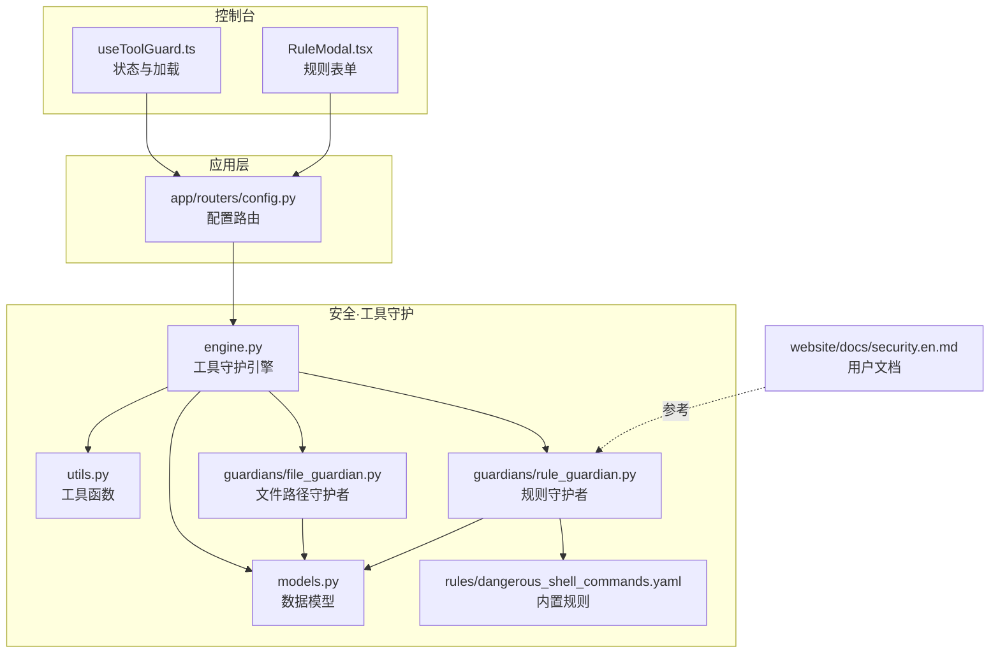
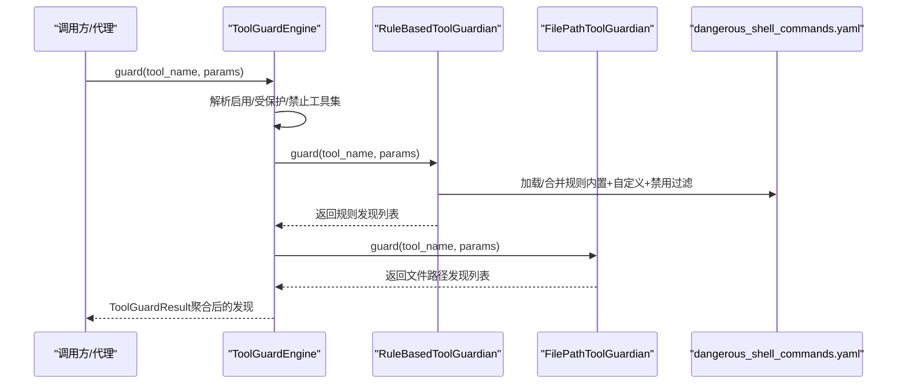
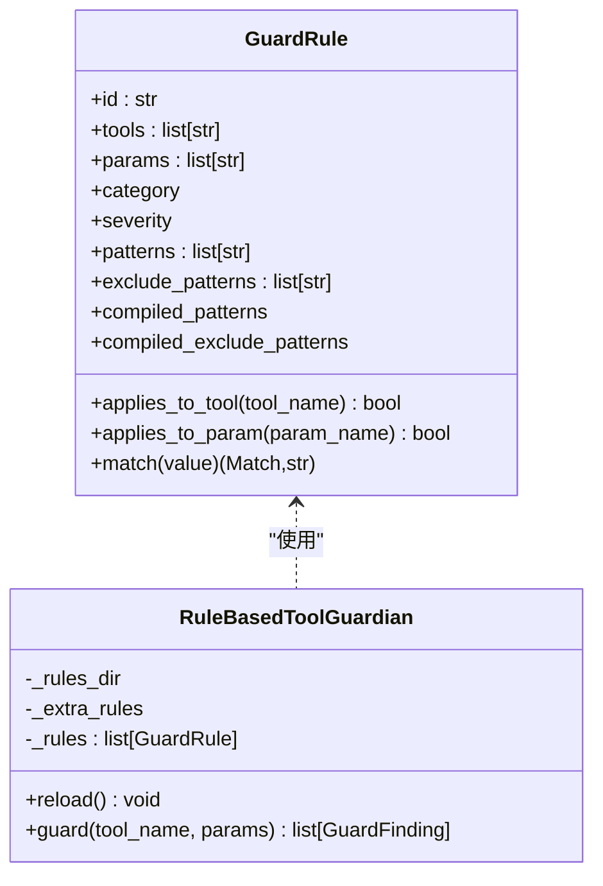
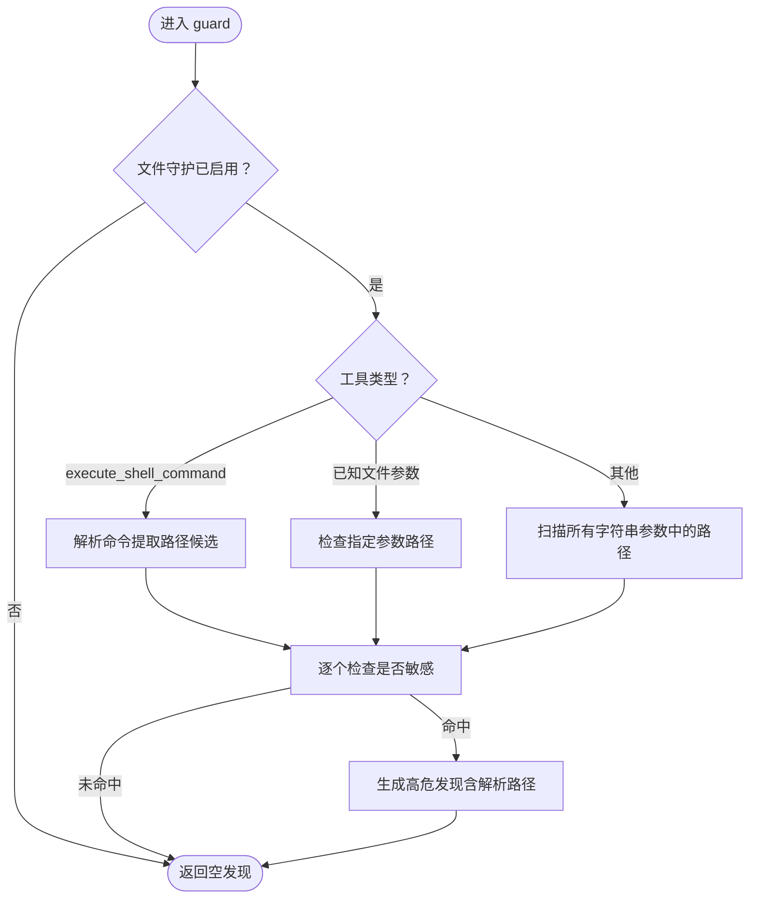
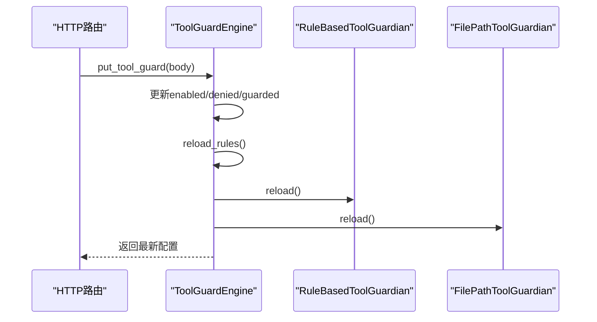
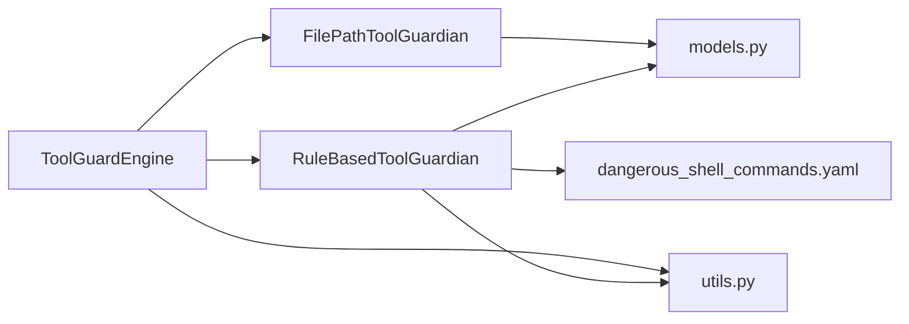

# 规则守护

<cite>
**本文引用的文件**
- [src/qwenpaw/security/tool_guard/__init__.py](file://src/qwenpaw/security/tool_guard/__init__.py)
- [src/qwenpaw/security/tool_guard/engine.py](file://src/qwenpaw/security/tool_guard/engine.py)
- [src/qwenpaw/security/tool_guard/guardians/rule_guardian.py](file://src/qwenpaw/security/tool_guard/guardians/rule_guardian.py)
- [src/qwenpaw/security/tool_guard/guardians/file_guardian.py](file://src/qwenpaw/security/tool_guard/guardians/file_guardian.py)
- [src/qwenpaw/security/tool_guard/models.py](file://src/qwenpaw/security/tool_guard/models.py)
- [src/qwenpaw/security/tool_guard/utils.py](file://src/qwenpaw/security/tool_guard/utils.py)
- [src/qwenpaw/security/tool_guard/rules/dangerous_shell_commands.yaml](file://src/qwenpaw/security/tool_guard/rules/dangerous_shell_commands.yaml)
- [src/qwenpaw/app/routers/config.py](file://src/qwenpaw/app/routers/config.py)
- [console/src/pages/Settings/Security/useToolGuard.ts](file://console/src/pages/Settings/Security/useToolGuard.ts)
- [console/src/pages/Settings/Security/components/RuleModal.tsx](file://console/src/pages/Settings/Security/components/RuleModal.tsx)
- [website/public/docs/security.en.md](file://website/public/docs/security.en.md)
</cite>

## 目录
1. [简介](#简介)
2. [项目结构](#项目结构)
3. [核心组件](#核心组件)
4. [架构总览](#架构总览)
5. [详细组件分析](#详细组件分析)
6. [依赖关系分析](#依赖关系分析)
7. [性能考量](#性能考量)
8. [故障排查指南](#故障排查指南)
9. [结论](#结论)
10. [附录](#附录)

## 简介
本文件面向QwenPaw的“规则守护”子系统，系统性阐述RuleBasedToolGuardian类的实现原理、规则引擎架构与运行流程，并对危险命令检测算法、正则表达式匹配、语义增强（如rm命令工作区边界检查）进行深入解析。文档还覆盖规则配置格式、优先级排序、规则加载与合并、动态更新机制、规则测试框架建议、误报处理与优化建议、规则缓存与性能优化策略、规则版本管理、可视化编辑器与批量导入导出、以及规则审计日志等主题。

## 项目结构
规则守护位于安全模块的tool_guard子包中，采用“守护者（Guardian）+ 引擎（Engine）+ 模型（Models）+ 工具（Utils）+ 规则（YAML）”的分层设计。前端控制台通过HTTP接口与后端配置路由交互，实现规则的可视化管理与动态生效。

图示来源
- [src/qwenpaw/security/tool_guard/engine.py:53-238](file://src/qwenpaw/security/tool_guard/engine.py#L53-L238)
- [src/qwenpaw/security/tool_guard/guardians/rule_guardian.py:559-758](file://src/qwenpaw/security/tool_guard/guardians/rule_guardian.py#L559-L758)
- [src/qwenpaw/security/tool_guard/guardians/file_guardian.py:184-365](file://src/qwenpaw/security/tool_guard/guardians/file_guardian.py#L184-L365)
- [src/qwenpaw/security/tool_guard/models.py:103-185](file://src/qwenpaw/security/tool_guard/models.py#L103-L185)
- [src/qwenpaw/security/tool_guard/utils.py:64-164](file://src/qwenpaw/security/tool_guard/utils.py#L64-L164)
- [src/qwenpaw/security/tool_guard/rules/dangerous_shell_commands.yaml:1-187](file://src/qwenpaw/security/tool_guard/rules/dangerous_shell_commands.yaml#L1-L187)
- [src/qwenpaw/app/routers/config.py:402-431](file://src/qwenpaw/app/routers/config.py#L402-L431)
- [console/src/pages/Settings/Security/useToolGuard.ts:13-47](file://console/src/pages/Settings/Security/useToolGuard.ts#L13-L47)
- [console/src/pages/Settings/Security/components/RuleModal.tsx:1-76](file://console/src/pages/Settings/Security/components/RuleModal.tsx#L1-L76)
- [website/public/docs/security.en.md:38-147](file://website/public/docs/security.en.md#L38-L147)

章节来源
- [src/qwenpaw/security/tool_guard/__init__.py:1-59](file://src/qwenpaw/security/tool_guard/__init__.py#L1-L59)

## 核心组件
- 规则守护者（RuleBasedToolGuardian）
  - 基于YAML签名规则的正则匹配守护者，负责加载内置与自定义规则、按工具名与参数名筛选适用规则、对字符串化参数值执行正则匹配并生成发现（Finding）。
  - 支持排除模式（exclude_patterns）、工作区边界检查（针对rm命令）等增强逻辑。
- 文件路径守护者（FilePathToolGuardian）
  - 针对敏感文件/目录访问进行阻断，支持从配置加载敏感路径集合、从shell命令中提取路径候选、路径归一化与相对路径解析。
- 工具守护引擎（ToolGuardEngine）
  - 单例式编排器，注册多个守护者，聚合结果，支持启用开关、受保护工具集与禁止工具集解析、动态重载规则与工具集。
- 数据模型（models.py）
  - 定义威胁严重级别、威胁类别、单次发现（GuardFinding）与整体结果（ToolGuardResult），提供序列化与统计方法。
- 工具函数（utils.py）
  - 解析受保护工具集与禁止工具集，提供环境变量与配置文件优先级；提供结构化日志输出。
- 内置规则（dangerous_shell_commands.yaml）
  - 面向execute_shell_command的危险命令规则集合，涵盖破坏性、规避性与提权类模式。

章节来源
- [src/qwenpaw/security/tool_guard/guardians/rule_guardian.py:559-758](file://src/qwenpaw/security/tool_guard/guardians/rule_guardian.py#L559-L758)
- [src/qwenpaw/security/tool_guard/guardians/file_guardian.py:184-365](file://src/qwenpaw/security/tool_guard/guardians/file_guardian.py#L184-L365)
- [src/qwenpaw/security/tool_guard/engine.py:53-238](file://src/qwenpaw/security/tool_guard/engine.py#L53-L238)
- [src/qwenpaw/security/tool_guard/models.py:103-185](file://src/qwenpaw/security/tool_guard/models.py#L103-L185)
- [src/qwenpaw/security/tool_guard/utils.py:64-164](file://src/qwenpaw/security/tool_guard/utils.py#L64-L164)
- [src/qwenpaw/security/tool_guard/rules/dangerous_shell_commands.yaml:1-187](file://src/qwenpaw/security/tool_guard/rules/dangerous_shell_commands.yaml#L1-L187)

## 架构总览
规则守护遵循“守护者插件化 + 引擎编排”的架构。引擎在启动时初始化默认守护者（规则守护者与文件路径守护者），在每次工具调用前扫描参数，将各守护者的发现汇总为统一结果对象，供上层决策（如审批流）使用。

图示来源
- [src/qwenpaw/security/tool_guard/engine.py:169-226](file://src/qwenpaw/security/tool_guard/engine.py#L169-L226)
- [src/qwenpaw/security/tool_guard/guardians/rule_guardian.py:608-758](file://src/qwenpaw/security/tool_guard/guardians/rule_guardian.py#L608-L758)
- [src/qwenpaw/security/tool_guard/guardians/file_guardian.py:313-365](file://src/qwenpaw/security/tool_guard/guardians/file_guardian.py#L313-L365)
- [src/qwenpaw/security/tool_guard/rules/dangerous_shell_commands.yaml:1-187](file://src/qwenpaw/security/tool_guard/rules/dangerous_shell_commands.yaml#L1-L187)

## 详细组件分析

### RuleBasedToolGuardian 类详解
- 规则加载与合并
  - 从默认规则目录加载内置规则；从配置加载自定义规则；根据disabled_rules过滤合并后的规则集。
  - 支持额外规则注入（extra_rules）以扩展默认集。
- 匹配流程
  - 对每个工具参数值进行字符串化；
  - 先按工具名筛选适用规则，再按参数名筛选；
  - 排除模式优先匹配，命中后跳过；
  - 正则模式逐一尝试，首次命中生成上下文片段与元数据。
- 特殊增强逻辑
  - rm命令工作区边界检查：解析命令中的目标路径，判断是否位于工作区外，若存在则在描述与修复建议中加入明确提示与结构化元数据，便于UI展示与人工确认。
- 结果生成
  - 为每条匹配生成GuardFinding，包含规则ID、类别、严重级别、标题、描述、工具名、参数名、匹配值、匹配模式、上下文片段、修复建议与守护者名称。

图示来源
- [src/qwenpaw/security/tool_guard/guardians/rule_guardian.py:331-425](file://src/qwenpaw/security/tool_guard/guardians/rule_guardian.py#L331-L425)
- [src/qwenpaw/security/tool_guard/guardians/rule_guardian.py:559-758](file://src/qwenpaw/security/tool_guard/guardians/rule_guardian.py#L559-L758)

章节来源
- [src/qwenpaw/security/tool_guard/guardians/rule_guardian.py:559-758](file://src/qwenpaw/security/tool_guard/guardians/rule_guardian.py#L559-L758)

### FilePathToolGuardian 类详解
- 敏感路径管理
  - 从配置加载敏感文件/目录集合，支持兼容历史路径；
  - 支持设置、添加、移除敏感路径，内部维护集合并进行路径归一化。
- 命令路径提取
  - 针对execute_shell_command，使用shell解析策略提取重定向与路径参数；
  - 对其他工具，扫描所有疑似路径的字符串参数。
- 阻断逻辑
  - 若命中敏感文件或位于敏感目录内，则生成高危发现并附带解析后的绝对路径元数据。

图示来源
- [src/qwenpaw/security/tool_guard/guardians/file_guardian.py:313-365](file://src/qwenpaw/security/tool_guard/guardians/file_guardian.py#L313-L365)

章节来源
- [src/qwenpaw/security/tool_guard/guardians/file_guardian.py:184-365](file://src/qwenpaw/security/tool_guard/guardians/file_guardian.py#L184-L365)

### ToolGuardEngine 编排与动态更新
- 默认守护者
  - 初始化时尝试注册文件路径守护者与规则守护者。
- 启用与范围
  - 通过环境变量、配置文件与默认值解析启用状态；
  - 解析受保护工具集与禁止工具集，支持通配与空集。
- 动态更新
  - 提供reload_rules触发守护者reload与工具集刷新；
  - HTTP路由提供获取/更新工具守护配置，并自动触发引擎重载。
- 结果聚合
  - 调用各守护者guard，收集findings、失败守护者信息与耗时。

图示来源
- [src/qwenpaw/app/routers/config.py:412-431](file://src/qwenpaw/app/routers/config.py#L412-L431)
- [src/qwenpaw/security/tool_guard/engine.py:148-154](file://src/qwenpaw/security/tool_guard/engine.py#L148-L154)

章节来源
- [src/qwenpaw/security/tool_guard/engine.py:53-238](file://src/qwenpaw/security/tool_guard/engine.py#L53-L238)
- [src/qwenpaw/app/routers/config.py:402-431](file://src/qwenpaw/app/routers/config.py#L402-L431)

### 规则配置格式与优先级
- 规则字段
  - id、tools/params（可为空表示全匹配）、category、severity、patterns/exclude_patterns、description、remediation。
- 优先级顺序
  - 环境变量 > 配置文件 > 默认值；
  - 工具范围：受保护工具集（None表示全部）> 显式列表 > 关闭；
  - 禁止工具集：显式列表 > 空集。
- 规则合并
  - 内置规则 + 额外规则 + 自定义规则，再剔除disabled_rules。

章节来源
- [src/qwenpaw/security/tool_guard/guardians/rule_guardian.py:518-551](file://src/qwenpaw/security/tool_guard/guardians/rule_guardian.py#L518-L551)
- [src/qwenpaw/security/tool_guard/utils.py:64-127](file://src/qwenpaw/security/tool_guard/utils.py#L64-L127)
- [website/public/docs/security.en.md:52-147](file://website/public/docs/security.en.md#L52-L147)

### 危险命令检测算法与语义增强
- 正则匹配
  - 对字符串化参数值逐一尝试规则的patterns，排除模式优先；
  - 命中后截取上下文片段用于UI展示。
- 语义增强（rm命令）
  - 解析命令中的目标路径，进行工作区边界检查；
  - 若存在越界风险，在描述与修复建议中加入明确提示与结构化元数据，便于控制台呈现与人工确认。

章节来源
- [src/qwenpaw/security/tool_guard/guardians/rule_guardian.py:608-758](file://src/qwenpaw/security/tool_guard/guardians/rule_guardian.py#L608-L758)

### 规则测试框架与误报处理
- 测试框架建议
  - 使用单元测试对规则匹配与排除模式进行覆盖；
  - 针对rm命令的边界检查编写边界场景用例（越界/非越界、路径解析错误等）；
  - 对不同平台（POSIX/Windows）的shell解析差异进行跨平台测试。
- 误报处理
  - 通过exclude_patterns降低误报；
  - 将高危规则降级为较低严重级别并配合人工复核；
  - 在控制台中提供规则编辑界面，支持快速调整patterns与exclude_patterns。

章节来源
- [console/src/pages/Settings/Security/components/RuleModal.tsx:1-76](file://console/src/pages/Settings/Security/components/RuleModal.tsx#L1-L76)
- [website/public/docs/security.en.md:145-147](file://website/public/docs/security.en.md#L145-L147)

### 规则缓存、性能优化与版本管理
- 规则缓存
  - 规则在内存中以预编译正则形式存储，避免重复编译开销；
  - 重载时重建规则列表，保持线程安全与一致性。
- 性能优化
  - 字符串化参数值仅在非空时扫描；
  - 工具/参数维度先做粗筛，减少正则匹配次数；
  - 正则匹配短路返回首个命中项，避免全量匹配。
- 版本管理
  - 规则文件版本由文件内容与ID标识，可通过升级规则文件实现版本演进；
  - 控制台提供内置规则列表查询，便于审计与回滚。

章节来源
- [src/qwenpaw/security/tool_guard/guardians/rule_guardian.py:375-425](file://src/qwenpaw/security/tool_guard/guardians/rule_guardian.py#L375-L425)
- [src/qwenpaw/security/tool_guard/guardians/rule_guardian.py:583-594](file://src/qwenpaw/security/tool_guard/guardians/rule_guardian.py#L583-L594)

### 规则可视化编辑器、批量导入导出与审计日志
- 可视化编辑器
  - 控制台提供规则表单，支持选择严重级别、类别、工具与参数、输入patterns与exclude_patterns；
  - 支持内置规则与自定义规则的合并展示与禁用管理。
- 批量导入导出
  - 通过HTTP接口获取内置规则列表，结合自定义规则数组进行批量更新；
  - 配置路由提供获取/更新工具守护配置，实现规则集的批量导入与导出。
- 审计日志
  - 提供结构化日志输出，区分高危与低危发现，记录工具名、参数名、规则ID、描述与匹配值，便于审计与追踪。

章节来源
- [console/src/pages/Settings/Security/useToolGuard.ts:13-47](file://console/src/pages/Settings/Security/useToolGuard.ts#L13-L47)
- [console/src/pages/Settings/Security/components/RuleModal.tsx:1-76](file://console/src/pages/Settings/Security/components/RuleModal.tsx#L1-L76)
- [src/qwenpaw/app/routers/config.py:433-457](file://src/qwenpaw/app/routers/config.py#L433-L457)
- [src/qwenpaw/security/tool_guard/utils.py:129-164](file://src/qwenpaw/security/tool_guard/utils.py#L129-L164)

## 依赖关系分析

图示来源
- [src/qwenpaw/security/tool_guard/engine.py:84-102](file://src/qwenpaw/security/tool_guard/engine.py#L84-L102)
- [src/qwenpaw/security/tool_guard/guardians/rule_guardian.py:559-582](file://src/qwenpaw/security/tool_guard/guardians/rule_guardian.py#L559-L582)
- [src/qwenpaw/security/tool_guard/guardians/file_guardian.py:184-197](file://src/qwenpaw/security/tool_guard/guardians/file_guardian.py#L184-L197)
- [src/qwenpaw/security/tool_guard/models.py:103-185](file://src/qwenpaw/security/tool_guard/models.py#L103-L185)
- [src/qwenpaw/security/tool_guard/utils.py:64-127](file://src/qwenpaw/security/tool_guard/utils.py#L64-L127)
- [src/qwenpaw/security/tool_guard/rules/dangerous_shell_commands.yaml:1-187](file://src/qwenpaw/security/tool_guard/rules/dangerous_shell_commands.yaml#L1-L187)

章节来源
- [src/qwenpaw/security/tool_guard/engine.py:84-102](file://src/qwenpaw/security/tool_guard/engine.py#L84-L102)
- [src/qwenpaw/security/tool_guard/guardians/rule_guardian.py:559-582](file://src/qwenpaw/security/tool_guard/guardians/rule_guardian.py#L559-L582)
- [src/qwenpaw/security/tool_guard/guardians/file_guardian.py:184-197](file://src/qwenpaw/security/tool_guard/guardians/file_guardian.py#L184-L197)

## 性能考量
- 时间复杂度
  - 规则匹配：对每个参数值执行O(R)正则匹配（R为该参数适用规则数），总体O(N×R)，N为参数数量；
  - 工具/参数筛选：哈希查找O(1)，整体线性于参数与规则数量。
- 空间复杂度
  - 规则预编译正则占用内存，规则集大小与patterns数量成正比；
  - 发现列表随匹配命中数增长。
- 优化建议
  - 合理拆分规则，避免单条规则patterns过多；
  - 使用exclude_patterns减少误报与无效匹配；
  - 对高频工具与参数建立更细粒度的规则集，减少全局扫描。

## 故障排查指南
- 规则不生效
  - 检查工具是否在受保护工具集中；
  - 确认规则ID未被disabled_rules禁用；
  - 验证自定义规则字段是否符合格式。
- 误报/漏报
  - 通过exclude_patterns缩小范围；
  - 调整严重级别并结合人工复核；
  - 使用控制台规则编辑器快速验证。
- 日志审计
  - 查看结构化日志，定位具体工具、参数与规则ID；
  - 关注高危发现（CRITICAL/HIGH）并联动审批流程。

章节来源
- [src/qwenpaw/security/tool_guard/utils.py:129-164](file://src/qwenpaw/security/tool_guard/utils.py#L129-L164)
- [website/public/docs/security.en.md:38-68](file://website/public/docs/security.en.md#L38-L68)

## 结论
RuleBasedToolGuardian与ToolGuardEngine共同构成了QwenPaw的规则守护体系：前者以高性能正则匹配与语义增强实现对危险命令的精准识别，后者通过统一编排与动态更新保障系统的可运维性与可扩展性。结合控制台的可视化管理、批量导入导出与审计日志能力，规则守护在保障安全的同时兼顾了易用性与可观测性。

## 附录
- 默认内置规则集
  - 面向execute_shell_command的危险命令规则，覆盖破坏性、规避性与提权类模式。
- 用户文档参考
  - 包含规则工作原理、配置格式、控制台管理入口与示例。

章节来源
- [src/qwenpaw/security/tool_guard/rules/dangerous_shell_commands.yaml:1-187](file://src/qwenpaw/security/tool_guard/rules/dangerous_shell_commands.yaml#L1-L187)
- [website/public/docs/security.en.md:38-147](file://website/public/docs/security.en.md#L38-L147)