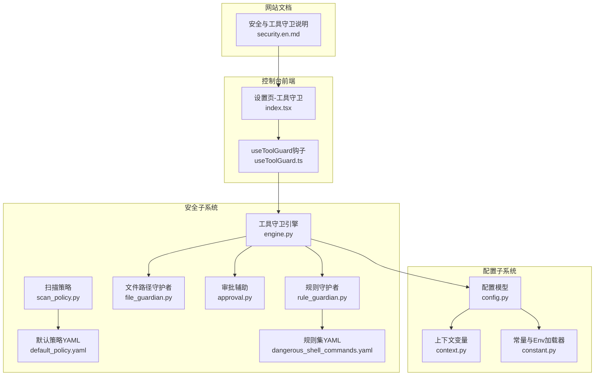
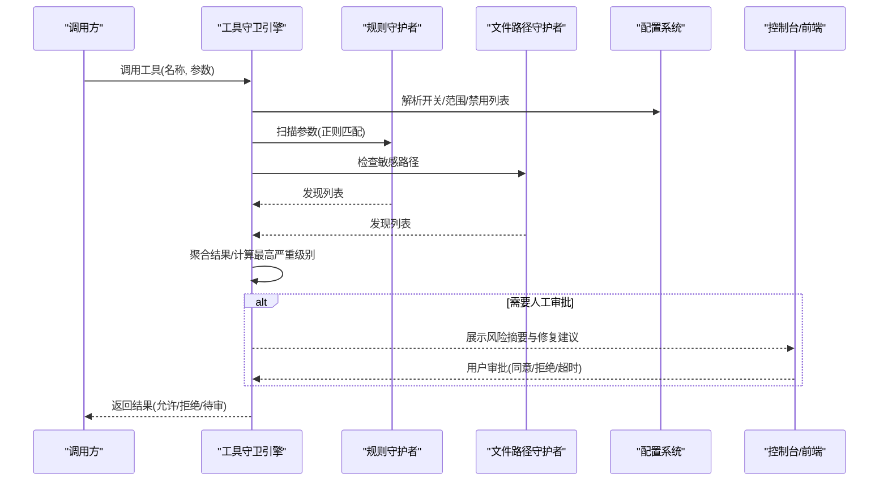
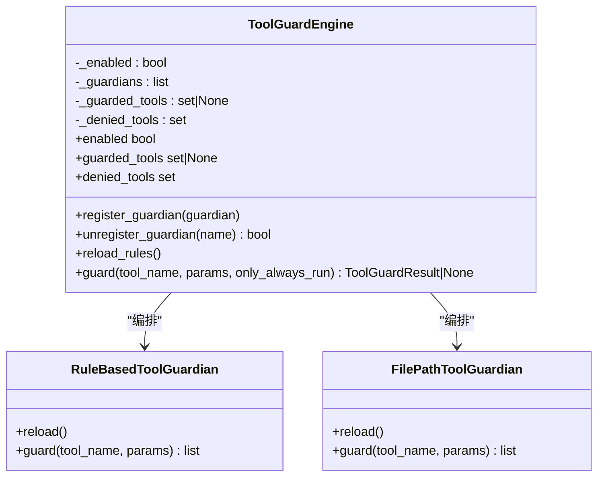
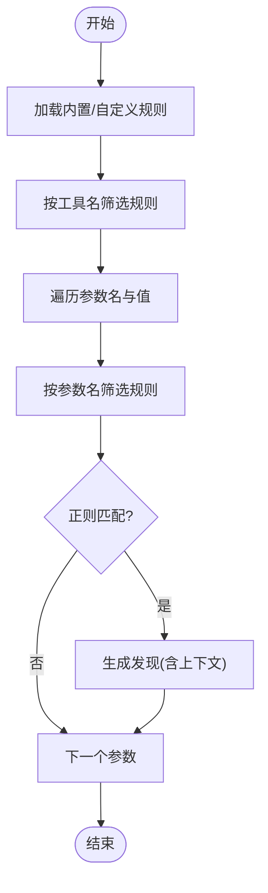
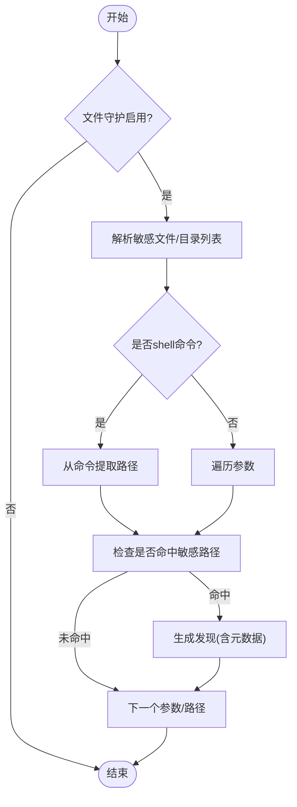
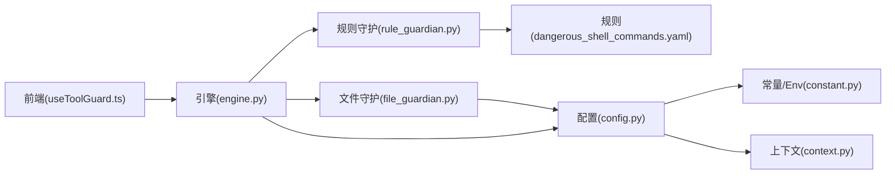

# 配置管理

<cite>
**本文引用的文件**
- [engine.py](file://src/qwenpaw/security/tool_guard/engine.py)
- [models.py](file://src/qwenpaw/security/tool_guard/models.py)
- [utils.py](file://src/qwenpaw/security/tool_guard/utils.py)
- [rule_guardian.py](file://src/qwenpaw/security/tool_guard/guardians/rule_guardian.py)
- [file_guardian.py](file://src/qwenpaw/security/tool_guard/guardians/file_guardian.py)
- [approval.py](file://src/qwenpaw/security/tool_guard/approval.py)
- [config.py](file://src/qwenpaw/config/config.py)
- [context.py](file://src/qwenpaw/config/context.py)
- [constant.py](file://src/qwenpaw/constant.py)
- [default_policy.yaml](file://src/qwenpaw/security/skill_scanner/data/default_policy.yaml)
- [scan_policy.py](file://src/qwenpaw/security/skill_scanner/scan_policy.py)
- [dangerous_shell_commands.yaml](file://src/qwenpaw/security/tool_guard/rules/dangerous_shell_commands.yaml)
- [secret_store.py](file://src/qwenpaw/security/secret_store.py)
- [index.tsx](file://console/src/pages/Settings//index.tsx)
- [useToolGuard.ts](file://console/src/pages/Settings//useToolGuard.ts)
- [security.en.md](file://website/public/docs/security.en.md)
</cite>

## 目录
1. [简介](#简介)
2. [项目结构](#项目结构)
3. [核心组件](#核心组件)
4. [架构总览](#架构总览)
5. [详细组件分析](#详细组件分析)
6. [依赖分析](#依赖分析)
7. [性能考虑](#性能考虑)
8. [故障排查指南](#故障排查指南)
9. [结论](#结论)
10. [附录](#附录)

## 简介
本文件面向QwenPaw工具守卫配置管理，系统性阐述配置体系的架构设计与配置项管理机制，覆盖环境变量配置、配置文件解析、运行时配置更新流程；详解工具白名单、危险工具禁用列表与安全策略参数；并提供配置验证机制、热重载与回滚策略、配置模板示例、最佳实践、迁移指南、多环境配置管理、配置加密存储与敏感信息保护、配置审计与变更追踪以及冲突解决机制的实现指导。

## 项目结构
围绕“配置管理”主题，相关代码主要分布在如下模块：
- 安全子系统（security）：工具守卫引擎、规则守护者、文件路径守护者、审批辅助、技能扫描策略与默认策略等。
- 配置子系统（config）：全局配置模型、上下文变量、常量与环境变量加载器。
- 控制台前端（console）：工具守卫配置的可视化界面与状态管理。
- 网站文档（website）：安全与工具守卫的使用说明与示例。

图表来源
- [engine.py:53-238](file://src/qwenpaw/security/tool_guard/engine.py#L53-L238)
- [rule_guardian.py:559-758](file://src/qwenpaw/security/tool_guard/guardians/rule_guardian.py#L559-L758)
- [file_guardian.py:184-365](file://src/qwenpaw/security/tool_guard/guardians/file_guardian.py#L184-L365)
- [config.py:1-800](file://src/qwenpaw/config/config.py#L1-L800)
- [context.py:1-59](file://src/qwenpaw/config/context.py#L1-L59)
- [constant.py:1-307](file://src/qwenpaw/constant.py#L1-L307)
- [index.tsx:258-287](file://console/src/pages/Settings//index.tsx#L258-L287)
- [useToolGuard.ts:1-47](file://console/src/pages/Settings//useToolGuard.ts#L1-L47)
- [security.en.md:96-147](file://website/public/docs/security.en.md#L96-L147)

章节来源
- [engine.py:53-238](file://src/qwenpaw/security/tool_guard/engine.py#L53-L238)
- [config.py:1-800](file://src/qwenpaw/config/config.py#L1-L800)
- [constant.py:1-307](file://src/qwenpaw/constant.py#L1-L307)

## 核心组件
- 工具守卫引擎（ToolGuardEngine）
  - 单例模式，负责编排所有已注册的守护者（规则守护者、文件路径守护者），聚合结果并输出ToolGuardResult。
  - 支持通过环境变量、配置文件与默认值三优先级解析开关与范围。
  - 提供规则热重载与工具白名单/禁用列表刷新能力。
- 规则守护者（RuleBasedToolGuardian）
  - 加载内置与自定义规则，按工具名与参数名匹配，执行正则扫描，生成GuardFinding。
  - 支持对特定高危规则（如rm命令）进行工作区边界检查与增强提示。
- 文件路径守护者（FilePathToolGuardian）
  - 基于敏感目录与文件集合阻断敏感路径访问；支持从配置动态加载敏感文件列表。
- 审批辅助（Approval）
  - 定义审批决策枚举与风险摘要格式化工具，用于UI展示与人工确认。
- 配置模型（Config）
  - 定义全局配置结构，包含安全配置（工具守卫、文件守卫、技能扫描等）。
- 上下文变量（Context）
  - 提供当前代理工作区目录与近期最大字节限制等上下文变量，便于路径解析与输出截断。
- 常量与环境变量（Constant）
  - 统一加载.env，提供EnvVarLoader类型安全读取；定义工具守卫审批超时等关键常量。
- 技能扫描策略（ScanPolicy）
  - 组织级扫描策略，支持YAML合并、规则禁用、严重度覆盖、文档路径识别等。
- 密钥存储（SecretStore）
  - 基于Fernet的透明加解密层，主密钥可存放在系统钥匙串或本地文件，确保敏感字段安全。

章节来源
- [engine.py:53-238](file://src/qwenpaw/security/tool_guard/engine.py#L53-L238)
- [rule_guardian.py:559-758](file://src/qwenpaw/security/tool_guard/guardians/rule_guardian.py#L559-L758)
- [file_guardian.py:184-365](file://src/qwenpaw/security/tool_guard/guardians/file_guardian.py#L184-L365)
- [approval.py:1-42](file://src/qwenpaw/security/tool_guard/approval.py#L1-L42)
- [config.py:1-800](file://src/qwenpaw/config/config.py#L1-L800)
- [context.py:1-59](file://src/qwenpaw/config/context.py#L1-L59)
- [constant.py:1-307](file://src/qwenpaw/constant.py#L1-L307)
- [scan_policy.py:1-476](file://src/qwenpaw/security/skill_scanner/scan_policy.py#L1-L476)
- [secret_store.py:1-291](file://src/qwenpaw/security/secret_store.py#L1-L291)

## 架构总览
工具守卫在调用工具前执行参数扫描与路径校验，依据配置决定是否拦截或进入人工审批流程，并记录审计日志与结果。

图表来源
- [engine.py:169-226](file://src/qwenpaw/security/tool_guard/engine.py#L169-L226)
- [rule_guardian.py:608-758](file://src/qwenpaw/security/tool_guard/guardians/rule_guardian.py#L608-L758)
- [file_guardian.py:313-365](file://src/qwenpaw/security/tool_guard/guardians/file_guardian.py#L313-L365)
- [config.py:1-800](file://src/qwenpaw/config/config.py#L1-L800)
- [index.tsx:258-287](file://console/src/pages/Settings//index.tsx#L258-L287)
- [useToolGuard.ts:1-47](file://console/src/pages/Settings//useToolGuard.ts#L1-L47)

## 详细组件分析

### 工具守卫引擎（ToolGuardEngine）
- 启动与生命周期
  - 单例懒加载，初始化时根据环境变量、配置文件与默认值确定是否启用。
  - 默认包含规则守护者与文件路径守护者，支持后续注册自定义守护者。
- 配置解析优先级
  - 开关：环境变量 > 配置文件 > 默认开启。
  - 工具范围/禁用：构造函数参数 > 环境变量 > 配置文件 > 内置高危默认集。
- 运行时控制
  - guard方法按守护者集合执行扫描，聚合Findings并统计耗时。
  - reload_rules触发各守护者重载规则与工具集刷新。
- 结果模型
  - ToolGuardResult封装工具名、参数、发现列表、耗时、使用/失败守护者、时间戳等。

图表来源
- [engine.py:53-238](file://src/qwenpaw/security/tool_guard/engine.py#L53-L238)
- [rule_guardian.py:559-758](file://src/qwenpaw/security/tool_guard/guardians/rule_guardian.py#L559-L758)
- [file_guardian.py:184-365](file://src/qwenpaw/security/tool_guard/guardians/file_guardian.py#L184-L365)

章节来源
- [engine.py:53-238](file://src/qwenpaw/security/tool_guard/engine.py#L53-L238)
- [models.py:103-185](file://src/qwenpaw/security/tool_guard/models.py#L103-L185)

### 规则守护者（RuleBasedToolGuardian）
- 规则来源
  - 内置规则集（默认加载危险shell命令规则）。
  - 配置文件中的自定义规则与禁用规则ID。
- 匹配逻辑
  - 按工具名与参数名过滤适用规则，对字符串化参数值执行正则匹配。
  - 支持排除模式（exclude_patterns）与上下文片段截取。
- 特殊增强
  - 对rm命令进行工作区外路径检测，并附加中英双语提示与结构化元数据，便于UI展示。

图表来源
- [rule_guardian.py:518-758](file://src/qwenpaw/security/tool_guard/guardians/rule_guardian.py#L518-L758)
- [dangerous_shell_commands.yaml:1-187](file://src/qwenpaw/security/tool_guard/rules/dangerous_shell_commands.yaml#L1-L187)

章节来源
- [rule_guardian.py:559-758](file://src/qwenpaw/security/tool_guard/guardians/rule_guardian.py#L559-L758)
- [dangerous_shell_commands.yaml:1-187](file://src/qwenpaw/security/tool_guard/rules/dangerous_shell_commands.yaml#L1-L187)

### 文件路径守护者（FilePathToolGuardian）
- 敏感路径阻断
  - 从配置加载敏感文件/目录列表，支持兼容历史路径。
  - 对shell命令参数提取候选路径，结合启发式判断与规范化路径进行阻断。
- 通用扫描
  - 对未知工具的字符串参数进行启发式路径识别，避免误报与漏报。

图表来源
- [file_guardian.py:184-365](file://src/qwenpaw/security/tool_guard/guardians/file_guardian.py#L184-L365)

章节来源
- [file_guardian.py:184-365](file://src/qwenpaw/security/tool_guard/guardians/file_guardian.py#L184-L365)

### 配置系统（Config）
- 全局配置模型
  - 包含通道、心跳、代理运行时、工具结果压缩、内存摘要、嵌入模型、代理配置、安全配置等。
- 安全配置
  - 工具守卫：开关、受保护工具集合、禁用工具集合、自定义规则、禁用规则ID、审批超时等。
  - 文件守卫：开关、敏感文件/目录列表。
- 配置加载与优先级
  - 通过load_config()统一加载，结合EnvVarLoader读取环境变量，支持容器/平台差异。
- 上下文变量
  - 提供当前工作区目录与近期最大字节限制，保障相对路径解析与输出截断一致性。

章节来源
- [config.py:1-800](file://src/qwenpaw/config/config.py#L1-L800)
- [context.py:1-59](file://src/qwenpaw/config/context.py#L1-L59)
- [constant.py:1-307](file://src/qwenpaw/constant.py#L1-L307)

### 技能扫描策略（ScanPolicy）
- 组织级策略
  - 支持YAML合并默认策略与组织定制策略，提供隐藏文件、规则作用域、凭证处理、文件分类、阈值、严重度覆盖、禁用规则等。
- 动态加载
  - from_yaml合并默认策略，to_yaml导出完整策略供编辑。

章节来源
- [scan_policy.py:1-476](file://src/qwenpaw/security/skill_scanner/scan_policy.py#L1-L476)
- [default_policy.yaml:1-243](file://src/qwenpaw/security/skill_scanner/data/default_policy.yaml#L1-L243)

### 前端配置界面（Console）
- 设置页-安全-工具守卫
  - 支持启用/禁用、受保护工具集合、禁用工具集合的可视化编辑。
- useToolGuard钩子
  - 并发拉取工具守卫配置与内置规则，维护禁用规则集合，支持错误处理与加载状态。

章节来源
- [index.tsx:258-287](file://console/src/pages/Settings//index.tsx#L258-L287)
- [useToolGuard.ts:1-47](file://console/src/pages/Settings//useToolGuard.ts#L1-L47)
- [security.en.md:96-147](file://website/public/docs/security.en.md#L96-L147)

## 依赖分析
- 引擎依赖守护者与配置系统，守护者依赖规则集与配置系统，规则集来自内置YAML与配置自定义。
- 前端通过API与后端交互，后端通过配置模型与常量/上下文变量协调运行。

图表来源
- [engine.py:53-238](file://src/qwenpaw/security/tool_guard/engine.py#L53-L238)
- [rule_guardian.py:559-758](file://src/qwenpaw/security/tool_guard/guardians/rule_guardian.py#L559-L758)
- [file_guardian.py:184-365](file://src/qwenpaw/security/tool_guard/guardians/file_guardian.py#L184-L365)
- [config.py:1-800](file://src/qwenpaw/config/config.py#L1-L800)
- [constant.py:1-307](file://src/qwenpaw/constant.py#L1-L307)
- [context.py:1-59](file://src/qwenpaw/config/context.py#L1-L59)
- [useToolGuard.ts:1-47](file://console/src/pages/Settings//useToolGuard.ts#L1-L47)

章节来源
- [engine.py:53-238](file://src/qwenpaw/security/tool_guard/engine.py#L53-L238)
- [config.py:1-800](file://src/qwenpaw/config/config.py#L1-L800)

## 性能考虑
- 规则匹配
  - 使用预编译正则与短路匹配，减少重复编译开销；对高危规则采用更严格的上下文增强以降低误报成本。
- 路径解析
  - 规范化与相对路径解析在工作区根目录内完成，避免跨盘符与异常路径导致的昂贵回溯。
- 并发与锁
  - 主密钥与Fernet实例缓存采用双检锁定，避免多进程/多线程并发启动时的重复生成与IO争用。
- 日志与审计
  - 仅在高严重级别时输出警告日志，汇总日志降低噪声；结果包含耗时与守护者使用情况，便于性能分析。

## 故障排查指南
- 工具被意外拦截
  - 检查受保护工具集合与禁用工具集合，确认是否误命中规则或路径。
  - 在控制台页面调整工具白名单/禁用列表，或临时关闭工具守卫进行定位。
- 规则未生效
  - 确认配置文件中custom_rules与disabled_rules是否正确；调用reload_rules触发重载。
- 路径识别异常
  - 检查敏感文件/目录列表是否包含兼容路径；确认工作区目录上下文是否正确。
- 审批超时
  - 调整QWENPAW_TOOL_GUARD_APPROVAL_TIMEOUT_SECONDS环境变量，或缩短规则匹配耗时。
- 密钥存储问题
  - 若系统钥匙串不可用，检查SECRET_DIR/.master_key权限与内容；必要时重新生成主密钥。

章节来源
- [engine.py:148-154](file://src/qwenpaw/security/tool_guard/engine.py#L148-L154)
- [constant.py:284-294](file://src/qwenpaw/constant.py#L284-L294)
- [secret_store.py:154-189](file://src/qwenpaw/security/secret_store.py#L154-L189)

## 结论
QwenPaw工具守卫配置管理通过“环境变量-配置文件-默认值”的三层优先级与“守护者插件化”的架构，实现了灵活可控的安全策略落地。结合规则热重载、审批辅助与加密存储，既满足生产环境的严格要求，又兼顾易用性与可观测性。建议在多环境部署中统一管理环境变量与配置文件，并定期审计规则与审批记录，持续优化安全策略。

## 附录

### 配置项与优先级一览
- 工具守卫开关
  - 优先级：环境变量 > 配置文件 > 默认开启
- 受保护工具集合
  - 优先级：构造函数参数 > 环境变量 > 配置文件 > 内置高危默认集
- 禁用工具集合
  - 优先级：构造函数参数 > 环境变量 > 配置文件 > 空集
- 自定义规则与禁用规则ID
  - 来源于配置文件的security.tool_guard.custom_rules与disabled_rules
- 审批超时
  - 环境变量QWENPAW_TOOL_GUARD_APPROVAL_TIMEOUT_SECONDS

章节来源
- [engine.py:35-51](file://src/qwenpaw/security/tool_guard/engine.py#L35-L51)
- [utils.py:64-127](file://src/qwenpaw/security/tool_guard/utils.py#L64-L127)
- [constant.py:284-294](file://src/qwenpaw/constant.py#L284-L294)
- [config.py:1-800](file://src/qwenpaw/config/config.py#L1-L800)

### 配置模板示例与最佳实践
- 工具守卫配置模板要点
  - enabled：默认开启，建议在生产环境保持开启。
  - guarded_tools：建议明确列出需要保护的工具，避免全量扫描带来的性能与误报风险。
  - denied_tools：对明确禁止的工具直接拒绝，无需审批。
  - custom_rules：基于dangerous_shell_commands.yaml扩展业务规则，注意exclude_patterns的合理使用。
  - disabled_rules：按需禁用不需要的内置规则。
- 最佳实践
  - 将高危规则集中管理，定期评审与更新。
  - 使用环境变量在不同环境间切换开关与范围，避免修改配置文件。
  - 对敏感文件/目录列表进行最小化收敛，避免过度阻断。
  - 启用审批超时并配合UI提示，提升用户体验与安全性。

章节来源
- [security.en.md:96-147](file://website/public/docs/security.en.md#L96-L147)
- [dangerous_shell_commands.yaml:1-187](file://src/qwenpaw/security/tool_guard/rules/dangerous_shell_commands.yaml#L1-L187)

### 多环境配置管理与迁移指南
- 多环境管理
  - 使用环境变量区分开发/测试/生产环境的工具守卫范围与审批策略。
  - 配置文件按环境拆分，通过CI/CD注入对应配置。
- 迁移指南
  - 从旧版本升级时，检查security.tool_guard字段是否存在，若缺失则回退到默认策略。
  - 对历史敏感文件/目录列表进行兼容性处理，确保新旧路径均被覆盖。

章节来源
- [config.py:1-800](file://src/qwenpaw/config/config.py#L1-L800)
- [file_guardian.py:30-50](file://src/qwenpaw/security/tool_guard/guardians/file_guardian.py#L30-L50)

### 配置加密存储与敏感信息保护
- 存储机制
  - 主密钥优先存储于系统钥匙串，失败时回退至SECRET_DIR/.master_key（0o600权限）。
  - 敏感字段（如API密钥、JWT密钥）以ENC:前缀加密存储，透明加解密。
- 使用建议
  - 在容器/无桌面环境自动降级至文件存储，确保密钥持久化。
  - 更换主密钥时，批量重新加密敏感字段，避免解密失败导致服务中断。

章节来源
- [secret_store.py:1-291](file://src/qwenpaw/security/secret_store.py#L1-L291)
- [constant.py:102-111](file://src/qwenpaw/constant.py#L102-L111)

### 配置审计、变更追踪与冲突解决
- 审计与追踪
  - ToolGuardResult包含时间戳、守护者使用列表、失败守护者列表与耗时，便于审计与性能分析。
  - 高严重级别的发现会输出结构化日志，支持集中化日志收集与检索。
- 冲突解决
  - 规则层面：exclude_patterns优先于patterns；disabled_rules优先于任何规则。
  - 配置层面：环境变量优先于配置文件；配置文件优先于内置默认集。
  - UI层面：控制台提供实时预览与冲突提示，便于快速修正。

章节来源
- [models.py:103-185](file://src/qwenpaw/security/tool_guard/models.py#L103-L185)
- [utils.py:129-164](file://src/qwenpaw/security/tool_guard/utils.py#L129-L164)
- [index.tsx:258-287](file://console/src/pages/Settings//index.tsx#L258-L287)