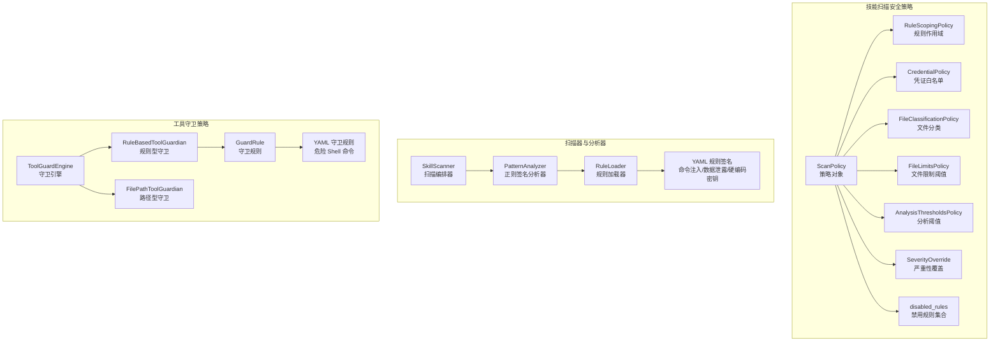
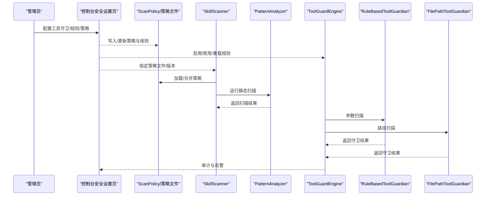
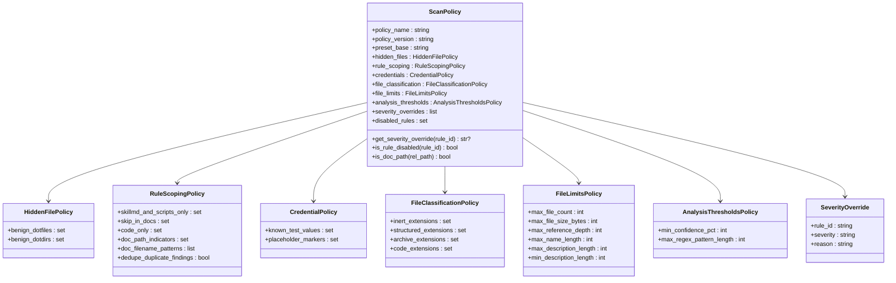
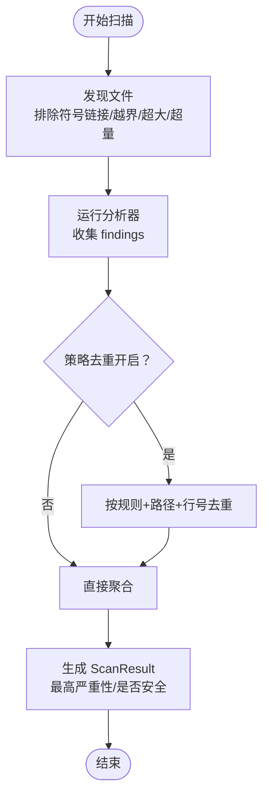
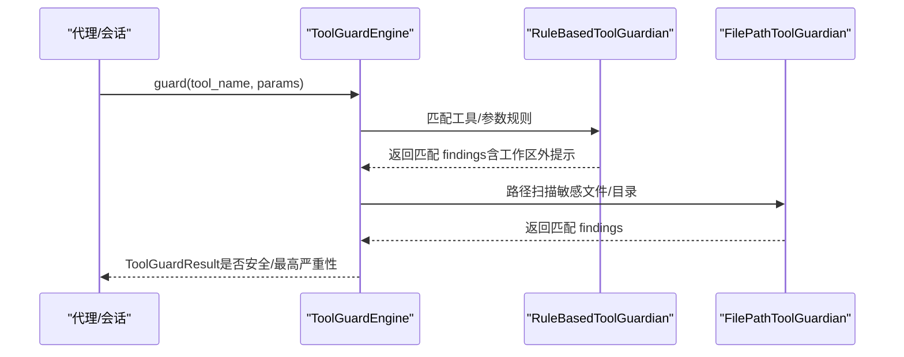
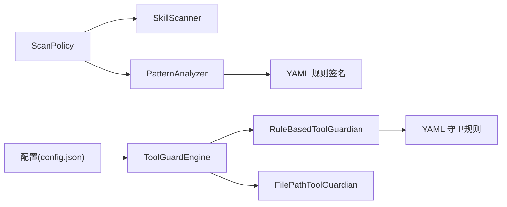

# 安全策略

<cite>
**本文引用的文件**
- [default_policy.yaml](file://src/qwenpaw/security/skill_scanner/data/default_policy.yaml)
- [scan_policy.py](file://src/qwenpaw/security/skill_scanner/scan_policy.py)
- [models.py（扫描模型）](file://src/qwenpaw/security/skill_scanner/models.py)
- [scanner.py](file://src/qwenpaw/security/skill_scanner/scanner.py)
- [pattern_analyzer.py](file://src/qwenpaw/security/skill_scanner/analyzers/pattern_analyzer.py)
- [command_injection.yaml](file://src/qwenpaw/security/skill_scanner/rules/signatures/command_injection.yaml)
- [data_exfiltration.yaml](file://src/qwenpaw/security/skill_scanner/rules/signatures/data_exfiltration.yaml)
- [hardcoded_secrets.yaml](file://src/qwenpaw/security/skill_scanner/rules/signatures/hardcoded_secrets.yaml)
- [engine.py（工具守卫引擎）](file://src/qwenpaw/security/tool_guard/engine.py)
- [models.py（工具守卫模型）](file://src/qwenpaw/security/tool_guard/models.py)
- [rule_guardian.py](file://src/qwenpaw/security/tool_guard/guardians/rule_guardian.py)
- [file_guardian.py](file://src/qwenpaw/security/tool_guard/guardians/file_guardian.py)
- [dangerous_shell_commands.yaml](file://src/qwenpaw/security/tool_guard/rules/dangerous_shell_commands.yaml)
- [index.tsx（控制台安全设置页）](file://console/src/pages/Settings/Security/index.tsx)
- [SECURITY.md](file://SECURITY.md)
</cite>

## 目录
1. [简介](#简介)
2. [项目结构](#项目结构)
3. [核心组件](#核心组件)
4. [架构总览](#架构总览)
5. [详细组件分析](#详细组件分析)
6. [依赖关系分析](#依赖关系分析)
7. [性能考量](#性能考量)
8. [故障排查指南](#故障排查指南)
9. [结论](#结论)
10. [附录](#附录)

## 简介
本文件为 QwenPaw 技能安全策略系统的详细配置与使用指南，覆盖默认安全策略的配置结构、威胁评估标准、策略文件语法与字段定义、验证规则、威胁等级划分、风险权重计算方式、策略继承与合并机制、自定义策略创建与参数调整、策略版本管理、策略测试与效果评估、策略与扫描结果映射、策略执行日志与审计能力，以及多租户环境下的策略隔离与策略模板复用机制。目标是帮助安全运营人员与平台管理员在不改变代码的前提下，通过策略与规则文件实现对技能包与工具调用的精细化安全管控。

## 项目结构
安全策略系统由两大部分组成：
- 技能扫描安全策略与规则：负责对技能包进行静态扫描，识别命令注入、数据泄露、硬编码密钥等高危模式，并支持策略继承与覆盖。
- 工具调用守卫策略与规则：在运行时拦截工具参数，阻断危险路径访问与高危命令，保障主机与数据安全。

图表来源
- [scan_policy.py:156-177](file://src/qwenpaw/security/skill_scanner/scan_policy.py#L156-L177)
- [scanner.py:76-138](file://src/qwenpaw/security/skill_scanner/scanner.py#L76-L138)
- [pattern_analyzer.py:236-260](file://src/qwenpaw/security/skill_scanner/analyzers/pattern_analyzer.py#L236-L260)
- [engine.py（工具守卫引擎）:53-130](file://src/qwenpaw/security/tool_guard/engine.py#L53-L130)
- [rule_guardian.py:559-593](file://src/qwenpaw/security/tool_guard/guardians/rule_guardian.py#L559-L593)

章节来源
- [scan_policy.py:156-177](file://src/qwenpaw/security/skill_scanner/scan_policy.py#L156-L177)
- [scanner.py:76-138](file://src/qwenpaw/security/skill_scanner/scanner.py#L76-L138)
- [pattern_analyzer.py:236-260](file://src/qwenpaw/security/skill_scanner/analyzers/pattern_analyzer.py#L236-L260)
- [engine.py（工具守卫引擎）:53-130](file://src/qwenpaw/security/tool_guard/engine.py#L53-L130)
- [rule_guardian.py:559-593](file://src/qwenpaw/security/tool_guard/guardians/rule_guardian.py#L559-L593)

## 核心组件
- 策略对象与继承
  - ScanPolicy：组织级扫描策略，包含隐藏文件、规则作用域、凭证白名单、文件分类、文件限制、分析阈值、严重性覆盖、禁用规则等分段配置；支持从内置默认策略叠加用户自定义策略。
  - 默认策略文件 default_policy.yaml：内置的“平衡”策略基线，可被组织策略覆盖。
- 扫描器与分析器
  - SkillScanner：扫描编排器，负责发现文件、加载策略、运行分析器并聚合结果。
  - PatternAnalyzer：基于 YAML 正则签名的静态扫描分析器，按文件类型匹配规则，支持文档路径跳过、仅代码文件过滤、重复项去重、已知测试凭证抑制等。
- 工具守卫引擎与守卫者
  - ToolGuardEngine：工具调用前置守卫编排器，按配置启用/禁用、选择守卫范围与拒绝列表、动态重载规则。
  - RuleBasedToolGuardian：基于 YAML 守卫规则的参数扫描守卫，支持工具名/参数名限定、正则匹配、排除模式、工作区外路径检查增强提示。
  - FilePathToolGuardian：基于路径敏感目录/文件的白名单/黑名单守卫，支持 shell 命令路径提取与工作区边界检查。

章节来源
- [scan_policy.py:156-177](file://src/qwenpaw/security/skill_scanner/scan_policy.py#L156-L177)
- [default_policy.yaml:1-243](file://src/qwenpaw/security/skill_scanner/data/default_policy.yaml#L1-L243)
- [scanner.py:76-138](file://src/qwenpaw/security/skill_scanner/scanner.py#L76-L138)
- [pattern_analyzer.py:236-260](file://src/qwenpaw/security/skill_scanner/analyzers/pattern_analyzer.py#L236-L260)
- [engine.py（工具守卫引擎）:53-130](file://src/qwenpaw/security/tool_guard/engine.py#L53-L130)
- [rule_guardian.py:559-593](file://src/qwenpaw/security/tool_guard/guardians/rule_guardian.py#L559-L593)
- [file_guardian.py:184-247](file://src/qwenpaw/security/tool_guard/guardians/file_guardian.py#L184-L247)

## 架构总览
下图展示了策略如何贯穿扫描与守卫流程，以及策略与规则文件之间的关系：

图表来源
- [index.tsx（控制台安全设置页）:40-120](file://console/src/pages/Settings/Security/index.tsx#L40-L120)
- [scan_policy.py:261-282](file://src/qwenpaw/security/skill_scanner/scan_policy.py#L261-L282)
- [scanner.py:148-242](file://src/qwenpaw/security/skill_scanner/scanner.py#L148-L242)
- [pattern_analyzer.py:265-347](file://src/qwenpaw/security/skill_scanner/analyzers/pattern_analyzer.py#L265-L347)
- [engine.py（工具守卫引擎）:169-226](file://src/qwenpaw/security/tool_guard/engine.py#L169-L226)
- [rule_guardian.py:608-757](file://src/qwenpaw/security/tool_guard/guardians/rule_guardian.py#L608-L757)
- [file_guardian.py:313-364](file://src/qwenpaw/security/tool_guard/guardians/file_guardian.py#L313-L364)

## 详细组件分析

### 组件一：扫描策略与规则体系
- 策略继承与合并
  - ScanPolicy.default() 加载内置 default_policy.yaml。
  - ScanPolicy.from_yaml(...) 将用户策略与内置策略进行深合并，用户策略仅覆盖指定键，列表/集合以用户覆盖为准。
  - 支持预设策略名称（当前为“balanced”，未来可扩展“strict/permissive”）。
- 策略分段与字段
  - hidden_files：允许的点文件/点目录白名单。
  - rule_scoping：规则作用域控制（仅技能文档与脚本、文档路径跳过、仅代码文件、文档文件名模式、重复项去重）。
  - credentials：已知测试值与占位符标记，自动抑制误报。
  - file_classification：文件类型分类（惰性文件、结构化文件、归档文件、代码文件）。
  - file_limits：文件数量、大小、引用深度、名称/描述长度阈值。
  - analysis_thresholds：最小置信度百分比、最大正则长度。
  - severity_overrides：按规则 ID 的严重性覆盖。
  - disabled_rules：禁用规则集合。
- 规则签名
  - PatternAnalyzer 从 rules/signatures/ 目录加载 YAML 规则，按文件类型筛选适用规则，支持行内匹配与跨行匹配，支持排除模式，支持策略层面的严重性覆盖与重复项去重。
  - 内置规则类别：命令注入、数据泄露、硬编码密钥等。

图表来源
- [scan_policy.py:74-177](file://src/qwenpaw/security/skill_scanner/scan_policy.py#L74-L177)

章节来源
- [scan_policy.py:236-304](file://src/qwenpaw/security/skill_scanner/scan_policy.py#L236-L304)
- [default_policy.yaml:1-243](file://src/qwenpaw/security/skill_scanner/data/default_policy.yaml#L1-L243)
- [pattern_analyzer.py:38-92](file://src/qwenpaw/security/skill_scanner/analyzers/pattern_analyzer.py#L38-L92)

### 组件二：扫描流程与结果映射
- 扫描流程
  - 文件发现：遍历技能目录，排除符号链接、越界文件、超大文件、超过阈值的文件数；按策略合并的跳过扩展集过滤。
  - 分析器执行：逐个分析器运行，收集 findings 并记录失败的分析器。
  - 结果聚合：按策略去重（若开启），生成 ScanResult，包含最高严重性、是否安全、耗时、时间戳等。
- 结果模型
  - Finding：包含规则 ID、类别、严重性、标题、描述、文件路径、行号、片段、修复建议、分析器、元数据等。
  - ScanResult：包含技能名、路径、findings 列表、扫描耗时、使用的分析器、失败的分析器、时间戳等；提供按严重性/类别的查询方法。

图表来源
- [scanner.py:148-242](file://src/qwenpaw/security/skill_scanner/scanner.py#L148-L242)
- [models.py（扫描模型）:129-234](file://src/qwenpaw/security/skill_scanner/models.py#L129-L234)

章节来源
- [scanner.py:148-242](file://src/qwenpaw/security/skill_scanner/scanner.py#L148-L242)
- [models.py（扫描模型）:129-234](file://src/qwenpaw/security/skill_scanner/models.py#L129-L234)

### 组件三：工具守卫策略与规则
- 守卫引擎
  - ToolGuardEngine：按配置启用/禁用，注册/注销守卫者，动态重载规则，按工具名/参数名筛选适用规则，记录守卫耗时与失败的守卫者。
- 守卫者
  - RuleBasedToolGuardian：从 YAML 规则目录加载规则，支持工具/参数限定、忽略大小写正则匹配、排除模式、工作区外路径检查增强提示（如 rm 命令的目标路径越界）。
  - FilePathToolGuardian：基于敏感文件/目录白名单阻断访问，支持 shell 命令路径提取、工作区边界检查、兼容历史/当前密钥目录。
- 规则文件
  - dangerous_shell_commands.yaml：覆盖 rm/mv/fs 破坏、拒绝服务、管道下载执行、反向 shell、权限提升、系统重启、服务管理、进程终止、特权提升等高危模式。

图表来源
- [engine.py（工具守卫引擎）:169-226](file://src/qwenpaw/security/tool_guard/engine.py#L169-L226)
- [rule_guardian.py:608-757](file://src/qwenpaw/security/tool_guard/guardians/rule_guardian.py#L608-L757)
- [file_guardian.py:313-364](file://src/qwenpaw/security/tool_guard/guardians/file_guardian.py#L313-L364)

章节来源
- [engine.py（工具守卫引擎）:53-130](file://src/qwenpaw/security/tool_guard/engine.py#L53-L130)
- [rule_guardian.py:559-593](file://src/qwenpaw/security/tool_guard/guardians/rule_guardian.py#L559-L593)
- [file_guardian.py:184-247](file://src/qwenpaw/security/tool_guard/guardians/file_guardian.py#L184-L247)

### 组件四：控制台安全设置与策略管理
- 控制台页面提供：
  - 工具守卫开关、受保护工具列表、拒绝工具列表、自定义规则增删改查、规则预览、保存/重置。
  - 技能扫描策略与规则的可视化配置入口。
- 策略持久化与生效：
  - 通过 API 更新配置后，守卫引擎与扫描器可重新加载策略/规则，实现热更新。

章节来源
- [index.tsx（控制台安全设置页）:40-120](file://console/src/pages/Settings/Security/index.tsx#L40-L120)
- [index.tsx（控制台安全设置页）:122-200](file://console/src/pages/Settings/Security/index.tsx#L122-L200)
- [index.tsx（控制台安全设置页）:316-342](file://console/src/pages/Settings/Security/index.tsx#L316-L342)

## 依赖关系分析
- 策略与扫描器
  - SkillScanner 依赖 ScanPolicy 获取文件分类、跳过扩展、文件限制、规则作用域、严重性覆盖、重复项去重等。
  - PatternAnalyzer 依赖 ScanPolicy 进行规则禁用、文档路径跳过、仅代码文件过滤、已知测试凭证抑制、重复项去重。
- 策略与守卫
  - ToolGuardEngine 依赖配置决定启用状态、受保护工具、拒绝工具、自定义规则与禁用规则集合。
  - RuleBasedToolGuardian 依赖 YAML 规则目录与配置中的自定义规则，动态合并并过滤禁用规则。
  - FilePathToolGuardian 依赖配置中的敏感文件/目录列表与工作区根路径。

图表来源
- [scanner.py:100-138](file://src/qwenpaw/security/skill_scanner/scanner.py#L100-L138)
- [pattern_analyzer.py:249-260](file://src/qwenpaw/security/skill_scanner/analyzers/pattern_analyzer.py#L249-L260)
- [engine.py（工具守卫引擎）:141-153](file://src/qwenpaw/security/tool_guard/engine.py#L141-L153)
- [rule_guardian.py:518-551](file://src/qwenpaw/security/tool_guard/guardians/rule_guardian.py#L518-L551)

章节来源
- [scanner.py:100-138](file://src/qwenpaw/security/skill_scanner/scanner.py#L100-L138)
- [pattern_analyzer.py:249-260](file://src/qwenpaw/security/skill_scanner/analyzers/pattern_analyzer.py#L249-L260)
- [engine.py（工具守卫引擎）:141-153](file://src/qwenpaw/security/tool_guard/engine.py#L141-L153)
- [rule_guardian.py:518-551](file://src/qwenpaw/security/tool_guard/guardians/rule_guardian.py#L518-L551)

## 性能考量
- 正则编译与缓存
  - PatternAnalyzer 对规则正则进行编译缓存，避免重复开销；对过长/非法正则进行警告与跳过。
  - RuleBasedToolGuardian 预编译正则与排除正则，减少运行时匹配成本。
- 文件扫描优化
  - 使用策略合并后的跳过扩展集快速过滤惰性/归档/结构化文件，降低 IO 与解析压力。
  - 文件发现阶段提前截断超过阈值的文件数量与单文件大小，防止资源耗尽。
- 去重与阈值
  - 策略支持重复项去重与最小置信度阈值，减少冗余结果与误报影响。

章节来源
- [pattern_analyzer.py:49-84](file://src/qwenpaw/security/skill_scanner/analyzers/pattern_analyzer.py#L49-L84)
- [scanner.py:31-68](file://src/qwenpaw/security/skill_scanner/scanner.py#L31-L68)
- [scan_policy.py:134-140](file://src/qwenpaw/security/skill_scanner/scan_policy.py#L134-L140)

## 故障排查指南
- 策略加载失败
  - 检查策略文件是否存在、YAML 语法是否正确、字段类型是否符合预期；内置策略加载失败时回退为空策略。
- 分析器异常
  - 扫描器记录失败的分析器及其错误信息；可在控制台查看失败详情并定位问题。
- 正则无效或过长
  - PatternAnalyzer 与 RuleBasedToolGuardian 对非法/过长正则进行警告并跳过；请缩短或修正正则表达式。
- 工作区边界检查
  - FilePathToolGuardian 在路径解析失败或边界判断异常时采用保守策略（视为越界），请检查工作区根路径与环境变量展开。

章节来源
- [scanner.py:200-213](file://src/qwenpaw/security/skill_scanner/scanner.py#L200-L213)
- [pattern_analyzer.py:68-84](file://src/qwenpaw/security/skill_scanner/analyzers/pattern_analyzer.py#L68-L84)
- [file_guardian.py:120-162](file://src/qwenpaw/security/tool_guard/guardians/file_guardian.py#L120-L162)

## 结论
QwenPaw 的安全策略系统通过“策略 + 规则”的双层设计实现了对技能包与工具调用的全面防护。策略文件提供了组织级的可配置基线，规则文件提供了细粒度的检测能力。通过控制台界面，管理员可以便捷地调整策略、增删规则、查看扫描与守卫结果，并结合审计日志与告警实现持续的安全治理。

## 附录

### A. 默认安全策略配置结构与字段说明
- 策略元数据
  - policy_name：策略名称
  - policy_version：策略版本
  - preset_base：预设基线（当前为 balanced）
- 隐藏文件
  - benign_dotfiles：允许的点文件白名单
  - benign_dotdirs：允许的点目录白名单
- 规则作用域
  - skillmd_and_scripts_only：仅适用于 SKILL.md 与脚本的规则集合
  - skip_in_docs：在文档路径中跳过的规则集合
  - code_only：仅在代码文件中触发的规则集合
  - doc_path_indicators：文档路径指示词
  - doc_filename_patterns：文档文件名模式（正则）
  - dedupe_duplicate_findings：是否去重重复发现
- 凭证白名单
  - known_test_values：已知测试值
  - placeholder_markers：占位符标记
- 文件分类
  - inert_extensions：惰性文件扩展（图片/字体等）
  - structured_extensions：结构化文件扩展（PDF/DOCX/XLSX/PPTX/ODT）
  - archive_extensions：归档文件扩展（ZIP/TAR/GZ/RAR 等）
  - code_extensions：代码文件扩展（Python/Shell/JS/TS 等）
- 文件限制
  - max_file_count：最大文件数量
  - max_file_size_bytes：最大单文件字节数
  - max_reference_depth：最大引用深度
  - max_name_length：最大名称长度
  - max_description_length：最大描述长度
  - min_description_length：最小描述长度
- 分析阈值
  - min_confidence_pct：最小置信度百分比
  - max_regex_pattern_length：最大正则长度
- 严重性覆盖
  - severity_overrides：按规则 ID 的严重性覆盖列表
- 禁用规则
  - disabled_rules：禁用规则集合

章节来源
- [default_policy.yaml:1-243](file://src/qwenpaw/security/skill_scanner/data/default_policy.yaml#L1-L243)
- [scan_policy.py:156-177](file://src/qwenpaw/security/skill_scanner/scan_policy.py#L156-L177)

### B. 威胁等级划分与风险权重
- 扫描严重性等级
  - CRITICAL/HIGH/MEDIUM/LOW/INFO/SAFE
- 工具守卫严重性等级
  - CRITICAL/HIGH/MEDIUM/LOW/INFO/SAFE
- 最高严重性判定
  - 扫描结果与工具守卫结果均按降序取首个出现的严重性作为最高严重性。

章节来源
- [models.py（扫描模型）:19-28](file://src/qwenpaw/security/skill_scanner/models.py#L19-L28)
- [models.py（扫描模型）:194-209](file://src/qwenpaw/security/skill_scanner/models.py#L194-L209)
- [models.py（工具守卫模型）:25-34](file://src/qwenpaw/security/tool_guard/models.py#L25-L34)
- [models.py（工具守卫模型）:129-144](file://src/qwenpaw/security/tool_guard/models.py#L129-L144)

### C. 策略继承与合并机制
- 内置默认策略与用户策略的深合并，用户仅需覆盖差异部分；列表/集合以用户策略替换为基础。
- 预设策略名称（当前为 balanced），未来可扩展“strict/permissive”。

章节来源
- [scan_policy.py:261-282](file://src/qwenpaw/security/skill_scanner/scan_policy.py#L261-L282)
- [scan_policy.py:316-334](file://src/qwenpaw/security/skill_scanner/scan_policy.py#L316-L334)
- [scan_policy.py:244-258](file://src/qwenpaw/security/skill_scanner/scan_policy.py#L244-L258)

### D. 自定义策略创建与参数调整
- 创建步骤
  - 从内置策略导出完整策略文件（to_yaml），在导出文件基础上仅修改需要覆盖的部分。
  - 通过控制台安全设置页上传/应用策略文件，或在启动时指定策略文件路径。
- 参数调整建议
  - 优先调整 file_classification 与 file_limits 以适配项目规模。
  - 通过 severity_overrides 与 disabled_rules 微调规则行为。
  - 使用 doc_path_indicators 与 doc_filename_patterns 控制文档路径的规则跳过。

章节来源
- [scan_policy.py:283-304](file://src/qwenpaw/security/skill_scanner/scan_policy.py#L283-L304)
- [index.tsx（控制台安全设置页）:89-120](file://console/src/pages/Settings/Security/index.tsx#L89-L120)

### E. 策略版本管理
- 策略文件包含 policy_version 字段，便于追踪策略变更与回滚。
- 建议每次策略调整均递增版本号并在变更日志中记录。

章节来源
- [default_policy.yaml:9-11](file://src/qwenpaw/security/skill_scanner/data/default_policy.yaml#L9-L11)
- [scan_policy.py:160-163](file://src/qwenpaw/security/skill_scanner/scan_policy.py#L160-L163)

### F. 策略测试与效果评估
- 测试工具
  - 使用 SkillScanner 对样例技能包进行扫描，观察 findings 数量与最高严重性。
  - 使用 ToolGuardEngine 对典型高危命令进行守卫测试，验证阻断与提示信息。
- 效果评估
  - 关注误报率（known_test_values 与 exclude_patterns 的配置）、漏报率（规则覆盖率）、扫描耗时（文件限制与阈值）。
- 优化建议
  - 基于扫描报告统计各严重性分布，逐步收紧阈值与规则集合。
  - 引入规则覆盖率与误报率指标，定期评估与迭代。

章节来源
- [scanner.py:148-242](file://src/qwenpaw/security/skill_scanner/scanner.py#L148-L242)
- [engine.py（工具守卫引擎）:169-226](file://src/qwenpaw/security/tool_guard/engine.py#L169-L226)

### G. 策略与扫描结果映射
- 扫描结果映射
  - Finding 中包含 rule_id、category、severity、title、description、file_path、line_number、snippet、remediation、analyzer、metadata 等字段。
  - ScanResult 提供按严重性/类别的查询方法与序列化输出。
- 守卫结果映射
  - GuardFinding 包含 rule_id、category、severity、title、description、tool_name、param_name、matched_value、matched_pattern、snippet、remediation、guardian、metadata 等字段。
  - ToolGuardResult 提供守卫耗时、使用的守卫者、失败的守卫者、最高严重性等。

章节来源
- [models.py（扫描模型）:129-161](file://src/qwenpaw/security/skill_scanner/models.py#L129-L161)
- [models.py（扫描模型）:168-234](file://src/qwenpaw/security/skill_scanner/models.py#L168-L234)
- [models.py（工具守卫模型）:60-96](file://src/qwenpaw/security/tool_guard/models.py#L60-L96)
- [models.py（工具守卫模型）:103-176](file://src/qwenpaw/security/tool_guard/models.py#L103-L176)

### H. 策略执行日志与审计
- 日志记录
  - 扫描器记录扫描耗时、发现数量、是否安全、失败的分析器。
  - 守卫引擎记录守卫耗时、失败的守卫者、最高严重性。
- 审计能力
  - 结果对象包含时间戳，便于审计与溯源。
  - 控制台提供规则预览与保存/重置功能，便于策略变更审计。

章节来源
- [scanner.py:235-242](file://src/qwenpaw/security/skill_scanner/scanner.py#L235-L242)
- [engine.py（工具守卫引擎）:214-226](file://src/qwenpaw/security/tool_guard/engine.py#L214-L226)
- [models.py（扫描模型）:178-180](file://src/qwenpaw/security/skill_scanner/models.py#L178-L180)
- [models.py（工具守卫模型）:113-115](file://src/qwenpaw/security/tool_guard/models.py#L113-L115)
- [index.tsx（控制台安全设置页）:386-418](file://console/src/pages/Settings/Security/index.tsx#L386-L418)

### I. 多租户环境下的策略隔离与策略模板复用
- 信任模型
  - 项目安全模型为“个人助理”（一个可信操作员），不推荐共享实例承载互不信任的多租户。
  - 若必须共享，建议使用独立主机/用户/容器/虚拟机与独立配置，避免上下文边界混淆。
- 策略隔离
  - 不同租户应使用独立的策略文件与配置，避免策略互相覆盖。
- 策略模板复用
  - 可将通用策略作为模板，按租户差异进行小范围覆盖（利用策略合并机制）。

章节来源
- [SECURITY.md:65-118](file://SECURITY.md#L65-L118)