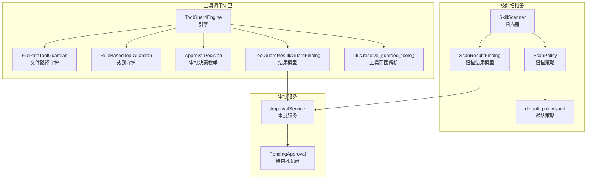
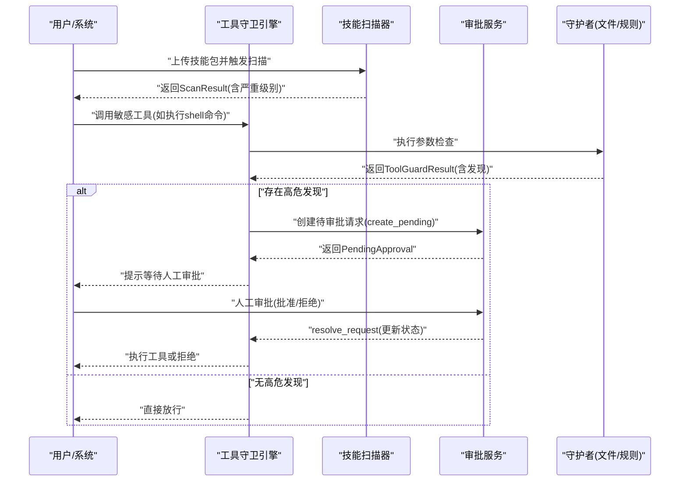
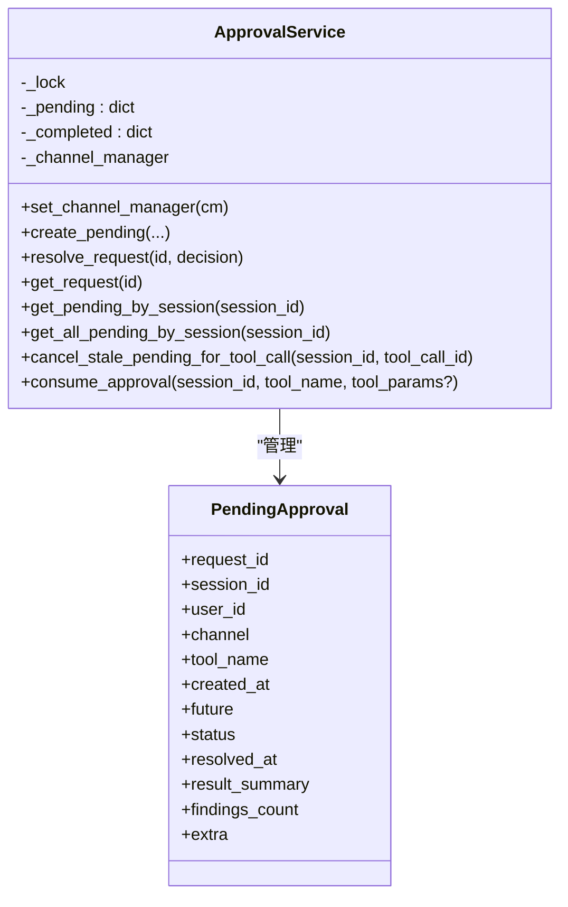
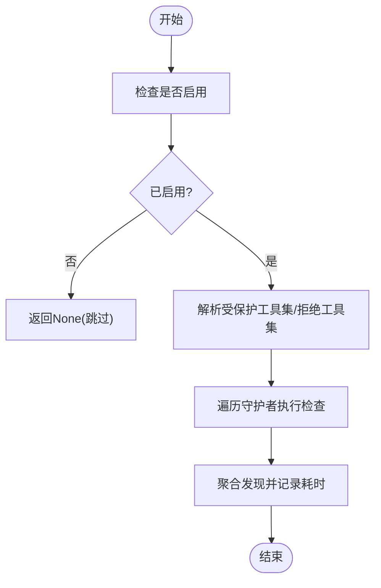
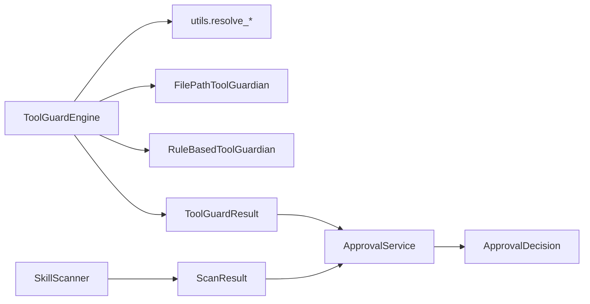

# 审批流程

<cite>
**本文引用的文件**
- [src\qwenpaw\app\approvals\__init__.py](file://src\qwenpaw\app\approvals\__init__.py)
- [src\qwenpaw\app\approvals\service.py](file://src\qwenpaw\app\approvals\service.py)
- [src\qwenpaw\security\tool_guard\approval.py](file://src\qwenpaw\security\tool_guard\approval.py)
- [src\qwenpaw\security\tool_guard\models.py](file://src\qwenpaw\security\tool_guard\models.py)
- [src\qwenpaw\security\tool_guard\engine.py](file://src\qwenpaw\security\tool_guard\engine.py)
- [src\qwenpaw\security\tool_guard\utils.py](file://src\qwenpaw\security\tool_guard\utils.py)
- [src\qwenpaw\security\tool_guard\guardians\file_guardian.py](file://src\qwenpaw\security\tool_guard\guardians\file_guardian.py)
- [src\qwenpaw\security\tool_guard\guardians\rule_guardian.py](file://src\qwenpaw\security\tool_guard\guardians\rule_guardian.py)
- [src\qwenpaw\security\skill_scanner\scanner.py](file://src\qwenpaw\security\skill_scanner\scanner.py)
- [src\qwenpaw\security\skill_scanner\models.py](file://src\qwenpaw\security\skill_scanner\models.py)
- [src\qwenpaw\security\skill_scanner\scan_policy.py](file://src\qwenpaw\security\skill_scanner\scan_policy.py)
- [src\qwenpaw\security\skill_scanner\data\default_policy.yaml](file://src\qwenpaw\security\skill_scanner\data\default_policy.yaml)
</cite>

## 目录
1. [简介](#简介)
2. [项目结构](#项目结构)
3. [核心组件](#核心组件)
4. [架构总览](#架构总览)
5. [详细组件分析](#详细组件分析)
6. [依赖分析](#依赖分析)
7. [性能考虑](#性能考虑)
8. [故障排查指南](#故障排查指南)
9. [结论](#结论)
10. [附录](#附录)

## 简介
本文件面向QwenPaw的“技能审批流程”，系统化阐述技能上传后的安全扫描与审批机制，覆盖自动审批与人工审核的协同、审批状态管理、权限控制、审批历史、高风险技能强制审批、审批决策算法、审批结果处理、审批配置与超时处理、审批界面与批量操作、审批统计与合规审计等主题。同时解释审批与扫描结果的关联关系、审批策略定制与流程优化建议。

## 项目结构
围绕审批流程的关键模块分布如下：
- 工具调用守卫（Tool Guard）：在执行敏感工具前进行参数级安全检查，产出ToolGuardResult；若存在高危发现则触发审批请求。
- 技能扫描器（Skill Scanner）：对技能包进行静态扫描，产出ScanResult；可作为审批前置条件之一。
- 审批服务（Approval Service）：集中管理待审批与已审批记录，支持审批决策、超时回收、参数校验与历史清理。
- 配置与策略：通过环境变量与配置文件解析受保护工具集、拒绝工具集、扫描策略等。

**图表来源**
- [src\qwenpaw\security\tool_guard\engine.py:53-238](file://src\qwenpaw\security\tool_guard\engine.py#L53-L238)
- [src\qwenpaw\security\tool_guard\guardians\file_guardian.py:184-365](file://src\qwenpaw\security\tool_guard\guardians\file_guardian.py#L184-L365)
- [src\qwenpaw\security\tool_guard\guardians\rule_guardian.py:559-758](file://src\qwenpaw\security\tool_guard\guardians\rule_guardian.py#L559-L758)
- [src\qwenpaw\security\tool_guard\models.py:103-185](file://src\qwenpaw\security\tool_guard\models.py#L103-L185)
- [src\qwenpaw\security\tool_guard\utils.py:64-127](file://src\qwenpaw\security\tool_guard\utils.py#L64-L127)
- [src\qwenpaw\security\tool_guard\approval.py:12-42](file://src\qwenpaw\security\tool_guard\approval.py#L12-L42)
- [src\qwenpaw\security\skill_scanner\scanner.py:76-319](file://src\qwenpaw\security\skill_scanner\scanner.py#L76-L319)
- [src\qwenpaw\security\skill_scanner\models.py:168-235](file://src\qwenpaw\security\skill_scanner\models.py#L168-L235)
- [src\qwenpaw\security\skill_scanner\scan_policy.py:156-476](file://src\qwenpaw\security\skill_scanner\scan_policy.py#L156-L476)
- [src\qwenpaw\security\skill_scanner\data\default_policy.yaml:1-243](file://src\qwenpaw\security\skill_scanner\data\default_policy.yaml#L1-L243)
- [src\qwenpaw\app\approvals\service.py:58-341](file://src\qwenpaw\app\approvals\service.py#L58-L341)

**章节来源**
- [src\qwenpaw\security\tool_guard\engine.py:53-238](file://src\qwenpaw\security\tool_guard\engine.py#L53-L238)
- [src\qwenpaw\security\tool_guard\guardians\file_guardian.py:184-365](file://src\qwenpaw\security\tool_guard\guardians\file_guardian.py#L184-L365)
- [src\qwenpaw\security\tool_guard\guardians\rule_guardian.py:559-758](file://src\qwenpaw\security\tool_guard\guardians\rule_guardian.py#L559-L758)
- [src\qwenpaw\security\tool_guard\models.py:103-185](file://src\qwenpaw\security\tool_guard\models.py#L103-L185)
- [src\qwenpaw\security\tool_guard\utils.py:64-127](file://src\qwenpaw\security\tool_guard\utils.py#L64-L127)
- [src\qwenpaw\security\tool_guard\approval.py:12-42](file://src\qwenpaw\security\tool_guard\approval.py#L12-L42)
- [src\qwenpaw\security\skill_scanner\scanner.py:76-319](file://src\qwenpaw\security\skill_scanner\scanner.py#L76-L319)
- [src\qwenpaw\security\skill_scanner\models.py:168-235](file://src\qwenpaw\security\skill_scanner\models.py#L168-L235)
- [src\qwenpaw\security\skill_scanner\scan_policy.py:156-476](file://src\qwenpaw\security\skill_scanner\scan_policy.py#L156-L476)
- [src\qwenpaw\security\skill_scanner\data\default_policy.yaml:1-243](file://src\qwenpaw\security\skill_scanner\data\default_policy.yaml#L1-L243)
- [src\qwenpaw\app\approvals\service.py:58-341](file://src\qwenpaw\app\approvals\service.py#L58-L341)

## 核心组件
- 工具调用守卫引擎：按配置决定是否对工具调用进行参数级安全检查，聚合各守护者的结果，生成ToolGuardResult。
- 文件路径守护：针对敏感文件/目录访问进行阻断，匹配高危路径并生成高危发现。
- 规则守护：基于YAML签名规则对参数字符串进行正则匹配，识别高危模式并生成发现。
- 审批服务：集中维护待审批与已完成审批记录，支持审批决策、参数一致性校验、超时回收与历史清理。
- 技能扫描器：对技能包进行静态扫描，产出ScanResult，作为审批前置条件之一。
- 扫描策略：组织级策略，定义规则作用域、文件分类、阈值与严重性覆盖等。

**章节来源**
- [src\qwenpaw\security\tool_guard\engine.py:53-238](file://src\qwenpaw\security\tool_guard\engine.py#L53-L238)
- [src\qwenpaw\security\tool_guard\guardians\file_guardian.py:184-365](file://src\qwenpaw\security\tool_guard\guardians\file_guardian.py#L184-L365)
- [src\qwenpaw\security\tool_guard\guardians\rule_guardian.py:559-758](file://src\qwenpaw\security\tool_guard\guardians\rule_guardian.py#L559-L758)
- [src\qwenpaw\app\approvals\service.py:58-341](file://src\qwenpaw\app\approvals\service.py#L58-L341)
- [src\qwenpaw\security\skill_scanner\scanner.py:76-319](file://src\qwenpaw\security\skill_scanner\scanner.py#L76-L319)
- [src\qwenpaw\security\skill_scanner\scan_policy.py:156-476](file://src\qwenpaw\security\skill_scanner\scan_policy.py#L156-L476)

## 架构总览
下图展示从技能上传到审批完成的关键交互路径，包括自动审批与人工审批的协同、审批状态流转与超时处理。

**图表来源**
- [src\qwenpaw\security\tool_guard\engine.py:169-227](file://src\qwenpaw\security\tool_guard\engine.py#L169-L227)
- [src\qwenpaw\security\tool_guard\guardians\file_guardian.py:313-365](file://src\qwenpaw\security\tool_guard\guardians\file_guardian.py#L313-L365)
- [src\qwenpaw\security\tool_guard\guardians\rule_guardian.py:608-758](file://src\qwenpaw\security\tool_guard\guardians\rule_guardian.py#L608-L758)
- [src\qwenpaw\app\approvals\service.py:80-136](file://src\qwenpaw\app\approvals\service.py#L80-L136)
- [src\qwenpaw\security\skill_scanner\scanner.py:148-242](file://src\qwenpaw\security\skill_scanner\scanner.py#L148-L242)

## 详细组件分析

### 审批服务（ApprovalService）
- 数据模型
  - PendingApproval：内存中的待审批记录，包含请求ID、会话ID、用户ID、渠道、工具名、创建时间、Future对象、状态、解决时间、摘要、发现计数与额外上下文。
- 生命周期
  - 创建：create_pending根据ToolGuardResult生成摘要与发现计数，并放入待审批队列。
  - 决策：resolve_request将请求标记为批准/拒绝/超时，并写回Future以便等待方继续执行。
  - 查询：get_request/get_pending_by_session/get_all_pending_by_session支持按ID或会话查询。
  - 参数校验：consume_approval支持一次性审批消费，并对参数字典进行严格比对，防止参数替换绕过。
  - 超时与回收：cancel_stale_pending_for_tool_call取消同一次逻辑调用的旧待审批；垃圾回收按时间与数量上限清理过期/溢出记录。
- 并发与锁：所有公开方法均使用异步锁保证线程安全。

**图表来源**
- [src\qwenpaw\app\approvals\service.py:35-115](file://src\qwenpaw\app\approvals\service.py#L35-L115)
- [src\qwenpaw\app\approvals\service.py:116-262](file://src\qwenpaw\app\approvals\service.py#L116-L262)
- [src\qwenpaw\app\approvals\service.py:268-326](file://src\qwenpaw\app\approvals\service.py#L268-L326)

**章节来源**
- [src\qwenpaw\app\approvals\service.py:58-341](file://src\qwenpaw\app\approvals\service.py#L58-L341)

### 工具调用守卫（ToolGuardEngine）
- 功能概述
  - 按配置启用/禁用；默认开启；支持环境变量优先级覆盖。
  - 默认守护者集合：文件路径守护、规则守护。
  - 受保护工具集与拒绝工具集由配置/环境变量解析，支持通配符与空集。
- 关键接口
  - guard：对单次工具调用参数进行检查，返回ToolGuardResult。
  - register/unregister：动态注册/注销守护者。
  - reload_rules：重载规则并刷新工具集。
  - is_guarded/is_denied：判断工具是否在保护范围内或被直接拒绝。

**图表来源**
- [src\qwenpaw\security\tool_guard\engine.py:35-164](file://src\qwenpaw\security\tool_guard\engine.py#L35-L164)
- [src\qwenpaw\security\tool_guard\engine.py:169-227](file://src\qwenpaw\security\tool_guard\engine.py#L169-L227)

**章节来源**
- [src\qwenpaw\security\tool_guard\engine.py:53-238](file://src\qwenpaw\security\tool_guard\engine.py#L53-L238)
- [src\qwenpaw\security\tool_guard\utils.py:64-127](file://src\qwenpaw\security\tool_guard\utils.py#L64-L127)

### 文件路径守护（FilePathToolGuardian）
- 功能概述
  - 对敏感文件/目录访问进行阻断；支持相对路径解析、工作区边界检查、兼容历史密钥目录。
  - 支持从配置加载敏感文件列表，支持添加/移除与重载。
- 关键逻辑
  - 将输入路径标准化为绝对路径，判断是否命中敏感文件或目录。
  - 对shell命令提取候选路径并逐一检查。
  - 生成高危发现并附带修复建议与元数据。

**章节来源**
- [src\qwenpaw\security\tool_guard\guardians\file_guardian.py:184-365](file://src\qwenpaw\security\tool_guard\guardians\file_guardian.py#L184-L365)

### 规则守护（RuleBasedToolGuardian）
- 功能概述
  - 基于YAML规则对参数字符串进行正则匹配，识别高危模式。
  - 支持自定义规则与禁用规则，支持工作区外文件删除的特殊提示。
- 关键逻辑
  - 加载内置规则与自定义规则，合并并过滤禁用规则。
  - 对适用工具与参数执行匹配，生成发现并附带上下文片段与修复建议。

**章节来源**
- [src\qwenpaw\security\tool_guard\guardians\rule_guardian.py:559-758](file://src\qwenpaw\security\tool_guard\guardians\rule_guardian.py#L559-L758)

### 审批决策与摘要格式化
- 审批决策枚举：approved、denied、timeout。
- 发现摘要格式化：将ToolGuardResult中的发现汇总为简洁Markdown摘要，支持省略剩余条目。

**章节来源**
- [src\qwenpaw\security\tool_guard\approval.py:12-42](file://src\qwenpaw\security\tool_guard\approval.py#L12-L42)

### 技能扫描器与扫描策略
- 技能扫描器
  - 发现文件、去重符号链接、限制文件大小与数量。
  - 调用各分析器（默认PatternAnalyzer）进行扫描，聚合结果并记录失败的分析器。
- 扫描策略
  - 隐藏文件策略、规则作用域、凭证策略、文件分类、文件限制、分析阈值、严重性覆盖、禁用规则。
  - 默认策略文件提供组织可覆盖的基准。

**章节来源**
- [src\qwenpaw\security\skill_scanner\scanner.py:76-319](file://src\qwenpaw\security\skill_scanner\scanner.py#L76-L319)
- [src\qwenpaw\security\skill_scanner\models.py:168-235](file://src\qwenpaw\security\skill_scanner\models.py#L168-L235)
- [src\qwenpaw\security\skill_scanner\scan_policy.py:156-476](file://src\qwenpaw\security\skill_scanner\scan_policy.py#L156-L476)
- [src\qwenpaw\security\skill_scanner\data\default_policy.yaml:1-243](file://src\qwenpaw\security\skill_scanner\data\default_policy.yaml#L1-L243)

## 依赖分析
- 组件耦合
  - ToolGuardEngine依赖守护者实现（文件路径/规则），并通过utils解析受保护工具集与拒绝工具集。
  - ApprovalService依赖ToolGuardResult与ApprovalDecision，用于创建/解析待审批请求。
  - SkillScanner与ScanPolicy相互独立，但可作为审批前置条件影响审批策略。
- 外部集成点
  - 环境变量：QWENPAW_TOOL_GUARD_ENABLED、QWENPAW_TOOL_GUARD_TOOLS、QWENPAW_TOOL_GUARD_DENIED_TOOLS。
  - 配置文件：security.tool_guard与security.tool_guard.custom_rules、security.tool_guard.disabled_rules等。

**图表来源**
- [src\qwenpaw\security\tool_guard\engine.py:141-164](file://src\qwenpaw\security\tool_guard\engine.py#L141-L164)
- [src\qwenpaw\security\tool_guard\utils.py:64-127](file://src\qwenpaw\security\tool_guard\utils.py#L64-L127)
- [src\qwenpaw\security\tool_guard\guardians\file_guardian.py:184-365](file://src\qwenpaw\security\tool_guard\guardians\file_guardian.py#L184-L365)
- [src\qwenpaw\security\tool_guard\guardians\rule_guardian.py:559-758](file://src\qwenpaw\security\tool_guard\guardians\rule_guardian.py#L559-L758)
- [src\qwenpaw\security\tool_guard\models.py:103-185](file://src\qwenpaw\security\tool_guard\models.py#L103-L185)
- [src\qwenpaw\app\approvals\service.py:58-136](file://src\qwenpaw\app\approvals\service.py#L58-L136)
- [src\qwenpaw\security\skill_scanner\scanner.py:148-242](file://src\qwenpaw\security\skill_scanner\scanner.py#L148-L242)

**章节来源**
- [src\qwenpaw\security\tool_guard\engine.py:53-238](file://src\qwenpaw\security\tool_guard\engine.py#L53-L238)
- [src\qwenpaw\app\approvals\service.py:58-341](file://src\qwenpaw\app\approvals\service.py#L58-L341)
- [src\qwenpaw\security\skill_scanner\scanner.py:76-319](file://src\qwenpaw\security\skill_scanner\scanner.py#L76-L319)

## 性能考虑
- 工具守卫
  - 正则规则预编译，避免重复编译开销；路径提取采用分词与最长前缀匹配减少误报。
  - 仅在必要时解析shell命令，避免对非目标工具的过度扫描。
- 审批服务
  - 待审批与已完成记录分别维护，支持按会话FIFO顺序消费，降低并发竞争。
  - 垃圾回收按时间与数量上限双维度控制内存占用，避免长期运行内存膨胀。
- 技能扫描
  - 文件发现阶段跳过符号链接与超出大小/数量限制的文件，减少IO压力。
  - 分析器失败记录便于定位瓶颈与异常。

[本节为通用指导，无需具体文件分析]

## 故障排查指南
- 工具守卫未生效
  - 检查QWENPAW_TOOL_GUARD_ENABLED是否被设置为关闭；确认配置文件security.tool_guard.enabled。
  - 确认受保护工具集解析结果（环境变量/配置/默认集）是否符合预期。
- 高危发现未触发审批
  - 确认ToolGuardResult中是否存在高危发现；检查守护者是否正常加载与执行。
  - 检查ApprovalService是否成功创建待审批请求并进入队列。
- 审批超时
  - 查看待审批队列是否因长时间未处理导致超时回收；确认垃圾回收阈值设置。
- 参数绕过
  - 使用consume_approval时需确保传入参数字典严格一致；不一致将拒绝已审批记录。
- 日志与审计
  - 利用log_findings输出结构化日志，快速定位高危发现与工具调用耗时。

**章节来源**
- [src\qwenpaw\security\tool_guard\utils.py:64-127](file://src\qwenpaw\security\tool_guard\utils.py#L64-L127)
- [src\qwenpaw\security\tool_guard\utils.py:129-164](file://src\qwenpaw\security\tool_guard\utils.py#L129-L164)
- [src\qwenpaw\app\approvals\service.py:268-326](file://src\qwenpaw\app\approvals\service.py#L268-L326)

## 结论
QwenPaw的审批流程以“工具调用守卫+技能扫描器+审批服务”为核心闭环：前者负责参数级安全检查并产出高危发现，后者统一管理审批生命周期与超时回收，两者结合实现自动审批与人工审批的协同。通过策略化配置与规则定制，可在不同组织安全基线上实现灵活的审批控制与合规保障。

[本节为总结性内容，无需具体文件分析]

## 附录

### 审批状态管理与历史
- 状态字段：pending、approved、denied、timeout、superseded。
- 历史保留：已完成记录按时间与数量上限回收，避免无限增长。
- 查询接口：支持按ID与会话查询待审批与历史记录。

**章节来源**
- [src\qwenpaw\app\approvals\service.py:35-115](file://src\qwenpaw\app\approvals\service.py#L35-L115)
- [src\qwenpaw\app\approvals\service.py:268-326](file://src\qwenpaw\app\approvals\service.py#L268-L326)

### 审批权限控制与界面使用
- 权限控制：审批服务通过会话ID与用户ID关联审批请求，确保审批可见性与可追溯性。
- 界面使用：审批请求创建后，管理员可通过聊天界面的“/daemon approve”指令进行审批；审批完成后Future被设置，后续执行继续。

**章节来源**
- [src\qwenpaw\app\approvals\service.py:80-136](file://src\qwenpaw\app\approvals\service.py#L80-L136)

### 批量审批与统计报表
- 批量审批：通过会话维度获取全部待审批请求，按FIFO顺序逐项处理。
- 统计报表：可基于已完成审批记录与扫描结果统计高危发现分布、审批通过率、超时率等指标。

**章节来源**
- [src\qwenpaw\app\approvals\service.py:162-173](file://src\qwenpaw\app\approvals\service.py#L162-L173)

### 审批策略定制与流程优化
- 工具范围：通过环境变量或配置文件调整受保护工具集与拒绝工具集。
- 规则定制：在规则守护中新增/修改YAML规则，或在扫描策略中调整严重性覆盖与禁用规则。
- 流程优化：缩短审批队列长度、合理设置超时阈值、对高频工具引入参数白名单以减少审批频次。

**章节来源**
- [src\qwenpaw\security\tool_guard\utils.py:64-127](file://src\qwenpaw\security\tool_guard\utils.py#L64-L127)
- [src\qwenpaw\security\tool_guard\guardians\rule_guardian.py:559-758](file://src\qwenpaw\security\tool_guard\guardians\rule_guardian.py#L559-L758)
- [src\qwenpaw\security\skill_scanner\scan_policy.py:156-476](file://src\qwenpaw\security\skill_scanner\scan_policy.py#L156-L476)

### 审批通知机制与合规审计
- 通知：审批服务可绑定通道管理器以推送审批提醒。
- 合规：结构化日志记录高危发现与审批结果，支持审计追踪与合规报告。

**章节来源**
- [src\qwenpaw\app\approvals\service.py:72-74](file://src\qwenpaw\app\approvals\service.py#L72-L74)
- [src\qwenpaw\security\tool_guard\utils.py:129-164](file://src\qwenpaw\security\tool_guard\utils.py#L129-L164)