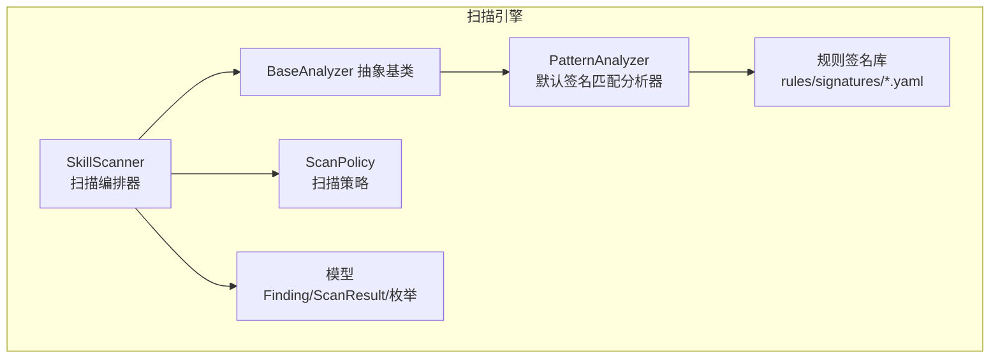
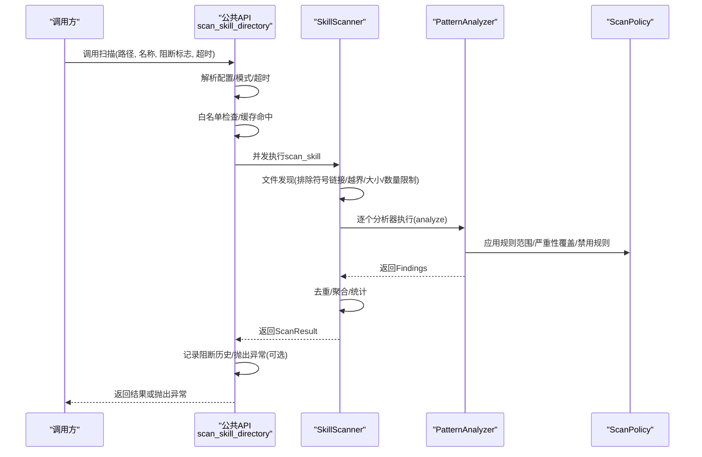
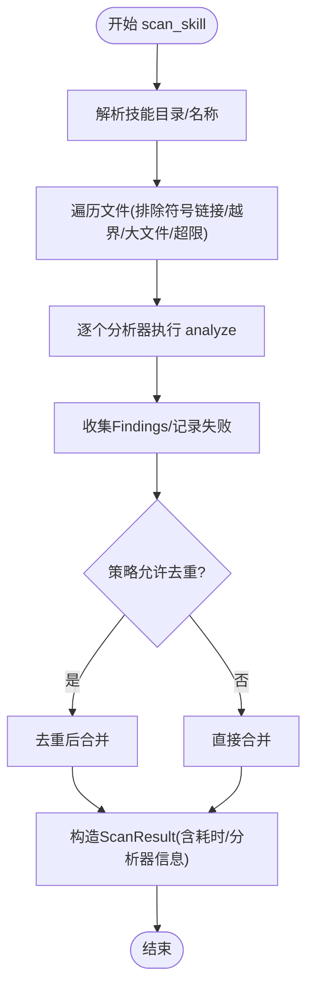
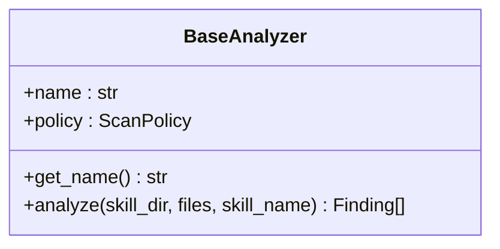
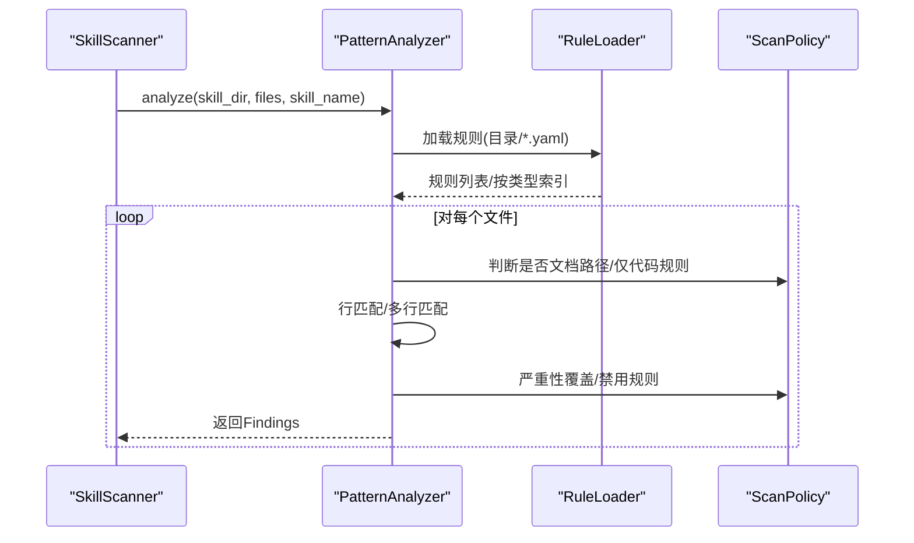
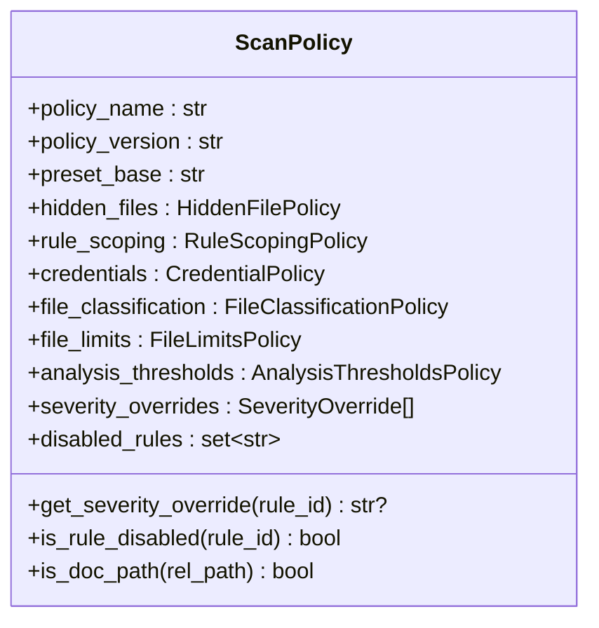
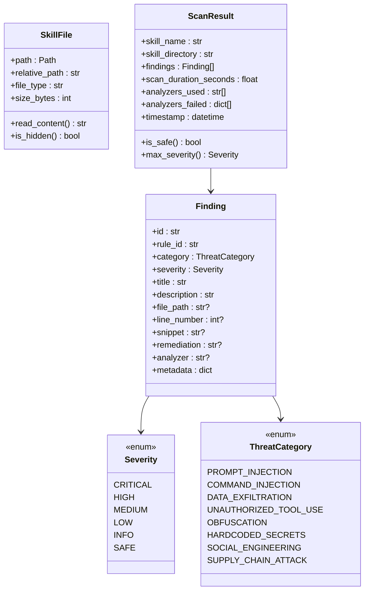
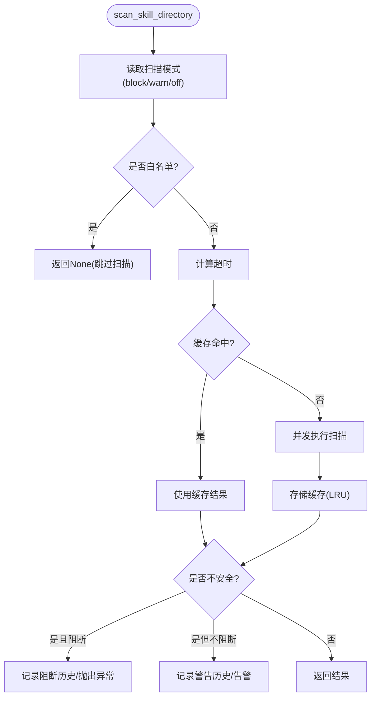
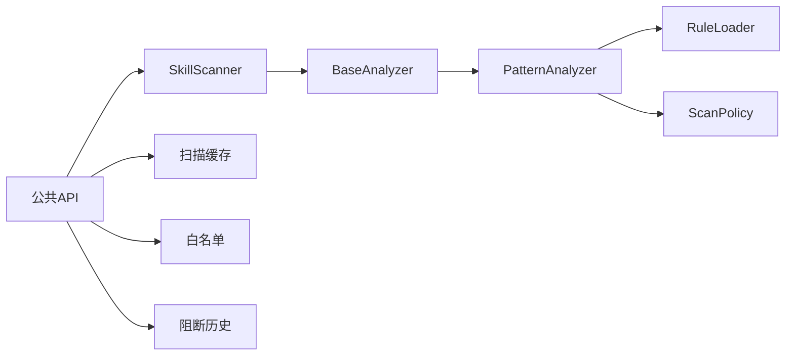

# 扫描引擎

<cite>
**本文引用的文件**
- [__init__.py](file://src/qwenpaw/security/skill_scanner/__init__.py)
- [scanner.py](file://src/qwenpaw/security/skill_scanner/scanner.py)
- [models.py](file://src/qwenpaw/security/skill_scanner/models.py)
- [scan_policy.py](file://src/qwenpaw/security/skill_scanner/scan_policy.py)
- [analyzers/__init__.py](file://src/qwenpaw/security/skill_scanner/analyzers/__init__.py)
- [pattern_analyzer.py](file://src/qwenpaw/security/skill_scanner/analyzers/pattern_analyzer.py)
- [default_policy.yaml](file://src/qwenpaw/security/skill_scanner/data/default_policy.yaml)
- [command_injection.yaml](file://src/qwenpaw/security/skill_scanner/rules/signatures/command_injection.yaml)
- [data_exfiltration.yaml](file://src/qwenpaw/security/skill_scanner/rules/signatures/data_exfiltration.yaml)
- [hardcoded_secrets.yaml](file://src/qwenpaw/security/skill_scanner/rules/signatures/hardcoded_secrets.yaml)
- [obfuscation.yaml](file://src/qwenpaw/security/skill_scanner/rules/signatures/obfuscation.yaml)
- [prompt_injection.yaml](file://src/qwenpaw/security/skill_scanner/rules/signatures/prompt_injection.yaml)
- [social_engineering.yaml](file://src/qwenpaw/security/skill_scanner/rules/signatures/social_engineering.yaml)
- [supply_chain.yaml](file://src/qwenpaw/security/skill_scanner/rules/signatures/supply_chain.yaml)
</cite>

## 目录
1. [简介](#简介)
2. [项目结构](#项目结构)
3. [核心组件](#核心组件)
4. [架构总览](#架构总览)
5. [详细组件分析](#详细组件分析)
6. [依赖分析](#依赖分析)
7. [性能考虑](#性能考虑)
8. [故障排查指南](#故障排查指南)
9. [结论](#结论)
10. [附录](#附录)

## 简介
本文件面向QwenPaw技能扫描引擎，系统性阐述其架构与工作原理，覆盖代码解析、语法分析与语义检查机制；文档化扫描流程的四个阶段：代码预处理、AST构建（此处以正则签名匹配替代）、威胁检测与结果聚合；详解扫描策略配置、并发扫描管理与性能优化；并给出扫描结果数据结构、威胁等级分类与风险评分算法说明，以及扩展接口、自定义分析器集成与策略定制方法，解释扫描缓存机制、增量扫描与批量处理能力。

## 项目结构
技能扫描模块位于src/qwenpaw/security/skill_scanner下，采用“策略驱动 + 可插拔分析器”的轻量设计：
- 扫描编排器：负责文件发现、并发执行分析器、聚合结果与日志记录
- 分析器基类：抽象接口，便于新增如LLM/行为分析等分析器
- 默认分析器：基于YAML规则的正则签名匹配
- 策略系统：组织规则范围、文件分类、阈值、严重性覆盖与禁用规则
- 规则库：按威胁类别分组的签名规则
- 结果模型：统一的Finding与ScanResult数据结构

图示来源
- [scanner.py:76-319](file://src/qwenpaw/security/skill_scanner/scanner.py#L76-L319)
- [analyzers/__init__.py:21-90](file://src/qwenpaw/security/skill_scanner/analyzers/__init__.py#L21-L90)
- [pattern_analyzer.py:236-393](file://src/qwenpaw/security/skill_scanner/analyzers/pattern_analyzer.py#L236-L393)
- [scan_policy.py:156-476](file://src/qwenpaw/security/skill_scanner/scan_policy.py#L156-L476)
- [models.py:19-235](file://src/qwenpaw/security/skill_scanner/models.py#L19-L235)

章节来源
- [scanner.py:1-319](file://src/qwenpaw/security/skill_scanner/scanner.py#L1-L319)
- [analyzers/__init__.py:1-90](file://src/qwenpaw/security/skill_scanner/analyzers/__init__.py#L1-L90)
- [pattern_analyzer.py:1-393](file://src/qwenpaw/security/skill_scanner/analyzers/pattern_analyzer.py#L1-L393)
- [scan_policy.py:1-476](file://src/qwenpaw/security/skill_scanner/scan_policy.py#L1-L476)
- [models.py:1-235](file://src/qwenpaw/security/skill_scanner/models.py#L1-L235)

## 核心组件
- 扫描编排器SkillScanner：负责文件发现、并发调用分析器、去重与结果聚合
- 分析器基类BaseAnalyzer：最小接口，支持运行时注册新分析器
- PatternAnalyzer：加载YAML规则，逐行/多行匹配，生成Finding
- ScanPolicy：组织规则范围、文件分类、阈值、严重性覆盖与禁用规则
- 模型层：Finding、ScanResult、Severity、ThreatCategory等
- 公共API：懒加载单例、缓存、白名单、阻断历史记录与扫描入口

章节来源
- [scanner.py:76-319](file://src/qwenpaw/security/skill_scanner/scanner.py#L76-L319)
- [analyzers/__init__.py:21-90](file://src/qwenpaw/security/skill_scanner/analyzers/__init__.py#L21-L90)
- [pattern_analyzer.py:236-393](file://src/qwenpaw/security/skill_scanner/analyzers/pattern_analyzer.py#L236-L393)
- [scan_policy.py:156-476](file://src/qwenpaw/security/skill_scanner/scan_policy.py#L156-L476)
- [models.py:19-235](file://src/qwenpaw/security/skill_scanner/models.py#L19-L235)
- [__init__.py:322-514](file://src/qwenpaw/security/skill_scanner/__init__.py#L322-L514)

## 架构总览
扫描引擎遵循“策略驱动 + 可插拔分析器”的架构，公共API提供扫描入口与缓存、白名单、阻断历史等功能；编排器负责文件发现与并发调度；分析器通过策略控制规则范围与严重性；最终聚合为ScanResult。

图示来源
- [__init__.py:424-514](file://src/qwenpaw/security/skill_scanner/__init__.py#L424-L514)
- [scanner.py:148-242](file://src/qwenpaw/security/skill_scanner/scanner.py#L148-L242)
- [pattern_analyzer.py:265-347](file://src/qwenpaw/security/skill_scanner/analyzers/pattern_analyzer.py#L265-L347)
- [scan_policy.py:183-193](file://src/qwenpaw/security/skill_scanner/scan_policy.py#L183-L193)

## 详细组件分析

### 组件A：扫描编排器 SkillScanner
职责与流程
- 初始化：加载策略、设置最大文件数/大小、跳过扩展集合
- 文件发现：递归遍历，排除符号链接、越界路径、大文件与超限文件
- 并发执行：逐个分析器调用analyze，收集Findings并记录失败项
- 去重与聚合：根据策略开关去重；构造ScanResult
- 性能：记录扫描耗时，便于监控与优化

关键点
- 安全边界：严格校验真实路径是否在技能目录内，避免路径穿越
- 限流：文件数量与单文件大小上限，防止资源滥用
- 弹性：支持运行时注册新分析器

图示来源
- [scanner.py:148-242](file://src/qwenpaw/security/skill_scanner/scanner.py#L148-L242)
- [scanner.py:248-299](file://src/qwenpaw/security/skill_scanner/scanner.py#L248-L299)

章节来源
- [scanner.py:76-319](file://src/qwenpaw/security/skill_scanner/scanner.py#L76-L319)

### 组件B：分析器基类 BaseAnalyzer
职责与接口
- 最小接口：analyze(skill_dir, files, skill_name) -> list[Finding]
- 策略注入：通过policy访问规则范围、严重性覆盖、禁用规则等
- 运行时注册：支持在编排器中动态添加分析器

图示来源
- [analyzers/__init__.py:21-90](file://src/qwenpaw/security/skill_scanner/analyzers/__init__.py#L21-L90)

章节来源
- [analyzers/__init__.py:1-90](file://src/qwenpaw/security/skill_scanner/analyzers/__init__.py#L1-L90)

### 组件C：默认分析器 PatternAnalyzer
职责与实现
- 规则加载：从rules/signatures目录加载YAML规则，建立按文件类型索引
- 匹配策略：先逐行匹配，再对含换行的规则进行多行匹配
- 策略应用：按策略过滤禁用规则、文档路径规则、仅代码规则；支持严重性覆盖
- 凭证过滤：自动抑制已知测试凭证与占位符
- 去重：按规则ID+文件路径+行号去重

图示来源
- [pattern_analyzer.py:236-393](file://src/qwenpaw/security/skill_scanner/analyzers/pattern_analyzer.py#L236-L393)
- [pattern_analyzer.py:163-229](file://src/qwenpaw/security/skill_scanner/analyzers/pattern_analyzer.py#L163-L229)

章节来源
- [pattern_analyzer.py:1-393](file://src/qwenpaw/security/skill_scanner/analyzers/pattern_analyzer.py#L1-L393)

### 组件D：扫描策略 ScanPolicy
职责与配置
- 隐藏文件策略：哪些点文件/点目录视为无害
- 规则范围：哪些规则仅在SKILL.md与脚本触发、在文档路径跳过、仅代码文件触发
- 凭证策略：已知测试值与占位符标记，自动抑制误报
- 文件分类：静止文件(inert)/结构化数据/归档/代码扩展名
- 文件限制：最大文件数、单文件大小、引用深度、名称/描述长度
- 分析阈值：最低置信度、正则最大长度
- 严重性覆盖：按规则ID覆盖严重性
- 禁用规则：按ID禁用规则

图示来源
- [scan_policy.py:156-476](file://src/qwenpaw/security/skill_scanner/scan_policy.py#L156-L476)

章节来源
- [scan_policy.py:1-476](file://src/qwenpaw/security/skill_scanner/scan_policy.py#L1-L476)
- [default_policy.yaml:1-243](file://src/qwenpaw/security/skill_scanner/data/default_policy.yaml#L1-L243)

### 组件E：模型与结果数据结构
- Severity：CRITICAL/HIGH/MEDIUM/LOW/INFO/SAFE
- ThreatCategory：涵盖提示词注入、命令注入、数据泄露、未授权工具使用、混淆、硬编码密钥、社交工程、供应链攻击等
- SkillFile：封装文件路径、相对路径、类型、大小与内容读取
- Finding：统一的威胁发现，包含规则ID、类别、严重性、标题、描述、文件路径、行号、片段、修复建议、分析器名与元数据
- ScanResult：聚合Findings、扫描耗时、分析器使用情况与失败项、时间戳与安全判定

图示来源
- [models.py:19-235](file://src/qwenpaw/security/skill_scanner/models.py#L19-L235)

章节来源
- [models.py:1-235](file://src/qwenpaw/security/skill_scanner/models.py#L1-L235)

### 组件F：公共API与缓存/白名单/阻断历史
- 懒加载单例：线程安全的SkillScanner单例
- 缓存：基于目录最新修改时间的LRU缓存，避免重复扫描
- 白名单：按技能名与内容哈希匹配，支持跳过扫描
- 阻断历史：记录被阻断/警告的技能，持久化到JSON文件
- 扫描入口：scan_skill_directory，支持阻断模式、超时与返回None

图示来源
- [__init__.py:424-514](file://src/qwenpaw/security/skill_scanner/__init__.py#L424-L514)
- [__init__.py:356-390](file://src/qwenpaw/security/skill_scanner/__init__.py#L356-L390)
- [__init__.py:142-169](file://src/qwenpaw/security/skill_scanner/__init__.py#L142-L169)

章节来源
- [__init__.py:1-514](file://src/qwenpaw/security/skill_scanner/__init__.py#L1-L514)

## 依赖分析
- SkillScanner依赖BaseAnalyzer接口与ScanPolicy策略
- PatternAnalyzer依赖RuleLoader与ScanPolicy
- 公共API依赖SkillScanner单例、缓存、白名单与阻断历史
- 规则签名库独立于核心逻辑，便于扩展

图示来源
- [scanner.py:76-319](file://src/qwenpaw/security/skill_scanner/scanner.py#L76-L319)
- [pattern_analyzer.py:236-393](file://src/qwenpaw/security/skill_scanner/analyzers/pattern_analyzer.py#L236-L393)
- [__init__.py:322-514](file://src/qwenpaw/security/skill_scanner/__init__.py#L322-L514)

章节来源
- [scanner.py:1-319](file://src/qwenpaw/security/skill_scanner/scanner.py#L1-L319)
- [pattern_analyzer.py:1-393](file://src/qwenpaw/security/skill_scanner/analyzers/pattern_analyzer.py#L1-L393)
- [__init__.py:1-514](file://src/qwenpaw/security/skill_scanner/__init__.py#L1-L514)

## 性能考虑
- 并发扫描：使用线程池执行单次扫描，避免阻塞调用方
- 缓存机制：基于目录mtime的LRU缓存，减少重复扫描成本
- 文件发现优化：提前排除符号链接、越界路径、大文件与超限文件
- 正则匹配优化：先逐行匹配，再对含换行的规则进行多行匹配，降低复杂度
- 去重策略：按规则+文件+行号去重，减少冗余结果
- 策略阈值：通过ScanPolicy控制文件数量与大小，避免资源滥用

章节来源
- [scanner.py:248-299](file://src/qwenpaw/security/skill_scanner/scanner.py#L248-L299)
- [pattern_analyzer.py:93-155](file://src/qwenpaw/security/skill_scanner/analyzers/pattern_analyzer.py#L93-L155)
- [__init__.py:356-390](file://src/qwenpaw/security/skill_scanner/__init__.py#L356-L390)

## 故障排查指南
常见问题与定位
- 扫描超时：检查超时配置与文件数量/大小；适当放宽阈值或拆分扫描
- 结果为空：确认规则目录是否存在、规则是否被策略禁用或文档路径跳过
- 缓存命中异常：检查目录mtime变化与缓存LRU容量
- 白名单误判：核对技能名与内容哈希是否匹配
- 阻断历史无法写入：检查工作目录权限与磁盘空间

定位手段
- 查看日志：编排器与分析器均输出详细日志
- 使用to_dict导出结果：便于人工复核与审计
- 逐步缩小范围：先禁用去重，再逐一启用策略项定位问题

章节来源
- [scanner.py:194-213](file://src/qwenpaw/security/skill_scanner/scanner.py#L194-L213)
- [pattern_analyzer.py:338-347](file://src/qwenpaw/security/skill_scanner/analyzers/pattern_analyzer.py#L338-L347)
- [__init__.py:240-312](file://src/qwenpaw/security/skill_scanner/__init__.py#L240-L312)

## 结论
QwenPaw技能扫描引擎以“策略驱动 + 可插拔分析器”为核心，通过公共API提供便捷的扫描入口与缓存、白名单、阻断历史等实用功能。默认的PatternAnalyzer基于YAML规则进行快速正则匹配，结合ScanPolicy实现灵活的规则范围与严重性控制。整体设计兼顾安全性、可扩展性与性能，适合在生产环境中作为技能包的安全前置防线。

## 附录

### 扫描流程阶段说明
- 代码预处理：文件发现与过滤（符号链接、越界、大文件、超限）
- AST构建：此处以正则签名匹配替代传统AST构建，提升性能与覆盖率
- 威胁检测：逐行/多行正则匹配，结合策略过滤与严重性覆盖
- 结果聚合：去重、统计、生成ScanResult并记录分析器使用情况

章节来源
- [scanner.py:181-242](file://src/qwenpaw/security/skill_scanner/scanner.py#L181-L242)
- [pattern_analyzer.py:265-347](file://src/qwenpaw/security/skill_scanner/analyzers/pattern_analyzer.py#L265-L347)

### 扫描策略配置
- 策略来源：内置默认策略与组织自定义策略合并
- 关键配置项：规则范围、文件分类、阈值、严重性覆盖、禁用规则
- 策略加载：from_yaml合并内置默认策略，to_yaml导出当前策略

章节来源
- [scan_policy.py:236-304](file://src/qwenpaw/security/skill_scanner/scan_policy.py#L236-L304)
- [default_policy.yaml:1-243](file://src/qwenpaw/security/skill_scanner/data/default_policy.yaml#L1-L243)

### 并发扫描管理
- 单次扫描并发：ThreadPoolExecutor(max_workers=1)用于串行执行，避免过度并发
- 批量处理：通过外部循环对多个技能目录分别调用scan_skill_directory
- 超时控制：统一超时参数，超时返回None

章节来源
- [__init__.py:480-496](file://src/qwenpaw/security/skill_scanner/__init__.py#L480-L496)
- [scanner.py:148-168](file://src/qwenpaw/security/skill_scanner/scanner.py#L148-L168)

### 性能优化技术
- 缓存：LRU缓存+mtime校验，避免重复扫描
- 限流：文件数量与大小上限
- 去重：按规则+文件+行号去重
- 正则优化：先逐行再多行匹配

章节来源
- [__init__.py:356-390](file://src/qwenpaw/security/skill_scanner/__init__.py#L356-L390)
- [scanner.py:288-294](file://src/qwenpaw/security/skill_scanner/scanner.py#L288-L294)
- [pattern_analyzer.py:106-155](file://src/qwenpaw/security/skill_scanner/analyzers/pattern_analyzer.py#L106-L155)

### 扫描结果数据结构
- Finding：统一威胁发现，包含规则ID、类别、严重性、标题、描述、文件路径、行号、片段、修复建议、分析器名与元数据
- ScanResult：聚合Findings、扫描耗时、分析器使用情况与失败项、时间戳与安全判定

章节来源
- [models.py:129-235](file://src/qwenpaw/security/skill_scanner/models.py#L129-L235)

### 威胁等级分类与风险评分
- 威胁等级：CRITICAL/HIGH/MEDIUM/LOW/INFO/SAFE
- 风险评分：max_severity取最高严重性，is_safe判断是否包含CRITICAL/HIGH

章节来源
- [models.py:19-28](file://src/qwenpaw/security/skill_scanner/models.py#L19-L28)
- [models.py:186-210](file://src/qwenpaw/security/skill_scanner/models.py#L186-L210)

### 扩展接口与自定义分析器集成
- 自定义分析器：继承BaseAnalyzer并实现analyze方法
- 注册方式：在SkillScanner初始化时传入或运行时register_analyzer
- 策略接入：通过policy访问规则范围、严重性覆盖、禁用规则等

章节来源
- [analyzers/__init__.py:21-90](file://src/qwenpaw/security/skill_scanner/analyzers/__init__.py#L21-L90)
- [scanner.py:144-147](file://src/qwenpaw/security/skill_scanner/scanner.py#L144-L147)

### 扫描缓存机制、增量扫描与批量处理
- 缓存机制：基于目录mtime的LRU缓存，避免重复扫描
- 增量扫描：通过缓存与白名单实现，仅在目录变更时重新扫描
- 批量处理：外部循环对多个技能目录调用scan_skill_directory

章节来源
- [__init__.py:356-390](file://src/qwenpaw/security/skill_scanner/__init__.py#L356-L390)
- [__init__.py:424-514](file://src/qwenpaw/security/skill_scanner/__init__.py#L424-L514)

### 规则示例与威胁类别
- 命令注入：eval/exec/compile、shell命令执行、路径遍历、SQL注入、SVG/JS嵌入脚本等
- 数据泄露：网络请求、敏感文件读取、Base64编码+网络组合
- 硬编码密钥：AWS/Stripe/Google/GitHub密钥、私钥块、密码变量、连接串
- 混淆与恶意：Base64解码+执行链、十六进制大块、XOR编码、二进制文件
- 提示词注入：覆盖系统指令、解除限制、绕过策略、泄露系统提示、隐藏动作
- 社交工程：模糊描述、品牌冒用
- 供应链：隐藏代码文件

章节来源
- [command_injection.yaml:1-195](file://src/qwenpaw/security/skill_scanner/rules/signatures/command_injection.yaml#L1-L195)
- [data_exfiltration.yaml:1-142](file://src/qwenpaw/security/skill_scanner/rules/signatures/data_exfiltration.yaml#L1-L142)
- [hardcoded_secrets.yaml:1-150](file://src/qwenpaw/security/skill_scanner/rules/signatures/hardcoded_secrets.yaml#L1-L150)
- [obfuscation.yaml:1-47](file://src/qwenpaw/security/skill_scanner/rules/signatures/obfuscation.yaml#L1-L47)
- [prompt_injection.yaml:1-80](file://src/qwenpaw/security/skill_scanner/rules/signatures/prompt_injection.yaml#L1-L80)
- [social_engineering.yaml:1-28](file://src/qwenpaw/security/skill_scanner/rules/signatures/social_engineering.yaml#L1-L28)
- [supply_chain.yaml:1-12](file://src/qwenpaw/security/skill_scanner/rules/signatures/supply_chain.yaml#L1-L12)