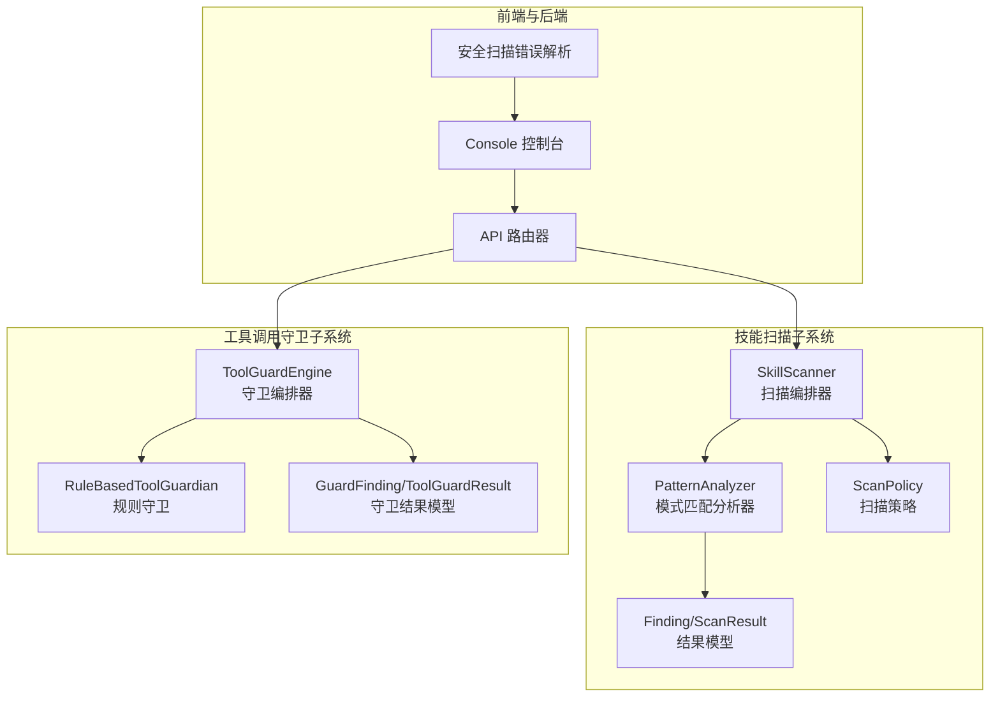
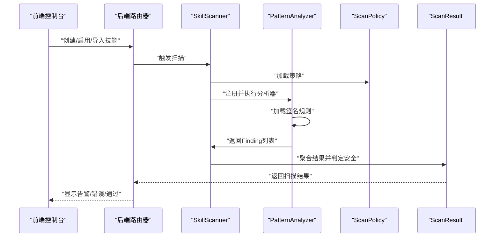
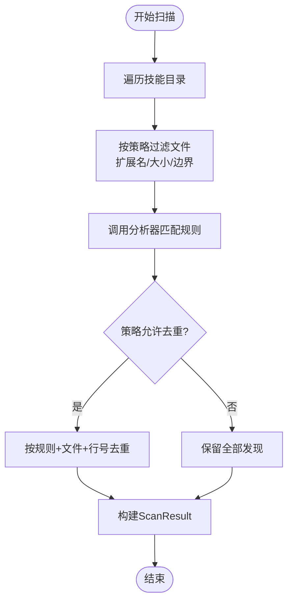
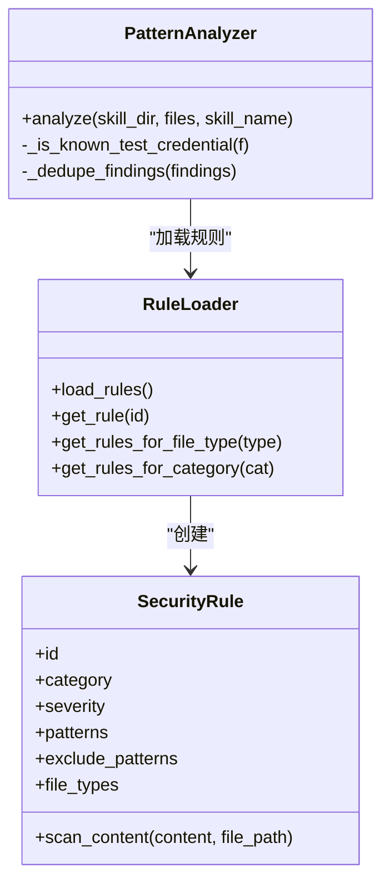
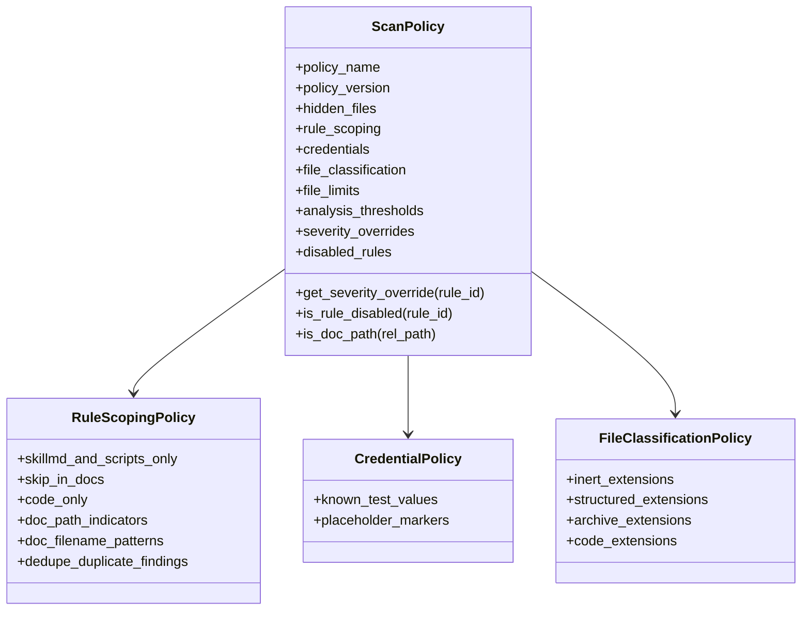
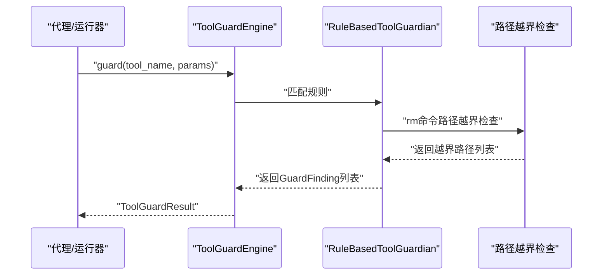
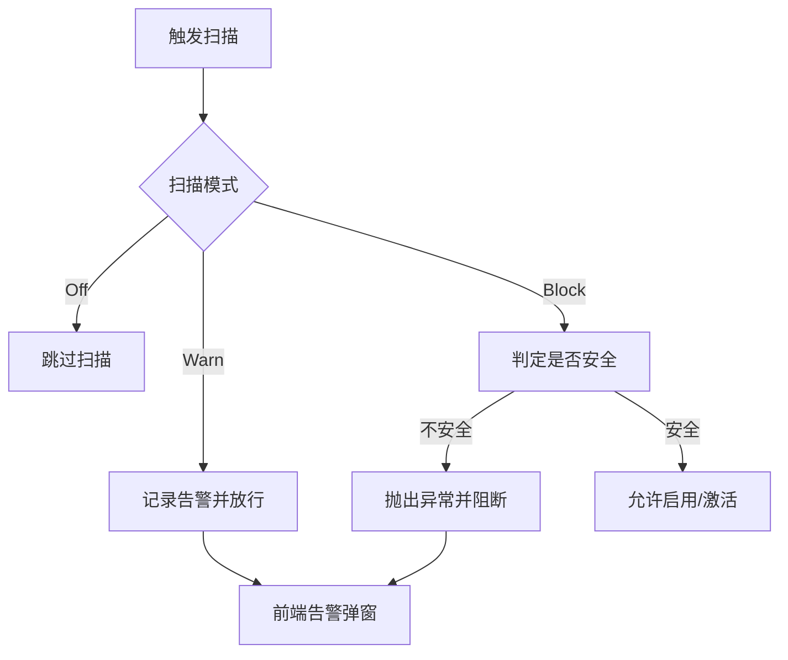
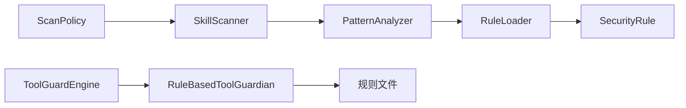

# 技能安全扫描

<cite>
**本文档引用的文件**
- [scanner.py](file://src/qwenpaw/security/skill_scanner/scanner.py)
- [scan_policy.py](file://src/qwenpaw/security/skill_scanner/scan_policy.py)
- [models.py](file://src/qwenpaw/security/skill_scanner/models.py)
- [pattern_analyzer.py](file://src/qwenpaw/security/skill_scanner/analyzers/pattern_analyzer.py)
- [default_policy.yaml](file://src/qwenpaw/security/skill_scanner/data/default_policy.yaml)
- [command_injection.yaml](file://src/qwenpaw/security/skill_scanner/rules/signatures/command_injection.yaml)
- [data_exfiltration.yaml](file://src/qwenpaw/security/skill_scanner/rules/signatures/data_exfiltration.yaml)
- [hardcoded_secrets.yaml](file://src/qwenpaw/security/skill_scanner/rules/signatures/hardcoded_secrets.yaml)
- [engine.py](file://src/qwenpaw/security/tool_guard/engine.py)
- [rule_guardian.py](file://src/qwenpaw/security/tool_guard/guardians/rule_guardian.py)
- [dangerous_shell_commands.yaml](file://src/qwenpaw/security/tool_guard/rules/dangerous_shell_commands.yaml)
- [models.py](file://src/qwenpaw/security/tool_guard/models.py)
- [__init__.py](file://src/qwenpaw/security/skill_scanner/__init__.py)
- [config.py](file://src/qwenpaw/app/routers/config.py)
- [scanError.ts](file://console/src/utils/scanError.ts)
- [SkillScannerSection.tsx](file://console/src/pages/Settings/Security/components/SkillScannerSection.tsx)
- [security.en.md](file://website/public/docs/security.en.md)
- [SECURITY.md](file://SECURITY.md)
</cite>

## 目录
1. [简介](#简介)
2. [项目结构](#项目结构)
3. [核心组件](#核心组件)
4. [架构总览](#架构总览)
5. [详细组件分析](#详细组件分析)
6. [依赖分析](#依赖分析)
7. [性能考虑](#性能考虑)
8. [故障排查指南](#故障排查指南)
9. [结论](#结论)
10. [附录](#附录)

## 简介
本文件面向QwenPaw技能安全扫描系统，提供从底层实现到上层应用的完整技术文档。重点覆盖技能代码安全分析的实现原理、扫描策略与规则匹配算法、风险评估机制；深入说明命令注入、数据泄露、硬编码密钥等威胁的检测方法；阐述默认安全策略配置、自定义规则添加与扫描策略定制；给出技能上传审批流程、自动扫描结果与人工审核机制；解释威胁等级分类、风险评分计算与安全报告生成；最后总结安全扫描最佳实践、误报处理与持续改进策略。

## 项目结构
技能安全扫描系统由“技能扫描器”和“工具调用守卫”两大子系统构成，分别负责静态规则扫描与运行时参数守卫。前端控制台提供策略配置、扫描结果查看与白名单管理界面；后端路由提供扫描触发、缓存与告警记录接口；网站文档与安全策略文件提供使用说明与误报处理指引。

图表来源
- [scanner.py:76-319](file://src/qwenpaw/security/skill_scanner/scanner.py#L76-L319)
- [pattern_analyzer.py:236-393](file://src/qwenpaw/security/skill_scanner/analyzers/pattern_analyzer.py#L236-L393)
- [scan_policy.py:156-476](file://src/qwenpaw/security/skill_scanner/scan_policy.py#L156-L476)
- [models.py:16-235](file://src/qwenpaw/security/skill_scanner/models.py#L16-L235)
- [engine.py:53-238](file://src/qwenpaw/security/tool_guard/engine.py#L53-L238)
- [rule_guardian.py:559-758](file://src/qwenpaw/security/tool_guard/guardians/rule_guardian.py#L559-L758)
- [models.py:103-185](file://src/qwenpaw/security/tool_guard/models.py#L103-L185)

章节来源
- [scanner.py:1-319](file://src/qwenpaw/security/skill_scanner/scanner.py#L1-L319)
- [engine.py:1-238](file://src/qwenpaw/security/tool_guard/engine.py#L1-L238)

## 核心组件
- 扫描编排器（SkillScanner）：遍历技能目录、加载策略、注册分析器、执行扫描、聚合结果并输出安全判定。
- 模式匹配分析器（PatternAnalyzer）：基于YAML签名规则进行正则匹配，支持多文件类型、排除模式与去重。
- 扫描策略（ScanPolicy）：组织隐藏文件、规则作用域、凭证过滤、文件分类、阈值与严重性覆盖等策略项。
- 结果模型（Finding/ScanResult）：统一的威胁发现与扫描结果表示，支持按严重性与类别统计。
- 工具调用守卫引擎（ToolGuardEngine）：在工具调用前对参数进行规则匹配，识别高危命令与路径越界。
- 规则守卫（RuleBasedToolGuardian）：加载危险命令规则，增强rm等命令的路径越界检查与用户提示。
- 前端控制台与API：提供扫描模式配置、白名单管理、扫描告警查看与错误弹窗展示。

章节来源
- [scanner.py:76-319](file://src/qwenpaw/security/skill_scanner/scanner.py#L76-L319)
- [pattern_analyzer.py:236-393](file://src/qwenpaw/security/skill_scanner/analyzers/pattern_analyzer.py#L236-L393)
- [scan_policy.py:156-476](file://src/qwenpaw/security/skill_scanner/scan_policy.py#L156-L476)
- [models.py:168-235](file://src/qwenpaw/security/skill_scanner/models.py#L168-L235)
- [engine.py:53-238](file://src/qwenpaw/security/tool_guard/engine.py#L53-L238)
- [rule_guardian.py:559-758](file://src/qwenpaw/security/tool_guard/guardians/rule_guardian.py#L559-L758)
- [models.py:103-185](file://src/qwenpaw/security/tool_guard/models.py#L103-L185)

## 架构总览
技能扫描与工具守卫采用“策略驱动 + 规则签名”的双轨机制：
- 静态扫描：以SkillScanner为核心，按策略筛选文件与规则，PatternAnalyzer逐条匹配签名，输出Finding集合。
- 运行时守卫：以ToolGuardEngine为核心，按规则匹配工具参数，识别潜在破坏性命令与越界路径，输出GuardFinding集合。
- 前端与后端：通过API路由触发扫描、读取策略与白名单、展示告警与错误信息。

图表来源
- [scanner.py:148-242](file://src/qwenpaw/security/skill_scanner/scanner.py#L148-L242)
- [pattern_analyzer.py:265-347](file://src/qwenpaw/security/skill_scanner/analyzers/pattern_analyzer.py#L265-L347)
- [scan_policy.py:261-304](file://src/qwenpaw/security/skill_scanner/scan_policy.py#L261-L304)
- [models.py:168-235](file://src/qwenpaw/security/skill_scanner/models.py#L168-L235)

## 详细组件分析

### 组件A：技能扫描编排器（SkillScanner）
- 文件发现：递归遍历技能目录，跳过符号链接与越界路径，按策略扩展名与大小限制筛选文件。
- 分析器执行：依次调用已注册分析器，收集异常并记录失败分析器列表。
- 去重与聚合：根据策略配置对重复Finding进行去重，构造ScanResult并标注最高严重性与是否安全。

图表来源
- [scanner.py:248-299](file://src/qwenpaw/security/skill_scanner/scanner.py#L248-L299)
- [scanner.py:194-242](file://src/qwenpaw/security/skill_scanner/scanner.py#L194-L242)

章节来源
- [scanner.py:76-319](file://src/qwenpaw/security/skill_scanner/scanner.py#L76-L319)

### 组件B：模式匹配分析器（PatternAnalyzer）
- 规则加载：从默认或自定义目录加载YAML规则，按类别与文件类型索引。
- 内容扫描：逐行匹配正则，同时对含换行的模式进行全文匹配，支持排除模式。
- 策略集成：遵循ScanPolicy的规则禁用、严重性覆盖、文档路径跳过与凭证过滤。
- 凭证抑制：对硬编码密钥类Finding，依据策略中的测试值与占位符标记进行自动抑制。

图表来源
- [pattern_analyzer.py:38-156](file://src/qwenpaw/security/skill_scanner/analyzers/pattern_analyzer.py#L38-L156)
- [pattern_analyzer.py:163-229](file://src/qwenpaw/security/skill_scanner/analyzers/pattern_analyzer.py#L163-L229)
- [pattern_analyzer.py:236-393](file://src/qwenpaw/security/skill_scanner/analyzers/pattern_analyzer.py#L236-L393)

章节来源
- [pattern_analyzer.py:1-393](file://src/qwenpaw/security/skill_scanner/analyzers/pattern_analyzer.py#L1-L393)

### 组件C：扫描策略（ScanPolicy）
- 隐藏文件策略：定义可视为良性的点文件/点目录集合。
- 规则作用域：限定某些规则仅在特定文件类型或文档路径生效，支持去重开关。
- 凭证策略：内置常见测试值与占位符标记，用于自动抑制误报。
- 文件分类：将扩展名映射到惰性文件、结构化文件、归档文件与代码文件。
- 阈值与限制：最大文件数、单文件大小、引用深度、名称与描述长度等。
- 严重性覆盖：针对具体规则提供严重性覆盖，禁用规则集。

图表来源
- [scan_policy.py:74-178](file://src/qwenpaw/security/skill_scanner/scan_policy.py#L74-L178)
- [scan_policy.py:156-476](file://src/qwenpaw/security/skill_scanner/scan_policy.py#L156-L476)

章节来源
- [scan_policy.py:1-476](file://src/qwenpaw/security/skill_scanner/scan_policy.py#L1-L476)
- [default_policy.yaml:1-243](file://src/qwenpaw/security/skill_scanner/data/default_policy.yaml#L1-L243)

### 组件D：威胁检测规则示例
- 命令注入：覆盖Python/JS/Shell等多语言场景，识别危险函数调用、格式化字符串拼接、路径遍历、SQL注入、SVG/JS恶意脚本等。
- 数据泄露：识别网络请求、敏感文件读取、Base64编码+网络组合等高风险模式。
- 硬编码密钥：识别AWS/GitHub/Stripe/Google API密钥、私钥块、连接串、密码变量等。

章节来源
- [command_injection.yaml:1-195](file://src/qwenpaw/security/skill_scanner/rules/signatures/command_injection.yaml#L1-L195)
- [data_exfiltration.yaml:1-142](file://src/qwenpaw/security/skill_scanner/rules/signatures/data_exfiltration.yaml#L1-L142)
- [hardcoded_secrets.yaml:1-150](file://src/qwenpaw/security/skill_scanner/rules/signatures/hardcoded_secrets.yaml#L1-L150)

### 组件E：工具调用守卫引擎（ToolGuardEngine）
- 守卫器注册：默认加载路径守卫与规则守卫，支持动态注册/注销。
- 规则加载：从默认规则目录与配置中加载规则，支持重载。
- 参数守卫：对工具参数字符串进行规则匹配，识别破坏性命令、特权提升、系统重启、进程终止、网络隧道等高危行为。
- 路径越界检测：对rm等命令提取目标路径，判断是否位于工作区外，并提供结构化提示。

图表来源
- [engine.py:169-226](file://src/qwenpaw/security/tool_guard/engine.py#L169-L226)
- [rule_guardian.py:608-757](file://src/qwenpaw/security/tool_guard/guardians/rule_guardian.py#L608-L757)

章节来源
- [engine.py:1-238](file://src/qwenpaw/security/tool_guard/engine.py#L1-L238)
- [rule_guardian.py:1-758](file://src/qwenpaw/security/tool_guard/guardians/rule_guardian.py#L1-L758)
- [dangerous_shell_commands.yaml:1-187](file://src/qwenpaw/security/tool_guard/rules/dangerous_shell_commands.yaml#L1-L187)

### 组件F：扫描触发与审批流程
- 触发时机：创建新技能、启用已禁用技能、从技能库导入时自动触发扫描。
- 扫描模式：Block（阻断）、Warn（告警放行）、Off（关闭），优先级为环境变量 > 控制台设置 > 配置文件。
- 缓存与超时：基于文件修改时间缓存扫描结果，支持超时保护。
- 白名单：可将已验证安全的技能加入白名单，跳过后续扫描。
- 告警与错误：扫描结果写入告警历史；Block模式抛出异常；Warn模式弹出告警对话框。

图表来源
- [__init__.py:433-513](file://src/qwenpaw/security/skill_scanner/__init__.py#L433-L513)
- [config.py:613-643](file://src/qwenpaw/app/routers/config.py#L613-L643)
- [scanError.ts:87-126](file://console/src/utils/scanError.ts#L87-L126)
- [security.en.md:288-315](file://website/public/docs/security.en.md#L288-L315)

章节来源
- [__init__.py:433-513](file://src/qwenpaw/security/skill_scanner/__init__.py#L433-L513)
- [config.py:613-643](file://src/qwenpaw/app/routers/config.py#L613-L643)
- [scanError.ts:1-172](file://console/src/utils/scanError.ts#L1-L172)
- [SkillScannerSection.tsx:84-98](file://console/src/pages/Settings/Security/components/SkillScannerSection.tsx#L84-L98)
- [security.en.md:288-315](file://website/public/docs/security.en.md#L288-L315)

## 依赖分析
- 组件耦合
  - SkillScanner依赖ScanPolicy与分析器接口，PatternAnalyzer依赖规则加载器与策略。
  - ToolGuardEngine依赖规则守卫与配置，RuleBasedToolGuardian依赖规则文件与路径解析。
- 外部依赖
  - YAML解析、正则表达式、线程池并发执行、前端UI组件与国际化。
- 循环依赖
  - 未见循环导入；各模块职责清晰，通过策略与结果模型解耦。

图表来源
- [scanner.py:100-134](file://src/qwenpaw/security/skill_scanner/scanner.py#L100-L134)
- [pattern_analyzer.py:163-229](file://src/qwenpaw/security/skill_scanner/analyzers/pattern_analyzer.py#L163-L229)
- [engine.py:65-102](file://src/qwenpaw/security/tool_guard/engine.py#L65-L102)
- [rule_guardian.py:432-510](file://src/qwenpaw/security/tool_guard/guardians/rule_guardian.py#L432-L510)

章节来源
- [scanner.py:1-319](file://src/qwenpaw/security/skill_scanner/scanner.py#L1-L319)
- [pattern_analyzer.py:1-393](file://src/qwenpaw/security/skill_scanner/analyzers/pattern_analyzer.py#L1-L393)
- [engine.py:1-238](file://src/qwenpaw/security/tool_guard/engine.py#L1-L238)
- [rule_guardian.py:1-758](file://src/qwenpaw/security/tool_guard/guardians/rule_guardian.py#L1-L758)

## 性能考虑
- 并发与超时：扫描在独立线程池中执行，支持超时取消，避免阻塞主线程。
- 文件限制：通过策略控制最大文件数与单文件大小，防止大体积技能导致内存与CPU压力。
- 规则编译：预编译正则表达式，避免重复编译开销；长规则与无效规则会被跳过或警告。
- 缓存：基于文件修改时间的缓存减少重复扫描成本。
- 去重：策略开启时对重复发现进行去重，降低结果体量。

## 故障排查指南
- 扫描未执行
  - 检查扫描模式是否为Off；确认环境变量与配置优先级。
  - 查看白名单是否命中；确认缓存是否有效。
- 扫描超时
  - 调整超时阈值；检查技能包是否包含超大文件或大量二进制文件。
- 告警过多/误报
  - 使用策略中的“规则禁用”“严重性覆盖”“凭证抑制”“文档路径跳过”等能力进行微调。
  - 对硬编码密钥类误报，可在策略中添加测试值或占位符标记。
- 前端告警弹窗
  - 使用错误解析工具尝试解析后端返回的JSON错误，查看详细告警列表。
  - 在控制台“安全扫描”页面查看告警历史与白名单管理。

章节来源
- [__init__.py:474-513](file://src/qwenpaw/security/skill_scanner/__init__.py#L474-L513)
- [scanError.ts:1-172](file://console/src/utils/scanError.ts#L1-L172)
- [SECURITY.md:37-51](file://SECURITY.md#L37-L51)

## 结论
QwenPaw技能安全扫描系统通过“策略驱动 + 规则签名”的方式，实现了对命令注入、数据泄露、硬编码密钥等关键威胁的自动化检测。结合工具调用守卫与白名单、告警与错误处理机制，形成从静态扫描到运行时守卫的全链路安全防护。通过可定制的扫描策略与规则，组织可以灵活适配自身安全基线，持续优化误报与漏报，保障技能生态的安全与稳定。

## 附录

### 威胁等级与风险评估
- 等级分类：CRITICAL/HIGH/MEDIUM/LOW/INFO/SAFE，按严重性排序。
- 最高严重性：取扫描结果中最高级别作为整体风险等级。
- 是否安全：当不存在CRITICAL/HIGH时判定为SAFE。

章节来源
- [models.py:19-28](file://src/qwenpaw/security/skill_scanner/models.py#L19-L28)
- [models.py:186-210](file://src/qwenpaw/security/skill_scanner/models.py#L186-L210)

### 默认安全策略配置要点
- 隐藏文件：.env.example/.env.sample/.env.template等被视为良性。
- 规则作用域：部分规则仅在SKILL.md与脚本文件中生效，文档路径中的规则可被跳过。
- 凭证抑制：内置常见测试值与占位符，自动抑制硬编码密钥误报。
- 文件分类：图片、字体、压缩包等默认跳过，仅对代码文件进行严格分析。
- 阈值：最大文件数、单文件大小、引用深度、名称/描述长度等限制。

章节来源
- [default_policy.yaml:1-243](file://src/qwenpaw/security/skill_scanner/data/default_policy.yaml#L1-L243)

### 自定义规则与策略定制
- 自定义签名规则：在规则目录新增YAML文件，定义规则ID、类别、严重性、匹配模式与排除模式。
- 扫描策略：通过ScanPolicy.from_yaml加载组织策略，覆盖默认策略；支持严重性覆盖、规则禁用、文档路径跳过等。
- 工具守卫规则：在规则目录新增危险命令规则，或通过配置注入自定义规则。

章节来源
- [pattern_analyzer.py:163-229](file://src/qwenpaw/security/skill_scanner/analyzers/pattern_analyzer.py#L163-L229)
- [scan_policy.py:261-304](file://src/qwenpaw/security/skill_scanner/scan_policy.py#L261-L304)
- [rule_guardian.py:518-552](file://src/qwenpaw/security/tool_guard/guardians/rule_guardian.py#L518-L552)

### 报告生成与可视化
- 扫描结果：包含技能名称、目录、发现数量、最高严重性、耗时、分析器使用情况与时间戳。
- 前端展示：控制台提供扫描告警查看、白名单管理与错误弹窗，支持分页与按严重性/类别筛选。

章节来源
- [models.py:168-235](file://src/qwenpaw/security/skill_scanner/models.py#L168-L235)
- [SkillScannerSection.tsx:41-98](file://console/src/pages/Settings/Security/components/SkillScannerSection.tsx#L41-L98)