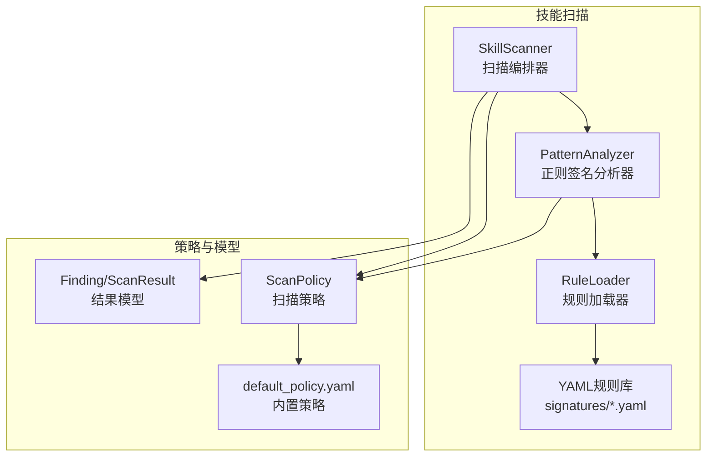
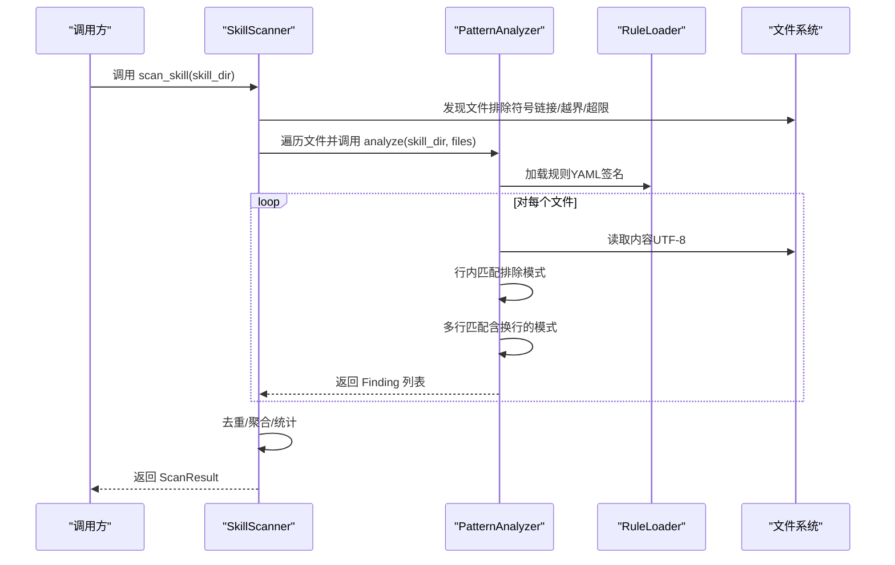
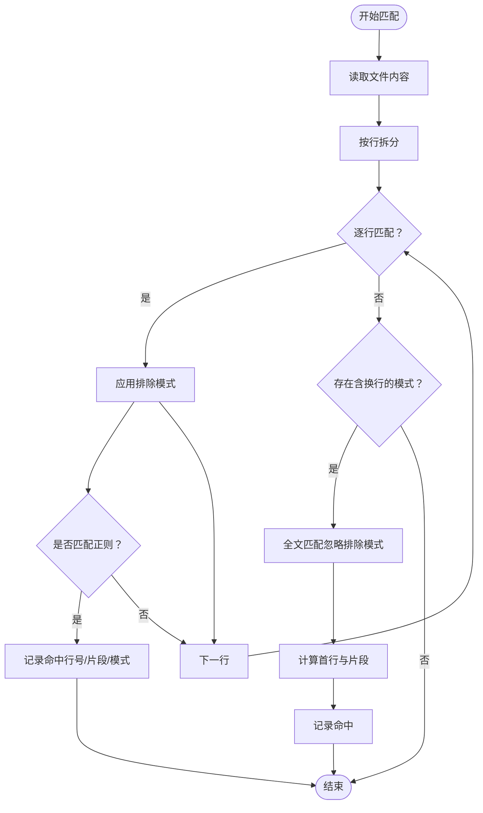
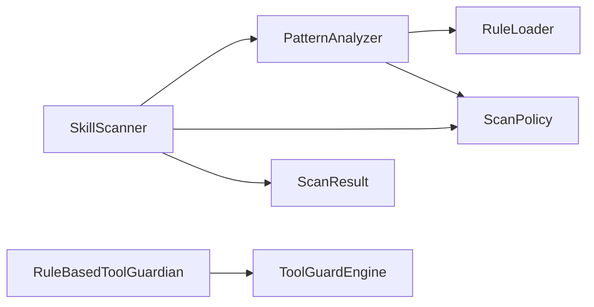

# 模式分析器

<cite>
**本文引用的文件**
- [pattern_analyzer.py](file://src/qwenpaw/security/skill_scanner/analyzers/pattern_analyzer.py)
- [scanner.py](file://src/qwenpaw/security/skill_scanner/scanner.py)
- [models.py](file://src/qwenpaw/security/skill_scanner/models.py)
- [scan_policy.py](file://src/qwenpaw/security/skill_scanner/scan_policy.py)
- [default_policy.yaml](file://src/qwenpaw/security/skill_scanner/data/default_policy.yaml)
- [command_injection.yaml](file://src/qwenpaw/security/skill_scanner/rules/signatures/command_injection.yaml)
- [hardcoded_secrets.yaml](file://src/qwenpaw/security/skill_scanner/rules/signatures/hardcoded_secrets.yaml)
- [data_exfiltration.yaml](file://src/qwenpaw/security/skill_scanner/rules/signatures/data_exfiltration.yaml)
- [obfuscation.yaml](file://src/qwenpaw/security/skill_scanner/rules/signatures/obfuscation.yaml)
- [engine.py](file://src/qwenpaw/security/tool_guard/engine.py)
- [rule_guardian.py](file://src/qwenpaw/security/tool_guard/guardians/rule_guardian.py)
</cite>

## 目录
1. [简介](#简介)
2. [项目结构](#项目结构)
3. [核心组件](#核心组件)
4. [架构总览](#架构总览)
5. [详细组件分析](#详细组件分析)
6. [依赖关系分析](#依赖关系分析)
7. [性能考量](#性能考量)
8. [故障排查指南](#故障排查指南)
9. [结论](#结论)
10. [附录](#附录)

## 简介
本文件面向QwenPaw“模式分析器”的技术文档，聚焦于基于正则表达式的威胁检测与静态代码分析能力。文档涵盖以下主题：
- 威胁类型与检测模式：命令注入、SQL注入、XSS/脚本嵌入、路径遍历、硬编码凭据、数据泄露、混淆与恶意二进制等
- 规则匹配算法与模糊匹配技术：行内匹配、多行匹配、排除模式、字符类处理、长度阈值
- 上下文感知分析：文档路径识别、文件类型路由、规则作用域控制
- 规则编写规范、优先级管理与误报过滤机制
- 自定义规则开发指南、规则测试方法与规则库维护策略
- 规则引擎性能优化、内存管理与大规模规则集处理能力

## 项目结构
模式分析器位于安全子系统中，采用“扫描器编排 + 分析器插件 + 策略与规则库”的分层设计：
- 扫描器编排器负责文件发现、并发执行分析器、聚合结果
- 分析器插件实现具体检测逻辑（当前默认为基于YAML签名的正则匹配）
- 策略模块提供组织级规则禁用、严重性覆盖、文件分类、阈值等配置
- 规则库以YAML形式提供多种威胁类型的检测签名

图表来源
- [scanner.py:76-319](file://src/qwenpaw/security/skill_scanner/scanner.py#L76-L319)
- [pattern_analyzer.py:236-393](file://src/qwenpaw/security/skill_scanner/analyzers/pattern_analyzer.py#L236-L393)
- [scan_policy.py:156-476](file://src/qwenpaw/security/skill_scanner/scan_policy.py#L156-L476)
- [models.py:168-235](file://src/qwenpaw/security/skill_scanner/models.py#L168-L235)
- [default_policy.yaml:1-243](file://src/qwenpaw/security/skill_scanner/data/default_policy.yaml#L1-L243)

章节来源
- [scanner.py:76-319](file://src/qwenpaw/security/skill_scanner/scanner.py#L76-L319)
- [pattern_analyzer.py:236-393](file://src/qwenpaw/security/skill_scanner/analyzers/pattern_analyzer.py#L236-L393)
- [scan_policy.py:156-476](file://src/qwenpaw/security/skill_scanner/scan_policy.py#L156-L476)
- [models.py:168-235](file://src/qwenpaw/security/skill_scanner/models.py#L168-L235)
- [default_policy.yaml:1-243](file://src/qwenpaw/security/skill_scanner/data/default_policy.yaml#L1-L243)

## 核心组件
- 扫描器编排器（SkillScanner）：负责文件发现、并发运行分析器、收集与去重结果、输出扫描报告
- 正则签名分析器（PatternAnalyzer）：加载YAML规则，对文件内容进行行内与多行正则匹配，生成检测结果
- 规则加载器（RuleLoader）：从目录或单文件加载规则，按类别与文件类型索引
- 扫描策略（ScanPolicy）：组织级策略，支持规则禁用、严重性覆盖、文档路径跳过、文件分类、阈值等
- 结果模型（Finding/ScanResult）：统一的检测结果与聚合信息结构

章节来源
- [scanner.py:76-319](file://src/qwenpaw/security/skill_scanner/scanner.py#L76-L319)
- [pattern_analyzer.py:236-393](file://src/qwenpaw/security/skill_scanner/analyzers/pattern_analyzer.py#L236-L393)
- [scan_policy.py:156-476](file://src/qwenpaw/security/skill_scanner/scan_policy.py#L156-L476)
- [models.py:168-235](file://src/qwenpaw/security/skill_scanner/models.py#L168-L235)

## 架构总览
整体流程：扫描器遍历技能包中的文件，按策略过滤后交由分析器执行规则匹配，最终汇总为扫描结果。

图表来源
- [scanner.py:148-242](file://src/qwenpaw/security/skill_scanner/scanner.py#L148-L242)
- [pattern_analyzer.py:265-347](file://src/qwenpaw/security/skill_scanner/analyzers/pattern_analyzer.py#L265-L347)

## 详细组件分析

### 正则签名分析器（PatternAnalyzer）
- 规则加载与索引：RuleLoader从目录或文件加载规则，构建按类别与文件类型索引的数据结构
- 匹配策略：
  - 行内匹配：逐行扫描，先应用排除模式再匹配正则
  - 多行匹配：对包含换行的模式进行全文匹配，并计算首行位置与片段
- 过滤与去重：根据策略过滤文档路径规则、代码专用规则；可按策略去重重复命中
- 凭据过滤：内置对常见测试凭据与占位符的自动抑制

图表来源
- [pattern_analyzer.py:93-155](file://src/qwenpaw/security/skill_scanner/analyzers/pattern_analyzer.py#L93-L155)

章节来源
- [pattern_analyzer.py:38-393](file://src/qwenpaw/security/skill_scanner/analyzers/pattern_analyzer.py#L38-L393)

### 扫描器编排器（SkillScanner）
- 文件发现：递归遍历技能包，排除符号链接、越界路径、超大文件与指定扩展名
- 并发执行：依次运行已注册分析器，捕获异常并记录失败项
- 结果聚合：按策略去重、统计最高严重级别、输出扫描时长与元信息

章节来源
- [scanner.py:148-242](file://src/qwenpaw/security/skill_scanner/scanner.py#L148-L242)

### 扫描策略（ScanPolicy）
- 规则作用域：支持文档路径跳过、仅代码文件生效、文档名模式识别
- 凭据抑制：内置测试值与占位符列表，自动过滤常见误报
- 文件分类：将扩展名映射为“惰性文件/结构化文件/归档/代码”等类别
- 阈值与限制：最大文件数、最大文件大小、正则长度上限、置信度阈值等
- 严重性覆盖与禁用规则：支持按规则ID覆盖严重性与全局禁用

章节来源
- [scan_policy.py:156-476](file://src/qwenpaw/security/skill_scanner/scan_policy.py#L156-L476)
- [default_policy.yaml:1-243](file://src/qwenpaw/security/skill_scanner/data/default_policy.yaml#L1-L243)

### 结果模型（Finding/ScanResult）
- Finding：包含规则ID、威胁类别、严重性、标题、描述、文件路径、行号、片段、修复建议、元数据等
- ScanResult：聚合所有Finding，提供安全判定、最高严重性、统计信息与时间戳

章节来源
- [models.py:129-235](file://src/qwenpaw/security/skill_scanner/models.py#L129-L235)

### 工具调用守卫（ToolGuard）
- 引擎：对工具调用参数进行预检查，支持注册多个守卫者
- 规则守卫：基于YAML签名对参数字符串进行正则匹配，支持危险命令（如rm、管道到shell）等
- 路径解析与边界检查：对rm目标路径进行规范化与工作区边界检查，增强提示与风险提示

章节来源
- [engine.py:53-238](file://src/qwenpaw/security/tool_guard/engine.py#L53-L238)
- [rule_guardian.py:559-758](file://src/qwenpaw/security/tool_guard/guardians/rule_guardian.py#L559-L758)

## 依赖关系分析
- PatternAnalyzer依赖RuleLoader加载规则，依赖ScanPolicy进行规则作用域与严重性覆盖
- SkillScanner依赖PatternAnalyzer作为默认分析器，依赖ScanPolicy进行文件发现与阈值控制
- ToolGuardEngine与RuleBasedToolGuardian共同构成工具调用前的安全检查链

图表来源
- [scanner.py:305-318](file://src/qwenpaw/security/skill_scanner/scanner.py#L305-L318)
- [pattern_analyzer.py:249-259](file://src/qwenpaw/security/skill_scanner/analyzers/pattern_analyzer.py#L249-L259)
- [engine.py:53-102](file://src/qwenpaw/security/tool_guard/engine.py#L53-L102)

章节来源
- [scanner.py:305-318](file://src/qwenpaw/security/skill_scanner/scanner.py#L305-L318)
- [pattern_analyzer.py:249-259](file://src/qwenpaw/security/skill_scanner/analyzers/pattern_analyzer.py#L249-L259)
- [engine.py:53-102](file://src/qwenpaw/security/tool_guard/engine.py#L53-L102)

## 性能考量
- 规则加载与缓存
  - RuleLoader按文件类型缓存适用规则，避免重复筛选
  - PatternAnalyzer缓存每种文件类型的规则集合
- 匹配策略优化
  - 先行排除模式减少正则计算量
  - 多行匹配仅在包含换行的模式上触发
  - 正则长度上限与无效正则警告，防止耗时与崩溃
- 内存与I/O
  - SkillFile惰性读取内容，避免一次性加载全部文件
  - 文件发现阶段即按大小与扩展名过滤，降低后续处理压力
- 并发与稳定性
  - 分析器独立运行，异常不影响其他分析器
  - 可配置最大文件数与文件大小，防止资源耗尽

章节来源
- [pattern_analyzer.py:386-392](file://src/qwenpaw/security/skill_scanner/analyzers/pattern_analyzer.py#L386-L392)
- [scanner.py:248-299](file://src/qwenpaw/security/skill_scanner/scanner.py#L248-L299)
- [scan_policy.py:49-67](file://src/qwenpaw/security/skill_scanner/scan_policy.py#L49-L67)

## 故障排查指南
- 规则加载失败
  - 检查YAML格式与键值完整性；确认规则文件路径正确
  - 关注加载过程中的错误日志与异常
- 正则表达式问题
  - 长度过长或非法正则会被跳过；检查策略中的最大长度阈值
  - 使用排除模式减少误报
- 文档路径误报
  - 通过策略中的文档路径指示与文档名模式调整规则作用域
- 凭据误报
  - 在策略中添加测试值或占位符标记，启用自动抑制
- 工具调用风险
  - 检查工具守卫规则与工作区边界提示，必要时调整规则或参数

章节来源
- [pattern_analyzer.py:172-216](file://src/qwenpaw/security/skill_scanner/analyzers/pattern_analyzer.py#L172-L216)
- [scan_policy.py:205-230](file://src/qwenpaw/security/skill_scanner/scan_policy.py#L205-L230)
- [engine.py:169-226](file://src/qwenpaw/security/tool_guard/engine.py#L169-L226)
- [rule_guardian.py:608-757](file://src/qwenpaw/security/tool_guard/guardians/rule_guardian.py#L608-L757)

## 结论
该模式分析器以轻量、可扩展的方式实现了基于YAML签名的正则匹配检测，结合策略模块提供了强大的规则作用域、严重性覆盖与误报抑制能力。通过文件类型路由、文档路径识别与多行匹配等机制，能够有效覆盖命令注入、SQL注入、路径遍历、硬编码凭据、数据泄露与混淆等多种威胁场景。同时，工程层面的性能优化与稳定性保障确保了在大规模规则集下的高效运行。

## 附录

### 威胁类型与检测模式概览
- 命令注入
  - 危险函数与动态执行：eval/exec/compile、子进程shell=True、child_process
  - 用户输入拼接：f-string变量、用户输入参数
  - 路径遍历：os.path.join与open组合、f-string路径构造
- SQL注入
  - f-string拼接SQL、LIKE条件、字符串连接
- XSS/脚本嵌入
  - SVG事件处理器、JavaScript URI、PDF动作
- 路径遍历
  - 任意文件打开、隐藏文件目标
- 数据泄露
  - 网络请求、敏感文件读取、Base64编码+网络
- 混淆与恶意二进制
  - Base64解码+执行链、十六进制blob、XOR编码、二进制文件
- 硬编码凭据
  - AWS密钥、Stripe密钥、Google API、私钥块、连接串

章节来源
- [command_injection.yaml:1-195](file://src/qwenpaw/security/skill_scanner/rules/signatures/command_injection.yaml#L1-L195)
- [data_exfiltration.yaml:1-142](file://src/qwenpaw/security/skill_scanner/rules/signatures/data_exfiltration.yaml#L1-L142)
- [obfuscation.yaml:1-47](file://src/qwenpaw/security/skill_scanner/rules/signatures/obfuscation.yaml#L1-L47)
- [hardcoded_secrets.yaml:1-150](file://src/qwenpaw/security/skill_scanner/rules/signatures/hardcoded_secrets.yaml#L1-L150)

### 规则编写规范与优先级管理
- 规范
  - 规则ID唯一且语义明确；category与severity与威胁一致
  - patterns尽量精确，配合exclude_patterns降低误报
  - file_types限定规则适用范围；文档路径规则使用策略跳过
- 优先级
  - 通过策略severity_overrides对特定规则进行覆盖
  - 通过disabled_rules全局禁用规则
- 误报过滤
  - 使用exclude_patterns排除测试/示例/占位符
  - 凭据过滤：known_test_values与placeholder_markers
  - 文档路径：doc_path_indicators与doc_filename_patterns

章节来源
- [scan_policy.py:183-193](file://src/qwenpaw/security/skill_scanner/scan_policy.py#L183-L193)
- [default_policy.yaml:82-117](file://src/qwenpaw/security/skill_scanner/data/default_policy.yaml#L82-L117)

### 自定义规则开发指南
- 新建规则文件：遵循现有签名格式，放置于signatures目录
- 编写patterns与exclude_patterns：先粗后精，逐步收敛
- 测试与验证：在本地技能包中运行扫描器，观察命中与误报
- 维护策略：通过策略文件调整作用域、严重性与禁用规则

章节来源
- [pattern_analyzer.py:163-229](file://src/qwenpaw/security/skill_scanner/analyzers/pattern_analyzer.py#L163-L229)
- [command_injection.yaml:1-195](file://src/qwenpaw/security/skill_scanner/rules/signatures/command_injection.yaml#L1-L195)

### 规则测试方法
- 单元测试：针对规则文件与匹配逻辑编写断言
- 集成测试：在真实技能包中运行扫描器，比对Findings数量与严重性
- 回归测试：定期更新规则库，确保历史命中不退化

章节来源
- [scanner.py:148-242](file://src/qwenpaw/security/skill_scanner/scanner.py#L148-L242)

### 规则库维护策略
- 版本化：规则文件与策略文件版本化管理
- 合并策略：新规则覆盖旧规则，保持向后兼容
- 审计与评审：对新增规则进行威胁评估与误报评审
- 性能监控：关注规则匹配耗时与内存占用，必要时拆分或合并规则

章节来源
- [scan_policy.py:317-334](file://src/qwenpaw/security/skill_scanner/scan_policy.py#L317-L334)