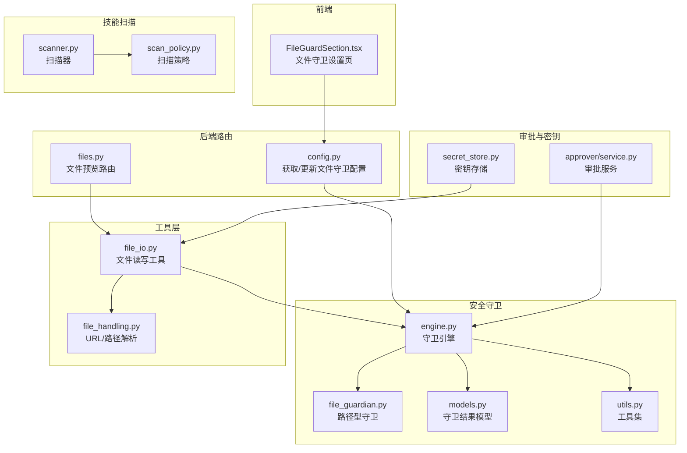
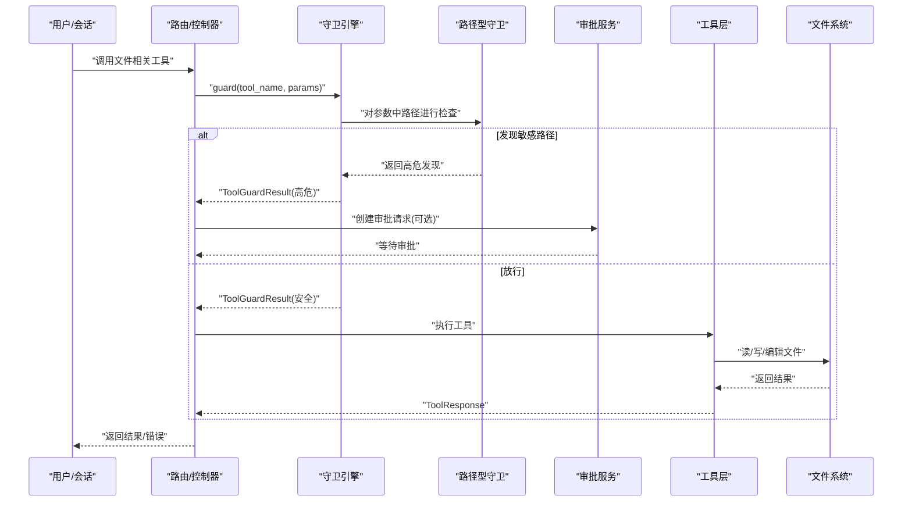
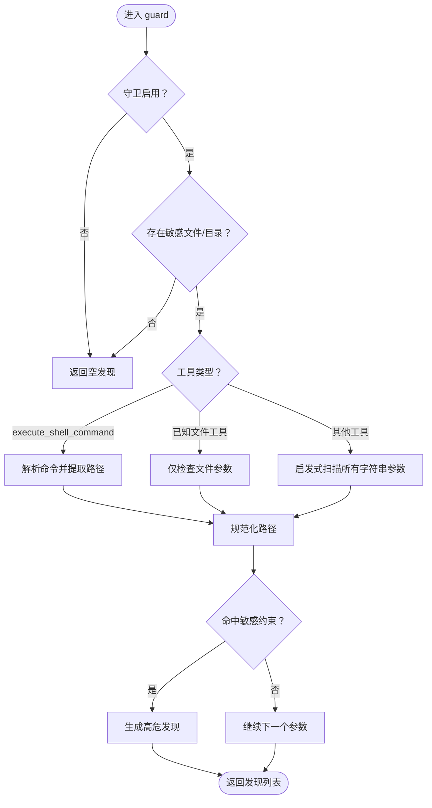
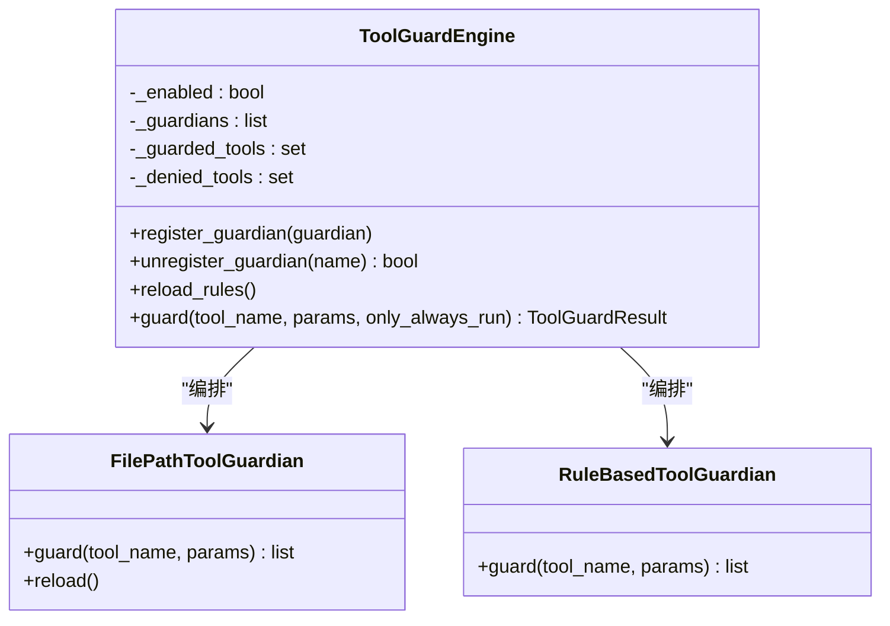
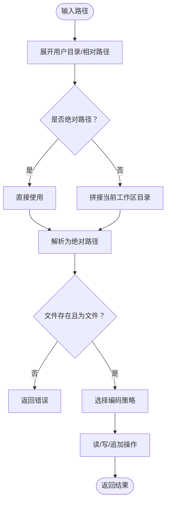
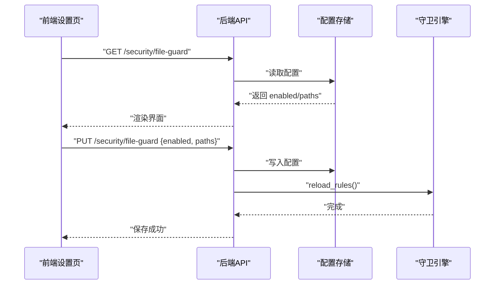
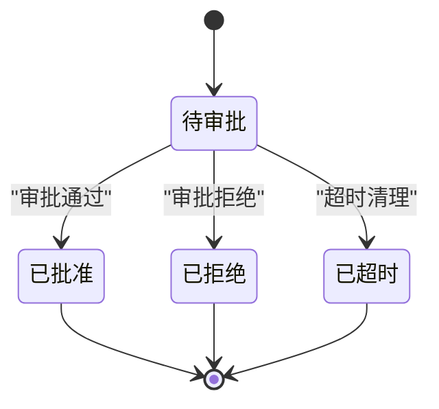
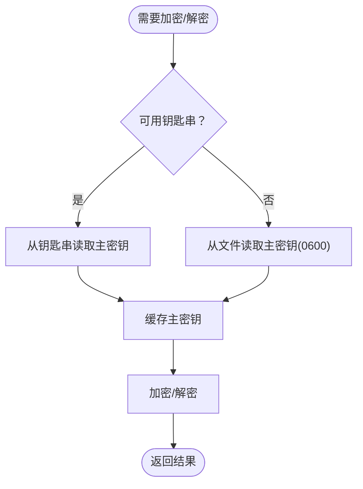
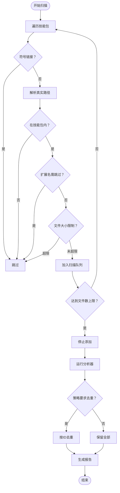
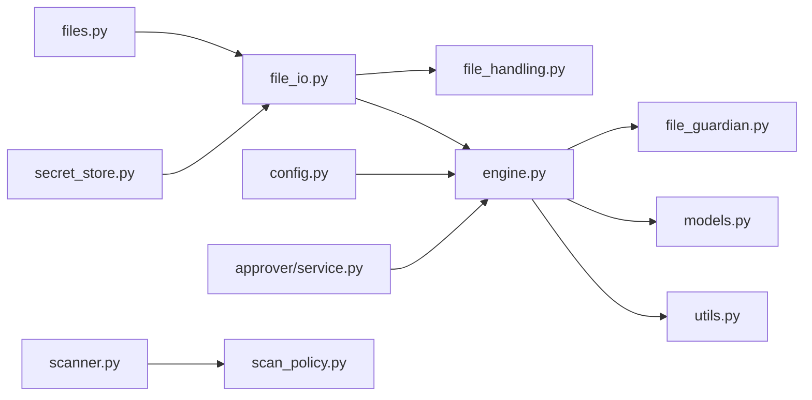

# 文件访问控制

<cite>
**本文引用的文件**
- [src/qwenpaw/security/tool_guard/guardians/file_guardian.py](file://src/qwenpaw/security/tool_guard/guardians/file_guardian.py)
- [src/qwenpaw/security/tool_guard/engine.py](file://src/qwenpaw/security/tool_guard/engine.py)
- [src/qwenpaw/security/tool_guard/models.py](file://src/qwenpaw/security/tool_guard/models.py)
- [src/qwenpaw/security/tool_guard/utils.py](file://src/qwenpaw/security/tool_guard/utils.py)
- [src/qwenpaw/app/routers/config.py](file://src/qwenpaw/app/routers/config.py)
- [src/qwenpaw/app/routers/files.py](file://src/qwenpaw/app/routers/files.py)
- [src/qwenpaw/agents/tools/file_io.py](file://src/qwenpaw/agents/tools/file_io.py)
- [src/qwenpaw/agents/utils/file_handling.py](file://src/qwenpaw/agents/utils/file_handling.py)
- [src/qwenpaw/app/approvers/service.py](file://src/qwenpaw/app/approvers/service.py)
- [src/qwenpaw/security/secret_store.py](file://src/qwenpaw/security/secret_store.py)
- [src/qwenpaw/security/skill_scanner/scanner.py](file://src/qwenpaw/security/skill_scanner/scanner.py)
- [src/qwenpaw/security/skill_scanner/scan_policy.py](file://src/qwenpaw/security/skill_scanner/scan_policy.py)
- [console/src/pages/Settings/Security/components/FileGuardSection.tsx](file://console/src/pages/Settings/Security/components/FileGuardSection.tsx)
</cite>

## 目录
1. [简介](#简介)
2. [项目结构](#项目结构)
3. [核心组件](#核心组件)
4. [架构总览](#架构总览)
5. [详细组件分析](#详细组件分析)
6. [依赖分析](#依赖分析)
7. [性能考虑](#性能考虑)
8. [故障排查指南](#故障排查指南)
9. [结论](#结论)
10. [附录](#附录)

## 简介
本文件面向QwenPaw的文件访问控制系统，系统性阐述文件操作安全验证机制与访问权限控制策略，覆盖以下关键主题：
- 文件路径解析与规范化
- 敏感路径保护与目录遍历防护
- 文件类型过滤与操作范围限制
- 权限检查与访问日志记录
- 文件读写权限配置与审批流程
- 临时授权机制与访问审计
- 文件完整性校验与安全沙箱隔离建议
- 最佳实践、常见攻击防护与应急响应策略

## 项目结构
围绕文件访问控制的关键代码分布在如下模块：
- 安全守卫（Tool Guard）：路径型敏感文件守卫、规则型守卫、守卫引擎与结果模型
- 配置与路由：文件守卫配置的读取与更新接口
- 工具层：文件读写工具与路径解析
- 前端设置页：文件守卫开关与敏感路径列表的可视化管理
- 审批服务：审批请求生命周期与参数匹配校验
- 密钥存储：敏感凭据加密存储
- 技能扫描：文件类型过滤、大小限制与扫描策略

图表来源
- [src/qwenpaw/app/routers/config.py](file://src/qwenpaw/app/routers/config.py)
- [src/qwenpaw/app/routers/files.py](file://src/qwenpaw/app/routers/files.py)
- [src/qwenpaw/security/tool_guard/engine.py](file://src/qwenpaw/security/tool_guard/engine.py)
- [src/qwenpaw/security/tool_guard/guardians/file_guardian.py](file://src/qwenpaw/security/tool_guard/guardians/file_guardian.py)
- [src/qwenpaw/security/tool_guard/models.py](file://src/qwenpaw/security/tool_guard/models.py)
- [src/qwenpaw/security/tool_guard/utils.py](file://src/qwenpaw/security/tool_guard/utils.py)
- [src/qwenpaw/agents/tools/file_io.py](file://src/qwenpaw/agents/tools/file_io.py)
- [src/qwenpaw/agents/utils/file_handling.py](file://src/qwenpaw/agents/utils/file_handling.py)
- [src/qwenpaw/app/approvers/service.py](file://src/qwenpaw/app/approvers/service.py)
- [src/qwenpaw/security/secret_store.py](file://src/qwenpaw/security/secret_store.py)
- [src/qwenpaw/security/skill_scanner/scanner.py](file://src/qwenpaw/security/skill_scanner/scanner.py)
- [src/qwenpaw/security/skill_scanner/scan_policy.py](file://src/qwenpaw/security/skill_scanner/scan_policy.py)

章节来源
- [src/qwenpaw/app/routers/config.py](file://src/qwenpaw/app/routers/config.py)
- [src/qwenpaw/app/routers/files.py](file://src/qwenpaw/app/routers/files.py)
- [src/qwenpaw/security/tool_guard/engine.py](file://src/qwenpaw/security/tool_guard/engine.py)
- [src/qwenpaw/security/tool_guard/guardians/file_guardian.py](file://src/qwenpaw/security/tool_guard/guardians/file_guardian.py)
- [src/qwenpaw/security/tool_guard/models.py](file://src/qwenpaw/security/tool_guard/models.py)
- [src/qwenpaw/security/tool_guard/utils.py](file://src/qwenpaw/security/tool_guard/utils.py)
- [src/qwenpaw/agents/tools/file_io.py](file://src/qwenpaw/agents/tools/file_io.py)
- [src/qwenpaw/agents/utils/file_handling.py](file://src/qwenpaw/agents/utils/file_handling.py)
- [src/qwenpaw/app/approvers/service.py](file://src/qwenpaw/app/approvers/service.py)
- [src/qwenpaw/security/secret_store.py](file://src/qwenpaw/security/secret_store.py)
- [src/qwenpaw/security/skill_scanner/scanner.py](file://src/qwenpaw/security/skill_scanner/scanner.py)
- [src/qwenpaw/security/skill_scanner/scan_policy.py](file://src/qwenpaw/security/skill_scanner/scan_policy.py)

## 核心组件
- 路径型文件守卫（FilePathToolGuardian）
  - 功能：基于配置的敏感文件/目录白名单与黑名单，对工具调用参数中的路径进行阻断或放行
  - 关键点：路径规范化、默认敏感目录兼容、重定向操作符提取、启发式路径识别
- 守卫引擎（ToolGuardEngine）
  - 功能：统一编排多个守卫，聚合结果并输出结构化告警
  - 关键点：环境变量与配置优先级、受保护工具集合与拒绝工具集合解析
- 守卫结果模型（GuardFinding/ToolGuardResult）
  - 功能：标准化威胁分类、严重级别、修复建议与元数据
- 文件读写工具（file_io.py）
  - 功能：相对路径解析到工作区或工作目录；编码策略；安全读取与截断
- 文件守卫配置路由（config.py）
  - 功能：提供获取/更新文件守卫配置的REST接口
- 审批服务（approver/service.py）
  - 功能：审批请求生命周期管理、参数匹配校验、超时清理
- 密钥存储（secret_store.py）
  - 功能：主密钥生成、缓存、OS钥匙串与文件后备存储、透明加解密
- 技能扫描（scanner.py/scan_policy.py）
  - 功能：按策略进行文件类型过滤、大小限制与重复发现去重

章节来源
- [src/qwenpaw/security/tool_guard/guardians/file_guardian.py](file://src/qwenpaw/security/tool_guard/guardians/file_guardian.py)
- [src/qwenpaw/security/tool_guard/engine.py](file://src/qwenpaw/security/tool_guard/engine.py)
- [src/qwenpaw/security/tool_guard/models.py](file://src/qwenpaw/security/tool_guard/models.py)
- [src/qwenpaw/agents/tools/file_io.py](file://src/qwenpaw/agents/tools/file_io.py)
- [src/qwenpaw/app/routers/config.py](file://src/qwenpaw/app/routers/config.py)
- [src/qwenpaw/app/approvers/service.py](file://src/qwenpaw/app/approvers/service.py)
- [src/qwenpaw/security/secret_store.py](file://src/qwenpaw/security/secret_store.py)
- [src/qwenpaw/security/skill_scanner/scanner.py](file://src/qwenpaw/security/skill_scanner/scanner.py)
- [src/qwenpaw/security/skill_scanner/scan_policy.py](file://src/qwenpaw/security/skill_scanner/scan_policy.py)

## 架构总览
下图展示从用户触发工具调用到最终执行的完整链路，包括路径解析、守卫检查、审批与执行。

图表来源
- [src/qwenpaw/security/tool_guard/engine.py](file://src/qwenpaw/security/tool_guard/engine.py)
- [src/qwenpaw/security/tool_guard/guardians/file_guardian.py](file://src/qwenpaw/security/tool_guard/guardians/file_guardian.py)
- [src/qwenpaw/app/approvers/service.py](file://src/qwenpaw/app/approvers/service.py)
- [src/qwenpaw/agents/tools/file_io.py](file://src/qwenpaw/agents/tools/file_io.py)

## 详细组件分析

### 路径型文件守卫（FilePathToolGuardian）
- 路径规范化与解析
  - 将相对路径解析到当前工作区或工作目录，并统一为绝对路径
  - 默认敏感目录兼容（历史/当前密钥目录）
- 敏感路径判定
  - 明确列出的敏感文件与以斜杠结尾的目录均视为敏感
  - 使用“是否位于某目录内”的方式判断路径命中
- Shell命令路径提取
  - 对shell命令字符串进行分词，识别重定向操作符及其目标路径
  - 启发式识别疑似路径的token，避免误报
- 结果与告警
  - 生成结构化发现对象，包含严重级别、类别、修复建议与元数据

图表来源
- [src/qwenpaw/security/tool_guard/guardians/file_guardian.py](file://src/qwenpaw/security/tool_guard/guardians/file_guardian.py)

章节来源
- [src/qwenpaw/security/tool_guard/guardians/file_guardian.py](file://src/qwenpaw/security/tool_guard/guardians/file_guardian.py)

### 守卫引擎（ToolGuardEngine）
- 规则与范围解析
  - 通过环境变量、配置与默认值解析受保护工具集合与拒绝工具集合
  - 提供动态注册/注销守卫的能力
- 执行与聚合
  - 按需执行所有守卫或仅执行总是运行的守卫
  - 记录耗时、失败守卫与使用过的守卫名称
- 单例模式
  - 懒加载守卫引擎实例，保证进程内唯一

图表来源
- [src/qwenpaw/security/tool_guard/engine.py](file://src/qwenpaw/security/tool_guard/engine.py)
- [src/qwenpaw/security/tool_guard/guardians/file_guardian.py](file://src/qwenpaw/security/tool_guard/guardians/file_guardian.py)

章节来源
- [src/qwenpaw/security/tool_guard/engine.py](file://src/qwenpaw/security/tool_guard/engine.py)
- [src/qwenpaw/security/tool_guard/utils.py](file://src/qwenpaw/security/tool_guard/utils.py)

### 文件读写工具与路径解析
- 相对路径解析
  - 优先使用当前工作区目录，回退到全局工作目录
- 编码策略
  - 针对CSV/TSV/TXT等文件采用带BOM的UTF-8编码以提升Windows兼容性
- 安全读取与截断
  - 限制输出字节数，必要时在消息中附加续读提示标记
- URL/本地路径解析
  - 支持file://与纯路径解析，严格检查文件存在性与非空性

图表来源
- [src/qwenpaw/agents/tools/file_io.py](file://src/qwenpaw/agents/tools/file_io.py)
- [src/qwenpaw/agents/utils/file_handling.py](file://src/qwenpaw/agents/utils/file_handling.py)

章节来源
- [src/qwenpaw/agents/tools/file_io.py](file://src/qwenpaw/agents/tools/file_io.py)
- [src/qwenpaw/agents/utils/file_handling.py](file://src/qwenpaw/agents/utils/file_handling.py)

### 文件守卫配置与前端管理
- 后端接口
  - 获取/更新文件守卫配置，支持启用开关与敏感路径列表
  - 更新后重新加载守卫规则
- 前端页面
  - 开关控制、新增/删除敏感路径、保存/重置
  - 列表展示目录/文件标识与操作按钮

图表来源
- [src/qwenpaw/app/routers/config.py](file://src/qwenpaw/app/routers/config.py)
- [console/src/pages/Settings/Security/components/FileGuardSection.tsx](file://console/src/pages/Settings/Security/components/FileGuardSection.tsx)

章节来源
- [src/qwenpaw/app/routers/config.py](file://src/qwenpaw/app/routers/config.py)
- [console/src/pages/Settings/Security/components/FileGuardSection.tsx](file://console/src/pages/Settings/Security/components/FileGuardSection.tsx)

### 审批服务与临时授权
- 生命周期
  - 创建待审批记录、异步等待决策、超时清理、参数匹配校验
- 参数匹配
  - 严格比对已批准工具调用的参数，防止参数漂移导致的越权复用
- 清理策略
  - 基于时间与数量上限的垃圾回收，避免内存膨胀

图表来源
- [src/qwenpaw/app/approvers/service.py](file://src/qwenpaw/app/approvers/service.py)

章节来源
- [src/qwenpaw/app/approvers/service.py](file://src/qwenpaw/app/approvers/service.py)

### 密钥存储与敏感凭据保护
- 主密钥管理
  - 进程内缓存、OS钥匙串优先、文件后备存储（0600权限）
  - 容器/无桌面环境自动降级
- 加密/解密
  - Fernet(AES-128-CBC + HMAC-SHA256)透明加解密
  - 前缀标识加密值，解密失败时降级返回原文

图表来源
- [src/qwenpaw/security/secret_store.py](file://src/qwenpaw/security/secret_store.py)

章节来源
- [src/qwenpaw/security/secret_store.py](file://src/qwenpaw/security/secret_store.py)

### 技能扫描与文件类型过滤
- 文件发现
  - 递归遍历技能包，跳过符号链接与超出边界的真实路径
  - 按策略与默认值限制最大文件数与单文件大小
- 类型过滤
  - 基于策略的惰性/归档扩展名集合，默认跳过常见二进制与可执行文件
- 去重
  - 可按策略开启按ID去重，减少重复告警

图表来源
- [src/qwenpaw/security/skill_scanner/scanner.py](file://src/qwenpaw/security/skill_scanner/scanner.py)
- [src/qwenpaw/security/skill_scanner/scan_policy.py](file://src/qwenpaw/security/skill_scanner/scan_policy.py)

章节来源
- [src/qwenpaw/security/skill_scanner/scanner.py](file://src/qwenpaw/security/skill_scanner/scanner.py)
- [src/qwenpaw/security/skill_scanner/scan_policy.py](file://src/qwenpaw/security/skill_scanner/scan_policy.py)

## 依赖分析
- 组件耦合
  - 守卫引擎依赖路径型守卫与规则型守卫，统一聚合结果
  - 工具层依赖路径解析与上下文工作区信息
  - 审批服务与守卫结果强关联，用于参数匹配与超时处理
- 外部依赖
  - OS钥匙串（keyring）、加密库（cryptography）、FastAPI/Starlette
- 潜在循环依赖
  - 当前模块间通过导入延迟与接口契约避免循环

图表来源
- [src/qwenpaw/security/tool_guard/engine.py](file://src/qwenpaw/security/tool_guard/engine.py)
- [src/qwenpaw/security/tool_guard/guardians/file_guardian.py](file://src/qwenpaw/security/tool_guard/guardians/file_guardian.py)
- [src/qwenpaw/security/tool_guard/models.py](file://src/qwenpaw/security/tool_guard/models.py)
- [src/qwenpaw/security/tool_guard/utils.py](file://src/qwenpaw/security/tool_guard/utils.py)
- [src/qwenpaw/agents/tools/file_io.py](file://src/qwenpaw/agents/tools/file_io.py)
- [src/qwenpaw/agents/utils/file_handling.py](file://src/qwenpaw/agents/utils/file_handling.py)
- [src/qwenpaw/app/routers/config.py](file://src/qwenpaw/app/routers/config.py)
- [src/qwenpaw/app/routers/files.py](file://src/qwenpaw/app/routers/files.py)
- [src/qwenpaw/app/approvers/service.py](file://src/qwenpaw/app/approvers/service.py)
- [src/qwenpaw/security/secret_store.py](file://src/qwenpaw/security/secret_store.py)
- [src/qwenpaw/security/skill_scanner/scanner.py](file://src/qwenpaw/security/skill_scanner/scanner.py)
- [src/qwenpaw/security/skill_scanner/scan_policy.py](file://src/qwenpaw/security/skill_scanner/scan_policy.py)

章节来源
- [src/qwenpaw/security/tool_guard/engine.py](file://src/qwenpaw/security/tool_guard/engine.py)
- [src/qwenpaw/agents/tools/file_io.py](file://src/qwenpaw/agents/tools/file_io.py)
- [src/qwenpaw/app/routers/config.py](file://src/qwenpaw/app/routers/config.py)
- [src/qwenpaw/app/routers/files.py](file://src/qwenpaw/app/routers/files.py)
- [src/qwenpaw/app/approvers/service.py](file://src/qwenpaw/app/approvers/service.py)
- [src/qwenpaw/security/secret_store.py](file://src/qwenpaw/security/secret_store.py)
- [src/qwenpaw/security/skill_scanner/scanner.py](file://src/qwenpaw/security/skill_scanner/scanner.py)
- [src/qwenpaw/security/skill_scanner/scan_policy.py](file://src/qwenpaw/security/skill_scanner/scan_policy.py)

## 性能考虑
- 路径解析与规范化
  - 使用绝对路径与缓存策略，避免重复计算
- 守卫执行
  - 仅在必要时执行，支持“仅总是运行”的轻量检查
- 文件扫描
  - 限制最大文件数与单文件大小，跳过二进制与归档文件
- 日志与告警
  - 结构化日志按严重级别分级输出，避免高频噪声

## 故障排查指南
- 守卫未生效
  - 检查环境变量与配置项是否正确设置
  - 确认受保护工具集合与拒绝工具集合解析结果
- 路径误报/漏报
  - 核对敏感路径列表是否包含目标路径或其父目录
  - 检查Shell命令中重定向操作符是否被正确识别
- 审批超时
  - 查看审批服务的超时阈值与待审批队列长度
  - 确认参数匹配逻辑是否导致审批被拒绝
- 文件读取异常
  - 检查工作区目录与文件存在性
  - 确认编码策略与截断逻辑是否符合预期

章节来源
- [src/qwenpaw/security/tool_guard/engine.py](file://src/qwenpaw/security/tool_guard/engine.py)
- [src/qwenpaw/security/tool_guard/guardians/file_guardian.py](file://src/qwenpaw/security/tool_guard/guardians/file_guardian.py)
- [src/qwenpaw/app/approvers/service.py](file://src/qwenpaw/app/approvers/service.py)
- [src/qwenpaw/agents/tools/file_io.py](file://src/qwenpaw/agents/tools/file_io.py)

## 结论
QwenPaw的文件访问控制系统通过“路径型守卫+规则型守卫+审批服务+密钥存储+技能扫描”的多层防护，实现了对敏感路径、目录遍历、Shell注入与参数漂移等风险的有效控制。结合前端可视化配置与结构化日志，系统在安全性与可运维性之间取得平衡。建议在生产环境中：
- 明确敏感路径清单并定期审查
- 启用审批流程并限制审批有效期
- 强化密钥存储与最小权限原则
- 使用技能扫描策略限制潜在恶意文件类型

## 附录
- 常见攻击与防护要点
  - 目录遍历：严格路径规范化与边界检查
  - Shell注入：重定向操作符提取与参数白名单
  - 参数漂移：审批参数匹配与超时清理
  - 凭据泄露：密钥存储与透明加解密
- 应急响应步骤
  - 立即冻结相关审批通道
  - 回滚可疑配置变更
  - 审计守卫告警与审批记录
  - 修复漏洞并加强监控