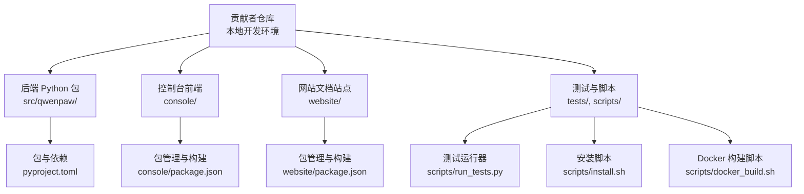
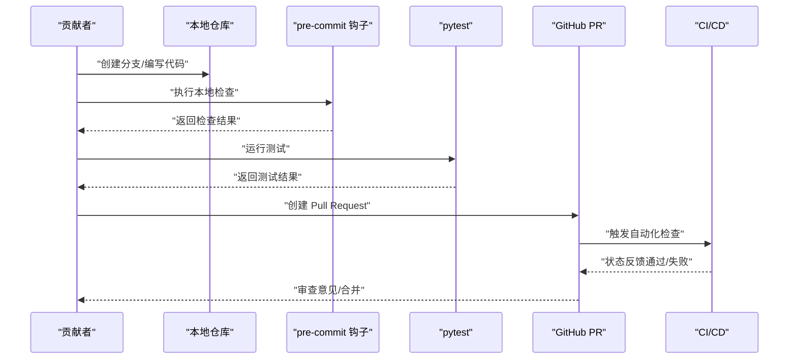
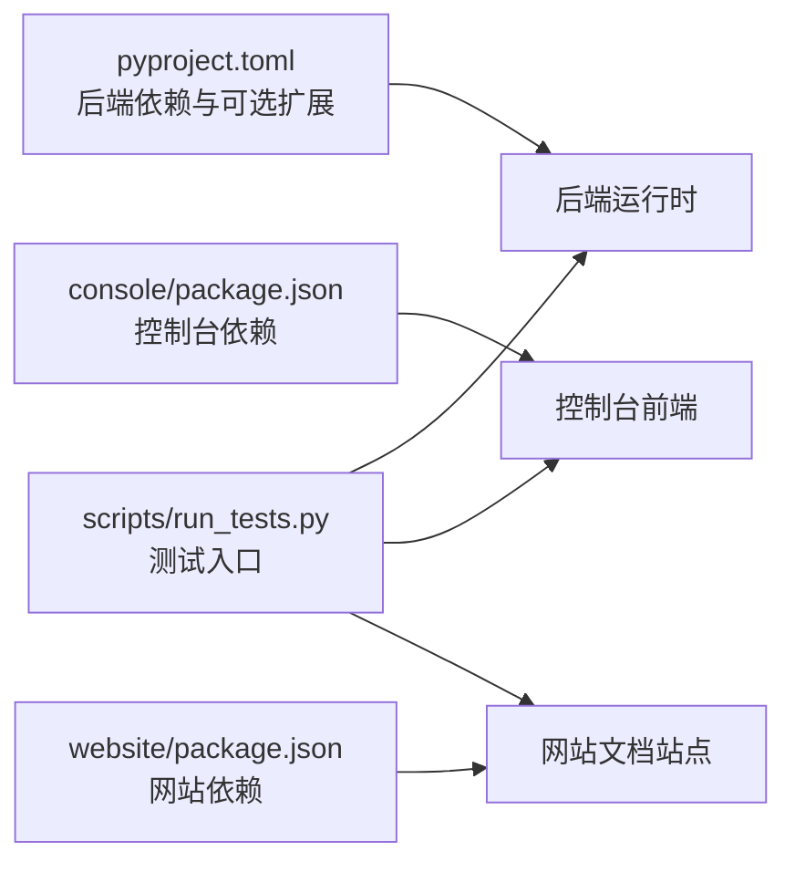

# 代码贡献指南

<cite>
**本文引用的文件**
- [CONTRIBUTING.md](file://CONTRIBUTING.md)
- [.pre-commit-config.yaml](file://.pre-commit-config.yaml)
- [pyproject.toml](file://pyproject.toml)
- [scripts/run_tests.py](file://scripts/run_tests.py)
- [scripts/install.sh](file://scripts/install.sh)
- [scripts/docker_build.sh](file://scripts/docker_build.sh)
- [console/eslint.config.js](file://console/eslint.config.js)
- [console/package.json](file://console/package.json)
- [website/package.json](file://website/package.json)
- [.flake8](file://.flake8)
- [.github/PULL_REQUEST_TEMPLATE.md](file://.github/PULL_REQUEST_TEMPLATE.md)
</cite>

## 目录
1. [简介](#简介)
2. [项目结构](#项目结构)
3. [核心组件](#核心组件)
4. [架构总览](#架构总览)
5. [详细组件分析](#详细组件分析)
6. [依赖分析](#依赖分析)
7. [性能考虑](#性能考虑)
8. [故障排查指南](#故障排查指南)
9. [结论](#结论)
10. [附录](#附录)

## 简介
本指南面向所有希望为 QwenPaw 贡献代码的开发者，系统化地阐述贡献流程、代码规范与提交规范，覆盖 Issue 创建、Pull Request 流程、代码审查标准；同时文档化 Conventional Commits 格式、分支命名建议、代码风格要求，并说明 pre-commit 钩子配置、代码格式化与静态检查工具的使用方法。此外，提供代码审查清单、质量标准与最佳实践，涵盖新功能开发、Bug 修复与文档改进的完整工作流程，以及社区参与方式、沟通渠道与协作规范。

## 项目结构
QwenPaw 是一个前后端分离、多语言混合的工程：后端以 Python 为主（核心业务逻辑、CLI、应用服务），前端包含控制台 Web 应用与网站文档站点，另有脚本与打包工具链。贡献者在不同子模块中遵循相应的规范与工具链。

图示来源
- [pyproject.toml:1-111](file://pyproject.toml#L1-L111)
- [console/package.json:1-62](file://console/package.json#L1-L62)
- [website/package.json:1-51](file://website/package.json#L1-L51)
- [scripts/run_tests.py:1-282](file://scripts/run_tests.py#L1-L282)
- [scripts/install.sh:1-340](file://scripts/install.sh#L1-L340)
- [scripts/docker_build.sh:1-32](file://scripts/docker_build.sh#L1-L32)

章节来源
- [pyproject.toml:1-111](file://pyproject.toml#L1-L111)
- [console/package.json:1-62](file://console/package.json#L1-L62)
- [website/package.json:1-51](file://website/package.json#L1-L51)
- [scripts/run_tests.py:1-282](file://scripts/run_tests.py#L1-L282)
- [scripts/install.sh:1-340](file://scripts/install.sh#L1-L340)
- [scripts/docker_build.sh:1-32](file://scripts/docker_build.sh#L1-L32)

## 核心组件
- 贡献流程与规范：参见贡献指南文档，明确 Issue 与 PR 的入口、标题与描述规范、审查清单与质量门禁。
- 代码质量门禁：pre-commit 配置统一了 Python 与前端的静态检查、格式化与安全扫描。
- 测试体系：pytest 集成单元与集成测试，配套本地测试脚本支持并行与覆盖率。
- 安装与打包：一键安装脚本与 Docker 多阶段构建，确保跨平台一致性。
- 前端开发：控制台与网站分别有独立的包管理与构建脚本，统一格式化与 ESLint 规则。

章节来源
- [CONTRIBUTING.md:11-86](file://CONTRIBUTING.md#L11-L86)
- [.pre-commit-config.yaml:1-121](file://.pre-commit-config.yaml#L1-L121)
- [scripts/run_tests.py:105-111](file://scripts/run_tests.py#L105-L111)

## 架构总览
下图展示贡献者从本地开发到提交 PR 的典型路径，以及质量门禁与工具链如何协同：

图示来源
- [CONTRIBUTING.md:70-86](file://CONTRIBUTING.md#L70-L86)
- [scripts/run_tests.py:148-173](file://scripts/run_tests.py#L148-L173)
- [.pre-commit-config.yaml:1-121](file://.pre-commit-config.yaml#L1-L121)

章节来源
- [CONTRIBUTING.md:70-86](file://CONTRIBUTING.md#L70-L86)
- [scripts/run_tests.py:148-173](file://scripts/run_tests.py#L148-L173)
- [.pre-commit-config.yaml:1-121](file://.pre-commit-config.yaml#L1-L121)

## 详细组件分析

### Issue 创建与跟踪
- 在开始任何实现前，请先搜索现有 Issue 与项目看板，避免重复劳动；如无匹配问题，再开新 Issue 描述需求与动机，等待维护者确认方向。
- 对于大型或设计敏感变更，建议先开 Issue 讨论，达成一致后再提交 PR。

章节来源
- [CONTRIBUTING.md:15-21](file://CONTRIBUTING.md#L15-L21)

### Pull Request 流程与标题规范
- PR 标题需遵循 Conventional Commits 格式，类型包括 feat、fix、docs、test、refactor、chore、perf、style、build、revert 等，作用域需小写且简洁。
- PR 模板包含“类型”、“组件影响范围”、“检查清单”、“测试验证证据”等字段，用于标准化审查与回归验证。

章节来源
- [CONTRIBUTING.md:51-66](file://CONTRIBUTING.md#L51-L66)
- [.github/PULL_REQUEST_TEMPLATE.md:1-54](file://.github/PULL_REQUEST_TEMPLATE.md#L1-L54)

### 代码与质量门禁
- 必须通过本地 gate：安装开发依赖、安装并运行 pre-commit 全量检查、运行 pytest。
- 若 pre-commit 修改了文件，需再次运行直至全部通过；CI 中失败的 PR 不具备合并资格。
- 前端变更需在 console 与 website 目录执行格式化命令，确保样式一致。

章节来源
- [CONTRIBUTING.md:70-86](file://CONTRIBUTING.md#L70-L86)

### Conventional Commits 提交信息规范
- 格式：<type>(<scope>): <subject>，类型涵盖新增特性、修复、文档、重构、性能、测试、构建、回滚等。
- 示例与最佳实践详见贡献指南中的示例与说明。

章节来源
- [CONTRIBUTING.md:23-49](file://CONTRIBUTING.md#L23-L49)

### 分支命名建议
- 建议采用小写字母、数字、连字符或下划线的组合，清晰表达功能或修复主题，例如：feat/channel-telegram、fix/provider-auth、docs/readme-updates。
- 与 PR 标题保持一致的语义与粒度，避免在一个分支中混入无关改动。

章节来源
- [CONTRIBUTING.md:51-66](file://CONTRIBUTING.md#L51-L66)

### 代码风格与格式化
- Python 后端：
  - 使用 flake8 控制行宽与忽略规则，最大行长 79；忽略部分 F/W 规则以适配项目现状。
  - 使用 mypy 进行类型检查，针对特定文件类型与路径进行排除。
  - 使用 black 与 flake8 组合进行格式化与风格检查。
- 前端（控制台与网站）：
  - 使用 ESLint 与 TypeScript ESLint 规则，结合 React Hooks 与刷新插件。
  - 使用 Prettier 统一格式化，提供 check 与 write 两种模式。
  - 控制台与网站各自维护独立的 package.json 脚本与依赖。

章节来源
- [.flake8:1-12](file://.flake8#L1-L12)
- [.pre-commit-config.yaml:31-53](file://.pre-commit-config.yaml#L31-L53)
- [.pre-commit-config.yaml:66-113](file://.pre-commit-config.yaml#L66-L113)
- [console/eslint.config.js:1-29](file://console/eslint.config.js#L1-L29)
- [console/package.json:6-16](file://console/package.json#L6-L16)
- [website/package.json:5-11](file://website/package.json#L5-L11)

### 静态检查与安全扫描
- pre-commit 集成多项检查：AST、YAML/JSON/XML/TOML 校验、文档首行注释、私钥检测、尾随空白、mypy 类型检查、flake8 风格检查、pylint 规则、Prettier 格式化等。
- 针对技能目录与打包脚本设置排除，避免误报与过度检查。

章节来源
- [.pre-commit-config.yaml:1-121](file://.pre-commit-config.yaml#L1-L121)

### 测试与覆盖率
- 使用 pytest 运行单元与集成测试，支持并行执行与覆盖率报告生成。
- 本地测试脚本提供灵活的子目录选择、并行与覆盖率开关，便于快速定位问题。

章节来源
- [scripts/run_tests.py:76-173](file://scripts/run_tests.py#L76-L173)
- [pyproject.toml:105-111](file://pyproject.toml#L105-L111)

### 安装与部署
- 一键安装脚本自动处理 uv、虚拟环境、可选扩展与前端资源准备，支持从源码或 PyPI 安装。
- Docker 构建脚本支持多阶段构建与通道选择，便于容器化部署。

章节来源
- [scripts/install.sh:1-340](file://scripts/install.sh#L1-L340)
- [scripts/docker_build.sh:1-32](file://scripts/docker_build.sh#L1-L32)

### 文档与国际化
- 用户文档位于 website/public/docs 下，贡献时请同步更新相关文档页。
- README 与贡献指南提供多语言版本，确保全球用户无障碍阅读。

章节来源
- [CONTRIBUTING.md:85](file://CONTRIBUTING.md#L85)

### 社区参与与沟通
- 讨论区、问题反馈与社区群组是主要沟通渠道；请遵守友好、尊重的协作文化。

章节来源
- [CONTRIBUTING.md:229-235](file://CONTRIBUTING.md#L229-L235)

## 依赖分析
- Python 依赖与可选扩展在 pyproject.toml 中集中声明，dev/full 等分组满足不同开发场景。
- 前端依赖与脚本在 console 与 website 的 package.json 中管理，分别对应控制台与网站文档站点。

图示来源
- [pyproject.toml:75-103](file://pyproject.toml#L75-L103)
- [console/package.json:18-42](file://console/package.json#L18-L42)
- [website/package.json:12-37](file://website/package.json#L12-L37)
- [scripts/run_tests.py:175-282](file://scripts/run_tests.py#L175-L282)

章节来源
- [pyproject.toml:75-103](file://pyproject.toml#L75-L103)
- [console/package.json:18-42](file://console/package.json#L18-L42)
- [website/package.json:12-37](file://website/package.json#L12-L37)
- [scripts/run_tests.py:175-282](file://scripts/run_tests.py#L175-L282)

## 性能考虑
- 优先保证提交前本地检查与测试通过，减少 CI 时间消耗与失败重试成本。
- 对于大型 PR，建议拆分为更小的功能块，降低审查与回归风险。
- 使用并行测试与增量检查，缩短本地反馈周期。

## 故障排查指南
- pre-commit 失败
  - 按提示修复或接受自动修改，再次运行直到全部通过。
  - 检查排除规则是否误用，必要时临时调整配置定位问题。
- 测试失败
  - 使用本地测试脚本按子目录运行，缩小问题范围。
  - 开启覆盖率输出定位未覆盖路径。
- 安装与运行异常
  - 使用安装脚本的错误提示逐步排查 uv、虚拟环境与前端资源准备。
  - Docker 构建时检查通道参数与网络镜像配置。

章节来源
- [CONTRIBUTING.md:77-86](file://CONTRIBUTING.md#L77-L86)
- [scripts/run_tests.py:76-173](file://scripts/run_tests.py#L76-L173)
- [scripts/install.sh:104-132](file://scripts/install.sh#L104-L132)
- [scripts/docker_build.sh:20-28](file://scripts/docker_build.sh#L20-L28)

## 结论
通过统一的贡献流程、严格的代码质量门禁与完善的工具链，QwenPaw 为贡献者提供了高效、可追溯且可持续的协作体验。请始终遵循 Conventional Commits、PR 模板与审查清单，配合 pre-commit 与测试工具，确保每次提交都具备高质量与可维护性。

## 附录

### 代码审查清单（供参考）
- 是否遵循 Conventional Commits 与 PR 模板？
- 是否通过 pre-commit 全量检查？若有自动修改，是否重新运行并通过？
- 是否通过 pytest 并达到最低覆盖率要求？
- 是否更新了相关文档（用户文档与 README）？
- 是否避免了不相关的改动与大而全的 PR？
- 是否在 Issue 中明确了关联关系与背景？

章节来源
- [CONTRIBUTING.md:70-86](file://CONTRIBUTING.md#L70-L86)
- [.github/PULL_REQUEST_TEMPLATE.md:29-35](file://.github/PULL_REQUEST_TEMPLATE.md#L29-L35)