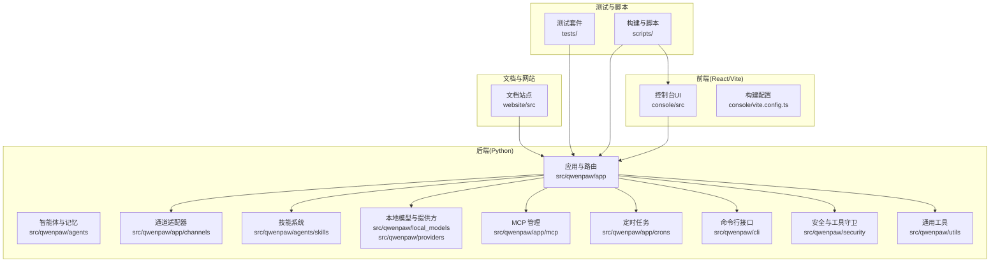
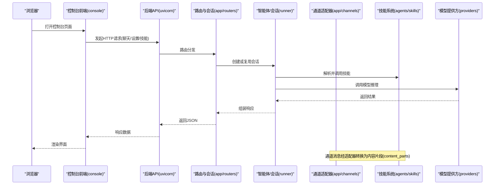
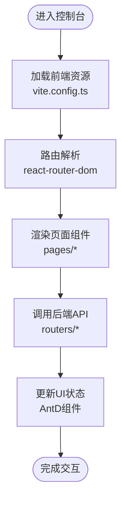
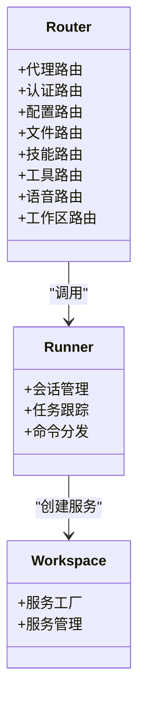
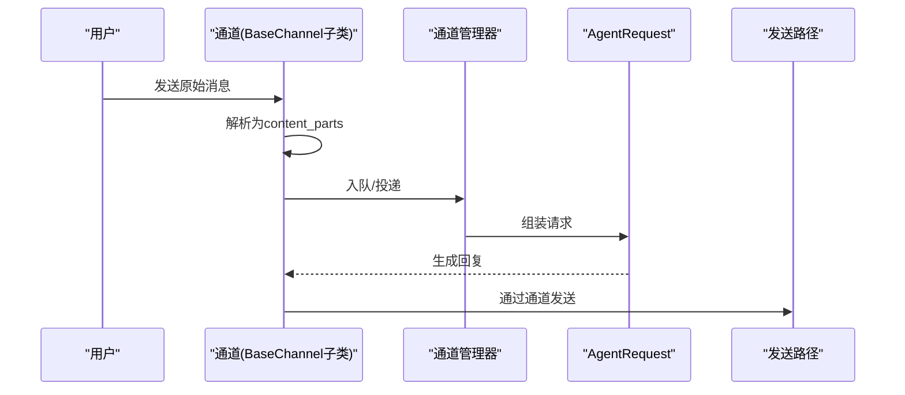
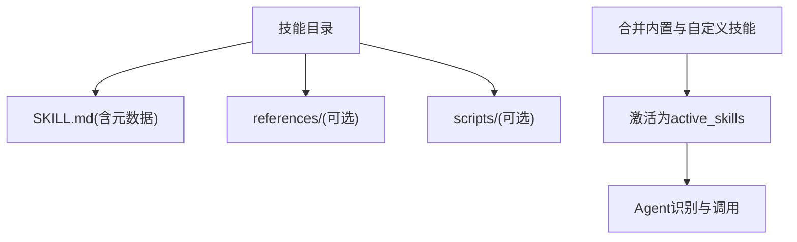
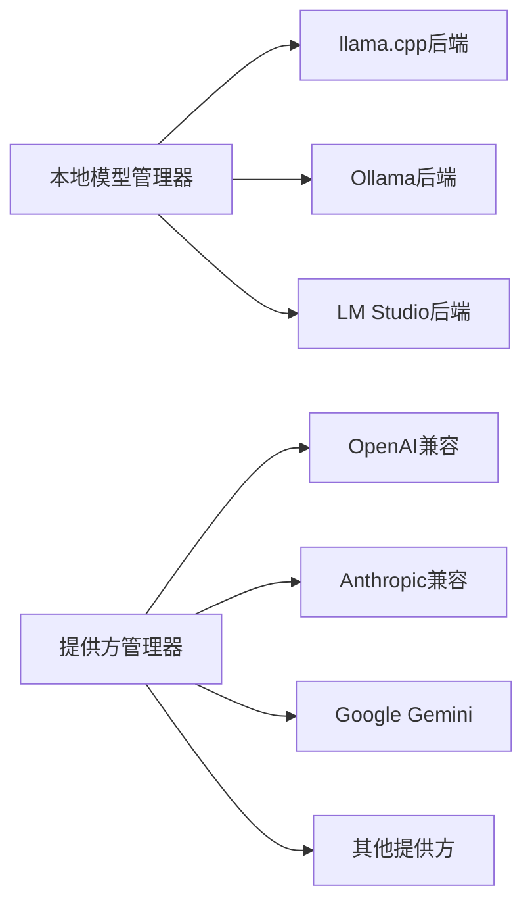
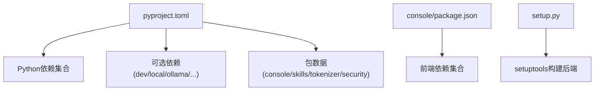

# 开发指南

<cite>
**本文引用的文件**
- [README.md](file://README.md)
- [CONTRIBUTING.md](file://CONTRIBUTING.md)
- [SECURITY.md](file://SECURITY.md)
- [pyproject.toml](file://pyproject.toml)
- [setup.py](file://setup.py)
- [.pre-commit-config.yaml](file://.pre-commit-config.yaml)
- [.flake8](file://.flake8)
- [console/package.json](file://console/package.json)
- [console/eslint.config.js](file://console/eslint.config.js)
- [console/tsconfig.json](file://console/tsconfig.json)
- [console/vite.config.ts](file://console/vite.config.ts)
- [scripts/README.md](file://scripts/README.md)
- [.github/PULL_REQUEST_TEMPLATE.md](file://.github/PULL_REQUEST_TEMPLATE.md)
</cite>

## 目录
1. [简介](#简介)
2. [项目结构](#项目结构)
3. [核心组件](#核心组件)
4. [架构总览](#架构总览)
5. [详细组件分析](#详细组件分析)
6. [依赖关系分析](#依赖关系分析)
7. [性能考虑](#性能考虑)
8. [故障排查指南](#故障排查指南)
9. [结论](#结论)
10. [附录](#附录)

## 简介
本开发指南面向希望为 QwenPaw 贡献代码与功能的开发者，覆盖从开发环境搭建、代码贡献流程、测试策略到构建打包、版本管理与安全策略的全流程。同时提供插件与扩展机制、第三方集成、调试与性能优化、文档与社区协作等实用建议。

## 项目结构
QwenPaw 采用前后端分离的多模块组织方式：
- 后端（Python）：核心应用、通道适配器、技能系统、本地模型、MCP 管理、定时任务、CLI 命令等位于 src/qwenpaw 下。
- 前端（React/Vite）：控制台 Web UI 位于 console/，构建产物复制到后端包内以提供静态资源。
- 文档与网站：website/ 提供文档站点；根目录 README 及多语言 README 提供快速上手与安装说明。
- 测试：tests/ 包含单元与集成测试。
- 构建与脚本：scripts/ 提供打包、测试、Docker 构建等自动化脚本。
- 部署：deploy/ 提供 Dockerfile 与 supervisord 配置模板。

图表来源
- [pyproject.toml:1-111](file://pyproject.toml#L1-L111)
- [console/vite.config.ts:1-109](file://console/vite.config.ts#L1-L109)

章节来源
- [README.md:433-455](file://README.md#L433-L455)
- [pyproject.toml:51-65](file://pyproject.toml#L51-L65)

## 核心组件
- 应用与运行时：后端通过 uvicorn 提供 HTTP 接口，统一路由与会话管理。
- 通道适配器：抽象出统一的消息契约，支持多平台（钉钉、飞书、微信、Discord、Telegram 等）。
- 技能系统：内置多种技能（计划任务、文件处理、浏览器、新闻等），支持社区 Hub 导入。
- 本地模型与提供方：支持 llama.cpp、Ollama、LM Studio 等本地推理，以及多家云厂商提供方。
- MCP 管理：运行时发现与热插拔 MCP 工具客户端。
- 定时任务：基于 APScheduler 的心跳与计划任务执行。
- CLI：提供初始化、启动、技能管理、清理、更新等命令。
- 安全与工具守卫：文件访问限制、危险命令拦截、技能扫描策略。
- 前端控制台：React + Ant Design，提供聊天、设置、技能与通道管理界面。

章节来源
- [pyproject.toml:7-46](file://pyproject.toml#L7-L46)
- [README.md:31-56](file://README.md#L31-L56)

## 架构总览
下图展示从浏览器到后端服务、通道适配器与技能执行的整体调用链路。

图表来源
- [console/vite.config.ts:1-109](file://console/vite.config.ts#L1-L109)
- [pyproject.toml:15-46](file://pyproject.toml#L15-L46)

## 详细组件分析

### 前端控制台（Console）
- 技术栈：React 18、Ant Design 5、Vite、TypeScript、Less。
- 构建与开发：支持 dev/build/lint/format 等脚本；按依赖类型拆分 vendor chunk，优化首屏加载。
- 国际化：i18n 支持中/英/日/俄。
- 主要页面：聊天、代理配置、技能管理、通道管理、定时任务、设置等。

图表来源
- [console/vite.config.ts:34-108](file://console/vite.config.ts#L34-L108)
- [console/package.json:6-16](file://console/package.json#L6-L16)
- [console/eslint.config.js:1-29](file://console/eslint.config.js#L1-L29)

章节来源
- [console/package.json:18-42](file://console/package.json#L18-L42)
- [console/tsconfig.json:1-8](file://console/tsconfig.json#L1-L8)
- [console/vite.config.ts:1-109](file://console/vite.config.ts#L1-L109)

### 后端应用与路由
- 路由模块：按功能划分（代理、认证、配置、文件、技能、工具、语音、工作区等）。
- 会话与运行器：统一管理会话生命周期、任务跟踪与错误 dump。
- 工作区：服务工厂与管理器，支持多实例隔离。

图表来源
- [pyproject.toml:15-46](file://pyproject.toml#L15-L46)

章节来源
- [pyproject.toml:15-46](file://pyproject.toml#L15-L46)

### 通道适配器（Channels）
- 协议：统一 native payload → content_parts（文本/图片/文件）。
- 实现：继承 BaseChannel，注册在 registry 中；支持长连接队列与消费循环。
- CLI：channels 子命令用于安装/添加/移除/配置自定义通道。

图表来源
- [CONTRIBUTING.md:114-131](file://CONTRIBUTING.md#L114-L131)

章节来源
- [CONTRIBUTING.md:114-131](file://CONTRIBUTING.md#L114-L131)

### 技能系统（Skills）
- 结构：每个技能为目录，包含 SKILL.md（含元数据）、references/、scripts/。
- 激活：内置与工作目录自定义技能合并为 active_skills。
- Hub：支持从社区 Hub 导入技能。

图表来源
- [CONTRIBUTING.md:134-147](file://CONTRIBUTING.md#L134-L147)

章节来源
- [CONTRIBUTING.md:134-184](file://CONTRIBUTING.md#L134-L184)

### 本地模型与提供方（Local Models & Providers）
- 本地模型：llama.cpp、Ollama、LM Studio；下载与管理器负责模型生命周期。
- 提供方：OpenAI、Anthropic、Gemini、Ollama 等，统一兼容 OpenAI/Anthropic 接口风格。
- 速率限制与重试：提供速率限制器与兼容层，提升稳定性。

图表来源
- [pyproject.toml:8-46](file://pyproject.toml#L8-L46)

章节来源
- [pyproject.toml:7-46](file://pyproject.toml#L7-L46)

### MCP 管理
- 运行时发现与热插拔 MCP 客户端，支持状态化客户端与监控。

章节来源
- [pyproject.toml:15-46](file://pyproject.toml#L15-L46)

### 定时任务（Cron）
- 心跳与计划任务：基于 APScheduler，支持 JSON 仓库与执行器。

章节来源
- [pyproject.toml:16](file://pyproject.toml#L16)

### CLI 与安装
- 脚本安装：自动检测 uv 并创建虚拟环境，安装前端与依赖。
- 一键桌面应用：Windows/macOS 二进制包，零配置启动。
- Docker：官方镜像与阿里云镜像，支持宿主机网络互通。

章节来源
- [README.md:104-329](file://README.md#L104-L329)

## 依赖关系分析
- Python 依赖：通过 pyproject.toml 统一声明，包含 agentscope-runtime、httpx、apscheduler、playwright、telethon、twilio、mqtt、matrix、cryptography、pyyaml、huggingface_hub、pillow 等。
- 可选依赖：dev、local、llamacpp、mlx、ollama、whisper、full 等，满足不同开发与运行场景。
- 前端依赖：React、Ant Design、Vite、ESLint、Prettier、TypeScript 等。
- 包打包：setuptools 动态版本与包数据包含 console、技能、分词器、安全规则等静态资源。

图表来源
- [pyproject.toml:1-111](file://pyproject.toml#L1-L111)
- [console/package.json:18-61](file://console/package.json#L18-L61)
- [setup.py:1-5](file://setup.py#L1-L5)

章节来源
- [pyproject.toml:1-111](file://pyproject.toml#L1-L111)
- [console/package.json:18-61](file://console/package.json#L18-L61)
- [setup.py:1-5](file://setup.py#L1-L5)

## 性能考虑
- 前端构建优化：Vite 拆分 vendor chunk（react、antd、i18n、markdown、dnd、utils），减少单包体积，提升缓存命中率。
- 依赖懒加载：结合路由与组件懒加载，降低初始加载时间。
- 本地模型推理：优先选择轻量后端（如 llama.cpp），合理设置上下文长度与批大小。
- 网络与并发：使用 httpx 异步请求，避免阻塞；通道与定时任务采用队列与异步循环。
- 代码质量：pre-commit 钩子与 flake8/black/pylint 等工具确保代码一致性与可维护性。

章节来源
- [console/vite.config.ts:41-108](file://console/vite.config.ts#L41-L108)
- [console/package.json:6-16](file://console/package.json#L6-L16)
- [.pre-commit-config.yaml:1-121](file://.pre-commit-config.yaml#L1-L121)
- [.flake8:1-12](file://.flake8#L1-L12)

## 故障排查指南
- 安装与启动
  - 使用脚本安装失败：检查 uv 是否可用，必要时手动安装并重新运行脚本。
  - Docker 端口冲突：更换映射端口或使用 host 网络模式。
  - 本地模型无法连接：确认本地服务地址与端口，必要时使用 host.docker.internal。
- 前端开发
  - 控制台无法热更新：确认 Vite dev server 端口与 host 设置。
  - ESLint/格式化报错：先执行 console/npm run format 与 lint，再提交。
- 测试
  - 运行测试：使用 scripts/run_tests.py 指定模块与并行参数；或直接 pytest。
  - 覆盖率：pytest-cov 生成报告，定位薄弱环节。
- 安全
  - 遵循安全策略，私有披露漏洞；严格限制通道与用户白名单，避免共享实例被多方滥用。
  - 工作目录与凭据隔离，避免凭据落入技能可访问路径。

章节来源
- [README.md:158-270](file://README.md#L158-L270)
- [scripts/README.md:30-53](file://scripts/README.md#L30-L53)
- [SECURITY.md:1-158](file://SECURITY.md#L1-L158)

## 结论
QwenPaw 通过清晰的模块划分与完善的工具链，为开发者提供了从安装、开发、测试到部署与发布的完整闭环。建议在贡献前先阅读贡献指南与安全策略，遵循约定式提交与代码规范，确保高质量交付。

## 附录

### 开发环境搭建
- 安装依赖与前端构建
  - 在根目录执行：安装 Python 依赖（含 dev/full），构建前端控制台，复制到后端包，再安装 Python 包。
- 前端开发
  - 在 console 目录执行：npm ci 安装依赖，npm run dev 启动开发服务器。
- 运行应用
  - 初始化配置并启动应用，打开控制台进行验证。

章节来源
- [README.md:433-455](file://README.md#L433-L455)
- [console/package.json:6-16](file://console/package.json#L6-L16)

### 代码贡献流程
- 提交前检查
  - 安装并运行 pre-commit，确保所有钩子通过。
  - 运行 pytest，确保测试通过。
  - 如涉及前端，先在 console/ 与 website/ 目录执行格式化。
- 提交信息与 PR
  - 遵循 Conventional Commits 规范；PR 模板包含组件影响范围与自测清单。
- 文档更新
  - 用户可见行为变更需同步更新 website/public/docs/ 下的文档。

章节来源
- [CONTRIBUTING.md:23-86](file://CONTRIBUTING.md#L23-L86)
- [.github/PULL_REQUEST_TEMPLATE.md:1-54](file://.github/PULL_REQUEST_TEMPLATE.md#L1-L54)

### 编码规范与提交规范
- Python
  - 使用 flake8（最大行长 79）、black（行宽 79）、pylint（忽略项见配置）。
  - 类型检查：mypy（忽略部分文件类型缺失）。
- 前端
  - ESLint TypeScript 规则；Prettier 统一格式；TS 配置分 app/node 多引用。
- 提交信息
  - 类型：feat/fix/docs/style/refactor/perf/test/chore/build/revert。
  - 示例：feat(channels): 添加 Telegram 通道桩。

章节来源
- [.flake8:1-12](file://.flake8#L1-L12)
- [.pre-commit-config.yaml:1-121](file://.pre-commit-config.yaml#L1-L121)
- [console/eslint.config.js:1-29](file://console/eslint.config.js#L1-L29)
- [CONTRIBUTING.md:23-67](file://CONTRIBUTING.md#L23-L67)

### 插件开发与扩展机制
- 通道扩展：实现 BaseChannel 子类，注册到 registry；支持自定义通道从工作目录加载。
- 技能扩展：在 agents/skills 下新增目录，编写 SKILL.md 与脚本；支持 Hub 导入。
- MCP 扩展：运行时发现与热插拔 MCP 客户端。
- 提供方扩展：实现兼容 OpenAI/Anthropic 接口的提供方，并注册到 ProviderManager。

章节来源
- [CONTRIBUTING.md:95-147](file://CONTRIBUTING.md#L95-L147)

### 第三方集成指南
- 云模型提供方：OpenAI、Anthropic、Gemini、DashScope、ModelScope 等。
- 本地推理：llama.cpp、Ollama、LM Studio。
- 通信通道：钉钉、飞书、微信、Discord、Telegram、MQTT、Matrix、Twilio 等。
- 多媒体与文件：Playwright、Pillow、Whisper（可选）。

章节来源
- [pyproject.toml:8-46](file://pyproject.toml#L8-L46)

### 调试技巧与性能分析
- 前端调试：Vite dev server + React DevTools；按需开启 sourcemap。
- 后端调试：uvicorn 日志级别调整；runner 与 session 日志定位问题。
- 性能分析：前端使用浏览器性能面板；后端使用 cProfile 或 Py-Spy；关注 IO 与网络瓶颈。
- 并发与限流：合理设置提供方速率限制与超时；通道队列避免阻塞。

章节来源
- [console/vite.config.ts:12-16](file://console/vite.config.ts#L12-L16)
- [pyproject.toml:16](file://pyproject.toml#L16)

### 构建流程、打包发布与版本管理
- 构建轮子：执行 scripts/wheel_build.sh，自动构建前端并打包 Python 包。
- 构建网站：scripts/website_build.sh，使用 pnpm 或 npm。
- 构建 Docker：scripts/docker_build.sh，默认标签 qwenpaw:latest，支持额外参数。
- 版本：动态版本来自 qwenpaw.__version__，遵循语义化版本与变更日志。

章节来源
- [scripts/README.md:5-29](file://scripts/README.md#L5-L29)
- [pyproject.toml:48-49](file://pyproject.toml#L48-L49)

### 代码审查标准、质量保证与持续集成
- 代码审查
  - 保持变更小而聚焦；避免混杂不相关改动；更新测试与文档。
  - 严格遵守 pre-commit 与 pytest；PR 模板要求自测清单。
- 质量保证
  - 单元测试与集成测试覆盖关键路径；慢测试标记与选择性执行。
  - 前端格式化与 ESLint 检查纳入本地校验。
- 持续集成
  - 仓库未包含 .github/workflows，建议在 CI 中执行：pre-commit、pytest、前端格式化检查。

章节来源
- [CONTRIBUTING.md:208-227](file://CONTRIBUTING.md#L208-L227)
- [pyproject.toml:105-111](file://pyproject.toml#L105-L111)
- [.github/PULL_REQUEST_TEMPLATE.md:29-49](file://.github/PULL_REQUEST_TEMPLATE.md#L29-L49)

### 文档编写、翻译支持与社区参与
- 文档：website/public/docs/ 下的 Markdown 文档，随功能更新同步。
- 翻译：README 多语言版本与前端 i18n 支持。
- 社区：GitHub Discussions、Issues、Discord、DingTalk 群组。

章节来源
- [README.md:19](file://README.md#L19)
- [console/package.json:32](file://console/package.json#L32)

### 新功能开发、Bug 修复与特性增强工作流程
- 计划与讨论：先开 Issue 明确需求与设计；大型重构建议先行讨论。
- 小步快跑：拆分功能点，逐步迭代；配套测试与文档。
- 自测清单：pre-commit 通过、pytest 通过、前端格式化通过、本地验证有效。
- 提交与评审：遵循 PR 模板，等待维护者评审与合并。

章节来源
- [CONTRIBUTING.md:15-22](file://CONTRIBUTING.md#L15-L22)
- [CONTRIBUTING.md:208-227](file://CONTRIBUTING.md#L208-L227)
- [.github/PULL_REQUEST_TEMPLATE.md:29-49](file://.github/PULL_REQUEST_TEMPLATE.md#L29-L49)