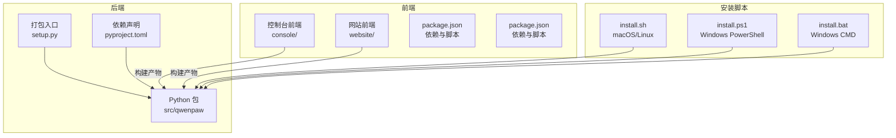
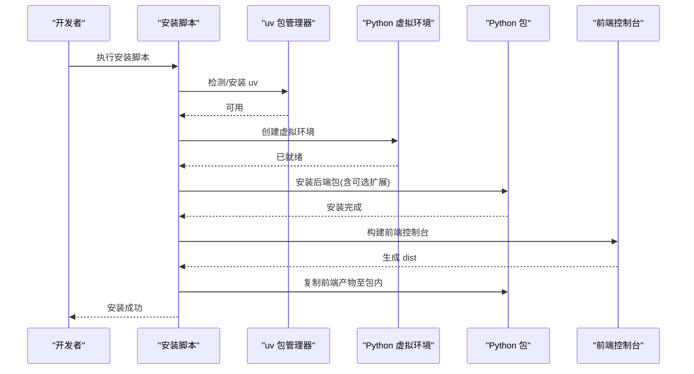
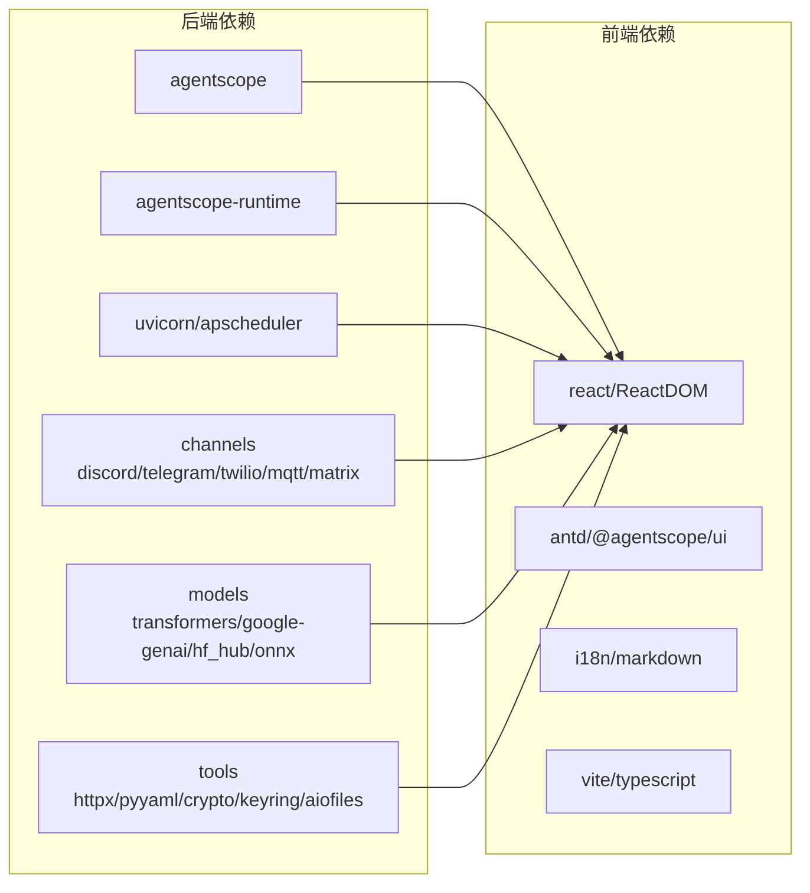

# 开发环境搭建

<cite>
**本文档引用的文件**
- [pyproject.toml](file://pyproject.toml)
- [README.md](file://README.md)
- [scripts/README.md](file://scripts/README.md)
- [scripts/install.sh](file://scripts/install.sh)
- [scripts/install.ps1](file://scripts/install.ps1)
- [scripts/install.bat](file://scripts/install.bat)
- [console/package.json](file://console/package.json)
- [console/eslint.config.js](file://console/eslint.config.js)
- [console/tsconfig.json](file://console/tsconfig.json)
- [console/tsconfig.app.json](file://console/tsconfig.app.json)
- [console/vite.config.ts](file://console/vite.config.ts)
- [website/package.json](file://website/package.json)
- [setup.py](file://setup.py)
</cite>

## 目录
1. [简介](#简介)
2. [项目结构](#项目结构)
3. [核心组件](#核心组件)
4. [架构总览](#架构总览)
5. [详细组件分析](#详细组件分析)
6. [依赖分析](#依赖分析)
7. [性能考虑](#性能考虑)
8. [故障排除指南](#故障排除指南)
9. [结论](#结论)
10. [附录](#附录)

## 简介
本指南面向希望在本地进行 QwenPaw 开发的工程师与贡献者，覆盖 Python 后端环境、Node.js 前端环境以及跨平台安装脚本的完整搭建流程。内容包括：
- Python 版本与依赖要求
- 虚拟环境创建与管理
- 前端依赖安装与构建
- 不同操作系统的安装步骤
- IDE 配置建议与调试环境设置
- 环境变量与依赖版本兼容性
- 常见问题排查与解决方案

## 项目结构
QwenPaw 采用前后端分离的多模块组织方式：
- 后端 Python 包位于 src/qwenpaw，通过 setuptools 动态打包
- 前端控制台位于 console，使用 Vite + React + TypeScript
- 网站文档位于 website，使用 Vite + React
- 安装脚本位于 scripts，支持 macOS/Linux 和 Windows 多平台

图表来源
- [pyproject.toml](file://pyproject.toml)
- [setup.py](file://setup.py)
- [console/package.json](file://console/package.json)
- [website/package.json](file://website/package.json)
- [scripts/install.sh](file://scripts/install.sh)
- [scripts/install.ps1](file://scripts/install.ps1)
- [scripts/install.bat](file://scripts/install.bat)

章节来源
- [pyproject.toml](file://pyproject.toml)
- [setup.py](file://setup.py)
- [README.md](file://README.md)

## 核心组件
- Python 后端
  - 支持 Python 3.10 至 3.14（含）
  - 使用 setuptools 动态打包，包含可选扩展（dev、local、llamacpp、mlx、ollama、whisper、full）
- 前端控制台
  - React + TypeScript + Vite
  - ESLint + Prettier + TS 类型检查
  - 构建输出直接嵌入到 Python 包中
- 安装脚本
  - 自动检测并安装 uv（Python 包管理器）
  - 创建隔离虚拟环境并安装后端包及可选扩展
  - 在 macOS/Linux 上自动处理 PATH；在 Windows 上支持 PowerShell/CMD

章节来源
- [pyproject.toml](file://pyproject.toml)
- [console/package.json](file://console/package.json)
- [console/eslint.config.js](file://console/eslint.config.js)
- [console/tsconfig.json](file://console/tsconfig.json)
- [console/tsconfig.app.json](file://console/tsconfig.app.json)
- [console/vite.config.ts](file://console/vite.config.ts)
- [scripts/install.sh](file://scripts/install.sh)
- [scripts/install.ps1](file://scripts/install.ps1)
- [scripts/install.bat](file://scripts/install.bat)

## 架构总览
下图展示了开发环境搭建的关键流程：安装脚本选择 uv → 创建 Python 虚拟环境 → 安装后端包与可选扩展 → 构建前端控制台 → 将构建产物复制到 Python 包目录 → 完成安装。

图表来源
- [scripts/install.sh](file://scripts/install.sh)
- [scripts/install.ps1](file://scripts/install.ps1)
- [scripts/install.bat](file://scripts/install.bat)
- [console/vite.config.ts](file://console/vite.config.ts)

## 详细组件分析

### Python 环境与依赖
- 版本要求
  - requires-python: >=3.10,<3.14
- 关键依赖
  - Web 服务器与调度：uvicorn、apscheduler
  - 多协议通道：discord-py、python-telegram-bot、twilio、paho-mqtt、matrix-nio 等
  - 多模态与模型：transformers、onnxruntime、google-genai、huggingface_hub、pillow
  - 工具与实用：httpx、questionary、mss、pyyaml、cryptography、keyring、aiofiles 等
- 可选扩展
  - dev：pytest、pytest-asyncio、pre-commit、pytest-cov、hypothesis
  - local：huggingface_hub
  - llamacpp：llama-cpp-python
  - mlx：mlx-lm（仅 macOS）
  - ollama：ollama
  - whisper：openai-whisper
  - full：组合上述所有可选扩展

章节来源
- [pyproject.toml](file://pyproject.toml)

### 前端控制台（React/Vite）
- 技术栈
  - React 18、TypeScript、Vite、Ant Design + 自定义设计系统
  - ESLint + Prettier + TS 类型严格模式
- 构建与开发
  - 开发服务器：Vite，端口 5173，允许外网访问
  - 构建输出：直接写入 Python 包的 console 目录，便于打包
  - 代码规范：ESLint 规则 + React Hooks 约束
- TypeScript 配置
  - 应用配置：tsconfig.app.json，严格模式与路径别名
  - 顶层引用：tsconfig.json 组织多个 tsconfig

章节来源
- [console/package.json](file://console/package.json)
- [console/eslint.config.js](file://console/eslint.config.js)
- [console/tsconfig.json](file://console/tsconfig.json)
- [console/tsconfig.app.json](file://console/tsconfig.app.json)
- [console/vite.config.ts](file://console/vite.config.ts)

### 网站前端（文档站点）
- 技术栈
  - Vite + React + TailwindCSS + Mermaid
- 构建流程
  - 依赖安装（pnpm/npm）→ TypeScript 编译 → Vite 构建 → 生成静态站点

章节来源
- [website/package.json](file://website/package.json)

### 安装脚本（多平台）
- macOS/Linux（install.sh）
  - 自动检测网络选择 PyPI 镜像（阿里云镜像或官方源）
  - 自动安装/更新 uv，创建 Python 3.12 虚拟环境
  - 可选 extras 参数安装 llamacpp、mlx、ollama、whisper 等
  - 自动更新 shell 配置文件（zsh/bash）中的 PATH
- Windows（install.ps1 / install.bat）
  - 支持 PowerShell 与 CMD 两种方式
  - 自动下载/安装 uv（优先 astral.sh，不可达时回退 GitHub Releases）
  - 自动更新用户级 PATH（注册表）
  - 支持从源码或 PyPI 安装，支持 extras 参数
- 安装后行为
  - 创建 qwenpaw 命令包装器
  - 输出安装摘要与首次运行指引

章节来源
- [scripts/install.sh](file://scripts/install.sh)
- [scripts/install.ps1](file://scripts/install.ps1)
- [scripts/install.bat](file://scripts/install.bat)

### 测试与构建脚本
- wheel 构建：先构建前端控制台，再复制到 Python 包目录，最后打包 wheel
- 网站构建：安装依赖后构建网站
- Docker 构建：基于 deploy/Dockerfile 的多阶段构建
- 测试运行：支持单元/集成测试、覆盖率、并行执行等

章节来源
- [scripts/README.md](file://scripts/README.md)

## 依赖分析
- 后端依赖关系
  - 核心：agentscope、agentscope-runtime（用于智能体运行时）
  - 通信：discord-py、python-telegram-bot、twilio、paho-mqtt、matrix-nio
  - 模型：transformers、google-genai、huggingface_hub、onnxruntime
  - 工具：httpx、questionary、mss、pyyaml、cryptography、keyring、aiofiles
- 前端依赖关系
  - UI：antd、@agentscope-ai/design、@ant-design/icons
  - 渲染：react、react-dom、react-i18next、react-markdown、remark-gfm
  - 状态：zustand、ahooks
  - 构建：@vitejs/plugin-react、typescript、vite
- 可选扩展
  - llamacpp：本地 llama.cpp 推理
  - mlx：macOS 平台本地推理
  - ollama：本地模型服务
  - whisper：语音识别
  - full：组合上述扩展

图表来源
- [pyproject.toml](file://pyproject.toml)
- [console/package.json](file://console/package.json)

章节来源
- [pyproject.toml](file://pyproject.toml)
- [console/package.json](file://console/package.json)

## 性能考虑
- 前端构建优化
  - Vite 预优化：预构建依赖（如 diff）
  - 代码分割：按功能拆分 vendor chunk（react、ui、i18n、markdown、dnd、utils）
  - Source Map：非生产环境启用，便于调试
- 后端性能
  - uv 作为包管理器与虚拟环境管理器，提升安装与启动效率
  - 严格版本范围控制（如 anyio），避免已知性能回归
- 资源占用
  - 本地模型（llama.cpp/ollama/mlx）需根据硬件配置选择合适模型与量化位数

[本节为通用指导，无需特定文件引用]

## 故障排除指南
- 安装脚本无法找到 uv
  - macOS/Linux：确认 install.sh 是否正确下载/安装 uv，并检查 PATH 是否包含 uv 目录
  - Windows：PowerShell/CMD 脚本会尝试 astral.sh 或 GitHub Releases 下载 uv，若失败请手动安装并加入 PATH
- Windows 环境变量未更新
  - PowerShell/CMD 脚本会尝试通过注册表更新用户 PATH；若受限于企业策略，需手动添加 %USERPROFILE%\.qwenpaw\bin 到 PATH
- 前端构建失败
  - 确认 Node.js 与 npm 可用；控制台前端需要 npm ci && npm run build
  - 若未生成 console/dist/index.html，安装脚本会提示“Web UI 不可用”
- Python 版本不匹配
  - 安装脚本默认创建 Python 3.12 虚拟环境；若系统已有 Python 3.10–3.13，可按需调整
- 端口冲突
  - 前端开发服务器默认 5173；后端控制台默认 8088；如冲突请修改对应配置

章节来源
- [scripts/install.sh](file://scripts/install.sh)
- [scripts/install.ps1](file://scripts/install.ps1)
- [scripts/install.bat](file://scripts/install.bat)
- [console/vite.config.ts](file://console/vite.config.ts)

## 结论
通过安装脚本与标准的开发工具链，开发者可在 macOS/Linux/Windows 上快速搭建 QwenPaw 的开发环境。建议遵循以下最佳实践：
- 使用安装脚本自动创建隔离的 Python 3.12 虚拟环境
- 先构建前端控制台，再安装后端包，确保 Web UI 可用
- 针对本地模型场景，按需启用 llamacpp/ollama/mlx 等可选扩展
- 在受限网络环境下优先使用 PyPI 镜像或离线安装

[本节为总结，无需特定文件引用]

## 附录

### 不同操作系统安装步骤

- macOS/Linux
  - 使用 install.sh，自动检测网络选择镜像，安装 uv 并创建虚拟环境
  - 可选 extras：--extras "ollama,llamacpp,mlx,whisper"
  - 安装完成后，打开新终端并执行 qwenpaw init 与 qwenpaw app
- Windows（PowerShell）
  - 使用 install.ps1，自动下载/安装 uv，更新用户 PATH
  - 支持 -FromSource/-SourceDir/-Extras/-UvPath 等参数
- Windows（CMD）
  - 使用 install.bat，逻辑与 PowerShell 版本一致，适用于受限环境

章节来源
- [scripts/install.sh](file://scripts/install.sh)
- [scripts/install.ps1](file://scripts/install.ps1)
- [scripts/install.bat](file://scripts/install.bat)
- [README.md](file://README.md)

### 开发工具与 IDE 配置建议
- Python
  - 使用 VS Code 或 PyCharm，启用 Python 解释器为虚拟环境中的 Python
  - 安装 Python 扩展，启用 lint（flake8）、格式化（black/isort）、类型检查（mypy）
- 前端控制台
  - VS Code + ES7+ React/Redux/React Router Snippets、TypeScript TSServer
  - ESLint/Prettier 扩展，保持与项目规则一致
- 构建与测试
  - 使用 scripts/README.md 中的脚本进行 wheel 构建、网站构建与测试运行

章节来源
- [console/eslint.config.js](file://console/eslint.config.js)
- [console/tsconfig.app.json](file://console/tsconfig.app.json)
- [scripts/README.md](file://scripts/README.md)

### 环境变量与版本兼容性
- Python 版本：3.10 ≤ 版本 < 3.14
- uv：安装脚本自动管理，确保最新稳定版
- Node.js：前端构建所需，建议使用 LTS 版本
- 可选扩展与平台
  - mlx：仅 macOS
  - llamacpp/ollama/whisper：跨平台，按需启用
- 依赖版本约束
  - anyio 明确限制上限，避免已知性能问题
  - onnxruntime 限制上限，避免不兼容

章节来源
- [pyproject.toml](file://pyproject.toml)
- [scripts/install.sh](file://scripts/install.sh)
- [scripts/install.ps1](file://scripts/install.ps1)
- [scripts/install.bat](file://scripts/install.bat)