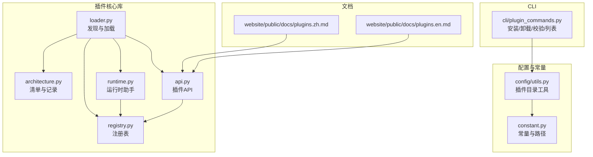
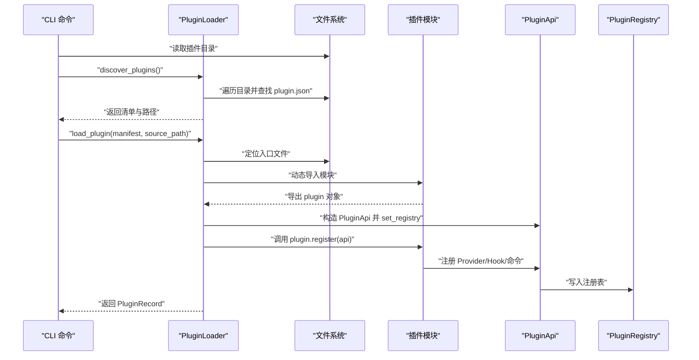
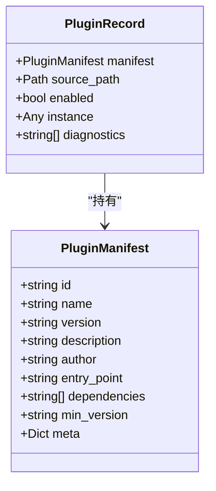
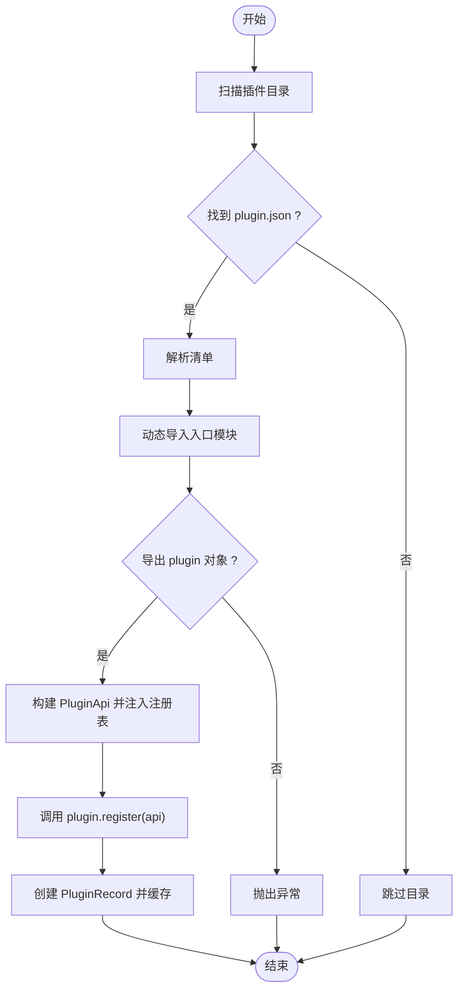
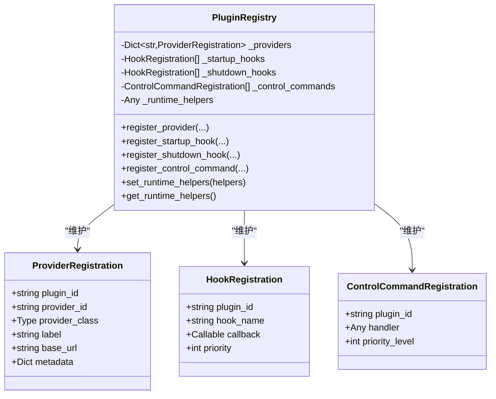
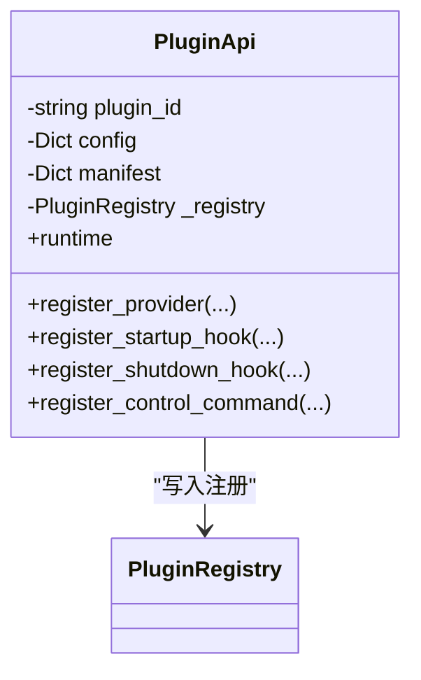
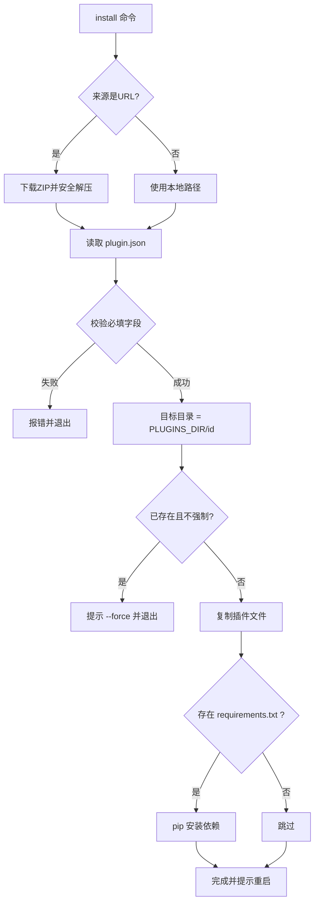
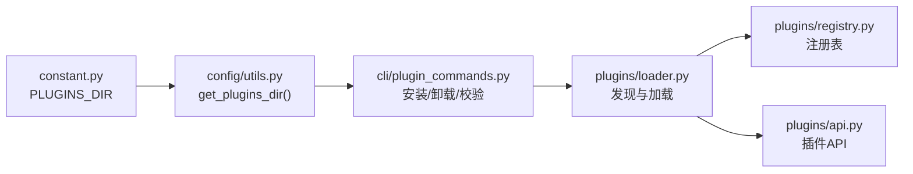

# 插件开发

<cite>
**本文引用的文件**
- [src/qwenpaw/plugins/__init__.py](file://src/qwenpaw/plugins/__init__.py)
- [src/qwenpaw/plugins/architecture.py](file://src/qwenpaw/plugins/architecture.py)
- [src/qwenpaw/plugins/loader.py](file://src/qwenpaw/plugins/loader.py)
- [src/qwenpaw/plugins/registry.py](file://src/qwenpaw/plugins/registry.py)
- [src/qwenpaw/plugins/runtime.py](file://src/qwenpaw/plugins/runtime.py)
- [src/qwenpaw/plugins/api.py](file://src/qwenpaw/plugins/api.py)
- [src/qwenpaw/cli/plugin_commands.py](file://src/qwenpaw/cli/plugin_commands.py)
- [src/qwenpaw/config/utils.py](file://src/qwenpaw/config/utils.py)
- [src/qwenpaw/constant.py](file://src/qwenpaw/constant.py)
- [website/public/docs/plugins.zh.md](file://website/public/docs/plugins.zh.md)
- [website/public/docs/plugins.en.md](file://website/public/docs/plugins.en.md)
</cite>

## 目录
1. [简介](#简介)
2. [项目结构](#项目结构)
3. [核心组件](#核心组件)
4. [架构总览](#架构总览)
5. [详细组件分析](#详细组件分析)
6. [依赖分析](#依赖分析)
7. [性能考量](#性能考量)
8. [故障排查指南](#故障排查指南)
9. [结论](#结论)
10. [附录](#附录)

## 简介
本指南面向希望为 QwenPaw 开发插件的开发者，系统讲解插件架构、插件类型与扩展机制，覆盖接口定义、生命周期管理、注册流程、开发模板、配置与依赖声明、加载与热重载、错误处理、调试与性能监控、安全注意事项，以及内置与第三方插件集成、插件市场发布与版本管理策略。

## 项目结构
QwenPaw 的插件系统由“插件核心库 + CLI 管理 + 配置常量 + 文档示例”构成：
- 插件核心库：定义清单、加载器、注册表、运行时助手与插件 API
- CLI：提供安装、列出、查询、卸载、校验等插件管理命令
- 配置与常量：定义插件目录位置与工作区路径
- 文档：提供中文与英文的插件开发与使用说明

**图表来源**
- [src/qwenpaw/plugins/architecture.py:9-55](file://src/qwenpaw/plugins/architecture.py#L9-L55)
- [src/qwenpaw/plugins/loader.py:19-241](file://src/qwenpaw/plugins/loader.py#L19-L241)
- [src/qwenpaw/plugins/registry.py:42-254](file://src/qwenpaw/plugins/registry.py#L42-L254)
- [src/qwenpaw/plugins/runtime.py:10-68](file://src/qwenpaw/plugins/runtime.py#L10-L68)
- [src/qwenpaw/plugins/api.py:10-186](file://src/qwenpaw/plugins/api.py#L10-L186)
- [src/qwenpaw/cli/plugin_commands.py:1-411](file://src/qwenpaw/cli/plugin_commands.py#L1-L411)
- [src/qwenpaw/config/utils.py:637-645](file://src/qwenpaw/config/utils.py#L637-L645)
- [src/qwenpaw/constant.py:190-191](file://src/qwenpaw/constant.py#L190-L191)
- [website/public/docs/plugins.zh.md:1-813](file://website/public/docs/plugins.zh.md#L1-L813)
- [website/public/docs/plugins.en.md:1-813](file://website/public/docs/plugins.en.md#L1-L813)

**章节来源**
- [src/qwenpaw/plugins/__init__.py:1-16](file://src/qwenpaw/plugins/__init__.py#L1-L16)
- [src/qwenpaw/plugins/architecture.py:9-55](file://src/qwenpaw/plugins/architecture.py#L9-L55)
- [src/qwenpaw/plugins/loader.py:19-241](file://src/qwenpaw/plugins/loader.py#L19-L241)
- [src/qwenpaw/plugins/registry.py:42-254](file://src/qwenpaw/plugins/registry.py#L42-L254)
- [src/qwenpaw/plugins/runtime.py:10-68](file://src/qwenpaw/plugins/runtime.py#L10-L68)
- [src/qwenpaw/plugins/api.py:10-186](file://src/qwenpaw/plugins/api.py#L10-L186)
- [src/qwenpaw/cli/plugin_commands.py:1-411](file://src/qwenpaw/cli/plugin_commands.py#L1-L411)
- [src/qwenpaw/config/utils.py:637-645](file://src/qwenpaw/config/utils.py#L637-L645)
- [src/qwenpaw/constant.py:190-191](file://src/qwenpaw/constant.py#L190-L191)
- [website/public/docs/plugins.zh.md:1-813](file://website/public/docs/plugins.zh.md#L1-L813)
- [website/public/docs/plugins.en.md:1-813](file://website/public/docs/plugins.en.md#L1-L813)

## 核心组件
- 插件清单与记录：描述插件元数据、来源路径、启用状态与诊断信息
- 插件加载器：扫描目录、解析清单、动态导入入口模块、调用注册方法
- 插件注册表：集中管理 Provider、启动/关闭 Hook、控制命令，支持优先级排序
- 插件 API：插件注册能力的对外接口（Provider、Hook、控制命令）
- 运行时助手：提供 Provider 管理器访问、日志记录等运行期能力
- CLI 插件命令：安装、列出、查询、卸载、校验插件，支持从 URL 下载与依赖安装

**章节来源**
- [src/qwenpaw/plugins/architecture.py:9-55](file://src/qwenpaw/plugins/architecture.py#L9-L55)
- [src/qwenpaw/plugins/loader.py:19-241](file://src/qwenpaw/plugins/loader.py#L19-L241)
- [src/qwenpaw/plugins/registry.py:42-254](file://src/qwenpaw/plugins/registry.py#L42-L254)
- [src/qwenpaw/plugins/api.py:10-186](file://src/qwenpaw/plugins/api.py#L10-L186)
- [src/qwenpaw/plugins/runtime.py:10-68](file://src/qwenpaw/plugins/runtime.py#L10-L68)
- [src/qwenpaw/cli/plugin_commands.py:1-411](file://src/qwenpaw/cli/plugin_commands.py#L1-L411)

## 架构总览
下图展示了插件从发现到注册、再到运行期调用的整体流程。

**图表来源**
- [src/qwenpaw/plugins/loader.py:32-221](file://src/qwenpaw/plugins/loader.py#L32-L221)
- [src/qwenpaw/plugins/api.py:35-175](file://src/qwenpaw/plugins/api.py#L35-L175)
- [src/qwenpaw/plugins/registry.py:73-253](file://src/qwenpaw/plugins/registry.py#L73-L253)
- [src/qwenpaw/cli/plugin_commands.py:118-247](file://src/qwenpaw/cli/plugin_commands.py#L118-L247)

## 详细组件分析

### 插件清单与记录
- 清单字段：id、name、version、description、author、entry_point、dependencies、min_version、meta
- 记录字段：manifest、source_path、enabled、instance、diagnostics
- 用途：作为插件元数据与运行期状态载体

**图表来源**
- [src/qwenpaw/plugins/architecture.py:9-55](file://src/qwenpaw/plugins/architecture.py#L9-L55)

**章节来源**
- [src/qwenpaw/plugins/architecture.py:9-55](file://src/qwenpaw/plugins/architecture.py#L9-L55)

### 插件加载器
- 发现：扫描插件目录，定位 plugin.json
- 解析：从 JSON 构造清单对象
- 动态导入：基于入口文件生成唯一模块名，设置 __package__/__path__ 支持相对导入
- 注册：调用 plugin.register(api)，支持同步/异步
- 结果：生成 PluginRecord 并缓存

**图表来源**
- [src/qwenpaw/plugins/loader.py:32-197](file://src/qwenpaw/plugins/loader.py#L32-L197)

**章节来源**
- [src/qwenpaw/plugins/loader.py:19-241](file://src/qwenpaw/plugins/loader.py#L19-L241)

### 插件注册表
- Provider 注册：避免重复注册，记录插件 ID、类、标签、基础 URL、元数据
- Hook 注册：支持启动/关闭钩子，按优先级排序
- 控制命令注册：记录处理器与优先级
- 运行时助手：提供 Provider 管理器访问与日志能力

**图表来源**
- [src/qwenpaw/plugins/registry.py:42-254](file://src/qwenpaw/plugins/registry.py#L42-L254)

**章节来源**
- [src/qwenpaw/plugins/registry.py:42-254](file://src/qwenpaw/plugins/registry.py#L42-L254)

### 插件 API
- 注册 Provider：合并清单 meta 与传入元数据
- 注册 Hook：支持启动/关闭，指定优先级
- 注册控制命令：绑定处理器与优先级
- 运行时访问：通过 registry 获取运行时助手

**图表来源**
- [src/qwenpaw/plugins/api.py:10-186](file://src/qwenpaw/plugins/api.py#L10-L186)

**章节来源**
- [src/qwenpaw/plugins/api.py:10-186](file://src/qwenpaw/plugins/api.py#L10-L186)

### 运行时助手
- 提供 Provider 管理器访问、列出可用 Provider、统一日志接口

**章节来源**
- [src/qwenpaw/plugins/runtime.py:10-68](file://src/qwenpaw/plugins/runtime.py#L10-L68)

### CLI 插件命令
- 安装：支持本地路径与 URL；下载 ZIP、安全解压、复制文件、安装依赖、提示重启
- 列表：枚举插件目录下的清单
- 查询：打印清单与元信息
- 卸载：删除目录并提示重启
- 校验：验证清单字段与入口文件存在性

**图表来源**
- [src/qwenpaw/cli/plugin_commands.py:118-247](file://src/qwenpaw/cli/plugin_commands.py#L118-L247)

**章节来源**
- [src/qwenpaw/cli/plugin_commands.py:1-411](file://src/qwenpaw/cli/plugin_commands.py#L1-L411)

## 依赖分析
- 插件目录：由常量与配置工具共同决定，默认位于工作区根目录的 plugins 子目录
- CLI 与配置：CLI 命令通过配置工具获取插件目录，再进行安装/卸载/校验
- 加载器与注册表：加载器负责发现与导入，注册表集中管理能力注册

**图表来源**
- [src/qwenpaw/constant.py:190-191](file://src/qwenpaw/constant.py#L190-L191)
- [src/qwenpaw/config/utils.py:637-645](file://src/qwenpaw/config/utils.py#L637-L645)
- [src/qwenpaw/cli/plugin_commands.py:118-247](file://src/qwenpaw/cli/plugin_commands.py#L118-L247)
- [src/qwenpaw/plugins/loader.py:32-221](file://src/qwenpaw/plugins/loader.py#L32-L221)
- [src/qwenpaw/plugins/registry.py:42-254](file://src/qwenpaw/plugins/registry.py#L42-L254)
- [src/qwenpaw/plugins/api.py:35-175](file://src/qwenpaw/plugins/api.py#L35-L175)

**章节来源**
- [src/qwenpaw/constant.py:190-191](file://src/qwenpaw/constant.py#L190-L191)
- [src/qwenpaw/config/utils.py:637-645](file://src/qwenpaw/config/utils.py#L637-L645)
- [src/qwenpaw/cli/plugin_commands.py:1-411](file://src/qwenpaw/cli/plugin_commands.py#L1-L411)
- [src/qwenpaw/plugins/loader.py:19-241](file://src/qwenpaw/plugins/loader.py#L19-L241)
- [src/qwenpaw/plugins/registry.py:42-254](file://src/qwenpaw/plugins/registry.py#L42-L254)
- [src/qwenpaw/plugins/api.py:10-186](file://src/qwenpaw/plugins/api.py#L10-L186)

## 性能考量
- 插件加载：动态导入与模块缓存，避免重复加载；建议在注册阶段做轻量初始化
- Hook 优先级：合理设置优先级，避免长耗时阻塞启动/关闭
- 日志：使用运行时助手统一日志，减少 IO 抖动
- 依赖安装：在 CLI 安装阶段一次性完成，避免运行期首次导入导致的冷启动开销

[本节为通用指导，无需具体文件分析]

## 故障排查指南
- 插件未加载
  - 检查插件目录与清单字段完整性
  - 查看应用日志中插件加载与注册信息
- 依赖安装失败
  - 检查 requirements.txt 格式与来源
  - 手动安装验证
- Provider 未显示
  - 确认插件已安装并重启
  - 检查注册表中 Provider 是否存在
- 命令未响应
  - 确认启动 Hook 成功执行
  - 检查日志中的 monkey patch 信息

**章节来源**
- [website/public/docs/plugins.zh.md:655-696](file://website/public/docs/plugins.zh.md#L655-L696)
- [website/public/docs/plugins.en.md:655-696](file://website/public/docs/plugins.en.md#L655-L696)

## 结论
QwenPaw 的插件系统通过清晰的清单、可靠的加载器、集中的注册表与易用的 API，为扩展 Provider、生命周期 Hook 与控制命令提供了稳定框架。配合 CLI 的安装/卸载/校验工具与完善的文档示例，开发者可快速构建高质量插件，并在生产环境中安全、可控地演进。

[本节为总结，无需具体文件分析]

## 附录

### 插件类型与扩展机制
- Provider 插件：注册自定义 LLM Provider，支持新模型服务
- Hook 插件：在启动/关闭阶段执行自定义逻辑
- 命令插件：通过 Hook 与 monkey patch 注册魔法命令

**章节来源**
- [website/public/docs/plugins.zh.md:67-132](file://website/public/docs/plugins.zh.md#L67-L132)
- [website/public/docs/plugins.en.md:67-132](file://website/public/docs/plugins.en.md#L67-L132)

### 插件接口定义与生命周期
- 插件必须导出 plugin 对象，且实现 register(api) 方法
- 通过 PluginApi 注册 Provider、Hook、控制命令
- 生命周期：启动 Hook → 正常运行 → 关闭 Hook

**章节来源**
- [src/qwenpaw/plugins/api.py:43-175](file://src/qwenpaw/plugins/api.py#L43-L175)
- [src/qwenpaw/plugins/loader.py:168-177](file://src/qwenpaw/plugins/loader.py#L168-L177)

### 插件开发模板与配置
- 必需文件：plugin.json、plugin.py（或自定义入口）
- 清单字段：id、name、version、entry_point、dependencies、min_version、meta
- 入口模块：导出 plugin 实例，实现 register(api)

**章节来源**
- [website/public/docs/plugins.zh.md:133-196](file://website/public/docs/plugins.zh.md#L133-L196)
- [website/public/docs/plugins.en.md:133-196](file://website/public/docs/plugins.en.md#L133-L196)

### 插件加载机制与热重载
- 加载机制：CLI 安装时复制文件并安装依赖；应用启动时加载插件目录
- 热重载：当前实现要求离线操作（安装/卸载/更新），不支持运行时热重载

**章节来源**
- [src/qwenpaw/cli/plugin_commands.py:31-35](file://src/qwenpaw/cli/plugin_commands.py#L31-L35)
- [src/qwenpaw/plugins/loader.py:199-221](file://src/qwenpaw/plugins/loader.py#L199-L221)

### 错误处理与调试
- 加载失败：捕获异常并记录详细日志
- Hook 错误：建议在回调中捕获异常并记录，避免阻塞启动
- 调试：使用运行时助手日志接口，结合应用日志定位问题

**章节来源**
- [src/qwenpaw/plugins/loader.py:192-198](file://src/qwenpaw/plugins/loader.py#L192-L198)
- [src/qwenpaw/plugins/runtime.py:44-60](file://src/qwenpaw/plugins/runtime.py#L44-L60)
- [website/public/docs/plugins.zh.md:593-620](file://website/public/docs/plugins.zh.md#L593-L620)
- [website/public/docs/plugins.en.md:593-620](file://website/public/docs/plugins.en.md#L593-L620)

### 性能监控与安全考虑
- 性能监控：在 Hook 中记录关键阶段耗时，避免阻塞主线程
- 安全：仅安装可信插件，审查源码与依赖，离线操作

**章节来源**
- [website/public/docs/plugins.zh.md:697-703](file://website/public/docs/plugins.zh.md#L697-L703)
- [website/public/docs/plugins.en.md:697-703](file://website/public/docs/plugins.en.md#L697-L703)

### 内置插件示例与第三方集成
- 示例：Provider 插件、启动 Hook 插件、命令插件（/status）
- 第三方：通过 requirements.txt 引入，遵循依赖管理最佳实践

**章节来源**
- [website/public/docs/plugins.zh.md:197-564](file://website/public/docs/plugins.zh.md#L197-L564)
- [website/public/docs/plugins.en.md:197-564](file://website/public/docs/plugins.en.md#L197-L564)

### 插件市场发布与版本管理
- 打包：将插件目录压缩为 ZIP，支持 URL 安装
- 版本：遵循语义化版本，清单中声明 min_version
- 兼容性：通过 min_version 与依赖约束保障兼容
- 升级策略：建议先卸载旧版本再安装新版本，必要时备份配置

**章节来源**
- [website/public/docs/plugins.zh.md:781-813](file://website/public/docs/plugins.zh.md#L781-L813)
- [website/public/docs/plugins.en.md:781-813](file://website/public/docs/plugins.en.md#L781-L813)