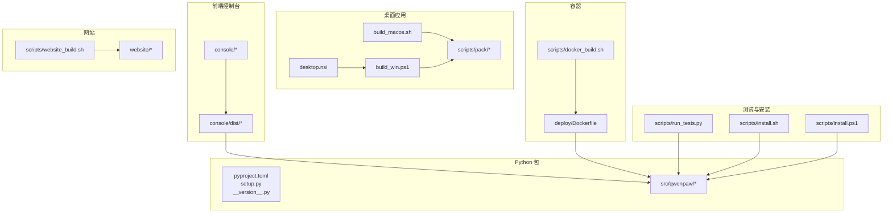
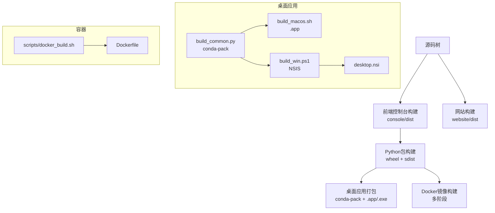
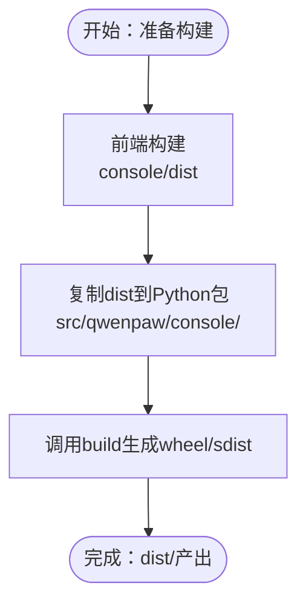
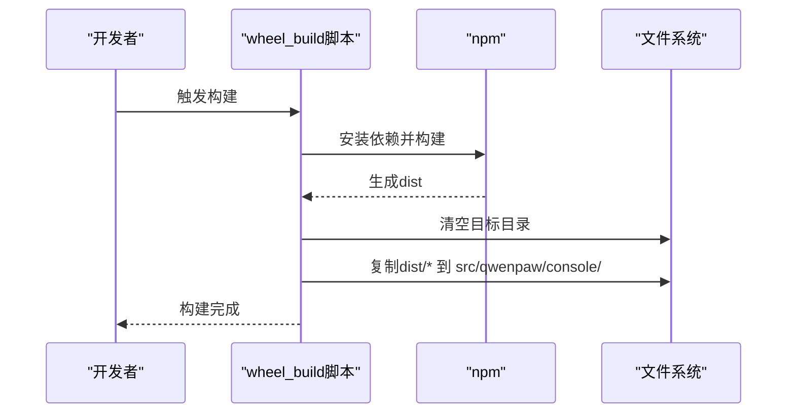
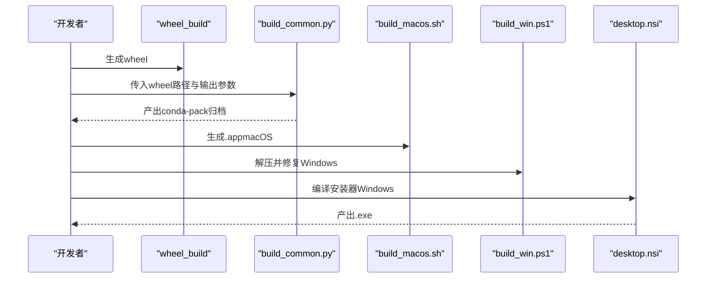
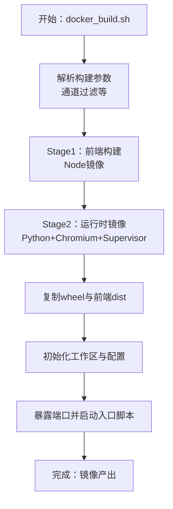
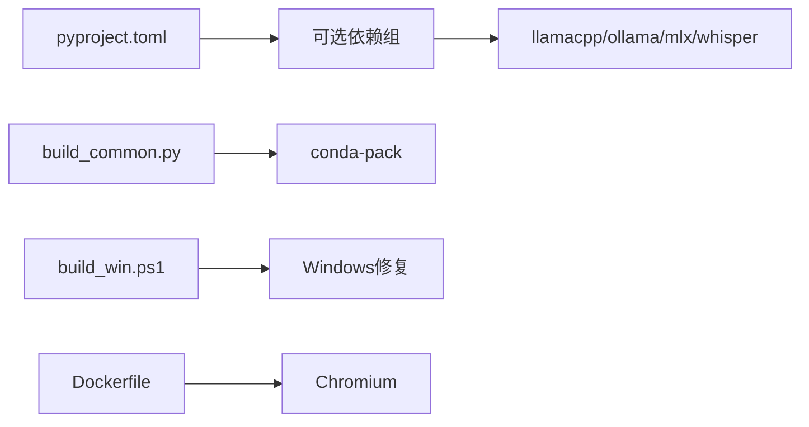

# 构建与发布

<cite>
**本文引用的文件**
- [pyproject.toml](file://pyproject.toml)
- [setup.py](file://setup.py)
- [Dockerfile](file://deploy/Dockerfile)
- [docker_build.sh](file://scripts/docker_build.sh)
- [wheel_build.sh](file://scripts/wheel_build.sh)
- [wheel_build.ps1](file://scripts/wheel_build.ps1)
- [build_common.py](file://scripts/pack/build_common.py)
- [build_macos.sh](file://scripts/pack/build_macos.sh)
- [build_win.ps1](file://scripts/pack/build_win.ps1)
- [desktop.nsi](file://scripts/pack/desktop.nsi)
- [website_build.sh](file://scripts/website_build.sh)
- [__version__.py](file://src/qwenpaw/__version__.py)
- [run_tests.py](file://scripts/run_tests.py)
- [install.sh](file://scripts/install.sh)
- [install.ps1](file://scripts/install.ps1)
</cite>

## 目录
1. [简介](#简介)
2. [项目结构](#项目结构)
3. [核心组件](#核心组件)
4. [架构总览](#架构总览)
5. [详细组件分析](#详细组件分析)
6. [依赖分析](#依赖分析)
7. [性能考虑](#性能考虑)
8. [故障排查指南](#故障排查指南)
9. [结论](#结论)
10. [附录](#附录)

## 简介
本指南面向QwenPaw的构建与发布流程，覆盖以下方面：
- Python包构建与打包：wheel与sdist生成、包含前端资源的打包策略
- 前端打包：控制台前端构建与注入到Python包
- 桌面应用制作：基于conda-pack的跨平台打包与安装器
- Docker镜像构建：多阶段构建、运行时环境与容器入口
- 多平台打包：Windows（NSIS）与macOS（.app）产物
- 版本管理：版本号来源与变更日志
- 发布流程：本地构建、质量门禁、发布与分发
- 自动化与CI/CD：脚本化与可扩展的构建管线
- 回滚机制与发布前检查：安装器与测试脚本的验证作用

## 项目结构
QwenPaw采用“Python后端 + 前端控制台 + 可选桌面应用”的多组件结构。关键构建相关位置如下：
- Python包与元数据：pyproject.toml、setup.py、src/qwenpaw/__version__.py
- 前端控制台：console/（构建产物注入到Python包）
- 桌面应用：scripts/pack/（跨平台打包与安装器）
- Docker镜像：deploy/Dockerfile、scripts/docker_build.sh
- 网站构建：website/（文档网站）
- 测试与质量：scripts/run_tests.py
- 安装器：scripts/install.sh（Linux/macOS）、scripts/install.ps1（Windows）

图表来源
- [pyproject.toml:1-111](file://pyproject.toml#L1-L111)
- [setup.py:1-5](file://setup.py#L1-L5)
- [__version__.py:1-3](file://src/qwenpaw/__version__.py#L1-L3)
- [build_macos.sh:1-184](file://scripts/pack/build_macos.sh#L1-L184)
- [build_win.ps1:1-325](file://scripts/pack/build_win.ps1#L1-L325)
- [desktop.nsi:1-57](file://scripts/pack/desktop.nsi#L1-L57)
- [Dockerfile:1-103](file://deploy/Dockerfile#L1-L103)
- [docker_build.sh:1-32](file://scripts/docker_build.sh#L1-L32)
- [website_build.sh:1-28](file://scripts/website_build.sh#L1-L28)
- [run_tests.py:1-282](file://scripts/run_tests.py#L1-L282)
- [install.sh:1-340](file://scripts/install.sh#L1-L340)
- [install.ps1:1-477](file://scripts/install.ps1#L1-L477)

章节来源
- [pyproject.toml:1-111](file://pyproject.toml#L1-L111)
- [setup.py:1-5](file://setup.py#L1-L5)
- [Dockerfile:1-103](file://deploy/Dockerfile#L1-L103)
- [scripts/docker_build.sh:1-32](file://scripts/docker_build.sh#L1-L32)
- [scripts/wheel_build.sh:1-28](file://scripts/wheel_build.sh#L1-L28)
- [scripts/wheel_build.ps1:1-41](file://scripts/wheel_build.ps1#L1-L41)
- [scripts/pack/build_common.py:1-321](file://scripts/pack/build_common.py#L1-L321)
- [scripts/pack/build_macos.sh:1-184](file://scripts/pack/build_macos.sh#L1-L184)
- [scripts/pack/build_win.ps1:1-325](file://scripts/pack/build_win.ps1#L1-L325)
- [scripts/pack/desktop.nsi:1-57](file://scripts/pack/desktop.nsi#L1-L57)
- [scripts/website_build.sh:1-28](file://scripts/website_build.sh#L1-L28)
- [src/qwenpaw/__version__.py:1-3](file://src/qwenpaw/__version__.py#L1-L3)
- [scripts/run_tests.py:1-282](file://scripts/run_tests.py#L1-L282)
- [scripts/install.sh:1-340](file://scripts/install.sh#L1-L340)
- [scripts/install.ps1:1-477](file://scripts/install.ps1#L1-L477)

## 核心组件
- Python包构建与元数据
  - 使用动态版本与setuptools构建后端，自动发现包与包含数据文件（含前端、技能、安全规则等）
  - 提供可选依赖集：dev、local、llamacpp、mlx、ollama、whisper、full
- 前端控制台打包
  - 构建脚本先执行前端构建，再将dist内容复制到Python包内，确保发布包自带Web UI
- 桌面应用制作
  - 通过conda-pack打包Python环境，再生成macOS.app或Windows安装器（NSIS）
- Docker镜像构建
  - 多阶段构建：前端构建阶段与运行时阶段；运行时包含Chromium与supervisor
- 网站构建
  - 文档网站使用Vite构建，输出静态站点
- 质量与安装
  - 测试脚本支持单元与集成测试、覆盖率与并行；安装器自动处理uv、虚拟环境与PATH

章节来源
- [pyproject.toml:1-111](file://pyproject.toml#L1-L111)
- [scripts/wheel_build.sh:1-28](file://scripts/wheel_build.sh#L1-L28)
- [scripts/wheel_build.ps1:1-41](file://scripts/wheel_build.ps1#L1-L41)
- [scripts/pack/build_common.py:1-321](file://scripts/pack/build_common.py#L1-L321)
- [scripts/pack/build_macos.sh:1-184](file://scripts/pack/build_macos.sh#L1-L184)
- [scripts/pack/build_win.ps1:1-325](file://scripts/pack/build_win.ps1#L1-L325)
- [scripts/pack/desktop.nsi:1-57](file://scripts/pack/desktop.nsi#L1-L57)
- [Dockerfile:1-103](file://deploy/Dockerfile#L1-L103)
- [scripts/website_build.sh:1-28](file://scripts/website_build.sh#L1-L28)
- [scripts/run_tests.py:1-282](file://scripts/run_tests.py#L1-L282)
- [scripts/install.sh:1-340](file://scripts/install.sh#L1-L340)
- [scripts/install.ps1:1-477](file://scripts/install.ps1#L1-L477)

## 架构总览
下图展示从源码到最终产物的关键路径：前端构建 → Python包构建 → 桌面应用打包/容器镜像构建。

图表来源
- [build_common.py:1-321](file://scripts/pack/build_common.py#L1-L321)
- [build_macos.sh:1-184](file://scripts/pack/build_macos.sh#L1-L184)
- [build_win.ps1:1-325](file://scripts/pack/build_win.ps1#L1-L325)
- [desktop.nsi:1-57](file://scripts/pack/desktop.nsi#L1-L57)
- [Dockerfile:1-103](file://deploy/Dockerfile#L1-L103)
- [docker_build.sh:1-32](file://scripts/docker_build.sh#L1-L32)

## 详细组件分析

### Python包构建与打包
- 动态版本与包发现
  - 版本由模块版本文件提供，setuptools动态读取
  - 包扫描在src目录下，include-package-data启用，package-data显式声明需包含的资源
- 打包策略
  - 使用build系统生成wheel与sdist
  - 前端dist在wheel_build脚本中复制到Python包目录，确保发布包包含Web UI
- 可选依赖
  - 通过可选组满足不同场景（本地模型、Whisper语音、Ollama等）

图表来源
- [wheel_build.sh:1-28](file://scripts/wheel_build.sh#L1-L28)
- [wheel_build.ps1:1-41](file://scripts/wheel_build.ps1#L1-L41)
- [pyproject.toml:1-111](file://pyproject.toml#L1-L111)

章节来源
- [pyproject.toml:1-111](file://pyproject.toml#L1-L111)
- [setup.py:1-5](file://setup.py#L1-L5)
- [scripts/wheel_build.sh:1-28](file://scripts/wheel_build.sh#L1-L28)
- [scripts/wheel_build.ps1:1-41](file://scripts/wheel_build.ps1#L1-L41)

### 前端打包与注入
- 构建流程
  - 在console目录执行npm安装与构建，生成dist
  - 将dist内容复制到Python包的console目录，随wheel一起发布
- 平台差异
  - Linux/macOS使用shell脚本
  - Windows使用PowerShell脚本

图表来源
- [wheel_build.sh:1-28](file://scripts/wheel_build.sh#L1-L28)
- [wheel_build.ps1:1-41](file://scripts/wheel_build.ps1#L1-L41)

章节来源
- [scripts/wheel_build.sh:1-28](file://scripts/wheel_build.sh#L1-L28)
- [scripts/wheel_build.ps1:1-41](file://scripts/wheel_build.ps1#L1-L41)

### 桌面应用制作（跨平台）
- 共同逻辑（build_common.py）
  - 创建临时conda环境，安装wheel与完整依赖
  - 使用conda-pack导出压缩包，支持指定格式（zip/tar.gz）
  - 针对Windows的conda-unpack缺陷提供补救措施（重新安装受影响包）
- macOS（build_macos.sh）
  - 生成QwenPaw.app，包含打包的Python环境与启动器
  - 启动器设置SSL证书路径、日志级别与首次初始化
- Windows（build_win.ps1 + desktop.nsi）
  - 生成Win环境压缩包，解压后执行conda-unpack并修复问题
  - 预编译Python字节码以提升启动速度
  - 使用NSIS生成安装器，包含快捷方式与卸载项

图表来源
- [build_common.py:1-321](file://scripts/pack/build_common.py#L1-L321)
- [build_macos.sh:1-184](file://scripts/pack/build_macos.sh#L1-L184)
- [build_win.ps1:1-325](file://scripts/pack/build_win.ps1#L1-L325)
- [desktop.nsi:1-57](file://scripts/pack/desktop.nsi#L1-L57)

章节来源
- [scripts/pack/build_common.py:1-321](file://scripts/pack/build_common.py#L1-L321)
- [scripts/pack/build_macos.sh:1-184](file://scripts/pack/build_macos.sh#L1-L184)
- [scripts/pack/build_win.ps1:1-325](file://scripts/pack/build_win.ps1#L1-L325)
- [scripts/pack/desktop.nsi:1-57](file://scripts/pack/desktop.nsi#L1-L57)

### Docker镜像构建
- 多阶段构建
  - 第一阶段：Node镜像构建前端dist
  - 第二阶段：基础运行时镜像，安装Python、Chromium、supervisor等
- 运行时配置
  - 环境变量（工作目录、端口、通道过滤）
  - 注入前端dist到Python包目录
  - 初始化工作区与默认配置
- 构建脚本
  - 支持通过环境变量控制通道白名单/黑名单
  - 输出可运行容器镜像

图表来源
- [docker_build.sh:1-32](file://scripts/docker_build.sh#L1-L32)
- [Dockerfile:1-103](file://deploy/Dockerfile#L1-L103)

章节来源
- [scripts/docker_build.sh:1-32](file://scripts/docker_build.sh#L1-L32)
- [deploy/Dockerfile:1-103](file://deploy/Dockerfile#L1-L103)

### 网站构建
- 使用Vite构建文档网站，支持pnpm或npm
- 输出至website/dist，可用于静态托管

章节来源
- [scripts/website_build.sh:1-28](file://scripts/website_build.sh#L1-L28)

### 版本管理与变更日志
- 版本号来源
  - Python包版本来自模块版本文件
- 变更日志
  - 网站资源包含多语言发布说明，可用于发布公告

章节来源
- [src/qwenpaw/__version__.py:1-3](file://src/qwenpaw/__version__.py#L1-L3)
- [website/public/release-notes](file://website/public/release-notes)

### 发布流程与质量门禁
- 质量门禁
  - 本地测试：run_tests.py支持单元/集成测试、覆盖率与并行
  - 安装器验证：install.sh/install.ps1自动创建uv虚拟环境并安装包，验证CLI可用
- 发布前检查清单
  - 本地测试通过
  - wheel/sdist生成并通过基本功能验证
  - 桌面应用与容器镜像可正常启动
  - 安装器在目标平台成功安装并运行

章节来源
- [scripts/run_tests.py:1-282](file://scripts/run_tests.py#L1-L282)
- [scripts/install.sh:1-340](file://scripts/install.sh#L1-L340)
- [scripts/install.ps1:1-477](file://scripts/install.ps1#L1-L477)

### 自动化构建与CI/CD建议
- 可将现有脚本作为CI步骤：
  - 前端构建与Python包构建
  - 桌面应用打包（macOS/Windows）
  - Docker镜像构建
  - 测试与安装器验证
- 建议在CI中缓存依赖（npm、pip、uv）以提升效率

（本节为通用建议，不直接分析具体文件）

## 依赖分析
- Python包依赖与可选特性
  - 通过可选组满足不同运行场景（本地模型、Ollama、Whisper等）
- 桌面应用依赖
  - conda-pack用于环境打包；Windows需修复conda-unpack缺陷
- 容器依赖
  - Node用于前端构建；运行时包含Chromium与supervisor

图表来源
- [pyproject.toml:75-103](file://pyproject.toml#L75-L103)
- [build_common.py:1-321](file://scripts/pack/build_common.py#L1-L321)
- [build_win.ps1:1-325](file://scripts/pack/build_win.ps1#L1-L325)
- [Dockerfile:29-78](file://deploy/Dockerfile#L29-L78)

章节来源
- [pyproject.toml:75-103](file://pyproject.toml#L75-L103)
- [scripts/pack/build_common.py:1-321](file://scripts/pack/build_common.py#L1-L321)
- [scripts/pack/build_win.ps1:1-325](file://scripts/pack/build_win.ps1#L1-L325)
- [deploy/Dockerfile:29-78](file://deploy/Dockerfile#L29-L78)

## 性能考虑
- 桌面应用预编译Python字节码（Windows）以减少首次启动时间
- conda-pack导出压缩包，便于快速部署
- Docker镜像使用系统Chromium并禁用下载浏览器，减少体积与启动时间

（本节为通用指导，不直接分析具体文件）

## 故障排查指南
- conda-unpack在Windows上的路径替换问题
  - build_common.py与build_win.ps1均提供补救措施：缓存并重装受影响包
- 前端构建失败
  - 确认Node.js可用；前端脚本会在缺失时跳过构建
- Docker镜像端口与通道配置
  - 通过环境变量调整端口与通道白/黑名单
- 安装器问题
  - install.sh/install.ps1会自动处理uv、虚拟环境与PATH；如失败请按提示手动添加PATH

章节来源
- [scripts/pack/build_common.py:23-32](file://scripts/pack/build_common.py#L23-L32)
- [scripts/pack/build_win.ps1:96-126](file://scripts/pack/build_win.ps1#L96-L126)
- [scripts/wheel_build.sh:12-20](file://scripts/wheel_build.sh#L12-L20)
- [scripts/wheel_build.ps1:11-29](file://scripts/wheel_build.ps1#L11-L29)
- [Dockerfile:14-25](file://deploy/Dockerfile#L14-L25)
- [scripts/install.sh:256-340](file://scripts/install.sh#L256-L340)
- [scripts/install.ps1:333-477](file://scripts/install.ps1#L333-L477)

## 结论
QwenPaw提供了完整的构建与发布工具链：从前端到Python包、从桌面应用到容器镜像，配合测试与安装器验证，形成可重复、可审计的交付流程。建议在CI中复用这些脚本，并结合可选依赖组与容器镜像实现多场景分发。

## 附录
- 发布前检查清单
  - 本地测试全部通过
  - wheel/sdist生成且包含前端资源
  - 桌面应用在目标平台可启动
  - Docker镜像可运行并暴露正确端口
  - 安装器在目标平台成功安装并运行
- 版本号规则与变更日志
  - 版本号来源于模块版本文件
  - 变更日志位于网站资源，可作为发布公告模板

章节来源
- [src/qwenpaw/__version__.py:1-3](file://src/qwenpaw/__version__.py#L1-L3)
- [website/public/release-notes](file://website/public/release-notes)