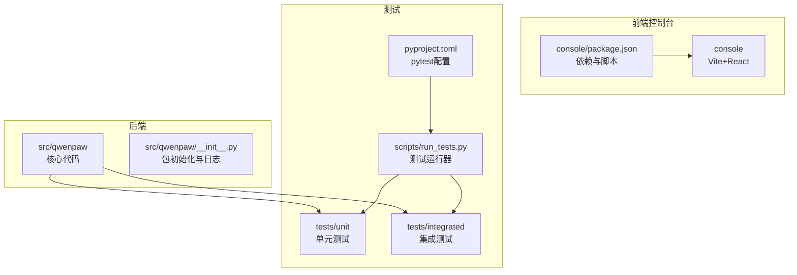
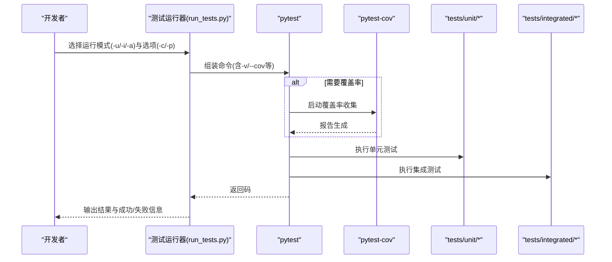
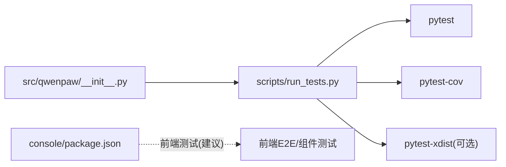

# 测试策略

<cite>
**本文引用的文件**
- [scripts/run_tests.py](file://scripts/run_tests.py)
- [pyproject.toml](file://pyproject.toml)
- [tests/unit/providers/test_openai_provider.py](file://tests/unit/providers/test_openai_provider.py)
- [tests/unit/workspace/test_workspace.py](file://tests/unit/workspace/test_workspace.py)
- [tests/unit/utils/test_command_runner.py](file://tests/unit/utils/test_command_runner.py)
- [tests/unit/security/test_secret_store.py](file://tests/unit/security/test_secret_store.py)
- [tests/unit/local_models/test_model_manager.py](file://tests/unit/local_models/test_model_manager.py)
- [tests/integrated/test_app_startup.py](file://tests/integrated/test_app_startup.py)
- [src/qwenpaw/__init__.py](file://src/qwenpaw/__init__.py)
- [console/package.json](file://console/package.json)
- [CONTRIBUTING.md](file://CONTRIBUTING.md)
</cite>

## 目录
1. [简介](#简介)
2. [项目结构](#项目结构)
3. [核心组件](#核心组件)
4. [架构总览](#架构总览)
5. [详细组件分析](#详细组件分析)
6. [依赖关系分析](#依赖关系分析)
7. [性能考虑](#性能考虑)
8. [故障排查指南](#故障排查指南)
9. [结论](#结论)
10. [附录](#附录)

## 简介
本测试策略文档面向QwenPaw项目，系统化阐述测试架构、测试类型与覆盖范围，明确单元测试、集成测试与端到端测试的组织方式；给出测试框架配置、测试数据准备与Mock策略；提供测试用例编写指南、断言模式与工具使用建议；并覆盖持续集成中的测试执行、覆盖率报告与性能测试要点；解释测试环境搭建、数据库与API测试方法；最后总结测试调试技巧、故障排查与维护最佳实践。

## 项目结构
QwenPaw采用“Python后端 + 前端控制台 + 测试脚本”的分层结构：
- 后端核心位于src/qwenpaw，包含应用、通道、技能、模型提供方、本地模型管理等模块
- 前端控制台位于console，使用Vite+React构建
- 测试位于tests目录，分为unit（单元）与integrated（集成）
- 自定义测试运行器位于scripts/run_tests.py，支持pytest、覆盖率与并行执行

图表来源
- [src/qwenpaw/__init__.py:1-33](file://src/qwenpaw/__init__.py#L1-L33)
- [console/package.json:1-62](file://console/package.json#L1-L62)
- [pyproject.toml:105-111](file://pyproject.toml#L105-L111)
- [scripts/run_tests.py:1-282](file://scripts/run_tests.py#L1-L282)

章节来源
- [pyproject.toml:105-111](file://pyproject.toml#L105-L111)
- [scripts/run_tests.py:1-282](file://scripts/run_tests.py#L1-L282)

## 核心组件
- 测试运行器：scripts/run_tests.py，封装pytest调用，支持按子目录运行、覆盖率生成、并行执行
- 测试框架：pytest + pytest-asyncio，异步测试自动模式开启
- 覆盖率：pytest-cov，HTML与缺失行报告
- 并行：pytest-xdist（需要安装），通过-n auto启用
- 前端测试：console/package.json中未定义测试脚本，建议在前端目录补充jest或cypress等前端测试方案

章节来源
- [scripts/run_tests.py:148-173](file://scripts/run_tests.py#L148-L173)
- [pyproject.toml:76-82](file://pyproject.toml#L76-L82)
- [console/package.json:6-16](file://console/package.json#L6-L16)

## 架构总览
测试架构围绕“本地测试运行器”统一调度，按类型分层执行，并通过覆盖率与并行提升效率。

图表来源
- [scripts/run_tests.py:148-173](file://scripts/run_tests.py#L148-L173)
- [pyproject.toml:76-82](file://pyproject.toml#L76-L82)

## 详细组件分析

### 单元测试策略与示例
- 分类组织：tests/unit下按功能域划分子目录（如providers、workspace、utils、security、local_models）
- 异步测试：pytest-asyncio自动模式，测试函数标注pytest.mark.asyncio或使用async def
- Mock策略：广泛使用pytest monkeypatch对对象属性/模块常量进行替换，避免真实外部依赖
- 断言模式：针对返回值、副作用、异常、状态变更等进行断言
- 数据准备：使用临时目录与路径对象，确保隔离性与可重复性

示例文件与要点
- 提供商连接与模型列表测试：验证连接检查、错误处理、模型规范化与去重
  - 参考：[tests/unit/providers/test_openai_provider.py:21-95](file://tests/unit/providers/test_openai_provider.py#L21-L95)
- 工作区生命周期与状态断言：创建、组件初始为空、短ID与默认ID行为、repr
  - 参考：[tests/unit/workspace/test_workspace.py:8-97](file://tests/unit/workspace/test_workspace.py#L8-L97)
- 命令执行与进程管理：同步/异步命令执行、进程启动/关闭、跨平台差异、信号处理
  - 参考：[tests/unit/utils/test_command_runner.py:26-600](file://tests/unit/utils/test_command_runner.py#L26-L600)
- 密钥存储与字典字段加解密：明文/密文兼容、字段白名单、主密钥生成与持久化
  - 参考：[tests/unit/security/test_secret_store.py:36-176](file://tests/unit/security/test_secret_store.py#L36-L176)
- 本地模型下载管理：下载源解析、进度与校验、临时目录与最终目录迁移
  - 参考：[tests/unit/local_models/test_model_manager.py:49-414](file://tests/unit/local_models/test_model_manager.py#L49-L414)

章节来源
- [tests/unit/providers/test_openai_provider.py:21-95](file://tests/unit/providers/test_openai_provider.py#L21-L95)
- [tests/unit/workspace/test_workspace.py:8-97](file://tests/unit/workspace/test_workspace.py#L8-L97)
- [tests/unit/utils/test_command_runner.py:26-600](file://tests/unit/utils/test_command_runner.py#L26-L600)
- [tests/unit/security/test_secret_store.py:36-176](file://tests/unit/security/test_secret_store.py#L36-L176)
- [tests/unit/local_models/test_model_manager.py:49-414](file://tests/unit/local_models/test_model_manager.py#L49-L414)

### 集成测试策略与示例
- 典型场景：后端启动、控制台页面可用性、版本接口返回
- 方法：子进程启动后端，轮询健康检查，HTTP客户端访问API与静态页面，断言响应状态与内容类型
- 关键点：端口自发现、超时与错误聚合、日志截取与回显、进程优雅终止

参考文件
- [tests/integrated/test_app_startup.py:33-133](file://tests/integrated/test_app_startup.py#L33-L133)

章节来源
- [tests/integrated/test_app_startup.py:33-133](file://tests/integrated/test_app_startup.py#L33-L133)

### 端到端测试建议
- 建议引入前端E2E测试（如Cypress或Playwright），覆盖登录、会话、频道与技能交互
- 建议引入API端到端测试，结合后端启动与数据库状态清理，验证完整业务闭环
- 建议在CI中增加慢测试标记与隔离执行，避免阻塞主流程

[本节为概念性建议，不直接分析具体文件，故无章节来源]

## 依赖关系分析
- 测试运行器依赖pytest、pytest-asyncio、pytest-cov、pytest-xdist（可选）
- 包初始化加载日志与环境变量，影响测试期间的日志级别与环境一致性
- 前端控制台依赖于Vite与React生态，测试需独立于后端测试执行

图表来源
- [scripts/run_tests.py:63-74](file://scripts/run_tests.py#L63-L74)
- [pyproject.toml:76-82](file://pyproject.toml#L76-L82)
- [src/qwenpaw/__init__.py:1-33](file://src/qwenpaw/__init__.py#L1-L33)
- [console/package.json:1-62](file://console/package.json#L1-L62)

章节来源
- [scripts/run_tests.py:63-74](file://scripts/run_tests.py#L63-L74)
- [pyproject.toml:76-82](file://pyproject.toml#L76-L82)
- [src/qwenpaw/__init__.py:1-33](file://src/qwenpaw/__init__.py#L1-L33)
- [console/package.json:1-62](file://console/package.json#L1-L62)

## 性能考虑
- 并行执行：使用pytest-xdist的-n auto参数加速多核机器上的测试并行
- 慢测试隔离：通过标记（如slow）在CI中选择性跳过，缩短主分支反馈周期
- 覆盖率阈值：可在CI中设置覆盖率门禁，保证关键路径被覆盖
- 前端测试：建议仅在必要时运行，避免拖慢整体流水线

[本节提供通用指导，不直接分析具体文件，故无章节来源]

## 故障排查指南
- 依赖缺失：测试运行器检测pytest存在性，不存在时提示安装开发依赖
- 日志与输出：集成测试会截取后端子进程输出，便于定位启动失败原因
- Mock失效：确认monkeypatch作用域与对象替换是否正确，避免真实外部调用
- 超时与资源泄露：集成测试对进程进行优雅终止，若失败需检查资源释放逻辑
- 前端测试缺失：console/package.json未定义测试脚本，建议补充前端测试方案

章节来源
- [scripts/run_tests.py:63-74](file://scripts/run_tests.py#L63-L74)
- [tests/integrated/test_app_startup.py:33-133](file://tests/integrated/test_app_startup.py#L33-L133)
- [console/package.json:6-16](file://console/package.json#L6-L16)

## 结论
QwenPaw当前以pytest为核心，配合自定义测试运行器实现单元与集成测试的高效执行，并具备覆盖率与并行能力。建议在后续完善前端E2E与API端到端测试，强化慢测试隔离与覆盖率门禁，以进一步提升质量保障与交付效率。

[本节为总结性内容，不直接分析具体文件，故无章节来源]

## 附录

### 测试类型与覆盖范围
- 单元测试：覆盖核心模块（提供方、工作区、命令执行、安全存储、本地模型管理）
- 集成测试：覆盖后端启动、控制台页面、版本接口
- 端到端测试：建议覆盖用户登录、聊天、频道与技能全流程

章节来源
- [tests/unit/providers/test_openai_provider.py:21-95](file://tests/unit/providers/test_openai_provider.py#L21-L95)
- [tests/unit/workspace/test_workspace.py:8-97](file://tests/unit/workspace/test_workspace.py#L8-L97)
- [tests/unit/utils/test_command_runner.py:26-600](file://tests/unit/utils/test_command_runner.py#L26-L600)
- [tests/unit/security/test_secret_store.py:36-176](file://tests/unit/security/test_secret_store.py#L36-L176)
- [tests/unit/local_models/test_model_manager.py:49-414](file://tests/unit/local_models/test_model_manager.py#L49-L414)
- [tests/integrated/test_app_startup.py:33-133](file://tests/integrated/test_app_startup.py#L33-L133)

### 测试框架配置
- 异步模式：pytest-asyncio自动模式
- 标记：slow用于慢测试
- 开发依赖：pytest、pytest-asyncio、pytest-cov、pytest-xdist

章节来源
- [pyproject.toml:105-111](file://pyproject.toml#L105-L111)
- [pyproject.toml:76-82](file://pyproject.toml#L76-L82)

### 测试数据准备与Mock策略
- 临时目录：使用tempfile与Path，确保隔离
- Mock：使用monkeypatch替换属性/模块常量，避免真实网络/文件系统调用
- 字典字段加密：使用固定主密钥与隔离密钥目录，模拟密文/明文混合场景

章节来源
- [tests/unit/workspace/test_workspace.py:13-23](file://tests/unit/workspace/test_workspace.py#L13-L23)
- [tests/unit/providers/test_openai_provider.py:31-37](file://tests/unit/providers/test_openai_provider.py#L31-L37)
- [tests/unit/security/test_secret_store.py:22-34](file://tests/unit/security/test_secret_store.py#L22-L34)

### 测试用例编写指南
- 命名规范：清晰描述被测行为与输入/期望输出
- 断言模式：返回值、异常、状态、副作用、边界条件
- 异步测试：使用pytest.mark.asyncio或async def
- 资源清理：使用临时目录与上下文管理，避免全局污染

章节来源
- [tests/unit/utils/test_command_runner.py:26-600](file://tests/unit/utils/test_command_runner.py#L26-L600)
- [tests/unit/security/test_secret_store.py:36-176](file://tests/unit/security/test_secret_store.py#L36-L176)

### 测试工具使用
- 运行器：python scripts/run_tests.py [-u/-i/-a] [-c] [-p]
- 覆盖率：--cov=src/qwenpaw，生成HTML与缺失行报告
- 并行：-n auto（需安装pytest-xdist）

章节来源
- [scripts/run_tests.py:175-282](file://scripts/run_tests.py#L175-L282)
- [scripts/run_tests.py:148-173](file://scripts/run_tests.py#L148-L173)

### 持续集成中的测试执行
- 本地门禁：pre-commit + pytest
- CI建议：分阶段执行（单元/集成/端到端），慢测试可单独矩阵
- 覆盖率报告：在CI中生成并上传报告

章节来源
- [CONTRIBUTING.md:70-86](file://CONTRIBUTING.md#L70-L86)

### 测试环境搭建
- 安装开发依赖：pip install -e ".[dev,full]"
- 前端格式化：cd console && npm run format

章节来源
- [CONTRIBUTING.md:70-86](file://CONTRIBUTING.md#L70-L86)

### 数据库测试与API测试方法
- 数据库：建议在测试前/后清理或使用内存数据库/临时目录
- API测试：结合集成测试的HTTP客户端模式，验证响应状态、头与主体

章节来源
- [tests/integrated/test_app_startup.py:73-122](file://tests/integrated/test_app_startup.py#L73-L122)

### 测试调试技巧与维护最佳实践
- 使用pytest -v与详细日志
- 将慢测试标记为slow并在CI中排除
- 前端测试与后端测试分离执行，避免相互干扰
- 保持Mock稳定，避免频繁变动导致测试脆弱

章节来源
- [pyproject.toml:108-110](file://pyproject.toml#L108-L110)
- [CONTRIBUTING.md:70-86](file://CONTRIBUTING.md#L70-L86)