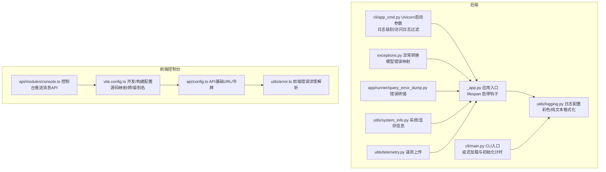
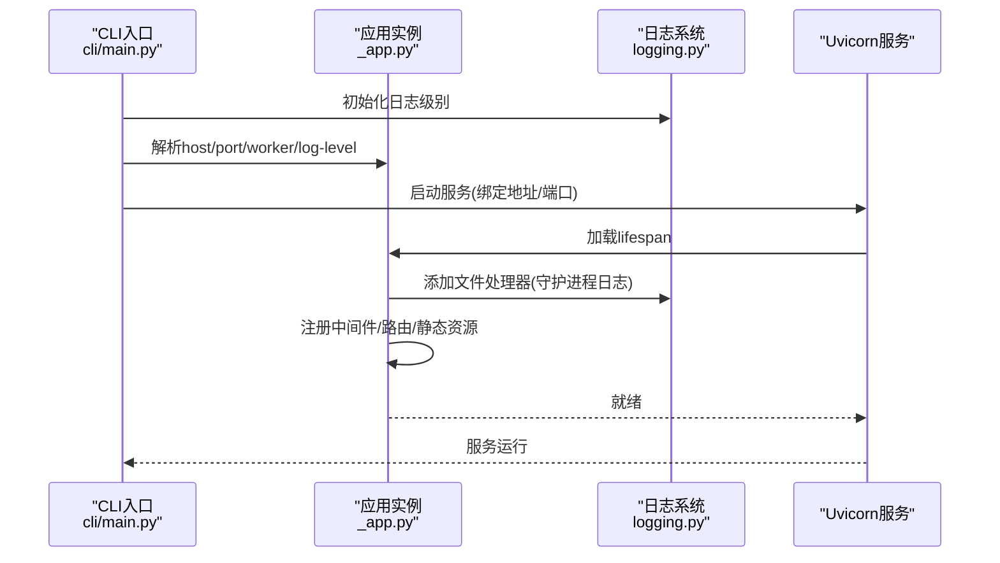
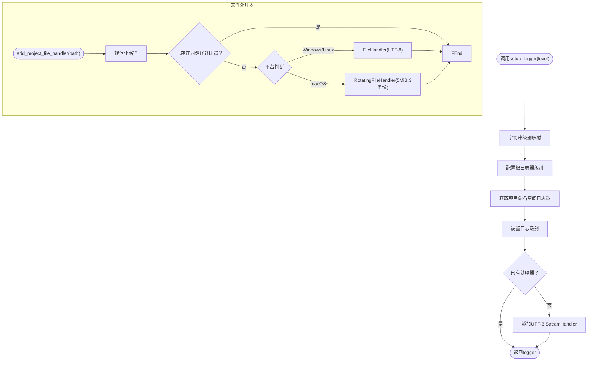
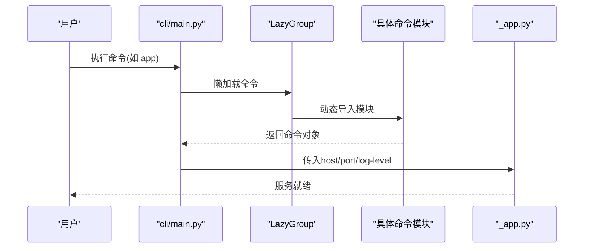
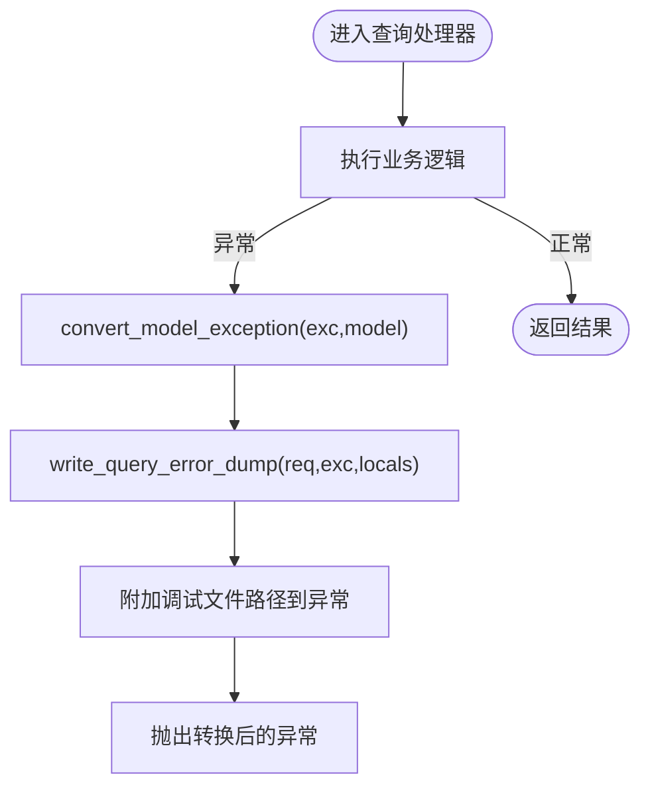
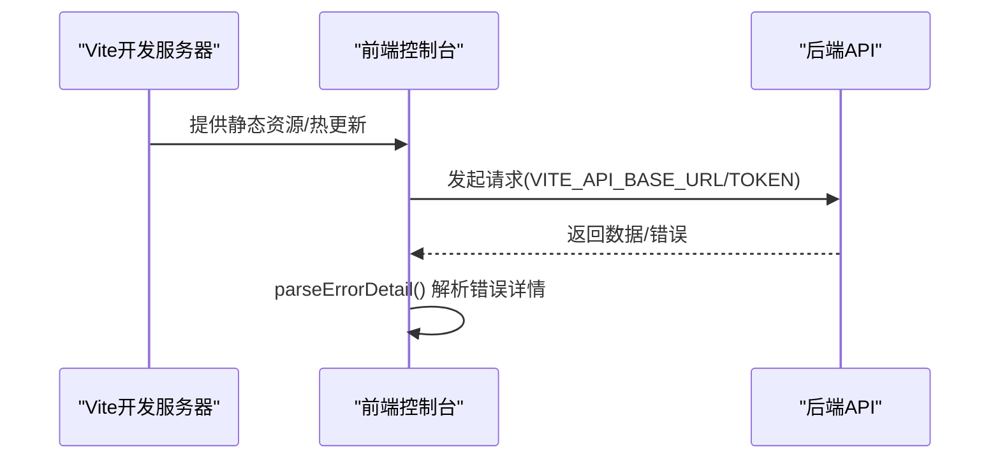
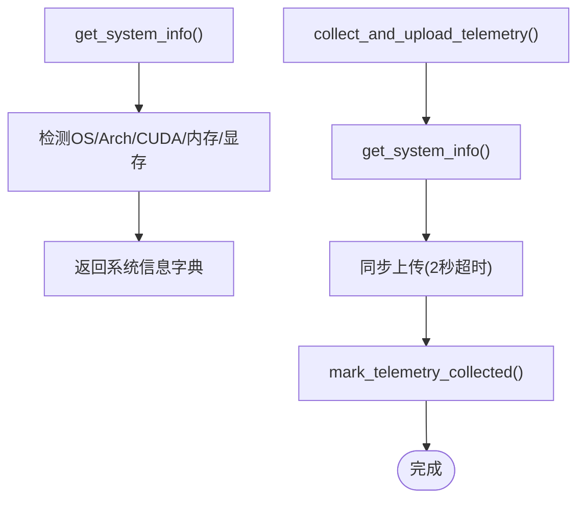
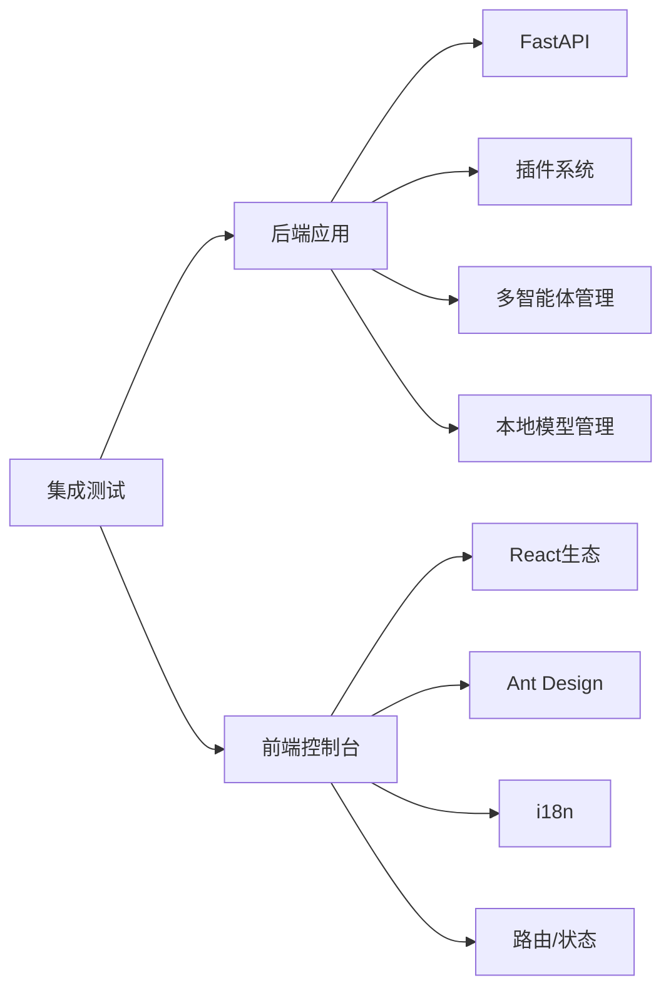

# 调试与性能分析

<cite>
**本文引用的文件**
- [src/qwenpaw/utils/logging.py](file://src/qwenpaw/utils/logging.py)
- [src/qwenpaw/app/_app.py](file://src/qwenpaw/app/_app.py)
- [src/qwenpaw/cli/main.py](file://src/qwenpaw/cli/main.py)
- [src/qwenpaw/cli/app_cmd.py](file://src/qwenpaw/cli/app_cmd.py)
- [src/qwenpaw/exceptions.py](file://src/qwenpaw/exceptions.py)
- [src/qwenpaw/app/runner/query_error_dump.py](file://src/qwenpaw/app/runner/query_error_dump.py)
- [src/qwenpaw/app/runner/runner.py](file://src/qwenpaw/app/runner/runner.py)
- [src/qwenpaw/utils/system_info.py](file://src/qwenpaw/utils/system_info.py)
- [src/qwenpaw/utils/telemetry.py](file://src/qwenpaw/utils/telemetry.py)
- [src/qwenpaw/app/utils.py](file://src/qwenpaw/app/utils.py)
- [console/src/api/config.ts](file://console/src/api/config.ts)
- [console/src/utils/error.ts](file://console/src/utils/error.ts)
- [console/src/api/modules/console.ts](file://console/src/api/modules/console.ts)
- [console/vite.config.ts](file://console/vite.config.ts)
- [tests/integrated/test_app_startup.py](file://tests/integrated/test_app_startup.py)
</cite>

## 目录
1. [简介](#简介)
2. [项目结构](#项目结构)
3. [核心组件](#核心组件)
4. [架构总览](#架构总览)
5. [详细组件分析](#详细组件分析)
6. [依赖分析](#依赖分析)
7. [性能考虑](#性能考虑)
8. [故障排查指南](#故障排查指南)
9. [结论](#结论)
10. [附录](#附录)

## 简介
本指南面向QwenPaw项目的开发者与运维人员，系统性地介绍调试与性能分析的方法论与实操要点。内容覆盖：
- 日志体系与级别、文件落盘、访问日志过滤
- Python后端调试（CLI、Uvicorn、异常转换与错误转储）
- 前端调试（Vite开发服务器、API代理与跨域、错误解析）
- 性能分析（CPU/内存/GPU检测、模型并发与限流、启动耗时）
- 错误追踪（异常类型映射、错误转储文件、会话状态快照）
- 生产调试与远程调试（日志与遥测、守护进程日志、访问日志抑制）
- 最佳实践与监控告警建议

## 项目结构
QwenPaw采用“Python后端 + React前端控制台”的双层架构。后端通过FastAPI提供REST接口与流式任务能力；前端控制台通过Vite开发与构建，支持源码映射与热更新。

**图表来源**
- [src/qwenpaw/app/_app.py:166-429](file://src/qwenpaw/app/_app.py#L166-L429)
- [src/qwenpaw/cli/main.py:58-93](file://src/qwenpaw/cli/main.py#L58-L93)
- [src/qwenpaw/cli/app_cmd.py:55-67](file://src/qwenpaw/cli/app_cmd.py#L55-L67)
- [src/qwenpaw/utils/logging.py:121-157](file://src/qwenpaw/utils/logging.py#L121-L157)
- [src/qwenpaw/exceptions.py:165-254](file://src/qwenpaw/exceptions.py#L165-L254)
- [src/qwenpaw/app/runner/query_error_dump.py:48-90](file://src/qwenpaw/app/runner/query_error_dump.py#L48-L90)
- [src/qwenpaw/utils/system_info.py:111-120](file://src/qwenpaw/utils/system_info.py#L111-L120)
- [src/qwenpaw/utils/telemetry.py:286-305](file://src/qwenpaw/utils/telemetry.py#L286-L305)
- [console/vite.config.ts:1-60](file://console/vite.config.ts#L1-L60)
- [console/src/api/config.ts:1-42](file://console/src/api/config.ts#L1-L42)
- [console/src/utils/error.ts:1-12](file://console/src/utils/error.ts#L1-L12)
- [console/src/api/modules/console.ts:1-11](file://console/src/api/modules/console.ts#L1-L11)

**章节来源**
- [src/qwenpaw/app/_app.py:166-429](file://src/qwenpaw/app/_app.py#L166-L429)
- [src/qwenpaw/cli/main.py:58-93](file://src/qwenpaw/cli/main.py#L58-L93)
- [console/vite.config.ts:1-60](file://console/vite.config.ts#L1-L60)

## 核心组件
- 日志系统：统一命名空间、彩色终端输出、文件处理器、访问日志过滤器
- CLI与启动：延迟加载命令、初始化耗时记录、Uvicorn启动参数
- 异常与错误转储：模型错误分类映射、统一异常类型、查询错误转储文件
- 前端控制台：Vite开发/构建、API代理与跨域、错误详情解析
- 系统信息与遥测：系统/显存检测、安装方式识别、遥测上报

**章节来源**
- [src/qwenpaw/utils/logging.py:121-202](file://src/qwenpaw/utils/logging.py#L121-L202)
- [src/qwenpaw/cli/main.py:52-56](file://src/qwenpaw/cli/main.py#L52-L56)
- [src/qwenpaw/cli/app_cmd.py:55-67](file://src/qwenpaw/cli/app_cmd.py#L55-L67)
- [src/qwenpaw/exceptions.py:165-254](file://src/qwenpaw/exceptions.py#L165-L254)
- [src/qwenpaw/app/runner/query_error_dump.py:48-90](file://src/qwenpaw/app/runner/query_error_dump.py#L48-L90)
- [console/src/api/config.ts:1-42](file://console/src/api/config.ts#L1-L42)
- [console/src/utils/error.ts:1-12](file://console/src/utils/error.ts#L1-L12)
- [src/qwenpaw/utils/system_info.py:111-120](file://src/qwenpaw/utils/system_info.py#L111-L120)
- [src/qwenpaw/utils/telemetry.py:286-305](file://src/qwenpaw/utils/telemetry.py#L286-L305)

## 架构总览
后端应用在lifespan中完成多智能体管理、插件系统、本地模型服务等初始化，并在应用启动完成后注册路由与静态资源。CLI负责解析启动参数与日志级别，Uvicorn承载HTTP服务。

**图表来源**
- [src/qwenpaw/cli/main.py:155-171](file://src/qwenpaw/cli/main.py#L155-L171)
- [src/qwenpaw/cli/app_cmd.py:55-67](file://src/qwenpaw/cli/app_cmd.py#L55-L67)
- [src/qwenpaw/app/_app.py:166-429](file://src/qwenpaw/app/_app.py#L166-L429)
- [src/qwenpaw/utils/logging.py:160-202](file://src/qwenpaw/utils/logging.py#L160-L202)

**章节来源**
- [src/qwenpaw/app/_app.py:166-429](file://src/qwenpaw/app/_app.py#L166-L429)
- [src/qwenpaw/cli/app_cmd.py:55-67](file://src/qwenpaw/cli/app_cmd.py#L55-L67)

## 详细组件分析

### 日志系统与访问日志过滤
- 统一日志命名空间：仅输出项目包内日志，避免第三方库噪声
- 彩色/纯文本格式化：终端自动检测TTY，非TTY时禁用颜色
- 文件处理器：按平台选择FileHandler或RotatingFileHandler，避免锁冲突
- 访问日志过滤：可按路径子串抑制uvicorn访问日志，降低噪音

**图表来源**
- [src/qwenpaw/utils/logging.py:121-157](file://src/qwenpaw/utils/logging.py#L121-L157)
- [src/qwenpaw/utils/logging.py:160-202](file://src/qwenpaw/utils/logging.py#L160-L202)

**章节来源**
- [src/qwenpaw/utils/logging.py:121-202](file://src/qwenpaw/utils/logging.py#L121-L202)

### CLI与启动流程
- CLI延迟加载：通过LazyGroup延迟导入子命令，减少冷启动时间
- 初始化计时：记录各模块导入耗时，便于定位启动慢点
- Uvicorn启动参数：支持host/port/reload/log-level，以及访问日志路径过滤

**图表来源**
- [src/qwenpaw/cli/main.py:58-93](file://src/qwenpaw/cli/main.py#L58-L93)
- [src/qwenpaw/cli/app_cmd.py:55-67](file://src/qwenpaw/cli/app_cmd.py#L55-L67)

**章节来源**
- [src/qwenpaw/cli/main.py:52-56](file://src/qwenpaw/cli/main.py#L52-L56)
- [src/qwenpaw/cli/main.py:80-91](file://src/qwenpaw/cli/main.py#L80-L91)
- [src/qwenpaw/cli/app_cmd.py:55-67](file://src/qwenpaw/cli/app_cmd.py#L55-L67)

### 异常转换与错误转储
- 模型错误映射：根据状态码与关键词将底层异常转换为统一的运行时异常
- 查询错误转储：捕获异常、序列化请求/会话状态、写入临时JSON文件，便于离线分析

**图表来源**
- [src/qwenpaw/exceptions.py:165-254](file://src/qwenpaw/exceptions.py#L165-L254)
- [src/qwenpaw/app/runner/query_error_dump.py:48-90](file://src/qwenpaw/app/runner/query_error_dump.py#L48-L90)
- [src/qwenpaw/app/runner/runner.py:559-594](file://src/qwenpaw/app/runner/runner.py#L559-L594)

**章节来源**
- [src/qwenpaw/exceptions.py:165-254](file://src/qwenpaw/exceptions.py#L165-L254)
- [src/qwenpaw/app/runner/query_error_dump.py:48-90](file://src/qwenpaw/app/runner/query_error_dump.py#L48-L90)
- [src/qwenpaw/app/runner/runner.py:559-594](file://src/qwenpaw/app/runner/runner.py#L559-L594)

### 前端调试与网络调试
- Vite开发服务器：支持host/port、源码映射、React插件、CSS Modules与Less
- API代理与跨域：通过Vite环境变量注入API基础URL与令牌，支持同源或反向代理
- 错误详情解析：从错误消息中提取JSON化的detail字段，辅助前端展示

**图表来源**
- [console/vite.config.ts:1-60](file://console/vite.config.ts#L1-L60)
- [console/src/api/config.ts:1-42](file://console/src/api/config.ts#L1-L42)
- [console/src/utils/error.ts:1-12](file://console/src/utils/error.ts#L1-L12)

**章节来源**
- [console/vite.config.ts:1-60](file://console/vite.config.ts#L1-L60)
- [console/src/api/config.ts:1-42](file://console/src/api/config.ts#L1-L42)
- [console/src/utils/error.ts:1-12](file://console/src/utils/error.ts#L1-L12)

### 系统信息与遥测
- 系统信息：检测操作系统、架构、CUDA版本、内存与显存大小
- 遥测上传：匿名收集安装方式、版本、硬件信息，失败静默不阻断

**图表来源**
- [src/qwenpaw/utils/system_info.py:111-120](file://src/qwenpaw/utils/system_info.py#L111-L120)
- [src/qwenpaw/utils/telemetry.py:286-305](file://src/qwenpaw/utils/telemetry.py#L286-L305)

**章节来源**
- [src/qwenpaw/utils/system_info.py:111-120](file://src/qwenpaw/utils/system_info.py#L111-L120)
- [src/qwenpaw/utils/telemetry.py:286-305](file://src/qwenpaw/utils/telemetry.py#L286-L305)

## 依赖分析
- 后端依赖：FastAPI、Uvicorn、插件系统、多智能体管理、本地模型管理
- 前端依赖：React、Ant Design、i18n、路由、状态管理、Markdown渲染
- 调试与测试：集成测试验证后端可用性与控制台可达性

**图表来源**
- [src/qwenpaw/app/_app.py:238-284](file://src/qwenpaw/app/_app.py#L238-L284)
- [console/package.json:18-61](file://console/package.json#L18-L61)
- [tests/integrated/test_app_startup.py:86-114](file://tests/integrated/test_app_startup.py#L86-L114)

**章节来源**
- [src/qwenpaw/app/_app.py:238-284](file://src/qwenpaw/app/_app.py#L238-L284)
- [console/package.json:18-61](file://console/package.json#L18-L61)
- [tests/integrated/test_app_startup.py:86-114](file://tests/integrated/test_app_startup.py#L86-L114)

## 性能考虑
- 并发与限流：全局最大并发、每分钟查询数限制、指数退避与抖动
- 上下文压缩：基于token比例的上下文压缩阈值与保留比例
- 工具结果压缩：近期/旧有消息的字节阈值与保留天数
- 启动耗时：CLI记录模块导入耗时，定位启动慢点
- 系统资源：检测内存与显存，辅助选择合适的模型与批处理策略

**章节来源**
- [src/qwenpaw/config/config.py:471-624](file://src/qwenpaw/config/config.py#L471-L624)
- [src/qwenpaw/cli/main.py:52-56](file://src/qwenpaw/cli/main.py#L52-L56)
- [src/qwenpaw/utils/system_info.py:73-108](file://src/qwenpaw/utils/system_info.py#L73-L108)

## 故障排查指南

### 日志级别与访问日志过滤
- 设置日志级别：通过CLI选项或环境变量调整后端日志级别
- 抑制访问日志：对特定路径（如控制台推送）进行过滤，减少噪音
- 守护进程日志：启用文件处理器，确保后台运行时可持久化日志

**章节来源**
- [src/qwenpaw/cli/app_cmd.py:30-46](file://src/qwenpaw/cli/app_cmd.py#L30-L46)
- [src/qwenpaw/utils/logging.py:121-157](file://src/qwenpaw/utils/logging.py#L121-L157)
- [src/qwenpaw/utils/logging.py:160-202](file://src/qwenpaw/utils/logging.py#L160-L202)

### Python调试器与异常追踪
- 使用Python调试器：在异常发生处打断点，结合错误转储文件定位上下文
- 异常转换：将底层模型错误映射为统一异常类型，便于前端与后端一致处理
- 错误转储：捕获异常、请求与会话状态，生成临时JSON文件，包含时间戳与原始错误信息

**章节来源**
- [src/qwenpaw/exceptions.py:165-254](file://src/qwenpaw/exceptions.py#L165-L254)
- [src/qwenpaw/app/runner/query_error_dump.py:48-90](file://src/qwenpaw/app/runner/query_error_dump.py#L48-L90)
- [src/qwenpaw/app/runner/runner.py:559-594](file://src/qwenpaw/app/runner/runner.py#L559-L594)

### 前端调试与网络问题
- Vite开发：开启源码映射，利用浏览器断点与网络面板检查请求/响应
- 跨域与代理：确认VITE_API_BASE_URL与后端CORS配置一致
- 错误详情：使用parseErrorDetail解析后端返回的JSON化错误详情

**章节来源**
- [console/vite.config.ts:1-60](file://console/vite.config.ts#L1-L60)
- [console/src/api/config.ts:1-42](file://console/src/api/config.ts#L1-L42)
- [console/src/utils/error.ts:1-12](file://console/src/utils/error.ts#L1-L12)

### 性能瓶颈识别
- 启动阶段：查看CLI初始化计时，定位耗时模块
- 运行阶段：观察日志中慢查询、重试与退避行为，结合并发与限流配置评估
- 资源使用：通过系统信息检测内存与显存，评估是否受限于硬件

**章节来源**
- [src/qwenpaw/cli/main.py:52-56](file://src/qwenpaw/cli/main.py#L52-L56)
- [src/qwenpaw/utils/system_info.py:73-108](file://src/qwenpaw/utils/system_info.py#L73-L108)

### 生产环境调试与远程调试
- 日志与守护进程：启用文件处理器，定期轮转，保留关键日志以便远程分析
- 遥测与诊断：收集系统信息与版本，上传遥测（失败静默），便于统计与回溯
- 分布式追踪：建议在网关/反向代理层引入TraceID透传，配合后端结构化日志实现端到端追踪

**章节来源**
- [src/qwenpaw/utils/logging.py:160-202](file://src/qwenpaw/utils/logging.py#L160-L202)
- [src/qwenpaw/utils/telemetry.py:286-305](file://src/qwenpaw/utils/telemetry.py#L286-L305)

### 常见问题与诊断
- 控制台不可用：检查静态资源目录解析与SPA回退路由
- 启动超时：集成测试展示了等待后端就绪与校验控制台HTML的流程
- 插件启动/关闭钩子失败：查看日志中“执行/失败”记录，定位具体插件

**章节来源**
- [src/qwenpaw/app/_app.py:484-568](file://src/qwenpaw/app/_app.py#L484-L568)
- [tests/integrated/test_app_startup.py:86-114](file://tests/integrated/test_app_startup.py#L86-L114)

## 结论
通过统一的日志体系、完善的异常转换与错误转储、前后端协同的调试工具链，以及系统信息与遥测的支持，QwenPaw能够在开发、测试与生产环境中高效定位问题并持续优化性能。建议在生产中结合访问日志过滤、守护进程日志与遥测，形成闭环的可观测性方案。

## 附录

### 调试最佳实践清单
- 后端
  - 使用CLI选项设置合适日志级别，必要时启用文件处理器
  - 对高频访问路径启用访问日志过滤，降低噪音
  - 在异常路径调用错误转储，保留会话状态与请求上下文
- 前端
  - 开启源码映射，使用浏览器断点与网络面板
  - 统一解析错误详情，提升排障效率
- 性能
  - 关注启动耗时与模块导入时间
  - 结合并发与限流配置，评估上下文压缩与工具结果压缩效果
  - 监控内存与显存占用，合理选择模型与批处理

### 监控告警建议
- 日志级别：Critical/Error占比异常升高触发告警
- 启动耗时：超过阈值的启动时间报警
- 错误率：模型相关错误（429/401/超时/上下文过长）占比上升
- 资源：内存/显存使用接近上限时预警